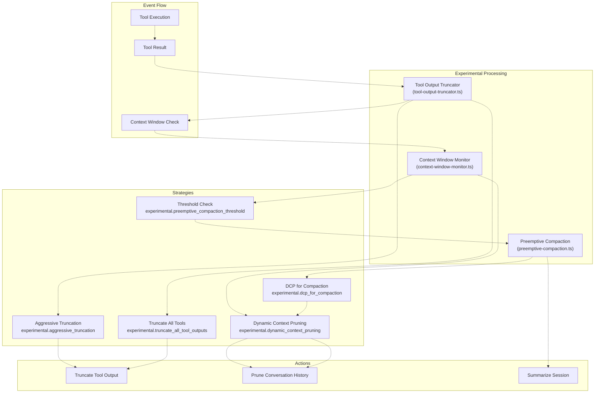
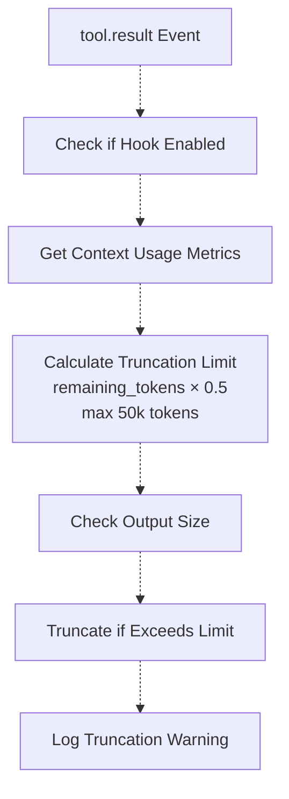
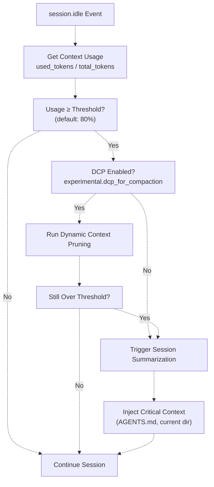
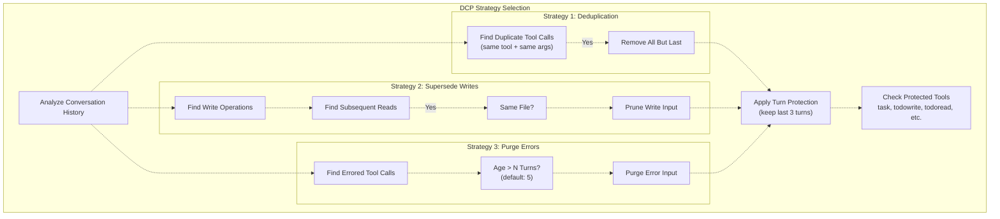
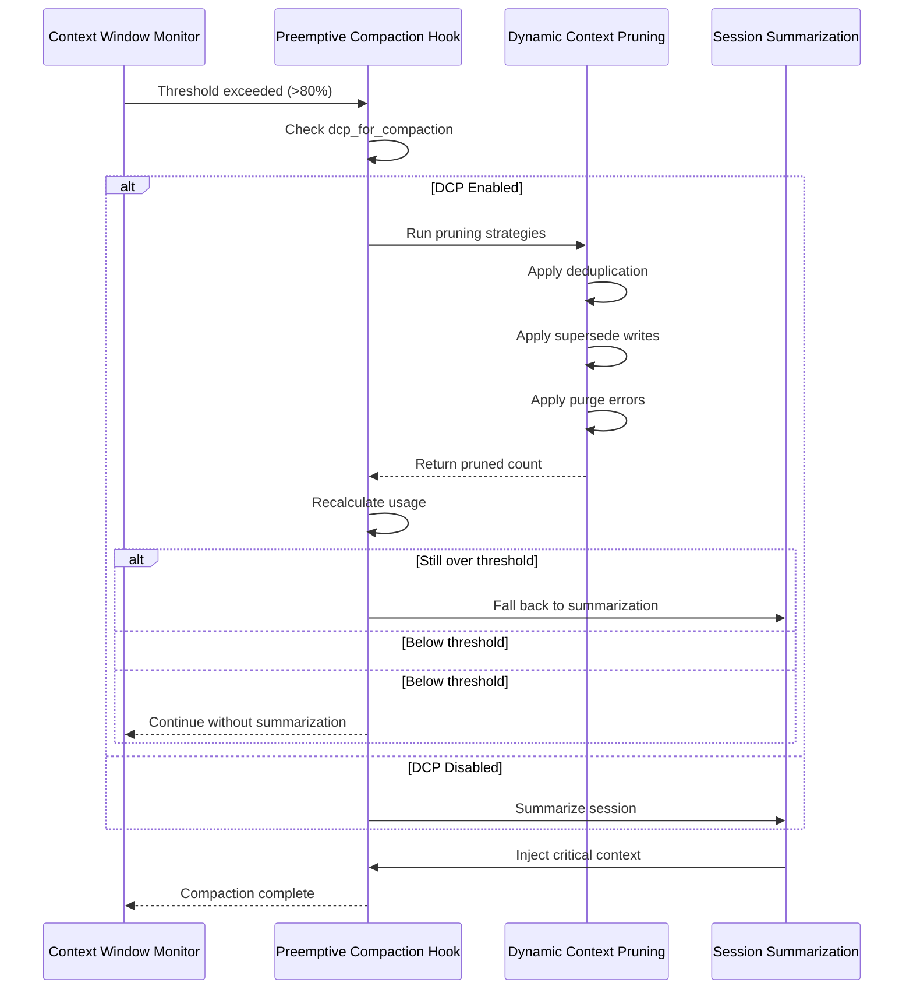
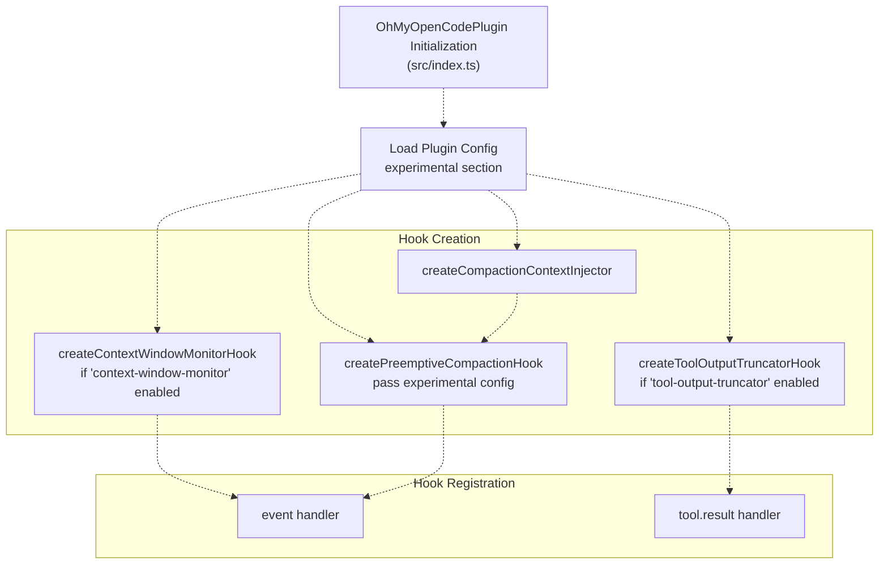

# Experimental Features

> **Relevant source files**
> * [README.ja.md](https://github.com/code-yeongyu/oh-my-opencode/blob/b92cd6ab/README.ja.md)
> * [README.ko.md](https://github.com/code-yeongyu/oh-my-opencode/blob/b92cd6ab/README.ko.md)
> * [README.md](https://github.com/code-yeongyu/oh-my-opencode/blob/b92cd6ab/README.md)
> * [README.zh-cn.md](https://github.com/code-yeongyu/oh-my-opencode/blob/b92cd6ab/README.zh-cn.md)
> * [assets/oh-my-opencode.schema.json](https://github.com/code-yeongyu/oh-my-opencode/blob/b92cd6ab/assets/oh-my-opencode.schema.json)
> * [src/config/schema.ts](https://github.com/code-yeongyu/oh-my-opencode/blob/b92cd6ab/src/config/schema.ts)
> * [src/hooks/index.ts](https://github.com/code-yeongyu/oh-my-opencode/blob/b92cd6ab/src/hooks/index.ts)
> * [src/index.ts](https://github.com/code-yeongyu/oh-my-opencode/blob/b92cd6ab/src/index.ts)
> * [src/shared/config-path.ts](https://github.com/code-yeongyu/oh-my-opencode/blob/b92cd6ab/src/shared/config-path.ts)

This page documents advanced context management and optimization features that are under active development. These features provide fine-grained control over token usage, context window management, and session compaction strategies. While stable enough for production use, their behavior and configuration options may change in future releases based on user feedback and performance data.

For standard reliability features like session recovery and context monitoring, see [Reliability System](../reliability/). For MCP integration and external service connections, see [MCP Integration](/code-yeongyu/oh-my-opencode/8-mcp-integration).

---

## Configuration Location

Experimental features are configured in the `experimental` section of `oh-my-opencode.json`:

```json
{
  "experimental": {
    "aggressive_truncation": false,
    "preemptive_compaction": true,
    "preemptive_compaction_threshold": 0.80,
    "truncate_all_tool_outputs": true,
    "dcp_for_compaction": false,
    "dynamic_context_pruning": {
      "enabled": false,
      "notification": "detailed",
      "turn_protection": {
        "enabled": true,
        "turns": 3
      },
      "protected_tools": ["task", "todowrite", "todoread"],
      "strategies": {
        "deduplication": { "enabled": true },
        "supersede_writes": { "enabled": true, "aggressive": false },
        "purge_errors": { "enabled": true, "turns": 5 }
      }
    }
  }
}
```

**Sources:** [src/config/schema.ts L163-L176](https://github.com/code-yeongyu/oh-my-opencode/blob/b92cd6ab/src/config/schema.ts#L163-L176)

 [README.md L116](https://github.com/code-yeongyu/oh-my-opencode/blob/b92cd6ab/README.md#L116-L116)

---

## Feature Architecture Overview

The experimental features form a layered context management system that intercepts tool outputs, prunes conversation history, and triggers compaction before token limits are reached.



**Sources:** [src/hooks/tool-output-truncator.ts](https://github.com/code-yeongyu/oh-my-opencode/blob/b92cd6ab/src/hooks/tool-output-truncator.ts)

 [src/hooks/preemptive-compaction.ts](https://github.com/code-yeongyu/oh-my-opencode/blob/b92cd6ab/src/hooks/preemptive-compaction.ts)

 [src/hooks/context-window-monitor.ts](https://github.com/code-yeongyu/oh-my-opencode/blob/b92cd6ab/src/hooks/context-window-monitor.ts)

---

## Aggressive Truncation

Aggressive truncation reduces tool output size more aggressively than the default behavior, prioritizing context preservation over output completeness.

### Behavior

When `aggressive_truncation` is enabled, tool outputs are truncated to maintain **50% headroom** in the context window, with a hard cap of **50,000 tokens** per tool output. This is more conservative than the standard truncation strategy.

### Configuration

```json
{
  "experimental": {
    "aggressive_truncation": true,
    "truncate_all_tool_outputs": true
  }
}
```

| Option | Type | Default | Description |
| --- | --- | --- | --- |
| `aggressive_truncation` | boolean | `false` | Enable more aggressive truncation of tool outputs |
| `truncate_all_tool_outputs` | boolean | `true` | Truncate all tool outputs, not just whitelisted tools (grep, glob, LSP, AST-grep) |

### Implementation Details

The truncator hook processes tool results in the `tool.result` event handler:



The truncation logic maintains the beginning and end of the output with an ellipsis separator, preserving critical context clues for the agent.

**Sources:** [src/hooks/tool-output-truncator.ts L30-L120](https://github.com/code-yeongyu/oh-my-opencode/blob/b92cd6ab/src/hooks/tool-output-truncator.ts#L30-L120)

 [src/config/schema.ts L164-L171](https://github.com/code-yeongyu/oh-my-opencode/blob/b92cd6ab/src/config/schema.ts#L164-L171)

---

## Preemptive Compaction

Preemptive compaction triggers session summarization before the hard context limit is reached, preventing API errors and maintaining conversation flow.

### Trigger Mechanism

Compaction is triggered when context usage exceeds the configured threshold percentage:



### Configuration

```json
{
  "experimental": {
    "preemptive_compaction": true,
    "preemptive_compaction_threshold": 0.80
  }
}
```

| Option | Type | Default | Description |
| --- | --- | --- | --- |
| `preemptive_compaction` | boolean | `true` | Enable preemptive compaction before hard limits |
| `preemptive_compaction_threshold` | number | `0.80` | Percentage of context window to trigger compaction (0.5-0.95) |

### Context Preservation

The `CompactionContextInjector` preserves critical information during summarization:

1. **AGENTS.md content** - Agent delegation instructions
2. **Current directory info** - Working directory context
3. **Recent tool outputs** - Last N turns of tool results

**Sources:** [src/hooks/preemptive-compaction.ts L20-L180](https://github.com/code-yeongyu/oh-my-opencode/blob/b92cd6ab/src/hooks/preemptive-compaction.ts#L20-L180)

 [src/hooks/compaction-context-injector.ts L10-L85](https://github.com/code-yeongyu/oh-my-opencode/blob/b92cd6ab/src/hooks/compaction-context-injector.ts#L10-L85)

---

## Dynamic Context Pruning (DCP)

Dynamic Context Pruning intelligently removes redundant or outdated information from the conversation history without full summarization, preserving the semantic flow while reducing token usage.

### Pruning Strategies

DCP implements three pruning strategies that can be enabled independently:



### Configuration

```json
{
  "experimental": {
    "dynamic_context_pruning": {
      "enabled": false,
      "notification": "detailed",
      "turn_protection": {
        "enabled": true,
        "turns": 3
      },
      "protected_tools": [
        "task",
        "todowrite", 
        "todoread",
        "lsp_rename",
        "lsp_code_action_resolve",
        "session_read",
        "session_write",
        "session_search"
      ],
      "strategies": {
        "deduplication": {
          "enabled": true
        },
        "supersede_writes": {
          "enabled": true,
          "aggressive": false
        },
        "purge_errors": {
          "enabled": true,
          "turns": 5
        }
      }
    }
  }
}
```

### Strategy Details

#### 1. Deduplication Strategy

Removes duplicate tool calls where the same tool is invoked with identical arguments. Only the most recent invocation is preserved.

**Example:** If `lsp_goto_definition` is called three times for the same symbol, the first two calls are pruned.

#### 2. Supersede Writes Strategy

Prunes write operation inputs when the file is subsequently read. The rationale: if the file was read later, the agent already has the current state.

**Modes:**

* **Normal mode** (`aggressive: false`): Only prune if the exact same file is read
* **Aggressive mode** (`aggressive: true`): Prune any write if ANY subsequent read occurs (⚠️ may lose context)

#### 3. Purge Errors Strategy

Removes tool call inputs that resulted in errors after a configurable number of turns have passed. The agent has likely moved on from these failed attempts.

**Default:** Purge after 5 turns

### Turn Protection

Turn protection prevents pruning of recent tool outputs to maintain conversation coherence. By default, the last 3 turns are protected from all pruning strategies.

### Protected Tools

Certain tools are never pruned due to their critical role in workflow management:

* `task` - Task delegation tool
* `todowrite` / `todoread` - Todo management
* `lsp_rename` / `lsp_code_action_resolve` - Refactoring operations
* `session_read` / `session_write` / `session_search` - Session management

### Notification Levels

| Level | Behavior |
| --- | --- |
| `off` | Silent pruning, no notifications |
| `minimal` | Toast notification with pruned count |
| `detailed` | Detailed breakdown of pruned items by strategy |

**Sources:** [src/config/schema.ts L127-L161](https://github.com/code-yeongyu/oh-my-opencode/blob/b92cd6ab/src/config/schema.ts#L127-L161)

 [README.md L116](https://github.com/code-yeongyu/oh-my-opencode/blob/b92cd6ab/README.md#L116-L116)

---

## DCP for Compaction

When enabled, DCP runs as the first step during preemptive compaction, potentially avoiding full summarization if sufficient context can be freed.

### Execution Flow



### Configuration

```json
{
  "experimental": {
    "dcp_for_compaction": true,
    "preemptive_compaction": true,
    "preemptive_compaction_threshold": 0.80,
    "dynamic_context_pruning": {
      "enabled": true,
      "strategies": {
        "deduplication": { "enabled": true },
        "supersede_writes": { "enabled": true },
        "purge_errors": { "enabled": true, "turns": 5 }
      }
    }
  }
}
```

### Benefits

* **Avoids summarization overhead** - Pruning is faster than full summarization
* **Preserves conversation flow** - No semantic loss from summarization
* **Granular control** - Can configure exactly which content to prune
* **Fallback safety** - Automatically falls back to summarization if pruning is insufficient

**Sources:** [src/hooks/preemptive-compaction.ts L80-L120](https://github.com/code-yeongyu/oh-my-opencode/blob/b92cd6ab/src/hooks/preemptive-compaction.ts#L80-L120)

 [src/config/schema.ts L175](https://github.com/code-yeongyu/oh-my-opencode/blob/b92cd6ab/src/config/schema.ts#L175-L175)

---

## Hook Integration Points

The experimental features integrate with the oh-my-opencode plugin lifecycle through specific hook registration points:



The hook creation occurs in the plugin initialization sequence:

| Hook | File | Line | Config Dependency |
| --- | --- | --- | --- |
| Tool Output Truncator | [src/index.ts L251-L253](https://github.com/code-yeongyu/oh-my-opencode/blob/b92cd6ab/src/index.ts#L251-L253) | Uses `experimental.aggressive_truncation` and `experimental.truncate_all_tool_outputs` |  |
| Context Window Monitor | [src/index.ts L238-L240](https://github.com/code-yeongyu/oh-my-opencode/blob/b92cd6ab/src/index.ts#L238-L240) | None (always enabled unless disabled via `disabled_hooks`) |  |
| Preemptive Compaction | [src/index.ts L273-L277](https://github.com/code-yeongyu/oh-my-opencode/blob/b92cd6ab/src/index.ts#L273-L277) | Uses `experimental.preemptive_compaction`, `experimental.preemptive_compaction_threshold`, `experimental.dcp_for_compaction` |  |
| Compaction Context Injector | [src/index.ts L272](https://github.com/code-yeongyu/oh-my-opencode/blob/b92cd6ab/src/index.ts#L272-L272) | None (internal callback) |  |

**Sources:** [src/index.ts L219-L277](https://github.com/code-yeongyu/oh-my-opencode/blob/b92cd6ab/src/index.ts#L219-L277)

 [src/hooks/index.ts L1-L24](https://github.com/code-yeongyu/oh-my-opencode/blob/b92cd6ab/src/hooks/index.ts#L1-L24)

---

## Complete Configuration Example

A production-ready configuration enabling all experimental features with conservative settings:

```json
{
  "$schema": "https://raw.githubusercontent.com/code-yeongyu/oh-my-opencode/master/assets/oh-my-opencode.schema.json",
  "experimental": {
    "aggressive_truncation": false,
    "preemptive_compaction": true,
    "preemptive_compaction_threshold": 0.75,
    "truncate_all_tool_outputs": true,
    "dcp_for_compaction": true,
    "dynamic_context_pruning": {
      "enabled": true,
      "notification": "detailed",
      "turn_protection": {
        "enabled": true,
        "turns": 3
      },
      "protected_tools": [
        "task",
        "todowrite",
        "todoread",
        "lsp_rename",
        "lsp_code_action_resolve",
        "session_read",
        "session_write",
        "session_search"
      ],
      "strategies": {
        "deduplication": {
          "enabled": true
        },
        "supersede_writes": {
          "enabled": true,
          "aggressive": false
        },
        "purge_errors": {
          "enabled": true,
          "turns": 5
        }
      }
    }
  }
}
```

### Recommended Settings by Use Case

| Use Case | `preemptive_compaction_threshold` | `dcp_for_compaction` | `aggressive_truncation` | `supersede_writes.aggressive` |
| --- | --- | --- | --- | --- |
| **Long-running refactors** | `0.70` | `true` | `false` | `false` |
| **Rapid prototyping** | `0.80` | `true` | `true` | `true` |
| **Production debugging** | `0.75` | `true` | `false` | `false` |
| **Documentation writing** | `0.85` | `false` | `false` | N/A |

**Sources:** [src/config/schema.ts L163-L176](https://github.com/code-yeongyu/oh-my-opencode/blob/b92cd6ab/src/config/schema.ts#L163-L176)

 [assets/oh-my-opencode.schema.json L1282-L1532](https://github.com/code-yeongyu/oh-my-opencode/blob/b92cd6ab/assets/oh-my-opencode.schema.json#L1282-L1532)

---

## Disabling Experimental Features

To disable specific experimental hooks, use the `disabled_hooks` configuration:

```json
{
  "disabled_hooks": [
    "tool-output-truncator",
    "context-window-monitor"
  ]
}
```

Available hook names for experimental features:

* `tool-output-truncator` - Disables tool output truncation
* `context-window-monitor` - Disables context usage monitoring (⚠️ not recommended)
* No specific hook name for DCP (controlled via `experimental.dynamic_context_pruning.enabled`)

**Note:** Disabling `context-window-monitor` will prevent preemptive compaction from functioning, as it depends on context usage metrics.

**Sources:** [src/config/schema.ts L45-L68](https://github.com/code-yeongyu/oh-my-opencode/blob/b92cd6ab/src/config/schema.ts#L45-L68)

 [src/index.ts L221-L222](https://github.com/code-yeongyu/oh-my-opencode/blob/b92cd6ab/src/index.ts#L221-L222)