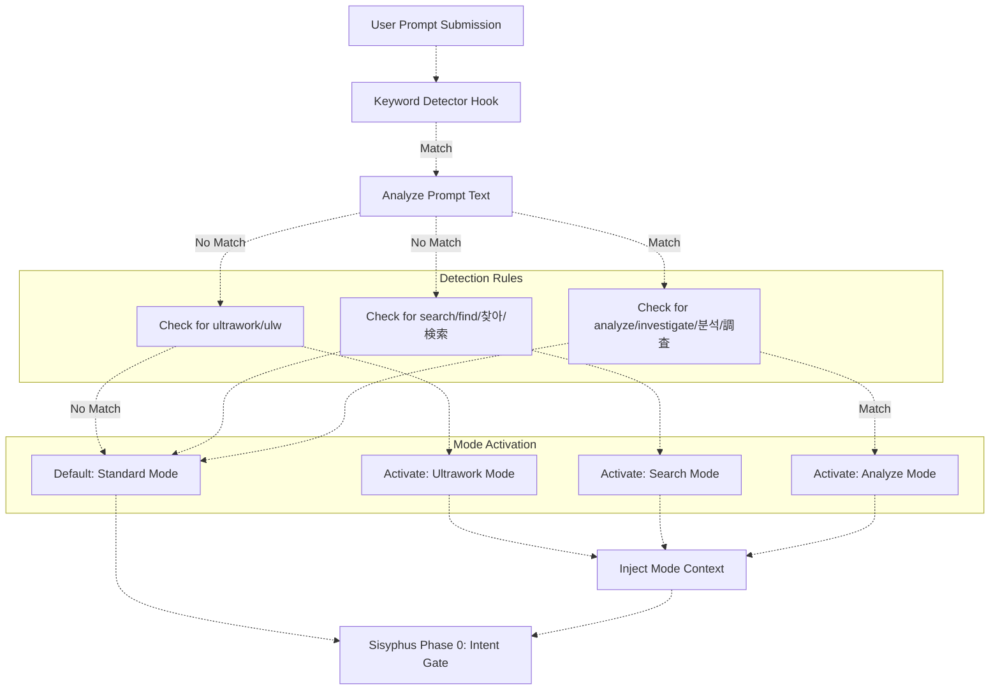
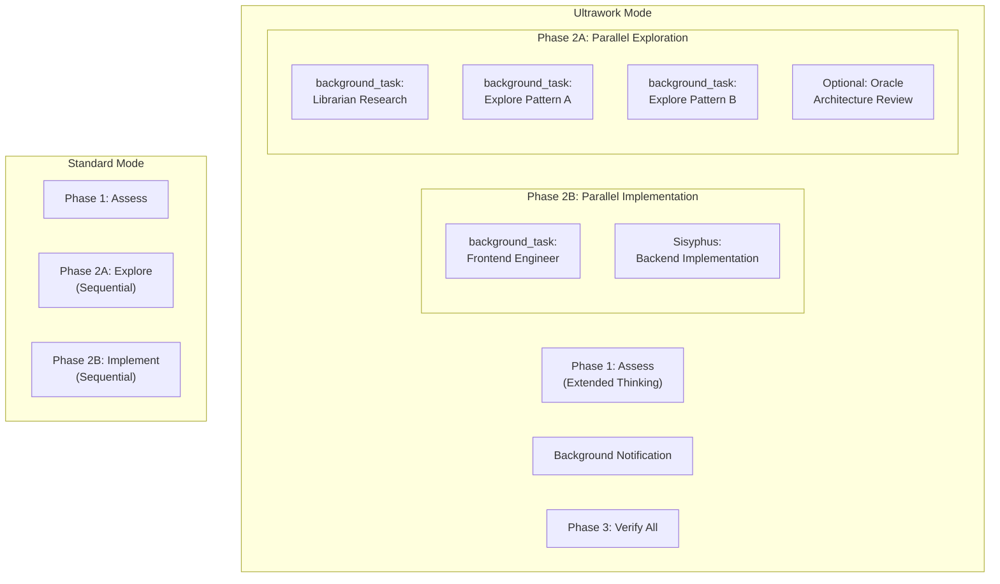
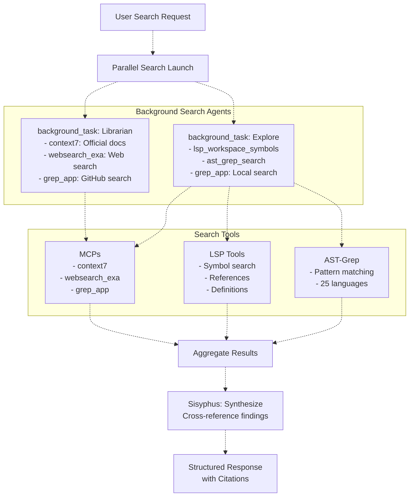
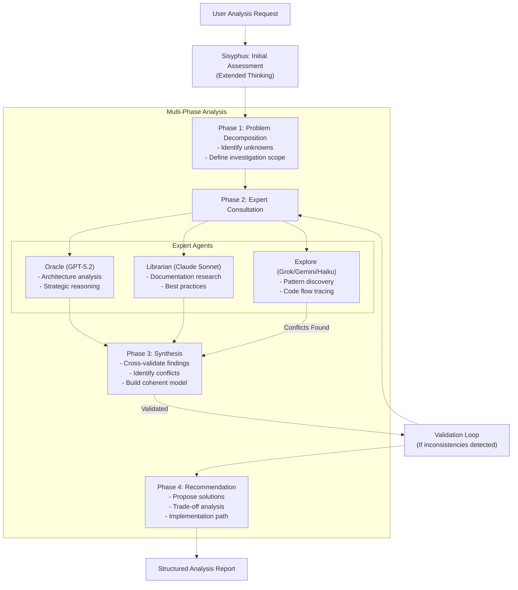
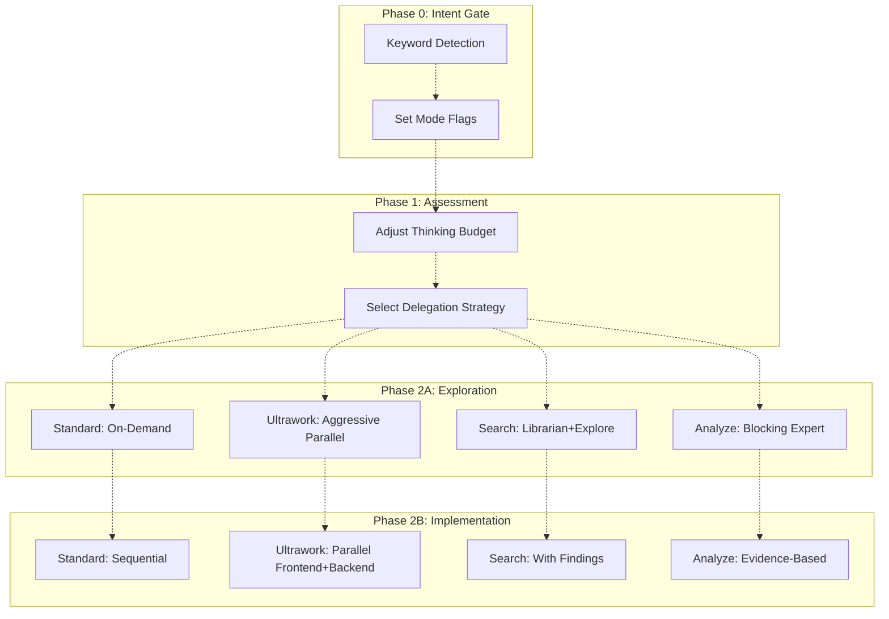

# Keyword Modes

> **Relevant source files**
> * [README.ja.md](https://github.com/code-yeongyu/oh-my-opencode/blob/b92cd6ab/README.ja.md)
> * [README.ko.md](https://github.com/code-yeongyu/oh-my-opencode/blob/b92cd6ab/README.ko.md)
> * [README.md](https://github.com/code-yeongyu/oh-my-opencode/blob/b92cd6ab/README.md)
> * [README.zh-cn.md](https://github.com/code-yeongyu/oh-my-opencode/blob/b92cd6ab/README.zh-cn.md)
> * [src/shared/config-path.ts](https://github.com/code-yeongyu/oh-my-opencode/blob/b92cd6ab/src/shared/config-path.ts)

## Purpose and Scope

This document explains oh-my-opencode's keyword-based orchestration modes that automatically activate specialized workflows when specific keywords are detected in user prompts. These modes optimize agent behavior for different task types: maximum-performance parallel execution (`ultrawork`), intensive search operations (`search`), and deep analytical reasoning (`analyze`).

For information about the underlying agent orchestration system, see [Sisyphus Orchestrator](/code-yeongyu/oh-my-opencode/4.1-sisyphus-orchestrator). For configuration of individual agents, see [Agent Configuration](/code-yeongyu/oh-my-opencode/4.3-agent-configuration). For experimental features like dynamic context pruning, see [Experimental Features](/code-yeongyu/oh-my-opencode/11.1-experimental-features).

---

## Keyword Detection System

The keyword detector analyzes user prompts before they reach Sisyphus, identifying trigger words that indicate the user's intent and required optimization strategy. Detection occurs at the request ingestion phase, before Sisyphus's Intent Gate (Phase 0).

### Keyword Detection Flow



**Sources:** README.md:670-673, High-Level Diagrams (Diagram 3)

### Detection Mechanism

The keyword detector operates as a pre-processing hook that:

1. **Scans the raw user prompt** for trigger keywords (case-insensitive)
2. **Supports multiple languages** to accommodate international users
3. **Injects mode-specific context** into the system prompt before Sisyphus processes the request
4. **Sets execution flags** that modify Sisyphus's delegation strategy

| Mode | English Keywords | Korean | Japanese | Chinese |
| --- | --- | --- | --- | --- |
| **Ultrawork** | `ultrawork`, `ulw` | - | - | - |
| **Search** | `search`, `find` | `찾아` | `検索` | - |
| **Analyze** | `analyze`, `investigate` | `분석` | `調査` | - |

**Sources:** README.md:670-673

---

## Ultrawork Mode

### Purpose

Ultrawork mode activates maximum-performance orchestration with aggressive parallel execution, background task delegation, and extended thinking budgets. This mode is designed for complex, multi-faceted tasks where speed and completeness are critical.

### Workflow Modifications



**Sources:** README.md:670-673, README.md:184-189, High-Level Diagrams (Diagram 3)

### Behavioral Changes

When ultrawork mode is active, Sisyphus:

| Aspect | Standard Behavior | Ultrawork Behavior |
| --- | --- | --- |
| **Agent Delegation** | Sequential, on-demand | Aggressive parallel spawning |
| **Background Tasks** | Conservative (only when beneficial) | Extensive (frontend/librarian/explore) |
| **Thinking Budget** | Default (varies by model) | Extended to maximum supported |
| **Exploration Phase** | Single angle | Multiple simultaneous angles |
| **Risk Tolerance** | Measured | Higher (faster iteration over perfect planning) |

### Activation Context Injection

The keyword detector injects instructions that modify Sisyphus's system prompt:

* "User has requested **maximum performance mode**. Prioritize speed and completeness over conservative resource usage."
* "Spawn background agents aggressively for parallel work. Do not wait for sequential completion."
* "Use extended thinking for complex decisions. Enable multi-angle exploration."
* "Frontend and backend work should proceed in parallel when feasible."

**Sources:** README.md:670-673, README.md:184-191

---

## Search Mode

### Purpose

Search mode optimizes for information retrieval across multiple sources: the local codebase, external documentation, and public GitHub repositories. The mode activates parallel search agents with maximized tool access.

### Search Strategy



**Sources:** README.md:670-673, High-Level Diagrams (Diagram 5), README.md:161-163

### Multi-Language Support

Search mode recognizes keywords across languages to accommodate international users:

* **English**: `search`, `find`
* **Korean**: `찾아`
* **Japanese**: `検索`

All variants trigger identical search orchestration behavior.

**Sources:** README.md:670-673

### Search Execution Pattern

1. **Immediate Parallel Launch**: Both `librarian` and `explore` agents spawn as background tasks simultaneously
2. **Tool Maximization**: Each agent is granted access to all search-capable tools (LSP, AST-grep, MCPs)
3. **No Waiting**: Sisyphus continues planning while searches execute
4. **Result Aggregation**: When all background tasks complete, Sisyphus receives notifications and synthesizes findings
5. **Citation Requirements**: Librarian and explore agents must provide evidence-based answers with source references

| Search Scope | Agent | Primary Tools | Output Format |
| --- | --- | --- | --- |
| **External Documentation** | Librarian | context7, websearch_exa, grep_app | Evidence-based answers with URLs |
| **Local Codebase** | Explore | lsp_workspace_symbols, ast_grep_search, grep_app | File paths, line numbers, definitions |
| **Cross-Repository Examples** | Librarian + Explore | grep_app (both agents) | GitHub repository references |

**Sources:** README.md:670-673, README.md:467-472, High-Level Diagrams (Diagram 5)

---

## Analyze Mode

### Purpose

Analyze mode activates deep reasoning with multi-phase expert consultation. This mode is optimized for debugging, architectural decisions, and complex problem-solving requiring logical rigor.

### Analysis Workflow



**Sources:** README.md:670-673, README.md:164-166

### Multi-Language Support

Analyze mode recognizes keywords across languages:

* **English**: `analyze`, `investigate`
* **Korean**: `분석`
* **Japanese**: `調査`

**Sources:** README.md:670-673

### Expert Consultation Strategy

Analyze mode modifies Sisyphus's behavior to:

1. **Extend thinking budget** to maximum supported by the model
2. **Invoke oracle proactively** for architectural and strategic questions (normally reserved for failure recovery)
3. **Block on expert responses** rather than using background tasks (ensures sequential reasoning)
4. **Cross-validate findings** between multiple agents before presenting conclusions
5. **Require evidence** for all claims (citations, code references, or documented reasoning)

| Analysis Aspect | Agent | Role | Execution Mode |
| --- | --- | --- | --- |
| **Architecture & Strategy** | Oracle (GPT-5.2) | Deep logical reasoning, trade-off analysis | Blocking (run_in_background=false) |
| **Domain Knowledge** | Librarian (Claude Sonnet) | Documentation, best practices, precedents | Blocking |
| **Code Structure** | Explore (Grok/Gemini/Haiku) | Pattern discovery, flow tracing | Blocking |
| **Synthesis** | Sisyphus (Opus 4.5) | Cross-validation, conflict resolution | Primary |

**Sources:** README.md:670-673, README.md:467-472, High-Level Diagrams (Diagram 3)

---

## Integration with Sisyphus Workflow

### Phase-Specific Modifications



**Sources:** README.md:670-673, High-Level Diagrams (Diagram 3), README.md:164-191

### Mode Impact on Sisyphus Phases

| Sisyphus Phase | Standard | Ultrawork | Search | Analyze |
| --- | --- | --- | --- | --- |
| **Phase 0: Intent Gate** | Classify request | Classify + set parallel flags | Classify + set search flags | Classify + set expert flags |
| **Phase 1: Assessment** | Default thinking | Extended thinking | Default thinking | Extended thinking |
| **Phase 2A: Exploration** | Conservative delegation | Aggressive parallel | Parallel librarian+explore | Blocking expert consultation |
| **Phase 2B: Implementation** | Sequential | Parallel frontend+backend | Sequential with findings | Evidence-based sequential |
| **Phase 2C: Recovery** | 3-strike → Oracle | Reduced threshold | Continue search | Immediate Oracle |
| **Phase 3: Completion** | Standard verification | Parallel verification | Citation validation | Logic consistency check |

**Sources:** README.md:670-673, High-Level Diagrams (Diagram 3)

---

## Configuration and Customization

### Disabling Keyword Detection

The keyword detector can be disabled via the `disabled_hooks` configuration:

```json
{
  "disabled_hooks": ["keyword-detector"]
}
```

When disabled, all requests are processed in standard mode regardless of keywords present in the prompt.

**Sources:** README.md:868

### Combining Modes

Multiple keywords can appear in a single prompt. The precedence order is:

1. **Ultrawork** (highest priority - overrides others)
2. **Analyze** (medium priority - overrides search)
3. **Search** (lowest priority)

For example, the prompt "ultrawork: analyze the codebase and find all usages" activates **ultrawork mode** only, with analyze and search keywords ignored.

### Mode-Specific Hook Interactions

Keyword modes interact with other hooks in the reliability layer:

| Hook | Standard | Ultrawork | Search | Analyze |
| --- | --- | --- | --- | --- |
| **Context Window Monitor** | 70% warning | 80% warning (more headroom used) | 70% warning | 70% warning |
| **Todo Continuation** | Enforced | Enforced + parallel completion | Enforced | Enforced + validation |
| **Agent Usage Reminder** | Active | Suppressed (already using agents) | Suppressed | Suppressed |
| **Background Notification** | Standard | High frequency (many tasks) | Standard | Rare (mostly blocking) |

**Sources:** README.md:670-693

---

## Configuration File References

Keyword modes are controlled by the keyword detector hook, which can be configured in:

* User-level: `~/.config/opencode/oh-my-opencode.json`
* Project-level: `.opencode/oh-my-opencode.json`

**Sources:** src/shared/config-path.ts:38-47

---

## Summary

Keyword modes provide a declarative way to activate specialized orchestration strategies optimized for different task types:

* **Ultrawork**: Maximum parallel execution, aggressive agent spawning, extended thinking
* **Search**: Parallel search across local/external sources with citation requirements
* **Analyze**: Multi-phase expert consultation with cross-validation and evidence-based reasoning

These modes modify Sisyphus's behavior at all workflow phases, from initial assessment through completion verification, ensuring appropriate resource allocation and execution strategy for each task type.

**Sources:** README.md:670-673, README.md:184-191, High-Level Diagrams (Diagrams 1, 3)