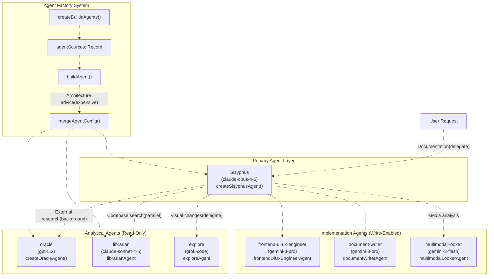
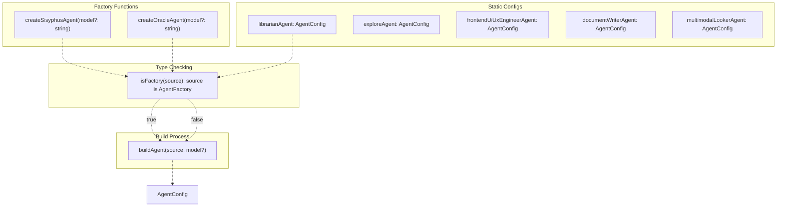
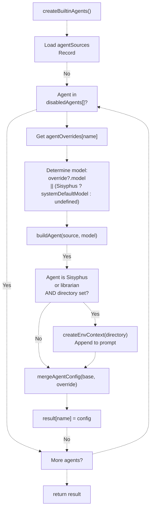
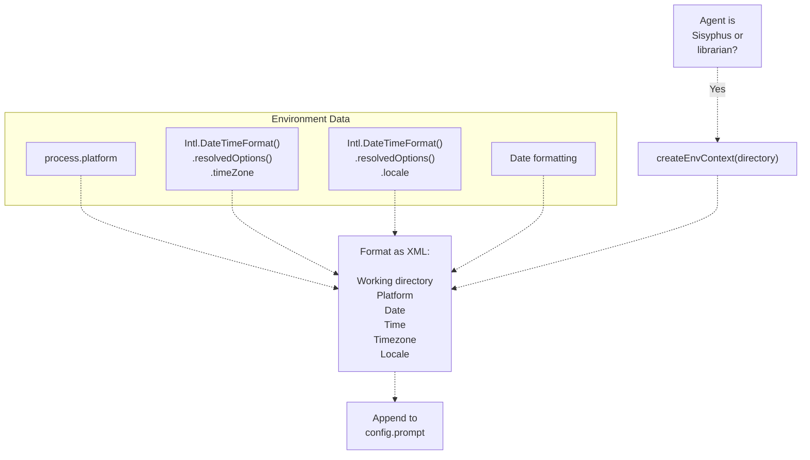
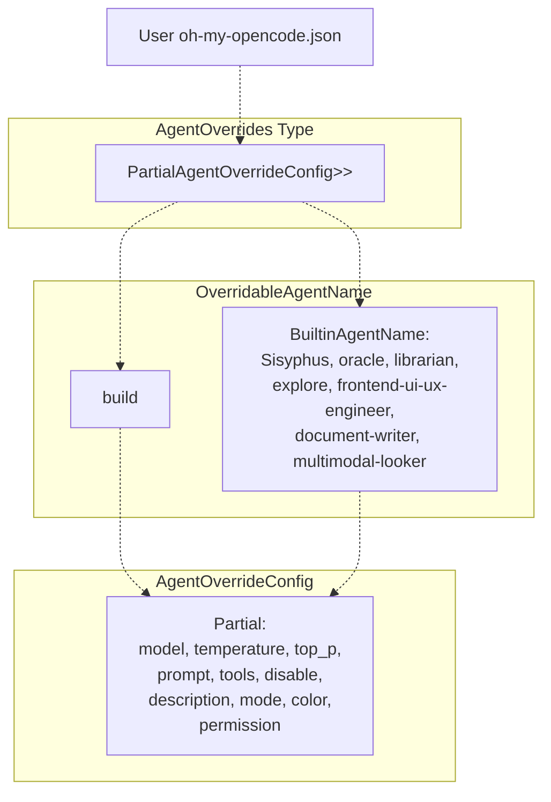

# Agent System

> **Relevant source files**
> * [.github/assets/sisyphus.png](https://github.com/code-yeongyu/oh-my-opencode/blob/b92cd6ab/.github/assets/sisyphus.png)
> * [README.ja.md](https://github.com/code-yeongyu/oh-my-opencode/blob/b92cd6ab/README.ja.md)
> * [README.ko.md](https://github.com/code-yeongyu/oh-my-opencode/blob/b92cd6ab/README.ko.md)
> * [README.md](https://github.com/code-yeongyu/oh-my-opencode/blob/b92cd6ab/README.md)
> * [README.zh-cn.md](https://github.com/code-yeongyu/oh-my-opencode/blob/b92cd6ab/README.zh-cn.md)
> * [src/agents/document-writer.ts](https://github.com/code-yeongyu/oh-my-opencode/blob/b92cd6ab/src/agents/document-writer.ts)
> * [src/agents/explore.ts](https://github.com/code-yeongyu/oh-my-opencode/blob/b92cd6ab/src/agents/explore.ts)
> * [src/agents/frontend-ui-ux-engineer.ts](https://github.com/code-yeongyu/oh-my-opencode/blob/b92cd6ab/src/agents/frontend-ui-ux-engineer.ts)
> * [src/agents/index.ts](https://github.com/code-yeongyu/oh-my-opencode/blob/b92cd6ab/src/agents/index.ts)
> * [src/agents/librarian.ts](https://github.com/code-yeongyu/oh-my-opencode/blob/b92cd6ab/src/agents/librarian.ts)
> * [src/agents/multimodal-looker.ts](https://github.com/code-yeongyu/oh-my-opencode/blob/b92cd6ab/src/agents/multimodal-looker.ts)
> * [src/agents/oracle.ts](https://github.com/code-yeongyu/oh-my-opencode/blob/b92cd6ab/src/agents/oracle.ts)
> * [src/agents/sisyphus.ts](https://github.com/code-yeongyu/oh-my-opencode/blob/b92cd6ab/src/agents/sisyphus.ts)
> * [src/agents/types.ts](https://github.com/code-yeongyu/oh-my-opencode/blob/b92cd6ab/src/agents/types.ts)
> * [src/agents/utils.test.ts](https://github.com/code-yeongyu/oh-my-opencode/blob/b92cd6ab/src/agents/utils.test.ts)
> * [src/agents/utils.ts](https://github.com/code-yeongyu/oh-my-opencode/blob/b92cd6ab/src/agents/utils.ts)
> * [src/shared/config-path.ts](https://github.com/code-yeongyu/oh-my-opencode/blob/b92cd6ab/src/shared/config-path.ts)

The agent system provides a hierarchical orchestration model where specialized AI agents handle different aspects of development work. Sisyphus serves as the primary orchestrator, delegating tasks to analytical agents (read-only) and implementation agents (write-enabled) based on the nature of the work. For information about the background task execution that enables parallel agent work, see [Background Execution System](../background-execution/).

**Sources**: [README.md L1-L1630](https://github.com/code-yeongyu/oh-my-opencode/blob/b92cd6ab/README.md#L1-L1630)

 [src/agents/index.ts L1-L22](https://github.com/code-yeongyu/oh-my-opencode/blob/b92cd6ab/src/agents/index.ts#L1-L22)

## Agent Hierarchy and Roles

The system defines seven built-in agents, each optimized for specific tasks with carefully selected models:

| Agent Name | Model | Role | Access Level | Cost Tier |
| --- | --- | --- | --- | --- |
| `Sisyphus` | `anthropic/claude-opus-4-5` | Primary orchestrator, task delegation, parallel execution | Full | High |
| `oracle` | `openai/gpt-5.2` | Architecture decisions, code review, debugging consultation | Read + Advisory | Expensive |
| `librarian` | `anthropic/claude-sonnet-4-5` | External documentation, OSS research, implementation examples | Read + External | Cheap |
| `explore` | `opencode/grok-code` | Fast codebase search, pattern matching, file discovery | Read | Free |
| `frontend-ui-ux-engineer` | `google/gemini-3-pro-preview` | Visual design, UI/UX implementation | Write | Medium |
| `document-writer` | `google/gemini-3-pro-preview` | Technical documentation, prose generation | Write | Medium |
| `multimodal-looker` | `google/gemini-3-flash` | Image/PDF analysis, visual content extraction | Read | Cheap |

**Sources**: [README.md L486-L506](https://github.com/code-yeongyu/oh-my-opencode/blob/b92cd6ab/README.md#L486-L506)

 [src/agents/index.ts L10-L18](https://github.com/code-yeongyu/oh-my-opencode/blob/b92cd6ab/src/agents/index.ts#L10-L18)

## System Architecture



**Sources**: [src/agents/utils.ts L12-L22](https://github.com/code-yeongyu/oh-my-opencode/blob/b92cd6ab/src/agents/utils.ts#L12-L22)

 [src/agents/utils.ts L72-L105](https://github.com/code-yeongyu/oh-my-opencode/blob/b92cd6ab/src/agents/utils.ts#L72-L105)

 [src/agents/sisyphus.ts L1-L445](https://github.com/code-yeongyu/oh-my-opencode/blob/b92cd6ab/src/agents/sisyphus.ts#L1-L445)

## Agent Factory Pattern

The system uses a factory pattern to support model-dependent configuration. Some agents are defined as factory functions, others as static configurations:



The `buildAgent()` function at [src/agents/utils.ts L28-L30](https://github.com/code-yeongyu/oh-my-opencode/blob/b92cd6ab/src/agents/utils.ts#L28-L30)

 checks if the source is a factory function using type guard `isFactory()` at [src/agents/utils.ts L24-L26](https://github.com/code-yeongyu/oh-my-opencode/blob/b92cd6ab/src/agents/utils.ts#L24-L26)

 Factory functions enable dynamic configuration based on the model parameter, particularly for handling differences between Claude (extended thinking) and GPT (reasoning effort) models.

**Sources**: [src/agents/utils.ts L12-L30](https://github.com/code-yeongyu/oh-my-opencode/blob/b92cd6ab/src/agents/utils.ts#L12-L30)

 [src/agents/types.ts L1-L27](https://github.com/code-yeongyu/oh-my-opencode/blob/b92cd6ab/src/agents/types.ts#L1-L27)

## Model-Dependent Configuration

Agents that use factory functions adapt their configuration based on the provided model:

### Sisyphus Agent Configuration

The `createSisyphusAgent()` function at [src/agents/sisyphus.ts L1-L445](https://github.com/code-yeongyu/oh-my-opencode/blob/b92cd6ab/src/agents/sisyphus.ts#L1-L445)

 applies model-specific settings:

| Model Type | Detection | Configuration |
| --- | --- | --- |
| GPT models | `isGptModel(model)` returns `true` | `reasoningEffort: "medium"` |
| Claude models (default) | All other models | `thinking: { type: "enabled", budgetTokens: 32000 }` |

The model detection uses pattern matching: [src/agents/types.ts L5-L7](https://github.com/code-yeongyu/oh-my-opencode/blob/b92cd6ab/src/agents/types.ts#L5-L7)

```javascript
export function isGptModel(model: string): boolean {
  return model.startsWith("openai/") || model.startsWith("github-copilot/gpt-")
}
```

**Sources**: [src/agents/types.ts L5-L7](https://github.com/code-yeongyu/oh-my-opencode/blob/b92cd6ab/src/agents/types.ts#L5-L7)

 [src/agents/sisyphus.ts L1-L10](https://github.com/code-yeongyu/oh-my-opencode/blob/b92cd6ab/src/agents/sisyphus.ts#L1-L10)

 [src/agents/utils.test.ts L5-L87](https://github.com/code-yeongyu/oh-my-opencode/blob/b92cd6ab/src/agents/utils.test.ts#L5-L87)

### Oracle Agent Configuration

Similar to Sisyphus, the `createOracleAgent()` function adapts based on model:

* **GPT models**: `reasoningEffort: "medium"`, `textVerbosity: "high"`
* **Claude models**: `thinking: { type: "enabled", budgetTokens: 32000 }`

The tests at [src/agents/utils.test.ts L45-L72](https://github.com/code-yeongyu/oh-my-opencode/blob/b92cd6ab/src/agents/utils.test.ts#L45-L72)

 verify this behavior, ensuring that overriding the model properly rebuilds the agent configuration.

**Sources**: [src/agents/utils.test.ts L45-L87](https://github.com/code-yeongyu/oh-my-opencode/blob/b92cd6ab/src/agents/utils.test.ts#L45-L87)

 [src/agents/oracle.ts L1-L50](https://github.com/code-yeongyu/oh-my-opencode/blob/b92cd6ab/src/agents/oracle.ts#L1-L50)

## Agent Creation Flow



The `createBuiltinAgents()` function at [src/agents/utils.ts L72-L105](https://github.com/code-yeongyu/oh-my-opencode/blob/b92cd6ab/src/agents/utils.ts#L72-L105)

 orchestrates agent creation with the following steps:

1. **Iterate agent sources**: Loop through `agentSources` object at [src/agents/utils.ts L14-L22](https://github.com/code-yeongyu/oh-my-opencode/blob/b92cd6ab/src/agents/utils.ts#L14-L22)
2. **Check disabled list**: Skip if agent name is in `disabledAgents` array at [src/agents/utils.ts L83-L85](https://github.com/code-yeongyu/oh-my-opencode/blob/b92cd6ab/src/agents/utils.ts#L83-L85)
3. **Resolve model**: Use override model, or `systemDefaultModel` for Sisyphus, or undefined at [src/agents/utils.ts L87-L88](https://github.com/code-yeongyu/oh-my-opencode/blob/b92cd6ab/src/agents/utils.ts#L87-L88)
4. **Build base config**: Call `buildAgent()` with source and model at [src/agents/utils.ts L90](https://github.com/code-yeongyu/oh-my-opencode/blob/b92cd6ab/src/agents/utils.ts#L90-L90)
5. **Inject environment context**: For Sisyphus and librarian, append environment info (date, time, timezone, platform) to prompt at [src/agents/utils.ts L92-L95](https://github.com/code-yeongyu/oh-my-opencode/blob/b92cd6ab/src/agents/utils.ts#L92-L95)
6. **Apply overrides**: Merge user-provided overrides via `mergeAgentConfig()` at [src/agents/utils.ts L97-L99](https://github.com/code-yeongyu/oh-my-opencode/blob/b92cd6ab/src/agents/utils.ts#L97-L99)
7. **Add to result**: Store final config in result map at [src/agents/utils.ts L101](https://github.com/code-yeongyu/oh-my-opencode/blob/b92cd6ab/src/agents/utils.ts#L101-L101)

**Sources**: [src/agents/utils.ts L72-L105](https://github.com/code-yeongyu/oh-my-opencode/blob/b92cd6ab/src/agents/utils.ts#L72-L105)

 [src/agents/utils.ts L32-L63](https://github.com/code-yeongyu/oh-my-opencode/blob/b92cd6ab/src/agents/utils.ts#L32-L63)

 [src/agents/utils.ts L65-L70](https://github.com/code-yeongyu/oh-my-opencode/blob/b92cd6ab/src/agents/utils.ts#L65-L70)

## Environment Context Injection

Sisyphus and librarian agents receive runtime environment information appended to their prompts:



The `createEnvContext()` function at [src/agents/utils.ts L32-L63](https://github.com/code-yeongyu/oh-my-opencode/blob/b92cd6ab/src/agents/utils.ts#L32-L63)

 generates a formatted string containing:

* Working directory path
* Platform (darwin/linux/win32)
* Current date with explicit "NOT 2024" warning
* Current time with timezone
* Locale information

This context helps agents make time-aware and platform-aware decisions.

**Sources**: [src/agents/utils.ts L32-L63](https://github.com/code-yeongyu/oh-my-opencode/blob/b92cd6ab/src/agents/utils.ts#L32-L63)

 [src/agents/utils.ts L92-L95](https://github.com/code-yeongyu/oh-my-opencode/blob/b92cd6ab/src/agents/utils.ts#L92-L95)

## Configuration and Overrides

Agents can be customized through configuration objects in `oh-my-opencode.json`:

### Override Structure



The type system at [src/agents/types.ts L9-L26](https://github.com/code-yeongyu/oh-my-opencode/blob/b92cd6ab/src/agents/types.ts#L9-L26)

 defines:

* `BuiltinAgentName`: Union type of all built-in agent names
* `OverridableAgentName`: Adds `"build"` to builtin names for legacy support
* `AgentOverrideConfig`: Partial `AgentConfig` allowing selective field overrides
* `AgentOverrides`: Record mapping agent names to override configs

**Sources**: [src/agents/types.ts L9-L27](https://github.com/code-yeongyu/oh-my-opencode/blob/b92cd6ab/src/agents/types.ts#L9-L27)

 [README.md L750-L805](https://github.com/code-yeongyu/oh-my-opencode/blob/b92cd6ab/README.md#L750-L805)

### Deep Merge Strategy

The `mergeAgentConfig()` function at [src/agents/utils.ts L65-L70](https://github.com/code-yeongyu/oh-my-opencode/blob/b92cd6ab/src/agents/utils.ts#L65-L70)

 uses deep merge to combine base configuration with overrides:

```javascript
function mergeAgentConfig(
  base: AgentConfig,
  override: AgentOverrideConfig
): AgentConfig {
  return deepMerge(base, override as Partial<AgentConfig>)
}
```

This ensures nested properties (like `permission` object) are merged rather than replaced.

**Sources**: [src/agents/utils.ts L65-L70](https://github.com/code-yeongyu/oh-my-opencode/blob/b92cd6ab/src/agents/utils.ts#L65-L70)

 [src/agents/utils.ts L10](https://github.com/code-yeongyu/oh-my-opencode/blob/b92cd6ab/src/agents/utils.ts#L10-L10)

## Agent Specialization Details

### Sisyphus: The Orchestrator

Sisyphus operates through a three-phase workflow defined in its system prompt at [src/agents/sisyphus.ts L6-L445](https://github.com/code-yeongyu/oh-my-opencode/blob/b92cd6ab/src/agents/sisyphus.ts#L6-L445)

:

**Phase 0 - Intent Gate**: Classifies every request as Trivial, Explicit, Exploratory, Open-ended, or Ambiguous. Triggers background agents proactively when external libraries or multiple modules are mentioned.

**Phase 1 - Codebase Assessment**: For open-ended tasks, assesses codebase maturity (Disciplined, Transitional, Legacy/Chaotic, or Greenfield) to determine whether to follow existing patterns or propose improvements.

**Phase 2A - Exploration & Research**: Selects tools based on cost and complexity. Uses `explore`/`librarian` agents as "contextual grep" and "reference grep" respectively, firing them in parallel as background tasks.

**Phase 2B - Implementation**: Creates detailed TODO lists, delegates frontend visual work to `frontend-ui-ux-engineer`, handles business logic directly.

**Sources**: [src/agents/sisyphus.ts L6-L445](https://github.com/code-yeongyu/oh-my-opencode/blob/b92cd6ab/src/agents/sisyphus.ts#L6-L445)

 [README.md L486-L496](https://github.com/code-yeongyu/oh-my-opencode/blob/b92cd6ab/README.md#L486-L496)

### Analytical Agent Roles

**Oracle** (`openai/gpt-5.2`): Marked as "EXPENSIVE" in Sisyphus prompt. Only consulted for architecture decisions, complex debugging after 2+ failures, or strategic code review. Uses GPT-5.2 for logical reasoning and deep analysis.

**Librarian** (`anthropic/claude-sonnet-4-5`): Searches external resources (official docs, OSS repos, web). Triggered by phrases like "How do I use [library]?" or when working with unfamiliar dependencies. Has access to MCPs: `context7`, `websearch_exa`, `grep_app`.

**Explore** (`opencode/grok-code`): Internal codebase search. Fires when multiple search angles are needed or module structure is unfamiliar. Free tier model (Grok Code) chosen for speed and cost-effectiveness.

**Sources**: [src/agents/sisyphus.ts L110-L183](https://github.com/code-yeongyu/oh-my-opencode/blob/b92cd6ab/src/agents/sisyphus.ts#L110-L183)

 [README.md L486-L506](https://github.com/code-yeongyu/oh-my-opencode/blob/b92cd6ab/README.md#L486-L506)

### Implementation Agent Roles

**Frontend UI/UX Engineer** (`google/gemini-3-pro-preview`): Handles visual changes (colors, spacing, layout, animations). Sisyphus delegates all visual modifications but handles pure logic (API calls, state management) directly.

**Document Writer** (`google/gemini-3-pro-preview`): Technical documentation generation. Gemini models excel at prose and structured writing.

**Multimodal Looker** (`google/gemini-3-flash`): Analyzes images, PDFs, and diagrams using the `look_at` tool. Prevents context bloat by extracting only relevant information from media files.

**Sources**: [src/agents/sisyphus.ts L193-L220](https://github.com/code-yeongyu/oh-my-opencode/blob/b92cd6ab/src/agents/sisyphus.ts#L193-L220)

 [README.md L486-L506](https://github.com/code-yeongyu/oh-my-opencode/blob/b92cd6ab/README.md#L486-L506)

## Configuration File Locations

Agent overrides can be specified in two locations following the standard configuration hierarchy:

| Location | Path | Priority |
| --- | --- | --- |
| Project config | `.opencode/oh-my-opencode.json` | Higher |
| User config | `~/.config/opencode/oh-my-opencode.json` (Linux/macOS)`%APPDATA%\opencode\oh-my-opencode.json` (Windows fallback) | Lower |

The configuration system uses helper functions at [src/shared/config-path.ts L1-L48](https://github.com/code-yeongyu/oh-my-opencode/blob/b92cd6ab/src/shared/config-path.ts#L1-L48)

:

* `getUserConfigDir()`: Returns user config directory with cross-platform Windows support at [src/shared/config-path.ts L13-L33](https://github.com/code-yeongyu/oh-my-opencode/blob/b92cd6ab/src/shared/config-path.ts#L13-L33)
* `getUserConfigPath()`: Full path to user-level config at [src/shared/config-path.ts L38-L40](https://github.com/code-yeongyu/oh-my-opencode/blob/b92cd6ab/src/shared/config-path.ts#L38-L40)
* `getProjectConfigPath()`: Full path to project-level config at [src/shared/config-path.ts L45-L47](https://github.com/code-yeongyu/oh-my-opencode/blob/b92cd6ab/src/shared/config-path.ts#L45-L47)

**Sources**: [src/shared/config-path.ts L1-L48](https://github.com/code-yeongyu/oh-my-opencode/blob/b92cd6ab/src/shared/config-path.ts#L1-L48)

 [README.md L707-L723](https://github.com/code-yeongyu/oh-my-opencode/blob/b92cd6ab/README.md#L707-L723)