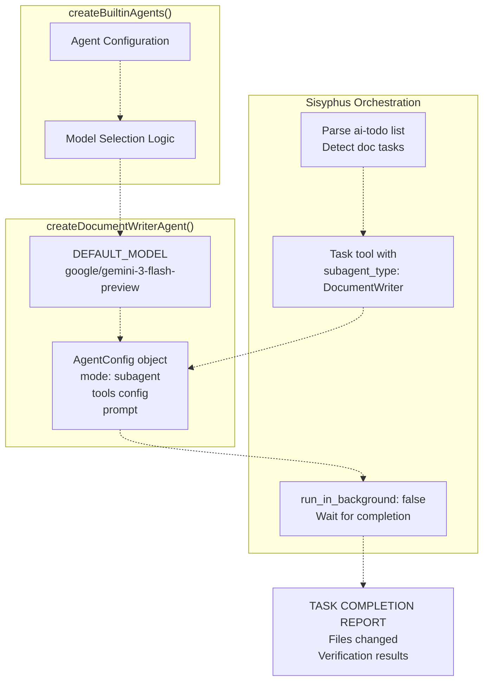
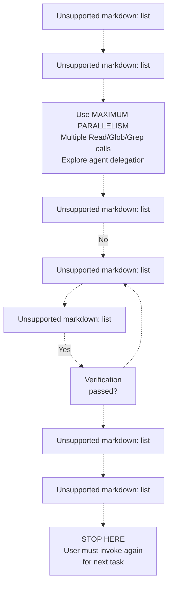
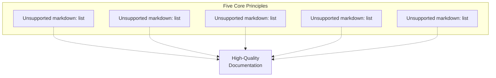
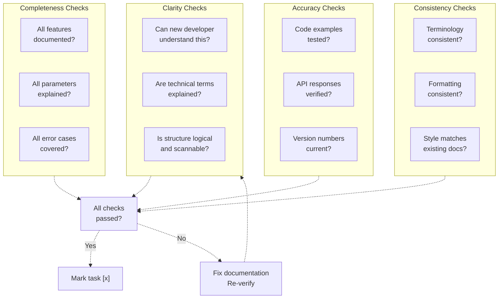
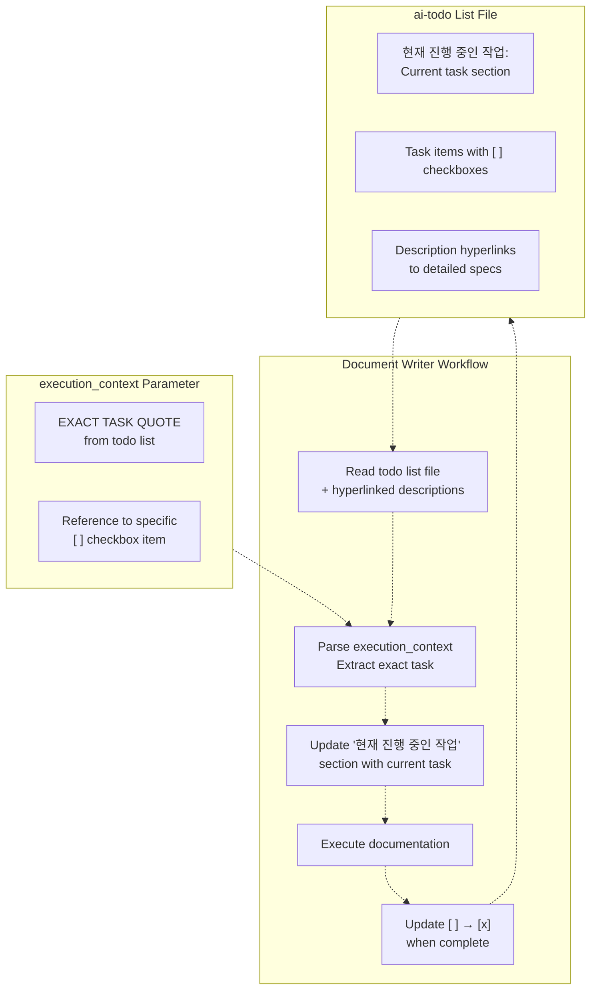
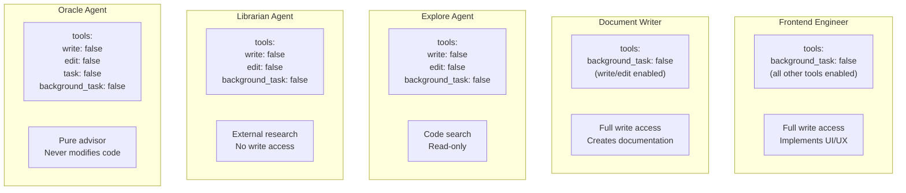
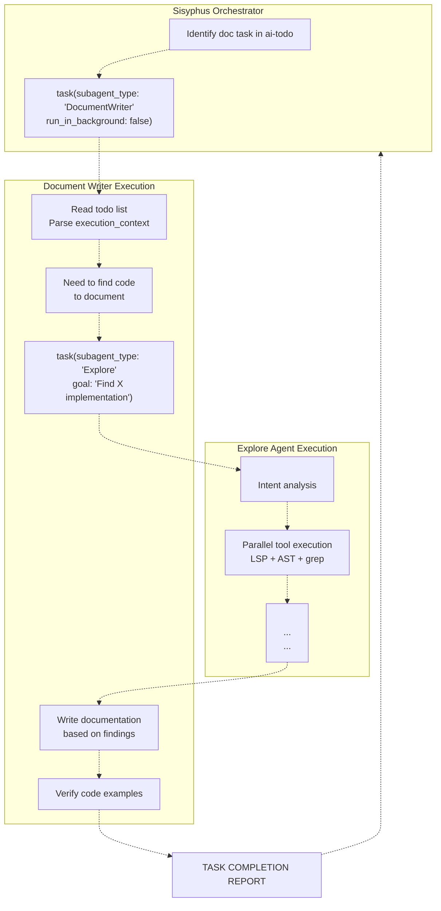
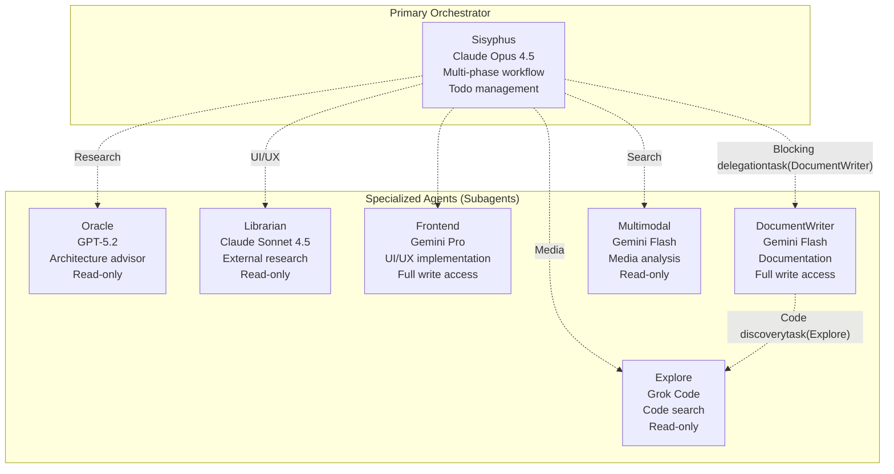

# Document Writer

> **Relevant source files**
> * [src/agents/document-writer.ts](https://github.com/code-yeongyu/oh-my-opencode/blob/b92cd6ab/src/agents/document-writer.ts)
> * [src/agents/explore.ts](https://github.com/code-yeongyu/oh-my-opencode/blob/b92cd6ab/src/agents/explore.ts)
> * [src/agents/frontend-ui-ux-engineer.ts](https://github.com/code-yeongyu/oh-my-opencode/blob/b92cd6ab/src/agents/frontend-ui-ux-engineer.ts)
> * [src/agents/librarian.ts](https://github.com/code-yeongyu/oh-my-opencode/blob/b92cd6ab/src/agents/librarian.ts)
> * [src/agents/multimodal-looker.ts](https://github.com/code-yeongyu/oh-my-opencode/blob/b92cd6ab/src/agents/multimodal-looker.ts)
> * [src/agents/oracle.ts](https://github.com/code-yeongyu/oh-my-opencode/blob/b92cd6ab/src/agents/oracle.ts)

The Document Writer is a specialized subagent responsible for creating technical documentation including README files, API documentation, architecture documentation, and user guides. It executes documentation tasks from ai-todo list plans with strict verification requirements and quality standards.

For information about other specialized agents, see [Specialized Agents](/code-yeongyu/oh-my-opencode/4.2-specialized-agents). For the primary orchestrator that delegates to this agent, see [Sisyphus Orchestrator](/code-yeongyu/oh-my-opencode/4.1-sisyphus-orchestrator).

## Agent Configuration

The Document Writer agent is created via `createDocumentWriterAgent()` and configured as follows:

| Property | Value | Purpose |
| --- | --- | --- |
| **Model** | `google/gemini-3-flash-preview` | Fast, cost-effective model for structured writing |
| **Mode** | `subagent` | Operates as delegated specialist under Sisyphus |
| **Temperature** | `0.1` (inherited) | Low temperature for consistency |
| **Tools** | All enabled except `background_task` | Full read/write access, cannot spawn background tasks |
| **Delegation** | Blocking (synchronous) | Sisyphus waits for completion before proceeding |

**Key Constraint**: The agent cannot spawn background tasks (`background_task: false`), preventing recursive delegation chains.

**Sources**: [src/agents/document-writer.ts L1-L13](https://github.com/code-yeongyu/oh-my-opencode/blob/b92cd6ab/src/agents/document-writer.ts#L1-L13)

### Agent Factory Integration



**Sources**: [src/agents/document-writer.ts L5-L13](https://github.com/code-yeongyu/oh-my-opencode/blob/b92cd6ab/src/agents/document-writer.ts#L5-L13)

## Core Responsibilities

The Document Writer specializes in four primary documentation categories:

### Documentation Types

| Type | Structure | Tone | Focus |
| --- | --- | --- | --- |
| **README Files** | Title, Description, Installation, Usage, API Reference, Contributing, License | Welcoming but professional | Getting users started quickly with clear examples |
| **API Documentation** | Endpoint, Method, Parameters, Request/Response examples, Error codes | Technical, precise, comprehensive | Every detail a developer needs to integrate |
| **Architecture Documentation** | Overview, Components, Data Flow, Dependencies, Design Decisions | Educational, explanatory | Why things are built the way they are |
| **User Guides** | Introduction, Prerequisites, Step-by-step tutorials, Troubleshooting | Friendly, supportive | Guiding users to success |

**Sources**: [src/agents/document-writer.ts L93-L113](https://github.com/code-yeongyu/oh-my-opencode/blob/b92cd6ab/src/agents/document-writer.ts#L93-L113)

## Workflow Process

The Document Writer follows a mandatory 7-step workflow enforced through its system prompt:



**Critical Rules**:

* **Execute ONLY ONE checkbox item per invocation** - Single-task constraint prevents scope creep
* **STOP immediately after completing ONE task** - Forces explicit continuation by Sisyphus
* **UPDATE checkbox from `[ ]` to `[x]` only after successful completion** - No premature marking
* **NEVER continue to next task** - User/Sisyphus must invoke again

**Sources**: [src/agents/document-writer.ts L74-L149](https://github.com/code-yeongyu/oh-my-opencode/blob/b92cd6ab/src/agents/document-writer.ts#L74-L149)

### Parallel Exploration Strategy

The workflow emphasizes aggressive parallelism during the exploration phase:

| Operation Type | Strategy | Example Tools |
| --- | --- | --- |
| **Codebase Exploration** | Multiple simultaneous read operations | `read()`, `glob()`, `grep()` in single message |
| **Code Discovery** | Delegate to Explore agent | `task(subagent_type: "Explore")` |
| **Pattern Analysis** | LSP and AST tools in parallel | `lsp_workspace_symbols()`, `ast_grep_search()` |

The prompt explicitly states: **"USE MAXIMUM PARALLELISM: When exploring codebase (Read, Glob, Grep), make MULTIPLE tool calls in SINGLE message"** and **"EXPLORE AGGRESSIVELY: Use Task tool with `subagent_type=Explore` to find code to document"**.

**Sources**: [src/agents/document-writer.ts L84-L86](https://github.com/code-yeongyu/oh-my-opencode/blob/b92cd6ab/src/agents/document-writer.ts#L84-L86)

## Code of Conduct Principles

The Document Writer operates under five core principles embedded in its system prompt:



### Principle 1: Diligence & Integrity

**Non-negotiable requirements**:

* Execute the exact task specified without adding unrelated content
* Never mark work as complete without proper verification
* Verify all code examples actually work (don't just copy-paste)
* Iterate until documentation is right, even if unclear initially
* Take full responsibility for quality and correctness

**Sources**: [src/agents/document-writer.ts L24-L33](https://github.com/code-yeongyu/oh-my-opencode/blob/b92cd6ab/src/agents/document-writer.ts#L24-L33)

### Principle 4: Verification-Driven Documentation

**Critical mandate**: *"Documentation without verification is potentially harmful."*

**Verification requirements**:

1. **Test every code snippet** - Must be tested and working
2. **Search for existing docs** - Find and update docs affected by changes
3. **Run every command documented** - Ensure accuracy
4. **Handle edge cases** - Document not just happy paths, but error conditions
5. **Fix the docs, not the reality** - If docs don't match reality, update the docs (or flag code issues)

**The task is INCOMPLETE until documentation is verified. Period.**

**Sources**: [src/agents/document-writer.ts L52-L62](https://github.com/code-yeongyu/oh-my-opencode/blob/b92cd6ab/src/agents/document-writer.ts#L52-L62)

## Verification System

The verification phase is mandatory and must pass before a task can be marked complete:

| Verification Type | Checks | Failure Action |
| --- | --- | --- |
| **Code Examples** | All snippets tested and working | Return to step 4 (Execute documentation) |
| **Installation Instructions** | Setup steps executed if applicable | Fix and re-verify |
| **Links** | Internal and external links valid | Update links and re-verify |
| **API Examples** | Request/response verified against actual API | Correct examples and re-verify |

**Verification Failure Loop**: If verification fails, the agent must **NOT** check the box and must return to step 4 to fix the documentation, then re-verify.

**Sources**: [src/agents/document-writer.ts L115-L122](https://github.com/code-yeongyu/oh-my-opencode/blob/b92cd6ab/src/agents/document-writer.ts#L115-L122)

### Quality Checklist

The system prompt includes a built-in quality checklist:



**Sources**: [src/agents/document-writer.ts L152-L173](https://github.com/code-yeongyu/oh-my-opencode/blob/b92cd6ab/src/agents/document-writer.ts#L152-L173)

## Integration with Todo System

The Document Writer is tightly coupled with Sisyphus's todo management system:

### Todo List Processing



**Task Identification**: The agent must find the **EXACT TASK QUOTE** from `execution_context` in the todo list file. This ensures it executes only the intended task.

**Single-Task Constraint**: The workflow explicitly prohibits continuing to the next task. After completing one checkbox item, the agent **MUST STOP** and generate a completion report. Sisyphus must invoke the agent again for the next task.

**Sources**: [src/agents/document-writer.ts L76-L90](https://github.com/code-yeongyu/oh-my-opencode/blob/b92cd6ab/src/agents/document-writer.ts#L76-L90)

### Completion Report Format

After successful execution, the agent generates a structured report:

```
**TASK COMPLETION REPORT**
```

COMPLETED TASK: [exact task description]
STATUS: SUCCESS/FAILED/BLOCKED

WHAT WAS DOCUMENTED:

* [Detailed list of all documentation created]
* [Files created/modified with paths]

FILES CHANGED:

* Created: [list of new files]
* Modified: [list of modified files]

VERIFICATION RESULTS:

* [Code examples tested: X/Y working]
* [Links checked: X/Y valid]

TIME TAKEN: [duration]

```
STOP HERE - DO NOT CONTINUE TO NEXT TASK
```

**Sources**: [src/agents/document-writer.ts L127-L148](https://github.com/code-yeongyu/oh-my-opencode/blob/b92cd6ab/src/agents/document-writer.ts#L127-L148)

## Tool Access and Capabilities

The Document Writer has differentiated tool access compared to other agents:

### Tool Permissions

| Tool Category | Access | Rationale |
| --- | --- | --- |
| **read** | ✓ Enabled | Read source code and existing docs |
| **write** | ✓ Enabled | Create and update documentation files |
| **edit** | ✓ Enabled | Modify existing documentation |
| **bash** | ✓ Enabled | Run commands to verify examples |
| **task** | ✓ Enabled | Delegate to Explore agent for code discovery |
| **background_task** | ✗ Disabled | Prevent recursive delegation |
| **LSP tools** | ✓ Enabled (inherited) | Navigate code structure |
| **AST-Grep** | ✓ Enabled (inherited) | Search code patterns |

**Key Difference**: Unlike Librarian and Explore agents (which have `write: false, edit: false`), the Document Writer has full write access since its job is to create/modify documentation files.

**Sources**: [src/agents/document-writer.ts L13](https://github.com/code-yeongyu/oh-my-opencode/blob/b92cd6ab/src/agents/document-writer.ts#L13-L13)

### Comparison with Other Agents



**Sources**: [src/agents/oracle.ts L79](https://github.com/code-yeongyu/oh-my-opencode/blob/b92cd6ab/src/agents/oracle.ts#L79-L79)

 [src/agents/librarian.ts L12](https://github.com/code-yeongyu/oh-my-opencode/blob/b92cd6ab/src/agents/librarian.ts#L12-L12)

 [src/agents/explore.ts L12](https://github.com/code-yeongyu/oh-my-opencode/blob/b92cd6ab/src/agents/explore.ts#L12-L12)

 [src/agents/document-writer.ts L13](https://github.com/code-yeongyu/oh-my-opencode/blob/b92cd6ab/src/agents/document-writer.ts#L13-L13)

 [src/agents/frontend-ui-ux-engineer.ts L13](https://github.com/code-yeongyu/oh-my-opencode/blob/b92cd6ab/src/agents/frontend-ui-ux-engineer.ts#L13-L13)

## Delegation Patterns

### When Sisyphus Delegates to Document Writer

The Document Writer is invoked via the `task` tool with `subagent_type: "DocumentWriter"`:

**Trigger Conditions**:

1. **ai-todo list contains documentation tasks** - Task descriptions indicate documentation work
2. **Explicit documentation request** - User asks for README, API docs, or guides
3. **Post-implementation documentation** - After feature implementation, Sisyphus delegates doc updates

**Delegation Mode**: Always **blocking** (`run_in_background: false`). Sisyphus waits for the Document Writer to complete and report back before proceeding.

**Sources**: [src/agents/document-writer.ts L10](https://github.com/code-yeongyu/oh-my-opencode/blob/b92cd6ab/src/agents/document-writer.ts#L10-L10)

### Document Writer's Delegation to Explore

The Document Writer can delegate to the Explore agent for code discovery:



**Exploration Strategy**: The prompt explicitly states **"EXPLORE AGGRESSIVELY: Use Task tool with `subagent_type=Explore` to find code to document"**.

**Sources**: [src/agents/document-writer.ts L85-L86](https://github.com/code-yeongyu/oh-my-opencode/blob/b92cd6ab/src/agents/document-writer.ts#L85-L86)

## Documentation Style Guide

The agent enforces specific style guidelines embedded in its prompt:

### Tone Guidelines

| Aspect | Rule |
| --- | --- |
| **Voice** | Professional but approachable |
| **Directness** | Direct and confident, avoid filler words and hedging |
| **Grammar** | Use active voice |
| **Attitude** | No unnecessary caution or qualification |

### Formatting Standards

| Element | Standard |
| --- | --- |
| **Headers** | Use for scanability and hierarchy |
| **Code Blocks** | Always include syntax highlighting |
| **Structured Data** | Use tables for clarity |
| **Diagrams** | Add where helpful (mermaid preferred) |

### Code Example Standards

| Principle | Implementation |
| --- | --- |
| **Progressive Complexity** | Start simple, build complexity |
| **Error Handling** | Include both success and error cases |
| **Completeness** | Show complete, runnable examples |
| **Annotations** | Add comments explaining key parts |

**Sources**: [src/agents/document-writer.ts L186-L205](https://github.com/code-yeongyu/oh-my-opencode/blob/b92cd6ab/src/agents/document-writer.ts#L186-L205)

## Integration with Agent System

### Position in Agent Hierarchy



**Unique Characteristics**:

* **Write Access**: Unlike Oracle, Librarian, and Explore, has full write/edit permissions
* **Todo Integration**: Deeply integrated with ai-todo system (reads, updates, and marks completion)
* **Verification Mandate**: Only agent with explicit verification requirements in workflow
* **Single-Task Constraint**: Must stop after one task, unlike Sisyphus's multi-task orchestration

**Sources**: [src/agents/document-writer.ts L1-L211](https://github.com/code-yeongyu/oh-my-opencode/blob/b92cd6ab/src/agents/document-writer.ts#L1-L211)

 [src/agents/oracle.ts L1-L91](https://github.com/code-yeongyu/oh-my-opencode/blob/b92cd6ab/src/agents/oracle.ts#L1-L91)

 [src/agents/librarian.ts L1-L247](https://github.com/code-yeongyu/oh-my-opencode/blob/b92cd6ab/src/agents/librarian.ts#L1-L247)

 [src/agents/explore.ts L1-L106](https://github.com/code-yeongyu/oh-my-opencode/blob/b92cd6ab/src/agents/explore.ts#L1-L106)

 [src/agents/frontend-ui-ux-engineer.ts L1-L91](https://github.com/code-yeongyu/oh-my-opencode/blob/b92cd6ab/src/agents/frontend-ui-ux-engineer.ts#L1-L91)

 [src/agents/multimodal-looker.ts L1-L51](https://github.com/code-yeongyu/oh-my-opencode/blob/b92cd6ab/src/agents/multimodal-looker.ts#L1-L51)