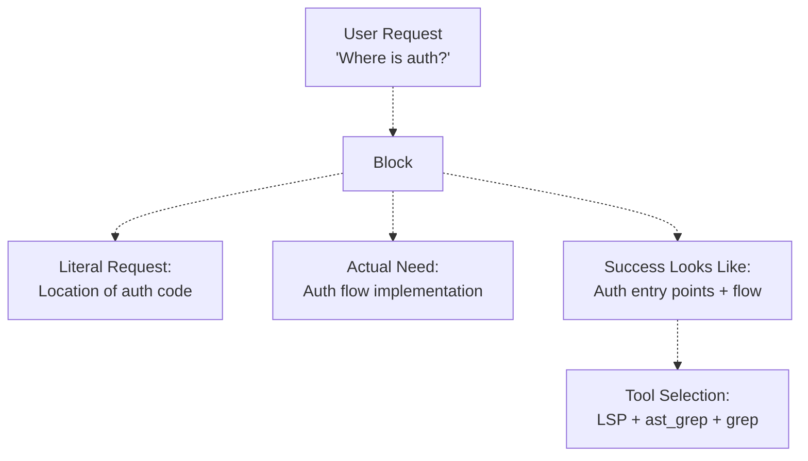
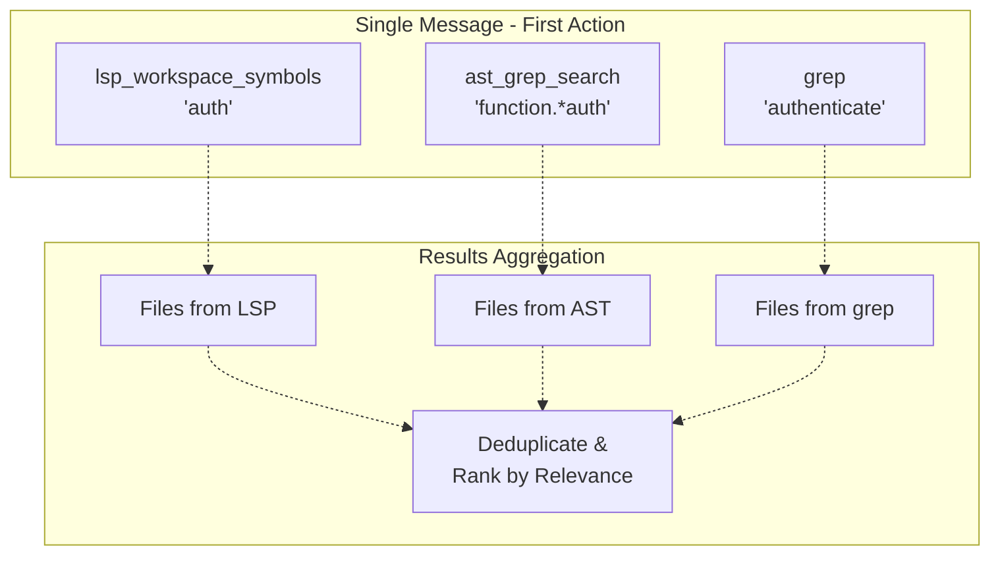
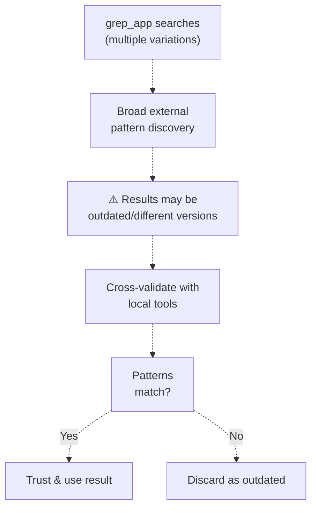
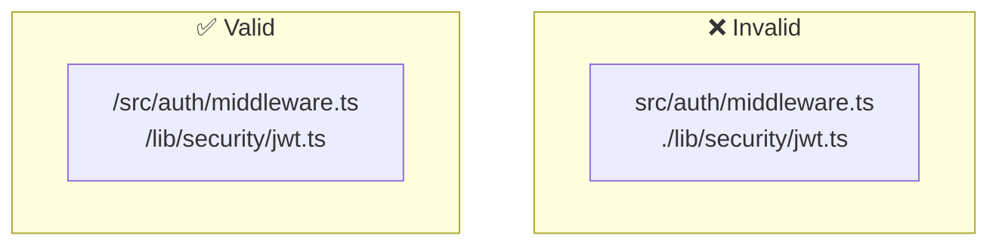
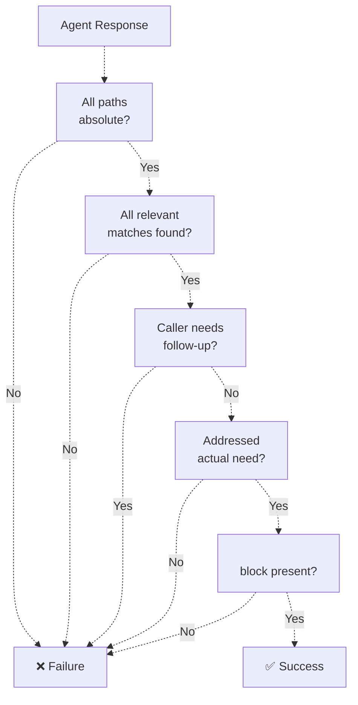
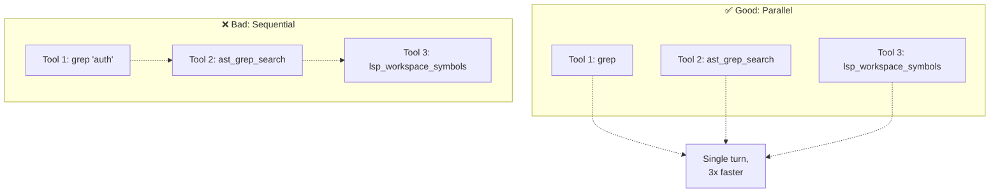
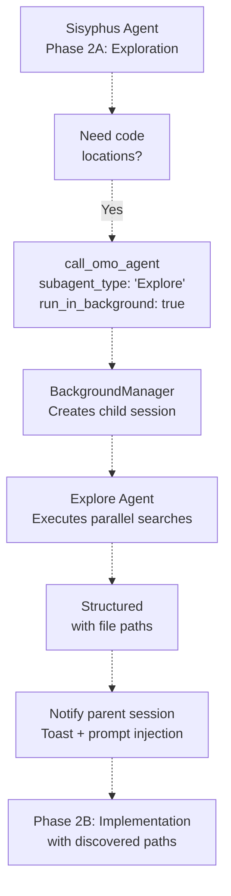

# Explore Agent

> **Relevant source files**
> * [src/agents/document-writer.ts](https://github.com/code-yeongyu/oh-my-opencode/blob/b92cd6ab/src/agents/document-writer.ts)
> * [src/agents/explore.ts](https://github.com/code-yeongyu/oh-my-opencode/blob/b92cd6ab/src/agents/explore.ts)
> * [src/agents/frontend-ui-ux-engineer.ts](https://github.com/code-yeongyu/oh-my-opencode/blob/b92cd6ab/src/agents/frontend-ui-ux-engineer.ts)
> * [src/agents/librarian.ts](https://github.com/code-yeongyu/oh-my-opencode/blob/b92cd6ab/src/agents/librarian.ts)
> * [src/agents/multimodal-looker.ts](https://github.com/code-yeongyu/oh-my-opencode/blob/b92cd6ab/src/agents/multimodal-looker.ts)
> * [src/agents/oracle.ts](https://github.com/code-yeongyu/oh-my-opencode/blob/b92cd6ab/src/agents/oracle.ts)

## Purpose and Scope

The Explore Agent is a specialized read-only agent designed for codebase search and discovery operations. It answers questions like "Where is X implemented?", "Which files contain Y?", and "Find the code that does Z" by executing parallel tool searches and returning structured, actionable results. The agent operates as a subagent with no write capabilities, focusing exclusively on finding and analyzing code locations.

For the broader agent orchestration system, see [Agent System](../agents/). For other specialized agents like Librarian (external research) and Oracle (architecture decisions), see [Specialized Agents](/code-yeongyu/oh-my-opencode/4.2-specialized-agents).

**Sources:** [src/agents/explore.ts L1-L106](https://github.com/code-yeongyu/oh-my-opencode/blob/b92cd6ab/src/agents/explore.ts#L1-L106)

## Agent Configuration

The Explore Agent is configured through the `createExploreAgent` function with the following characteristics:

| Property | Value | Purpose |
| --- | --- | --- |
| **Model** | `opencode/grok-code` (default) | Grok optimized for code understanding |
| **Mode** | `subagent` | Operates as delegated task executor |
| **Temperature** | `0.1` | Deterministic, consistent results |
| **Tools Access** | Read-only | No write, edit, or background_task capabilities |
| **Description** | Contextual grep for codebases | Auto-invoked for location queries |

The agent can be invoked with thoroughness specifications: `"quick"` for basic searches, `"medium"` for moderate analysis, and `"very thorough"` for comprehensive exploration.

**Sources:** [src/agents/explore.ts L1-L12](https://github.com/code-yeongyu/oh-my-opencode/blob/b92cd6ab/src/agents/explore.ts#L1-L12)

## Intent Analysis Workflow

### Required Pre-Search Analysis

Before executing any search operations, the Explore Agent MUST wrap its analysis in `<analysis>` tags to clarify the actual need behind the literal request:



**Analysis Structure**

The analysis block must include three mandatory elements:

```javascript
<analysis>
**Literal Request**: [What they literally asked]
**Actual Need**: [What they're really trying to accomplish]
**Success Looks Like**: [What result would let them proceed immediately]
</analysis>
```

This disambiguation step ensures the agent addresses the underlying need rather than just the surface-level query, preventing unnecessary follow-up questions.

**Sources:** [src/agents/explore.ts L26-L33](https://github.com/code-yeongyu/oh-my-opencode/blob/b92cd6ab/src/agents/explore.ts#L26-L33)

## Parallel Execution Requirements

### Mandatory Parallelism

The Explore Agent enforces **3+ simultaneous tool calls** in its first action. Sequential execution is only permitted when output explicitly depends on prior results.



**Rationale:** Parallel execution maximizes search coverage and reduces total latency. The agent's read-only nature eliminates ordering dependencies for most operations.

**Sources:** [src/agents/explore.ts L35-L36](https://github.com/code-yeongyu/oh-my-opencode/blob/b92cd6ab/src/agents/explore.ts#L35-L36)

## Tool Selection Strategy

The agent selects tools based on the search pattern type, following a decision matrix:

| Search Pattern | Primary Tool | Secondary Tools | Use Case |
| --- | --- | --- | --- |
| **Semantic** (definitions, references) | LSP tools | `lsp_goto_definition`, `lsp_find_references` | Finding where symbols are defined/used |
| **Structural** (function shapes, class structures) | `ast_grep_search` | `grep` for validation | Pattern matching AST nodes |
| **Text** (strings, comments, logs) | `grep` | `lsp_workspace_symbols` | Literal text search |
| **File patterns** (name/extension) | `glob` | N/A | Finding files by pattern |
| **History** (when added, who changed) | git commands | `git log`, `git blame` | Evolution analysis |
| **External examples** | `grep_app` | Cross-validate with local tools | How others implement patterns |

### grep_app Special Handling

The `grep_app` tool searches millions of public GitHub repositories but requires special treatment:



**Critical Rule:** Always launch multiple `grep_app` calls with query variations in parallel, then cross-validate results with local tools (`grep`, `ast_grep_search`, LSP) before trusting them.

**Sources:** [src/agents/explore.ts L84-L101](https://github.com/code-yeongyu/oh-my-opencode/blob/b92cd6ab/src/agents/explore.ts#L84-L101)

## Structured Output Format

### Mandatory Results Block

Every response MUST end with a `<results>` block containing three structured sections:

```xml
<results>
<files>
- /absolute/path/to/file1.ts — [why this file is relevant]
- /absolute/path/to/file2.ts — [why this file is relevant]
</files>

<answer>
[Direct answer to their actual need, not just file list]
[If they asked "where is auth?", explain the auth flow you found]
</answer>

<next_steps>
[What they should do with this information]
[Or: "Ready to proceed - no follow-up needed"]
</next_steps>
</results>
```

### Path Requirements

**All file paths MUST be absolute** (starting with `/`). Relative paths are considered a failure condition.



**Sources:** [src/agents/explore.ts L38-L56](https://github.com/code-yeongyu/oh-my-opencode/blob/b92cd6ab/src/agents/explore.ts#L38-L56)

## Success Criteria and Failure Conditions

### Success Criteria Table

| Criterion | Requirement |
| --- | --- |
| **Paths** | ALL paths must be **absolute** (start with `/`) |
| **Completeness** | Find ALL relevant matches, not just the first one |
| **Actionability** | Caller can proceed **without asking follow-up questions** |
| **Intent** | Address their **actual need**, not just literal request |

### Failure Detection

The response has **FAILED** if any of the following conditions are true:



**Example Failure Indicators:**

* Any path is relative (not absolute)
* Missed obvious matches in the codebase
* Caller needs to ask "but where exactly?" or "what about X?"
* Only answered the literal question, not the underlying need
* No `<results>` block with structured output

**Sources:** [src/agents/explore.ts L58-L74](https://github.com/code-yeongyu/oh-my-opencode/blob/b92cd6ab/src/agents/explore.ts#L58-L74)

## Constraints and Anti-Patterns

### Hard Constraints

The Explore Agent operates under strict read-only constraints:

| Constraint | Reason |
| --- | --- |
| **No write operations** | `tools: { write: false }` - Search agent cannot modify code |
| **No edit operations** | `tools: { edit: false }` - Prevents unintended modifications |
| **No background tasks** | `tools: { background_task: false }` - Avoid recursive spawning |
| **No emojis in output** | Keep output clean and parseable |
| **No file creation** | Report findings as message text only |

### Anti-Pattern: Sequential Execution



**Sources:** [src/agents/explore.ts L76-L81](https://github.com/code-yeongyu/oh-my-opencode/blob/b92cd6ab/src/agents/explore.ts#L76-L81)

## Integration with Agent System

### Invocation by Sisyphus

Sisyphus invokes the Explore Agent during Phase 2A (Exploration & Research) with parallel background execution:



### Access Pattern Comparison

| Agent | LSP | AST-Grep | grep_app | Write | Edit | Background Task |
| --- | --- | --- | --- | --- | --- | --- |
| **Explore** | ✅ Yes | ✅ Yes | ✅ Yes | ❌ No | ❌ No | ❌ No |
| **Librarian** | ❌ No | ❌ No | ✅ Yes | ❌ No | ❌ No | ❌ No |
| **Oracle** | ✅ Yes | ✅ Yes | ❌ No | ❌ No | ❌ No | ❌ No |
| **Sisyphus** | ✅ Yes | ✅ Yes | ✅ Yes | ✅ Yes | ✅ Yes | ✅ Yes |

**Key Distinctions:**

* **Explore vs Librarian:** Explore searches *local* codebase with LSP/AST tools; Librarian searches *external* documentation and GitHub repos
* **Explore vs Oracle:** Explore finds locations; Oracle provides architectural reasoning (no external search access)
* **Explore vs Sisyphus:** Explore is read-only subagent; Sisyphus has full write/edit capabilities

**Sources:** [src/agents/explore.ts L1-L106](https://github.com/code-yeongyu/oh-my-opencode/blob/b92cd6ab/src/agents/explore.ts#L1-L106)

 High-Level Diagram 3 (Agent Orchestration), High-Level Diagram 5 (Tool Ecosystem)

## Code Location Reference

The Explore Agent implementation is located in a single file:

```
src/agents/explore.ts
├── createExploreAgent(model)  [5-103]
│   ├── Agent configuration
│   ├── System prompt with workflow rules
│   └── Tool access restrictions
└── exploreAgent (default export) [105]
```

The agent factory system loads it via:

```
src/agents/builtin-agents.ts
└── Creates explore agent with model override
```

**Sources:** [src/agents/explore.ts L1-L106](https://github.com/code-yeongyu/oh-my-opencode/blob/b92cd6ab/src/agents/explore.ts#L1-L106)