# GitHub Workflow Integration

> **Relevant source files**
> * [.github/assets/sisyphus.png](https://github.com/code-yeongyu/oh-my-opencode/blob/b92cd6ab/.github/assets/sisyphus.png)
> * [.github/workflows/sisyphus-agent.yml](https://github.com/code-yeongyu/oh-my-opencode/blob/b92cd6ab/.github/workflows/sisyphus-agent.yml)
> * [src/agents/index.ts](https://github.com/code-yeongyu/oh-my-opencode/blob/b92cd6ab/src/agents/index.ts)
> * [src/agents/sisyphus.ts](https://github.com/code-yeongyu/oh-my-opencode/blob/b92cd6ab/src/agents/sisyphus.ts)
> * [src/agents/types.ts](https://github.com/code-yeongyu/oh-my-opencode/blob/b92cd6ab/src/agents/types.ts)
> * [src/agents/utils.test.ts](https://github.com/code-yeongyu/oh-my-opencode/blob/b92cd6ab/src/agents/utils.test.ts)
> * [src/agents/utils.ts](https://github.com/code-yeongyu/oh-my-opencode/blob/b92cd6ab/src/agents/utils.ts)
> * [src/cli/run/completion.test.ts](https://github.com/code-yeongyu/oh-my-opencode/blob/b92cd6ab/src/cli/run/completion.test.ts)
> * [src/cli/run/completion.ts](https://github.com/code-yeongyu/oh-my-opencode/blob/b92cd6ab/src/cli/run/completion.ts)
> * [src/cli/run/events.test.ts](https://github.com/code-yeongyu/oh-my-opencode/blob/b92cd6ab/src/cli/run/events.test.ts)
> * [src/cli/run/events.ts](https://github.com/code-yeongyu/oh-my-opencode/blob/b92cd6ab/src/cli/run/events.ts)
> * [src/cli/run/index.ts](https://github.com/code-yeongyu/oh-my-opencode/blob/b92cd6ab/src/cli/run/index.ts)
> * [src/cli/run/runner.ts](https://github.com/code-yeongyu/oh-my-opencode/blob/b92cd6ab/src/cli/run/runner.ts)
> * [src/cli/run/types.ts](https://github.com/code-yeongyu/oh-my-opencode/blob/b92cd6ab/src/cli/run/types.ts)

## Purpose and Scope

This document describes Sisyphus's specialized workflow for GitHub Actions integration, enabling automated repository work through issue and PR comments. When users mention `@sisyphus-dev-ai` in GitHub issues or pull requests, the system automatically investigates, implements, verifies, and creates pull requests.

This page focuses on the GitHub Actions trigger mechanism, environment configuration, and special prompt context. For Sisyphus's general workflow phases, see [Workflow Phases](/code-yeongyu/oh-my-opencode/4.1.1-workflow-phases). For todo-based task tracking used during execution, see [Todo Management](/code-yeongyu/oh-my-opencode/4.1.2-todo-management). For the general CLI run command behavior, see [CLI Run Command](/code-yeongyu/oh-my-opencode/10.2-cli-run-command).

---

## Trigger Mechanism

The GitHub Actions workflow activates on two event types: manual `workflow_dispatch` or `issue_comment` events containing the `@sisyphus-dev-ai` mention.

### Permission-Based Activation


**Allowed author associations:**

* `OWNER`: Repository owner
* `MEMBER`: Organization member
* `COLLABORATOR`: Repository collaborator

The workflow explicitly excludes self-mentions to prevent infinite loops when sisyphus-dev-ai comments on its own work.

Sources: [.github/workflows/sisyphus-agent.yml L17-L22](https://github.com/code-yeongyu/oh-my-opencode/blob/b92cd6ab/.github/workflows/sisyphus-agent.yml#L17-L22)

### Context Collection

The workflow determines whether the comment is on an issue or pull request by querying the GitHub API:

| Context Type | Detection Method | Output Variables |
| --- | --- | --- |
| Pull Request | `gh api "repos/$REPO/issues/${ISSUE_NUM}"` with `.pull_request` field present | `type=pr`, `number=${ISSUE_NUM}` |
| Issue | Same API call, `.pull_request` field absent | `type=issue`, `number=${ISSUE_NUM}` |

Additional collected context:

* `comment`: Full comment body
* `author`: Comment author username
* `comment_id`: Comment ID for reactions

Sources: [.github/workflows/sisyphus-agent.yml L230-L261](https://github.com/code-yeongyu/oh-my-opencode/blob/b92cd6ab/.github/workflows/sisyphus-agent.yml#L230-L261)

---

## Environment Setup

The workflow constructs a complete oh-my-opencode environment from scratch on each run, ensuring consistent configuration.

### Build and Installation Pipeline


**Key configuration steps:**

1. **Build local oh-my-opencode**: Ensures workflow uses latest code from the current commit
2. **Install OpenCode SDK**: Attempts default installer, falls back to pinned version 1.0.204 if download fails
3. **Run local install**: Uses built `dist/cli/index.js` with `--no-tui --claude=max20 --chatgpt=no --gemini=no`
4. **Override plugin path**: Replaces npm package reference with direct file reference to `src/index.ts`

Sources: [.github/workflows/sisyphus-agent.yml L72-L113](https://github.com/code-yeongyu/oh-my-opencode/blob/b92cd6ab/.github/workflows/sisyphus-agent.yml#L72-L113)

### Model Configuration Override

The workflow configures custom Anthropic models with extended thinking capabilities:


The configuration uses `jq` to surgically modify `~/.config/opencode/opencode.json`, preserving all other settings while injecting custom models.

Sources: [.github/workflows/sisyphus-agent.yml L115-L155](https://github.com/code-yeongyu/oh-my-opencode/blob/b92cd6ab/.github/workflows/sisyphus-agent.yml#L115-L155)

---

## Prompt Context Injection

Sisyphus receives specialized instructions when running in GitHub Actions, fundamentally changing its behavior from interactive console sessions to GitHub comment-based interactions.

### Environment Context Structure

The workflow injects two context layers:

**Layer 1: Standard Environment Context** (always injected)

```
// Generated by createEnvContext() in src/agents/utils.ts
`
Working directory: ${directory}
Platform: ${platform}
Today's date: ${dateStr} (NOT 2024, NEVEREVER 2024)
Current time: ${timeStr}
Timezone: ${timezone}
Locale: ${locale}
`
```

**Layer 2: GitHub Actions Context** (workflow-specific)

The workflow appends comprehensive GitHub-specific instructions via the `prompt_append` field in `~/.config/opencode/oh-my-opencode.json`:


**Critical behavioral changes:**

| Standard Session | GitHub Actions Session |
| --- | --- |
| Output to console visible to user | User CANNOT see console |
| File edits persist in workspace | Must post results via `gh issue comment` or `gh pr comment` |
| Interactive responses expected | All communication through GitHub comments |
| Can use plain backticks in responses | MUST use heredoc syntax for shell safety |

Sources: [.github/workflows/sisyphus-agent.yml L157-L222](https://github.com/code-yeongyu/oh-my-opencode/blob/b92cd6ab/.github/workflows/sisyphus-agent.yml#L157-L222)

 [src/agents/utils.ts L32-L63](https://github.com/code-yeongyu/oh-my-opencode/blob/b92cd6ab/src/agents/utils.ts#L32-L63)

### Heredoc Requirement

The workflow enforces heredoc syntax for all GitHub comments to prevent shell interpretation issues:

```markdown
# WRONG - backticks disappear due to command substitution
gh issue comment 123 --body "text with `code`"

# CORRECT - backticks preserved via heredoc
gh issue comment 123 --body "$(cat <<'EOF'
text with `code`
EOF
)"
```

This requirement is documented in [.github/workflows/sisyphus-agent.yml L169-L190](https://github.com/code-yeongyu/oh-my-opencode/blob/b92cd6ab/.github/workflows/sisyphus-agent.yml#L169-L190)

---

## Prompt Construction

The workflow constructs the final prompt by combining static templates with runtime context:

```mermaid
flowchart TD

Template["Static Prompt Template<br>(lines 305-322)"]
Author["AUTHOR_PLACEHOLDER<br>→ $COMMENT_AUTHOR"]
Repo["REPO_PLACEHOLDER<br>→ $REPO_NAME"]
Type["TYPE_PLACEHOLDER<br>→ pr or issue"]
Number["NUMBER_PLACEHOLDER<br>→ Issue/PR number"]
Branch["BRANCH_PLACEHOLDER<br>→ $DEFAULT_BRANCH"]
Comment["COMMENT_PLACEHOLDER<br>→ $USER_COMMENT"]
FinalPrompt["Final Prompt String"]

Template -.-> Author
Template -.-> Repo
Template -.-> Type
Template -.-> Number
Template -.-> Branch
Template -.-> Comment
Author -.-> FinalPrompt
Repo -.-> FinalPrompt
Type -.-> FinalPrompt
Number -.-> FinalPrompt
Branch -.-> FinalPrompt
Comment -.-> FinalPrompt

subgraph subGraph0 ["Variable Substitution"]
    Author
    Repo
    Type
    Number
    Branch
    Comment
end
```



**Template structure:**

```sql
Your username is @sisyphus-dev-ai, mentioned by @AUTHOR_PLACEHOLDER in REPO_PLACEHOLDER.

## Context
- Type: TYPE_PLACEHOLDER
- Number: #NUMBER_PLACEHOLDER
- Repository: REPO_PLACEHOLDER
- Default Branch: BRANCH_PLACEHOLDER

## User's Request
COMMENT_PLACEHOLDER

---

Write everything using the todo tools.
Then investigate and satisfy the request. Only if user requested to you to work explicitely, then use plan agent to plan, todo obsessivley then create a PR to `BRANCH_PLACEHOLDER` branch.
When done, report the result to the issue/PR with `gh issue comment NUMBER_PLACEHOLDER` or `gh pr comment NUMBER_PLACEHOLDER`.
```

The template explicitly instructs Sisyphus to:

1. Use todo tools for all work tracking
2. Investigate thoroughly
3. Create PR to default branch when work is requested
4. Report completion via GitHub comments

Sources: [.github/workflows/sisyphus-agent.yml L305-L330](https://github.com/code-yeongyu/oh-my-opencode/blob/b92cd6ab/.github/workflows/sisyphus-agent.yml#L305-L330)

---

## Pattern Recognition in Sisyphus

Sisyphus's prompt contains specific pattern recognition for GitHub workflow requests:

### Trigger Phrases

| Phrase Pattern | Interpretation | Expected Outcome |
| --- | --- | --- |
| `@sisyphus look into X` | Full work cycle | Investigate + implement + verify + PR |
| `look into X and create PR` | Explicit work request | Complete implementation with PR |
| `investigate Y and make PR` | Explicit work request | Complete implementation with PR |
| Mentioned in issue comment | Context-dependent | Investigation or full work based on request |

**Critical distinction:** In GitHub Actions context, "look into" does NOT mean "just investigate and report back." It means "investigate, understand, implement a solution, and create a PR."

Sources: [src/agents/sisyphus.ts L264-L296](https://github.com/code-yeongyu/oh-my-opencode/blob/b92cd6ab/src/agents/sisyphus.ts#L264-L296)

### Required Workflow Steps


Each step has specific verification requirements:

| Step | Evidence Required |
| --- | --- |
| Investigate | Root cause identified, scope documented |
| Implement | `lsp_diagnostics` clean on changed files |
| Verify | Build passes (exit code 0), tests pass |
| Create PR | PR created with issue reference, meaningful description |

Sources: [src/agents/sisyphus.ts L276-L293](https://github.com/code-yeongyu/oh-my-opencode/blob/b92cd6ab/src/agents/sisyphus.ts#L276-L293)

---

## CLI Run Command Execution

The workflow invokes the oh-my-opencode CLI run command, which manages session lifecycle and completion detection.

### Execution Flow


The runner uses a 500ms polling interval to check session state, balancing responsiveness with API load.

Sources: [src/cli/run/runner.ts L10-L121](https://github.com/code-yeongyu/oh-my-opencode/blob/b92cd6ab/src/cli/run/runner.ts#L10-L121)

 [src/cli/run/events.ts L34-L62](https://github.com/code-yeongyu/oh-my-opencode/blob/b92cd6ab/src/cli/run/events.ts#L34-L62)

### Event Processing

The CLI monitors multiple event types to track progress:


**Key state transitions:**

* `session.idle` + `mainSessionIdle=true` → Trigger completion check
* `session.status` with `type=busy` → Reset `mainSessionIdle=false`
* `session.error` → Set `mainSessionError=true`, exit with code 1
* `message.part.updated` → Stream text to stdout in real-time

Sources: [src/cli/run/events.ts L14-L31](https://github.com/code-yeongyu/oh-my-opencode/blob/b92cd6ab/src/cli/run/events.ts#L14-L31)

 [src/cli/run/events.ts L133-L220](https://github.com/code-yeongyu/oh-my-opencode/blob/b92cd6ab/src/cli/run/events.ts#L133-L220)

---

## Completion Detection

The CLI uses a two-tier completion check to ensure all work finishes before exiting.

### Completion Criteria


**Todo status filtering:**

```javascript
// From src/cli/run/completion.ts:25-27
const incompleteTodos = todos.filter(
  (t) => t.status !== "completed" && t.status !== "cancelled"
)
```

Only `completed` and `cancelled` todos are considered finished. Todos with status `in_progress`, `pending`, or any other value block completion.

**Child session recursion:**

The completion check recursively validates all descendant sessions (children, grandchildren, etc.) to ensure background tasks spawned by Sisyphus have finished:

```typescript
// Recursive validation pattern
async function areAllDescendantsIdle(
  ctx: RunContext,
  sessionID: string,
  allStatuses: Record<string, SessionStatus>
): Promise<boolean> {
  const children = await ctx.client.session.children({ path: { id: sessionID } })
  
  for (const child of children) {
    const status = allStatuses[child.id]
    if (status && status.type !== "idle") {
      return false  // Child still working
    }
    
    // Recursively check grandchildren
    const descendantsIdle = await areAllDescendantsIdle(ctx, child.id, allStatuses)
    if (!descendantsIdle) {
      return false
    }
  }
  
  return true
}
```

This ensures that parallel background tasks launched via `background_task` (see [Background Task Tools](/code-yeongyu/oh-my-opencode/5.3-background-task-tools)) complete before the workflow exits.

Sources: [src/cli/run/completion.ts L4-L79](https://github.com/code-yeongyu/oh-my-opencode/blob/b92cd6ab/src/cli/run/completion.ts#L4-L79)

### Exit Codes

| Exit Code | Condition | Meaning |
| --- | --- | --- |
| 0 | All todos complete + all sessions idle | Success |
| 1 | `session.error` event received | API error or internal failure |
| 1 | Completion check API error | Cannot verify completion status |
| 130 | SIGINT (Ctrl+C) or timeout | Interrupted by user or timeout |

Sources: [src/cli/run/runner.ts L10-L121](https://github.com/code-yeongyu/oh-my-opencode/blob/b92cd6ab/src/cli/run/runner.ts#L10-L121)

 [src/cli/run/events.ts L159-L173](https://github.com/code-yeongyu/oh-my-opencode/blob/b92cd6ab/src/cli/run/events.ts#L159-L173)

---

## Post-Execution Steps

After the CLI run completes, the workflow performs cleanup and status updates.

### Git Operations


**Branch protection:**

* Changes are committed with message `"chore: changes by sisyphus-dev-ai"`
* Push occurs ONLY if branch is not `main` or `master`
* This forces PRs for all substantive changes, preventing direct commits to protected branches

Sources: [.github/workflows/sisyphus-agent.yml L335-L348](https://github.com/code-yeongyu/oh-my-opencode/blob/b92cd6ab/.github/workflows/sisyphus-agent.yml#L335-L348)

### Reaction and Label Updates

The workflow uses GitHub API to provide visual feedback:

**Reactions:**

| Phase | Reaction | Purpose |
| --- | --- | --- |
| Start | 👀 (eyes) | Acknowledge receipt |
| Complete | 👍 (+1) | Signal completion |

The workflow removes the 👀 reaction before adding 👍 to provide clear state progression.

**Labels:**

| Label | Color | Description | Applied When |
| --- | --- | --- | --- |
| `sisyphus: working` | `#fcf2e1` | Sisyphus is currently working on this | After eyes reaction added |
| (removed) | - | - | After completion |

Label operations use `gh` CLI:

* `gh label create --force` ensures label exists
* `gh pr edit --add-label` or `gh issue edit --add-label` applies to item
* `gh pr edit --remove-label` or `gh issue edit --remove-label` cleans up

All operations include `|| true` to prevent failures from blocking workflow completion.

Sources: [.github/workflows/sisyphus-agent.yml L263-L376](https://github.com/code-yeongyu/oh-my-opencode/blob/b92cd6ab/.github/workflows/sisyphus-agent.yml#L263-L376)

---

## Code Entity Reference

### Key Files and Functions

| Component | File Path | Key Functions/Steps |
| --- | --- | --- |
| Workflow definition | `.github/workflows/sisyphus-agent.yml` | `agent` job with 11 steps |
| Environment context | `src/agents/utils.ts:32-63` | `createEnvContext(directory)` |
| Agent creation | `src/agents/utils.ts:79-112` | `createBuiltinAgents()` with prompt_append merge |
| Sisyphus workflow | `src/agents/sisyphus.ts:264-296` | GitHub Workflow section in prompt |
| CLI runner | `src/cli/run/runner.ts:10-121` | `run(options: RunOptions)` |
| Event processor | `src/cli/run/events.ts:34-62` | `processEvents()` with state updates |
| Completion check | `src/cli/run/completion.ts:4-79` | `checkCompletionConditions()` |

### GitHub Actions Steps

| Step Name | Lines | Purpose |
| --- | --- | --- |
| Configure Git as sisyphus-dev-ai | 36-39 | Set git identity |
| Authenticate gh CLI as sisyphus-dev-ai | 42-45 | Enable gh commands |
| Build oh-my-opencode | 73-76 | Compile TypeScript |
| Setup OpenCode with oh-my-opencode | 79-228 | Install + configure all components |
| Collect Context | 231-261 | Determine issue vs PR, extract metadata |
| Add eyes reaction | 264-270 | Acknowledge receipt |
| Add working label | 272-291 | Visual progress indicator |
| Run oh-my-opencode | 293-332 | Execute Sisyphus with constructed prompt |
| Push changes | 335-348 | Commit and push if on feature branch |
| Update reaction and remove label | 350-376 | Signal completion |

Sources: [.github/workflows/sisyphus-agent.yml L1-L377](https://github.com/code-yeongyu/oh-my-opencode/blob/b92cd6ab/.github/workflows/sisyphus-agent.yml#L1-L377)