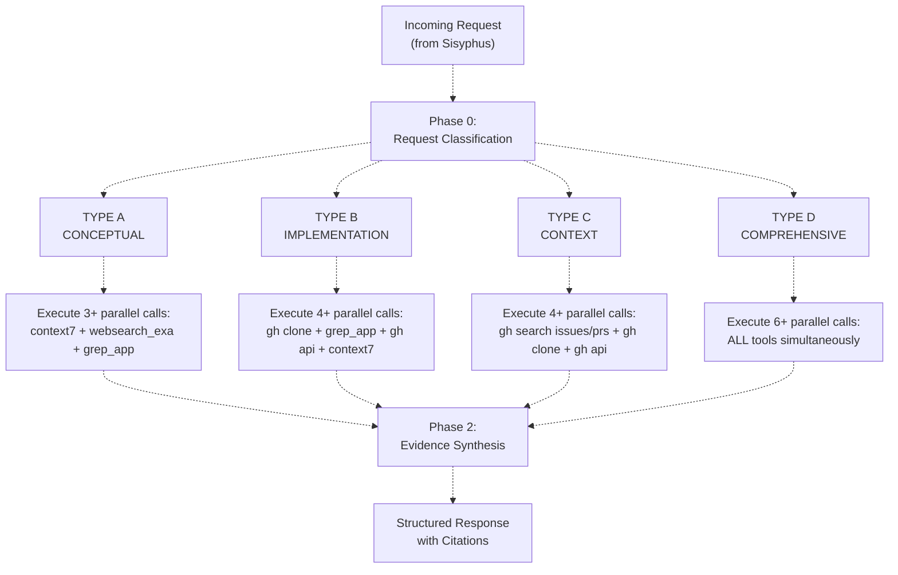
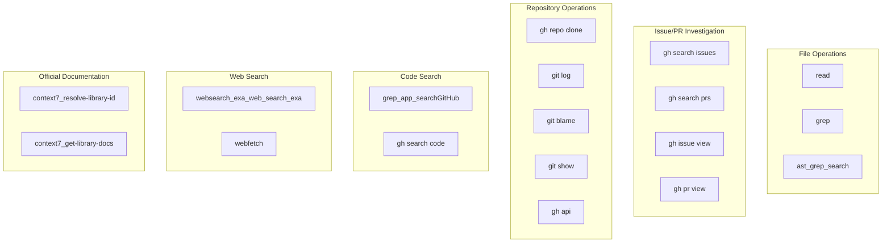
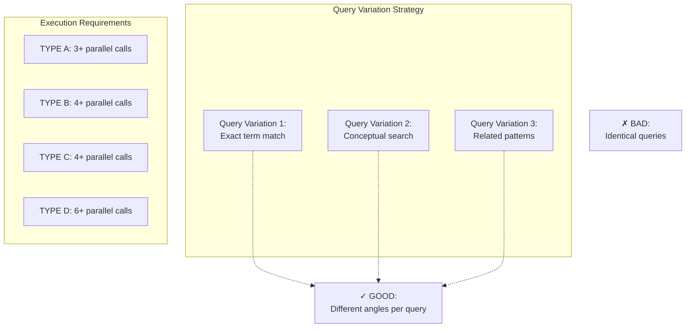
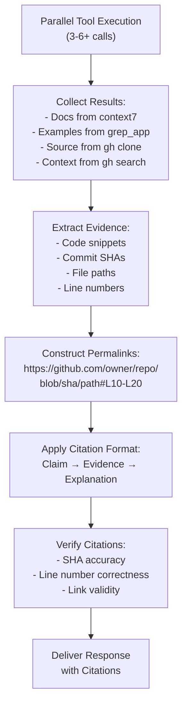
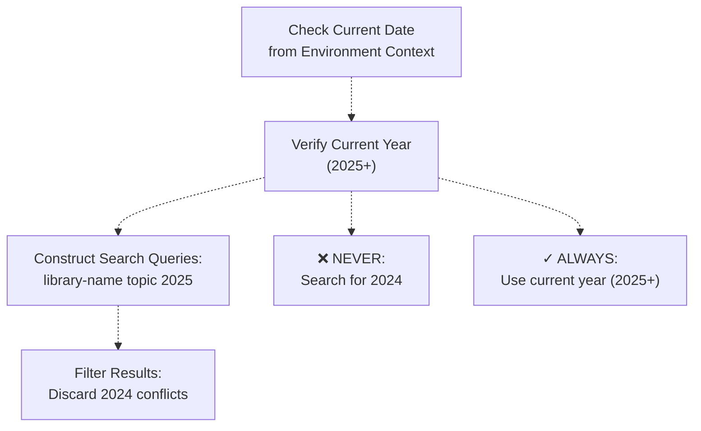
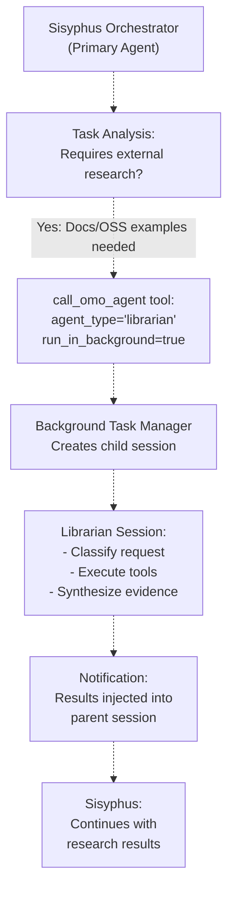

# Librarian Agent

> **Relevant source files**
> * [src/agents/document-writer.ts](https://github.com/code-yeongyu/oh-my-opencode/blob/b92cd6ab/src/agents/document-writer.ts)
> * [src/agents/explore.ts](https://github.com/code-yeongyu/oh-my-opencode/blob/b92cd6ab/src/agents/explore.ts)
> * [src/agents/frontend-ui-ux-engineer.ts](https://github.com/code-yeongyu/oh-my-opencode/blob/b92cd6ab/src/agents/frontend-ui-ux-engineer.ts)
> * [src/agents/librarian.ts](https://github.com/code-yeongyu/oh-my-opencode/blob/b92cd6ab/src/agents/librarian.ts)
> * [src/agents/multimodal-looker.ts](https://github.com/code-yeongyu/oh-my-opencode/blob/b92cd6ab/src/agents/multimodal-looker.ts)
> * [src/agents/oracle.ts](https://github.com/code-yeongyu/oh-my-opencode/blob/b92cd6ab/src/agents/oracle.ts)

## Purpose and Scope

The Librarian Agent is a specialized research agent designed for external knowledge acquisition and multi-repository analysis. It handles requests that require information from outside the current codebase, including official documentation lookups, open-source code examples, library internals, and GitHub repository searches.

This page documents the Librarian's request classification system, tool execution strategies, citation requirements, and integration patterns. For information about the primary orchestrator that delegates to the Librarian, see [Sisyphus Orchestrator](/code-yeongyu/oh-my-opencode/4.1-sisyphus-orchestrator). For internal codebase searches, see [Explore Agent](/code-yeongyu/oh-my-opencode/4.2.3-explore-agent). For architectural guidance and code analysis, see [Oracle Agent](/code-yeongyu/oh-my-opencode/4.2.1-oracle-agent).

## Agent Configuration

The Librarian Agent is created by the `createLibrarianAgent()` factory function and configured with the following characteristics:

| Property | Value | Purpose |
| --- | --- | --- |
| **Model** | `anthropic/claude-sonnet-4-5` | Balanced performance for research tasks |
| **Mode** | `subagent` | Invoked by Sisyphus, not directly by user |
| **Temperature** | `0.1` | Low temperature for factual, consistent responses |
| **Write Access** | Disabled | Read-only agent, cannot modify code |
| **Edit Access** | Disabled | Cannot perform code edits |
| **Background Tasks** | Disabled | Prevents recursive spawning |

The agent is described as: "Specialized codebase understanding agent for multi-repository analysis, searching remote codebases, retrieving official documentation, and finding implementation examples using GitHub CLI, Context7, and Web Search."

**Sources:** [src/agents/librarian.ts L1-L12](https://github.com/code-yeongyu/oh-my-opencode/blob/b92cd6ab/src/agents/librarian.ts#L1-L12)

## Request Classification System

The Librarian employs a mandatory request classification phase before executing any searches. Every incoming request must be classified into one of four types, each with distinct tool execution strategies and parallel execution requirements.

### Classification Workflow



**Sources:** [src/agents/librarian.ts L29-L39](https://github.com/code-yeongyu/oh-my-opencode/blob/b92cd6ab/src/agents/librarian.ts#L29-L39)

### Request Type Definitions

#### TYPE A: CONCEPTUAL

**Trigger Examples:** "How do I use X?", "Best practice for Y?", "What is Z?"

**Characteristics:** User needs high-level understanding or usage patterns rather than specific implementation details.

**Tool Strategy:**

* `context7_resolve-library-id()` followed by `context7_get-library-docs()`
* `websearch_exa_web_search_exa()` with current year filter (2025+)
* `grep_app_searchGitHub()` for real-world usage patterns

**Minimum Parallel Calls:** 3+

**Sources:** [src/agents/librarian.ts L44-L56](https://github.com/code-yeongyu/oh-my-opencode/blob/b92cd6ab/src/agents/librarian.ts#L44-L56)

#### TYPE B: IMPLEMENTATION

**Trigger Examples:** "How does X implement Y?", "Show me source of Z", "Internal logic of..."

**Characteristics:** User needs to examine actual source code and understand implementation details.

**Tool Strategy:**

1. `gh repo clone` to temporary directory (`${TMPDIR:-/tmp}/repo-name`)
2. `git rev-parse HEAD` to obtain commit SHA for permalinks
3. `grep` or `ast_grep_search` to locate code
4. `read` to examine specific files
5. `git blame` for authorship context

**Parallel Acceleration:** Launch `gh repo clone`, `grep_app_searchGitHub()`, `gh api`, and `context7_get-library-docs()` simultaneously (4+ calls)

**Minimum Parallel Calls:** 4+

**Sources:** [src/agents/librarian.ts L59-L86](https://github.com/code-yeongyu/oh-my-opencode/blob/b92cd6ab/src/agents/librarian.ts#L59-L86)

#### TYPE C: CONTEXT & HISTORY

**Trigger Examples:** "Why was this changed?", "What's the history?", "Related issues/PRs?"

**Characteristics:** User needs historical context, decision rationale, or related discussions.

**Tool Strategy:**

* `gh search issues` with repository filter
* `gh search prs` with merged state filter
* `gh repo clone` with depth 50 for history
* `git log --oneline` and `git blame` for file evolution
* `gh api repos/owner/repo/releases` for version context

**Specific Issue/PR Context:**

* `gh issue view <number> --comments`
* `gh pr view <number> --comments`
* `gh api repos/owner/repo/pulls/<number>/files`

**Minimum Parallel Calls:** 4+

**Sources:** [src/agents/librarian.ts L89-L107](https://github.com/code-yeongyu/oh-my-opencode/blob/b92cd6ab/src/agents/librarian.ts#L89-L107)

#### TYPE D: COMPREHENSIVE

**Trigger Examples:** Complex questions, ambiguous requests, "deep dive into..."

**Characteristics:** Request requires multi-angle investigation combining documentation, code search, and contextual analysis.

**Tool Strategy:** Execute ALL tool categories in parallel:

* Documentation & Web: `context7` + `websearch_exa`
* Code Search: Multiple `grep_app_searchGitHub()` calls with varied queries
* Source Analysis: `gh repo clone`
* Context: `gh search issues`

**Minimum Parallel Calls:** 6+

**Sources:** [src/agents/librarian.ts L112-L129](https://github.com/code-yeongyu/oh-my-opencode/blob/b92cd6ab/src/agents/librarian.ts#L112-L129)

## Tool Execution Strategy

The Librarian has access to a specialized tool set optimized for external research. Tool access is restricted compared to Sisyphus to prevent unintended side effects.

### Available Tools by Purpose



**Sources:** [src/agents/librarian.ts L167-L182](https://github.com/code-yeongyu/oh-my-opencode/blob/b92cd6ab/src/agents/librarian.ts#L167-L182)

### Tool Access Restrictions

The Librarian operates under strict constraints to maintain its research-focused role:

| Tool Category | Access | Rationale |
| --- | --- | --- |
| `write` | **Disabled** | Read-only agent, no code modification |
| `edit` | **Disabled** | No code editing capabilities |
| `background_task` | **Disabled** | Prevents recursive agent spawning |
| `bash` | **Enabled** | Required for git/gh operations |
| `read` | **Enabled** | Essential for examining cloned code |

**Sources:** [src/agents/librarian.ts L12](https://github.com/code-yeongyu/oh-my-opencode/blob/b92cd6ab/src/agents/librarian.ts#L12-L12)

### Parallel Execution Requirements

The Librarian is designed for aggressive parallelism to minimize research latency. The system enforces minimum parallel call counts based on request type:



**Query Variation Example** (from prompt):

```
// GOOD: Different angles
grep_app_searchGitHub(query: "useQuery(", language: ["TypeScript"])
grep_app_searchGitHub(query: "queryOptions", language: ["TypeScript"])
grep_app_searchGitHub(query: "staleTime:", language: ["TypeScript"])

// BAD: Same pattern
grep_app_searchGitHub(query: "useQuery")
grep_app_searchGitHub(query: "useQuery")
```

**Sources:** [src/agents/librarian.ts L199-L218](https://github.com/code-yeongyu/oh-my-opencode/blob/b92cd6ab/src/agents/librarian.ts#L199-L218)

## Citation Requirements

The Librarian must provide verifiable evidence for all claims. This is enforced through a mandatory citation format using GitHub permalinks.

### Permalink Construction

Every code reference must use commit-SHA-based permalinks for stability:

```yaml
https://github.com/<owner>/<repo>/blob/<commit-sha>/<filepath>#L<start>-L<end>
```

**Methods for Obtaining SHA:**

* From clone: `git rev-parse HEAD`
* From API: `gh api repos/owner/repo/commits/HEAD --jq '.sha'`
* From tag: `gh api repos/owner/repo/git/refs/tags/v1.0.0 --jq '.object.sha'`

### Mandatory Citation Format

```javascript
**Claim**: [What you're asserting]

**Evidence** (<FileRef file-url="https://github.com/code-yeongyu/oh-my-opencode/blob/b92cd6ab/source" undefined  file-path="source">Hii</FileRef>):
```typescript
// The actual code
function example() { ... }
```

**Explanation**: This works because [specific reason from the code].

```python
**Sources:** <FileRef file-url="https://github.com/code-yeongyu/oh-my-opencode/blob/b92cd6ab/src/agents/librarian.ts#L133-L163" min=133 max=163 file-path="src/agents/librarian.ts">Hii</FileRef>

### Evidence Synthesis Workflow



**Sources:** [src/agents/librarian.ts L133-L149](https://github.com/code-yeongyu/oh-my-opencode/blob/b92cd6ab/src/agents/librarian.ts#L133-L149)

## Temporary Directory Management

The Librarian clones repositories to OS-appropriate temporary directories to avoid polluting the working directory.

### Cross-Platform Temp Directory Pattern

```
${TMPDIR:-/tmp}/repo-name
```

**Platform-Specific Resolution:**

* **macOS:** `/var/folders/.../T/repo-name` or `/tmp/repo-name`
* **Linux:** `/tmp/repo-name`
* **Windows:** `C:\Users\...\AppData\Local\Temp\repo-name`

**Clone Command Example:**

```
gh repo clone owner/repo ${TMPDIR:-/tmp}/repo-name -- --depth 1
```

The `--depth 1` flag creates a shallow clone to minimize download size and time for TYPE B (Implementation) requests. For TYPE C (Context) requests requiring history, depth is increased to 50.

**Sources:** [src/agents/librarian.ts L184-L195](https://github.com/code-yeongyu/oh-my-opencode/blob/b92cd6ab/src/agents/librarian.ts#L184-L195)

## Date Awareness and Search Filtering

The Librarian includes critical date awareness to prevent outdated information from polluting results.

### Date Filtering Rules



**Enforcement Rules:**

1. Verify current date from environment context before ANY search
2. NEVER search for "2024" - it is outdated
3. ALWAYS use current year (2025+) in search queries
4. Format: `"library-name topic 2025"` NOT `"library-name topic 2024"`
5. Filter out outdated 2024 results when they conflict with 2025 information

**Sources:** [src/agents/librarian.ts L19-L26](https://github.com/code-yeongyu/oh-my-opencode/blob/b92cd6ab/src/agents/librarian.ts#L19-L26)

## Failure Recovery Strategy

The Librarian implements graceful degradation when tools fail or return unexpected results.

### Recovery Actions by Failure Type

| Failure Type | Recovery Action |
| --- | --- |
| **context7 not found** | Clone repo directly, read source + README |
| **grep_app no results** | Broaden query, try conceptual terms instead of exact names |
| **gh API rate limit** | Use cloned repo in temp directory instead of API calls |
| **Repo not found** | Search for forks or mirrors using `gh search repos` |
| **Uncertain** | STATE UNCERTAINTY explicitly, propose hypothesis with caveats |

**Sources:** [src/agents/librarian.ts L222-L230](https://github.com/code-yeongyu/oh-my-opencode/blob/b92cd6ab/src/agents/librarian.ts#L222-L230)

## Communication Rules

The Librarian follows strict communication guidelines to maintain consistency with user expectations:

### Response Guidelines

1. **NO TOOL NAMES**: Say "I'll search the codebase" not "I'll use grep_app"
2. **NO PREAMBLE**: Answer directly, skip "I'll help you with..."
3. **ALWAYS CITE**: Every code claim needs a permalink
4. **USE MARKDOWN**: Code blocks with language identifiers
5. **BE CONCISE**: Facts over opinions, evidence over speculation

**Rationale:** Tool names are implementation details irrelevant to users. Direct answers respect user time. Citations enable verification. Markdown ensures readability. Conciseness maximizes information density.

**Sources:** [src/agents/librarian.ts L234-L241](https://github.com/code-yeongyu/oh-my-opencode/blob/b92cd6ab/src/agents/librarian.ts#L234-L241)

## Integration with Sisyphus

The Librarian is invoked by Sisyphus during the Exploration & Research phase (Phase 2A) when external knowledge is required.

### Delegation Pattern



### Invocation Criteria

Sisyphus delegates to Librarian when:

* User explicitly asks to "look up code in remote repositories"
* User requests "library internals" or "official documentation"
* User seeks "usage examples in open source"
* Task requires understanding external libraries or frameworks
* Implementation reference from public repositories needed

### Background Execution

The Librarian is typically invoked with `run_in_background=true` to enable parallel research while Sisyphus continues with other tasks. This is a key performance optimization for complex workflows.

**Sources:** [src/agents/librarian.ts L1-L8](https://github.com/code-yeongyu/oh-my-opencode/blob/b92cd6ab/src/agents/librarian.ts#L1-L8)

 High-level architecture Diagram 3

## Comparison with Other Research Agents

Understanding the division of responsibilities between the Librarian and related agents clarifies delegation patterns.

| Aspect | Librarian | Explore | Oracle |
| --- | --- | --- | --- |
| **Scope** | External repositories | Current codebase | Advisory only |
| **Primary Tools** | context7, grep_app, gh CLI | LSP, ast_grep, grep | LSP, read |
| **Search Domain** | GitHub, docs, web | Local workspace | Provided context |
| **Output Type** | Code citations with permalinks | File paths with analysis | Architectural guidance |
| **Write Access** | No | No | No |
| **Typical Queries** | "How do OSS projects use X?" | "Where is X in our code?" | "Should we refactor X?" |
| **Background Execution** | Yes (always async) | Yes (always async) | No (blocking) |

**Key Distinction:**

* Use **Librarian** for external knowledge: documentation, OSS examples, library internals
* Use **Explore** for internal navigation: finding code in the current codebase
* Use **Oracle** for reasoning: architectural decisions, complex analysis

**Sources:** [src/agents/librarian.ts L1-L8](https://github.com/code-yeongyu/oh-my-opencode/blob/b92cd6ab/src/agents/librarian.ts#L1-L8)

 [src/agents/explore.ts L1-L8](https://github.com/code-yeongyu/oh-my-opencode/blob/b92cd6ab/src/agents/explore.ts#L1-L8)

 [src/agents/oracle.ts L1-L8](https://github.com/code-yeongyu/oh-my-opencode/blob/b92cd6ab/src/agents/oracle.ts#L1-L8)

## Configuration and Customization

The Librarian Agent can be customized through the `createLibrarianAgent()` factory function.

### Model Override

```javascript
// Default model (Claude Sonnet 4.5)
const librarian = createLibrarianAgent()

// Custom model override
const librarian = createLibrarianAgent("anthropic/claude-opus-4-5")
```

The model parameter accepts any valid model identifier from OpenCode's model registry. The default model (`anthropic/claude-sonnet-4-5`) is chosen for its balance of performance and cost for research tasks.

### Agent Factory Integration

The Librarian is registered through the agent factory system during plugin initialization:

```javascript
const agents = {
  librarian: createLibrarianAgent(config.agentOverrides?.librarian?.model)
}
```

This allows configuration-driven model selection via `oh-my-opencode.json`:

```json
{
  "agentOverrides": {
    "librarian": {
      "model": "anthropic/claude-opus-4-5"
    }
  }
}
```

**Sources:** [src/agents/librarian.ts L1-L12](https://github.com/code-yeongyu/oh-my-opencode/blob/b92cd6ab/src/agents/librarian.ts#L1-L12)

 [src/agents/librarian.ts L245-L246](https://github.com/code-yeongyu/oh-my-opencode/blob/b92cd6ab/src/agents/librarian.ts#L245-L246)

## Usage Examples

### Example 1: Conceptual Query (TYPE A)

**User Request:** "How do I use TanStack Query's staleTime option?"

**Librarian Classification:** TYPE A (Conceptual)

**Parallel Tool Execution:**

1. `context7_resolve-library-id("@tanstack/react-query")`
2. `context7_get-library-docs(id, "staleTime configuration")`
3. `websearch_exa_web_search_exa("TanStack Query staleTime 2025")`
4. `grep_app_searchGitHub(query: "staleTime:", language: ["TypeScript"])`

**Expected Output:** Documentation summary with official docs links, web resources, and real-world usage examples with GitHub permalinks.

### Example 2: Implementation Query (TYPE B)

**User Request:** "Show me how Next.js implements middleware routing"

**Librarian Classification:** TYPE B (Implementation)

**Parallel Tool Execution:**

1. `gh repo clone vercel/next.js ${TMPDIR:-/tmp}/nextjs -- --depth 1`
2. `grep_app_searchGitHub(query: "middleware routing", repo: "vercel/next.js")`
3. `gh api repos/vercel/next.js/commits/HEAD --jq '.sha'`
4. `context7_get-library-docs(id, "middleware")`

**Expected Output:** Source code with GitHub permalinks showing the middleware implementation, with line-specific citations.

### Example 3: Context Query (TYPE C)

**User Request:** "Why did React Router deprecate Switch in v6?"

**Librarian Classification:** TYPE C (Context & History)

**Parallel Tool Execution:**

1. `gh search issues "Switch deprecated" --repo remix-run/react-router`
2. `gh search prs "Switch Routes" --repo remix-run/react-router --state merged`
3. `gh repo clone remix-run/react-router ${TMPDIR:-/tmp}/react-router -- --depth 50`
4. `gh api repos/remix-run/react-router/releases`

**Expected Output:** Historical context with links to issues, PRs, and release notes explaining the deprecation rationale.

**Sources:** [src/agents/librarian.ts L29-L129](https://github.com/code-yeongyu/oh-my-opencode/blob/b92cd6ab/src/agents/librarian.ts#L29-L129)