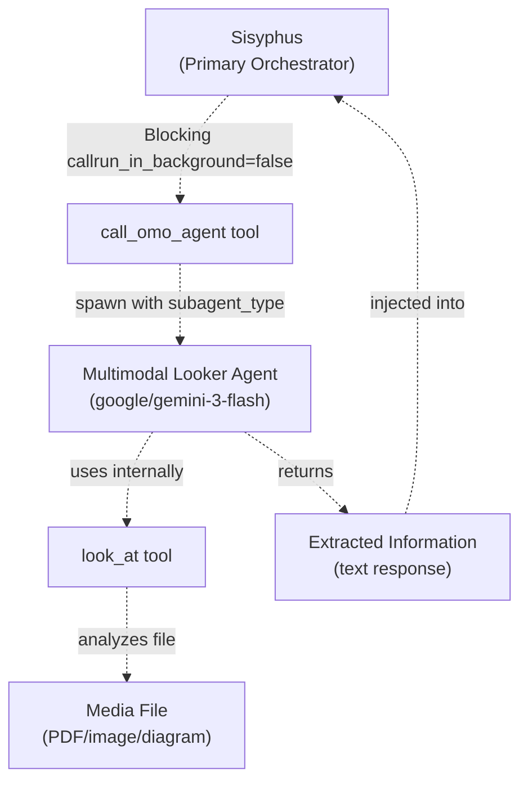
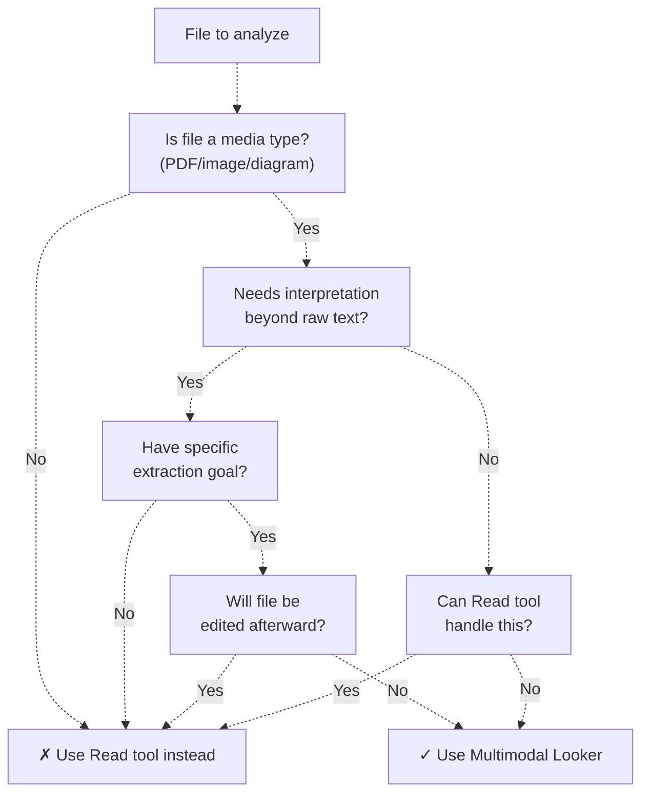
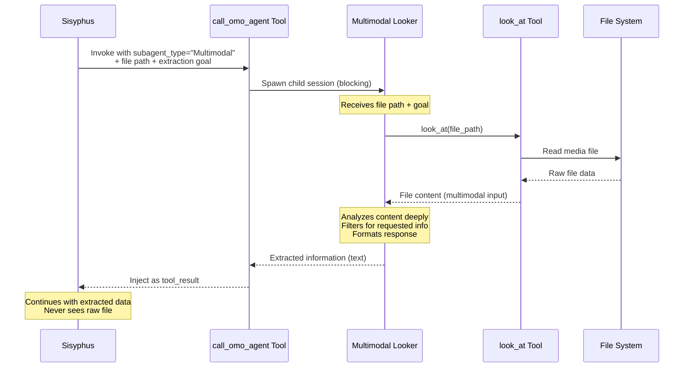
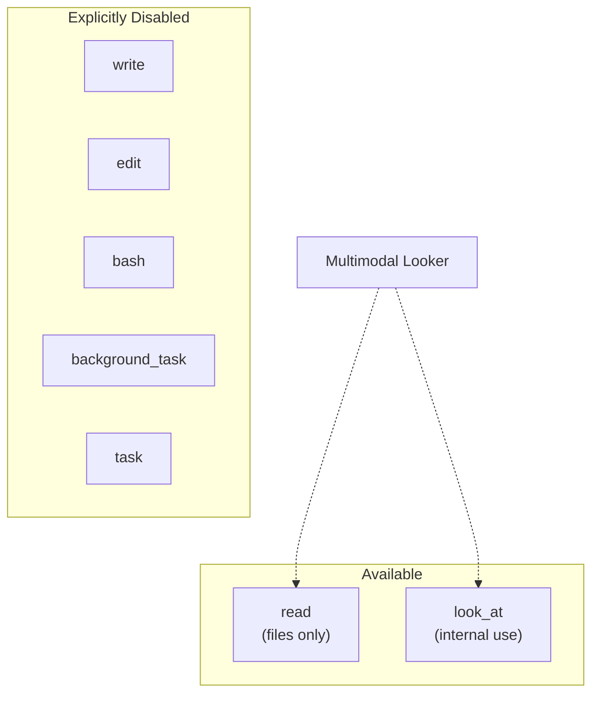
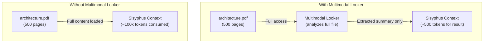
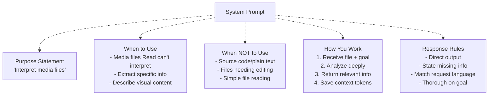

# Multimodal Looker

> **Relevant source files**
> * [src/agents/document-writer.ts](https://github.com/code-yeongyu/oh-my-opencode/blob/b92cd6ab/src/agents/document-writer.ts)
> * [src/agents/explore.ts](https://github.com/code-yeongyu/oh-my-opencode/blob/b92cd6ab/src/agents/explore.ts)
> * [src/agents/frontend-ui-ux-engineer.ts](https://github.com/code-yeongyu/oh-my-opencode/blob/b92cd6ab/src/agents/frontend-ui-ux-engineer.ts)
> * [src/agents/librarian.ts](https://github.com/code-yeongyu/oh-my-opencode/blob/b92cd6ab/src/agents/librarian.ts)
> * [src/agents/multimodal-looker.ts](https://github.com/code-yeongyu/oh-my-opencode/blob/b92cd6ab/src/agents/multimodal-looker.ts)
> * [src/agents/oracle.ts](https://github.com/code-yeongyu/oh-my-opencode/blob/b92cd6ab/src/agents/oracle.ts)

The Multimodal Looker is a specialized subagent responsible for interpreting media files that cannot be processed as plain text. It analyzes PDFs, images, and diagrams to extract specific information, saving context tokens by pre-processing visual content before it reaches the main orchestrator.

For information about other specialized agents, see [Specialized Agents](/code-yeongyu/oh-my-opencode/4.2-specialized-agents). For general agent configuration, see [Agent Configuration](/code-yeongyu/oh-my-opencode/4.3-agent-configuration). For the `look_at` tool that enables this agent's functionality, see [Specialized Tools](/code-yeongyu/oh-my-opencode/5.5-specialized-tools).

## Purpose and Capabilities

The Multimodal Looker agent serves as a targeted interpreter for visual and structured content. Unlike general-purpose agents that operate on source code and text files, this agent exclusively handles media files requiring interpretation beyond raw text extraction.

**Core Capabilities:**

* Extract text, structure, tables, and data from specific sections of PDFs
* Describe layouts, UI elements, text content, diagrams, and charts in images
* Explain relationships, flows, and architecture depicted in diagrams
* Return only the requested information, filtering out irrelevant content
* Operate as a context-saving preprocessor for the main agent

Sources: [src/agents/multimodal-looker.ts L1-L50](https://github.com/code-yeongyu/oh-my-opencode/blob/b92cd6ab/src/agents/multimodal-looker.ts#L1-L50)

## Agent Configuration

### createMultimodalLookerAgent Function

The agent is created via the `createMultimodalLookerAgent` factory function with the following configuration:

```yaml
{
  description: "Analyze media files (PDFs, images, diagrams) that require interpretation beyond raw text...",
  mode: "subagent",
  model: "google/gemini-3-flash",
  temperature: 0.1,
  tools: { 
    write: false, 
    edit: false, 
    bash: false, 
    background_task: false 
  }
}
```

| Configuration Key | Value | Rationale |
| --- | --- | --- |
| `model` | `google/gemini-3-flash` | Gemini Flash provides fast multimodal analysis with cost efficiency |
| `mode` | `subagent` | Operates as a spawned specialist, not the primary orchestrator |
| `temperature` | `0.1` | Deterministic output for consistent extraction results |
| `tools.write` | `false` | Read-only agent; cannot modify files |
| `tools.edit` | `false` | Cannot edit existing files |
| `tools.bash` | `false` | No command execution needed for media analysis |
| `tools.background_task` | `false` | Prevents recursive agent spawning |

Sources: [src/agents/multimodal-looker.ts L5-L14](https://github.com/code-yeongyu/oh-my-opencode/blob/b92cd6ab/src/agents/multimodal-looker.ts#L5-L14)

## Delegation and Integration

### Position in Agent Hierarchy



The Multimodal Looker is invoked exclusively through **blocking delegation** from Sisyphus. It never runs in the background because the main agent needs to wait for extracted content before proceeding with implementation.

Sources: [src/agents/multimodal-looker.ts L1-L50](https://github.com/code-yeongyu/oh-my-opencode/blob/b92cd6ab/src/agents/multimodal-looker.ts#L1-L50)

 Diagram 3 from high-level architecture

### Invocation Pattern

When Sisyphus encounters a media file requiring interpretation, it constructs a delegation call with explicit extraction goals:

```python
call_omo_agent(
  subagent_type: "Multimodal",
  run_in_background: false,  // Always blocking
  prompt: "Extract the database schema diagram from docs/architecture.pdf. 
           List all tables, their columns, and relationships."
)
```

The Multimodal Looker receives:

1. File path(s) to analyze
2. Specific extraction goal describing what information is needed
3. No additional context (operates in isolation)

Sources: [src/agents/multimodal-looker.ts L16-L46](https://github.com/code-yeongyu/oh-my-opencode/blob/b92cd6ab/src/agents/multimodal-looker.ts#L16-L46)

 Diagram 3 from high-level architecture

## Use Cases and Decision Logic

### When to Use Multimodal Looker

The agent should be invoked when all these conditions are met:



**Appropriate Use Cases:**

| Scenario | Why Multimodal Looker | Example |
| --- | --- | --- |
| PDF data extraction | Extract tables, sections, structured data | "Extract API endpoints from API-spec.pdf" |
| UI screenshot analysis | Describe layout, elements, design | "List all buttons and their labels in mockup.png" |
| Architecture diagram interpretation | Explain components, data flow | "Describe the microservices architecture in diagram.svg" |
| Chart/graph analysis | Extract data points, trends | "What are the performance metrics in benchmark-chart.png" |

**Inappropriate Use Cases:**

| Scenario | Why Not Multimodal Looker | Use Instead |
| --- | --- | --- |
| Reading source code | Plain text doesn't need interpretation | `read` tool |
| Editing PDF content | Agent has no write/edit access | N/A (PDFs not editable this way) |
| Literal file contents needed | Agent returns interpreted/filtered output | `read` tool |
| Simple file inspection | No interpretation needed | `read` tool |

Sources: [src/agents/multimodal-looker.ts L18-L28](https://github.com/code-yeongyu/oh-my-opencode/blob/b92cd6ab/src/agents/multimodal-looker.ts#L18-L28)

## Workflow and Response Protocol

### Execution Flow



### Response Structure

The agent follows strict response rules to maximize utility:

**Direct Extraction:**

```
[Extracted information with no preamble]
```

**Missing Information:**

```
The requested [X] was not found in the file.
Available content includes: [Y], [Z]
```

**Structured Data:**

```yaml
Tables found:
- users: id (int), name (text), email (text)
- posts: id (int), user_id (int), content (text)

Relationships:
- posts.user_id → users.id (foreign key)
```

The agent's output is designed for immediate consumption by Sisyphus, requiring no additional parsing or transformation.

Sources: [src/agents/multimodal-looker.ts L40-L46](https://github.com/code-yeongyu/oh-my-opencode/blob/b92cd6ab/src/agents/multimodal-looker.ts#L40-L46)

## Tool Access Restrictions

### Restricted Tool Set

The Multimodal Looker operates with the most restrictive tool access of all agents:



**Rationale for Restrictions:**

| Tool | Disabled | Reason |
| --- | --- | --- |
| `write` | ✓ | Pure analysis role; should not create files |
| `edit` | ✓ | Should not modify existing files |
| `bash` | ✓ | No need for command execution during media analysis |
| `background_task` | ✓ | Prevents recursive spawning; already a subagent |
| `task` | ✓ | Cannot spawn other subagents |

The `look_at` tool is used internally but is not explicitly listed in tool restrictions—it's the primary mechanism for accessing media file content.

Sources: [src/agents/multimodal-looker.ts L14](https://github.com/code-yeongyu/oh-my-opencode/blob/b92cd6ab/src/agents/multimodal-looker.ts#L14-L14)

## Integration with Parent Session

### Context Token Optimization

The primary architectural benefit of the Multimodal Looker is **context conservation**. Rather than loading entire PDFs or images into Sisyphus's context window, the agent acts as a preprocessor:



**Token Savings Example:**

* Full PDF injection: ~100,000 tokens
* Extracted summary: ~500 tokens
* **Savings: 99.5% context reduction**

Sources: [src/agents/multimodal-looker.ts L31-L35](https://github.com/code-yeongyu/oh-my-opencode/blob/b92cd6ab/src/agents/multimodal-looker.ts#L31-L35)

### Language Matching

The agent automatically matches the language of the request:

```python
Request (Korean): "이 PDF에서 데이터베이스 스키마를 추출해주세요"
Response (Korean): "다음 테이블들이 발견되었습니다..."

Request (English): "Extract the database schema from this PDF"
Response (English): "The following tables were found..."
```

This ensures seamless integration regardless of the user's or Sisyphus's working language.

Sources: [src/agents/multimodal-looker.ts L43](https://github.com/code-yeongyu/oh-my-opencode/blob/b92cd6ab/src/agents/multimodal-looker.ts#L43-L43)

## Comparison with Other Agents

### Multimodal Looker vs Other Specialists

| Agent | Input Type | Output Type | Tool Access | Execution Mode |
| --- | --- | --- | --- | --- |
| **Multimodal Looker** | Media files (PDF/image) | Extracted text/data | Read-only + look_at | Blocking subagent |
| Librarian | Questions about libraries | Code links + explanations | Read + MCPs + bash | Background/blocking |
| Explore | Code location queries | File paths + context | Read + LSP + AST | Background |
| Oracle | Complex decisions | Recommendations | Read + LSP + AST | Blocking subagent |
| Frontend | Visual implementation | Modified code | Full write access | Blocking subagent |
| DocWriter | Documentation tasks | Documentation files | Full write access | Blocking subagent |

The Multimodal Looker is unique in its exclusive focus on media interpretation and its highly restricted tool access.

Sources: [src/agents/multimodal-looker.ts L1-L50](https://github.com/code-yeongyu/oh-my-opencode/blob/b92cd6ab/src/agents/multimodal-looker.ts#L1-L50)

 [src/agents/librarian.ts L1-L246](https://github.com/code-yeongyu/oh-my-opencode/blob/b92cd6ab/src/agents/librarian.ts#L1-L246)

 [src/agents/explore.ts L1-L106](https://github.com/code-yeongyu/oh-my-opencode/blob/b92cd6ab/src/agents/explore.ts#L1-L106)

 [src/agents/oracle.ts L1-L91](https://github.com/code-yeongyu/oh-my-opencode/blob/b92cd6ab/src/agents/oracle.ts#L1-L91)

 [src/agents/frontend-ui-ux-engineer.ts L1-L91](https://github.com/code-yeongyu/oh-my-opencode/blob/b92cd6ab/src/agents/frontend-ui-ux-engineer.ts#L1-L91)

 [src/agents/document-writer.ts L1-L211](https://github.com/code-yeongyu/oh-my-opencode/blob/b92cd6ab/src/agents/document-writer.ts#L1-L211)

## System Prompt Analysis

### Prompt Structure

The agent's system prompt is deliberately minimal compared to other agents, consisting of five key sections:



**Key Prompt Directives:**

1. **Negative Guidance**: Explicitly states when NOT to use the agent, preventing misuse
2. **Goal Orientation**: Emphasizes extracting "ONLY what was requested"
3. **Context Awareness**: Reminds agent that "main agent never processes raw file"
4. **Output Directness**: "Return extracted information directly, no preamble"
5. **Failure Handling**: "If info not found, state clearly what's missing"

Sources: [src/agents/multimodal-looker.ts L15-L46](https://github.com/code-yeongyu/oh-my-opencode/blob/b92cd6ab/src/agents/multimodal-looker.ts#L15-L46)

### Prompt Comparison

Unlike verbose prompts for other agents, the Multimodal Looker's prompt is concise (33 lines) because:

* Limited tool access reduces complexity
* Single-purpose role requires less guidance
* No multi-phase workflow like Sisyphus or DocWriter
* No research strategy needed like Librarian or Explore

Sources: [src/agents/multimodal-looker.ts L15-L46](https://github.com/code-yeongyu/oh-my-opencode/blob/b92cd6ab/src/agents/multimodal-looker.ts#L15-L46)

 [src/agents/librarian.ts L13-L242](https://github.com/code-yeongyu/oh-my-opencode/blob/b92cd6ab/src/agents/librarian.ts#L13-L242)

 [src/agents/document-writer.ts L14-L207](https://github.com/code-yeongyu/oh-my-opencode/blob/b92cd6ab/src/agents/document-writer.ts#L14-L207)

## File Reference

**Primary Source Files:**

* [src/agents/multimodal-looker.ts L1-L50](https://github.com/code-yeongyu/oh-my-opencode/blob/b92cd6ab/src/agents/multimodal-looker.ts#L1-L50)  - Complete agent definition
* [src/agents/index.ts](https://github.com/code-yeongyu/oh-my-opencode/blob/b92cd6ab/src/agents/index.ts)  - Agent exports

**Related Documentation:**

* [Agent System](../agents/) - Multi-agent architecture overview
* [Specialized Agents](/code-yeongyu/oh-my-opencode/4.2-specialized-agents) - All specialized agents
* [Agent Configuration](/code-yeongyu/oh-my-opencode/4.3-agent-configuration) - Factory system and overrides
* [Specialized Tools](/code-yeongyu/oh-my-opencode/5.5-specialized-tools) - `look_at` tool implementation