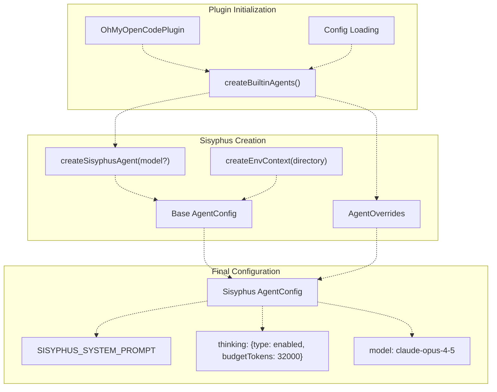
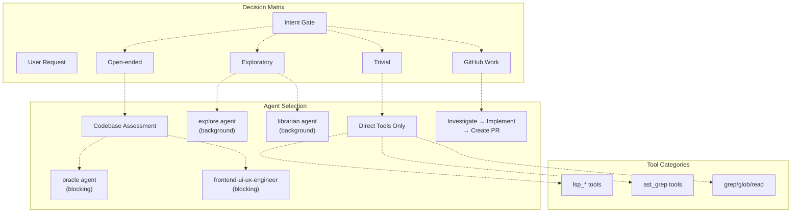
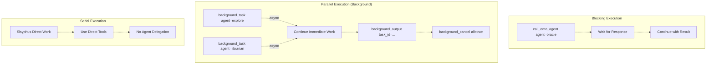
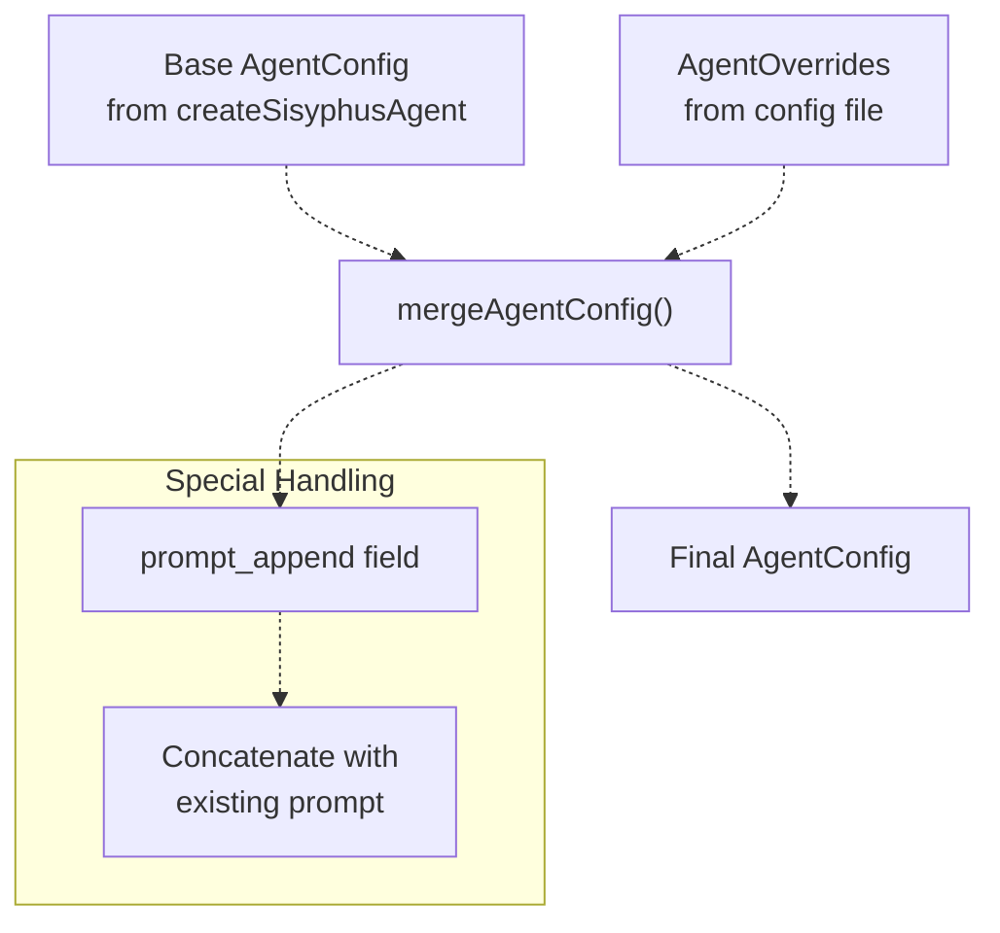

# Sisyphus Orchestrator

> **Relevant source files**
> * [.github/assets/sisyphus.png](https://github.com/code-yeongyu/oh-my-opencode/blob/b92cd6ab/.github/assets/sisyphus.png)
> * [README.ja.md](https://github.com/code-yeongyu/oh-my-opencode/blob/b92cd6ab/README.ja.md)
> * [README.ko.md](https://github.com/code-yeongyu/oh-my-opencode/blob/b92cd6ab/README.ko.md)
> * [README.md](https://github.com/code-yeongyu/oh-my-opencode/blob/b92cd6ab/README.md)
> * [README.zh-cn.md](https://github.com/code-yeongyu/oh-my-opencode/blob/b92cd6ab/README.zh-cn.md)
> * [src/agents/index.ts](https://github.com/code-yeongyu/oh-my-opencode/blob/b92cd6ab/src/agents/index.ts)
> * [src/agents/sisyphus.ts](https://github.com/code-yeongyu/oh-my-opencode/blob/b92cd6ab/src/agents/sisyphus.ts)
> * [src/agents/types.ts](https://github.com/code-yeongyu/oh-my-opencode/blob/b92cd6ab/src/agents/types.ts)
> * [src/agents/utils.test.ts](https://github.com/code-yeongyu/oh-my-opencode/blob/b92cd6ab/src/agents/utils.test.ts)
> * [src/agents/utils.ts](https://github.com/code-yeongyu/oh-my-opencode/blob/b92cd6ab/src/agents/utils.ts)
> * [src/shared/config-path.ts](https://github.com/code-yeongyu/oh-my-opencode/blob/b92cd6ab/src/shared/config-path.ts)

This document describes Sisyphus, the primary orchestrator agent in oh-my-opencode. It covers Sisyphus's role in the agent system, its delegation strategy, execution patterns, and configuration. For detailed information about Sisyphus's multi-phase workflow, see [Workflow Phases](/code-yeongyu/oh-my-opencode/4.1.1-workflow-phases). For todo management behavior, see [Todo Management](/code-yeongyu/oh-my-opencode/4.1.2-todo-management). For GitHub-specific workflows, see [GitHub Workflow Integration](/code-yeongyu/oh-my-opencode/4.1.3-github-workflow-integration).

## Purpose and Role

Sisyphus is the main orchestrator agent that coordinates complex coding tasks by delegating to specialized subagents. Named after the mythological figure who eternally rolls a boulder uphill, Sisyphus represents persistent task execution until completion. It runs on Claude Opus 4.5 with extended thinking (32k token budget) for maximum reasoning capability.

**Core responsibilities:**

* Parsing implicit requirements from explicit user requests
* Assessing codebase maturity and adapting behavior accordingly
* Delegating specialized work to appropriate subagents
* Managing parallel and sequential task execution
* Enforcing todo-based workflow completion

**Design philosophy:** Sisyphus never works alone when specialists are available. It operates as a team lead that delegates rather than a solo implementer.

Sources: [README.md L160-L191](https://github.com/code-yeongyu/oh-my-opencode/blob/b92cd6ab/README.md#L160-L191)

 [src/agents/sisyphus.ts L6-L24](https://github.com/code-yeongyu/oh-my-opencode/blob/b92cd6ab/src/agents/sisyphus.ts#L6-L24)

## Architecture and Initialization



**Initialization Flow**

The `createBuiltinAgents()` function in [src/agents/utils.ts L79-L112](https://github.com/code-yeongyu/oh-my-opencode/blob/b92cd6ab/src/agents/utils.ts#L79-L112)

 constructs all builtin agents including Sisyphus. For Sisyphus specifically:

1. **Factory Invocation**: `createSisyphusAgent(model)` is called with an optional model override
2. **Environment Context**: If `directory` is provided, `createEnvContext(directory)` generates contextual information (current date, time, timezone, platform, working directory) and appends it to the prompt
3. **Model Selection**: Uses `systemDefaultModel` if provided, otherwise defaults to `anthropic/claude-opus-4-5`
4. **Override Application**: User-configured overrides from `oh-my-opencode.json` are applied via `mergeAgentConfig()`

The environment context injection ensures Sisyphus has accurate temporal and platform awareness:

```xml
// Environment context format
<env>
  Working directory: /path/to/project
  Platform: darwin
  Today's date: Wed, Jan 15, 2025 (NOT 2024, NEVEREVER 2024)
  Current time: 02:30:45 PM
  Timezone: America/Los_Angeles
  Locale: en-US
</env>
```

Sources: [src/agents/utils.ts L32-L63](https://github.com/code-yeongyu/oh-my-opencode/blob/b92cd6ab/src/agents/utils.ts#L32-L63)

 [src/agents/utils.ts L79-L112](https://github.com/code-yeongyu/oh-my-opencode/blob/b92cd6ab/src/agents/utils.ts#L79-L112)

 [src/agents/sisyphus.ts L1-L4](https://github.com/code-yeongyu/oh-my-opencode/blob/b92cd6ab/src/agents/sisyphus.ts#L1-L4)

## Agent Delegation Strategy



**Delegation Rules**

Sisyphus categorizes requests and selects agents based on cost, scope, and specialization:

| Agent | Cost | Execution Mode | Use Cases |
| --- | --- | --- | --- |
| **explore** | FREE | Background (always async) | Multiple search angles, unfamiliar modules, cross-layer pattern discovery |
| **librarian** | CHEAP | Background (always async) | External docs, GitHub examples, OSS implementations, library API research |
| **oracle** | EXPENSIVE | Blocking (synchronous) | Architecture decisions, code review, debugging after 3+ failures |
| **frontend-ui-ux-engineer** | MEDIUM | Blocking (synchronous) | ALL visual changes (color, spacing, layout, animation, CSS) |
| **document-writer** | CHEAP | Blocking (synchronous) | README, API docs, architecture documentation |
| **multimodal-looker** | CHEAP | Blocking (synchronous) | PDF analysis, image interpretation, diagram extraction |

**Key delegation principles:**

1. **Explore/Librarian as Grep**: These agents are treated as contextual and reference search tools, not consultants. Always run in background with parallel execution.
2. **Frontend Rule**: ANY visual/UI/UX change (not pure logic) MUST be delegated to `frontend-ui-ux-engineer`. Sisyphus never touches styling.
3. **Oracle Consultation**: Reserved for high-value reasoning (architecture, persistent bugs, design review). Requires blocking execution.
4. **Default Flow**: `explore` + `librarian` (background) → work → `oracle` (if needed)

Sources: [src/agents/sisyphus.ts L114-L186](https://github.com/code-yeongyu/oh-my-opencode/blob/b92cd6ab/src/agents/sisyphus.ts#L114-L186)

 [README.md L164-L180](https://github.com/code-yeongyu/oh-my-opencode/blob/b92cd6ab/README.md#L164-L180)

## Execution Patterns

Sisyphus supports three execution patterns for agent delegation:



**1. Serial Execution (Direct Tools)**

For trivial requests with clear scope, Sisyphus uses tools directly without agent delegation:

```
// No delegation needed
lsp_goto_definition(file="auth.ts", line=42)
read_file(path="src/config.ts")
```

**2. Parallel Execution (Background Tasks)**

Explore and librarian agents ALWAYS run in background mode. The pattern:

```
// Launch parallel searches (non-blocking)
background_task(agent="explore", prompt="Find auth implementations...", background_task=true)
background_task(agent="librarian", prompt="Find JWT best practices...", background_task=true)

// Continue immediate work while searches run
// ...

// Collect results when needed
background_output(task_id="task_001")
background_output(task_id="task_002")

// Cleanup before completion
background_cancel(all=true)
```

**3. Blocking Execution (Synchronous Agents)**

Oracle, frontend, docwriter, and multimodal require synchronous execution:

```
// Wait for oracle response before proceeding
call_omo_agent(
  agent="oracle",
  prompt="Review this architecture design...",
  run_in_background=false
)
```

**Stop Conditions for Background Tasks**

Sisyphus stops launching new searches when:

* Sufficient context to proceed confidently
* Same information appearing across multiple sources
* 2 iterations yielded no new useful data
* Direct answer found

Sources: [src/agents/sisyphus.ts L153-L186](https://github.com/code-yeongyu/oh-my-opencode/blob/b92cd6ab/src/agents/sisyphus.ts#L153-L186)

 [README.md L484-L495](https://github.com/code-yeongyu/oh-my-opencode/blob/b92cd6ab/README.md#L484-L495)

## Model Configuration

Sisyphus's reasoning behavior adapts based on the configured model:

| Model Family | Configuration | Reasoning Mechanism |
| --- | --- | --- |
| **Claude (default)** | `anthropic/claude-opus-4-5` | `thinking: {type: "enabled", budgetTokens: 32000}` |
| **GPT** | `openai/gpt-5.2` or `github-copilot/gpt-*` | `reasoningEffort: "medium"`, `textVerbosity: "high"` |

**Model Detection Logic**

The `isGptModel()` function in [src/agents/types.ts L5-L7](https://github.com/code-yeongyu/oh-my-opencode/blob/b92cd6ab/src/agents/types.ts#L5-L7)

 determines model family:

```javascript
function isGptModel(model: string): boolean {
  return model.startsWith("openai/") || model.startsWith("github-copilot/gpt-")
}
```

**Configuration Selection**

When `createSisyphusAgent(model)` is called:

1. If `model` parameter is a GPT model → apply `reasoningEffort` + `textVerbosity`
2. If `model` parameter is Claude or unspecified → apply `thinking` configuration
3. Default model: `anthropic/claude-opus-4-5`

This ensures optimal reasoning capability regardless of which provider the user has access to.

Sources: [src/agents/sisyphus.ts L1-L4](https://github.com/code-yeongyu/oh-my-opencode/blob/b92cd6ab/src/agents/sisyphus.ts#L1-L4)

 [src/agents/types.ts L5-L7](https://github.com/code-yeongyu/oh-my-opencode/blob/b92cd6ab/src/agents/types.ts#L5-L7)

## Environment Context Injection

The `createEnvContext()` function generates temporal and platform awareness that gets appended to Sisyphus's prompt:

**Context Components**

| Field | Source | Format Example |
| --- | --- | --- |
| **Working directory** | `directory` parameter | `/Users/dev/project` |
| **Platform** | `process.platform` | `darwin`, `linux`, `win32` |
| **Today's date** | `new Date()` | `Wed, Jan 15, 2025 (NOT 2024, NEVEREVER 2024)` |
| **Current time** | `new Date()` | `02:30:45 PM` |
| **Timezone** | `Intl.DateTimeFormat()` | `America/Los_Angeles` |
| **Locale** | `Intl.DateTimeFormat()` | `en-US` |

**Injection Points**

Environment context is injected for:

* **Sisyphus**: Always receives context when `directory` is provided
* **librarian**: Always receives context when `directory` is provided
* Other agents: No context injection

The explicit date warning (`NOT 2024, NEVEREVER 2024`) prevents temporal confusion in the model's responses.

Sources: [src/agents/utils.ts L32-L63](https://github.com/code-yeongyu/oh-my-opencode/blob/b92cd6ab/src/agents/utils.ts#L32-L63)

 [src/agents/utils.ts L99-L102](https://github.com/code-yeongyu/oh-my-opencode/blob/b92cd6ab/src/agents/utils.ts#L99-L102)

## Configuration and Overrides

Users can customize Sisyphus behavior via `oh-my-opencode.json`:

**Basic Override Syntax**

```json
{
  "agents": {
    "Sisyphus": {
      "model": "anthropic/claude-sonnet-4",
      "temperature": 0.3,
      "prompt_append": "Additional instructions..."
    }
  }
}
```

**Override Application Flow**



**Override Merge Logic**

The `mergeAgentConfig()` function in [src/agents/utils.ts L65-L77](https://github.com/code-yeongyu/oh-my-opencode/blob/b92cd6ab/src/agents/utils.ts#L65-L77)

 handles configuration merging:

1. Extract `prompt_append` from override (special handling)
2. Deep merge remaining fields via `deepMerge(base, rest)`
3. If `prompt_append` exists, concatenate: `merged.prompt = merged.prompt + "\n" + prompt_append`

This allows users to extend Sisyphus's prompt without replacing the entire base prompt.

**Disabling Sisyphus**

To disable Sisyphus orchestration entirely:

```json
{
  "sisyphus_agent": {
    "disabled": true
  }
}
```

This reverts OpenCode to its default build/plan agent behavior.

Sources: [src/agents/utils.ts L65-L77](https://github.com/code-yeongyu/oh-my-opencode/blob/b92cd6ab/src/agents/utils.ts#L65-L77)

 [src/agents/utils.ts L79-L112](https://github.com/code-yeongyu/oh-my-opencode/blob/b92cd6ab/src/agents/utils.ts#L79-L112)

 [README.md L789-L850](https://github.com/code-yeongyu/oh-my-opencode/blob/b92cd6ab/README.md#L789-L850)

## Integration with Agent System

Sisyphus is registered as both a primary agent and as a replacement for OpenCode's default "build" agent:

**Agent Registration**

The `builtinAgents` object in [src/agents/index.ts L10-L18](https://github.com/code-yeongyu/oh-my-opencode/blob/b92cd6ab/src/agents/index.ts#L10-L18)

 exports Sisyphus alongside other agents:

```javascript
export const builtinAgents: Record<string, AgentConfig> = {
  Sisyphus: sisyphusAgent,
  oracle: oracleAgent,
  librarian: librarianAgent,
  explore: exploreAgent,
  "frontend-ui-ux-engineer": frontendUiUxEngineerAgent,
  "document-writer": documentWriterAgent,
  "multimodal-looker": multimodalLookerAgent,
}
```

**Primary vs. Subagent Mode**

| Mode | Configuration | Behavior |
| --- | --- | --- |
| **Primary** | Default when sisyphus_agent enabled | Sisyphus becomes the default agent for all sessions |
| **Subagent** | When other agents call via `call_omo_agent` | Sisyphus acts as specialized orchestrator |

The distinction allows Sisyphus to both lead sessions and be consulted by other agents when needed.

Sources: [src/agents/index.ts L1-L22](https://github.com/code-yeongyu/oh-my-opencode/blob/b92cd6ab/src/agents/index.ts#L1-L22)

 [README.md L789-L831](https://github.com/code-yeongyu/oh-my-opencode/blob/b92cd6ab/README.md#L789-L831)