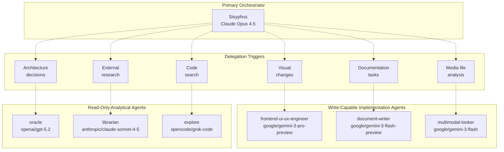
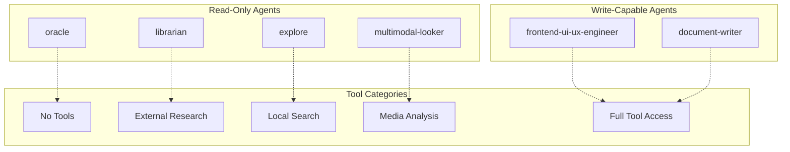
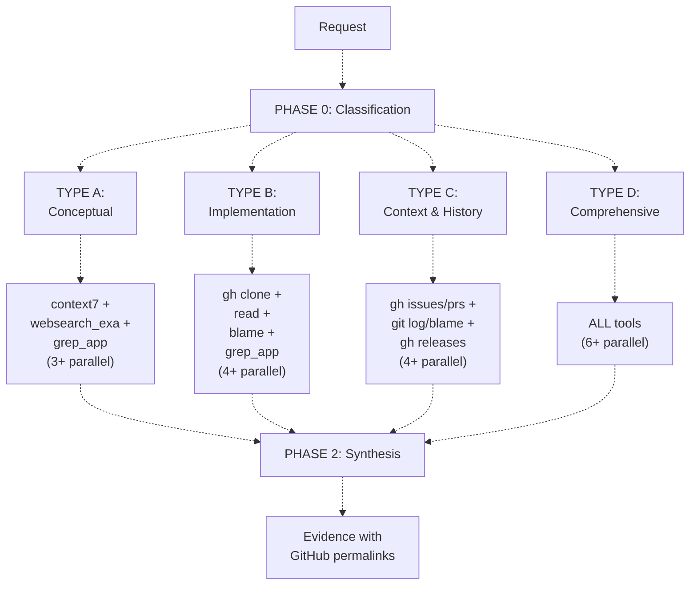

# Specialized Agents

> **Relevant source files**
> * [.github/assets/sisyphus.png](https://github.com/code-yeongyu/oh-my-opencode/blob/b92cd6ab/.github/assets/sisyphus.png)
> * [README.ja.md](https://github.com/code-yeongyu/oh-my-opencode/blob/b92cd6ab/README.ja.md)
> * [README.ko.md](https://github.com/code-yeongyu/oh-my-opencode/blob/b92cd6ab/README.ko.md)
> * [README.md](https://github.com/code-yeongyu/oh-my-opencode/blob/b92cd6ab/README.md)
> * [README.zh-cn.md](https://github.com/code-yeongyu/oh-my-opencode/blob/b92cd6ab/README.zh-cn.md)
> * [src/agents/document-writer.ts](https://github.com/code-yeongyu/oh-my-opencode/blob/b92cd6ab/src/agents/document-writer.ts)
> * [src/agents/explore.ts](https://github.com/code-yeongyu/oh-my-opencode/blob/b92cd6ab/src/agents/explore.ts)
> * [src/agents/frontend-ui-ux-engineer.ts](https://github.com/code-yeongyu/oh-my-opencode/blob/b92cd6ab/src/agents/frontend-ui-ux-engineer.ts)
> * [src/agents/index.ts](https://github.com/code-yeongyu/oh-my-opencode/blob/b92cd6ab/src/agents/index.ts)
> * [src/agents/librarian.ts](https://github.com/code-yeongyu/oh-my-opencode/blob/b92cd6ab/src/agents/librarian.ts)
> * [src/agents/multimodal-looker.ts](https://github.com/code-yeongyu/oh-my-opencode/blob/b92cd6ab/src/agents/multimodal-looker.ts)
> * [src/agents/oracle.ts](https://github.com/code-yeongyu/oh-my-opencode/blob/b92cd6ab/src/agents/oracle.ts)
> * [src/agents/sisyphus.ts](https://github.com/code-yeongyu/oh-my-opencode/blob/b92cd6ab/src/agents/sisyphus.ts)
> * [src/agents/types.ts](https://github.com/code-yeongyu/oh-my-opencode/blob/b92cd6ab/src/agents/types.ts)
> * [src/agents/utils.test.ts](https://github.com/code-yeongyu/oh-my-opencode/blob/b92cd6ab/src/agents/utils.test.ts)
> * [src/agents/utils.ts](https://github.com/code-yeongyu/oh-my-opencode/blob/b92cd6ab/src/agents/utils.ts)
> * [src/shared/config-path.ts](https://github.com/code-yeongyu/oh-my-opencode/blob/b92cd6ab/src/shared/config-path.ts)

This page documents all six specialized agents that provide domain-specific capabilities within the oh-my-opencode system. These agents operate in `subagent` mode and are invoked by the primary orchestrator (Sisyphus) for specific tasks requiring expertise.

The specialized agents are divided into two categories:

* **Read-only Analytical Agents**: Oracle, Librarian, Explore (focused on research and analysis)
* **Write-capable Implementation Agents**: Frontend UI/UX Engineer, Document Writer, Multimodal Looker

For the primary orchestrator that delegates to these agents, see [Sisyphus Orchestrator](/code-yeongyu/oh-my-opencode/4.1-sisyphus-orchestrator). For agent configuration and overrides, see [Agent Configuration](/code-yeongyu/oh-my-opencode/4.3-agent-configuration).

## Overview

The specialized agents form a multi-tier capability system that Sisyphus invokes for domain-specific tasks. Each agent is optimized for a distinct purpose with carefully selected models and tool access:

| Agent | Primary Purpose | Model | Write Access | Key Tools |
| --- | --- | --- | --- | --- |
| **Oracle** | Strategic technical advice, architecture, debugging | `openai/gpt-5.2` | ❌ | None (reasoning-only) |
| **Librarian** | External docs, open-source research, GitHub analysis | `anthropic/claude-sonnet-4-5` | ❌ | `context7`, `websearch_exa`, `grep_app`, `gh` |
| **Explore** | Fast codebase search, file location, pattern matching | `opencode/grok-code` | ❌ | `grep`, `glob`, `ast_grep_search`, `lsp_*` |
| **Frontend UI/UX Engineer** | Visual design and UI implementation | `google/gemini-3-pro-preview` | ✅ | All tools except `background_task` |
| **Document Writer** | Technical documentation, README, API docs | `google/gemini-3-flash-preview` | ✅ | All tools except `background_task` |
| **Multimodal Looker** | Media file analysis (PDF, images, diagrams) | `google/gemini-3-flash` | ❌ | None (direct media analysis) |

Common characteristics across all specialized agents:

* `mode: "subagent"` - invoked on-demand by Sisyphus
* `tools.background_task: false` - no recursive agent spawning
* Model-specific temperature settings (0.1 for analytical, varies for implementation)

Sources: [src/agents/index.ts L10-L18](https://github.com/code-yeongyu/oh-my-opencode/blob/b92cd6ab/src/agents/index.ts#L10-L18)

 [src/agents/utils.ts L14-L22](https://github.com/code-yeongyu/oh-my-opencode/blob/b92cd6ab/src/agents/utils.ts#L14-L22)

 [README.md L464-L472](https://github.com/code-yeongyu/oh-my-opencode/blob/b92cd6ab/README.md#L464-L472)

## Agent Architecture and Delegation Patterns

**Agent Capability Matrix by Function**



**Tool Access and Permissions by Agent**



Sources: [src/agents/utils.ts L79-L112](https://github.com/code-yeongyu/oh-my-opencode/blob/b92cd6ab/src/agents/utils.ts#L79-L112)

 [src/agents/index.ts L10-L18](https://github.com/code-yeongyu/oh-my-opencode/blob/b92cd6ab/src/agents/index.ts#L10-L18)

 [README.md L464-L496](https://github.com/code-yeongyu/oh-my-opencode/blob/b92cd6ab/README.md#L464-L496)

## Oracle Agent

The Oracle agent provides strategic technical advice and deep architectural analysis using pure reasoning without tool access. It is designed for complex decision-making where deep analytical thinking is required.

### Configuration

The `createOracleAgent` function in [src/agents/oracle.ts L72-L89](https://github.com/code-yeongyu/oh-my-opencode/blob/b92cd6ab/src/agents/oracle.ts#L72-L89)

 creates the agent with model-dependent configuration:

```javascript
export function createOracleAgent(model: string = DEFAULT_MODEL): AgentConfig {
  const base = {
    description: "Expert technical advisor with deep reasoning for architecture decisions...",
    mode: "subagent" as const,
    model,
    temperature: 0.1,
    tools: { write: false, edit: false, task: false, background_task: false },
    prompt: ORACLE_SYSTEM_PROMPT,
  }

  if (isGptModel(model)) {
    return { ...base, reasoningEffort: "medium", textVerbosity: "high" }
  }

  return { ...base, thinking: { type: "enabled", budgetTokens: 32000 } }
}
```

**GPT Model Configuration**: When using GPT models, Oracle leverages OpenAI's reasoning capabilities with `reasoningEffort: "medium"` and `textVerbosity: "high"` to maximize analytical output.

**Non-GPT Configuration**: For other models (e.g., Claude Opus), extended thinking is enabled with a 32,000-token budget for deep reasoning.

### Decision Framework

The Oracle system prompt ([src/agents/oracle.ts L6-L70](https://github.com/code-yeongyu/oh-my-opencode/blob/b92cd6ab/src/agents/oracle.ts#L6-L70)

) enforces a pragmatic decision-making framework:

| Principle | Implementation |
| --- | --- |
| **Bias toward simplicity** | Recommend the least complex solution that meets actual requirements |
| **Leverage what exists** | Favor modifications over introducing new components |
| **Prioritize developer experience** | Optimize for readability and maintainability over theoretical purity |
| **One clear path** | Provide a single primary recommendation, alternatives only when necessary |
| **Match depth to complexity** | Quick questions get quick answers, reserve thorough analysis for complexity |
| **Signal the investment** | Tag recommendations with effort estimates: Quick(<1h), Short(1-4h), Medium(1-2d), Large(3d+) |

### Response Structure

Oracle responses are structured in three tiers:

1. **Essential** (always present): * Bottom line: 2-3 sentence recommendation * Action plan: Numbered steps or checklist * Effort estimate: Using the Quick/Short/Medium/Large scale
2. **Expanded** (when relevant): * Why this approach: Brief reasoning and key trade-offs * Watch out for: Risks, edge cases, mitigation strategies
3. **Edge cases** (only when applicable): * Escalation triggers: Conditions justifying more complex solutions * Alternative sketch: High-level outline of advanced approaches

### Invocation Pattern

Oracle is invoked explicitly when deep reasoning is needed:

```
Ask @oracle to review this architecture and propose an alternative approach
Ask @oracle how to optimize this database query pattern
```

The Sisyphus orchestrator may also delegate to Oracle automatically when detecting complex architectural decisions or strategic questions.

Sources: [src/agents/oracle.ts L1-L91](https://github.com/code-yeongyu/oh-my-opencode/blob/b92cd6ab/src/agents/oracle.ts#L1-L91)

 [README.md L491](https://github.com/code-yeongyu/oh-my-opencode/blob/b92cd6ab/README.md#L491-L491)

## Librarian Agent

The Librarian agent specializes in multi-repository analysis, external documentation lookup, and open-source research. It is the only analytical agent with access to external information sources.

### Configuration

Defined in [src/agents/librarian.ts L3-L10](https://github.com/code-yeongyu/oh-my-opencode/blob/b92cd6ab/src/agents/librarian.ts#L3-L10)

:

```javascript
export const librarianAgent: AgentConfig = {
  description: "Specialized codebase understanding agent for multi-repository analysis...",
  mode: "subagent",
  model: "anthropic/claude-sonnet-4-5",
  temperature: 0.1,
  tools: { write: false, edit: false, background_task: false },
  prompt: `# THE LIBRARIAN...`
}
```

### Three-Phase Workflow

The Librarian operates through a mandatory classification and execution pipeline defined in its system prompt:



**Phase 0: Request Classification** ([src/agents/librarian.ts L26-L36](https://github.com/code-yeongyu/oh-my-opencode/blob/b92cd6ab/src/agents/librarian.ts#L26-L36)

)

Every request must be classified before execution:

| Type | Triggers | Tools | Parallel Calls |
| --- | --- | --- | --- |
| **TYPE A: Conceptual** | "How do I use X?", "Best practice?" | `context7`, `websearch_exa`, `grep_app` | 3+ |
| **TYPE B: Implementation** | "How does X implement Y?", "Show source" | `gh clone`, `read`, `blame`, `grep_app` | 4+ |
| **TYPE C: Context & History** | "Why was this changed?", "History of X?" | `gh issues/prs`, `git log`, `blame` | 4+ |
| **TYPE D: Comprehensive** | Complex/ambiguous requests | ALL tools | 6+ |

**Phase 1: Execution by Type** ([src/agents/librarian.ts L39-L128](https://github.com/code-yeongyu/oh-my-opencode/blob/b92cd6ab/src/agents/librarian.ts#L39-L128)

)

Each request type has a specific tool execution pattern with mandatory parallel tool invocation to maximize information gathering efficiency.

**Phase 2: Evidence Synthesis** ([src/agents/librarian.ts L130-L161](https://github.com/code-yeongyu/oh-my-opencode/blob/b92cd6ab/src/agents/librarian.ts#L130-L161)

)

All responses must include GitHub permalinks in this format:

```javascript
**Claim**: [What you're asserting]

**Evidence** (<FileRef file-url="https://github.com/code-yeongyu/oh-my-opencode/blob/b92cd6ab/source" undefined  file-path="source">Hii</FileRef>):
```typescript
// The actual code
function example() { ... }
```

**Explanation**: This works because [specific reason from the code].

```xml
### Tool Access Matrix

| Tool Category | Tools | Purpose |
|---------------|-------|---------|
| **Official Documentation** | `context7_resolve-library-id`, `context7_get-library-docs` | Retrieve authoritative API documentation |
| **Web Search** | `websearch_exa_web_search_exa` | Find recent discussions, blog posts, issues |
| **Code Search** | `grep_app_searchGitHub` | Fast search across millions of public repositories |
| **GitHub CLI** | `gh repo clone`, `gh search code/issues/prs`, `gh api` | Repository operations and metadata |
| **Git Operations** | `git log`, `git blame`, `git show`, `git rev-parse` | History and authorship analysis |
| **URL Fetching** | `webfetch` | Retrieve specific URLs (blog posts, Stack Overflow) |

### Date Awareness

The Librarian system prompt includes critical date awareness to prevent outdated information (<FileRef file-url="https://github.com/code-yeongyu/oh-my-opencode/blob/b92cd6ab/src/agents/librarian.ts#L16-L23" min=16 max=23 file-path="src/agents/librarian.ts">Hii</FileRef>):
```

**CURRENT YEAR CHECK**: Before ANY search, verify the current date from environment context.

* **NEVER search for 2024** - It is NOT 2024 anymore
* **ALWAYS use current year** (2025+) in search queries
* Filter out outdated 2024 results when they conflict with 2025 information

```css
### Parallel Execution Requirements

The Librarian enforces minimum parallel tool calls to maximize throughput:

| Request Type | Minimum Parallel Calls |
|--------------|------------------------|
| TYPE A (Conceptual) | 3+ |
| TYPE B (Implementation) | 4+ |
| TYPE C (Context) | 4+ |
| TYPE D (Comprehensive) | 6+ |

Queries must be varied to cover different angles of the same topic, not duplicated.

### Temp Directory Usage

For repository cloning operations, the Librarian uses OS-appropriate temporary directories:

```bash
${TMPDIR:-/tmp}/repo-name

# Platform-specific examples:
# macOS: /var/folders/.../repo-name or /tmp/repo-name
# Linux: /tmp/repo-name
# Windows: C:\Users\...\AppData\Local\Temp\repo-name
```

Sources: [src/agents/librarian.ts L1-L241](https://github.com/code-yeongyu/oh-my-opencode/blob/b92cd6ab/src/agents/librarian.ts#L1-L241)

 [README.md L492](https://github.com/code-yeongyu/oh-my-opencode/blob/b92cd6ab/README.md#L492-L492)

## Explore Agent

The Explore agent provides fast, contextual codebase search using local tools. It is optimized for answering "Where is X?" questions and pattern matching within the current project.

### Configuration

Defined in [src/agents/explore.ts L3-L10](https://github.com/code-yeongyu/oh-my-opencode/blob/b92cd6ab/src/agents/explore.ts#L3-L10)

:

```javascript
export const exploreAgent: AgentConfig = {
  description: 'Contextual grep for codebases. Answers "Where is X?", "Which file has Y?"...',
  mode: "subagent",
  model: "opencode/grok-code",
  temperature: 0.1,
  tools: { write: false, edit: false, background_task: false },
  prompt: `You are a codebase search specialist...`
}
```

The `opencode/grok-code` model is selected for its speed and cost-effectiveness for file traversal tasks. While Claude Code uses Haiku for similar purposes, oh-my-opencode uses Grok because it is free and sufficiently capable for pattern matching.

### Structured Output Format

The Explore agent enforces a mandatory three-part response structure ([src/agents/explore.ts L22-L53](https://github.com/code-yeongyu/oh-my-opencode/blob/b92cd6ab/src/agents/explore.ts#L22-L53)

):

**1. Intent Analysis** (required before any search):

```javascript
<analysis>
**Literal Request**: [What they literally asked]
**Actual Need**: [What they're really trying to accomplish]
**Success Looks Like**: [What result would let them proceed immediately]
</analysis>
```

**2. Parallel Execution** (required):

* Launch 3+ tools simultaneously in the first action
* Sequential execution only when output depends on prior results

**3. Structured Results** (required):

```xml
<results>
<files>
- /absolute/path/to/file1.ts — [why this file is relevant]
- /absolute/path/to/file2.ts — [why this file is relevant]
</files>

<answer>
[Direct answer to their actual need, not just file list]
</answer>

<next_steps>
[What they should do with this information]
</next_steps>
</results>
```

### Success Criteria and Failure Conditions

The system prompt defines explicit success/failure metrics ([src/agents/explore.ts L55-L70](https://github.com/code-yeongyu/oh-my-opencode/blob/b92cd6ab/src/agents/explore.ts#L55-L70)

):

| Criterion | Requirement |
| --- | --- |
| **Paths** | ALL paths must be absolute (start with `/`) |
| **Completeness** | Find ALL relevant matches, not just the first one |
| **Actionability** | Caller can proceed without asking follow-up questions |
| **Intent** | Address actual need, not just literal request |

**Failure conditions** (response has failed if):

* Any path is relative (not absolute)
* Missed obvious matches in the codebase
* Caller needs to ask "but where exactly?" or "what about X?"
* Only answered literal question, not underlying need
* No `<results>` block with structured output

### Tool Selection Strategy

The Explore agent uses different tools for different search types ([src/agents/explore.ts L81-L88](https://github.com/code-yeongyu/oh-my-opencode/blob/b92cd6ab/src/agents/explore.ts#L81-L88)

):

| Search Type | Tools |
| --- | --- |
| **Semantic search** (definitions, references) | `lsp_hover`, `lsp_goto_definition`, `lsp_find_references` |
| **Structural patterns** (function shapes, class structures) | `ast_grep_search` |
| **Text patterns** (strings, comments, logs) | `grep` |
| **File patterns** (find by name/extension) | `glob` |
| **History/evolution** (when added, who changed) | `git log`, `git blame` |
| **External examples** (how others implement) | `grep_app` |

### grep_app Integration

The Explore agent has access to `grep_app` for searching external public repositories ([src/agents/explore.ts L90-L98](https://github.com/code-yeongyu/oh-my-opencode/blob/b92cd6ab/src/agents/explore.ts#L90-L98)

). However, it enforces a strict validation protocol:

1. Start with `grep_app` for broad discovery
2. Launch multiple `grep_app` calls with query variations in parallel
3. **Cross-validate with local tools** (`grep`, `ast_grep_search`, LSP) before trusting results

**Critical warning**: grep_app results may be outdated or from different library versions. Cross-validation is mandatory.

### Constraint Enforcement

The Explore agent system prompt enforces hard constraints:

* **Read-only**: Cannot create, modify, or delete files
* **No emojis**: Keep output clean and parseable
* **No file creation**: Report findings as message text, never write files

Sources: [src/agents/explore.ts L1-L100](https://github.com/code-yeongyu/oh-my-opencode/blob/b92cd6ab/src/agents/explore.ts#L1-L100)

 [README.md L493](https://github.com/code-yeongyu/oh-my-opencode/blob/b92cd6ab/README.md#L493-L493)

## Frontend UI/UX Engineer Agent

The Frontend UI/UX Engineer agent is a specialized implementation agent for creating visually stunning user interfaces. Unlike analytical agents, it has full write access and is designed to handle all visual changes in the codebase.

### Configuration and Model Selection

Defined in [src/agents/frontend-ui-ux-engineer.ts L5-L13](https://github.com/code-yeongyu/oh-my-opencode/blob/b92cd6ab/src/agents/frontend-ui-ux-engineer.ts#L5-L13)

:

```javascript
export function createFrontendUiUxEngineerAgent(model: string = DEFAULT_MODEL): AgentConfig {
  return {
    description: "A designer-turned-developer who crafts stunning UI/UX...",
    mode: "subagent" as const,
    model: "google/gemini-3-pro-preview",
    tools: { background_task: false },
    prompt: `# Role: Designer-Turned-Developer...`
  }
}
```

**Model Rationale**: Gemini 3 Pro is selected for its exceptional creative and aesthetic capabilities in generating UI code. The model excels at translating design intent into implementation without explicit mockups.

### Design Philosophy and Process

The Frontend agent operates with a designer-first mindset defined in its system prompt [src/agents/frontend-ui-ux-engineer.ts L34-L48](https://github.com/code-yeongyu/oh-my-opencode/blob/b92cd6ab/src/agents/frontend-ui-ux-engineer.ts#L34-L48)

:

**Pre-Implementation Commitments:**

1. **Purpose**: What problem does this solve? Who uses it?
2. **Tone**: Pick a bold aesthetic direction (brutally minimal, maximalist chaos, retro-futuristic, organic/natural, luxury/refined, playful, editorial, brutalist, art deco, soft/pastel, industrial)
3. **Constraints**: Technical requirements (framework, performance, accessibility)
4. **Differentiation**: What's the ONE thing someone will remember?

**Key Principle**: Choose a clear direction and execute with precision. Intentionality over intensity.

### Aesthetic Guidelines and Anti-Patterns

The agent enforces specific design standards [src/agents/frontend-ui-ux-engineer.ts L50-L85](https://github.com/code-yeongyu/oh-my-opencode/blob/b92cd6ab/src/agents/frontend-ui-ux-engineer.ts#L50-L85)

:

| Design Element | Requirements | Prohibited |
| --- | --- | --- |
| **Typography** | Distinctive fonts, characterful display + refined body | Arial, Inter, Roboto, system fonts, Space Grotesk |
| **Color** | Cohesive palette with CSS variables, dominant colors + sharp accents | Purple gradients on white (AI slop), timid evenly-distributed palettes |
| **Motion** | High-impact moments, staggered reveals with `animation-delay`, CSS-first | Scattered micro-interactions without purpose |
| **Layout** | Asymmetry, overlap, diagonal flow, grid-breaking, generous negative space | Predictable layouts, cookie-cutter patterns |
| **Visual Details** | Gradient meshes, noise textures, geometric patterns, dramatic shadows | Solid colors without depth, generic choices |

### Work Principles

The Frontend agent follows strict execution principles [src/agents/frontend-ui-ux-engineer.ts L22-L29](https://github.com/code-yeongyu/oh-my-opencode/blob/b92cd6ab/src/agents/frontend-ui-ux-engineer.ts#L22-L29)

:

1. **Complete what's asked** - Execute the exact task, no scope creep
2. **Leave it better** - Ensure the project works after changes
3. **Study before acting** - Examine existing patterns and `git log`
4. **Blend seamlessly** - Match existing code patterns
5. **Be transparent** - Announce each step, explain reasoning

### Tool Access

The Frontend agent has full tool access with one restriction [src/agents/frontend-ui-ux-engineer.ts L13](https://github.com/code-yeongyu/oh-my-opencode/blob/b92cd6ab/src/agents/frontend-ui-ux-engineer.ts#L13-L13)

:

```
tools: { background_task: false }
```

**All enabled**: `write`, `edit`, `bash`, `read`, `glob`, `grep`, LSP tools, AST-grep

**Disabled**: `background_task` - prevents recursive agent spawning

### Delegation Rules

From the Sisyphus system prompt, Frontend is invoked for ALL visual changes:

```
ALL UI/visual work → @frontend-ui-ux-engineer
Backend logic → Sisyphus handles directly
```

The delegation is mandatory - Sisyphus never touches styling or visual implementation.

Sources: [src/agents/frontend-ui-ux-engineer.ts L1-L91](https://github.com/code-yeongyu/oh-my-opencode/blob/b92cd6ab/src/agents/frontend-ui-ux-engineer.ts#L1-L91)

 [README.md L470](https://github.com/code-yeongyu/oh-my-opencode/blob/b92cd6ab/README.md#L470-L470)

## Document Writer Agent

The Document Writer agent specializes in creating comprehensive technical documentation with a focus on verification and accuracy.

### Configuration

Defined in [src/agents/document-writer.ts L5-L13](https://github.com/code-yeongyu/oh-my-opencode/blob/b92cd6ab/src/agents/document-writer.ts#L5-L13)

:

```javascript
export function createDocumentWriterAgent(model: string = DEFAULT_MODEL): AgentConfig {
  return {
    description: "A technical writer who crafts clear, comprehensive documentation...",
    mode: "subagent" as const,
    model: "google/gemini-3-flash-preview",
    tools: { background_task: false },
    prompt: `<role>You are a TECHNICAL WRITER...`
  }
}
```

**Model Rationale**: Gemini 3 Flash is selected for its strong prose generation capabilities and cost-effectiveness for documentation tasks. Gemini excels at creating flowing, readable technical content.

### Core Mission and Code of Conduct

The Document Writer operates under a strict code of conduct [src/agents/document-writer.ts L19-L66](https://github.com/code-yeongyu/oh-my-opencode/blob/b92cd6ab/src/agents/document-writer.ts#L19-L66)

:

**1. Diligence & Integrity**

* Complete what is asked without adding unrelated content
* Never mark work as complete without proper verification
* Verify all code examples actually work

**2. Continuous Learning & Humility**

* Study before writing: examine existing patterns and API signatures
* Document discoveries: record project-specific conventions and gotchas
* Share knowledge: help future developers

**3. Precision & Adherence to Standards**

* Follow exact specifications
* Match existing documentation style
* Check `git log` to match commit style

**4. Verification-Driven Documentation**

* **ALWAYS verify code examples** - every snippet must be tested
* Search for existing docs affected by changes
* Test all commands before documenting them
* Handle edge cases, not just happy paths

**5. Transparency & Accountability**

* Announce each step
* Explain reasoning
* Report honestly

### Documentation Workflow

The Document Writer follows a structured multi-phase workflow defined in [src/agents/document-writer.ts L68-L141](https://github.com/code-yeongyu/oh-my-opencode/blob/b92cd6ab/src/agents/document-writer.ts#L68-L141)

:

**Phase 1: Understand Requirements**

* Parse task specifications
* Identify documentation scope (README, API docs, architecture docs, user guides)
* Determine target audience

**Phase 2: Research & Discovery**

* Read existing documentation for style and structure
* Explore codebase to understand implementation
* Identify gaps in current documentation

**Phase 3: Structure Planning**

* Create documentation outline
* Organize content hierarchy
* Plan code examples and diagrams

**Phase 4: Content Creation**

* Write clear, concise content
* Create working code examples
* Add diagrams where helpful

**Phase 5: Verification**

* Test all code examples
* Verify all commands work
* Check links and references
* Ensure technical accuracy

**Phase 6: Integration**

* Place documentation in correct location
* Update table of contents
* Cross-link related documentation

### Documentation Standards

The agent enforces specific writing standards [src/agents/document-writer.ts L143-L188](https://github.com/code-yeongyu/oh-my-opencode/blob/b92cd6ab/src/agents/document-writer.ts#L143-L188)

:

| Standard | Requirement |
| --- | --- |
| **Clarity** | Use simple language, avoid jargon unless necessary |
| **Structure** | Logical hierarchy with clear headings |
| **Examples** | All code examples must be tested and working |
| **Completeness** | Cover installation, usage, configuration, troubleshooting |
| **Accuracy** | All technical claims must be verified |
| **Consistency** | Follow existing project documentation style |

### Tool Access and Verification

Like the Frontend agent, Document Writer has full tool access except `background_task`:

```
tools: { background_task: false }
```

The agent actively uses tools for verification:

* `bash` - test commands and scripts
* `read` - examine existing documentation and code
* `write` - create/update documentation files
* `grep`, `glob` - find existing documentation

### Delegation Pattern

Document Writer is invoked for all documentation-related tasks:

```
README generation/updates → @document-writer
API documentation → @document-writer
Architecture diagrams → @document-writer
User guides → @document-writer
```

Sources: [src/agents/document-writer.ts L1-L188](https://github.com/code-yeongyu/oh-my-opencode/blob/b92cd6ab/src/agents/document-writer.ts#L1-L188)

 [README.md L471](https://github.com/code-yeongyu/oh-my-opencode/blob/b92cd6ab/README.md#L471-L471)

## Multimodal Looker Agent

The Multimodal Looker agent specializes in analyzing media files that cannot be read as plain text, providing interpretation services to save context tokens.

### Configuration

Defined in [src/agents/multimodal-looker.ts L5-L14](https://github.com/code-yeongyu/oh-my-opencode/blob/b92cd6ab/src/agents/multimodal-looker.ts#L5-L14)

:

```javascript
export function createMultimodalLookerAgent(model: string = DEFAULT_MODEL): AgentConfig {
  return {
    description: "Analyze media files (PDFs, images, diagrams)...",
    mode: "subagent" as const,
    model: "google/gemini-3-flash",
    temperature: 0.1,
    tools: { write: false, edit: false, bash: false, background_task: false },
    prompt: `You interpret media files that cannot be read as plain text...`
  }
}
```

**Model Rationale**: Gemini 3 Flash provides strong multimodal capabilities at low cost, making it ideal for media file analysis tasks.

### Purpose and Use Cases

The Multimodal agent serves as a context-saving intermediary [src/agents/multimodal-looker.ts L15-L33](https://github.com/code-yeongyu/oh-my-opencode/blob/b92cd6ab/src/agents/multimodal-looker.ts#L15-L33)

:

**When to use:**

* Media files the Read tool cannot interpret
* Extracting specific information or summaries from documents
* Describing visual content in images or diagrams
* When analyzed/extracted data is needed, not raw file contents

**When NOT to use:**

* Source code or plain text files (use Read tool)
* Files needing editing afterward (need literal content from Read)
* Simple file reading with no interpretation needed

**How it works:**

1. Receives file path and goal describing what to extract
2. Reads and analyzes the file deeply
3. Returns ONLY relevant extracted information
4. Main agent never processes raw file - saves context tokens

### Media Type Support

The agent handles three primary media categories [src/agents/multimodal-looker.ts L36-L38](https://github.com/code-yeongyu/oh-my-opencode/blob/b92cd6ab/src/agents/multimodal-looker.ts#L36-L38)

:

| Media Type | Capabilities |
| --- | --- |
| **PDFs** | Extract text, structure, tables, data from specific sections |
| **Images** | Describe layouts, UI elements, text, diagrams, charts |
| **Diagrams** | Explain relationships, flows, architecture depicted |

### Response Format

The agent enforces strict response rules [src/agents/multimodal-looker.ts L40-L44](https://github.com/code-yeongyu/oh-my-opencode/blob/b92cd6ab/src/agents/multimodal-looker.ts#L40-L44)

:

1. Return extracted information directly, no preamble
2. If info not found, state clearly what's missing
3. Match the language of the request
4. Be thorough on the goal, concise on everything else

Output goes straight to the main agent for continued work.

### Tool Restrictions

Unlike write-capable agents, Multimodal has extensive restrictions [src/agents/multimodal-looker.ts L14](https://github.com/code-yeongyu/oh-my-opencode/blob/b92cd6ab/src/agents/multimodal-looker.ts#L14-L14)

:

```
tools: { write: false, edit: false, bash: false, background_task: false }
```

**Rationale**: The agent only needs to read and analyze media files. All other operations are prohibited to maintain focus on its specialized role.

### Integration with look_at Tool

The Multimodal agent is invoked through the `look_at` tool mentioned in README.md:

```python
The look_at tool from AmpCode, now in OhMyOpenCode.
Instead of the agent reading massive files and bloating context, 
it internally leverages another agent to extract just what it needs.
```

Sources: [src/agents/multimodal-looker.ts L1-L51](https://github.com/code-yeongyu/oh-my-opencode/blob/b92cd6ab/src/agents/multimodal-looker.ts#L1-L51)

 [README.md L472-L573](https://github.com/code-yeongyu/oh-my-opencode/blob/b92cd6ab/README.md#L472-L573)

## Tool Access and Permission Model

**Complete Permission Matrix**

| Agent | write | edit | bash | read | background_task | All LSP/AST | Reasoning Mode |
| --- | --- | --- | --- | --- | --- | --- | --- |
| **oracle** | ❌ | ❌ | ❌ | ❌ | ❌ | ❌ | ✅ GPT reasoning / Claude thinking |
| **librarian** | ❌ | ❌ | ✅ | ✅ | ❌ | ❌ | Standard |
| **explore** | ❌ | ❌ | ✅ | ✅ | ❌ | ✅ | Standard |
| **frontend-ui-ux-engineer** | ✅ | ✅ | ✅ | ✅ | ❌ | ✅ | Standard |
| **document-writer** | ✅ | ✅ | ✅ | ✅ | ❌ | ✅ | Standard |
| **multimodal-looker** | ❌ | ❌ | ❌ | ✅ | ❌ | ❌ | Standard |

**Rationale for Restrictions**

| Restriction | Agents | Reason |
| --- | --- | --- |
| `background_task: false` | **ALL** | Prevents recursive agent spawning, avoids context loss |
| `write: false`, `edit: false` | oracle, librarian, explore, multimodal | Read-only analytical role |
| `bash: false` | oracle, multimodal | No external execution needed |
| All tools disabled | oracle | Pure reasoning-based advisor |

Sources: [src/agents/oracle.ts L79](https://github.com/code-yeongyu/oh-my-opencode/blob/b92cd6ab/src/agents/oracle.ts#L79-L79)

 [src/agents/librarian.ts L12](https://github.com/code-yeongyu/oh-my-opencode/blob/b92cd6ab/src/agents/librarian.ts#L12-L12)

 [src/agents/explore.ts L12](https://github.com/code-yeongyu/oh-my-opencode/blob/b92cd6ab/src/agents/explore.ts#L12-L12)

 [src/agents/frontend-ui-ux-engineer.ts L13](https://github.com/code-yeongyu/oh-my-opencode/blob/b92cd6ab/src/agents/frontend-ui-ux-engineer.ts#L13-L13)

 [src/agents/document-writer.ts L13](https://github.com/code-yeongyu/oh-my-opencode/blob/b92cd6ab/src/agents/document-writer.ts#L13-L13)

 [src/agents/multimodal-looker.ts L14](https://github.com/code-yeongyu/oh-my-opencode/blob/b92cd6ab/src/agents/multimodal-looker.ts#L14-L14)

## Invocation Patterns

### Explicit Invocation

Users can explicitly invoke specialized agents using the `@agent` syntax:

```python
Ask @oracle to review this design and propose an architecture
Ask @librarian how this is implemented in TanStack Query
Ask @explore for the policy file that controls feature X
Ask @frontend-ui-ux-engineer to redesign this landing page
Ask @document-writer to create API documentation for this module
Ask @multimodal-looker to extract the table from this PDF
```

### Automatic Delegation by Sisyphus

The Sisyphus orchestrator automatically delegates to specialized agents based on request classification patterns defined in [src/agents/sisyphus.ts L28-L82](https://github.com/code-yeongyu/oh-my-opencode/blob/b92cd6ab/src/agents/sisyphus.ts#L28-L82)

:

| Request Pattern | Delegated Agent | Reasoning |
| --- | --- | --- |
| Architecture decisions, strategic questions, 3+ failures | `oracle` | Requires expensive deep reasoning |
| "How is X implemented in library Y?", external docs | `librarian` | External documentation lookup needed |
| "Where is X?", "Find Y in codebase", multiple search angles | `explore` | Fast local search |
| **ALL visual changes**, styling, layout, animation | `frontend-ui-ux-engineer` | Mandatory for any UI work |
| README, API docs, architecture docs, user guides | `document-writer` | All documentation tasks |
| PDF analysis, image interpretation, diagram extraction | `multimodal-looker` | Media file analysis |

**Critical Delegation Rules** (from Sisyphus prompt):

```
ALL UI/visual work → @frontend-ui-ux-engineer (Sisyphus NEVER touches styling)
Backend logic → Sisyphus handles directly
```

### Synchronous Execution Model

All specialized agents execute synchronously (no `background_task` capability). This design ensures:

* **Results immediately available**: No polling or wait loops required
* **No context loss**: Complete context preserved between invocation and result
* **Simpler execution model**: Straightforward call-and-response pattern
* **Prevents infinite recursion**: Agents cannot spawn other agents

**Background execution is reserved for parallel workflows** where Sisyphus delegates to librarian or explore in non-blocking mode using the `call_omo_agent` tool with `run_in_background: true`. See [Background Execution System](../background-execution/) for details.

Sources: [README.md L474-L506](https://github.com/code-yeongyu/oh-my-opencode/blob/b92cd6ab/README.md#L474-L506)

 [src/agents/oracle.ts L79](https://github.com/code-yeongyu/oh-my-opencode/blob/b92cd6ab/src/agents/oracle.ts#L79-L79)

 [src/agents/librarian.ts L12](https://github.com/code-yeongyu/oh-my-opencode/blob/b92cd6ab/src/agents/librarian.ts#L12-L12)

 [src/agents/explore.ts L12](https://github.com/code-yeongyu/oh-my-opencode/blob/b92cd6ab/src/agents/explore.ts#L12-L12)

 [src/agents/frontend-ui-ux-engineer.ts L13](https://github.com/code-yeongyu/oh-my-opencode/blob/b92cd6ab/src/agents/frontend-ui-ux-engineer.ts#L13-L13)

 [src/agents/sisyphus.ts L1-L200](https://github.com/code-yeongyu/oh-my-opencode/blob/b92cd6ab/src/agents/sisyphus.ts#L1-L200)

## Configuration and Overrides

Analytical agent configurations can be overridden in the user or project `oh-my-opencode.json` file. See [Agent Configuration](#4.4) for complete override syntax.

Example override for Librarian to use a different model:

```json
{
  "agents": {
    "librarian": {
      "model": "opencode/big-pickle",
      "temperature": 0.2
    }
  }
}
```

Example disabling Oracle when GPT subscription is unavailable:

```json
{
  "disabled_agents": ["oracle"]
}
```

Configuration file locations are resolved through the functions in [src/shared/config-path.ts L1-L48](https://github.com/code-yeongyu/oh-my-opencode/blob/b92cd6ab/src/shared/config-path.ts#L1-L48)

 with project-level configs taking precedence over user-level configs.

Sources: [src/shared/config-path.ts L1-L48](https://github.com/code-yeongyu/oh-my-opencode/blob/b92cd6ab/src/shared/config-path.ts#L1-L48)

 [README.md L751-L806](https://github.com/code-yeongyu/oh-my-opencode/blob/b92cd6ab/README.md#L751-L806)