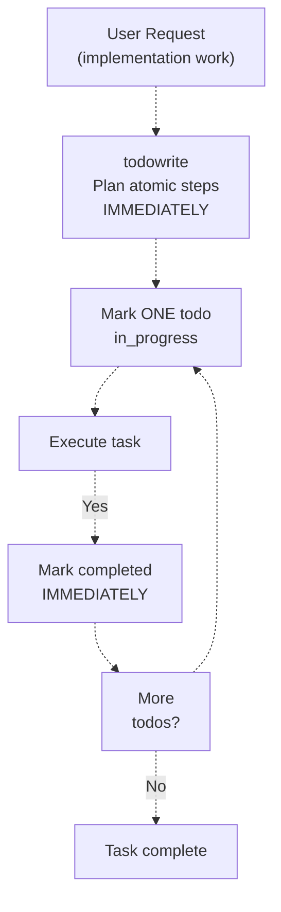
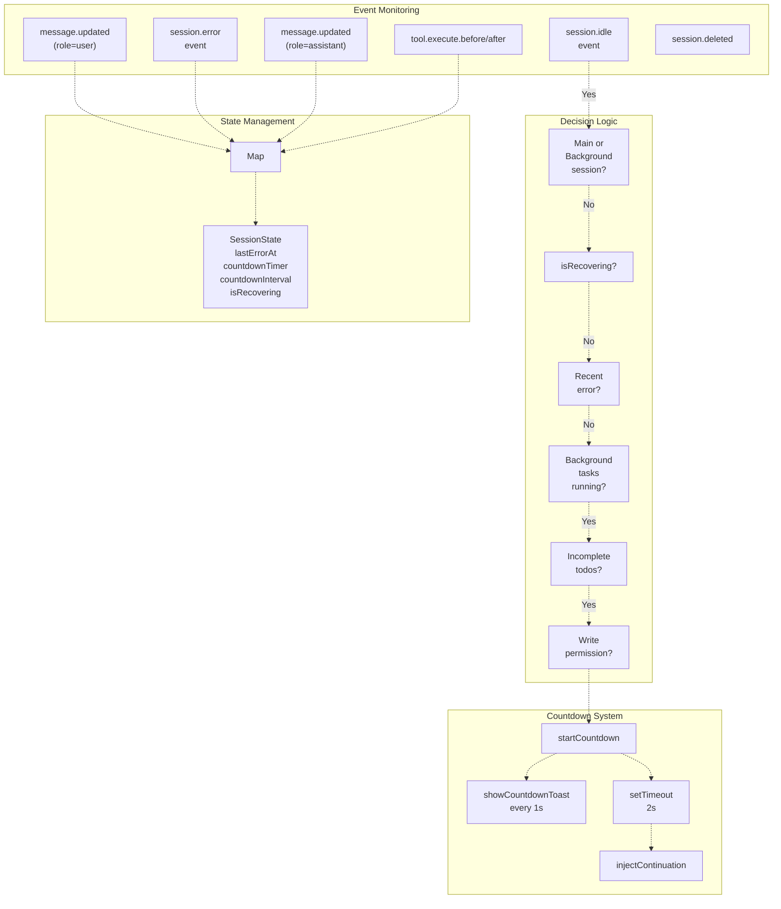
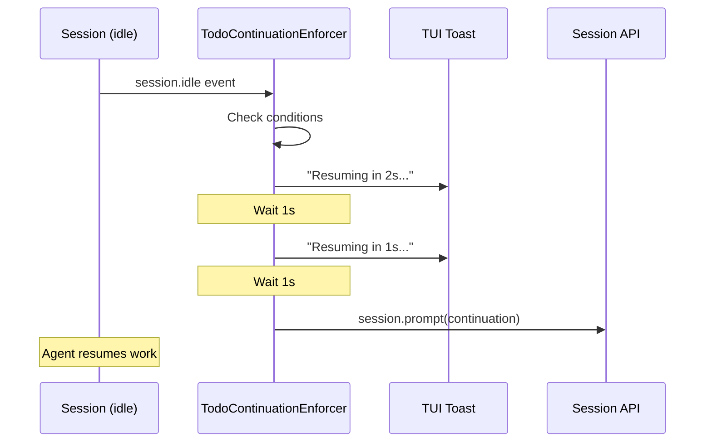
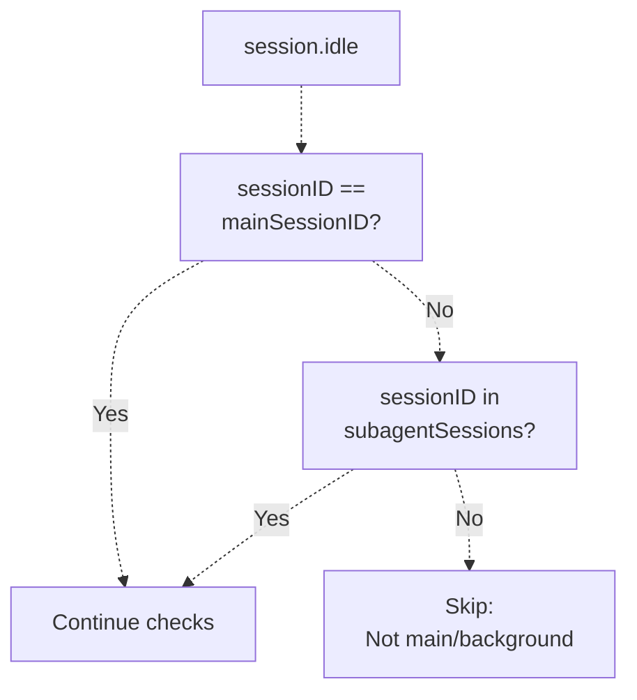
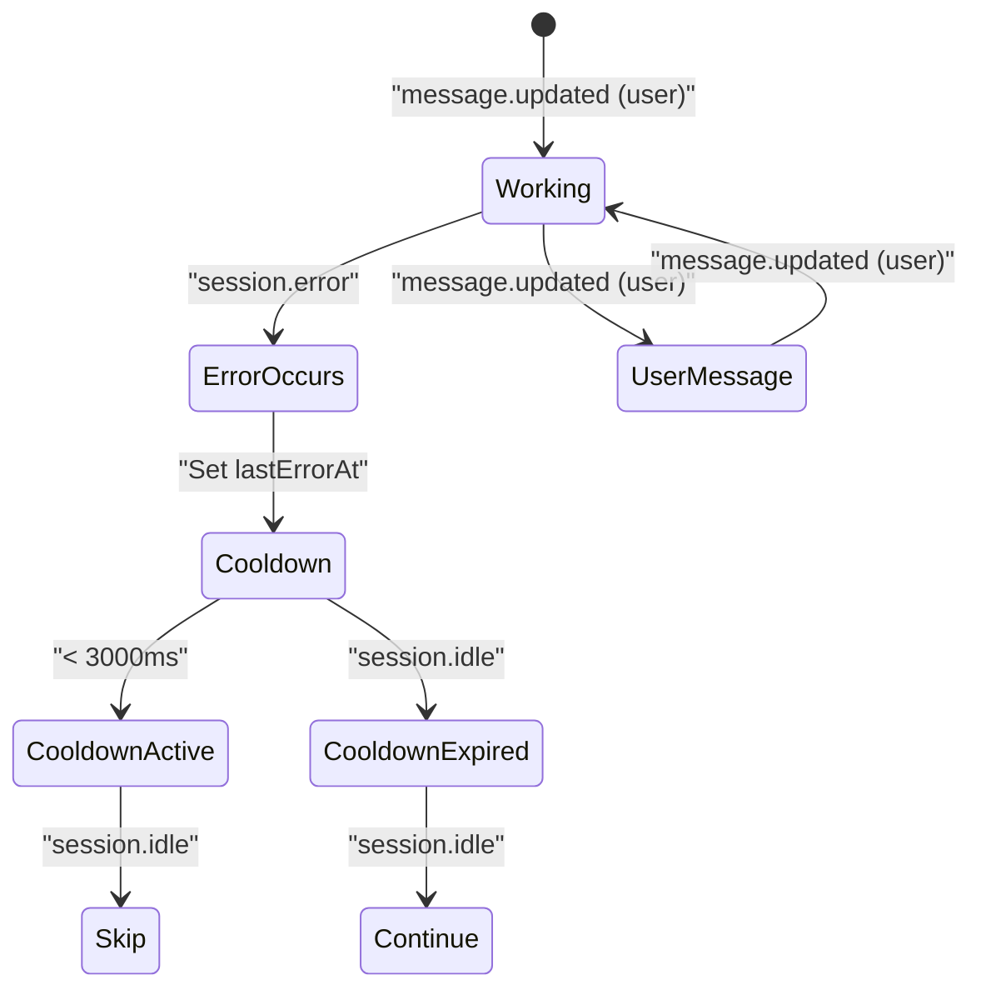

# Todo Management

> **Relevant source files**
> * [.github/assets/sisyphus.png](https://github.com/code-yeongyu/oh-my-opencode/blob/b92cd6ab/.github/assets/sisyphus.png)
> * [src/agents/index.ts](https://github.com/code-yeongyu/oh-my-opencode/blob/b92cd6ab/src/agents/index.ts)
> * [src/agents/sisyphus.ts](https://github.com/code-yeongyu/oh-my-opencode/blob/b92cd6ab/src/agents/sisyphus.ts)
> * [src/agents/types.ts](https://github.com/code-yeongyu/oh-my-opencode/blob/b92cd6ab/src/agents/types.ts)
> * [src/agents/utils.test.ts](https://github.com/code-yeongyu/oh-my-opencode/blob/b92cd6ab/src/agents/utils.test.ts)
> * [src/agents/utils.ts](https://github.com/code-yeongyu/oh-my-opencode/blob/b92cd6ab/src/agents/utils.ts)
> * [src/hooks/non-interactive-env/constants.ts](https://github.com/code-yeongyu/oh-my-opencode/blob/b92cd6ab/src/hooks/non-interactive-env/constants.ts)
> * [src/hooks/non-interactive-env/detector.ts](https://github.com/code-yeongyu/oh-my-opencode/blob/b92cd6ab/src/hooks/non-interactive-env/detector.ts)
> * [src/hooks/non-interactive-env/index.ts](https://github.com/code-yeongyu/oh-my-opencode/blob/b92cd6ab/src/hooks/non-interactive-env/index.ts)
> * [src/hooks/non-interactive-env/types.ts](https://github.com/code-yeongyu/oh-my-opencode/blob/b92cd6ab/src/hooks/non-interactive-env/types.ts)
> * [src/hooks/todo-continuation-enforcer.test.ts](https://github.com/code-yeongyu/oh-my-opencode/blob/b92cd6ab/src/hooks/todo-continuation-enforcer.test.ts)
> * [src/hooks/todo-continuation-enforcer.ts](https://github.com/code-yeongyu/oh-my-opencode/blob/b92cd6ab/src/hooks/todo-continuation-enforcer.ts)

The todo management system is Sisyphus's primary coordination mechanism for multi-step tasks. It enforces explicit task planning, real-time progress tracking, and automatic continuation when work remains incomplete. This system combines mandatory workflow rules in Sisyphus's prompt with an automatic continuation enforcer hook that monitors session state and injects continuation prompts when the agent stops with pending tasks.

For Sisyphus's overall workflow phases including implementation, see [Workflow Phases](/code-yeongyu/oh-my-opencode/4.1.1-workflow-phases). For session recovery coordination with todos, see [Session Recovery](/code-yeongyu/oh-my-opencode/7.1-session-recovery).

## Mandatory Todo Rules

Sisyphus is programmed to create todos as the **default behavior** for any non-trivial task. This is enforced through strict system prompt instructions and complemented by runtime monitoring.

### When Todos Are Required

| Trigger | Required Action | Rationale |
| --- | --- | --- |
| Multi-step task (2+ steps) | ALWAYS create todos first | User visibility into progress |
| Uncertain scope | ALWAYS create todos | Todos clarify thinking |
| User request with multiple items | ALWAYS create todos | Prevents item omission |
| Complex single task | Create todos to break down | Makes progress trackable |

**Exception**: Todos are ONLY created when the user explicitly requests implementation work. Sisyphus never creates todos for exploratory or research-only tasks unless implementation is requested.

Sources: [src/agents/sisyphus.ts L398-L420](https://github.com/code-yeongyu/oh-my-opencode/blob/b92cd6ab/src/agents/sisyphus.ts#L398-L420)

### Workflow Sequence

The todo workflow is non-negotiable and follows this exact sequence:



**Key Rules**:

1. **IMMEDIATELY**: Create todos before starting any work, not after
2. **ONE at a time**: Only one todo can be `in_progress` at any moment
3. **NEVER batch**: Mark each todo `completed` immediately upon finishing, not in groups
4. **Update dynamically**: If scope changes, update todos before proceeding

Sources: [src/agents/sisyphus.ts L412-L419](https://github.com/code-yeongyu/oh-my-opencode/blob/b92cd6ab/src/agents/sisyphus.ts#L412-L419)

### Why This Is Non-Negotiable

| Benefit | Implementation |
| --- | --- |
| **User visibility** | User sees real-time progress in todo list, not a black box |
| **Prevents drift** | Todos anchor Sisyphus to the actual request |
| **Recovery** | If interrupted, todos enable seamless continuation |
| **Accountability** | Each todo is an explicit commitment |

The system prompt explicitly states: **"FAILURE TO USE TODOS ON NON-TRIVIAL TASKS = INCOMPLETE WORK."**

Sources: [src/agents/sisyphus.ts L420-L426](https://github.com/code-yeongyu/oh-my-opencode/blob/b92cd6ab/src/agents/sisyphus.ts#L420-L426)

## Automatic Continuation System

The `createTodoContinuationEnforcer` function monitors session lifecycle events and automatically injects continuation prompts when Sisyphus stops with incomplete todos.

### Architecture



Sources: [src/hooks/todo-continuation-enforcer.ts L89-L377](https://github.com/code-yeongyu/oh-my-opencode/blob/b92cd6ab/src/hooks/todo-continuation-enforcer.ts#L89-L377)

### Continuation Prompt

When conditions are met, the enforcer injects this prompt via `ctx.client.session.prompt()`:

```
[SYSTEM REMINDER - TODO CONTINUATION]

Incomplete tasks remain in your todo list. Continue working on the next pending task.

- Proceed without asking for permission
- Mark each task complete when finished
- Do not stop until all tasks are done

[Status: X/Y completed, Z remaining]
```

The prompt is injected with the same agent that was previously active (retrieved from message storage), preserving agent context.

Sources: [src/hooks/todo-continuation-enforcer.ts L38-L44](https://github.com/code-yeongyu/oh-my-opencode/blob/b92cd6ab/src/hooks/todo-continuation-enforcer.ts#L38-L44)

 [src/hooks/todo-continuation-enforcer.ts L204-L221](https://github.com/code-yeongyu/oh-my-opencode/blob/b92cd6ab/src/hooks/todo-continuation-enforcer.ts#L204-L221)

### Countdown Mechanism

When `session.idle` occurs with incomplete todos:

1. **Start countdown**: 2-second timer begins
2. **Toast notifications**: UI toast updates every second showing "Resuming in Xs... (N tasks remaining)"
3. **Cancellation points**: Any activity cancels the countdown (user input, assistant response, tool execution)
4. **Injection**: After 2 seconds of idle, continuation prompt is injected



Constants:

* `COUNTDOWN_SECONDS = 2`
* `TOAST_DURATION_MS = 900`
* `ERROR_COOLDOWN_MS = 3000`

Sources: [src/hooks/todo-continuation-enforcer.ts L46-L48](https://github.com/code-yeongyu/oh-my-opencode/blob/b92cd6ab/src/hooks/todo-continuation-enforcer.ts#L46-L48)

 [src/hooks/todo-continuation-enforcer.ts L224-L244](https://github.com/code-yeongyu/oh-my-opencode/blob/b92cd6ab/src/hooks/todo-continuation-enforcer.ts#L224-L244)

## Skip Conditions and Guards

The continuation enforcer implements multiple guards to prevent inappropriate injections.

### Session Type Filtering



Only two session types receive continuations:

1. **Main session**: The primary user-facing session (set via `setMainSession`)
2. **Background task sessions**: Subagent sessions (tracked in `subagentSessions`)

All other sessions are skipped to prevent interfering with unrelated work.

Sources: [src/hooks/todo-continuation-enforcer.ts L261-L274](https://github.com/code-yeongyu/oh-my-opencode/blob/b92cd6ab/src/hooks/todo-continuation-enforcer.ts#L261-L274)

### Recovery Mode Coordination

```
interface SessionState {
  lastErrorAt?: number
  countdownTimer?: ReturnType<typeof setTimeout>
  countdownInterval?: ReturnType<typeof setInterval>
  isRecovering?: boolean
}
```

The `isRecovering` flag is controlled by the session recovery system:

* `markRecovering(sessionID)`: Sets flag and cancels any pending countdown
* `markRecoveryComplete(sessionID)`: Clears flag, allowing future injections

This prevents todo continuation from interfering with error recovery workflows.

Sources: [src/hooks/todo-continuation-enforcer.ts L31-L36](https://github.com/code-yeongyu/oh-my-opencode/blob/b92cd6ab/src/hooks/todo-continuation-enforcer.ts#L31-L36)

 [src/hooks/todo-continuation-enforcer.ts L124-L137](https://github.com/code-yeongyu/oh-my-opencode/blob/b92cd6ab/src/hooks/todo-continuation-enforcer.ts#L124-L137)

### Complete Skip Condition Table

| Condition | Check | Skip Reason |
| --- | --- | --- |
| Session type | Not main or background task | Avoid interfering with unrelated sessions |
| Recovery mode | `state.isRecovering === true` | Let recovery system complete first |
| Recent error | `lastErrorAt` within 3s | Error cooldown period |
| Background tasks | `backgroundManager.getTasksByParentSession()` has running tasks | Wait for async work to complete |
| No todos | `todos.length === 0` | Nothing to continue |
| All complete | All todos are `completed` or `cancelled` | Work is done |
| No write permission | `prevMessage.tools.write === false` | Agent cannot modify code |
| Plan mode agent | `agent === "plan"` or `"planner-sisyphus"` | Planning agents don't implement |

Sources: [src/hooks/todo-continuation-enforcer.ts L150-L221](https://github.com/code-yeongyu/oh-my-opencode/blob/b92cd6ab/src/hooks/todo-continuation-enforcer.ts#L150-L221)

 [src/hooks/todo-continuation-enforcer.ts L276-L317](https://github.com/code-yeongyu/oh-my-opencode/blob/b92cd6ab/src/hooks/todo-continuation-enforcer.ts#L276-L317)

### Error Cooldown Mechanism



When `session.error` occurs:

1. Set `state.lastErrorAt = Date.now()`
2. Cancel any pending countdown
3. Skip injections for 3000ms
4. User messages immediately clear the cooldown

This prevents rapid-fire continuation attempts after API errors or aborts.

Sources: [src/hooks/todo-continuation-enforcer.ts L158-L161](https://github.com/code-yeongyu/oh-my-opencode/blob/b92cd6ab/src/hooks/todo-continuation-enforcer.ts#L158-L161)

 [src/hooks/todo-continuation-enforcer.ts L249-L259](https://github.com/code-yeongyu/oh-my-opencode/blob/b92cd6ab/src/hooks/todo-continuation-enforcer.ts#L249-L259)

 [src/hooks/todo-continuation-enforcer.ts L328-L335](https://github.com/code-yeongyu/oh-my-opencode/blob/b92cd6ab/src/hooks/todo-continuation-enforcer.ts#L328-L335)

## Cancellation Events

Multiple event types can cancel an active countdown:

### Cancellation Event Table

| Event Type | Role/Condition | Action | Rationale |
| --- | --- | --- | --- |
| `message.updated` | `role === "user"` | Cancel countdown, clear `lastErrorAt` | User is actively engaging |
| `message.updated` | `role === "assistant"` | Cancel countdown | Agent is already responding |
| `message.part.updated` | `role === "assistant"` | Cancel countdown | Streaming response started |
| `tool.execute.before` | Any tool | Cancel countdown | Agent is working |
| `tool.execute.after` | Any tool | Cancel countdown | Tool execution active |
| `session.deleted` | Session ID match | Cancel countdown, cleanup state | Session no longer exists |

The `cancelCountdown` function clears both timer types:

* `clearTimeout(state.countdownTimer)` - Stops the injection
* `clearInterval(state.countdownInterval)` - Stops toast updates

Sources: [src/hooks/todo-continuation-enforcer.ts L105-L117](https://github.com/code-yeongyu/oh-my-opencode/blob/b92cd6ab/src/hooks/todo-continuation-enforcer.ts#L105-L117)

 [src/hooks/todo-continuation-enforcer.ts L321-L369](https://github.com/code-yeongyu/oh-my-opencode/blob/b92cd6ab/src/hooks/todo-continuation-enforcer.ts#L321-L369)

## Write Permission Check

The enforcer respects tool restrictions to prevent continuation in read-only contexts:

```javascript
const messageDir = getMessageDir(sessionID)
const prevMessage = messageDir ? findNearestMessageWithFields(messageDir) : null

const hasWritePermission = !prevMessage?.tools || 
  (prevMessage.tools.write !== false && prevMessage.tools.edit !== false)

if (!hasWritePermission) {
  log(`Skipped: agent lacks write permission`, { sessionID, agent: prevMessage?.agent })
  return
}
```

This checks the most recent message's tool configuration. If `write` or `edit` tools are explicitly disabled (e.g., for Oracle or Librarian), continuation is skipped because these agents cannot implement changes.

Sources: [src/hooks/todo-continuation-enforcer.ts L187-L196](https://github.com/code-yeongyu/oh-my-opencode/blob/b92cd6ab/src/hooks/todo-continuation-enforcer.ts#L187-L196)

## Integration with Background Manager

The enforcer coordinates with the `BackgroundManager` to avoid interrupting parallel agent work:

```javascript
const hasRunningBgTasks = backgroundManager
  ? backgroundManager.getTasksByParentSession(sessionID).some(t => t.status === "running")
  : false

if (hasRunningBgTasks) {
  log(`Skipped injection: background tasks running`, { sessionID })
  return
}
```

When Sisyphus delegates work to `explore` or `librarian` agents via `background_task`, the continuation enforcer waits for those tasks to complete before injecting continuation prompts. This prevents premature continuation while async research is in progress.

Sources: [src/hooks/todo-continuation-enforcer.ts L163-L170](https://github.com/code-yeongyu/oh-my-opencode/blob/b92cd6ab/src/hooks/todo-continuation-enforcer.ts#L163-L170)

 [src/hooks/todo-continuation-enforcer.ts L288-L295](https://github.com/code-yeongyu/oh-my-opencode/blob/b92cd6ab/src/hooks/todo-continuation-enforcer.ts#L288-L295)

## Anti-Patterns and Violations

The system prompt explicitly lists blocking violations:

| Violation | Why It's Bad | System Response |
| --- | --- | --- |
| Skipping todos on multi-step tasks | User has no visibility, steps get forgotten | Marked as incomplete work |
| Batch-completing multiple todos | Defeats real-time tracking purpose | Continuation enforcer may re-trigger |
| Proceeding without marking `in_progress` | No indication of what you're working on | User confusion about status |
| Finishing without completing todos | Task appears incomplete to user | Continuation enforcer auto-injects |

The continuation enforcer acts as a safety net: if Sisyphus violates these rules and stops with incomplete todos, the system automatically re-engages it after 2 seconds.

Sources: [src/agents/sisyphus.ts L427-L436](https://github.com/code-yeongyu/oh-my-opencode/blob/b92cd6ab/src/agents/sisyphus.ts#L427-L436)

## Testing Strategy

The test suite in `todo-continuation-enforcer.test.ts` validates all skip conditions and timing:

Key test scenarios:

* Injection occurs with incomplete todos after 2s countdown
* Skipped when all todos complete
* Skipped when background tasks running
* Skipped for non-main sessions (except background task sessions)
* Error cooldown prevents immediate re-injection
* User messages clear error state and allow injection
* Countdown cancels on user/assistant activity
* Recovery mode blocks injection
* Session deletion triggers cleanup
* Toast updates appear during countdown
* No throttle between successive injections (removed in implementation)

The tests use mock implementations of `PluginInput` and `BackgroundManager` to simulate various scenarios without actual API calls.

Sources: [src/hooks/todo-continuation-enforcer.test.ts L1-L404](https://github.com/code-yeongyu/oh-my-opencode/blob/b92cd6ab/src/hooks/todo-continuation-enforcer.test.ts#L1-L404)