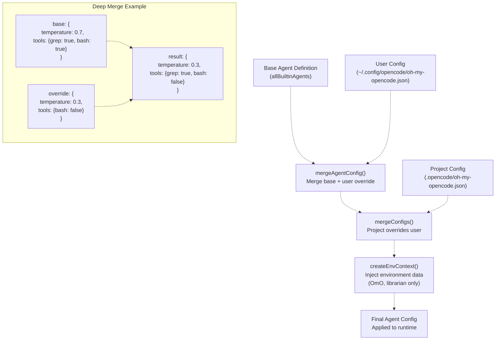
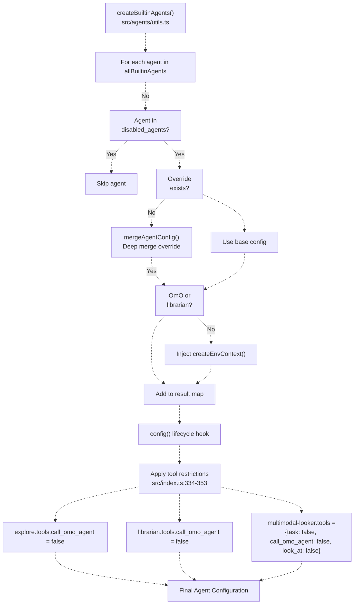
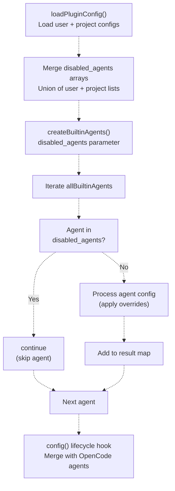
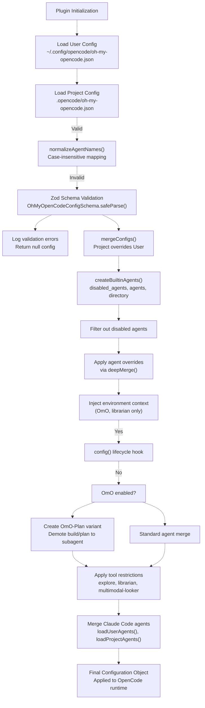

# Agent Configuration

> **Relevant source files**
> * [.github/assets/sisyphus.png](https://github.com/code-yeongyu/oh-my-opencode/blob/b92cd6ab/.github/assets/sisyphus.png)
> * [assets/oh-my-opencode.schema.json](https://github.com/code-yeongyu/oh-my-opencode/blob/b92cd6ab/assets/oh-my-opencode.schema.json)
> * [src/agents/index.ts](https://github.com/code-yeongyu/oh-my-opencode/blob/b92cd6ab/src/agents/index.ts)
> * [src/agents/sisyphus.ts](https://github.com/code-yeongyu/oh-my-opencode/blob/b92cd6ab/src/agents/sisyphus.ts)
> * [src/agents/types.ts](https://github.com/code-yeongyu/oh-my-opencode/blob/b92cd6ab/src/agents/types.ts)
> * [src/agents/utils.test.ts](https://github.com/code-yeongyu/oh-my-opencode/blob/b92cd6ab/src/agents/utils.test.ts)
> * [src/agents/utils.ts](https://github.com/code-yeongyu/oh-my-opencode/blob/b92cd6ab/src/agents/utils.ts)
> * [src/config/schema.ts](https://github.com/code-yeongyu/oh-my-opencode/blob/b92cd6ab/src/config/schema.ts)
> * [src/hooks/index.ts](https://github.com/code-yeongyu/oh-my-opencode/blob/b92cd6ab/src/hooks/index.ts)
> * [src/index.ts](https://github.com/code-yeongyu/oh-my-opencode/blob/b92cd6ab/src/index.ts)

This page documents how to customize built-in agents through the configuration system. It covers agent overrides, environment context injection, tool permission control, and the disabled agents system.

For information about specific agent capabilities and delegation patterns, see [OmO Orchestrator](/code-yeongyu/oh-my-opencode/4.1-sisyphus-orchestrator), [Oracle Agent](/code-yeongyu/oh-my-opencode/4.2-specialized-agents), [Explore Agent](/code-yeongyu/oh-my-opencode/4.3-agent-configuration), [Librarian Agent](#4.4), and [Implementation Agents](#4.5). For configuration file structure and loading, see [Configuration Files](../getting-started/Configuration-Files.md) and [Configuration System](/code-yeongyu/oh-my-opencode/3.2-configuration-system).

## Agent Override System

The plugin allows customization of any built-in agent through the `agents` configuration object. Overrides use deep merging, allowing partial modifications without redefining entire agent configurations.

### Override Configuration Schema

Agent overrides are defined via `AgentOverrideConfigSchema`, which supports the following properties:

| Property | Type | Range | Description |
| --- | --- | --- | --- |
| `model` | string | - | AI model identifier (e.g., `"claude-opus-4-5"`, `"gemini-3-pro"`) |
| `temperature` | number | 0.0 - 2.0 | Sampling temperature for response randomness |
| `top_p` | number | 0.0 - 1.0 | Nucleus sampling threshold |
| `prompt` | string | - | System prompt to override or extend agent instructions |
| `tools` | Record<string, boolean> | - | Tool availability overrides (true = enabled, false = disabled) |
| `disable` | boolean | - | Completely disable the agent |
| `description` | string | - | Human-readable agent description |
| `mode` | enum | `"subagent"` \| `"primary"` \| `"all"` | Agent invocation mode |
| `color` | string | hex color | UI color for agent identification (format: `#RRGGBB`) |
| `permission` | object | - | Permission overrides for edit, bash, webfetch, doom_loop, external_directory |

Sources: [src/config/schema.ts L67-L81](https://github.com/code-yeongyu/oh-my-opencode/blob/b92cd6ab/src/config/schema.ts#L67-L81)

### Configuration File Structure

Agent overrides are specified in `oh-my-opencode.json` under the `agents` key:

```json
{
  "agents": {
    "OmO": {
      "temperature": 0.3,
      "tools": {
        "bash": false
      }
    },
    "explore": {
      "model": "claude-opus-4",
      "temperature": 0.1
    },
    "oracle": {
      "prompt": "You are a senior architect specializing in distributed systems..."
    }
  }
}
```

Sources: [src/config/schema.ts L83-L94](https://github.com/code-yeongyu/oh-my-opencode/blob/b92cd6ab/src/config/schema.ts#L83-L94)

 [src/index.ts L90-L113](https://github.com/code-yeongyu/oh-my-opencode/blob/b92cd6ab/src/index.ts#L90-L113)

### Overridable Agents

The following agents support configuration overrides:

| Agent Name | Default Model | Purpose |
| --- | --- | --- |
| `OmO` | claude-opus-4-5 | Primary orchestrator |
| `OmO-Plan` | (inherits from plan) | Planning variant of OmO |
| `build` | (OpenCode default) | Build agent |
| `plan` | (OpenCode default) | Planning agent |
| `oracle` | gpt-5.2 | Expert advisor |
| `librarian` | big-pickle | External research |
| `explore` | grok-code | Codebase exploration |
| `frontend-ui-ux-engineer` | gemini-3-pro | UI implementation |
| `document-writer` | gemini-3-pro | Documentation generation |
| `multimodal-looker` | gemini-2.5-flash | Media analysis |

Sources: [src/config/schema.ts L29-L40](https://github.com/code-yeongyu/oh-my-opencode/blob/b92cd6ab/src/config/schema.ts#L29-L40)

 [src/agents/utils.ts L12-L20](https://github.com/code-yeongyu/oh-my-opencode/blob/b92cd6ab/src/agents/utils.ts#L12-L20)

## Deep Merge Behavior

The configuration system uses `deepMerge` to combine base agent definitions with user overrides. This enables partial modifications without losing default settings.

### Merge Flow Diagram



Sources: [src/agents/utils.ts L55-L60](https://github.com/code-yeongyu/oh-my-opencode/blob/b92cd6ab/src/agents/utils.ts#L55-L60)

 [src/index.ts L116-L144](https://github.com/code-yeongyu/oh-my-opencode/blob/b92cd6ab/src/index.ts#L116-L144)

 [src/shared/index.ts](https://github.com/code-yeongyu/oh-my-opencode/blob/b92cd6ab/src/shared/index.ts)

### Merge Priority

The merge process follows this precedence order (highest to lowest):

1. **Project-level overrides** (`.opencode/oh-my-opencode.json`)
2. **User-level overrides** (`~/.config/opencode/oh-my-opencode.json`)
3. **Base agent definitions** (`allBuiltinAgents`)

Sources: [src/index.ts L146-L178](https://github.com/code-yeongyu/oh-my-opencode/blob/b92cd6ab/src/index.ts#L146-L178)

## Environment Context Injection

The `createEnvContext` function generates runtime environment information that is automatically appended to agent prompts. This provides agents with temporal and platform awareness.

### Context Information

The environment context includes:

```yaml
Working directory: /path/to/project
Platform: darwin | linux | win32
Today's date: Mon, Jan 15, 2024 (NOT 2024, NEVEREVER 2024)
Current time: 02:45:30 PM
Timezone: America/New_York
Locale: en-US
```

Sources: [src/agents/utils.ts L22-L53](https://github.com/code-yeongyu/oh-my-opencode/blob/b92cd6ab/src/agents/utils.ts#L22-L53)

### Injection Targets

Environment context is injected only for specific agents:

| Agent | Receives Context | Rationale |
| --- | --- | --- |
| `OmO` | ✅ Yes | Needs temporal awareness for task planning and user communication |
| `librarian` | ✅ Yes | Requires date context for documentation version relevance |
| `oracle` | ❌ No | Architecture advice is context-independent |
| `explore` | ❌ No | File exploration doesn't require temporal data |
| `frontend-ui-ux-engineer` | ❌ No | UI implementation is context-independent |
| `document-writer` | ❌ No | Documentation writing doesn't require environment data |
| `multimodal-looker` | ❌ No | Media analysis is context-independent |

The injection occurs during `createBuiltinAgents` if a directory path is provided:

```javascript
if ((agentName === "OmO" || agentName === "librarian") && directory && config.prompt) {
  const envContext = createEnvContext(directory)
  finalConfig = {
    ...config,
    prompt: config.prompt + envContext,
  }
}
```

Sources: [src/agents/utils.ts L78-L84](https://github.com/code-yeongyu/oh-my-opencode/blob/b92cd6ab/src/agents/utils.ts#L78-L84)

## Tool Permission Control

The plugin implements a hierarchical tool permission system to enforce access control and prevent recursion in agent delegation.

### Agent Creation Pipeline with Tool Restrictions



Sources: [src/agents/utils.ts L62-L95](https://github.com/code-yeongyu/oh-my-opencode/blob/b92cd6ab/src/agents/utils.ts#L62-L95)

 [src/index.ts L284-L353](https://github.com/code-yeongyu/oh-my-opencode/blob/b92cd6ab/src/index.ts#L284-L353)

### Permission Matrix

| Agent | call_omo_agent | task | look_at | bash | edit | Rationale |
| --- | --- | --- | --- | --- | --- | --- |
| OmO | ✅ Full | ✅ Full | ✅ Full | ✅ Full | ✅ Full | Primary orchestrator needs all tools |
| oracle | ✅ Full | ✅ Full | ✅ Full | ✅ Full | ✅ Full | Expert advisor can delegate |
| explore | ❌ Disabled | ✅ Full | ✅ Full | ✅ Full | ❌ Read-only | Prevents recursion and modifications |
| librarian | ❌ Disabled | ✅ Full | ✅ Full | ✅ Full | ❌ Read-only | Prevents recursion and external changes |
| frontend-ui-ux-engineer | ✅ Full | ✅ Full | ✅ Full | ✅ Full | ✅ Full | Implementation requires write access |
| document-writer | ✅ Full | ✅ Full | ✅ Full | ✅ Full | ✅ Full | Documentation requires write access |
| multimodal-looker | ❌ Disabled | ❌ Disabled | ❌ Disabled | ❌ Read-only | ❌ Read-only | Specialized media analysis only |

Sources: [src/index.ts L334-L353](https://github.com/code-yeongyu/oh-my-opencode/blob/b92cd6ab/src/index.ts#L334-L353)

 [src/index.ts L498-L508](https://github.com/code-yeongyu/oh-my-opencode/blob/b92cd6ab/src/index.ts#L498-L508)

### Runtime Tool Restriction

During task invocation, additional restrictions are applied in the `tool.execute.before` lifecycle hook:

```typescript
if (input.tool === "task") {
  const args = output.args as Record<string, unknown>;
  const subagentType = args.subagent_type as string;
  const isExploreOrLibrarian = ["explore", "librarian"].includes(subagentType);

  args.tools = {
    ...(args.tools as Record<string, boolean> | undefined),
    background_task: false,
    ...(isExploreOrLibrarian ? { call_omo_agent: false } : {}),
  };
}
```

This ensures:

1. No agent can use `background_task` when invoked via `task()` (prevents nested background execution)
2. `explore` and `librarian` cannot use `call_omo_agent` (prevents recursion)

Sources: [src/index.ts L498-L508](https://github.com/code-yeongyu/oh-my-opencode/blob/b92cd6ab/src/index.ts#L498-L508)

## Disabled Agents System

Agents can be completely disabled via the `disabled_agents` configuration array. Disabled agents are excluded during the agent creation phase.

### Configuration Example

```json
{
  "disabled_agents": ["oracle", "document-writer"]
}
```

### Disabled Agent Flow



Sources: [src/index.ts L124-L141](https://github.com/code-yeongyu/oh-my-opencode/blob/b92cd6ab/src/index.ts#L124-L141)

 [src/agents/utils.ts L62-L95](https://github.com/code-yeongyu/oh-my-opencode/blob/b92cd6ab/src/agents/utils.ts#L62-L95)

### Disabling vs. Override Disable

There are two ways to disable an agent:

| Method | Configuration | Behavior | Use Case |
| --- | --- | --- | --- |
| `disabled_agents` array | `"disabled_agents": ["oracle"]` | Agent not created, excluded from all configs | Permanent disabling, reduce plugin overhead |
| `agents.{name}.disable` | `"agents": {"oracle": {"disable": true}}` | Agent created but marked as disabled | Conditional disabling, preserve config structure |

Sources: [src/config/schema.ts L73](https://github.com/code-yeongyu/oh-my-opencode/blob/b92cd6ab/src/config/schema.ts#L73-L73)

 [src/index.ts L124-L141](https://github.com/code-yeongyu/oh-my-opencode/blob/b92cd6ab/src/index.ts#L124-L141)

## Agent Name Normalization

The configuration system normalizes agent names to handle case-insensitive matching. This prevents errors when users specify agent names with inconsistent casing.

### Normalization Mapping

```javascript
const AGENT_NAME_MAP: Record<string, string> = {
  omo: "OmO",
  build: "build",
  oracle: "oracle",
  librarian: "librarian",
  explore: "explore",
  "frontend-ui-ux-engineer": "frontend-ui-ux-engineer",
  "document-writer": "document-writer",
  "multimodal-looker": "multimodal-looker",
};
```

All lowercase keys are mapped to their canonical forms. This allows configurations like:

```json
{
  "agents": {
    "omo": { "temperature": 0.3 },
    "OmO": { "temperature": 0.3 }
  }
}
```

Both are normalized to `"OmO"`.

Sources: [src/index.ts L70-L88](https://github.com/code-yeongyu/oh-my-opencode/blob/b92cd6ab/src/index.ts#L70-L88)

## Special Agent Configurations

### OmO-Plan Override

When OmO is enabled (`omo_agent.disabled !== true`), the plugin creates an `OmO-Plan` agent that inherits from OpenCode's built-in `plan` agent configuration:

```javascript
const { name: _planName, ...planConfigWithoutName } = config.agent?.plan ?? {};
const omoPlanOverride = pluginConfig.agents?.["OmO-Plan"];
const omoPlanBase = {
  ...builtinAgents.OmO,
  ...planConfigWithoutName,
  description: `${config.agent?.plan?.description ?? "Plan agent"} (OhMyOpenCode version)`,
  color: config.agent?.plan?.color ?? "#6495ED",
};

const omoPlanConfig = omoPlanOverride ? deepMerge(omoPlanBase, omoPlanOverride) : omoPlanBase;
```

This creates a planning-specific variant of OmO that combines:

1. OmO's base configuration
2. OpenCode's `plan` agent settings (excluding name)
3. User-provided `OmO-Plan` overrides

Sources: [src/index.ts L300-L320](https://github.com/code-yeongyu/oh-my-opencode/blob/b92cd6ab/src/index.ts#L300-L320)

### Build and Plan Mode Demotion

When OmO is enabled, the native `build` and `plan` agents are demoted to `subagent` mode:

```javascript
config.agent = {
  OmO: builtinAgents.OmO,
  "OmO-Plan": omoPlanConfig,
  ...Object.fromEntries(Object.entries(builtinAgents).filter(([k]) => k !== "OmO")),
  ...userAgents,
  ...projectAgents,
  ...config.agent,
  build: { ...config.agent?.build, mode: "subagent" },
  plan: { ...config.agent?.plan, mode: "subagent" },
};
```

This makes OmO the primary agent while preserving `build` and `plan` as subagents for task delegation.

Sources: [src/index.ts L311-L320](https://github.com/code-yeongyu/oh-my-opencode/blob/b92cd6ab/src/index.ts#L311-L320)

## Configuration Lifecycle Summary



Sources: [src/index.ts L90-L178](https://github.com/code-yeongyu/oh-my-opencode/blob/b92cd6ab/src/index.ts#L90-L178)

 [src/index.ts L180-L381](https://github.com/code-yeongyu/oh-my-opencode/blob/b92cd6ab/src/index.ts#L180-L381)

 [src/agents/utils.ts L62-L95](https://github.com/code-yeongyu/oh-my-opencode/blob/b92cd6ab/src/agents/utils.ts#L62-L95)

## Validation and Error Handling

All configuration inputs are validated using Zod schemas. Invalid configurations trigger detailed error logging:

```javascript
const result = OhMyOpenCodeConfigSchema.safeParse(rawConfig);

if (!result.success) {
  log(`Config validation error in ${configPath}:`, result.error.issues);
  return null;
}
```

Common validation errors:

* Invalid model names (must be string)
* Temperature out of range (0.0 - 2.0)
* Top_p out of range (0.0 - 1.0)
* Invalid color format (must be `#RRGGBB`)
* Unknown agent names (must match `BuiltinAgentNameSchema`)
* Unknown hook names (must match `HookNameSchema`)

Sources: [src/index.ts L100-L113](https://github.com/code-yeongyu/oh-my-opencode/blob/b92cd6ab/src/index.ts#L100-L113)

 [src/config/schema.ts L1-L127](https://github.com/code-yeongyu/oh-my-opencode/blob/b92cd6ab/src/config/schema.ts#L1-L127)