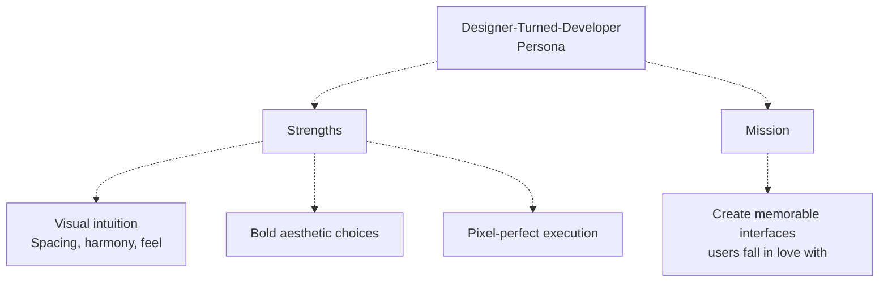
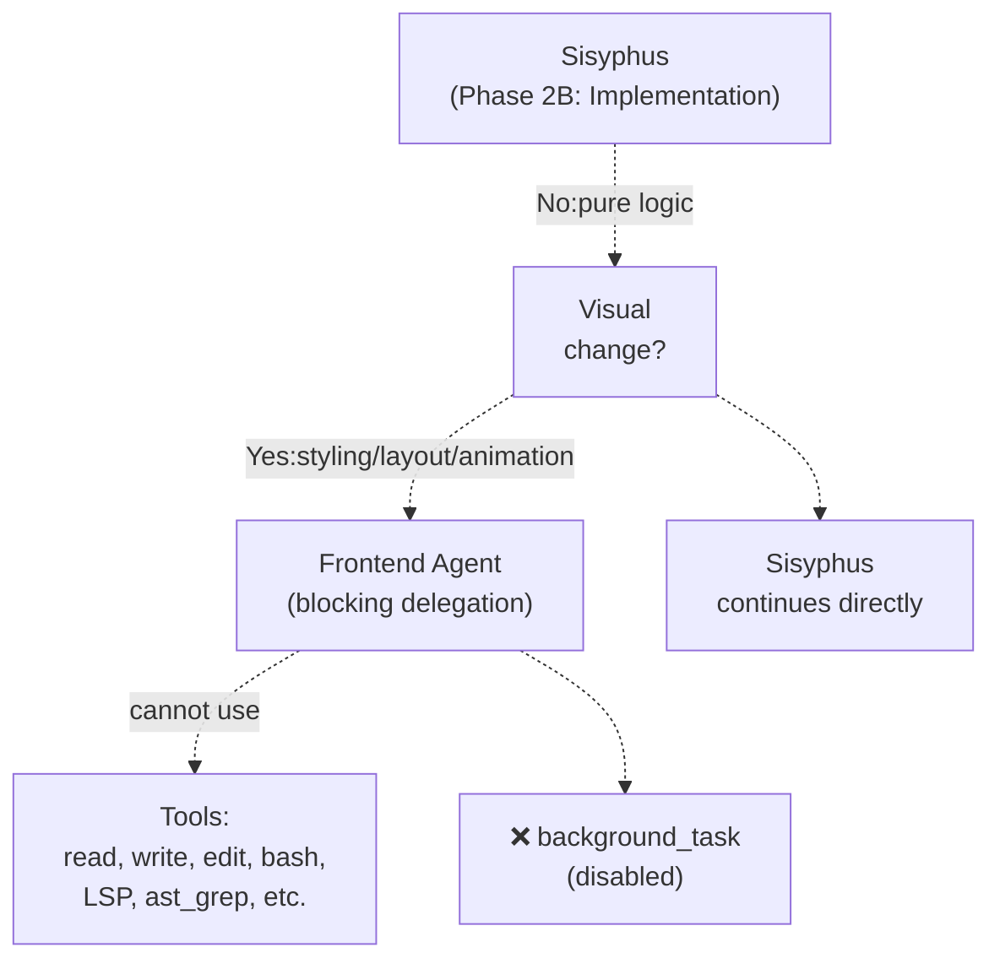
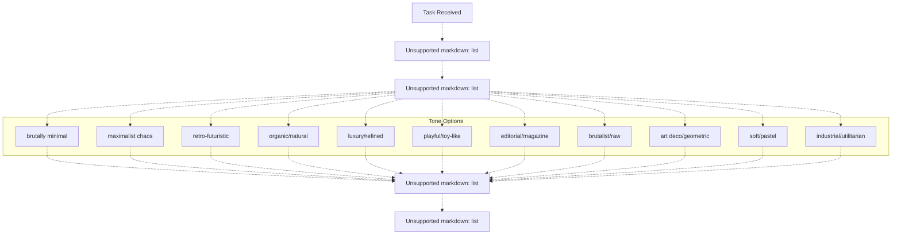
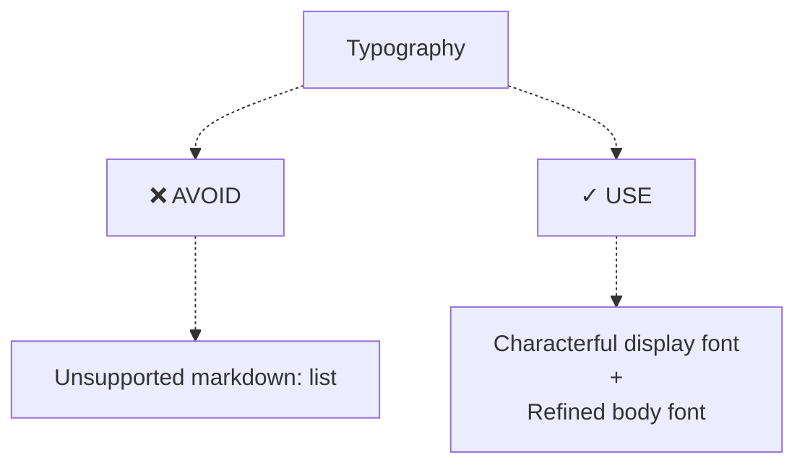
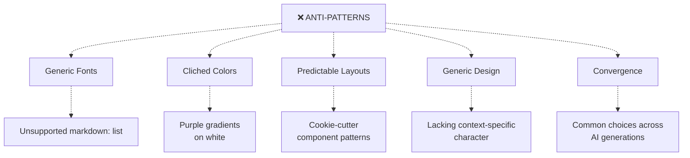
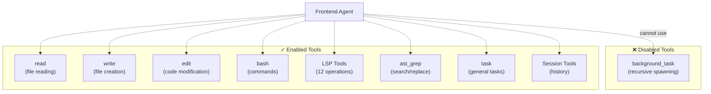
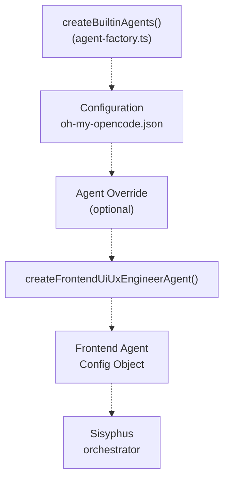

# Frontend UI/UX Engineer

> **Relevant source files**
> * [src/agents/document-writer.ts](https://github.com/code-yeongyu/oh-my-opencode/blob/b92cd6ab/src/agents/document-writer.ts)
> * [src/agents/explore.ts](https://github.com/code-yeongyu/oh-my-opencode/blob/b92cd6ab/src/agents/explore.ts)
> * [src/agents/frontend-ui-ux-engineer.ts](https://github.com/code-yeongyu/oh-my-opencode/blob/b92cd6ab/src/agents/frontend-ui-ux-engineer.ts)
> * [src/agents/librarian.ts](https://github.com/code-yeongyu/oh-my-opencode/blob/b92cd6ab/src/agents/librarian.ts)
> * [src/agents/multimodal-looker.ts](https://github.com/code-yeongyu/oh-my-opencode/blob/b92cd6ab/src/agents/multimodal-looker.ts)
> * [src/agents/oracle.ts](https://github.com/code-yeongyu/oh-my-opencode/blob/b92cd6ab/src/agents/oracle.ts)

This document details the Frontend UI/UX Engineer agent, a specialized subagent responsible for all visual and interface-related changes in the oh-my-opencode system. This agent is invoked by Sisyphus whenever any task involves styling, layout, animations, or visual design.

For information about the orchestrator that delegates to this agent, see [Sisyphus Orchestrator](/code-yeongyu/oh-my-opencode/4.1-sisyphus-orchestrator). For other specialized agents, see [Specialized Agents](/code-yeongyu/oh-my-opencode/4.2-specialized-agents).

## Purpose and Scope

The Frontend UI/UX Engineer handles:

* All visual changes to user interfaces
* Styling and layout modifications
* Animations and micro-interactions
* Component aesthetics and design systems
* Typography and color palette implementation

The agent is explicitly configured to handle visual work exclusively. Pure logic changes without visual impact remain with Sisyphus or other agents.

Sources: [src/agents/frontend-ui-ux-engineer.ts L1-L91](https://github.com/code-yeongyu/oh-my-opencode/blob/b92cd6ab/src/agents/frontend-ui-ux-engineer.ts#L1-L91)

## Agent Configuration

The Frontend agent is configured with specific model and tool access patterns:

```yaml
{
  description: "A designer-turned-developer who crafts stunning UI/UX...",
  mode: "subagent",
  model: "google/gemini-3-pro-preview",
  tools: { background_task: false }
}
```

### Configuration Parameters

| Parameter | Value | Rationale |
| --- | --- | --- |
| `model` | `google/gemini-3-pro-preview` | Default model, configurable via agent overrides |
| `mode` | `subagent` | Cannot be invoked directly by users |
| `temperature` | Not specified (uses default) | Standard creativity level |
| `tools.background_task` | `false` | Prevents recursive agent spawning |

All other tools (read, write, edit, bash, LSP, etc.) remain enabled, giving Frontend full implementation capabilities.

Sources: [src/agents/frontend-ui-ux-engineer.ts L3-L13](https://github.com/code-yeongyu/oh-my-opencode/blob/b92cd6ab/src/agents/frontend-ui-ux-engineer.ts#L3-L13)

## Agent Persona and Role

The Frontend agent operates with a designer-first mindset:



**Key Identity Traits:**

* Sees what pure developers miss (spacing, color harmony, micro-interactions)
* Envisions and creates beautiful interfaces even without mockups
* Obsesses over details while maintaining code quality
* Produces code that may be "a bit messy" but visual output is "always fire"

Sources: [src/agents/frontend-ui-ux-engineer.ts L14-L18](https://github.com/code-yeongyu/oh-my-opencode/blob/b92cd6ab/src/agents/frontend-ui-ux-engineer.ts#L14-L18)

## Delegation Pattern

Sisyphus delegates to Frontend using a **blocking pattern** (synchronous execution):



**Delegation Rules:**

| Scenario | Handler | Pattern |
| --- | --- | --- |
| ANY visual change | Frontend Agent | Blocking (run_in_background=false) |
| Styling/layout | Frontend Agent | Blocking |
| Animations | Frontend Agent | Blocking |
| Pure backend logic | Sisyphus | Direct execution |
| Mixed visual + logic | Frontend Agent | Handles visual portion only |

Sources: [src/agents/frontend-ui-ux-engineer.ts L1-L91](https://github.com/code-yeongyu/oh-my-opencode/blob/b92cd6ab/src/agents/frontend-ui-ux-engineer.ts#L1-L91)

## Work Principles

The agent follows five core principles encoded in its prompt:

### 1. Complete What's Asked

* Execute the exact task specified
* No scope creep
* Work until it works
* Never mark complete without verification

### 2. Leave It Better

* Ensure project remains in working state
* No broken builds or missing dependencies

### 3. Study Before Acting

* Examine existing patterns and conventions
* Check commit history with `git log`
* Understand why code is structured its way

### 4. Blend Seamlessly

* Match existing code patterns
* Code should look like the team wrote it
* Maintain consistency

### 5. Be Transparent

* Announce each step
* Explain reasoning
* Report successes AND failures

Sources: [src/agents/frontend-ui-ux-engineer.ts L23-L29](https://github.com/code-yeongyu/oh-my-opencode/blob/b92cd6ab/src/agents/frontend-ui-ux-engineer.ts#L23-L29)

## Design Process Workflow

The agent executes a structured design process before implementation:



### Design Decision Framework

Before coding, the agent commits to a design direction:

1. **Purpose**: Define problem and users
2. **Tone**: Select aesthetic extreme (not middle-ground)
3. **Constraints**: Note technical requirements (framework, performance, accessibility)
4. **Differentiation**: Identify the ONE memorable element

**Key Philosophy**: "Intentionality > intensity" - a clear direction executed with precision beats intense effects without purpose.

Sources: [src/agents/frontend-ui-ux-engineer.ts L32-L48](https://github.com/code-yeongyu/oh-my-opencode/blob/b92cd6ab/src/agents/frontend-ui-ux-engineer.ts#L32-L48)

## Aesthetic Guidelines

The agent follows strict aesthetic rules organized by category:

### Typography Rules



**Requirements:**

* Choose distinctive fonts
* Pair display font with body font
* Never use generic/common fonts

Sources: [src/agents/frontend-ui-ux-engineer.ts L53-L54](https://github.com/code-yeongyu/oh-my-opencode/blob/b92cd6ab/src/agents/frontend-ui-ux-engineer.ts#L53-L54)

### Color Guidelines

| Principle | Implementation |
| --- | --- |
| Cohesive palette | Use CSS variables for consistency |
| Dominant + accents | Strong primary colors with sharp accent colors |
| Avoid even distribution | Timid, evenly-distributed palettes lack impact |
| Anti-pattern | Purple gradients on white (AI slop indicator) |

Sources: [src/agents/frontend-ui-ux-engineer.ts L56-L57](https://github.com/code-yeongyu/oh-my-opencode/blob/b92cd6ab/src/agents/frontend-ui-ux-engineer.ts#L56-L57)

### Motion Design

**Focus**: High-impact moments over scattered micro-interactions

**Preferred Approach:**

```
One well-orchestrated page load with staggered reveals
> scattered micro-interactions everywhere
```

**Implementation Priority:**

1. CSS-only animations (preferred)
2. Motion library for React (when available)
3. JavaScript animations (when necessary)

**Key Techniques:**

* `animation-delay` for staggered reveals
* Scroll-triggering for progressive disclosure
* Hover states that surprise and delight

Sources: [src/agents/frontend-ui-ux-engineer.ts L59-L60](https://github.com/code-yeongyu/oh-my-opencode/blob/b92cd6ab/src/agents/frontend-ui-ux-engineer.ts#L59-L60)

### Spatial Composition

**Encouraged Patterns:**

* Unexpected layouts
* Asymmetry
* Overlapping elements
* Diagonal flow
* Grid-breaking components
* Generous negative space OR controlled density

**Philosophy**: Break conventional grid patterns to create memorable layouts.

Sources: [src/agents/frontend-ui-ux-engineer.ts L62-L63](https://github.com/code-yeongyu/oh-my-opencode/blob/b92cd6ab/src/agents/frontend-ui-ux-engineer.ts#L62-L63)

### Visual Detail Techniques

The agent creates atmosphere and depth using:

| Technique | Purpose |
| --- | --- |
| Gradient meshes | Visual richness |
| Noise textures | Organic feel |
| Geometric patterns | Structure and rhythm |
| Layered transparencies | Depth perception |
| Dramatic shadows | Emphasis and hierarchy |
| Decorative borders | Framing and separation |
| Custom cursors | Interactive personality |
| Grain overlays | Texture and warmth |

**Critical Rule**: Never default to solid colors - always add texture and depth.

Sources: [src/agents/frontend-ui-ux-engineer.ts L65-L66](https://github.com/code-yeongyu/oh-my-opencode/blob/b92cd6ab/src/agents/frontend-ui-ux-engineer.ts#L65-L66)

## Anti-Patterns (Strict Prohibitions)

The agent is explicitly instructed to NEVER use these patterns:



**Rationale**: These patterns signal AI-generated design lacking human intentionality and context awareness.

Sources: [src/agents/frontend-ui-ux-engineer.ts L70-L77](https://github.com/code-yeongyu/oh-my-opencode/blob/b92cd6ab/src/agents/frontend-ui-ux-engineer.ts#L70-L77)

## Execution Strategy

The agent matches implementation complexity to aesthetic vision:

### Complexity Mapping

| Aesthetic Choice | Code Approach |
| --- | --- |
| **Maximalist** | Elaborate code with extensive animations and effects |
| **Minimalist** | Restraint, precision, careful spacing and typography |
| **Brutalist** | Raw, minimal styling with bold typography |
| **Luxury** | Refined details, smooth animations, attention to spacing |
| **Playful** | Dynamic interactions, unexpected animations |

### Creative Mandate

The agent is instructed to:

* Interpret requests creatively
* Make unexpected choices
* Ensure designs feel genuinely context-specific
* Vary between light/dark themes
* Use different fonts and aesthetics across projects
* Never converge on common patterns

**Philosophy**: "You are capable of extraordinary creative work—don't hold back."

Sources: [src/agents/frontend-ui-ux-engineer.ts L80-L86](https://github.com/code-yeongyu/oh-my-opencode/blob/b92cd6ab/src/agents/frontend-ui-ux-engineer.ts#L80-L86)

## Tool Access Pattern



**Tool Access Summary:**

| Category | Status | Rationale |
| --- | --- | --- |
| File operations | ✓ Enabled | Full implementation capability |
| LSP tools | ✓ Enabled | Type-aware refactoring |
| AST-grep | ✓ Enabled | Structural code changes |
| Bash | ✓ Enabled | Build commands, package installation |
| background_task | ❌ Disabled | Prevents infinite agent recursion |

The `background_task` prohibition prevents Frontend from spawning additional agents, maintaining a flat delegation hierarchy.

Sources: [src/agents/frontend-ui-ux-engineer.ts L13](https://github.com/code-yeongyu/oh-my-opencode/blob/b92cd6ab/src/agents/frontend-ui-ux-engineer.ts#L13-L13)

## Integration with Agent Factory

The Frontend agent is created by the agent factory system:



### Configuration Override

Users can override the default model in `oh-my-opencode.json`:

```json
{
  "agents": {
    "override": {
      "FrontendEngineer": {
        "model": "anthropic/claude-sonnet-4-5",
        "temperature": 0.2
      }
    }
  }
}
```

The factory function accepts model parameter: `createFrontendUiUxEngineerAgent(model: string = DEFAULT_MODEL)`

Sources: [src/agents/frontend-ui-ux-engineer.ts L5-L8](https://github.com/code-yeongyu/oh-my-opencode/blob/b92cd6ab/src/agents/frontend-ui-ux-engineer.ts#L5-L8)

## Comparison with Other Agents

The Frontend agent's role is distinct from other specialized agents:

| Agent | Visual Work | Code Changes | Background Tasks |
| --- | --- | --- | --- |
| **Frontend** | ✓ All visual changes | ✓ Full access | ❌ Disabled |
| **Sisyphus** | ❌ Never touches styling | ✓ Logic only | ✓ Enabled |
| **Oracle** | ❌ Read-only advisor | ❌ No writes | ❌ Disabled |
| **Explore** | ❌ Search only | ❌ No writes | ❌ Disabled |
| **Librarian** | ❌ Research only | ❌ No writes | ❌ Disabled |
| **DocWriter** | ❌ Documentation only | ✓ Doc files only | ❌ Disabled |

**Key Differentiator**: Frontend is the ONLY agent authorized to make styling, layout, and animation changes.

Sources: [src/agents/frontend-ui-ux-engineer.ts L1-L91](https://github.com/code-yeongyu/oh-my-opencode/blob/b92cd6ab/src/agents/frontend-ui-ux-engineer.ts#L1-L91)

 [src/agents/oracle.ts L79](https://github.com/code-yeongyu/oh-my-opencode/blob/b92cd6ab/src/agents/oracle.ts#L79-L79)

 [src/agents/librarian.ts L12](https://github.com/code-yeongyu/oh-my-opencode/blob/b92cd6ab/src/agents/librarian.ts#L12-L12)

 [src/agents/explore.ts L12](https://github.com/code-yeongyu/oh-my-opencode/blob/b92cd6ab/src/agents/explore.ts#L12-L12)

## Usage Examples

### Typical Invocation Scenarios

**Scenario 1: User Request with Visual Component**

```sql
User: "Add a dashboard with charts showing metrics"

Sisyphus Analysis:
- Visual component: Dashboard UI, charts
- Logic component: Data fetching, metric calculation

Delegation:
1. Frontend Agent: Create dashboard layout, style charts
2. Sisyphus: Implement data fetching and metric logic
```

**Scenario 2: Pure Styling Task**

```yaml
User: "Make the buttons more modern and add hover effects"

Sisyphus Action:
- Delegates entirely to Frontend Agent (blocking)
- Waits for completion before continuing

Frontend Execution:
1. Study existing button patterns
2. Choose aesthetic direction (e.g., "soft/modern")
3. Implement CSS/component changes
4. Verify hover states work
```

**Scenario 3: Mixed Implementation**

```sql
User: "Create a settings page"

Sisyphus Todo List:
- [ ] Create settings page layout (Frontend)
- [ ] Implement settings API calls (Sisyphus)
- [ ] Style form components (Frontend)
- [ ] Add validation logic (Sisyphus)
```

Sources: [src/agents/frontend-ui-ux-engineer.ts L1-L91](https://github.com/code-yeongyu/oh-my-opencode/blob/b92cd6ab/src/agents/frontend-ui-ux-engineer.ts#L1-L91)

## Best Practices for Agent Invocation

When Sisyphus delegates to Frontend, it should:

1. **Be Specific**: Provide clear visual requirements * Good: "Create a minimalist navigation bar with subtle hover effects" * Bad: "Make a navbar"
2. **Provide Context**: Include aesthetic constraints * Existing design system * Brand guidelines * Target aesthetic
3. **Set Boundaries**: Define scope clearly * Visual changes only vs. full feature * Which components need styling * What to leave unchanged
4. **Wait for Completion**: Use blocking delegation * Don't proceed with logic changes until UI is complete * Visual foundation affects logic implementation

Sources: [src/agents/frontend-ui-ux-engineer.ts L23-L29](https://github.com/code-yeongyu/oh-my-opencode/blob/b92cd6ab/src/agents/frontend-ui-ux-engineer.ts#L23-L29)