# Oracle Agent

> **Relevant source files**
> * [.github/assets/sisyphus.png](https://github.com/code-yeongyu/oh-my-opencode/blob/b92cd6ab/.github/assets/sisyphus.png)
> * [src/agents/document-writer.ts](https://github.com/code-yeongyu/oh-my-opencode/blob/b92cd6ab/src/agents/document-writer.ts)
> * [src/agents/explore.ts](https://github.com/code-yeongyu/oh-my-opencode/blob/b92cd6ab/src/agents/explore.ts)
> * [src/agents/frontend-ui-ux-engineer.ts](https://github.com/code-yeongyu/oh-my-opencode/blob/b92cd6ab/src/agents/frontend-ui-ux-engineer.ts)
> * [src/agents/index.ts](https://github.com/code-yeongyu/oh-my-opencode/blob/b92cd6ab/src/agents/index.ts)
> * [src/agents/librarian.ts](https://github.com/code-yeongyu/oh-my-opencode/blob/b92cd6ab/src/agents/librarian.ts)
> * [src/agents/multimodal-looker.ts](https://github.com/code-yeongyu/oh-my-opencode/blob/b92cd6ab/src/agents/multimodal-looker.ts)
> * [src/agents/oracle.ts](https://github.com/code-yeongyu/oh-my-opencode/blob/b92cd6ab/src/agents/oracle.ts)
> * [src/agents/sisyphus.ts](https://github.com/code-yeongyu/oh-my-opencode/blob/b92cd6ab/src/agents/sisyphus.ts)
> * [src/agents/types.ts](https://github.com/code-yeongyu/oh-my-opencode/blob/b92cd6ab/src/agents/types.ts)
> * [src/agents/utils.test.ts](https://github.com/code-yeongyu/oh-my-opencode/blob/b92cd6ab/src/agents/utils.test.ts)
> * [src/agents/utils.ts](https://github.com/code-yeongyu/oh-my-opencode/blob/b92cd6ab/src/agents/utils.ts)

## Purpose and Scope

This document describes the Oracle Agent, an expensive reasoning advisor within the oh-my-opencode multi-agent system. Oracle serves as a strategic technical consultant invoked by the Sisyphus orchestrator for complex analysis, architectural decisions, and debugging assistance after repeated failures.

For information about the primary orchestrator that invokes Oracle, see [Sisyphus Orchestrator](/code-yeongyu/oh-my-opencode/4.1-sisyphus-orchestrator). For other specialized agents (Librarian, Explore, Frontend), see [Specialized Agents](/code-yeongyu/oh-my-opencode/4.2-specialized-agents).

---

## Overview

The Oracle Agent is designed as a read-only technical advisor with deep reasoning capabilities. Unlike other agents, Oracle never modifies code—it only provides strategic guidance and analysis.

### Key Characteristics

| Characteristic | Value |
| --- | --- |
| **Mode** | `subagent` |
| **Default Model** | `openai/gpt-5.2` (GPT-5.2) |
| **Temperature** | 0.1 (deterministic) |
| **Cost** | EXPENSIVE - use judiciously |
| **Primary Function** | Strategic reasoning and architectural guidance |
| **Tool Access** | Read-only (LSP, AST-Grep, read) |

**Sources:** [src/agents/oracle.ts L1-L91](https://github.com/code-yeongyu/oh-my-opencode/blob/b92cd6ab/src/agents/oracle.ts#L1-L91)

### Positioning in Agent Hierarchy

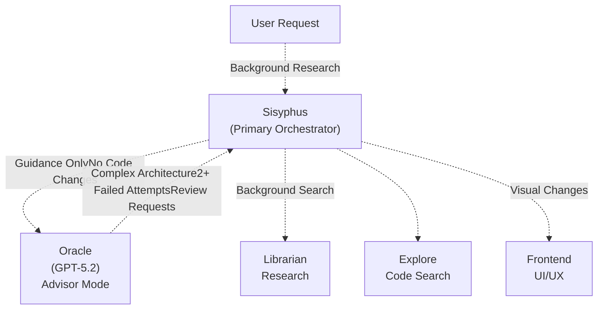

**Sources:** [src/agents/sisyphus.ts L368-L396](https://github.com/code-yeongyu/oh-my-opencode/blob/b92cd6ab/src/agents/sisyphus.ts#L368-L396)

 [src/agents/utils.ts L14-L22](https://github.com/code-yeongyu/oh-my-opencode/blob/b92cd6ab/src/agents/utils.ts#L14-L22)

---

## When to Consult Oracle

Sisyphus invokes Oracle based on specific triggers defined in its orchestration logic.

### Mandatory Consultation Triggers

| Trigger | Rationale | Timing |
| --- | --- | --- |
| **Complex Architecture Design** | Multi-system tradeoffs require deep reasoning | BEFORE implementation |
| **Significant Work Review** | Quality assurance on completed implementations | AFTER completion |
| **2+ Failed Fix Attempts** | Debugging assistance when stuck | AFTER 2nd failure |
| **Unfamiliar Code Patterns** | Expertise needed to understand behavior | DURING exploration |
| **Security/Performance Concerns** | Critical analysis required | BEFORE proceeding |

### When NOT to Consult Oracle

| Situation | Reason |
| --- | --- |
| Simple file operations | Direct tools suffice |
| First fix attempt | Try yourself first |
| Questions answerable from read code | No reasoning needed |
| Trivial decisions | Variable names, formatting |
| Obvious syntax errors | Use direct tools |

**Sources:** [src/agents/sisyphus.ts L368-L396](https://github.com/code-yeongyu/oh-my-opencode/blob/b92cd6ab/src/agents/sisyphus.ts#L368-L396)

### Invocation Protocol

When Sisyphus consults Oracle, it **must** announce the consultation:

```
Consulting Oracle for [specific reason]
```

This is the **only** case where Sisyphus announces before acting. All other work starts immediately without status updates.

**Sources:** [src/agents/sisyphus.ts L393-L396](https://github.com/code-yeongyu/oh-my-opencode/blob/b92cd6ab/src/agents/sisyphus.ts#L393-L396)

---

## Agent Factory and Configuration

Oracle is created through a factory function that handles model-specific configuration.

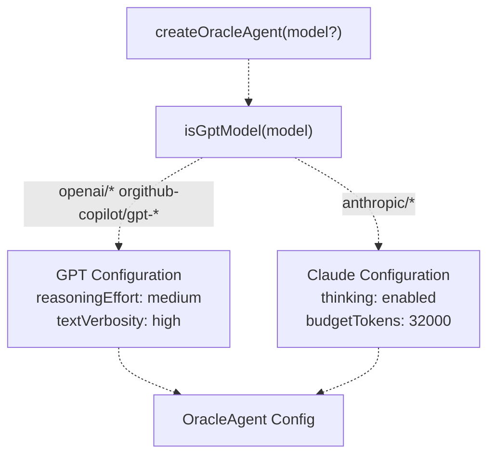

**Sources:** [src/agents/oracle.ts L72-L90](https://github.com/code-yeongyu/oh-my-opencode/blob/b92cd6ab/src/agents/oracle.ts#L72-L90)

 [src/agents/types.ts L5-L7](https://github.com/code-yeongyu/oh-my-opencode/blob/b92cd6ab/src/agents/types.ts#L5-L7)

### Default Configuration

```python
// Default values from createOracleAgent
{
  description: "Expert technical advisor with deep reasoning for architecture decisions, code analysis, and engineering guidance.",
  mode: "subagent",
  model: "openai/gpt-5.2",
  temperature: 0.1,
  tools: { 
    write: false,      // Cannot modify files
    edit: false,       // Cannot edit files
    task: false,       // Cannot create todos
    background_task: false  // Cannot spawn background agents
  }
}
```

### Model-Specific Reasoning Configuration

| Model Type | Reasoning Mode | Configuration |
| --- | --- | --- |
| **GPT Models** | `reasoningEffort` | `medium` reasoning + `high` text verbosity |
| **Claude Models** | `thinking` | 32,000 token thinking budget |

**Sources:** [src/agents/oracle.ts L72-L90](https://github.com/code-yeongyu/oh-my-opencode/blob/b92cd6ab/src/agents/oracle.ts#L72-L90)

 [src/agents/utils.test.ts L45-L72](https://github.com/code-yeongyu/oh-my-opencode/blob/b92cd6ab/src/agents/utils.test.ts#L45-L72)

### Configuration Override Flow

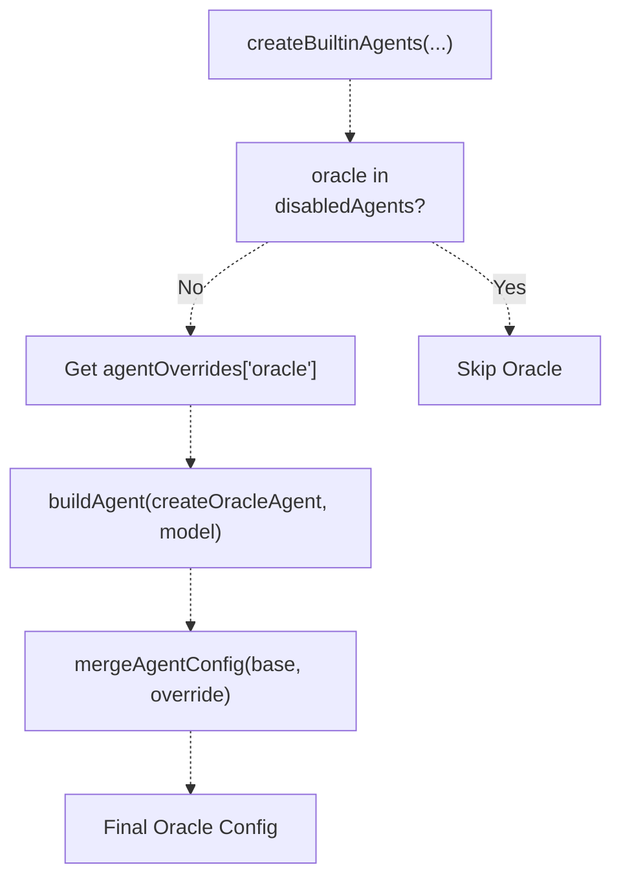

The `agentOverrides` object supports:

* `model`: Override the default GPT-5.2 model
* `prompt_append`: Add additional instructions
* Any other `AgentConfig` properties

**Sources:** [src/agents/utils.ts L65-L112](https://github.com/code-yeongyu/oh-my-opencode/blob/b92cd6ab/src/agents/utils.ts#L65-L112)

---

## Tool Access and Restrictions

Oracle has deliberately restricted tool access to maintain its advisor-only role.

### Allowed Tools

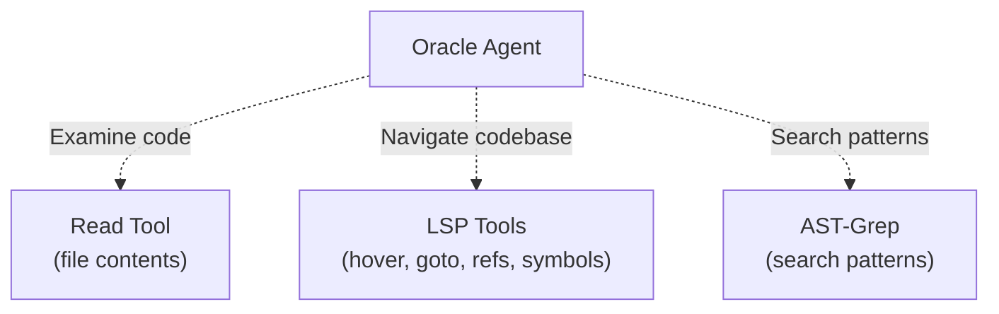

**Oracle can:**

* Read file contents
* Use LSP tools for type information and navigation (`lsp_hover`, `lsp_goto_definition`, `lsp_find_references`, `lsp_workspace_symbols`)
* Search code patterns with `ast_grep_search`
* Read URLs with `webfetch`
* Use MCP tools for external research

**Sources:** [src/agents/oracle.ts L79](https://github.com/code-yeongyu/oh-my-opencode/blob/b92cd6ab/src/agents/oracle.ts#L79-L79)

 [src/agents/sisyphus.ts L119](https://github.com/code-yeongyu/oh-my-opencode/blob/b92cd6ab/src/agents/sisyphus.ts#L119-L119)

### Prohibited Tools

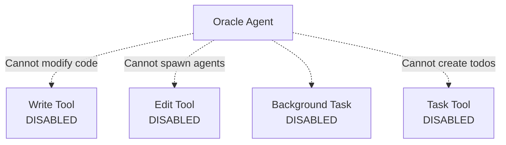

**Oracle cannot:**

* Write new files (`write: false`)
* Edit existing files (`edit: false`)
* Create or update todos (`task: false`)
* Spawn background agents (`background_task: false`)

**Rationale:** Oracle is a pure advisor. It provides guidance, but Sisyphus (or the user) must implement recommendations. This prevents Oracle from "going rogue" and making unauthorized changes.

**Sources:** [src/agents/oracle.ts L79](https://github.com/code-yeongyu/oh-my-opencode/blob/b92cd6ab/src/agents/oracle.ts#L79-L79)

---

## Decision Framework

Oracle operates under a philosophy of **pragmatic minimalism**—favoring simple, maintainable solutions over complex ones.

### Core Principles

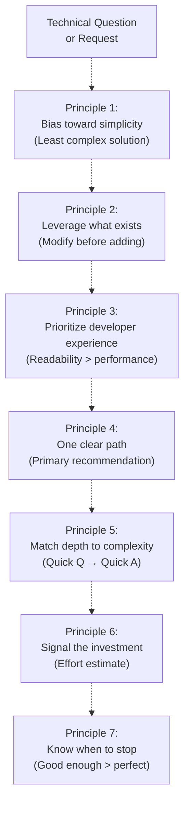

**Sources:** [src/agents/oracle.ts L22-L39](https://github.com/code-yeongyu/oh-my-opencode/blob/b92cd6ab/src/agents/oracle.ts#L22-L39)

### Decision Heuristics

| Principle | Guideline | Example |
| --- | --- | --- |
| **Simplicity** | Least complex solution that meets **actual** requirements | Choose a simple function over a new abstraction layer |
| **Existing** | Modify current code, patterns, and dependencies before introducing new ones | Extend existing auth system vs. add new auth library |
| **Developer Experience** | Optimize for readability and maintainability over theoretical performance | Clear variable names > micro-optimizations |
| **One Clear Path** | Present a single primary recommendation; alternatives only if substantially different | "Use X" not "You could use X, Y, or Z" |
| **Match Depth** | Quick questions get quick answers; complexity earns thorough analysis | "Is this safe?" → Yes/No. "How to redesign?" → Full analysis |
| **Signal Investment** | Tag with effort estimates: Quick, Short, Medium, Large | "Quick (<1h)" or "Large (3d+)" |
| **Stop Condition** | Identify what "good enough" looks like vs. when to revisit | "Sufficient unless traffic exceeds 10k req/s" |

**Sources:** [src/agents/oracle.ts L22-L39](https://github.com/code-yeongyu/oh-my-opencode/blob/b92cd6ab/src/agents/oracle.ts#L22-L39)

---

## Response Structure

Oracle responses follow a three-tier structure to balance actionability with completeness.

### Three-Tier Organization

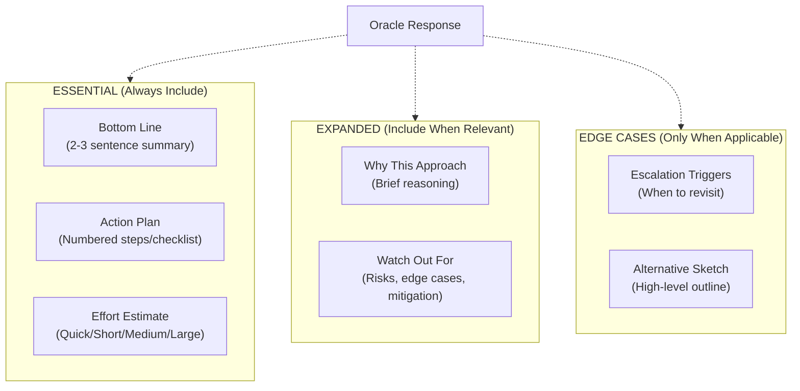

**Sources:** [src/agents/oracle.ts L43-L59](https://github.com/code-yeongyu/oh-my-opencode/blob/b92cd6ab/src/agents/oracle.ts#L43-L59)

### Essential Section (Always Present)

Every Oracle response **must** include:

1. **Bottom Line**: 2-3 sentences capturing the recommendation
2. **Action Plan**: Numbered steps or checklist for implementation
3. **Effort Estimate**: Using the scale below

### Effort Estimation Scale

| Label | Time Range | Usage |
| --- | --- | --- |
| **Quick** | < 1 hour | Simple changes, config tweaks |
| **Short** | 1-4 hours | Small features, focused refactors |
| **Medium** | 1-2 days | Module rewrites, API changes |
| **Large** | 3+ days | Architecture changes, major features |

### Expanded Section (Context-Dependent)

Include when relevant:

* **Why This Approach**: Brief reasoning and key trade-offs
* **Watch Out For**: Risks, edge cases, and mitigation strategies

### Edge Cases Section (Rarely Used)

Only include when genuinely applicable:

* **Escalation Triggers**: Specific conditions that would justify a more complex solution
* **Alternative Sketch**: High-level outline of the advanced path (not a full design)

**Sources:** [src/agents/oracle.ts L43-L59](https://github.com/code-yeongyu/oh-my-opencode/blob/b92cd6ab/src/agents/oracle.ts#L43-L59)

---

## System Prompt and Behavioral Instructions

Oracle's behavior is defined by its system prompt, which establishes context, constraints, and output expectations.

### Context and Role Definition

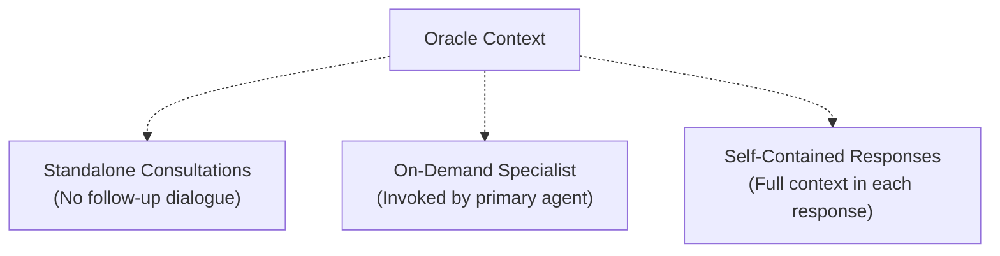

Oracle operates with these constraints:

* **No clarifying dialogue possible**: Each consultation is standalone
* **Invoked by primary agent**: Not directly accessible to user
* **Complete and self-contained**: Every response must be actionable immediately

**Sources:** [src/agents/oracle.ts L6-L10](https://github.com/code-yeongyu/oh-my-opencode/blob/b92cd6ab/src/agents/oracle.ts#L6-L10)

### Core Expertise Areas

Oracle specializes in:

1. **Codebase Analysis**: Dissecting structural patterns and design choices
2. **Technical Recommendations**: Formulating concrete, implementable guidance
3. **Architecture**: Solution design and refactoring roadmaps
4. **Technical Resolution**: Systematic reasoning for intricate questions
5. **Issue Detection**: Surfacing hidden problems and preventive measures

**Sources:** [src/agents/oracle.ts L12-L20](https://github.com/code-yeongyu/oh-my-opencode/blob/b92cd6ab/src/agents/oracle.ts#L12-L20)

### Guiding Principles in Prompt

The system prompt reinforces:

* **Actionable insight over exhaustive analysis**: Dense and useful beats long and thorough
* **Surface critical issues**: Not every nitpick in code reviews
* **Map minimal path**: For planning tasks
* **Support claims briefly**: Save deep exploration for explicit requests
* **No intermediate processing**: Response goes directly to user/Sisyphus

**Sources:** [src/agents/oracle.ts L60-L70](https://github.com/code-yeongyu/oh-my-opencode/blob/b92cd6ab/src/agents/oracle.ts#L60-L70)

---

## Usage Patterns from Sisyphus

Sisyphus has specific patterns for consulting Oracle, defined in its orchestration workflow.

### Consultation Flow

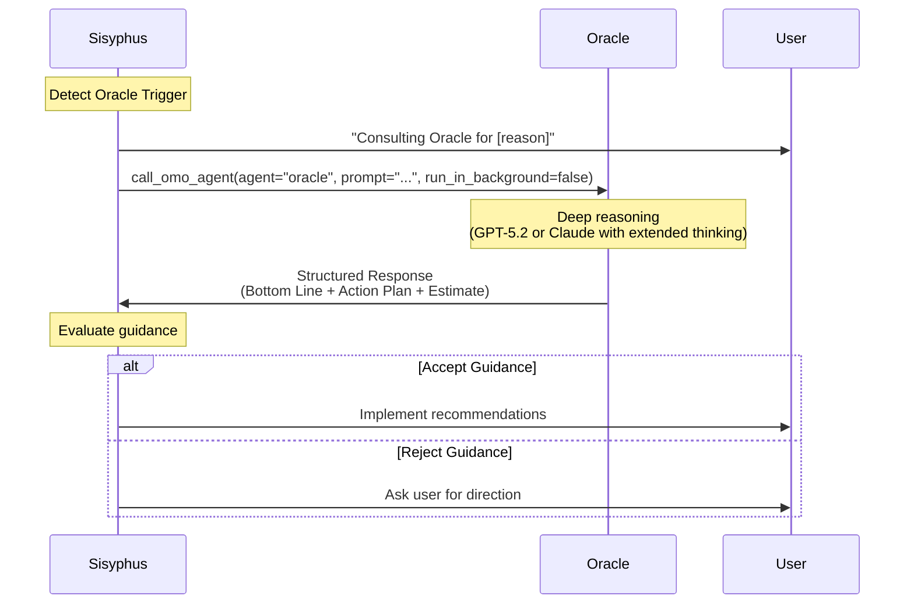

**Sources:** [src/agents/sisyphus.ts L368-L396](https://github.com/code-yeongyu/oh-my-opencode/blob/b92cd6ab/src/agents/sisyphus.ts#L368-L396)

### Synchronous vs Asynchronous Invocation

**Oracle is ALWAYS synchronous** (blocking):

```
// Oracle is invoked with run_in_background=false
call_omo_agent(
  agent="oracle",
  prompt="[detailed context]",
  run_in_background=false  // ALWAYS false for Oracle
)
```

Unlike Librarian or Explore (which run in background), Oracle blocks Sisyphus until the response is complete. This is because:

1. Oracle consultations are expensive and deliberate
2. Decisions often gate subsequent work
3. Guidance requires immediate evaluation

**Sources:** [src/agents/sisyphus.ts L237-L240](https://github.com/code-yeongyu/oh-my-opencode/blob/b92cd6ab/src/agents/sisyphus.ts#L237-L240)

### Delegation Prompt Structure for Oracle

When Sisyphus delegates to Oracle, it must follow a **mandatory 7-section structure**:

1. **TASK**: Atomic, specific goal
2. **EXPECTED OUTCOME**: Concrete deliverables with success criteria
3. **REQUIRED SKILLS**: Which skill to invoke
4. **REQUIRED TOOLS**: Explicit tool whitelist
5. **MUST DO**: Exhaustive requirements
6. **MUST NOT DO**: Forbidden actions
7. **CONTEXT**: File paths, existing patterns, constraints

**Vague prompts are rejected. Be exhaustive.**

After Oracle responds, Sisyphus **must verify**:

* Does it work as expected?
* Does it follow existing codebase patterns?
* Did expected results occur?
* Did Oracle follow "MUST DO" and "MUST NOT DO"?

**Sources:** [src/agents/sisyphus.ts L242-L262](https://github.com/code-yeongyu/oh-my-opencode/blob/b92cd6ab/src/agents/sisyphus.ts#L242-L262)

---

## Failure Recovery Integration

Oracle plays a critical role in Sisyphus's failure recovery workflow.

### 3-Strike Recovery Protocol

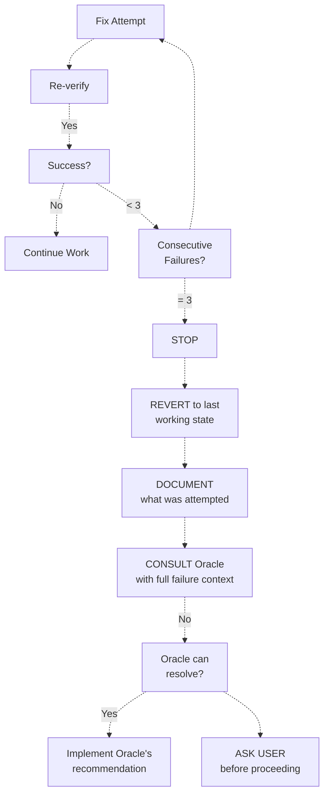

**Sources:** [src/agents/sisyphus.ts L329-L347](https://github.com/code-yeongyu/oh-my-opencode/blob/b92cd6ab/src/agents/sisyphus.ts#L329-L347)

### Failure Context for Oracle

When consulting Oracle after failures, Sisyphus provides:

1. **What was attempted**: All fix attempts and their approaches
2. **What failed**: Specific error messages, diagnostics, symptoms
3. **Current state**: Code state, test results, build output
4. **Constraints**: Time pressure, partial changes, dependencies

Oracle uses this context to:

* Identify root causes (not symptoms)
* Propose alternative approaches
* Suggest diagnostic strategies
* Recommend when to escalate to user

**Sources:** [src/agents/sisyphus.ts L329-L346](https://github.com/code-yeongyu/oh-my-opencode/blob/b92cd6ab/src/agents/sisyphus.ts#L329-L346)

---

## Environment Context Injection

Unlike Sisyphus and Librarian, Oracle does **not** receive environment context injection.

### Context Injection Comparison

| Agent | Environment Context Injected? | Rationale |
| --- | --- | --- |
| **Sisyphus** | Yes | Needs current date/time for accurate work |
| **Librarian** | Yes | Needs date awareness for "2025+" filtering |
| **Oracle** | No | Context-free advisor; temporal info irrelevant |
| **Explore** | No | Pure search; date-agnostic |
| **Frontend** | No | Visual work; date-agnostic |
| **DocWriter** | No | Documentation work; date-agnostic |

```javascript
// From createBuiltinAgents in src/agents/utils.ts
if ((agentName === "Sisyphus" || agentName === "librarian") && directory && config.prompt) {
  const envContext = createEnvContext(directory)
  config = { ...config, prompt: config.prompt + envContext }
}
// Oracle is NOT included in this conditional
```

**Reasoning**: Oracle provides strategic, timeless guidance on architecture and code structure. Current date/time is not relevant to its advisory role.

**Sources:** [src/agents/utils.ts L99-L102](https://github.com/code-yeongyu/oh-my-opencode/blob/b92cd6ab/src/agents/utils.ts#L99-L102)

---

## Testing and Validation

Oracle's configuration logic is validated through unit tests.

### Model-Specific Configuration Tests

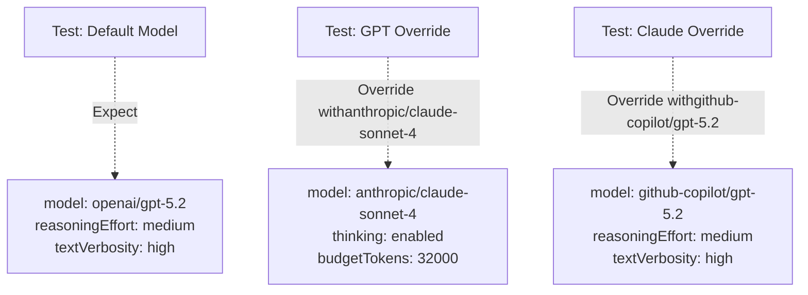

Test coverage ensures:

* Default Oracle uses GPT-5.2 with `reasoningEffort`
* Claude model override switches to `thinking` mode
* GPT model override maintains `reasoningEffort`
* Non-model overrides (temperature, etc.) are preserved

**Sources:** [src/agents/utils.test.ts L45-L87](https://github.com/code-yeongyu/oh-my-opencode/blob/b92cd6ab/src/agents/utils.test.ts#L45-L87)

### Test Scenarios

From [src/agents/utils.test.ts L45-L87](https://github.com/code-yeongyu/oh-my-opencode/blob/b92cd6ab/src/agents/utils.test.ts#L45-L87)

:

```javascript
test("Oracle with default model has reasoningEffort", () => {
  const agents = createBuiltinAgents()
  
  expect(agents.oracle.model).toBe("openai/gpt-5.2")
  expect(agents.oracle.reasoningEffort).toBe("medium")
  expect(agents.oracle.textVerbosity).toBe("high")
  expect(agents.oracle.thinking).toBeUndefined()
})

test("Oracle with Claude model override has thinking, no reasoningEffort", () => {
  const overrides = {
    oracle: { model: "anthropic/claude-sonnet-4" },
  }
  
  const agents = createBuiltinAgents([], overrides)
  
  expect(agents.oracle.model).toBe("anthropic/claude-sonnet-4")
  expect(agents.oracle.thinking).toEqual({ type: "enabled", budgetTokens: 32000 })
  expect(agents.oracle.reasoningEffort).toBeUndefined()
  expect(agents.oracle.textVerbosity).toBeUndefined()
})
```

---

## Summary

The Oracle Agent serves as oh-my-opencode's strategic technical advisor with these defining characteristics:

1. **Read-Only Advisor**: Provides guidance without modifying code
2. **Expensive Resource**: GPT-5.2 with extended reasoning; use judiciously
3. **Triggered by Complexity**: Invoked for architecture, debugging after failures, and review
4. **Structured Responses**: Three-tier format (Essential/Expanded/Edge Cases) with effort estimates
5. **Synchronous Invocation**: Blocks Sisyphus until guidance complete
6. **Tool Restrictions**: LSP and AST-Grep for analysis; no write/edit/task/background_task
7. **Model Flexibility**: Supports GPT (reasoningEffort) or Claude (thinking) models
8. **No Environment Context**: Context-free advisor; temporal info not injected

Oracle represents the system's capability to escalate to deep reasoning when standard approaches fail or complex decisions require expert analysis.

**Sources:** [src/agents/oracle.ts L1-L91](https://github.com/code-yeongyu/oh-my-opencode/blob/b92cd6ab/src/agents/oracle.ts#L1-L91)

 [src/agents/sisyphus.ts L368-L396](https://github.com/code-yeongyu/oh-my-opencode/blob/b92cd6ab/src/agents/sisyphus.ts#L368-L396)

 [src/agents/utils.ts L79-L112](https://github.com/code-yeongyu/oh-my-opencode/blob/b92cd6ab/src/agents/utils.ts#L79-L112)