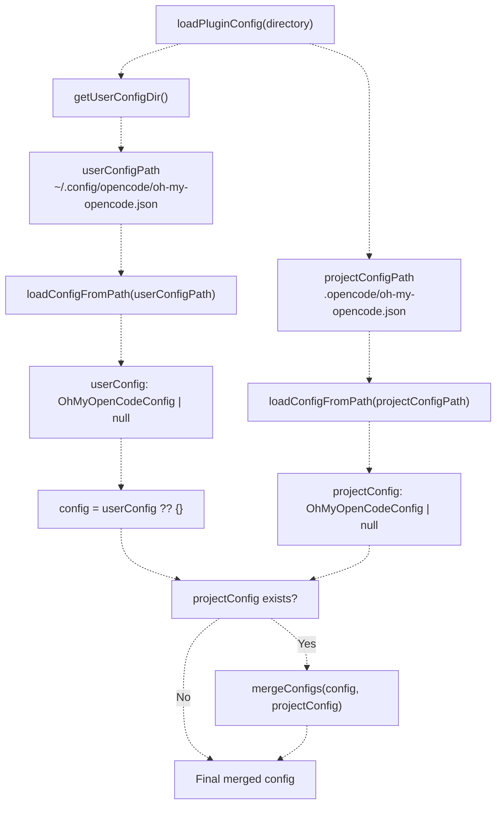
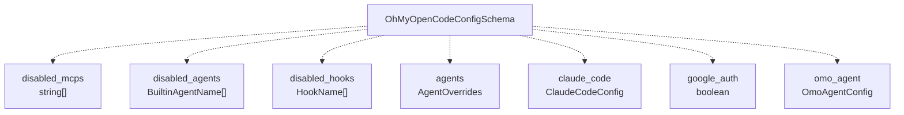
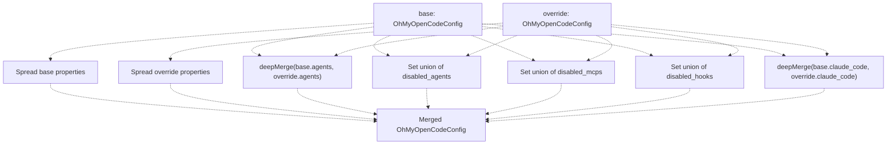
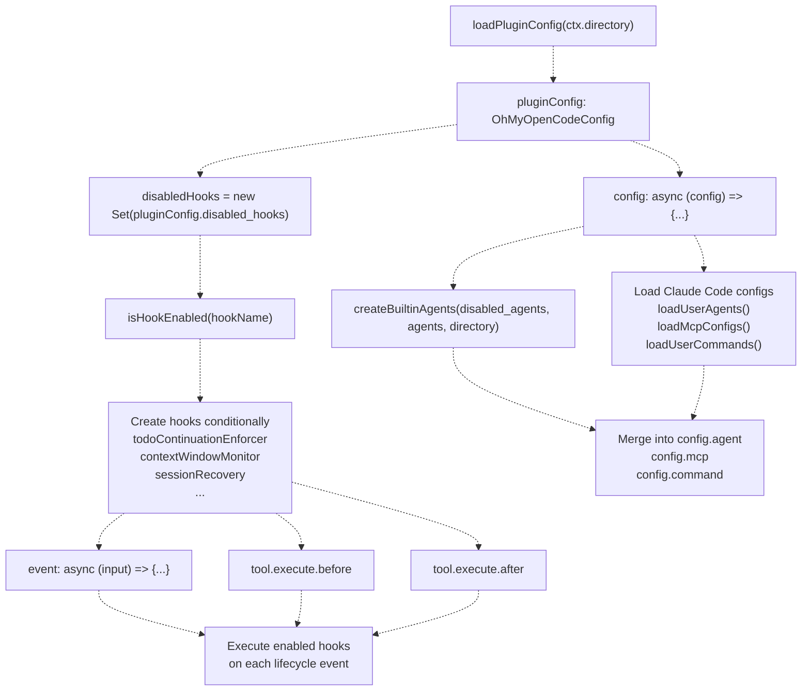
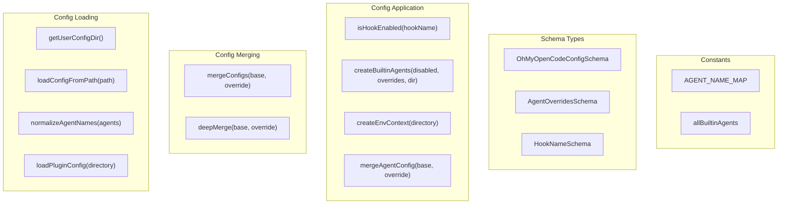
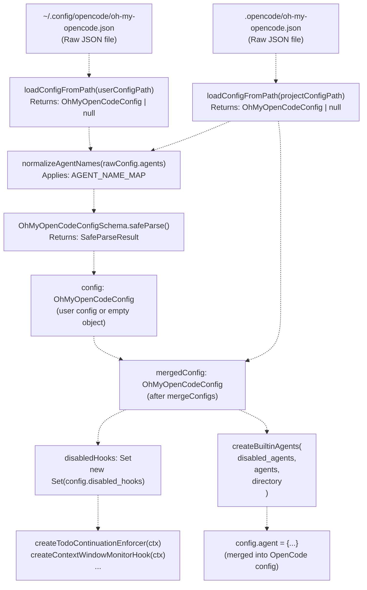

# Configuration System

> **Relevant source files**
> * [assets/oh-my-opencode.schema.json](https://github.com/code-yeongyu/oh-my-opencode/blob/b92cd6ab/assets/oh-my-opencode.schema.json)
> * [bun.lock](https://github.com/code-yeongyu/oh-my-opencode/blob/b92cd6ab/bun.lock)
> * [package.json](https://github.com/code-yeongyu/oh-my-opencode/blob/b92cd6ab/package.json)
> * [src/cli/config-manager.ts](https://github.com/code-yeongyu/oh-my-opencode/blob/b92cd6ab/src/cli/config-manager.ts)
> * [src/config/schema.ts](https://github.com/code-yeongyu/oh-my-opencode/blob/b92cd6ab/src/config/schema.ts)
> * [src/hooks/index.ts](https://github.com/code-yeongyu/oh-my-opencode/blob/b92cd6ab/src/hooks/index.ts)
> * [src/index.ts](https://github.com/code-yeongyu/oh-my-opencode/blob/b92cd6ab/src/index.ts)
> * [src/shared/jsonc-parser.test.ts](https://github.com/code-yeongyu/oh-my-opencode/blob/b92cd6ab/src/shared/jsonc-parser.test.ts)
> * [src/shared/jsonc-parser.ts](https://github.com/code-yeongyu/oh-my-opencode/blob/b92cd6ab/src/shared/jsonc-parser.ts)

## Purpose and Scope

The Configuration System manages the loading, validation, merging, and application of user preferences for the oh-my-opencode plugin. It implements a two-tier override hierarchy where project-level settings take precedence over user-level defaults, and provides schema validation using Zod to ensure type safety and catch configuration errors early.

This page covers configuration loading mechanics, schema structure, and merge strategies. For information about configuring specific agents, see [Agent Configuration](#4.6). For Claude Code compatibility toggles, see [Configuration Loading](/code-yeongyu/oh-my-opencode/8.1-mcp-system-overview).

**Sources:** [src/index.ts L1-L178](https://github.com/code-yeongyu/oh-my-opencode/blob/b92cd6ab/src/index.ts#L1-L178)

 [src/config/schema.ts L1-L127](https://github.com/code-yeongyu/oh-my-opencode/blob/b92cd6ab/src/config/schema.ts#L1-L127)

---

## Configuration File Locations

The system searches for configuration files in two locations, following platform-specific conventions:

| Priority | Location | Platform Behavior |
| --- | --- | --- |
| **1 (Highest)** | `.opencode/oh-my-opencode.json` | Project-specific config in the current working directory |
| **2 (Default)** | `~/.config/opencode/oh-my-opencode.json` | User-level config (Linux/macOS via XDG) |
| **2 (Default)** | `%APPDATA%\opencode\oh-my-opencode.json` | User-level config (Windows) |

The `getUserConfigDir()` function determines the correct path based on the operating system:

```yaml
Windows: process.env.APPDATA || %USERPROFILE%\AppData\Roaming
Unix-like: process.env.XDG_CONFIG_HOME || ~/.config
```

**Sources:** [src/index.ts L61-L68](https://github.com/code-yeongyu/oh-my-opencode/blob/b92cd6ab/src/index.ts#L61-L68)

 [src/index.ts L146-L159](https://github.com/code-yeongyu/oh-my-opencode/blob/b92cd6ab/src/index.ts#L146-L159)

---

## Configuration Loading Pipeline

### Load and Merge Flow Diagram



**Sources:** [src/index.ts L146-L178](https://github.com/code-yeongyu/oh-my-opencode/blob/b92cd6ab/src/index.ts#L146-L178)

### Load Function Implementation

The `loadConfigFromPath()` function performs four operations for each config file:

1. **File Existence Check**: Uses `fs.existsSync()` to verify the file exists
2. **JSON Parsing**: Reads and parses the file content
3. **Agent Name Normalization**: Applies `AGENT_NAME_MAP` to standardize agent keys
4. **Schema Validation**: Validates with `OhMyOpenCodeConfigSchema.safeParse()`

If any step fails, the function returns `null` and logs the error. Validation errors include detailed issue information from Zod.

**Sources:** [src/index.ts L90-L114](https://github.com/code-yeongyu/oh-my-opencode/blob/b92cd6ab/src/index.ts#L90-L114)

 [src/index.ts L70-L88](https://github.com/code-yeongyu/oh-my-opencode/blob/b92cd6ab/src/index.ts#L70-L88)

---

## Configuration Schema Reference

### Top-Level Schema Structure

The `OhMyOpenCodeConfigSchema` defines seven configuration domains:



**Sources:** [src/config/schema.ts L108-L117](https://github.com/code-yeongyu/oh-my-opencode/blob/b92cd6ab/src/config/schema.ts#L108-L117)

### Complete Schema Breakdown

| Field | Type | Purpose | Default |
| --- | --- | --- | --- |
| `$schema` | `string` (optional) | JSON schema reference for IDE support | - |
| `disabled_mcps` | `McpName[]` | List of MCP servers to disable | `[]` |
| `disabled_agents` | `BuiltinAgentName[]` | List of built-in agents to disable | `[]` |
| `disabled_hooks` | `HookName[]` | List of hooks to disable | `[]` |
| `agents` | `AgentOverrides` | Per-agent configuration overrides | `{}` |
| `claude_code.mcp` | `boolean` | Load MCP configs from `~/.claude/.mcp.json` | `true` |
| `claude_code.commands` | `boolean` | Load commands from `~/.claude/commands/` | `true` |
| `claude_code.skills` | `boolean` | Load skills from `~/.claude/skills/` | `true` |
| `claude_code.agents` | `boolean` | Load agents from `~/.claude/agents/` | `true` |
| `claude_code.hooks` | `boolean` | Load external hooks from `~/.claude/settings.json` | `true` |
| `google_auth` | `boolean` | Enable Google Antigravity authentication plugin | `false` |
| `omo_agent.disabled` | `boolean` | Disable the OmO orchestrator agent | `false` |

**Sources:** [src/config/schema.ts L108-L117](https://github.com/code-yeongyu/oh-my-opencode/blob/b92cd6ab/src/config/schema.ts#L108-L117)

 [src/config/schema.ts L96-L102](https://github.com/code-yeongyu/oh-my-opencode/blob/b92cd6ab/src/config/schema.ts#L96-L102)

 [src/config/schema.ts L104-L106](https://github.com/code-yeongyu/oh-my-opencode/blob/b92cd6ab/src/config/schema.ts#L104-L106)

### Agent Override Schema

The `AgentOverrideConfigSchema` allows partial overrides of agent configurations:

| Field | Type | Constraints | Description |
| --- | --- | --- | --- |
| `model` | `string` | - | Override the AI model (e.g., `"claude-opus-4-5"`) |
| `temperature` | `number` | `0.0` to `2.0` | Sampling temperature |
| `top_p` | `number` | `0.0` to `1.0` | Nucleus sampling parameter |
| `prompt` | `string` | - | Override the system prompt |
| `tools` | `Record<string, boolean>` | - | Enable/disable specific tools |
| `disable` | `boolean` | - | Completely disable this agent |
| `description` | `string` | - | Agent description shown in UI |
| `mode` | `"subagent"` \| `"primary"` \| `"all"` | - | Agent availability mode |
| `color` | `string` | Hex format `#RRGGBB` | UI color for this agent |
| `permission` | `AgentPermissionSchema` | - | Fine-grained permission controls |

**Sources:** [src/config/schema.ts L67-L81](https://github.com/code-yeongyu/oh-my-opencode/blob/b92cd6ab/src/config/schema.ts#L67-L81)

### Overridable Agents

The `AgentOverridesSchema` supports overrides for these agents:

```
type OverridableAgents = 
  | "build"           // OpenCode's built-in build agent
  | "plan"            // OpenCode's built-in plan agent  
  | "OmO"             // Primary orchestrator
  | "OmO-Plan"        // Planning variant of OmO
  | "oracle"          // Expert advisor
  | "librarian"       // External research agent
  | "explore"         // Codebase exploration agent
  | "frontend-ui-ux-engineer"  // UI/UX implementation agent
  | "document-writer" // Documentation agent
  | "multimodal-looker"  // Visual analysis agent
```

**Sources:** [src/config/schema.ts L83-L94](https://github.com/code-yeongyu/oh-my-opencode/blob/b92cd6ab/src/config/schema.ts#L83-L94)

 [src/config/schema.ts L29-L40](https://github.com/code-yeongyu/oh-my-opencode/blob/b92cd6ab/src/config/schema.ts#L29-L40)

### Hook Names

The `HookNameSchema` enumerates all 19 configurable hooks:

```sql
type HookName =
  | "todo-continuation-enforcer"
  | "context-window-monitor"
  | "session-recovery"
  | "session-notification"
  | "comment-checker"
  | "grep-output-truncator"
  | "tool-output-truncator"
  | "directory-agents-injector"
  | "directory-readme-injector"
  | "empty-task-response-detector"
  | "think-mode"
  | "anthropic-auto-compact"
  | "rules-injector"
  | "background-notification"
  | "auto-update-checker"
  | "startup-toast"
  | "keyword-detector"
  | "agent-usage-reminder"
  | "non-interactive-env"
  | "interactive-bash-session"
```

**Sources:** [src/config/schema.ts L44-L65](https://github.com/code-yeongyu/oh-my-opencode/blob/b92cd6ab/src/config/schema.ts#L44-L65)

---

## Merge Strategy

### Configuration Merge Algorithm

The `mergeConfigs()` function combines two `OhMyOpenCodeConfig` objects with different strategies for different fields:



**Sources:** [src/index.ts L116-L144](https://github.com/code-yeongyu/oh-my-opencode/blob/b92cd6ab/src/index.ts#L116-L144)

### Merge Behavior by Field Type

| Field Type | Merge Strategy | Rationale |
| --- | --- | --- |
| **Scalar fields** (e.g., `google_auth`, `omo_agent`) | Override replaces base | Simple override semantics |
| **Nested objects** (`agents`, `claude_code`) | `deepMerge()` | Allows partial overrides without replacing entire structure |
| **Arrays** (`disabled_mcps`, `disabled_agents`, `disabled_hooks`) | Set union via `[...new Set([...base, ...override])]` | Accumulate disabled items from both configs |

### Deep Merge Implementation

The `deepMerge()` function (from `src/shared`) performs recursive merging:

* **Plain objects**: Recursively merge all keys
* **Arrays**: Replace (not merge) - override array wins
* **Primitives**: Override value wins
* **undefined values**: Base value preserved

This enables patterns like:

```
// User config
{
  "agents": {
    "OmO": {
      "model": "claude-opus-4-5",
      "temperature": 1.0,
      "prompt": "Base prompt..."
    }
  }
}

// Project config (only override temperature)
{
  "agents": {
    "OmO": {
      "temperature": 0.7
    }
  }
}

// Result: model and prompt preserved, temperature overridden
```

**Sources:** [src/index.ts L116-L144](https://github.com/code-yeongyu/oh-my-opencode/blob/b92cd6ab/src/index.ts#L116-L144)

 [src/shared](https://github.com/code-yeongyu/oh-my-opencode/blob/b92cd6ab/src/shared#LNaN-LNaN)

---

## Agent Name Normalization

### Agent Name Mapping

The `AGENT_NAME_MAP` provides case-insensitive key normalization:

```javascript
const AGENT_NAME_MAP: Record<string, string> = {
  omo: "OmO",
  build: "build",
  oracle: "oracle",
  librarian: "librarian",
  explore: "explore",
  "frontend-ui-ux-engineer": "frontend-ui-ux-engineer",
  "document-writer": "document-writer",
  "multimodal-looker": "multimodal-looker",
}
```

The `normalizeAgentNames()` function applies this mapping to config keys before validation, allowing users to write `"omo"` instead of `"OmO"` in their config files.

**Sources:** [src/index.ts L70-L88](https://github.com/code-yeongyu/oh-my-opencode/blob/b92cd6ab/src/index.ts#L70-L88)

---

## Configuration Usage in Plugin Lifecycle

### Configuration Application Pipeline



**Sources:** [src/index.ts L180-L543](https://github.com/code-yeongyu/oh-my-opencode/blob/b92cd6ab/src/index.ts#L180-L543)

### Hook Initialization Pattern

Each hook follows a conditional initialization pattern:

```javascript
const todoContinuationEnforcer = isHookEnabled("todo-continuation-enforcer")
  ? createTodoContinuationEnforcer(ctx)
  : null;

const contextWindowMonitor = isHookEnabled("context-window-monitor")
  ? createContextWindowMonitorHook(ctx)
  : null;
```

Disabled hooks return `null` and are not called in lifecycle handlers. This pattern appears throughout [src/index.ts L185-L248](https://github.com/code-yeongyu/oh-my-opencode/blob/b92cd6ab/src/index.ts#L185-L248)

**Sources:** [src/index.ts L182-L248](https://github.com/code-yeongyu/oh-my-opencode/blob/b92cd6ab/src/index.ts#L182-L248)

### Agent Initialization with Config

The `config` lifecycle handler uses `pluginConfig` to initialize agents:

```javascript
const builtinAgents = createBuiltinAgents(
  pluginConfig.disabled_agents,
  pluginConfig.agents,
  ctx.directory,
);
```

The `createBuiltinAgents()` function applies three transformations:

1. **Filtering**: Exclude agents in `disabled_agents` array
2. **Environment Injection**: Add `createEnvContext()` to OmO and librarian prompts
3. **Override Merging**: Apply `agentOverrides` using `mergeAgentConfig()`

**Sources:** [src/index.ts L284-L289](https://github.com/code-yeongyu/oh-my-opencode/blob/b92cd6ab/src/index.ts#L284-L289)

 [src/agents/utils.ts L62-L95](https://github.com/code-yeongyu/oh-my-opencode/blob/b92cd6ab/src/agents/utils.ts#L62-L95)

### Claude Code Compatibility Layer

The `claude_code` toggles control loading from `~/.claude/*` directories:

```javascript
const userAgents = (pluginConfig.claude_code?.agents ?? true) 
  ? loadUserAgents() 
  : {};

const mcpResult = (pluginConfig.claude_code?.mcp ?? true)
  ? await loadMcpConfigs()
  : { servers: {} };

const userCommands = (pluginConfig.claude_code?.commands ?? true) 
  ? loadUserCommands() 
  : {};
```

All toggles default to `true` when unspecified (`?? true`), ensuring backward compatibility.

**Sources:** [src/index.ts L291-L380](https://github.com/code-yeongyu/oh-my-opencode/blob/b92cd6ab/src/index.ts#L291-L380)

---

## Validation and Error Handling

### Zod Schema Validation

The `loadConfigFromPath()` function uses `OhMyOpenCodeConfigSchema.safeParse()`:

```javascript
const result = OhMyOpenCodeConfigSchema.safeParse(rawConfig);

if (!result.success) {
  log(`Config validation error in ${configPath}:`, result.error.issues);
  return null;
}
```

When validation fails:

* Detailed error information is logged via `result.error.issues`
* The function returns `null`
* The plugin continues with remaining config (user or empty object)
* No fatal error - graceful degradation

**Sources:** [src/index.ts L100-L108](https://github.com/code-yeongyu/oh-my-opencode/blob/b92cd6ab/src/index.ts#L100-L108)

### Validation Error Examples

Zod provides structured errors:

| Error Type | Example | Error Message |
| --- | --- | --- |
| Invalid type | `{"temperature": "hot"}` | Expected number, received string |
| Out of range | `{"temperature": 3.0}` | Number must be less than or equal to 2 |
| Invalid enum | `{"disabled_hooks": ["fake-hook"]}` | Invalid enum value |
| Wrong format | `{"color": "#XYZ"}` | Invalid color format |

**Sources:** [src/config/schema.ts L67-L81](https://github.com/code-yeongyu/oh-my-opencode/blob/b92cd6ab/src/config/schema.ts#L67-L81)

---

## Configuration-to-Code Entity Mapping

### Key Functions and Data Structures



**Sources:** [src/index.ts L61-L178](https://github.com/code-yeongyu/oh-my-opencode/blob/b92cd6ab/src/index.ts#L61-L178)

 [src/agents/utils.ts L12-L95](https://github.com/code-yeongyu/oh-my-opencode/blob/b92cd6ab/src/agents/utils.ts#L12-L95)

 [src/config/schema.ts L1-L127](https://github.com/code-yeongyu/oh-my-opencode/blob/b92cd6ab/src/config/schema.ts#L1-L127)

### Configuration File to Runtime Config Flow



**Sources:** [src/index.ts L90-L178](https://github.com/code-yeongyu/oh-my-opencode/blob/b92cd6ab/src/index.ts#L90-L178)

 [src/index.ts L180-L289](https://github.com/code-yeongyu/oh-my-opencode/blob/b92cd6ab/src/index.ts#L180-L289)

---

## Example Configuration

### Complete Example with All Features

```sql
{
  "$schema": "https://raw.githubusercontent.com/code-yeongyu/oh-my-opencode/main/oh-my-opencode-config-schema.json",
  
  "disabled_mcps": ["filesystem", "memory"],
  "disabled_agents": ["multimodal-looker"],
  "disabled_hooks": ["startup-toast", "auto-update-checker"],
  
  "agents": {
    "OmO": {
      "temperature": 0.7,
      "description": "Custom OmO orchestrator"
    },
    "explore": {
      "model": "grok-code-2",
      "temperature": 0.3
    },
    "oracle": {
      "prompt": "Custom oracle prompt with additional guidelines..."
    }
  },
  
  "claude_code": {
    "mcp": true,
    "commands": true,
    "skills": false,
    "agents": false,
    "hooks": true
  },
  
  "google_auth": true,
  
  "omo_agent": {
    "disabled": false
  }
}
```

**Sources:** [src/config/schema.ts L108-L117](https://github.com/code-yeongyu/oh-my-opencode/blob/b92cd6ab/src/config/schema.ts#L108-L117)

---

## Configuration Precedence Rules

### Override Priority Summary

1. **Project config** (`.opencode/oh-my-opencode.json`) overrides user config
2. **User config** (`~/.config/opencode/oh-my-opencode.json`) provides defaults
3. **Built-in defaults** apply when no config exists

### Merge Semantics by Field

* **Primitive overrides**: Last wins (project > user > default)
* **Object overrides**: Deep merge with project taking precedence
* **Array accumulation**: Set union for `disabled_*` arrays
* **Tool permissions**: Shallow merge (project tools override user tools)

**Sources:** [src/index.ts L116-L178](https://github.com/code-yeongyu/oh-my-opencode/blob/b92cd6ab/src/index.ts#L116-L178)