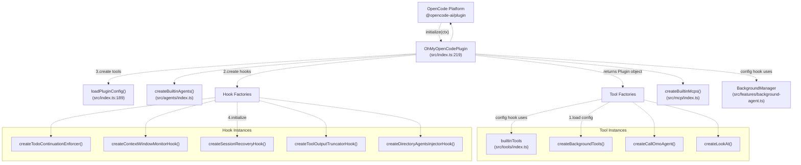
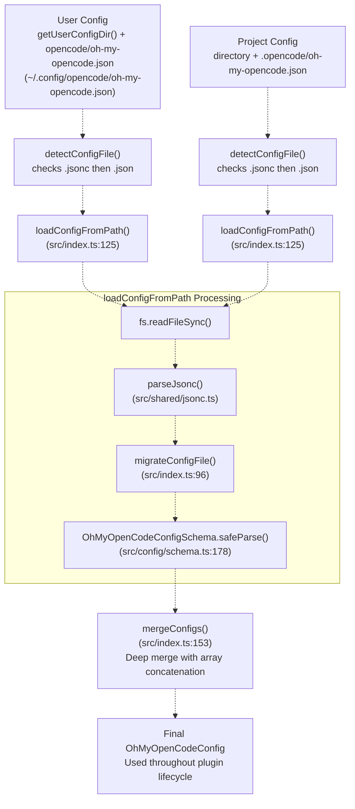
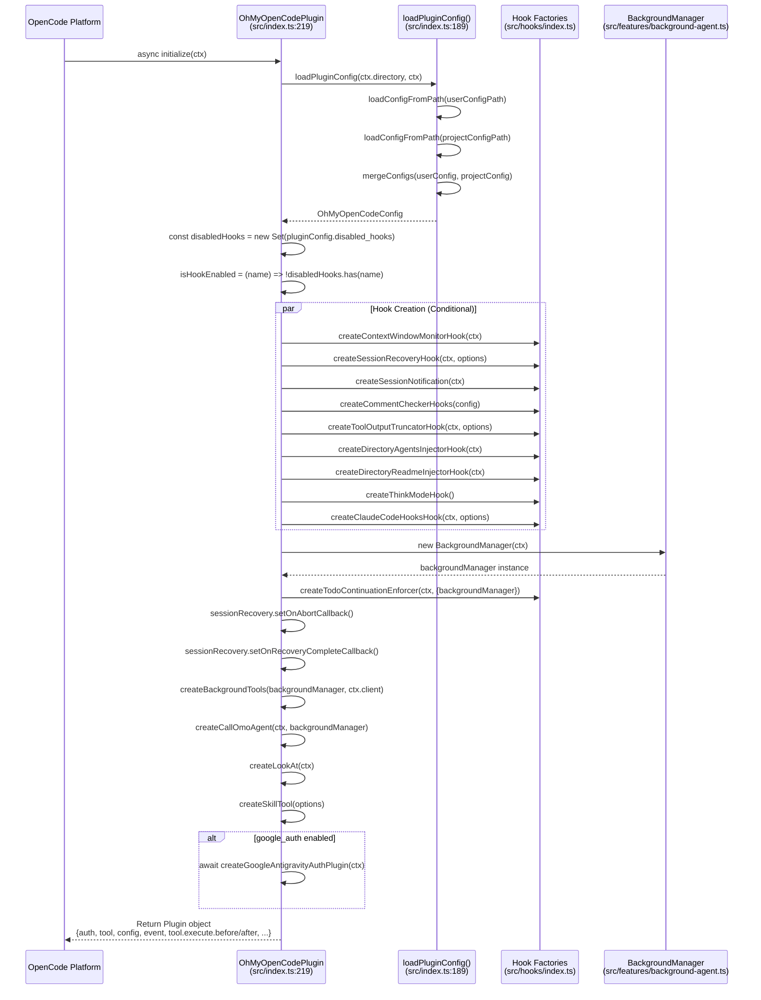
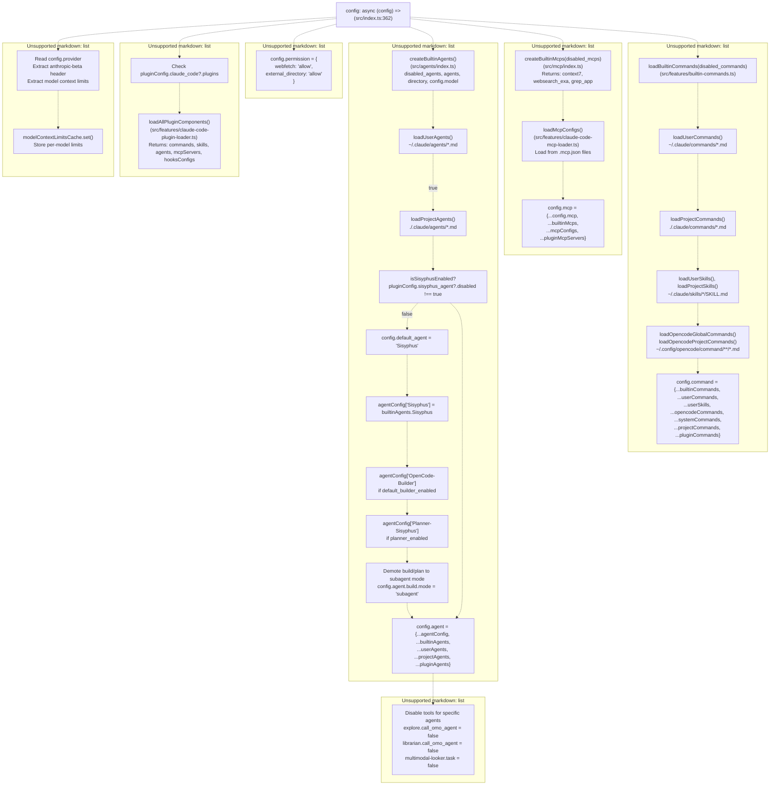
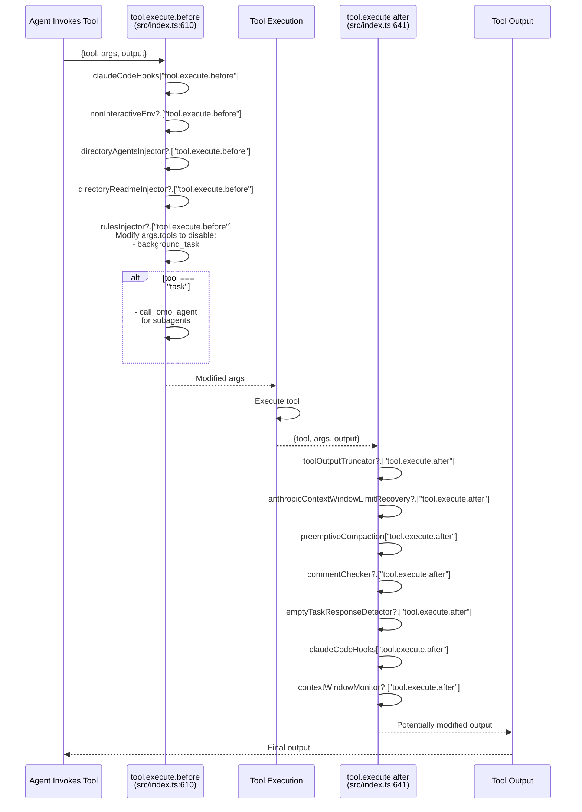

# Core Architecture

> **Relevant source files**
> * [README.ja.md](https://github.com/code-yeongyu/oh-my-opencode/blob/b92cd6ab/README.ja.md)
> * [README.ko.md](https://github.com/code-yeongyu/oh-my-opencode/blob/b92cd6ab/README.ko.md)
> * [README.md](https://github.com/code-yeongyu/oh-my-opencode/blob/b92cd6ab/README.md)
> * [README.zh-cn.md](https://github.com/code-yeongyu/oh-my-opencode/blob/b92cd6ab/README.zh-cn.md)
> * [assets/oh-my-opencode.schema.json](https://github.com/code-yeongyu/oh-my-opencode/blob/b92cd6ab/assets/oh-my-opencode.schema.json)
> * [src/config/schema.ts](https://github.com/code-yeongyu/oh-my-opencode/blob/b92cd6ab/src/config/schema.ts)
> * [src/hooks/index.ts](https://github.com/code-yeongyu/oh-my-opencode/blob/b92cd6ab/src/hooks/index.ts)
> * [src/index.ts](https://github.com/code-yeongyu/oh-my-opencode/blob/b92cd6ab/src/index.ts)
> * [src/shared/config-path.ts](https://github.com/code-yeongyu/oh-my-opencode/blob/b92cd6ab/src/shared/config-path.ts)

This page describes the internal architecture of oh-my-opencode as an OpenCode plugin, covering its initialization flow, configuration system, and integration points with the OpenCode platform. For details on specific subsystems, see [Plugin Lifecycle](/code-yeongyu/oh-my-opencode/3.1-plugin-lifecycle), [Configuration System](/code-yeongyu/oh-my-opencode/3.2-configuration-system), and [Event Handling](/code-yeongyu/oh-my-opencode/3.3-event-handling).

## Plugin Entry Point and Structure

oh-my-opencode is implemented as an OpenCode plugin that exports a single default function `OhMyOpenCodePlugin` from [src/index.ts L219](https://github.com/code-yeongyu/oh-my-opencode/blob/b92cd6ab/src/index.ts#L219-L219)

 which conforms to the OpenCode `Plugin` interface. The plugin receives a context object (`ctx`) containing the project directory path and an API client for interacting with OpenCode.

**Plugin Entry Point Architecture**



The plugin returns an object with these handler methods:

* `config`: Modifies OpenCode configuration (agents, MCPs, commands)
* `tool`: Registers custom tools
* `event`: Processes OpenCode lifecycle events
* `tool.execute.before`: Pre-tool execution hooks
* `tool.execute.after`: Post-tool execution hooks
* `chat.message`: Chat message processing hooks
* `experimental.chat.messages.transform`: Message transformation hooks

**Sources:** [src/index.ts L219-L576](https://github.com/code-yeongyu/oh-my-opencode/blob/b92cd6ab/src/index.ts#L219-L576)

 [src/index.ts L1-L60](https://github.com/code-yeongyu/oh-my-opencode/blob/b92cd6ab/src/index.ts#L1-L60)

## Configuration Architecture

The configuration system implements a hierarchical loading strategy with validation, migration, and merging capabilities.

### Configuration Loading Hierarchy

**Configuration Load and Merge Flow**



The configuration loader follows this precedence:

1. **User-level config** (base): Loaded from `~/.config/opencode/oh-my-opencode.json` via `getUserConfigDir()` [src/shared/config-path.ts L13-L33](https://github.com/code-yeongyu/oh-my-opencode/blob/b92cd6ab/src/shared/config-path.ts#L13-L33)
2. **Project-level config** (override): Loaded from `.opencode/oh-my-opencode.json` in project directory
3. **Format detection**: JSONC (`.jsonc`) files take priority over JSON (`.json`) files [src/shared/jsonc.ts](https://github.com/code-yeongyu/oh-my-opencode/blob/b92cd6ab/src/shared/jsonc.ts)
4. **Deep merge**: Arrays are concatenated (e.g., `disabled_agents`, `disabled_hooks`), objects are recursively merged [src/index.ts L153-L187](https://github.com/code-yeongyu/oh-my-opencode/blob/b92cd6ab/src/index.ts#L153-L187)

On Windows, the user config path implements a fallback strategy: `~/.config` is preferred for cross-platform consistency, but `%APPDATA%` is checked for backward compatibility [src/shared/config-path.ts L13-L33](https://github.com/code-yeongyu/oh-my-opencode/blob/b92cd6ab/src/shared/config-path.ts#L13-L33)

### Configuration Schema and Validation

Configuration validation uses Zod schemas defined in [src/config/schema.ts](https://github.com/code-yeongyu/oh-my-opencode/blob/b92cd6ab/src/config/schema.ts)

 The `OhMyOpenCodeConfigSchema` [src/config/schema.ts L178-L191](https://github.com/code-yeongyu/oh-my-opencode/blob/b92cd6ab/src/config/schema.ts#L178-L191)

 enforces type safety and provides runtime validation:

| Schema Component | Purpose | Key Fields | Location |
| --- | --- | --- | --- |
| `OhMyOpenCodeConfigSchema` | Root configuration schema | disabled_mcps, disabled_agents, disabled_hooks, agents, claude_code, experimental | [src/config/schema.ts L178-L191](https://github.com/code-yeongyu/oh-my-opencode/blob/b92cd6ab/src/config/schema.ts#L178-L191) |
| `AgentOverridesSchema` | Agent customization options | build, plan, Sisyphus, oracle, librarian, explore, frontend-ui-ux-engineer | [src/config/schema.ts L91-L103](https://github.com/code-yeongyu/oh-my-opencode/blob/b92cd6ab/src/config/schema.ts#L91-L103) |
| `AgentOverrideConfigSchema` | Per-agent configuration | model, temperature, top_p, prompt, tools, permission, disable, mode | [src/config/schema.ts L74-L89](https://github.com/code-yeongyu/oh-my-opencode/blob/b92cd6ab/src/config/schema.ts#L74-L89) |
| `HookNameSchema` | Valid hook identifiers for disabling | todo-continuation-enforcer, context-window-monitor, session-recovery, etc. | [src/config/schema.ts L45-L68](https://github.com/code-yeongyu/oh-my-opencode/blob/b92cd6ab/src/config/schema.ts#L45-L68) |
| `BuiltinAgentNameSchema` | Valid agent identifiers | Sisyphus, oracle, librarian, explore, frontend-ui-ux-engineer, document-writer, multimodal-looker | [src/config/schema.ts L19-L27](https://github.com/code-yeongyu/oh-my-opencode/blob/b92cd6ab/src/config/schema.ts#L19-L27) |
| `ClaudeCodeConfigSchema` | Claude Code compatibility toggles | mcp, commands, skills, agents, hooks, plugins | [src/config/schema.ts L105-L113](https://github.com/code-yeongyu/oh-my-opencode/blob/b92cd6ab/src/config/schema.ts#L105-L113) |
| `SisyphusAgentConfigSchema` | Sisyphus agent configuration | disabled, default_builder_enabled, planner_enabled, replace_plan | [src/config/schema.ts L115-L120](https://github.com/code-yeongyu/oh-my-opencode/blob/b92cd6ab/src/config/schema.ts#L115-L120) |
| `ExperimentalConfigSchema` | Experimental features | aggressive_truncation, preemptive_compaction, dynamic_context_pruning | [src/config/schema.ts L163-L176](https://github.com/code-yeongyu/oh-my-opencode/blob/b92cd6ab/src/config/schema.ts#L163-L176) |

Schema validation occurs in `loadConfigFromPath()` [src/index.ts L133](https://github.com/code-yeongyu/oh-my-opencode/blob/b92cd6ab/src/index.ts#L133-L133)

 using `OhMyOpenCodeConfigSchema.safeParse()`. Validation failures are logged and tracked in `configLoadErrors` but do not prevent plugin initialization.

**Sources:** [src/config/schema.ts L1-L205](https://github.com/code-yeongyu/oh-my-opencode/blob/b92cd6ab/src/config/schema.ts#L1-L205)

 [src/index.ts L125-L151](https://github.com/code-yeongyu/oh-my-opencode/blob/b92cd6ab/src/index.ts#L125-L151)

 [src/shared/config-path.ts L13-L48](https://github.com/code-yeongyu/oh-my-opencode/blob/b92cd6ab/src/shared/config-path.ts#L13-L48)

### Configuration Migration

The migration system handles backward compatibility for renamed agents and configuration keys:

**Agent Name Migration Map** [src/index.ts L63-L79](https://github.com/code-yeongyu/oh-my-opencode/blob/b92cd6ab/src/index.ts#L63-L79)

:

```
Legacy → Current
omo → Sisyphus
OmO → Sisyphus
OmO-Plan → Planner-Sisyphus
omo-plan → Planner-Sisyphus
```

**Migration Process:**

1. `migrateAgentNames()` [src/index.ts L81-L94](https://github.com/code-yeongyu/oh-my-opencode/blob/b92cd6ab/src/index.ts#L81-L94) : Transforms agent keys in the `agents` configuration object using `AGENT_NAME_MAP`, case-insensitively
2. `migrateConfigFile()` [src/index.ts L96-L123](https://github.com/code-yeongyu/oh-my-opencode/blob/b92cd6ab/src/index.ts#L96-L123) : * Migrates agent names via `migrateAgentNames()` * Migrates `omo_agent` → `sisyphus_agent` configuration key * Writes updated configuration back to disk using `fs.writeFileSync()`
3. Invoked automatically in `loadConfigFromPath()` [src/index.ts L131](https://github.com/code-yeongyu/oh-my-opencode/blob/b92cd6ab/src/index.ts#L131-L131)  before schema validation

Migration is transparent to users and logs changes to the console [src/index.ts L116](https://github.com/code-yeongyu/oh-my-opencode/blob/b92cd6ab/src/index.ts#L116-L116)

**Sources:** [src/index.ts L63-L123](https://github.com/code-yeongyu/oh-my-opencode/blob/b92cd6ab/src/index.ts#L63-L123)

## Plugin Initialization Flow

**Initialization Sequence Diagram**



The initialization sequence in [src/index.ts L219-L335](https://github.com/code-yeongyu/oh-my-opencode/blob/b92cd6ab/src/index.ts#L219-L335)

 follows these steps:

1. **Load Configuration** [src/index.ts L220](https://github.com/code-yeongyu/oh-my-opencode/blob/b92cd6ab/src/index.ts#L220-L220) : Calls `loadPluginConfig(ctx.directory, ctx)` which loads, validates, and merges user and project configs
2. **Initialize Disabled Hooks Set** [src/index.ts L221-L222](https://github.com/code-yeongyu/oh-my-opencode/blob/b92cd6ab/src/index.ts#L221-L222) : Creates `isHookEnabled()` function based on `pluginConfig.disabled_hooks`
3. **Initialize Context Tracking** [src/index.ts L224-L236](https://github.com/code-yeongyu/oh-my-opencode/blob/b92cd6ab/src/index.ts#L224-L236) : Sets up `modelContextLimitsCache` and `getModelLimit()` for context window management
4. **Create Hook Instances (Conditional)** [src/index.ts L238-L305](https://github.com/code-yeongyu/oh-my-opencode/blob/b92cd6ab/src/index.ts#L238-L305) : * Each hook is only created if `isHookEnabled(hookName)` returns true * Hooks receive `ctx`, `pluginConfig`, or specific options * Example: `createContextWindowMonitorHook(ctx)` only if "context-window-monitor" is enabled
5. **Initialize Background Manager** [src/index.ts L307](https://github.com/code-yeongyu/oh-my-opencode/blob/b92cd6ab/src/index.ts#L307-L307) : Creates `BackgroundManager` instance for managing background agent tasks
6. **Wire Hook Dependencies** [src/index.ts L313-L316](https://github.com/code-yeongyu/oh-my-opencode/blob/b92cd6ab/src/index.ts#L313-L316) : Connects `sessionRecovery` callbacks to `todoContinuationEnforcer` for coordination
7. **Create Tool Factories** [src/index.ts L318-L327](https://github.com/code-yeongyu/oh-my-opencode/blob/b92cd6ab/src/index.ts#L318-L327) : * `createBackgroundTools()`: background_task, background_output, background_cancel * `createCallOmoAgent()`: call_omo_agent tool * `createLookAt()`: look_at multimodal tool * `createSkillTool()`: skill execution tool
8. **Setup Google Auth** (if enabled) [src/index.ts L329-L331](https://github.com/code-yeongyu/oh-my-opencode/blob/b92cd6ab/src/index.ts#L329-L331) : Initializes Antigravity auth plugin if `google_auth !== false`
9. **Check tmux Availability** [src/index.ts L333](https://github.com/code-yeongyu/oh-my-opencode/blob/b92cd6ab/src/index.ts#L333-L333) : Checks for tmux to enable `interactive_bash` tool
10. **Return Plugin Object** [src/index.ts L335-L576](https://github.com/code-yeongyu/oh-my-opencode/blob/b92cd6ab/src/index.ts#L335-L576) : Returns object with handlers for `auth`, `tool`, `config`, `event`, `tool.execute.before`, `tool.execute.after`, `chat.message`, `experimental.chat.messages.transform`

**Sources:** [src/index.ts L219-L335](https://github.com/code-yeongyu/oh-my-opencode/blob/b92cd6ab/src/index.ts#L219-L335)

## Plugin Integration Points

The plugin exposes multiple integration points to OpenCode:

```mermaid
flowchart TD

ConfigHook["config<br>(src/index.ts:346)"]
ToolHook["tool<br>(src/index.ts:325)"]
EventHook["event<br>(src/index.ts:480)"]
PreToolHook["tool.execute.before<br>(src/index.ts:542)"]
PostToolHook["tool.execute.after<br>(src/index.ts:563)"]
ChatMsg["chat.message<br>(src/index.ts:333)"]
Transform["experimental.chat.messages.transform<br>(src/index.ts:338)"]
AgentConfig["Agent Registration"]
MCPConfig["MCP Registration"]
CommandConfig["Command Registration"]
PermConfig["Permission Configuration"]
BuiltinTools["builtinTools<br>(src/tools)"]
BgTools["backgroundTools"]
CallAgent["call_omo_agent"]
LookAt["look_at"]
InteractiveBash["interactive_bash"]

ConfigHook -.-> AgentConfig
ConfigHook -.-> MCPConfig
ConfigHook -.-> CommandConfig
ConfigHook -.-> PermConfig
ToolHook -.-> BuiltinTools
ToolHook -.-> BgTools
ToolHook -.-> CallAgent
ToolHook -.-> LookAt
ToolHook -.-> InteractiveBash

subgraph subGraph2 ["Tool Registration"]
    BuiltinTools
    BgTools
    CallAgent
    LookAt
    InteractiveBash
end

subgraph subGraph1 ["Configuration Modifications"]
    AgentConfig
    MCPConfig
    CommandConfig
    PermConfig
end

subgraph subGraph0 ["Plugin Handler Methods"]
    ConfigHook
    ToolHook
    EventHook
    PreToolHook
    PostToolHook
    ChatMsg
    Transform
end
```



### Config Hook

The `config` hook [src/index.ts L362-L556](https://github.com/code-yeongyu/oh-my-opencode/blob/b92cd6ab/src/index.ts#L362-L556)

 is invoked by OpenCode during initialization and modifies the OpenCode configuration object to register agents, tools, MCPs, commands, and permissions.

**Config Hook Processing Flow**



**Key Configuration Operations:**

1. **Provider Metadata Extraction** [src/index.ts L362-L386](https://github.com/code-yeongyu/oh-my-opencode/blob/b92cd6ab/src/index.ts#L362-L386) : * Reads `config.provider` to extract Anthropic beta headers and model context limits * Populates `modelContextLimitsCache` for context window tracking
2. **Claude Code Plugin Loading** [src/index.ts L388-L402](https://github.com/code-yeongyu/oh-my-opencode/blob/b92cd6ab/src/index.ts#L388-L402) : * Calls `loadAllPluginComponents()` if `claude_code?.plugins !== false` * Returns commands, skills, agents, MCPs from Claude Code plugins
3. **Agent Registration** [src/index.ts L404-L486](https://github.com/code-yeongyu/oh-my-opencode/blob/b92cd6ab/src/index.ts#L404-L486) : * Calls `createBuiltinAgents()` with config overrides [src/index.ts L404-L409](https://github.com/code-yeongyu/oh-my-opencode/blob/b92cd6ab/src/index.ts#L404-L409) * Loads user/project agents from `~/.claude/agents/*.md` [src/index.ts L411-L413](https://github.com/code-yeongyu/oh-my-opencode/blob/b92cd6ab/src/index.ts#L411-L413) * If Sisyphus enabled [src/index.ts L415-L476](https://github.com/code-yeongyu/oh-my-opencode/blob/b92cd6ab/src/index.ts#L415-L476) : * Sets `config.default_agent = "Sisyphus"` [src/index.ts L422](https://github.com/code-yeongyu/oh-my-opencode/blob/b92cd6ab/src/index.ts#L422-L422) * Registers Sisyphus agent from `builtinAgents` [src/index.ts L425](https://github.com/code-yeongyu/oh-my-opencode/blob/b92cd6ab/src/index.ts#L425-L425) * Optionally registers OpenCode-Builder [src/index.ts L428-L438](https://github.com/code-yeongyu/oh-my-opencode/blob/b92cd6ab/src/index.ts#L428-L438) * Optionally registers Planner-Sisyphus [src/index.ts L440-L454](https://github.com/code-yeongyu/oh-my-opencode/blob/b92cd6ab/src/index.ts#L440-L454) * Demotes build/plan to subagent mode [src/index.ts L475-L476](https://github.com/code-yeongyu/oh-my-opencode/blob/b92cd6ab/src/index.ts#L475-L476) * Merges all agent sources [src/index.ts L467-L477](https://github.com/code-yeongyu/oh-my-opencode/blob/b92cd6ab/src/index.ts#L467-L477)
4. **Tool Configuration** [src/index.ts L488-L511](https://github.com/code-yeongyu/oh-my-opencode/blob/b92cd6ab/src/index.ts#L488-L511) : * Disables `call_omo_agent` for explore and librarian agents * Disables `task`, `call_omo_agent`, and `look_at` for multimodal-looker agent
5. **Permission Defaults** [src/index.ts L513-L517](https://github.com/code-yeongyu/oh-my-opencode/blob/b92cd6ab/src/index.ts#L513-L517) : * Sets `webfetch: "allow"` and `external_directory: "allow"`
6. **MCP Registration** [src/index.ts L519-L528](https://github.com/code-yeongyu/oh-my-opencode/blob/b92cd6ab/src/index.ts#L519-L528) : * Calls `createBuiltinMcps(disabled_mcps)` for context7, websearch_exa, grep_app * Calls `loadMcpConfigs()` to load from `.mcp.json` files * Merges into `config.mcp`
7. **Command Registration** [src/index.ts L530-L555](https://github.com/code-yeongyu/oh-my-opencode/blob/b92cd6ab/src/index.ts#L530-L555) : * Loads builtin commands via `loadBuiltinCommands()` [src/index.ts L530](https://github.com/code-yeongyu/oh-my-opencode/blob/b92cd6ab/src/index.ts#L530-L530) * Loads user commands from `~/.claude/commands/` [src/index.ts L531](https://github.com/code-yeongyu/oh-my-opencode/blob/b92cd6ab/src/index.ts#L531-L531) * Loads OpenCode global commands from `~/.config/opencode/command/` [src/index.ts L532](https://github.com/code-yeongyu/oh-my-opencode/blob/b92cd6ab/src/index.ts#L532-L532) * Loads project commands from `./.claude/commands/` [src/index.ts L534](https://github.com/code-yeongyu/oh-my-opencode/blob/b92cd6ab/src/index.ts#L534-L534) * Loads skills from `~/.claude/skills/` and `./.claude/skills/` [src/index.ts L537-L540](https://github.com/code-yeongyu/oh-my-opencode/blob/b92cd6ab/src/index.ts#L537-L540) * Merges in priority order [src/index.ts L542-L555](https://github.com/code-yeongyu/oh-my-opencode/blob/b92cd6ab/src/index.ts#L542-L555)

**Sources:** [src/index.ts L362-L556](https://github.com/code-yeongyu/oh-my-opencode/blob/b92cd6ab/src/index.ts#L362-L556)

 [src/agents/index.ts](https://github.com/code-yeongyu/oh-my-opencode/blob/b92cd6ab/src/agents/index.ts)

 [src/mcp/index.ts](https://github.com/code-yeongyu/oh-my-opencode/blob/b92cd6ab/src/mcp/index.ts)

 [src/features/builtin-commands.ts](https://github.com/code-yeongyu/oh-my-opencode/blob/b92cd6ab/src/features/builtin-commands.ts)

 [src/features/claude-code-command-loader.ts](https://github.com/code-yeongyu/oh-my-opencode/blob/b92cd6ab/src/features/claude-code-command-loader.ts)

 [src/features/opencode-skill-loader.ts](https://github.com/code-yeongyu/oh-my-opencode/blob/b92cd6ab/src/features/opencode-skill-loader.ts)

 [src/features/claude-code-agent-loader.ts](https://github.com/code-yeongyu/oh-my-opencode/blob/b92cd6ab/src/features/claude-code-agent-loader.ts)

 [src/features/claude-code-mcp-loader.ts](https://github.com/code-yeongyu/oh-my-opencode/blob/b92cd6ab/src/features/claude-code-mcp-loader.ts)

### Event Hook

The `event` hook [src/index.ts L558-L608](https://github.com/code-yeongyu/oh-my-opencode/blob/b92cd6ab/src/index.ts#L558-L608)

 processes OpenCode lifecycle events and dispatches them to registered hooks.

**Event Dispatching Flow**

```mermaid
flowchart TD

EventInput["Event Input<br>{type, sessionId, ...}"]
EventHandler["event: async (input) =><br>(src/index.ts:558)"]
AutoUpdate["autoUpdateChecker?.event(input)"]
ClaudeCode["claudeCodeHooks.event(input)"]
BgNotif["backgroundNotificationHook?.event(input)"]
SessionNotif["sessionNotification?.(input)"]
TodoCont["todoContinuationEnforcer?.handler(input)"]
ContextMon["contextWindowMonitor?.event(input)"]
DirAgents["directoryAgentsInjector?.event(input)"]
DirReadme["directoryReadmeInjector?.event(input)"]
Rules["rulesInjector?.event(input)"]
ThinkMode["thinkMode?.event(input)"]
EmptyTask["emptyTaskResponseDetector?.event(input)"]
ClaudeCodeHookExec["claudeCodeHooks.eventHook?.(input)"]
AgentReminder["agentUsageReminder?.event?.(input)"]
BashSession["interactiveBashSession?.event?.(input)"]
SessionCreated["input.type === 'session.created'"]
SetMainSession["setMainSession(input.sessionId)<br>(src/features/claude-code-session-state.ts)"]
SessionDeleted["input.type === 'session.deleted'"]
CheckMainSession["getMainSessionID() === input.sessionId"]
ClearMainSession["setMainSession(undefined)"]
SessionError["input.type === 'session.error'"]
CheckRecoverable["Is error recoverable?<br>tool_result_missing, thinking_block_order,<br>thinking_disabled, empty_content"]
TriggerRecovery["sessionRecovery?.abort(sessionId)<br>await sessionRecovery?.recover(sessionId)"]
AutoContinue["ctx.client.session.execute(sessionId, '')<br>Auto-continue after recovery"]

EventInput -.-> EventHandler
EventHandler -.->|"yes"| AutoUpdate
EventHandler -.-> ClaudeCode
EventHandler -.-> BgNotif
EventHandler -.-> SessionNotif
EventHandler -.-> TodoCont
EventHandler -.-> ContextMon
EventHandler -.-> DirAgents
EventHandler -.-> DirReadme
EventHandler -.-> Rules
EventHandler -.-> ThinkMode
EventHandler -.-> EmptyTask
EventHandler -.-> ClaudeCodeHookExec
EventHandler -.-> AgentReminder
EventHandler -.-> BashSession
EventHandler -.->|"yes"| SessionCreated
EventHandler -.->|"yes"| SessionDeleted
EventHandler -.-> SessionError

subgraph subGraph1 ["Session-Specific Event Handling"]
    SessionCreated
    SetMainSession
    SessionDeleted
    CheckMainSession
    ClearMainSession
    SessionError
    CheckRecoverable
    TriggerRecovery
    AutoContinue
    SessionCreated -.->|"yes"| SetMainSession
    SessionDeleted -.->|"yes"| CheckMainSession
    CheckMainSession -.-> ClearMainSession
    SessionError -.-> CheckRecoverable
    CheckRecoverable -.-> TriggerRecovery
    TriggerRecovery -.-> AutoContinue
end

subgraph subGraph0 ["General Event Dispatch"]
    AutoUpdate
    ClaudeCode
    BgNotif
    SessionNotif
    TodoCont
    ContextMon
    DirAgents
    DirReadme
    Rules
    ThinkMode
    EmptyTask
    ClaudeCodeHookExec
    AgentReminder
    BashSession
end
```



**Event Handling Behavior:**

1. **General Event Dispatch** [src/index.ts L559-L575](https://github.com/code-yeongyu/oh-my-opencode/blob/b92cd6ab/src/index.ts#L559-L575) : All events are dispatched to all registered hooks (if enabled)
2. **session.created** [src/index.ts L577-L584](https://github.com/code-yeongyu/oh-my-opencode/blob/b92cd6ab/src/index.ts#L577-L584) : * Calls `setMainSession(input.sessionId)` to track the main user-facing session * Main session ID is used to distinguish parent from child background sessions
3. **session.deleted** [src/index.ts L586-L591](https://github.com/code-yeongyu/oh-my-opencode/blob/b92cd6ab/src/index.ts#L586-L591) : * Checks if deleted session is the main session * Clears main session tracking via `setMainSession(undefined)`
4. **session.error** [src/index.ts L593-L607](https://github.com/code-yeongyu/oh-my-opencode/blob/b92cd6ab/src/index.ts#L593-L607) : * Checks if error is recoverable using string matching on error message * Recoverable error types: `tool_result_missing`, `thinking_block_order`, `thinking_disabled`, `empty_content` * Triggers `sessionRecovery?.abort()` to prevent prompt injection during recovery * Calls `sessionRecovery?.recover()` to fix corrupted session state * Auto-continues session via `ctx.client.session.execute(sessionId, '')` after successful recovery

**Sources:** [src/index.ts L558-L608](https://github.com/code-yeongyu/oh-my-opencode/blob/b92cd6ab/src/index.ts#L558-L608)

 [src/features/claude-code-session-state.ts L44-L58](https://github.com/code-yeongyu/oh-my-opencode/blob/b92cd6ab/src/features/claude-code-session-state.ts#L44-L58)

 [src/hooks/session-recovery.ts](https://github.com/code-yeongyu/oh-my-opencode/blob/b92cd6ab/src/hooks/session-recovery.ts)

### Tool Execution Hooks

Tool execution hooks provide interception points before and after tool invocation.

**Tool Execution Lifecycle**



**tool.execute.before** [src/index.ts L610-L639](https://github.com/code-yeongyu/oh-my-opencode/blob/b92cd6ab/src/index.ts#L610-L639)

:

Invoked before tool execution to:

1. Execute Claude Code PreToolUse hooks [src/index.ts L611](https://github.com/code-yeongyu/oh-my-opencode/blob/b92cd6ab/src/index.ts#L611-L611)
2. Set non-interactive environment variables for bash commands [src/index.ts L612](https://github.com/code-yeongyu/oh-my-opencode/blob/b92cd6ab/src/index.ts#L612-L612)
3. Inject directory-specific context [src/index.ts L613-L615](https://github.com/code-yeongyu/oh-my-opencode/blob/b92cd6ab/src/index.ts#L613-L615) : * `AGENTS.md` files from directory hierarchy * `README.md` files from directory hierarchy * Conditional rules from `.claude/rules/` matching glob patterns
4. Modify `task` tool arguments for subagents [src/index.ts L617-L638](https://github.com/code-yeongyu/oh-my-opencode/blob/b92cd6ab/src/index.ts#L617-L638) : * Disables `background_task` and `call_omo_agent` tools when task is invoked by a subagent * Prevents infinite recursion and ensures proper tool boundaries

**tool.execute.after** [src/index.ts L641-L665](https://github.com/code-yeongyu/oh-my-opencode/blob/b92cd6ab/src/index.ts#L641-L665)

:

Invoked after tool execution to:

1. Truncate large tool outputs [src/index.ts L642](https://github.com/code-yeongyu/oh-my-opencode/blob/b92cd6ab/src/index.ts#L642-L642) : Dynamically truncates based on remaining context window
2. Trigger Anthropic context limit recovery [src/index.ts L643](https://github.com/code-yeongyu/oh-my-opencode/blob/b92cd6ab/src/index.ts#L643-L643) : Handles hard context limits with automatic compaction
3. Trigger preemptive compaction [src/index.ts L644](https://github.com/code-yeongyu/oh-my-opencode/blob/b92cd6ab/src/index.ts#L644-L644) : Proactively compacts at 80% threshold
4. Check for excessive comments in code [src/index.ts L645](https://github.com/code-yeongyu/oh-my-opencode/blob/b92cd6ab/src/index.ts#L645-L645) : Warns if tool outputs contain too many code comments
5. Detect empty task responses [src/index.ts L646](https://github.com/code-yeongyu/oh-my-opencode/blob/b92cd6ab/src/index.ts#L646-L646) : Warns if task tool returns no content
6. Execute Claude Code PostToolUse hooks [src/index.ts L647](https://github.com/code-yeongyu/oh-my-opencode/blob/b92cd6ab/src/index.ts#L647-L647)
7. Update context window metrics [src/index.ts L648](https://github.com/code-yeongyu/oh-my-opencode/blob/b92cd6ab/src/index.ts#L648-L648) : Tracks token usage per session

**Sources:** [src/index.ts L610-L665](https://github.com/code-yeongyu/oh-my-opencode/blob/b92cd6ab/src/index.ts#L610-L665)

 [src/hooks/non-interactive-env.ts](https://github.com/code-yeongyu/oh-my-opencode/blob/b92cd6ab/src/hooks/non-interactive-env.ts)

 [src/hooks/directory-agents-injector.ts](https://github.com/code-yeongyu/oh-my-opencode/blob/b92cd6ab/src/hooks/directory-agents-injector.ts)

 [src/hooks/directory-readme-injector.ts](https://github.com/code-yeongyu/oh-my-opencode/blob/b92cd6ab/src/hooks/directory-readme-injector.ts)

 [src/hooks/rules-injector.ts](https://github.com/code-yeongyu/oh-my-opencode/blob/b92cd6ab/src/hooks/rules-injector.ts)

 [src/hooks/tool-output-truncator.ts](https://github.com/code-yeongyu/oh-my-opencode/blob/b92cd6ab/src/hooks/tool-output-truncator.ts)

 [src/hooks/comment-checker.ts](https://github.com/code-yeongyu/oh-my-opencode/blob/b92cd6ab/src/hooks/comment-checker.ts)

 [src/hooks/empty-task-response-detector.ts](https://github.com/code-yeongyu/oh-my-opencode/blob/b92cd6ab/src/hooks/empty-task-response-detector.ts)

## Component Dependencies

**Inter-Component Dependency Graph**

```mermaid
flowchart TD

Plugin["OhMyOpenCodePlugin<br>(src/index.ts:219)"]
ConfigSys["Configuration System<br>loadPluginConfig()<br>(src/index.ts:189)"]
TodoHook["createTodoContinuationEnforcer<br>(todo-continuation-enforcer.ts)"]
ContextHook["createContextWindowMonitorHook<br>(context-window-monitor.ts)"]
RecoveryHook["createSessionRecoveryHook<br>(session-recovery.ts)"]
TruncateHook["createToolOutputTruncatorHook<br>(tool-output-truncator.ts)"]
CompactionHook["createPreemptiveCompactionHook<br>(preemptive-compaction.ts)"]
CompactionInject["createCompactionContextInjector<br>(compaction-context-injector.ts)"]
DirAgentsHook["createDirectoryAgentsInjectorHook<br>(directory-agents-injector.ts)"]
DirReadmeHook["createDirectoryReadmeInjectorHook<br>(directory-readme-injector.ts)"]
RulesHook["createRulesInjectorHook<br>(rules-injector.ts)"]
NonInteractiveHook["createNonInteractiveEnvHook<br>(non-interactive-env.ts)"]
AgentFactory["createBuiltinAgents()<br>(agents/index.ts)"]
SisyphusAgent["Sisyphus Agent<br>(agents/sisyphus-prompt.ts)"]
SpecializedAgents["Specialized Agents<br>oracle, librarian, explore, etc."]
BgTools["createBackgroundTools()<br>(tools/background-*.ts)"]
CallAgent["createCallOmoAgent()<br>(tools/call-omo-agent.ts)"]
LookAtTool["createLookAt()<br>(tools/look-at.ts)"]
SkillTool["createSkillTool()<br>(tools/skill.ts)"]
BuiltinTools["builtinTools<br>(tools/index.ts)"]
InteractiveBash["interactive_bash<br>(tools/interactive-bash.ts)"]
BackgroundMgr["BackgroundManager<br>(background-agent.ts)"]
SessionState["Session State<br>(claude-code-session-state.ts)<br>setMainSession(), getMainSessionID()"]
MCPSystem["createBuiltinMcps()<br>(mcp/index.ts)"]
ClaudeCode["Claude Code Loaders<br>(features/claude-code-*.ts)"]
GoogleAuth["createGoogleAntigravityAuthPlugin<br>(auth/antigravity.ts)"]

Plugin -.->|"config hook uses"| AgentFactory
Plugin -.->|"creates"| BackgroundMgr
Plugin -.->|"creates all hooks"| TodoHook
Plugin -.->|"creates all hooks"| ContextHook
Plugin -.->|"creates all hooks"| RecoveryHook
Plugin -.->|"reads"| TruncateHook
Plugin -.->|"setOnAbortCallback()setOnRecoveryCompleteCallback()"| CompactionHook
Plugin -.->|"depends on"| DirAgentsHook
Plugin -.->|"reads metrics"| DirReadmeHook
Plugin -.->|"creates all hooks"| RulesHook
BgTools -.->|"depends on"| BackgroundMgr
CallAgent -.->|"depends on"| BackgroundMgr
TodoHook -.->|"creates all hooks"| BackgroundMgr
Plugin -.-> SessionState
Plugin -.-> SessionState
Plugin -.->|"initializes"| MCPSystem
Plugin -.->|"conditional init"| ClaudeCode
Plugin -.->|"creates"| GoogleAuth
NonInteractiveHook -.->|"creates all hooks"| InteractiveBash

subgraph subGraph5 ["External Integration"]
    MCPSystem
    ClaudeCode
    GoogleAuth
end

subgraph subGraph4 ["Background System (src/features/)"]
    BackgroundMgr
    SessionState
end

subgraph subGraph3 ["Tool System (src/tools/)"]
    BgTools
    CallAgent
    LookAtTool
    SkillTool
    BuiltinTools
    InteractiveBash
end

subgraph subGraph2 ["Agent System (src/agents/)"]
    AgentFactory
    SisyphusAgent
    SpecializedAgents
    AgentFactory -.->|"creates"| SisyphusAgent
    AgentFactory -.->|"config hook uses"| SpecializedAgents
end

subgraph subGraph1 ["Hook System (src/hooks/)"]
    TodoHook
    ContextHook
    RecoveryHook
    TruncateHook
    CompactionHook
    CompactionInject
    DirAgentsHook
    DirReadmeHook
    RulesHook
    NonInteractiveHook
    RecoveryHook -.->|"reads metrics"| TodoHook
    CompactionHook -.->|"onBeforeSummarize callback"| CompactionInject
    TruncateHook -.-> ContextHook
    CompactionHook -.->|"session.created"| ContextHook
end

subgraph subGraph0 ["Core Plugin Infrastructure"]
    Plugin
    ConfigSys
    Plugin -.->|"creates all hooks"| ConfigSys
end
```



**Critical Dependency Relationships:**

1. **SessionRecoveryHook ↔ TodoContinuationEnforcer** [src/index.ts L313-L316](https://github.com/code-yeongyu/oh-my-opencode/blob/b92cd6ab/src/index.ts#L313-L316) : ``` sessionRecovery.setOnAbortCallback(todoContinuationEnforcer.markRecovering); sessionRecovery.setOnRecoveryCompleteCallback(todoContinuationEnforcer.markRecoveryComplete); ``` * Recovery coordinator prevents todo prompts during error recovery * Ensures no conflicting continuation prompts are injected during session repair
2. **BackgroundManager ↔ Background Tools** [src/index.ts L307-L323](https://github.com/code-yeongyu/oh-my-opencode/blob/b92cd6ab/src/index.ts#L307-L323) : * `createBackgroundTools(backgroundManager, ctx.client)` creates: `background_task`, `background_output`, `background_cancel` * `createCallOmoAgent(ctx, backgroundManager)` creates: `call_omo_agent` with optional async execution * Both tool sets share the same BackgroundManager instance for task coordination
3. **BackgroundManager ↔ TodoContinuationEnforcer** [src/index.ts L309-L311](https://github.com/code-yeongyu/oh-my-opencode/blob/b92cd6ab/src/index.ts#L309-L311) : ```javascript const todoContinuationEnforcer = createTodoContinuationEnforcer(ctx, { backgroundManager }); ``` * Todo enforcer checks background task status before injecting continuation prompts * Prevents premature continuation while background agents are still working
4. **ContextWindowMonitor → OutputTruncator** [src/index.ts L238-L253](https://github.com/code-yeongyu/oh-my-opencode/blob/b92cd6ab/src/index.ts#L238-L253) : * Truncator queries context monitor for current usage metrics * Dynamically adjusts truncation thresholds based on remaining headroom
5. **PreemptiveCompaction → CompactionContextInjector** [src/index.ts L272-L277](https://github.com/code-yeongyu/oh-my-opencode/blob/b92cd6ab/src/index.ts#L272-L277) : ```javascript const preemptiveCompaction = createPreemptiveCompactionHook(ctx, {   experimental: pluginConfig.experimental,   onBeforeSummarize: compactionContextInjector,   getModelLimit, }); ``` * Compaction hook invokes injector callback before summarization * Preserves AGENTS.md and directory context during session compaction
6. **NonInteractiveEnvHook → InteractiveBash** [src/index.ts L294-L299](https://github.com/code-yeongyu/oh-my-opencode/blob/b92cd6ab/src/index.ts#L294-L299) : * Non-interactive hook sets environment variables for bash commands * Prevents commands from hanging by disabling interactive prompts
7. **AgentFactory ← ConfigurationSystem** [src/index.ts L404-L409](https://github.com/code-yeongyu/oh-my-opencode/blob/b92cd6ab/src/index.ts#L404-L409) : ```javascript const builtinAgents = createBuiltinAgents(   pluginConfig.disabled_agents,   pluginConfig.agents,   ctx.directory,   config.model, ); ``` * Agent factory reads config overrides for model selection, prompts, tools * Applies per-agent customization from merged configuration

**Sources:** [src/index.ts L219-L335](https://github.com/code-yeongyu/oh-my-opencode/blob/b92cd6ab/src/index.ts#L219-L335)

 [src/index.ts L313-L316](https://github.com/code-yeongyu/oh-my-opencode/blob/b92cd6ab/src/index.ts#L313-L316)

 [src/index.ts L307-L323](https://github.com/code-yeongyu/oh-my-opencode/blob/b92cd6ab/src/index.ts#L307-L323)

 [src/index.ts L309-L311](https://github.com/code-yeongyu/oh-my-opencode/blob/b92cd6ab/src/index.ts#L309-L311)

 [src/index.ts L238-L253](https://github.com/code-yeongyu/oh-my-opencode/blob/b92cd6ab/src/index.ts#L238-L253)

 [src/index.ts L272-L277](https://github.com/code-yeongyu/oh-my-opencode/blob/b92cd6ab/src/index.ts#L272-L277)

 [src/index.ts L294-L299](https://github.com/code-yeongyu/oh-my-opencode/blob/b92cd6ab/src/index.ts#L294-L299)

 [src/index.ts L404-L409](https://github.com/code-yeongyu/oh-my-opencode/blob/b92cd6ab/src/index.ts#L404-L409)

 [src/hooks/index.ts L1-L24](https://github.com/code-yeongyu/oh-my-opencode/blob/b92cd6ab/src/hooks/index.ts#L1-L24)

 [src/features/background-agent.ts](https://github.com/code-yeongyu/oh-my-opencode/blob/b92cd6ab/src/features/background-agent.ts)

 [src/features/claude-code-session-state.ts](https://github.com/code-yeongyu/oh-my-opencode/blob/b92cd6ab/src/features/claude-code-session-state.ts)

## State Management

The plugin maintains several types of state:

### Session State

Session-specific state is tracked in [src/features/claude-code-session-state.ts](https://github.com/code-yeongyu/oh-my-opencode/blob/b92cd6ab/src/features/claude-code-session-state.ts)

:

* **Main Session ID**: Identifies the primary user-facing session
* **Background Task Registry**: Hierarchical tracking of background agent tasks
* **Interactive Bash Sessions**: tmux session tracking per OpenCode session

### Hook State

Individual hooks maintain their own state:

| Hook | State | Location |
| --- | --- | --- |
| Context Window Monitor | Token usage per session | [src/hooks/context-window-monitor.ts](https://github.com/code-yeongyu/oh-my-opencode/blob/b92cd6ab/src/hooks/context-window-monitor.ts) |
| Session Recovery | Retry counts, fallback tracking | [src/hooks/session-recovery.ts](https://github.com/code-yeongyu/oh-my-opencode/blob/b92cd6ab/src/hooks/session-recovery.ts) |
| Todo Continuation | Recovery mode flag | [src/hooks/todo-continuation-enforcer.ts](https://github.com/code-yeongyu/oh-my-opencode/blob/b92cd6ab/src/hooks/todo-continuation-enforcer.ts) |
| Directory Injectors | Injected paths per session | [src/hooks/directory-agents-injector.ts](https://github.com/code-yeongyu/oh-my-opencode/blob/b92cd6ab/src/hooks/directory-agents-injector.ts) |
| Anthropic Auto Compact | Compaction attempt counts | [src/hooks/anthropic-auto-compact.ts](https://github.com/code-yeongyu/oh-my-opencode/blob/b92cd6ab/src/hooks/anthropic-auto-compact.ts) |

### Configuration State

Configuration is loaded once at initialization and remains immutable during the plugin lifecycle. The merged configuration object is used throughout to determine feature enablement and agent/hook behavior.

**Sources:** [src/features/claude-code-session-state.ts](https://github.com/code-yeongyu/oh-my-opencode/blob/b92cd6ab/src/features/claude-code-session-state.ts)

 [src/hooks/](https://github.com/code-yeongyu/oh-my-opencode/blob/b92cd6ab/src/hooks/)

## Error Handling Strategy

The plugin implements defensive error handling:

1. **Configuration Validation Errors** [src/index.ts L129-L133](https://github.com/code-yeongyu/oh-my-opencode/blob/b92cd6ab/src/index.ts#L129-L133) : * Validation failures are logged and tracked in `configLoadErrors` * Returns `null` config allowing plugin to continue with defaults
2. **Hook Enablement Checks** [src/index.ts L213-L214](https://github.com/code-yeongyu/oh-my-opencode/blob/b92cd6ab/src/index.ts#L213-L214) : * Hooks return `null` if disabled, preventing runtime errors * Event/tool handlers check for `null` before invoking hook methods
3. **Session Recovery** [src/index.ts L515-L539](https://github.com/code-yeongyu/oh-my-opencode/blob/b92cd6ab/src/index.ts#L515-L539) : * Automatic detection of recoverable errors (missing tool results, thinking block issues) * Manipulation of session storage to fix corrupted state * Automatic continuation after successful recovery
4. **Tool Execution Safeguards** [src/index.ts L550-L560](https://github.com/code-yeongyu/oh-my-opencode/blob/b92cd6ab/src/index.ts#L550-L560) : * Validation of tool arguments before execution * Tool disablement for specific subagent types (e.g., explore/librarian cannot use `call_omo_agent`)

**Sources:** [src/index.ts L129-L133](https://github.com/code-yeongyu/oh-my-opencode/blob/b92cd6ab/src/index.ts#L129-L133)

 [src/index.ts L213-L214](https://github.com/code-yeongyu/oh-my-opencode/blob/b92cd6ab/src/index.ts#L213-L214)

 [src/index.ts L515-L539](https://github.com/code-yeongyu/oh-my-opencode/blob/b92cd6ab/src/index.ts#L515-L539)

 [src/hooks/session-recovery.ts](https://github.com/code-yeongyu/oh-my-opencode/blob/b92cd6ab/src/hooks/session-recovery.ts)