# Event Handling

> **Relevant source files**
> * [assets/oh-my-opencode.schema.json](https://github.com/code-yeongyu/oh-my-opencode/blob/b92cd6ab/assets/oh-my-opencode.schema.json)
> * [src/config/schema.ts](https://github.com/code-yeongyu/oh-my-opencode/blob/b92cd6ab/src/config/schema.ts)
> * [src/hooks/index.ts](https://github.com/code-yeongyu/oh-my-opencode/blob/b92cd6ab/src/hooks/index.ts)
> * [src/index.ts](https://github.com/code-yeongyu/oh-my-opencode/blob/b92cd6ab/src/index.ts)

## Purpose and Scope

This document describes the event-driven architecture of oh-my-opencode, explaining how events flow from OpenCode through the plugin to registered hooks. It covers the event types the plugin subscribes to, the dispatch pattern used to invoke hooks, and the data structures passed through the event pipeline.

For information about individual hooks and their behaviors, see [Hook System](../reliability/). For the plugin's initialization and lifecycle management, see [Plugin Lifecycle](/code-yeongyu/oh-my-opencode/3.1-plugin-lifecycle).

---

## Event-Driven Architecture Overview

The oh-my-opencode plugin implements an event-driven architecture where OpenCode emits events at various lifecycle points, and the plugin acts as a dispatcher, routing these events to specialized hooks that implement specific behaviors. The plugin registers multiple event handler functions that OpenCode invokes when specific events occur.

**Event Handler Registration Pattern**

The plugin returns an object with handler functions from its main entry point:

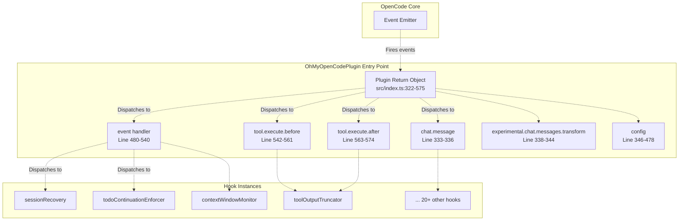

**Sources:** [src/index.ts L211-L576](https://github.com/code-yeongyu/oh-my-opencode/blob/b92cd6ab/src/index.ts#L211-L576)

---

## OpenCode Event Types

OpenCode emits events at different points in the session and tool execution lifecycle. The plugin subscribes to the following event categories:

### Event Type Taxonomy

| Event Handler | Purpose | Typical Event Types | Frequency |
| --- | --- | --- | --- |
| `event` | Generic event dispatcher for session lifecycle events | `session.created`, `session.deleted`, `session.error`, `session.idle`, `message.updated` | Per session lifecycle |
| `tool.execute.before` | Pre-tool execution interception | N/A (tool-specific) | Before every tool call |
| `tool.execute.after` | Post-tool execution enhancement | N/A (tool-specific) | After every tool call |
| `chat.message` | User message interception | N/A (message-specific) | Per user message |
| `experimental.chat.messages.transform` | Message array transformation | N/A (message batch) | Before sending to LLM |
| `config` | Configuration finalization | N/A (initialization) | Once per session start |

### Event Properties Structure

Events passed to the generic `event` handler follow this structure:

```yaml
{
  event: {
    type: string,           // e.g., "session.created", "session.error"
    properties: {
      info?: { id?: string, title?: string, parentID?: string },
      sessionID?: string,
      messageID?: string,
      error?: unknown,
      // ... other type-specific properties
    }
  }
}
```

**Sources:** [src/index.ts L480-L540](https://github.com/code-yeongyu/oh-my-opencode/blob/b92cd6ab/src/index.ts#L480-L540)

---

## Event Dispatcher Pattern

The plugin uses a sequential dispatch pattern where events are forwarded to multiple hooks in a specific order. Each hook is invoked with `await`, ensuring synchronous processing.

### Main Event Dispatcher

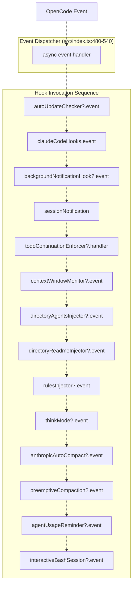

**Note:** The `?` suffix indicates conditional hooks that may be `null` if disabled via configuration. The dispatcher uses optional chaining (`?.`) to safely skip disabled hooks.

**Hook Enablement Logic**

Hooks are conditionally instantiated based on configuration:

```javascript
const isHookEnabled = (hookName: HookName) => !disabledHooks.has(hookName);

const contextWindowMonitor = isHookEnabled("context-window-monitor")
  ? createContextWindowMonitorHook(ctx)
  : null;
```

**Sources:** [src/index.ts L213-L214](https://github.com/code-yeongyu/oh-my-opencode/blob/b92cd6ab/src/index.ts#L213-L214)

 [src/index.ts L233-L235](https://github.com/code-yeongyu/oh-my-opencode/blob/b92cd6ab/src/index.ts#L233-L235)

 [src/index.ts L480-L494](https://github.com/code-yeongyu/oh-my-opencode/blob/b92cd6ab/src/index.ts#L480-L494)

---

## Session Event Handling

Session events manage the lifecycle of conversation sessions, including creation, deletion, and error handling.

### Session Creation and Tracking

When a session is created, the plugin tracks whether it's a main session or a background (child) session:

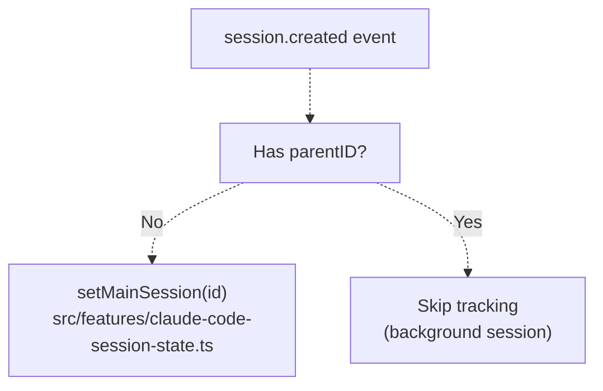

**Code Implementation:**

[src/index.ts L499-L506](https://github.com/code-yeongyu/oh-my-opencode/blob/b92cd6ab/src/index.ts#L499-L506)

 processes `session.created` events:

```typescript
if (event.type === "session.created") {
  const sessionInfo = props?.info as
    | { id?: string; title?: string; parentID?: string }
    | undefined;
  if (!sessionInfo?.parentID) {
    setMainSession(sessionInfo?.id);
  }
}
```

### Session Deletion

[src/index.ts L508-L513](https://github.com/code-yeongyu/oh-my-opencode/blob/b92cd6ab/src/index.ts#L508-L513)

 handles `session.deleted` events to clean up main session tracking:

```typescript
if (event.type === "session.deleted") {
  const sessionInfo = props?.info as { id?: string } | undefined;
  if (sessionInfo?.id === getMainSessionID()) {
    setMainSession(undefined);
  }
}
```

### Session Error Recovery

Session errors trigger a sophisticated recovery mechanism that coordinates between multiple components:

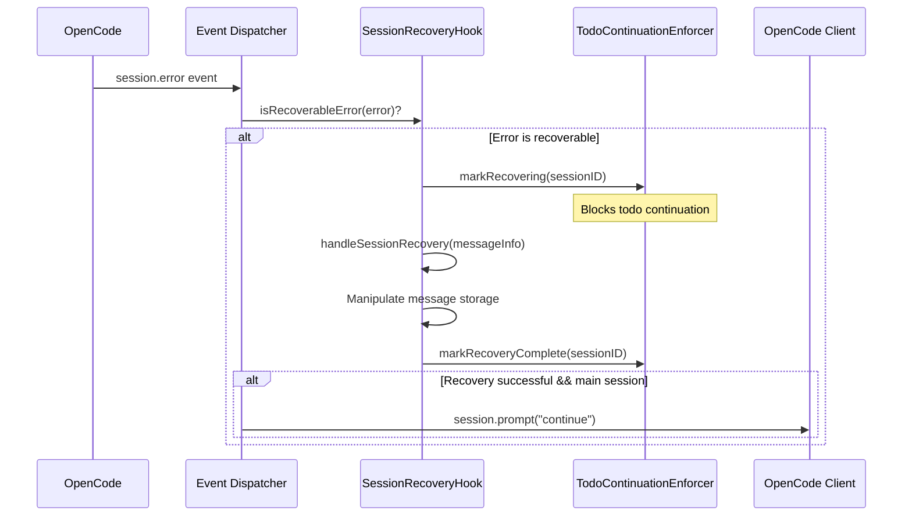

**Code Implementation:**

[src/index.ts L515-L539](https://github.com/code-yeongyu/oh-my-opencode/blob/b92cd6ab/src/index.ts#L515-L539)

 implements the session error handler:

```typescript
if (event.type === "session.error") {
  const sessionID = props?.sessionID as string | undefined;
  const error = props?.error;

  if (sessionRecovery?.isRecoverableError(error)) {
    const messageInfo = {
      id: props?.messageID as string | undefined,
      role: "assistant" as const,
      sessionID,
      error,
    };
    const recovered =
      await sessionRecovery.handleSessionRecovery(messageInfo);

    if (recovered && sessionID && sessionID === getMainSessionID()) {
      await ctx.client.session
        .prompt({
          path: { id: sessionID },
          body: { parts: [{ type: "text", text: "continue" }] },
          query: { directory: ctx.directory },
        })
        .catch(() => {});
    }
  }
}
```

**Coordination Between Recovery and Continuation:**

[src/index.ts L244-L248](https://github.com/code-yeongyu/oh-my-opencode/blob/b92cd6ab/src/index.ts#L244-L248)

 wires up callbacks to coordinate state:

```
if (sessionRecovery && todoContinuationEnforcer) {
  sessionRecovery.setOnAbortCallback(todoContinuationEnforcer.markRecovering);
  sessionRecovery.setOnRecoveryCompleteCallback(todoContinuationEnforcer.markRecoveryComplete);
}
```

**Sources:** [src/index.ts L244-L248](https://github.com/code-yeongyu/oh-my-opencode/blob/b92cd6ab/src/index.ts#L244-L248)

 [src/index.ts L515-L539](https://github.com/code-yeongyu/oh-my-opencode/blob/b92cd6ab/src/index.ts#L515-L539)

---

## Tool Execution Events

Tool execution events enable interception and enhancement of tool calls before and after execution.

### Tool Execution Event Flow

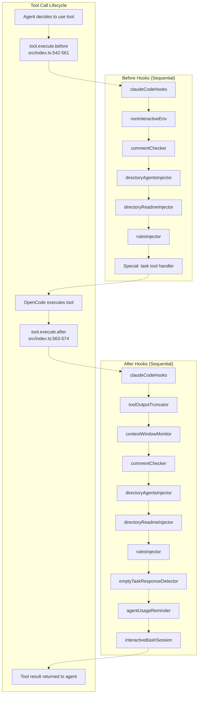

### Before Execution

The `tool.execute.before` handler receives `input` and `output` parameters where hooks can modify the tool arguments before execution:

```typescript
"tool.execute.before": async (input, output) => {
  await claudeCodeHooks<FileRef file-url="https://github.com/code-yeongyu/oh-my-opencode/blob/b92cd6ab/\"tool.execute.before\"" undefined  file-path="\"tool.execute.before\"">Hii</FileRef>;
  await nonInteractiveEnv?.<FileRef file-url="https://github.com/code-yeongyu/oh-my-opencode/blob/b92cd6ab/\"tool.execute.before\"" undefined  file-path="\"tool.execute.before\"">Hii</FileRef>;
  await commentChecker?.<FileRef file-url="https://github.com/code-yeongyu/oh-my-opencode/blob/b92cd6ab/\"tool.execute.before\"" undefined  file-path="\"tool.execute.before\"">Hii</FileRef>;
  await directoryAgentsInjector?.["tool.execute.before"]?.(input, output);
  await directoryReadmeInjector?.["tool.execute.before"]?.(input, output);
  await rulesInjector?.["tool.execute.before"]?.(input, output);

  // Special handling for task tool
  if (input.tool === "task") {
    const args = output.args as Record<string, unknown>;
    const subagentType = args.subagent_type as string;
    const isExploreOrLibrarian = ["explore", "librarian"].includes(subagentType);

    args.tools = {
      ...(args.tools as Record<string, boolean> | undefined),
      background_task: false,
      ...(isExploreOrLibrarian ? { call_omo_agent: false } : {}),
    };
  }
}
```

**Task Tool Filtering:**

[src/index.ts L550-L560](https://github.com/code-yeongyu/oh-my-opencode/blob/b92cd6ab/src/index.ts#L550-L560)

 implements special logic to restrict tools available to subagents:

* All subagents have `background_task` disabled (prevents recursive background tasks)
* `explore` and `librarian` agents have `call_omo_agent` disabled (prevents delegation loops)

### After Execution

The `tool.execute.after` handler processes tool results, enabling truncation, validation, and monitoring:

```javascript
"tool.execute.after": async (input, output) => {
  await claudeCodeHooks<FileRef file-url="https://github.com/code-yeongyu/oh-my-opencode/blob/b92cd6ab/\"tool.execute.after\"" undefined  file-path="\"tool.execute.after\"">Hii</FileRef>;
  await toolOutputTruncator?.<FileRef file-url="https://github.com/code-yeongyu/oh-my-opencode/blob/b92cd6ab/\"tool.execute.after\"" undefined  file-path="\"tool.execute.after\"">Hii</FileRef>;
  await contextWindowMonitor?.<FileRef file-url="https://github.com/code-yeongyu/oh-my-opencode/blob/b92cd6ab/\"tool.execute.after\"" undefined  file-path="\"tool.execute.after\"">Hii</FileRef>;
  await commentChecker?.<FileRef file-url="https://github.com/code-yeongyu/oh-my-opencode/blob/b92cd6ab/\"tool.execute.after\"" undefined  file-path="\"tool.execute.after\"">Hii</FileRef>;
  await directoryAgentsInjector?.<FileRef file-url="https://github.com/code-yeongyu/oh-my-opencode/blob/b92cd6ab/\"tool.execute.after\"" undefined  file-path="\"tool.execute.after\"">Hii</FileRef>;
  await directoryReadmeInjector?.<FileRef file-url="https://github.com/code-yeongyu/oh-my-opencode/blob/b92cd6ab/\"tool.execute.after\"" undefined  file-path="\"tool.execute.after\"">Hii</FileRef>;
  await rulesInjector?.<FileRef file-url="https://github.com/code-yeongyu/oh-my-opencode/blob/b92cd6ab/\"tool.execute.after\"" undefined  file-path="\"tool.execute.after\"">Hii</FileRef>;
  await emptyTaskResponseDetector?.<FileRef file-url="https://github.com/code-yeongyu/oh-my-opencode/blob/b92cd6ab/\"tool.execute.after\"" undefined  file-path="\"tool.execute.after\"">Hii</FileRef>;
  await agentUsageReminder?.<FileRef file-url="https://github.com/code-yeongyu/oh-my-opencode/blob/b92cd6ab/\"tool.execute.after\"" undefined  file-path="\"tool.execute.after\"">Hii</FileRef>;
  await interactiveBashSession?.<FileRef file-url="https://github.com/code-yeongyu/oh-my-opencode/blob/b92cd6ab/\"tool.execute.after\"" undefined  file-path="\"tool.execute.after\"">Hii</FileRef>;
}
```

**Sources:** [src/index.ts L542-L574](https://github.com/code-yeongyu/oh-my-opencode/blob/b92cd6ab/src/index.ts#L542-L574)

---

## Message Events

Message events enable interception and transformation of chat messages before they reach the LLM.

### Chat Message Event

The `chat.message` handler processes user messages as they arrive:

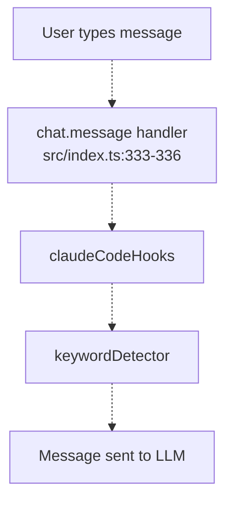

[src/index.ts L333-L336](https://github.com/code-yeongyu/oh-my-opencode/blob/b92cd6ab/src/index.ts#L333-L336)

 implements the handler:

```javascript
"chat.message": async (input, output) => {
  await claudeCodeHooks["chat.message"]?.(input, output);
  await keywordDetector?.["chat.message"]?.(input, output);
}
```

**Keyword Detection Use Case:**

The `keywordDetector` hook scans user messages for special keywords like "ultrawork", "search", or "analyze" to activate different agent modes or behaviors.

### Experimental Message Transform

The `experimental.chat.messages.transform` handler operates on the entire message array before it's sent to the LLM:

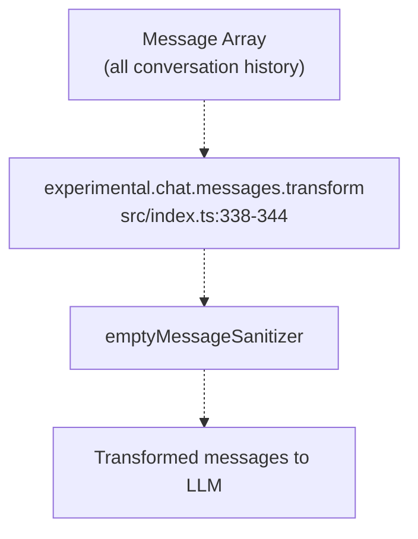

[src/index.ts L338-L344](https://github.com/code-yeongyu/oh-my-opencode/blob/b92cd6ab/src/index.ts#L338-L344)

 shows the implementation:

```javascript
"experimental.chat.messages.transform": async (
  input: Record<string, never>,
  output: { messages: Array<{ info: unknown; parts: unknown[] }> }
) => {
  await emptyMessageSanitizer?.["experimental.chat.messages.transform"]?.(input, output as any);
}
```

**Empty Message Sanitizer:**

This hook removes messages with empty `parts` arrays to prevent LLM errors caused by malformed messages.

**Sources:** [src/index.ts L333-L344](https://github.com/code-yeongyu/oh-my-opencode/blob/b92cd6ab/src/index.ts#L333-L344)

---

## Event Flow Examples

### Example 1: Tool Execution with Truncation

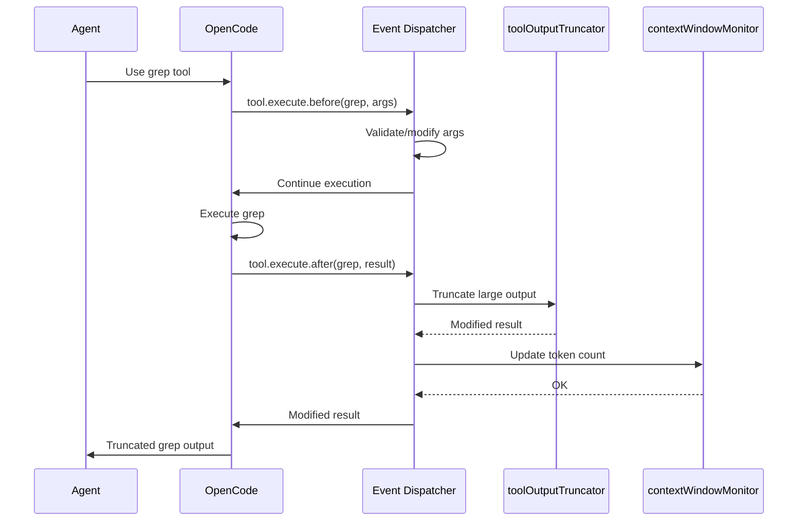

### Example 2: Session Error Recovery

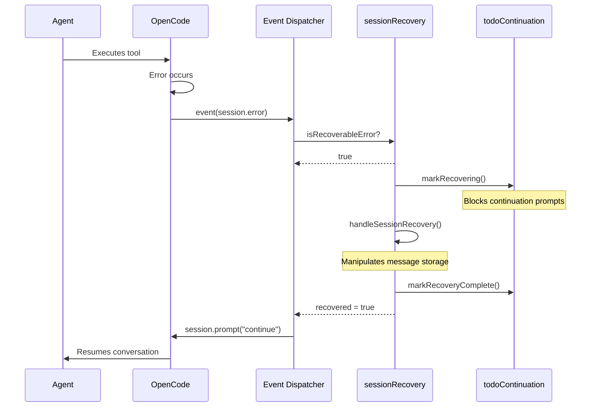

**Sources:** [src/index.ts L515-L539](https://github.com/code-yeongyu/oh-my-opencode/blob/b92cd6ab/src/index.ts#L515-L539)

 [src/index.ts L542-L574](https://github.com/code-yeongyu/oh-my-opencode/blob/b92cd6ab/src/index.ts#L542-L574)

---

## Event Handler Initialization

Event handlers are initialized during plugin setup, with hooks instantiated based on configuration:

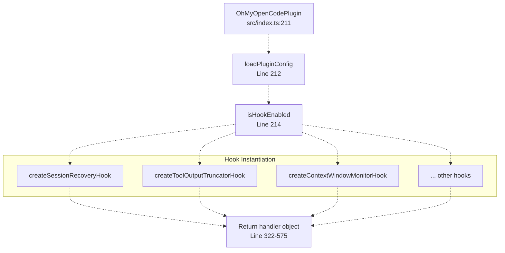

**Hook Instantiation Pattern:**

Each hook is conditionally created based on whether it's enabled in configuration:

```javascript
const sessionRecovery = isHookEnabled("session-recovery")
  ? createSessionRecoveryHook(ctx, { experimental: pluginConfig.experimental })
  : null;
```

If a hook is disabled, it's set to `null`, and the event dispatcher uses optional chaining (`?.`) to skip it.

**Sources:** [src/index.ts L211-L304](https://github.com/code-yeongyu/oh-my-opencode/blob/b92cd6ab/src/index.ts#L211-L304)

 [src/index.ts L322-L575](https://github.com/code-yeongyu/oh-my-opencode/blob/b92cd6ab/src/index.ts#L322-L575)

---

## Configuration Handler

While not strictly an "event," the `config` handler is a special initialization hook that finalizes OpenCode's configuration before session start.

### Configuration Handler Responsibilities

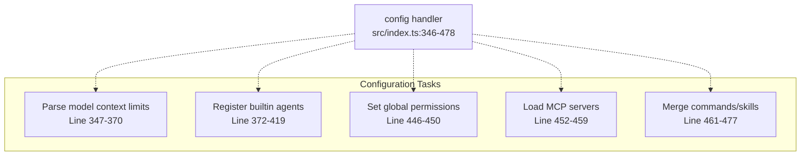

**Model Context Limit Caching:**

[src/index.ts L356-L370](https://github.com/code-yeongyu/oh-my-opencode/blob/b92cd6ab/src/index.ts#L356-L370)

 extracts context limits from provider configurations and caches them for use by compaction hooks:

```javascript
if (providers) {
  for (const [providerID, providerConfig] of Object.entries(providers)) {
    const models = providerConfig?.models;
    if (models) {
      for (const [modelID, modelConfig] of Object.entries(models)) {
        const contextLimit = modelConfig?.limit?.context;
        if (contextLimit) {
          modelContextLimitsCache.set(`${providerID}/${modelID}`, contextLimit);
        }
      }
    }
  }
}
```

**Agent Registration:**

[src/index.ts L372-L419](https://github.com/code-yeongyu/oh-my-opencode/blob/b92cd6ab/src/index.ts#L372-L419)

 conditionally registers agents based on whether Sisyphus is enabled, demoting `build` and `plan` agents to subagent mode when Sisyphus is active.

**Sources:** [src/index.ts L346-L478](https://github.com/code-yeongyu/oh-my-opencode/blob/b92cd6ab/src/index.ts#L346-L478)

---

## Summary

The event handling system in oh-my-opencode provides a robust foundation for intercepting and enhancing OpenCode's behavior:

| Event Handler | Primary Purpose | Dispatch Pattern | Hook Count |
| --- | --- | --- | --- |
| `event` | Session lifecycle management | Sequential await | 14 hooks |
| `tool.execute.before` | Pre-execution validation and argument modification | Sequential await | 7 hooks |
| `tool.execute.after` | Post-execution enhancement and monitoring | Sequential await | 10 hooks |
| `chat.message` | User message interception | Sequential await | 2 hooks |
| `experimental.chat.messages.transform` | Message array sanitization | Sequential await | 1 hook |
| `config` | Configuration finalization | Synchronous | N/A |

**Key Design Patterns:**

1. **Sequential Dispatch:** All hooks are invoked sequentially with `await`, ensuring predictable execution order
2. **Optional Chaining:** Disabled hooks are `null`, and dispatchers use `?.` to skip them
3. **Configuration-Driven:** Hook enablement is controlled via `disabled_hooks` configuration array
4. **Coordination:** Related hooks share state (e.g., session recovery and todo continuation)
5. **Type-Specific Handling:** Event dispatcher includes special logic for specific event types (e.g., `session.error`)

**Sources:** [src/index.ts L211-L576](https://github.com/code-yeongyu/oh-my-opencode/blob/b92cd6ab/src/index.ts#L211-L576)

 [src/config/schema.ts L44-L66](https://github.com/code-yeongyu/oh-my-opencode/blob/b92cd6ab/src/config/schema.ts#L44-L66)