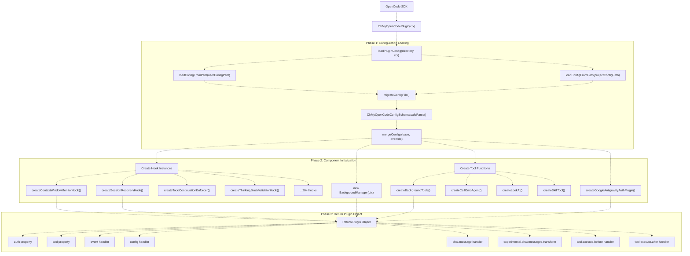
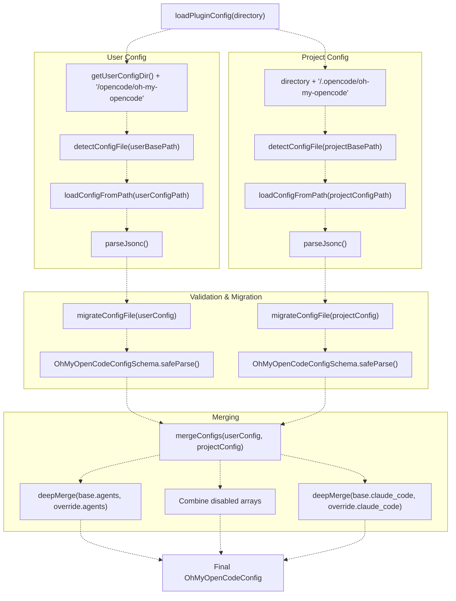
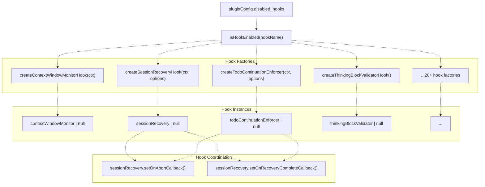
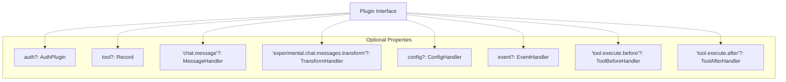
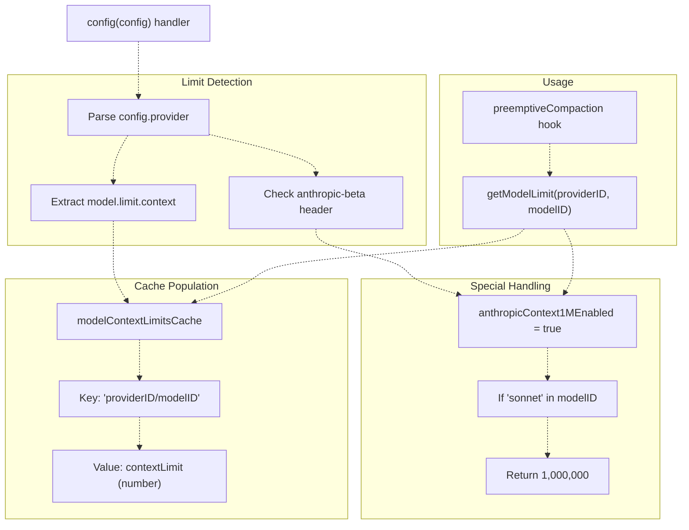

# Plugin Lifecycle

> **Relevant source files**
> * [assets/oh-my-opencode.schema.json](https://github.com/code-yeongyu/oh-my-opencode/blob/b92cd6ab/assets/oh-my-opencode.schema.json)
> * [src/config/schema.ts](https://github.com/code-yeongyu/oh-my-opencode/blob/b92cd6ab/src/config/schema.ts)
> * [src/hooks/index.ts](https://github.com/code-yeongyu/oh-my-opencode/blob/b92cd6ab/src/hooks/index.ts)
> * [src/index.ts](https://github.com/code-yeongyu/oh-my-opencode/blob/b92cd6ab/src/index.ts)

This document details the initialization, component registration, and runtime behavior of the `OhMyOpenCodePlugin` as it integrates with OpenCode's plugin API. It covers configuration loading, component instantiation, hook registration, and event dispatching mechanisms.

For information about the configuration system's schema and merging logic, see [Configuration System](/code-yeongyu/oh-my-opencode/3.2-configuration-system). For details on how events are routed to hooks, see [Event Handling](/code-yeongyu/oh-my-opencode/3.3-event-handling).

---

## Overview

The `OhMyOpenCodePlugin` is the main entry point for the oh-my-opencode system. It is an async function that conforms to OpenCode's `Plugin` interface from `@opencode-ai/plugin`. The plugin lifecycle consists of three distinct phases:

1. **Initialization Phase**: Load and merge configuration files, initialize hook instances, and prepare tools
2. **Component Registration Phase**: Register agents, tools, commands, skills, and MCPs with OpenCode
3. **Runtime Phase**: Handle events and execute hooks in response to session activity

**Sources:** [src/index.ts L219](https://github.com/code-yeongyu/oh-my-opencode/blob/b92cd6ab/src/index.ts#L219-L219)

---

## Initialization Flow

The following diagram shows the complete initialization sequence when OpenCode loads the plugin:

### Plugin Initialization Sequence



**Sources:** [src/index.ts L219-L654](https://github.com/code-yeongyu/oh-my-opencode/blob/b92cd6ab/src/index.ts#L219-L654)

---

## Configuration Loading and Migration

The plugin loads configuration from two locations in a hierarchical fashion:

| Priority | Location | Format | Purpose |
| --- | --- | --- | --- |
| 1 (Base) | `~/.config/opencode/oh-my-opencode.json(c)` | JSONC | User-level defaults |
| 2 (Override) | `.opencode/oh-my-opencode.json(c)` | JSONC | Project-specific overrides |

### Configuration Loading Process



The `detectConfigFile()` function prefers `.jsonc` over `.json` extensions. The `parseJsonc()` utility strips comments before parsing, allowing configuration files to include documentation.

**Sources:** [src/index.ts L189-L217](https://github.com/code-yeongyu/oh-my-opencode/blob/b92cd6ab/src/index.ts#L189-L217)

 [src/index.ts L125-L151](https://github.com/code-yeongyu/oh-my-opencode/blob/b92cd6ab/src/index.ts#L125-L151)

 [src/index.ts L153-L187](https://github.com/code-yeongyu/oh-my-opencode/blob/b92cd6ab/src/index.ts#L153-L187)

### Configuration Migration

The plugin automatically migrates legacy configuration keys to maintain backward compatibility:

| Legacy Key | New Key | Notes |
| --- | --- | --- |
| `omo` | `Sisyphus` | Agent name migration |
| `OmO` | `Sisyphus` | Agent name migration |
| `OmO-Plan` | `Planner-Sisyphus` | Agent name migration |
| `omo_agent` | `sisyphus_agent` | Top-level config key |

The `AGENT_NAME_MAP` constant defines all supported migrations. The `migrateAgentNames()` function applies these transformations recursively to the `agents` configuration object. If any migrations are applied, the config file is automatically rewritten to disk.

**Sources:** [src/index.ts L62-L94](https://github.com/code-yeongyu/oh-my-opencode/blob/b92cd6ab/src/index.ts#L62-L94)

 [src/index.ts L96-L123](https://github.com/code-yeongyu/oh-my-opencode/blob/b92cd6ab/src/index.ts#L96-L123)

---

## Hook Initialization

Hooks are initialized based on the `disabled_hooks` array in the configuration. Each hook factory function returns either a hook object or `null`:

### Hook Creation Pattern



Key hooks initialized during this phase include:

| Hook Name | Factory Function | Configuration Dependency |
| --- | --- | --- |
| `context-window-monitor` | `createContextWindowMonitorHook()` | None |
| `session-recovery` | `createSessionRecoveryHook()` | `experimental` |
| `todo-continuation-enforcer` | `createTodoContinuationEnforcer()` | `backgroundManager` |
| `thinking-block-validator` | `createThinkingBlockValidatorHook()` | None |
| `empty-message-sanitizer` | `createEmptyMessageSanitizerHook()` | None |
| `tool-output-truncator` | `createToolOutputTruncatorHook()` | `experimental` |
| `preemptive-compaction` | `createPreemptiveCompactionHook()` | `experimental`, `getModelLimit` |

Certain hooks require coordination. For example, `sessionRecovery` registers callbacks with `todoContinuationEnforcer` to coordinate recovery state:

```
if (sessionRecovery && todoContinuationEnforcer) {
  sessionRecovery.setOnAbortCallback(todoContinuationEnforcer.markRecovering);
  sessionRecovery.setOnRecoveryCompleteCallback(todoContinuationEnforcer.markRecoveryComplete);
}
```

**Sources:** [src/index.ts L221-L305](https://github.com/code-yeongyu/oh-my-opencode/blob/b92cd6ab/src/index.ts#L221-L305)

 [src/index.ts L309-L316](https://github.com/code-yeongyu/oh-my-opencode/blob/b92cd6ab/src/index.ts#L309-L316)

 [src/hooks/index.ts L1-L25](https://github.com/code-yeongyu/oh-my-opencode/blob/b92cd6ab/src/hooks/index.ts#L1-L25)

---

## Component Registration

The plugin's `config` handler is invoked by OpenCode to register agents, tools, commands, skills, and MCPs. This occurs after initialization but before any user interaction.

### Component Registration Flow

```mermaid
flowchart TD

ConfigHandler["config(config) handler"]
LoadPlugins["loadAllPluginComponents()"]
LoadMcps["loadMcpConfigs()"]
LoadUserAgents["loadUserAgents()"]
LoadProjectAgents["loadProjectAgents()"]
LoadCommands["loadUserCommands() + loadProjectCommands()"]
LoadSkills["loadUserSkills() + loadProjectSkills()"]
CreateBuiltinAgents["createBuiltinAgents(disabled, overrides, directory, model)"]
CreateBuiltinMcps["createBuiltinMcps(disabled)"]
LoadBuiltinCommands["loadBuiltinCommands(disabled)"]
CheckSisyphus["isSisyphusEnabled?"]
SetDefault["config.default_agent = 'Sisyphus'"]
BuilderConfig["Configure OpenCode-Builder"]
PlannerConfig["Configure Planner-Sisyphus"]
FilterAgents["Filter build/plan from config.agent"]
ExploreTools["explore.tools.call_omo_agent = false"]
LibrarianTools["librarian.tools.call_omo_agent = false"]
MultimodalTools["multimodal-looker.tools = {...}"]
TaskRestriction["task subagent restrictions"]
MergeAgents["Merge all agents into config.agent"]
MergeCommands["Merge all commands into config.command"]
MergeMcps["Merge all MCPs into config.mcp"]
SetPermissions["config.permission.webfetch = 'allow'"]

ConfigHandler -.-> LoadPlugins
ConfigHandler -.-> LoadMcps
ConfigHandler -.->|"Yes"| LoadUserAgents
ConfigHandler -.-> LoadProjectAgents
ConfigHandler -.-> LoadCommands
ConfigHandler -.-> LoadSkills
ConfigHandler -.-> CreateBuiltinAgents
ConfigHandler -.-> CreateBuiltinMcps
ConfigHandler -.-> LoadBuiltinCommands
CreateBuiltinAgents -.-> CheckSisyphus
CheckSisyphus -.-> ExploreTools
CheckSisyphus -.-> LibrarianTools
CheckSisyphus -.-> MultimodalTools
CheckSisyphus -.-> TaskRestriction
FilterAgents -.-> MergeAgents
LoadUserAgents -.-> MergeAgents
LoadProjectAgents -.-> MergeAgents
LoadPlugins -.-> MergeAgents
LoadBuiltinCommands -.-> MergeCommands
LoadCommands -.-> MergeCommands
LoadSkills -.-> MergeCommands
LoadPlugins -.-> MergeCommands
CreateBuiltinMcps -.-> MergeMcps
LoadMcps -.-> MergeMcps
LoadPlugins -.-> MergeMcps

subgraph subGraph4 ["Final Registration"]
    MergeAgents
    MergeCommands
    MergeMcps
    SetPermissions
    MergeAgents -.-> SetPermissions
    MergeCommands -.-> SetPermissions
    MergeMcps -.-> SetPermissions
end

subgraph subGraph3 ["Tool Access Control"]
    ExploreTools
    LibrarianTools
    MultimodalTools
    TaskRestriction
end

subgraph subGraph2 ["Agent Configuration"]
    CheckSisyphus
    SetDefault
    BuilderConfig
    PlannerConfig
    FilterAgents
    CheckSisyphus -.-> SetDefault
    SetDefault -.-> BuilderConfig
    SetDefault -.-> PlannerConfig
    SetDefault -.-> FilterAgents
end

subgraph subGraph1 ["Built-in Component Creation"]
    CreateBuiltinAgents
    CreateBuiltinMcps
    LoadBuiltinCommands
end

subgraph subGraph0 ["External Component Loading"]
    LoadPlugins
    LoadMcps
    LoadUserAgents
    LoadProjectAgents
    LoadCommands
    LoadSkills
end
```



### Agent Registration Priority

Agents are merged in the following priority order (later entries override earlier ones):

1. Built-in agents (Sisyphus, oracle, librarian, explore, frontend, docwriter, multimodal)
2. User agents from `~/.claude/agents/`
3. Project agents from `./.claude/agents/`
4. Plugin agents from Claude Code plugins
5. OpenCode config agents from `opencode.json`

When Sisyphus is enabled, the plugin performs special handling:

* Sets `config.default_agent = "Sisyphus"` (requires OpenCode PR #5843)
* Optionally adds `OpenCode-Builder` (wraps OpenCode's build agent)
* Optionally adds `Planner-Sisyphus` (wraps OpenCode's plan agent with custom prompt)
* Filters `build` and optionally `plan` from primary agents, demoting them to subagent mode

**Sources:** [src/index.ts L362-L556](https://github.com/code-yeongyu/oh-my-opencode/blob/b92cd6ab/src/index.ts#L362-L556)

 [src/index.ts L404-L486](https://github.com/code-yeongyu/oh-my-opencode/blob/b92cd6ab/src/index.ts#L404-L486)

### Tool Registration

The plugin registers tools in the `tool` property of the returned plugin object:

```yaml
return {
  tool: {
    ...builtinTools,              // LSP, AST-Grep, session tools
    ...backgroundTools,           // background_task, background_output, background_cancel
    call_omo_agent: callOmoAgent, // Agent delegation tool
    look_at: lookAt,              // Multimodal analysis
    skill: skillTool,             // Skill execution
    ...(tmuxAvailable ? { interactive_bash } : {}), // Conditionally added
  },
  // ...
}
```

The `interactive_bash` tool is only registered if tmux is detected on the system via `getTmuxPath()`.

**Sources:** [src/index.ts L335-L345](https://github.com/code-yeongyu/oh-my-opencode/blob/b92cd6ab/src/index.ts#L335-L345)

 [src/index.ts L321-L327](https://github.com/code-yeongyu/oh-my-opencode/blob/b92cd6ab/src/index.ts#L321-L327)

### Tool Access Restrictions

The plugin enforces tool access restrictions for specific agents:

| Agent | Restricted Tools | Reason |
| --- | --- | --- |
| `explore` | `call_omo_agent: false` | Prevent recursive agent spawning |
| `librarian` | `call_omo_agent: false` | Prevent recursive agent spawning |
| `multimodal-looker` | `task: false`, `call_omo_agent: false`, `look_at: false` | Prevent recursive calls and self-delegation |
| Task subagents (explore/librarian) | `background_task: false`, `call_omo_agent: false` | Prevent nested background tasks |

These restrictions are applied in the `config` handler and in the `tool.execute.before` hook.

**Sources:** [src/index.ts L492-L511](https://github.com/code-yeongyu/oh-my-opencode/blob/b92cd6ab/src/index.ts#L492-L511)

 [src/index.ts L620-L639](https://github.com/code-yeongyu/oh-my-opencode/blob/b92cd6ab/src/index.ts#L620-L639)

---

## Event Handling

The plugin registers multiple event handlers that are invoked by OpenCode at different points in the session lifecycle:

### Event Handler Registration Map

```mermaid
flowchart TD

ChatMessage["chat.message"]
TransformMessages["experimental.chat.messages.transform"]
ConfigEvent["config"]
EventStream["event"]
ToolBefore["tool.execute.before"]
ToolAfter["tool.execute.after"]
ChatHandler["claudeCodeHooks + keywordDetector"]
TransformHandler["thinkingBlockValidator + emptyMessageSanitizer"]
ConfigHandler["Component registration logic"]
EventHandler["Multiple hooks"]
Event1["autoUpdateChecker"]
Event2["claudeCodeHooks"]
Event3["backgroundNotificationHook"]
Event4["sessionNotification"]
Event5["todoContinuationEnforcer"]
Event6["contextWindowMonitor"]
Event7["directoryAgentsInjector"]
Event8["directoryReadmeInjector"]
Event9["rulesInjector"]
Event10["thinkMode"]
Event11["anthropicContextWindowLimitRecovery"]
Event12["preemptiveCompaction"]
Event13["agentUsageReminder"]
Event14["interactiveBashSession"]
EventN["..."]
BeforeHandler["Multiple hooks"]
Before1["claudeCodeHooks"]
Before2["nonInteractiveEnv"]
Before3["commentChecker"]
Before4["directoryAgentsInjector"]
Before5["directoryReadmeInjector"]
Before6["rulesInjector"]
Before7["Task tool restrictions"]
AfterHandler["Multiple hooks"]
After1["claudeCodeHooks"]
After2["toolOutputTruncator"]
After3["contextWindowMonitor"]
After4["commentChecker"]
After5["directoryAgentsInjector"]
After6["directoryReadmeInjector"]
After7["rulesInjector"]
After8["emptyTaskResponseDetector"]
After9["agentUsageReminder"]
After10["interactiveBashSession"]

ChatMessage -.-> ChatHandler
TransformMessages -.-> TransformHandler
ConfigEvent -.-> ConfigHandler
EventStream -.-> EventHandler
ToolBefore -.-> BeforeHandler
ToolAfter -.-> AfterHandler

subgraph subGraph1 ["Hook Dispatch"]
    ChatHandler
    TransformHandler
    ConfigHandler
    EventHandler
    Event1
    Event2
    Event3
    Event4
    Event5
    Event6
    Event7
    Event8
    Event9
    Event10
    Event11
    Event12
    Event13
    Event14
    EventN
    BeforeHandler
    Before1
    Before2
    Before3
    Before4
    Before5
    Before6
    Before7
    AfterHandler
    After1
    After2
    After3
    After4
    After5
    After6
    After7
    After8
    After9
    After10
    EventHandler -.-> Event1
    EventHandler -.-> Event2
    EventHandler -.-> Event3
    EventHandler -.-> Event4
    EventHandler -.-> Event5
    EventHandler -.-> Event6
    EventHandler -.-> Event7
    EventHandler -.-> Event8
    EventHandler -.-> Event9
    EventHandler -.-> Event10
    EventHandler -.-> Event11
    EventHandler -.-> Event12
    EventHandler -.-> Event13
    EventHandler -.-> Event14
    EventHandler -.-> EventN
    BeforeHandler -.-> Before1
    BeforeHandler -.-> Before2
    BeforeHandler -.-> Before3
    BeforeHandler -.-> Before4
    BeforeHandler -.-> Before5
    BeforeHandler -.-> Before6
    BeforeHandler -.-> Before7
    AfterHandler -.-> After1
    AfterHandler -.-> After2
    AfterHandler -.-> After3
    AfterHandler -.-> After4
    AfterHandler -.-> After5
    AfterHandler -.-> After6
    AfterHandler -.-> After7
    AfterHandler -.-> After8
    AfterHandler -.-> After9
    AfterHandler -.-> After10
end

subgraph subGraph0 ["OpenCode Event Types"]
    ChatMessage
    TransformMessages
    ConfigEvent
    EventStream
    ToolBefore
    ToolAfter
end
```



**Sources:** [src/index.ts L347-L653](https://github.com/code-yeongyu/oh-my-opencode/blob/b92cd6ab/src/index.ts#L347-L653)

### Event Handler Types

The plugin implements the following OpenCode event handlers:

| Handler | Purpose | Hook Invocations |
| --- | --- | --- |
| `chat.message` | Intercept user messages | `claudeCodeHooks`, `keywordDetector` |
| `experimental.chat.messages.transform` | Transform messages before API call | `thinkingBlockValidator`, `emptyMessageSanitizer` |
| `config` | Register agents, tools, commands, MCPs | N/A (registration logic) |
| `event` | Handle session lifecycle events | 14+ hooks (see below) |
| `tool.execute.before` | Modify tool arguments before execution | 7 hooks |
| `tool.execute.after` | Process tool outputs after execution | 10 hooks |

### Event Stream Processing

The `event` handler dispatches events to multiple hooks in sequence. Notable event types handled include:

#### session.created Event

```typescript
if (event.type === "session.created") {
  const sessionInfo = props?.info as { id?: string; title?: string; parentID?: string } | undefined;
  if (!sessionInfo?.parentID) {
    setMainSession(sessionInfo?.id);  // Track main session ID
  }
}
```

This tracks the main (non-background) session for recovery and continuation logic.

#### session.error Event

```javascript
if (event.type === "session.error") {
  const sessionID = props?.sessionID as string | undefined;
  const error = props?.error;

  if (sessionRecovery?.isRecoverableError(error)) {
    const recovered = await sessionRecovery.handleSessionRecovery(messageInfo);
    
    if (recovered && sessionID === getMainSessionID()) {
      // Auto-resume with "continue" prompt
      await ctx.client.session.prompt({...});
    }
  }
}
```

This enables automatic session recovery from API errors (see [Session Recovery](/code-yeongyu/oh-my-opencode/7.1-session-recovery)).

**Sources:** [src/index.ts L558-L618](https://github.com/code-yeongyu/oh-my-opencode/blob/b92cd6ab/src/index.ts#L558-L618)

---

## OpenCode Plugin API Integration

The plugin conforms to OpenCode's `Plugin` interface from `@opencode-ai/plugin`:

### Plugin Interface Structure



The plugin implements all optional properties except for certain conditional ones:

1. **auth**: Only present if `google_auth !== false` in config
2. **tool**: Always present, contains 20+ tools
3. **chat.message**: Intercepts user messages
4. **experimental.chat.messages.transform**: Validates and sanitizes messages
5. **config**: Registers all components
6. **event**: Processes lifecycle events
7. **tool.execute.before**: Modifies tool arguments
8. **tool.execute.after**: Processes tool outputs

**Sources:** [src/index.ts L335-L653](https://github.com/code-yeongyu/oh-my-opencode/blob/b92cd6ab/src/index.ts#L335-L653)

### Context Object

The plugin receives a context object (`ctx`) from OpenCode with the following structure:

```
type PluginContext = {
  directory: string;           // Project root directory
  client: OpenCodeClient;      // API client for session operations
  // ... other properties
}
```

This context is passed to most hook factory functions and tools to enable file system access and session management.

**Sources:** [src/index.ts L219](https://github.com/code-yeongyu/oh-my-opencode/blob/b92cd6ab/src/index.ts#L219-L219)

---

## Model Context Limit Caching

The plugin maintains a runtime cache of model context limits to support preemptive compaction:



The `getModelLimit()` function checks:

1. The cache for explicit limits
2. The `anthropicContext1MEnabled` flag for Sonnet models with the `context-1m` beta header
3. Returns `undefined` if no limit is found

This enables the preemptive compaction hook to trigger at the correct threshold based on the model's actual context window.

**Sources:** [src/index.ts L224-L236](https://github.com/code-yeongyu/oh-my-opencode/blob/b92cd6ab/src/index.ts#L224-L236)

 [src/index.ts L362-L386](https://github.com/code-yeongyu/oh-my-opencode/blob/b92cd6ab/src/index.ts#L362-L386)

---

## Summary

The `OhMyOpenCodePlugin` lifecycle consists of:

1. **Configuration Loading**: Load and merge user and project configs, apply migrations, validate schema
2. **Hook Initialization**: Create hook instances based on `disabled_hooks`, coordinate hook callbacks
3. **Component Registration**: Register agents (prioritized), tools (with restrictions), commands, skills, and MCPs via the `config` handler
4. **Runtime Event Handling**: Dispatch events to hooks via handlers for `chat.message`, `event`, `tool.execute.before`, and `tool.execute.after`
5. **Context Limit Tracking**: Cache model context limits for preemptive compaction

The plugin's design emphasizes modularity through hooks, hierarchical configuration with project overrides, and deep integration with OpenCode's plugin API to provide a comprehensive agent orchestration system.

**Sources:** [src/index.ts L1-L672](https://github.com/code-yeongyu/oh-my-opencode/blob/b92cd6ab/src/index.ts#L1-L672)