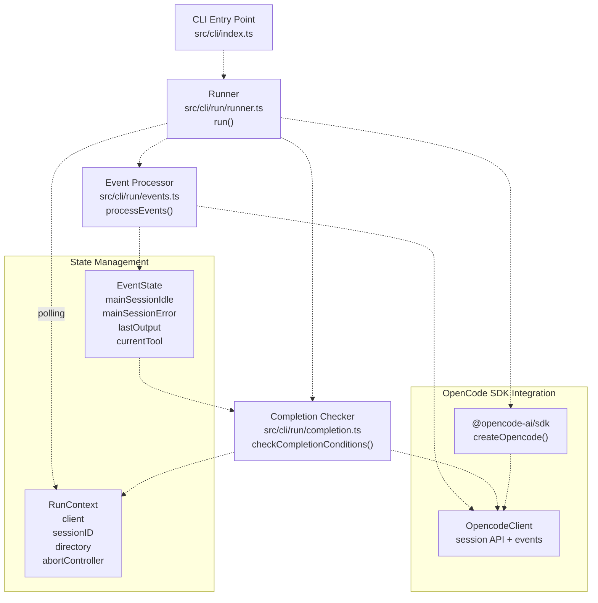
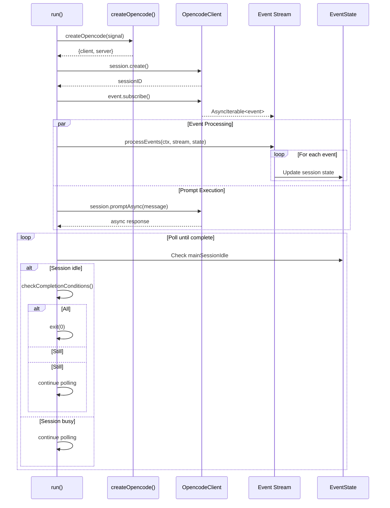
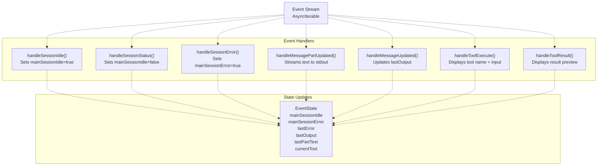
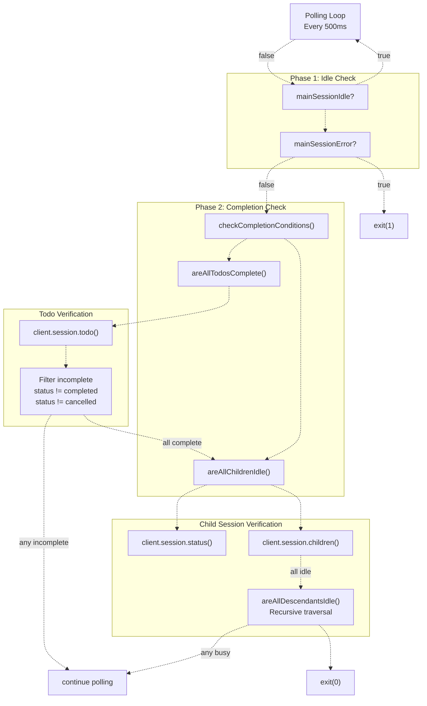

# CLI Run Command

> **Relevant source files**
> * [.github/workflows/sisyphus-agent.yml](https://github.com/code-yeongyu/oh-my-opencode/blob/b92cd6ab/.github/workflows/sisyphus-agent.yml)
> * [src/cli/run/completion.test.ts](https://github.com/code-yeongyu/oh-my-opencode/blob/b92cd6ab/src/cli/run/completion.test.ts)
> * [src/cli/run/completion.ts](https://github.com/code-yeongyu/oh-my-opencode/blob/b92cd6ab/src/cli/run/completion.ts)
> * [src/cli/run/events.test.ts](https://github.com/code-yeongyu/oh-my-opencode/blob/b92cd6ab/src/cli/run/events.test.ts)
> * [src/cli/run/events.ts](https://github.com/code-yeongyu/oh-my-opencode/blob/b92cd6ab/src/cli/run/events.ts)
> * [src/cli/run/index.ts](https://github.com/code-yeongyu/oh-my-opencode/blob/b92cd6ab/src/cli/run/index.ts)
> * [src/cli/run/runner.ts](https://github.com/code-yeongyu/oh-my-opencode/blob/b92cd6ab/src/cli/run/runner.ts)
> * [src/cli/run/types.ts](https://github.com/code-yeongyu/oh-my-opencode/blob/b92cd6ab/src/cli/run/types.ts)

The `oh-my-opencode run` command executes agent sessions in non-interactive, automated mode with intelligent completion detection. It is designed for CI/CD environments where tasks must run to completion without manual intervention. The command monitors session state, processes events in real-time, and exits only when all todos and background tasks are complete.

For information about the GitHub Actions workflow that invokes this command, see [Sisyphus Agent Workflow](/code-yeongyu/oh-my-opencode/10.1-sisyphus-agent-workflow). For details on the build system and CLI entry point, see [Build System](/code-yeongyu/oh-my-opencode/12.1-build-system).

## Command Architecture

The `run` command is implemented across multiple modules that handle session management, event processing, and completion detection. The architecture separates concerns into distinct layers for maintainability and testability.



**Sources:** [src/cli/run/runner.ts L1-L121](https://github.com/code-yeongyu/oh-my-opencode/blob/b92cd6ab/src/cli/run/runner.ts#L1-L121)

 [src/cli/run/events.ts L1-L276](https://github.com/code-yeongyu/oh-my-opencode/blob/b92cd6ab/src/cli/run/events.ts#L1-L276)

 [src/cli/run/completion.ts L1-L79](https://github.com/code-yeongyu/oh-my-opencode/blob/b92cd6ab/src/cli/run/completion.ts#L1-L79)

 [src/cli/run/types.ts L1-L77](https://github.com/code-yeongyu/oh-my-opencode/blob/b92cd6ab/src/cli/run/types.ts#L1-L77)

### Core Components

| Component | File | Responsibility |
| --- | --- | --- |
| `run()` | [src/cli/run/runner.ts L10-L121](https://github.com/code-yeongyu/oh-my-opencode/blob/b92cd6ab/src/cli/run/runner.ts#L10-L121) | Main orchestrator: creates session, starts event processing, polls for completion |
| `processEvents()` | [src/cli/run/events.ts L34-L62](https://github.com/code-yeongyu/oh-my-opencode/blob/b92cd6ab/src/cli/run/events.ts#L34-L62) | Consumes event stream, updates state, handles session lifecycle events |
| `checkCompletionConditions()` | [src/cli/run/completion.ts L4-L19](https://github.com/code-yeongyu/oh-my-opencode/blob/b92cd6ab/src/cli/run/completion.ts#L4-L19) | Determines if session is complete by checking todos and child sessions |
| `EventState` | [src/cli/run/events.ts L14-L31](https://github.com/code-yeongyu/oh-my-opencode/blob/b92cd6ab/src/cli/run/events.ts#L14-L31) | Tracks session state: idle status, errors, output, current tool |
| `RunContext` | [src/cli/run/types.ts L10-L15](https://github.com/code-yeongyu/oh-my-opencode/blob/b92cd6ab/src/cli/run/types.ts#L10-L15) | Shared context: client, sessionID, directory, abortController |

**Sources:** [src/cli/run/runner.ts L10-L121](https://github.com/code-yeongyu/oh-my-opencode/blob/b92cd6ab/src/cli/run/runner.ts#L10-L121)

 [src/cli/run/events.ts L14-L62](https://github.com/code-yeongyu/oh-my-opencode/blob/b92cd6ab/src/cli/run/events.ts#L14-L62)

 [src/cli/run/completion.ts L4-L19](https://github.com/code-yeongyu/oh-my-opencode/blob/b92cd6ab/src/cli/run/completion.ts#L4-L19)

 [src/cli/run/types.ts L10-L15](https://github.com/code-yeongyu/oh-my-opencode/blob/b92cd6ab/src/cli/run/types.ts#L10-L15)

## Session Lifecycle

The `run()` function manages the complete session lifecycle from creation to completion. It creates an OpenCode server, establishes an event stream, sends the initial prompt, and continuously monitors for completion.



**Sources:** [src/cli/run/runner.ts L10-L121](https://github.com/code-yeongyu/oh-my-opencode/blob/b92cd6ab/src/cli/run/runner.ts#L10-L121)

### Session Creation and Initialization

[src/cli/run/runner.ts L32-L58](https://github.com/code-yeongyu/oh-my-opencode/blob/b92cd6ab/src/cli/run/runner.ts#L32-L58)

The session creation flow:

1. **Create OpenCode instance** with AbortController for cancellation support
2. **Register cleanup handlers** for SIGINT (Ctrl+C) and timeout
3. **Create session** with title `"oh-my-opencode run"`
4. **Initialize context** with client, sessionID, directory, and abortController

```javascript
const { client, server } = await createOpencode({
  signal: abortController.signal,
})

const sessionRes = await client.session.create({
  body: { title: "oh-my-opencode run" },
})

const ctx: RunContext = {
  client,
  sessionID,
  directory,
  abortController,
}
```

**Sources:** [src/cli/run/runner.ts L32-L65](https://github.com/code-yeongyu/oh-my-opencode/blob/b92cd6ab/src/cli/run/runner.ts#L32-L65)

### Prompt Execution

[src/cli/run/runner.ts L67-L79](https://github.com/code-yeongyu/oh-my-opencode/blob/b92cd6ab/src/cli/run/runner.ts#L67-L79)

The command subscribes to events before sending the prompt to ensure no events are missed. The prompt is sent asynchronously using `session.promptAsync()`:

```javascript
const events = await client.event.subscribe()
const eventState = createEventState()
const eventProcessor = processEvents(ctx, events.stream, eventState)

await client.session.promptAsync({
  path: { id: sessionID },
  body: {
    agent,
    parts: [{ type: "text", text: message }],
  },
  query: { directory },
})
```

**Sources:** [src/cli/run/runner.ts L67-L79](https://github.com/code-yeongyu/oh-my-opencode/blob/b92cd6ab/src/cli/run/runner.ts#L67-L79)

## Event Stream Processing

The event processor consumes the asynchronous event stream and maintains session state. It handles multiple event types to track session progress, agent output, and tool execution.

### Event Types and Handlers



**Sources:** [src/cli/run/events.ts L34-L275](https://github.com/code-yeongyu/oh-my-opencode/blob/b92cd6ab/src/cli/run/events.ts#L34-L275)

### Event Handler Details

| Event Type | Handler | State Update | Purpose |
| --- | --- | --- | --- |
| `session.idle` | [handleSessionIdle L133-L144](https://github.com/code-yeongyu/oh-my-opencode/blob/b92cd6ab/handleSessionIdle()#L133-L144) | `mainSessionIdle = true` | Indicates session ready for completion check |
| `session.status` | [handleSessionStatus L146-L157](https://github.com/code-yeongyu/oh-my-opencode/blob/b92cd6ab/handleSessionStatus()#L146-L157) | `mainSessionIdle = false` | Resets idle flag when session becomes busy |
| `session.error` | [handleSessionError L159-L174](https://github.com/code-yeongyu/oh-my-opencode/blob/b92cd6ab/handleSessionError()#L159-L174) | `mainSessionError = true``lastError = message` | Captures error for exit handling |
| `message.part.updated` | [handleMessagePartUpdated L176-L197](https://github.com/code-yeongyu/oh-my-opencode/blob/b92cd6ab/handleMessagePartUpdated()#L176-L197) | `lastPartText` incremented | Streams assistant text output in real-time |
| `message.updated` | [handleMessageUpdated L199-L220](https://github.com/code-yeongyu/oh-my-opencode/blob/b92cd6ab/handleMessageUpdated()#L199-L220) | `lastOutput` replaced | Captures complete message content |
| `tool.execute` | [handleToolExecute L222-L250](https://github.com/code-yeongyu/oh-my-opencode/blob/b92cd6ab/handleToolExecute()#L222-L250) | `currentTool = name` | Displays tool invocation with preview |
| `tool.result` | [handleToolResult L252-L275](https://github.com/code-yeongyu/oh-my-opencode/blob/b92cd6ab/handleToolResult()#L252-L275) | `currentTool = null``lastPartText = ""` | Displays tool result preview, resets state |

**Sources:** [src/cli/run/events.ts L133-L275](https://github.com/code-yeongyu/oh-my-opencode/blob/b92cd6ab/src/cli/run/events.ts#L133-L275)

### Session Filtering

All event handlers filter events by `sessionID` to ensure only main session events are processed. Child session events (background tasks) are ignored but logged verbosely:

[src/cli/run/events.ts L64-L131](https://github.com/code-yeongyu/oh-my-opencode/blob/b92cd6ab/src/cli/run/events.ts#L64-L131)

```javascript
const sessionID = props?.sessionID ?? info?.sessionID
const isMainSession = sessionID === ctx.sessionID
const sessionTag = isMainSession
  ? pc.green("[MAIN]")
  : pc.yellow(`[${String(sessionID).slice(0, 8)}]`)
```

This filtering is critical because background tasks run in separate sessions, and the main session should only exit when its own work is complete, not when child sessions emit events.

**Sources:** [src/cli/run/events.ts L64-L131](https://github.com/code-yeongyu/oh-my-opencode/blob/b92cd6ab/src/cli/run/events.ts#L64-L131)

## Completion Detection

Completion detection uses a two-phase check: all todos must be complete, and all child sessions must be idle. This ensures that both the main agent's work and any delegated background tasks are finished.



**Sources:** [src/cli/run/runner.ts L83-L104](https://github.com/code-yeongyu/oh-my-opencode/blob/b92cd6ab/src/cli/run/runner.ts#L83-L104)

 [src/cli/run/completion.ts L4-L79](https://github.com/code-yeongyu/oh-my-opencode/blob/b92cd6ab/src/cli/run/completion.ts#L4-L79)

### Todo Completion Check

[src/cli/run/completion.ts L21-L35](https://github.com/code-yeongyu/oh-my-opencode/blob/b92cd6ab/src/cli/run/completion.ts#L21-L35)

The todo check fetches all todos for the session and filters for incomplete items. Only `completed` and `cancelled` statuses are considered finished:

```javascript
async function areAllTodosComplete(ctx: RunContext): Promise<boolean> {
  const todosRes = await ctx.client.session.todo({ path: { id: ctx.sessionID } })
  const todos = (todosRes.data ?? []) as Todo[]

  const incompleteTodos = todos.filter(
    (t) => t.status !== "completed" && t.status !== "cancelled"
  )

  if (incompleteTodos.length > 0) {
    console.log(pc.dim(`  Waiting: ${incompleteTodos.length} todos remaining`))
    return false
  }

  return true
}
```

**Sources:** [src/cli/run/completion.ts L21-L35](https://github.com/code-yeongyu/oh-my-opencode/blob/b92cd6ab/src/cli/run/completion.ts#L21-L35)

### Child Session Recursion

[src/cli/run/completion.ts L37-L79](https://github.com/code-yeongyu/oh-my-opencode/blob/b92cd6ab/src/cli/run/completion.ts#L37-L79)

The child session check recursively traverses all descendants to ensure nothing is still working. This handles cases where background tasks spawn their own background tasks:

```typescript
async function areAllDescendantsIdle(
  ctx: RunContext,
  sessionID: string,
  allStatuses: Record<string, SessionStatus>
): Promise<boolean> {
  const childrenRes = await ctx.client.session.children({
    path: { id: sessionID },
  })
  const children = (childrenRes.data ?? []) as ChildSession[]

  for (const child of children) {
    const status = allStatuses[child.id]
    if (status && status.type !== "idle") {
      return false
    }

    const descendantsIdle = await areAllDescendantsIdle(
      ctx,
      child.id,
      allStatuses
    )
    if (!descendantsIdle) {
      return false
    }
  }

  return true
}
```

The recursive traversal ensures that even great-grandchild sessions are checked, which is necessary because agents can spawn `background_task` or `call_omo_agent` operations that create deep session hierarchies.

**Sources:** [src/cli/run/completion.ts L49-L79](https://github.com/code-yeongyu/oh-my-opencode/blob/b92cd6ab/src/cli/run/completion.ts#L49-L79)

### Completion Polling Loop

[src/cli/run/runner.ts L83-L104](https://github.com/code-yeongyu/oh-my-opencode/blob/b92cd6ab/src/cli/run/runner.ts#L83-L104)

The main loop polls every 500ms (`POLL_INTERVAL_MS`), checking completion conditions only when the session is idle:

```javascript
while (!abortController.signal.aborted) {
  await new Promise((resolve) => setTimeout(resolve, POLL_INTERVAL_MS))

  if (!eventState.mainSessionIdle) {
    continue
  }

  // Check if session errored - exit with failure if so
  if (eventState.mainSessionError) {
    console.error(pc.red(`\n\nSession ended with error: ${eventState.lastError}`))
    console.error(pc.yellow("Check if todos were completed before the error."))
    cleanup()
    process.exit(1)
  }

  const shouldExit = await checkCompletionConditions(ctx)
  if (shouldExit) {
    console.log(pc.green("\n\nAll tasks completed."))
    cleanup()
    process.exit(0)
  }
}
```

This design prevents unnecessary API calls while the agent is actively working, only checking completion when the session reports idle status.

**Sources:** [src/cli/run/runner.ts L83-L104](https://github.com/code-yeongyu/oh-my-opencode/blob/b92cd6ab/src/cli/run/runner.ts#L83-L104)

 [src/cli/run/runner.ts L7-L8](https://github.com/code-yeongyu/oh-my-opencode/blob/b92cd6ab/src/cli/run/runner.ts#L7-L8)

## Exit Codes and Error Handling

The command uses standard Unix exit codes to indicate success, failure, and interruption states.

### Exit Code Table

| Exit Code | Condition | Trigger |
| --- | --- | --- |
| `0` | Success | All todos complete, all children idle |
| `1` | Failure | Session error, API error, or unexpected exception |
| `130` | Interrupted | SIGINT (Ctrl+C) or timeout reached |

**Sources:** [src/cli/run/runner.ts L92-L108](https://github.com/code-yeongyu/oh-my-opencode/blob/b92cd6ab/src/cli/run/runner.ts#L92-L108)

### Timeout Handling

[src/cli/run/runner.ts L20-L29](https://github.com/code-yeongyu/oh-my-opencode/blob/b92cd6ab/src/cli/run/runner.ts#L20-L29)

The command supports an optional timeout parameter (default: 0 = no timeout). When set, a timer triggers abort after the specified duration:

```javascript
let timeoutId: ReturnType<typeof setTimeout> | null = null

// timeout=0 means no timeout (run until completion)
if (timeout > 0) {
  timeoutId = setTimeout(() => {
    console.log(pc.yellow("\nTimeout reached. Aborting..."))
    abortController.abort()
  }, timeout)
}
```

When aborted, the command returns exit code 130 to indicate interruption rather than failure.

**Sources:** [src/cli/run/runner.ts L20-L29](https://github.com/code-yeongyu/oh-my-opencode/blob/b92cd6ab/src/cli/run/runner.ts#L20-L29)

 [src/cli/run/runner.ts L108](https://github.com/code-yeongyu/oh-my-opencode/blob/b92cd6ab/src/cli/run/runner.ts#L108-L108)

### Error Detection and Exit

[src/cli/run/runner.ts L90-L96](https://github.com/code-yeongyu/oh-my-opencode/blob/b92cd6ab/src/cli/run/runner.ts#L90-L96)

Session errors are detected via the `session.error` event and immediately trigger exit code 1:

```
if (eventState.mainSessionError) {
  console.error(pc.red(`\n\nSession ended with error: ${eventState.lastError}`))
  console.error(pc.yellow("Check if todos were completed before the error."))
  cleanup()
  process.exit(1)
}
```

This prevents the command from hanging indefinitely when the agent encounters an unrecoverable error.

**Sources:** [src/cli/run/runner.ts L90-L96](https://github.com/code-yeongyu/oh-my-opencode/blob/b92cd6ab/src/cli/run/runner.ts#L90-L96)

 [src/cli/run/events.ts L159-L174](https://github.com/code-yeongyu/oh-my-opencode/blob/b92cd6ab/src/cli/run/events.ts#L159-L174)

### Signal Handling

[src/cli/run/runner.ts L41-L45](https://github.com/code-yeongyu/oh-my-opencode/blob/b92cd6ab/src/cli/run/runner.ts#L41-L45)

The command registers a SIGINT handler for graceful shutdown on Ctrl+C:

```javascript
process.on("SIGINT", () => {
  console.log(pc.yellow("\nInterrupted. Shutting down..."))
  cleanup()
  process.exit(130)
})
```

The cleanup function clears the timeout and closes the OpenCode server before exiting.

**Sources:** [src/cli/run/runner.ts L36-L45](https://github.com/code-yeongyu/oh-my-opencode/blob/b92cd6ab/src/cli/run/runner.ts#L36-L45)

## Usage Patterns

### Command Invocation

The `run` command accepts a message string and optional parameters:

```typescript
export interface RunOptions {
  message: string        // Required: prompt to send to agent
  agent?: string        // Optional: agent name (defaults to Sisyphus)
  directory?: string    // Optional: working directory
  timeout?: number      // Optional: timeout in ms (0 = no timeout)
}
```

**Sources:** [src/cli/run/types.ts L3-L8](https://github.com/code-yeongyu/oh-my-opencode/blob/b92cd6ab/src/cli/run/types.ts#L3-L8)

### GitHub Actions Integration

[.github/workflows/sisyphus-agent.yml L293-L332](https://github.com/code-yeongyu/oh-my-opencode/blob/b92cd6ab/.github/workflows/sisyphus-agent.yml#L293-L332)

The Sisyphus Agent workflow demonstrates production usage of the `run` command:

```sql
PROMPT=$(cat <<'PROMPT_EOF'
Your username is @sisyphus-dev-ai, mentioned by @AUTHOR_PLACEHOLDER in REPO_PLACEHOLDER.

## Context
- Type: TYPE_PLACEHOLDER
- Number: #NUMBER_PLACEHOLDER
- Repository: REPO_PLACEHOLDER
- Default Branch: BRANCH_PLACEHOLDER

## User's Request
COMMENT_PLACEHOLDER

---

Write everything using the todo tools.
Then investigate and satisfy the request. Only if user requested to you to work explicitely, then use plan agent to plan, todo obsessivley then create a PR to `BRANCH_PLACEHOLDER` branch.
When done, report the result to the issue/PR with `gh issue comment NUMBER_PLACEHOLDER` or `gh pr comment NUMBER_PLACEHOLDER`.
PROMPT_EOF
)

stdbuf -oL -eL bun run dist/cli/index.js run "$PROMPT"
```

Key aspects:

* **Unbuffered output**: `stdbuf -oL -eL` ensures real-time streaming
* **Template substitution**: Replaces placeholders with GitHub context
* **Todo enforcement**: Instructs agent to use todo tools for tracking
* **Reporting requirement**: Agent must post results back to GitHub

**Sources:** [.github/workflows/sisyphus-agent.yml L293-L332](https://github.com/code-yeongyu/oh-my-opencode/blob/b92cd6ab/.github/workflows/sisyphus-agent.yml#L293-L332)

### Output Streaming

The event processor streams output in real-time as the agent thinks and executes tools:

* **Text streaming**: [src/cli/run/events.ts L176-L197](https://github.com/code-yeongyu/oh-my-opencode/blob/b92cd6ab/src/cli/run/events.ts#L176-L197)  - Incrementally writes text parts to stdout
* **Tool execution**: [src/cli/run/events.ts L222-L250](https://github.com/code-yeongyu/oh-my-opencode/blob/b92cd6ab/src/cli/run/events.ts#L222-L250)  - Displays tool name and input preview with lightning bolt emoji
* **Tool results**: [src/cli/run/events.ts L252-L275](https://github.com/code-yeongyu/oh-my-opencode/blob/b92cd6ab/src/cli/run/events.ts#L252-L275)  - Shows truncated output preview with tree connector

This provides a console-friendly interface that shows progress without overwhelming the terminal.

**Sources:** [src/cli/run/events.ts L176-L275](https://github.com/code-yeongyu/oh-my-opencode/blob/b92cd6ab/src/cli/run/events.ts#L176-L275)

### Verbose Logging

[src/cli/run/events.ts L64-L131](https://github.com/code-yeongyu/oh-my-opencode/blob/b92cd6ab/src/cli/run/events.ts#L64-L131)

The event processor logs all events to stderr with session tagging:

* **Main session**: Green `[MAIN]` tag
* **Child sessions**: Yellow `[sessionID]` tag (first 8 chars)
* **Event details**: Dimmed text with type and payload summary

This allows separating agent output (stdout) from diagnostic information (stderr), which is useful for CI/CD environments that capture streams separately.

**Sources:** [src/cli/run/events.ts L64-L131](https://github.com/code-yeongyu/oh-my-opencode/blob/b92cd6ab/src/cli/run/events.ts#L64-L131)