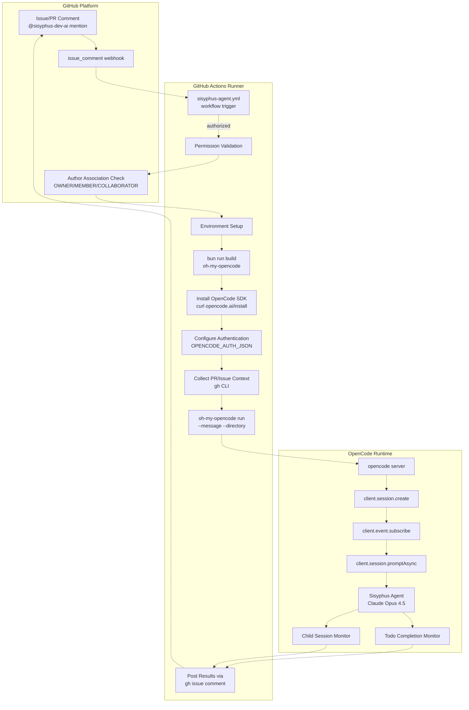
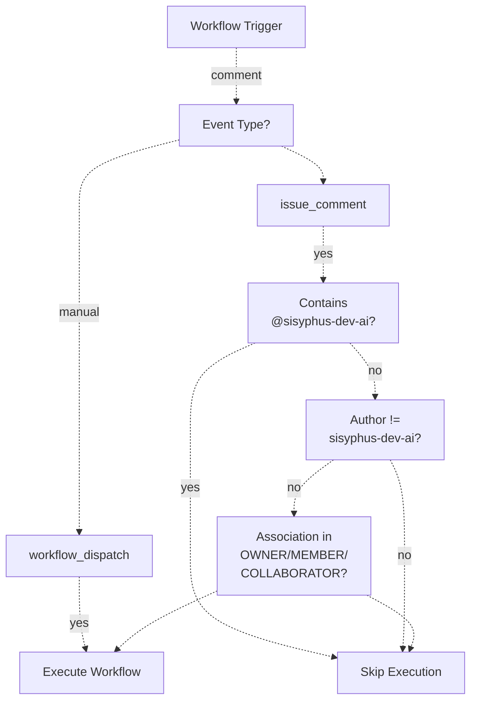
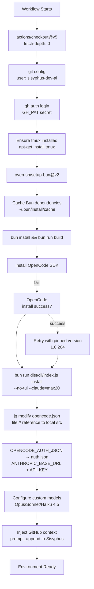
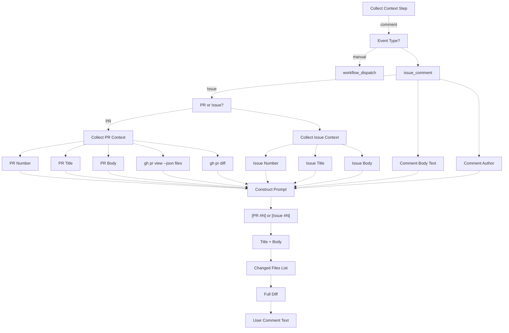
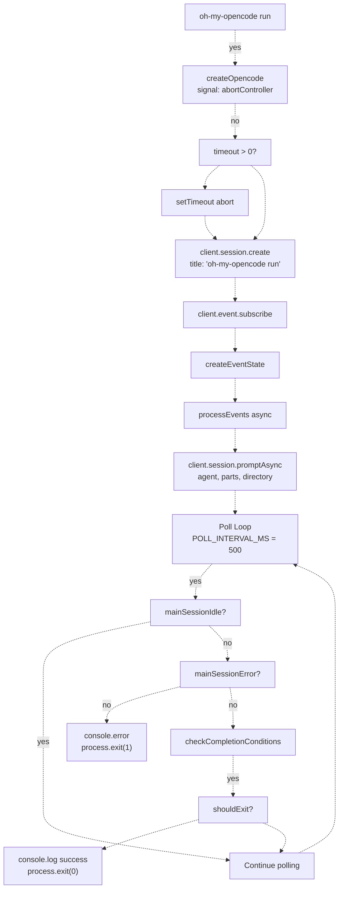
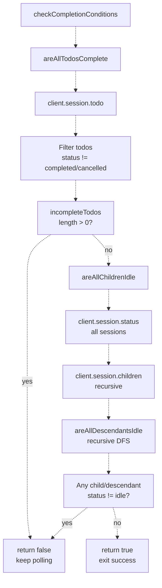
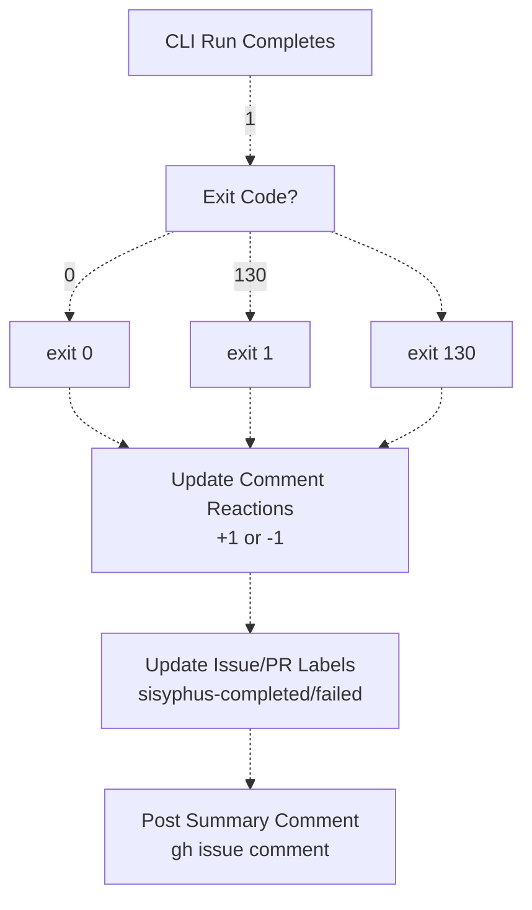

# GitHub Actions Integration

> **Relevant source files**
> * [.github/workflows/sisyphus-agent.yml](https://github.com/code-yeongyu/oh-my-opencode/blob/b92cd6ab/.github/workflows/sisyphus-agent.yml)
> * [README.ja.md](https://github.com/code-yeongyu/oh-my-opencode/blob/b92cd6ab/README.ja.md)
> * [README.ko.md](https://github.com/code-yeongyu/oh-my-opencode/blob/b92cd6ab/README.ko.md)
> * [README.md](https://github.com/code-yeongyu/oh-my-opencode/blob/b92cd6ab/README.md)
> * [README.zh-cn.md](https://github.com/code-yeongyu/oh-my-opencode/blob/b92cd6ab/README.zh-cn.md)
> * [src/cli/run/completion.test.ts](https://github.com/code-yeongyu/oh-my-opencode/blob/b92cd6ab/src/cli/run/completion.test.ts)
> * [src/cli/run/completion.ts](https://github.com/code-yeongyu/oh-my-opencode/blob/b92cd6ab/src/cli/run/completion.ts)
> * [src/cli/run/events.test.ts](https://github.com/code-yeongyu/oh-my-opencode/blob/b92cd6ab/src/cli/run/events.test.ts)
> * [src/cli/run/events.ts](https://github.com/code-yeongyu/oh-my-opencode/blob/b92cd6ab/src/cli/run/events.ts)
> * [src/cli/run/index.ts](https://github.com/code-yeongyu/oh-my-opencode/blob/b92cd6ab/src/cli/run/index.ts)
> * [src/cli/run/runner.ts](https://github.com/code-yeongyu/oh-my-opencode/blob/b92cd6ab/src/cli/run/runner.ts)
> * [src/cli/run/types.ts](https://github.com/code-yeongyu/oh-my-opencode/blob/b92cd6ab/src/cli/run/types.ts)
> * [src/shared/config-path.ts](https://github.com/code-yeongyu/oh-my-opencode/blob/b92cd6ab/src/shared/config-path.ts)

The GitHub Actions integration enables automated repository work through the Sisyphus Agent workflow. This system allows maintainers to trigger AI-driven development tasks by mentioning `@sisyphus-dev-ai` in issue or pull request comments, which spawns a fully-configured oh-my-opencode session to execute the requested work.

For details on the workflow configuration and execution phases, see [Sisyphus Agent Workflow](/code-yeongyu/oh-my-opencode/10.1-sisyphus-agent-workflow). For the CLI command that drives agent execution, see [CLI Run Command](/code-yeongyu/oh-my-opencode/10.2-cli-run-command).

## System Architecture



**Sources:** [.github/workflows/sisyphus-agent.yml L1-L252](https://github.com/code-yeongyu/oh-my-opencode/blob/b92cd6ab/.github/workflows/sisyphus-agent.yml#L1-L252)

 [src/cli/run/runner.ts L1-L122](https://github.com/code-yeongyu/oh-my-opencode/blob/b92cd6ab/src/cli/run/runner.ts#L1-L122)

## Workflow Trigger Mechanism

The workflow activates on two event types:

| Event Type | Trigger Condition | Use Case |
| --- | --- | --- |
| `issue_comment` | Comment contains `@sisyphus-dev-ai` | Standard user interaction on issues/PRs |
| `workflow_dispatch` | Manual trigger with custom prompt | Testing or direct execution |

**Authorization Requirements:**

* Comment author must have `OWNER`, `MEMBER`, or `COLLABORATOR` association
* Self-mentions by `sisyphus-dev-ai` are excluded to prevent loops
* Fork PR comments receive secrets access (issue_comment event characteristic)



**Sources:** [.github/workflows/sisyphus-agent.yml L3-L22](https://github.com/code-yeongyu/oh-my-opencode/blob/b92cd6ab/.github/workflows/sisyphus-agent.yml#L3-L22)

## Environment Setup Flow



**Sources:** [.github/workflows/sisyphus-agent.yml L29-L229](https://github.com/code-yeongyu/oh-my-opencode/blob/b92cd6ab/.github/workflows/sisyphus-agent.yml#L29-L229)

## Context Collection and Prompt Construction

The workflow collects comprehensive context before executing the agent:



**Sources:** [.github/workflows/sisyphus-agent.yml L231-L281](https://github.com/code-yeongyu/oh-my-opencode/blob/b92cd6ab/.github/workflows/sisyphus-agent.yml#L231-L281)

## CLI Run Command Execution

The `oh-my-opencode run` command drives agent execution:

| Component | Implementation | Purpose |
| --- | --- | --- |
| `run()` | [src/cli/run/runner.ts L10-L121](https://github.com/code-yeongyu/oh-my-opencode/blob/b92cd6ab/src/cli/run/runner.ts#L10-L121) | Main orchestration loop |
| `createEventState()` | [src/cli/run/events.ts L23-L32](https://github.com/code-yeongyu/oh-my-opencode/blob/b92cd6ab/src/cli/run/events.ts#L23-L32) | Initialize event tracking state |
| `processEvents()` | [src/cli/run/events.ts L34-L62](https://github.com/code-yeongyu/oh-my-opencode/blob/b92cd6ab/src/cli/run/events.ts#L34-L62) | Stream event processing |
| `checkCompletionConditions()` | [src/cli/run/completion.ts L4-L19](https://github.com/code-yeongyu/oh-my-opencode/blob/b92cd6ab/src/cli/run/completion.ts#L4-L19) | Determine when to exit |

**Execution Flow:**



**Sources:** [src/cli/run/runner.ts L10-L121](https://github.com/code-yeongyu/oh-my-opencode/blob/b92cd6ab/src/cli/run/runner.ts#L10-L121)

 [src/cli/run/events.ts L23-L62](https://github.com/code-yeongyu/oh-my-opencode/blob/b92cd6ab/src/cli/run/events.ts#L23-L62)

 [src/cli/run/completion.ts L4-L19](https://github.com/code-yeongyu/oh-my-opencode/blob/b92cd6ab/src/cli/run/completion.ts#L4-L19)

## Completion Detection Logic

The CLI monitors two conditions to determine when the session has finished:



**Key Implementation Details:**

* **Todo Completion:** [src/cli/run/completion.ts L21-L35](https://github.com/code-yeongyu/oh-my-opencode/blob/b92cd6ab/src/cli/run/completion.ts#L21-L35)  filters todos with `status !== "completed" && status !== "cancelled"`
* **Child Session Monitoring:** [src/cli/run/completion.ts L37-L79](https://github.com/code-yeongyu/oh-my-opencode/blob/b92cd6ab/src/cli/run/completion.ts#L37-L79)  recursively checks all descendants, not just direct children
* **Status Fetching:** Single bulk fetch via `client.session.status()` avoids N+1 queries

**Sources:** [src/cli/run/completion.ts L4-L79](https://github.com/code-yeongyu/oh-my-opencode/blob/b92cd6ab/src/cli/run/completion.ts#L4-L79)

## Event Stream Processing

The event processor tracks session lifecycle events:

| Event Type | Handler | State Update |
| --- | --- | --- |
| `session.idle` | [src/cli/run/events.ts L133-L144](https://github.com/code-yeongyu/oh-my-opencode/blob/b92cd6ab/src/cli/run/events.ts#L133-L144) | Sets `mainSessionIdle = true` |
| `session.status` | [src/cli/run/events.ts L146-L157](https://github.com/code-yeongyu/oh-my-opencode/blob/b92cd6ab/src/cli/run/events.ts#L146-L157) | Resets `mainSessionIdle = false` when busy |
| `session.error` | [src/cli/run/events.ts L159-L174](https://github.com/code-yeongyu/oh-my-opencode/blob/b92cd6ab/src/cli/run/events.ts#L159-L174) | Sets `mainSessionError = true`, captures error text |
| `message.part.updated` | [src/cli/run/events.ts L176-L197](https://github.com/code-yeongyu/oh-my-opencode/blob/b92cd6ab/src/cli/run/events.ts#L176-L197) | Streams text parts to stdout |
| `message.updated` | [src/cli/run/events.ts L199-L220](https://github.com/code-yeongyu/oh-my-opencode/blob/b92cd6ab/src/cli/run/events.ts#L199-L220) | Fallback text output |
| `tool.execute` | [src/cli/run/events.ts L222-L250](https://github.com/code-yeongyu/oh-my-opencode/blob/b92cd6ab/src/cli/run/events.ts#L222-L250) | Displays tool invocations |
| `tool.result` | [src/cli/run/events.ts L252-L257](https://github.com/code-yeongyu/oh-my-opencode/blob/b92cd6ab/src/cli/run/events.ts#L252-L257) | Displays tool outputs |

**State Structure:**

```yaml
interface EventState {
  mainSessionIdle: boolean        // True when session goes idle
  mainSessionError: boolean       // True when session errors
  lastError: string | null        // Error message text
  lastOutput: string              // Last message.updated content
  lastPartText: string            // Last message.part text
  currentTool: string | null      // Currently executing tool
}
```

**Sources:** [src/cli/run/events.ts L14-L32](https://github.com/code-yeongyu/oh-my-opencode/blob/b92cd6ab/src/cli/run/events.ts#L14-L32)

 [src/cli/run/types.ts L1-L77](https://github.com/code-yeongyu/oh-my-opencode/blob/b92cd6ab/src/cli/run/types.ts#L1-L77)

## Authentication Configuration

The workflow injects custom authentication and model configurations:

**Auth Injection:**

* `OPENCODE_AUTH_JSON` secret → `~/.local/share/opencode/auth.json`
* `ANTHROPIC_BASE_URL` and `ANTHROPIC_API_KEY` → `opencode.json` provider config
* `GH_PAT` secret → Git operations and gh CLI authentication

**Custom Model Configuration:**

```json
{
  "provider": {
    "anthropic": {
      "baseURL": "$ANTHROPIC_BASE_URL",
      "apiKey": "$ANTHROPIC_API_KEY",
      "models": {
        "claude-opus-4-5-high": {
          "id": "claude-opus-4-5-20251101",
          "limit": { "context": 190000, "output": 128000 },
          "options": {
            "effort": "high",
            "thinking": { "type": "enabled", "budgetTokens": 64000 }
          }
        },
        "claude-sonnet-4-5-high": {
          "id": "claude-sonnet-4-5-20250929",
          "limit": { "context": 200000, "output": 128000 },
          "options": {
            "thinking": { "type": "enabled", "budgetTokens": 64000 }
          }
        }
      }
    }
  }
}
```

**Sources:** [.github/workflows/sisyphus-agent.yml L80-L156](https://github.com/code-yeongyu/oh-my-opencode/blob/b92cd6ab/.github/workflows/sisyphus-agent.yml#L80-L156)

## GitHub-Specific Prompt Context

A special `prompt_append` is injected into the Sisyphus agent configuration to provide GitHub Actions context:

**Key Directives:**

* **Output Routing:** All output must be posted via `gh issue comment` or `gh pr comment` (console invisible to user)
* **Comment Formatting:** Heredoc syntax required for code blocks and backticks
* **Markdown Rules:** Code blocks must have exactly 3 backticks + language identifier
* **Git Operations:** Never push to main/master, always create PRs
* **Identity:** Commits as `sisyphus-dev-ai` with email `sisyphus-dev-ai@users.noreply.github.com`

**Heredoc Example:**

```
gh issue comment 123 --body "$(cat <<'EOF'
Code with `backticks` and multiple lines.
Works perfectly.
EOF
)"
```

**Sources:** [.github/workflows/sisyphus-agent.yml L157-L222](https://github.com/code-yeongyu/oh-my-opencode/blob/b92cd6ab/.github/workflows/sisyphus-agent.yml#L157-L222)

## Post-Execution Workflow

After the CLI run completes, the workflow performs cleanup and reporting:



**Sources:** [.github/workflows/sisyphus-agent.yml L283-L344](https://github.com/code-yeongyu/oh-my-opencode/blob/b92cd6ab/.github/workflows/sisyphus-agent.yml#L283-L344)

## Local Plugin Reference

The workflow uses a local file reference for the plugin to test changes before publication:

```sql
jq --arg path "file://$REPO_PATH/src/index.ts" '
  .plugin = [.plugin[] | select(. != "oh-my-opencode")] + [$path]
' "$OPENCODE_JSON" > /tmp/oc.json && mv /tmp/oc.json "$OPENCODE_JSON"
```

This allows the workflow to:

1. Build oh-my-opencode from the current branch
2. Override the NPM package with the local `src/index.ts` entry point
3. Test plugin changes in-flight without publishing to NPM

**Sources:** [.github/workflows/sisyphus-agent.yml L106-L113](https://github.com/code-yeongyu/oh-my-opencode/blob/b92cd6ab/.github/workflows/sisyphus-agent.yml#L106-L113)

## Permissions and Security

**Minimal Token Permissions:**

* Default `GITHUB_TOKEN` has only `contents: read`
* All write operations use `GH_PAT` (sisyphus-dev-ai's Personal Access Token)
* PAT required for: checkout, git operations, gh CLI, posting comments

**Authorization Flow:**

1. Workflow validates author association before execution
2. Only `OWNER`, `MEMBER`, `COLLABORATOR` can trigger
3. Fork PR comments receive secrets (issue_comment event design)
4. Self-mentions blocked to prevent infinite loops

**Sources:** [.github/workflows/sisyphus-agent.yml L18-L33](https://github.com/code-yeongyu/oh-my-opencode/blob/b92cd6ab/.github/workflows/sisyphus-agent.yml#L18-L33)