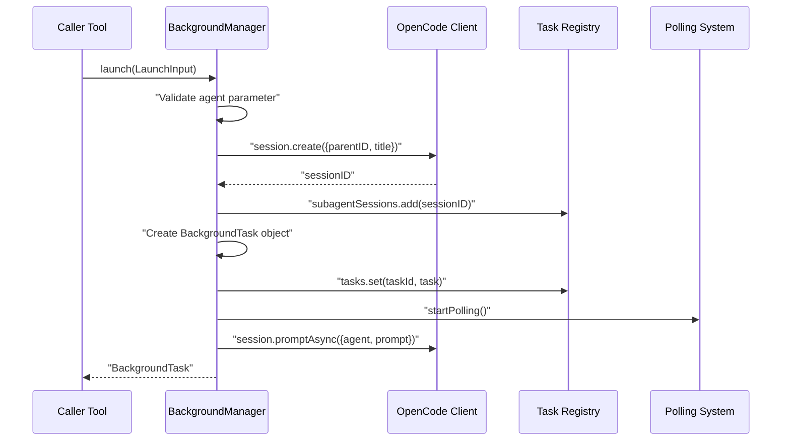
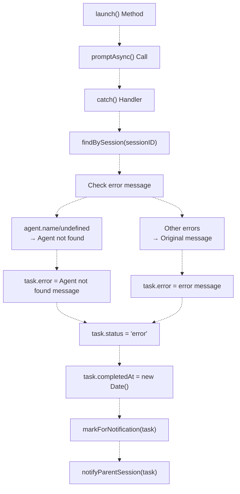
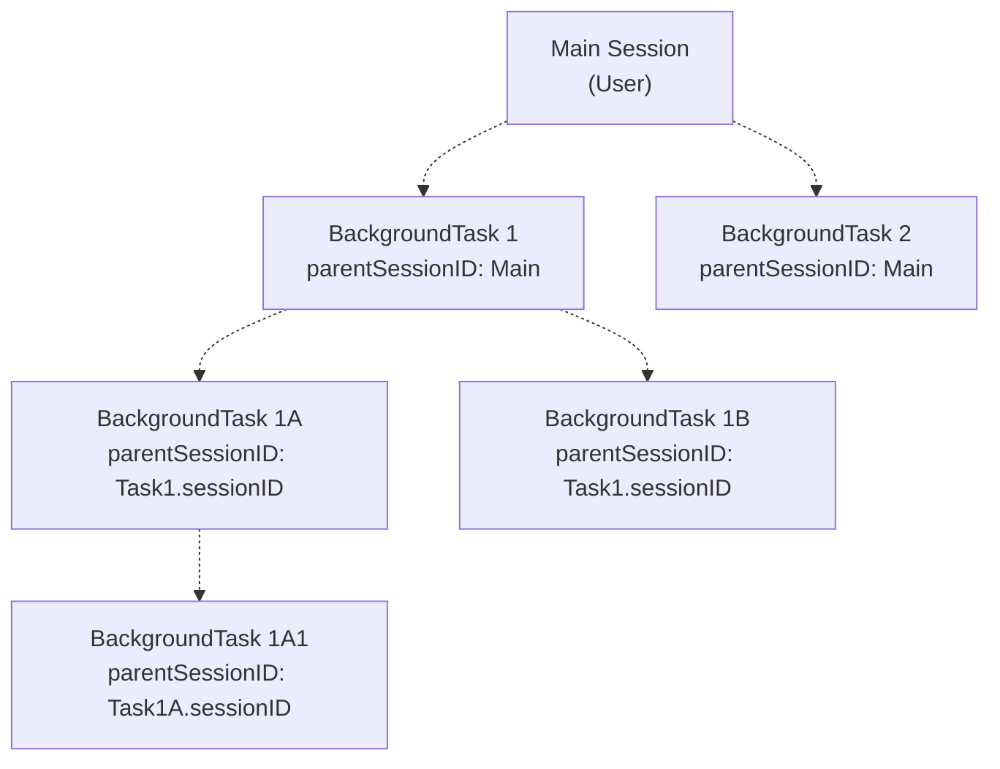
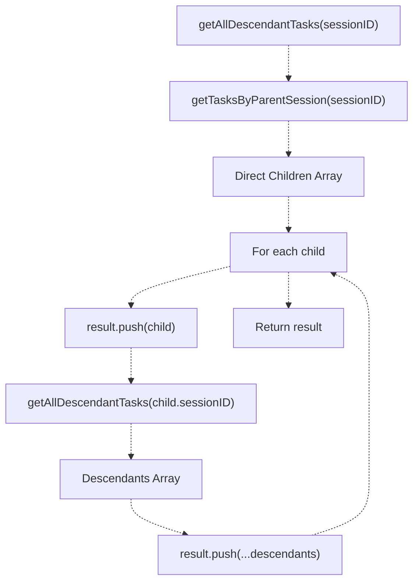
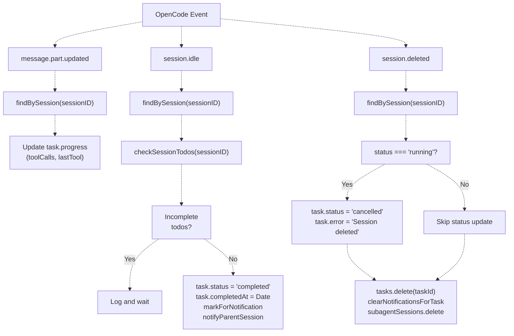
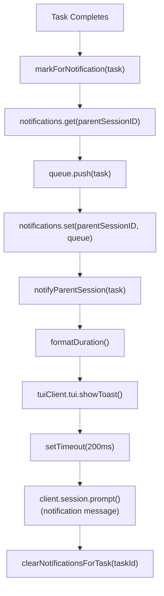
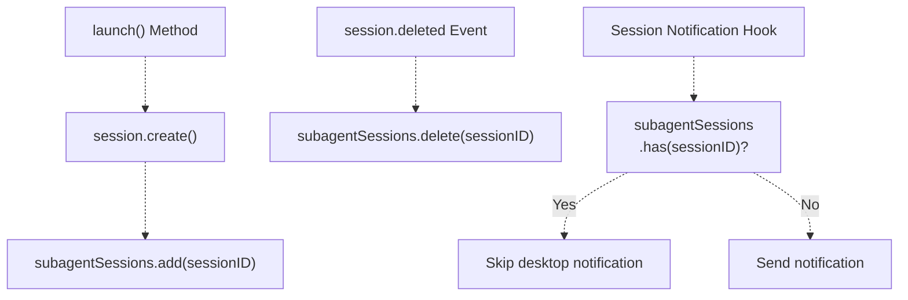

# Background Manager

> **Relevant source files**
> * [.opencode/background-tasks.json](https://github.com/code-yeongyu/oh-my-opencode/blob/b92cd6ab/.opencode/background-tasks.json)
> * [src/features/background-agent/index.ts](https://github.com/code-yeongyu/oh-my-opencode/blob/b92cd6ab/src/features/background-agent/index.ts)
> * [src/features/background-agent/manager.test.ts](https://github.com/code-yeongyu/oh-my-opencode/blob/b92cd6ab/src/features/background-agent/manager.test.ts)
> * [src/features/background-agent/manager.ts](https://github.com/code-yeongyu/oh-my-opencode/blob/b92cd6ab/src/features/background-agent/manager.ts)
> * [src/features/background-agent/types.ts](https://github.com/code-yeongyu/oh-my-opencode/blob/b92cd6ab/src/features/background-agent/types.ts)
> * [src/tools/background-task/tools.ts](https://github.com/code-yeongyu/oh-my-opencode/blob/b92cd6ab/src/tools/background-task/tools.ts)
> * [src/tools/call-omo-agent/tools.ts](https://github.com/code-yeongyu/oh-my-opencode/blob/b92cd6ab/src/tools/call-omo-agent/tools.ts)

The Background Manager is the core orchestrator for asynchronous task execution in oh-my-opencode. It manages the lifecycle of background agent sessions, maintains a registry of running and completed tasks, tracks hierarchical task relationships, and coordinates notifications when tasks complete. This system enables parallel agent execution by delegating work to specialized agents that run independently while the main session continues.

For information about the polling mechanism and task completion detection, see [Task Execution and Polling](/code-yeongyu/oh-my-opencode/6.2-task-execution-and-polling). For details about parent session notifications and desktop alerts, see [Notification System](/code-yeongyu/oh-my-opencode/6.3-notification-system).

**Sources:** [src/features/background-agent/manager.ts L55-L442](https://github.com/code-yeongyu/oh-my-opencode/blob/b92cd6ab/src/features/background-agent/manager.ts#L55-L442)

## Class Structure and Responsibilities

The `BackgroundManager` class is the central component of the background execution system, responsible for creating, tracking, and managing the lifecycle of background tasks.

### Core Data Structures

The manager maintains two primary data structures:

| Data Structure | Type | Purpose |
| --- | --- | --- |
| `tasks` | `Map<string, BackgroundTask>` | Registry of all background tasks indexed by task ID |
| `notifications` | `Map<string, BackgroundTask[]>` | Queue of completed tasks awaiting notification, indexed by parent session ID |
| `client` | `OpencodeClient` | OpenCode API client for session and message operations |
| `directory` | `string` | Working directory for the plugin context |
| `pollingInterval` | `Timer` | Interval timer for polling running task status |

**Sources:** [src/features/background-agent/manager.ts L55-L67](https://github.com/code-yeongyu/oh-my-opencode/blob/b92cd6ab/src/features/background-agent/manager.ts#L55-L67)

### BackgroundTask Interface

```mermaid
flowchart TD

BackgroundTask["BackgroundTask"]
id["id: string<br>(bg_[uuid])"]
sessionID["sessionID: string<br>(OpenCode session)"]
parentSessionID["parentSessionID: string<br>(caller session)"]
parentMessageID["parentMessageID: string<br>(trigger message)"]
description["description: string<br>(short label)"]
prompt["prompt: string<br>(full task)"]
agent["agent: string<br>(agent type)"]
status["status: TaskStatus<br>(running/completed/error/cancelled)"]
startedAt["startedAt: Date"]
completedAt["completedAt?: Date"]
progress["progress?: ProgressInfo<br>(toolCalls, lastTool, lastMessage)"]
error["error?: string"]

BackgroundTask -.-> id
BackgroundTask -.-> sessionID
BackgroundTask -.-> parentSessionID
BackgroundTask -.-> parentMessageID
BackgroundTask -.-> description
BackgroundTask -.-> prompt
BackgroundTask -.-> agent
BackgroundTask -.-> status
BackgroundTask -.-> startedAt
BackgroundTask -.-> completedAt
BackgroundTask -.-> progress
BackgroundTask -.-> error
```



**Diagram: BackgroundTask Data Structure**

**Sources:** [src/features/background-agent/types.ts](https://github.com/code-yeongyu/oh-my-opencode/blob/b92cd6ab/src/features/background-agent/types.ts)

 [src/features/background-agent/manager.ts L88-L102](https://github.com/code-yeongyu/oh-my-opencode/blob/b92cd6ab/src/features/background-agent/manager.ts#L88-L102)

## Task Lifecycle Management

### Task Creation and Launch

The `launch` method creates a new background task by spawning an OpenCode session and registering it in the task registry.



**Diagram: Task Launch Sequence**

**Sources:** [src/features/background-agent/manager.ts L69-L137](https://github.com/code-yeongyu/oh-my-opencode/blob/b92cd6ab/src/features/background-agent/manager.ts#L69-L137)

### Task Status Transitions

Tasks progress through the following states:

| Status | Description | Transitions To |
| --- | --- | --- |
| `running` | Task is actively executing | `completed`, `error`, `cancelled` |
| `completed` | Task finished successfully | (terminal) |
| `error` | Task encountered an error | (terminal) |
| `cancelled` | Task was explicitly cancelled or session deleted | (terminal) |

Tasks transition to `completed` when:

1. The session becomes idle (`session.idle` event)
2. No incomplete todos remain (`checkSessionTodos` returns false)
3. Polling detects idle status with no todos

Tasks transition to `error` when:

1. `promptAsync` throws an exception during launch
2. Agent name is invalid or undefined

Tasks transition to `cancelled` when:

1. Explicit cancellation via `background_cancel` tool
2. Session is deleted (`session.deleted` event)

**Sources:** [src/features/background-agent/manager.ts L217-L236](https://github.com/code-yeongyu/oh-my-opencode/blob/b92cd6ab/src/features/background-agent/manager.ts#L217-L236)

 [src/features/background-agent/manager.ts L238-L256](https://github.com/code-yeongyu/oh-my-opencode/blob/b92cd6ab/src/features/background-agent/manager.ts#L238-L256)

### Error Handling

The manager implements error handling at two levels:



**Diagram: Error Handling Flow**

**Sources:** [src/features/background-agent/manager.ts L119-L134](https://github.com/code-yeongyu/oh-my-opencode/blob/b92cd6ab/src/features/background-agent/manager.ts#L119-L134)

## Hierarchical Task Tracking

The Background Manager supports hierarchical task relationships where background tasks can spawn their own sub-tasks.

### Task Hierarchy



**Diagram: Hierarchical Task Structure**

### Retrieval Methods

The manager provides three methods for querying the task hierarchy:

| Method | Returns | Use Case |
| --- | --- | --- |
| `getTask(id)` | Single task by ID | Retrieve specific task |
| `getTasksByParentSession(sessionID)` | Direct children only | Get immediate sub-tasks |
| `getAllDescendantTasks(sessionID)` | All descendants (recursive) | Cancel all related tasks |

**Sources:** [src/features/background-agent/manager.ts L139-L173](https://github.com/code-yeongyu/oh-my-opencode/blob/b92cd6ab/src/features/background-agent/manager.ts#L139-L173)

### Recursive Descendant Collection

The `getAllDescendantTasks` method implements depth-first traversal:



**Diagram: Recursive Task Collection**

This enables operations like "cancel all tasks spawned by this session" by collecting the entire subtree.

**Sources:** [src/features/background-agent/manager.ts L153-L164](https://github.com/code-yeongyu/oh-my-opencode/blob/b92cd6ab/src/features/background-agent/manager.ts#L153-L164)

 [src/features/background-agent/manager.test.ts L51-L232](https://github.com/code-yeongyu/oh-my-opencode/blob/b92cd6ab/src/features/background-agent/manager.test.ts#L51-L232)

## Event-Driven State Management

The Background Manager responds to OpenCode lifecycle events to update task state and trigger notifications.

### Event Handling



**Diagram: Event Handling Logic**

**Sources:** [src/features/background-agent/manager.ts L192-L256](https://github.com/code-yeongyu/oh-my-opencode/blob/b92cd6ab/src/features/background-agent/manager.ts#L192-L256)

### Session Todo Integration

The manager coordinates with the todo continuation system to prevent premature completion:

```javascript
// From manager.ts:175-190
private async checkSessionTodos(sessionID: string): Promise<boolean> {
  const response = await this.client.session.todo({path: {id: sessionID}})
  const todos = (response.data ?? response) as Todo[]
  if (!todos || todos.length === 0) return false
  
  const incomplete = todos.filter(
    (t) => t.status !== "completed" && t.status !== "cancelled"
  )
  return incomplete.length > 0
}
```

This ensures tasks marked idle but with incomplete todos remain running until the todo continuation system processes them.

**Sources:** [src/features/background-agent/manager.ts L175-L190](https://github.com/code-yeongyu/oh-my-opencode/blob/b92cd6ab/src/features/background-agent/manager.ts#L175-L190)

 [src/features/background-agent/manager.ts L224-L228](https://github.com/code-yeongyu/oh-my-opencode/blob/b92cd6ab/src/features/background-agent/manager.ts#L224-L228)

## Notification Queue Management

The manager maintains a separate notification queue to decouple task completion from parent notification.

### Notification Flow



**Diagram: Notification Queue Flow**

**Sources:** [src/features/background-agent/manager.ts L258-L339](https://github.com/code-yeongyu/oh-my-opencode/blob/b92cd6ab/src/features/background-agent/manager.ts#L258-L339)

### Notification Queue Operations

| Method | Purpose | Side Effects |
| --- | --- | --- |
| `markForNotification(task)` | Add task to parent's notification queue | Creates queue if needed |
| `getPendingNotifications(sessionID)` | Retrieve pending notifications for session | Read-only |
| `clearNotifications(sessionID)` | Clear all notifications for session | Removes queue entry |
| `clearNotificationsForTask(taskId)` | Remove specific task from all queues | Scans all queues |

**Sources:** [src/features/background-agent/manager.ts L258-L281](https://github.com/code-yeongyu/oh-my-opencode/blob/b92cd6ab/src/features/background-agent/manager.ts#L258-L281)

## Subagent Session Tracking

The manager integrates with the global `subagentSessions` set to distinguish background sessions from user sessions.



**Diagram: Subagent Session Lifecycle**

This prevents desktop notifications from being sent when background agent sessions complete, as they already have their own notification mechanism through `notifyParentSession`.

**Sources:** [src/features/background-agent/manager.ts L86](https://github.com/code-yeongyu/oh-my-opencode/blob/b92cd6ab/src/features/background-agent/manager.ts#L86-L86)

 [src/features/background-agent/manager.ts L254](https://github.com/code-yeongyu/oh-my-opencode/blob/b92cd6ab/src/features/background-agent/manager.ts#L254-L254)

 [src/features/claude-code-session-state.ts](https://github.com/code-yeongyu/oh-my-opencode/blob/b92cd6ab/src/features/claude-code-session-state.ts)

 [src/hooks/session-notification.ts L244](https://github.com/code-yeongyu/oh-my-opencode/blob/b92cd6ab/src/hooks/session-notification.ts#L244-L244)

## Integration Points

### Tool Integration

The Background Manager is used by two main tool categories:

**Direct Background Execution:**

* `background_task` tool: Generic background task creation
* `call_omo_agent` tool (background mode): Specialized agent delegation

**Task Management:**

* `background_output` tool: Queries task status from registry
* `background_cancel` tool: Cancels tasks and updates registry

**Sources:** [src/tools/background-task/tools.ts L23-L63](https://github.com/code-yeongyu/oh-my-opencode/blob/b92cd6ab/src/tools/background-task/tools.ts#L23-L63)

 [src/tools/call-omo-agent/tools.ts L48-L78](https://github.com/code-yeongyu/oh-my-opencode/blob/b92cd6ab/src/tools/call-omo-agent/tools.ts#L48-L78)

### OpenCode Client API Usage

The manager uses the following OpenCode client APIs:

| API Method | Purpose | Used In |
| --- | --- | --- |
| `session.create` | Create background session | `launch()` |
| `session.promptAsync` | Send prompt without waiting | `launch()` |
| `session.status` | Get all session statuses | `pollRunningTasks()` |
| `session.messages` | Retrieve session messages | `pollRunningTasks()` |
| `session.todo` | Check incomplete todos | `checkSessionTodos()` |
| `session.prompt` | Send notification prompt | `notifyParentSession()` |
| `session.abort` | Cancel running session | (via background_cancel tool) |

**Sources:** [src/features/background-agent/manager.ts L74-L79](https://github.com/code-yeongyu/oh-my-opencode/blob/b92cd6ab/src/features/background-agent/manager.ts#L74-L79)

 [src/features/background-agent/manager.ts L109-L134](https://github.com/code-yeongyu/oh-my-opencode/blob/b92cd6ab/src/features/background-agent/manager.ts#L109-L134)

 [src/features/background-agent/manager.ts L177-L189](https://github.com/code-yeongyu/oh-my-opencode/blob/b92cd6ab/src/features/background-agent/manager.ts#L177-L189)

 [src/features/background-agent/manager.ts L325-L332](https://github.com/code-yeongyu/oh-my-opencode/blob/b92cd6ab/src/features/background-agent/manager.ts#L325-L332)

 [src/features/background-agent/manager.ts L362-L441](https://github.com/code-yeongyu/oh-my-opencode/blob/b92cd6ab/src/features/background-agent/manager.ts#L362-L441)

### Constructor and Initialization

```
// From manager.ts:62-67
constructor(ctx: PluginInput) {
  this.tasks = new Map()
  this.notifications = new Map()
  this.client = ctx.client
  this.directory = ctx.directory
}
```

The manager is instantiated once per plugin lifecycle and receives the OpenCode plugin context, which provides the client API and working directory.

**Sources:** [src/features/background-agent/manager.ts L62-L67](https://github.com/code-yeongyu/oh-my-opencode/blob/b92cd6ab/src/features/background-agent/manager.ts#L62-L67)