# Task Execution and Polling

> **Relevant source files**
> * [.opencode/background-tasks.json](https://github.com/code-yeongyu/oh-my-opencode/blob/b92cd6ab/.opencode/background-tasks.json)
> * [src/features/background-agent/index.ts](https://github.com/code-yeongyu/oh-my-opencode/blob/b92cd6ab/src/features/background-agent/index.ts)
> * [src/features/background-agent/manager.test.ts](https://github.com/code-yeongyu/oh-my-opencode/blob/b92cd6ab/src/features/background-agent/manager.test.ts)
> * [src/features/background-agent/manager.ts](https://github.com/code-yeongyu/oh-my-opencode/blob/b92cd6ab/src/features/background-agent/manager.ts)
> * [src/features/background-agent/types.ts](https://github.com/code-yeongyu/oh-my-opencode/blob/b92cd6ab/src/features/background-agent/types.ts)
> * [src/tools/background-task/tools.ts](https://github.com/code-yeongyu/oh-my-opencode/blob/b92cd6ab/src/tools/background-task/tools.ts)
> * [src/tools/call-omo-agent/tools.ts](https://github.com/code-yeongyu/oh-my-opencode/blob/b92cd6ab/src/tools/call-omo-agent/tools.ts)

This page documents how background tasks execute and are monitored in the oh-my-opencode system. It covers the task lifecycle, the dual monitoring strategy combining event-driven and polling-based approaches, and the completion detection mechanisms.

For information about task creation and lifecycle management, see [Background Manager](/code-yeongyu/oh-my-opencode/6.1-background-manager). For notification delivery to parent sessions, see [Notification System](/code-yeongyu/oh-my-opencode/6.3-notification-system). For the user-facing tools that interact with tasks, see [Background Task Tools](/code-yeongyu/oh-my-opencode/5.3-background-task-tools).

## Task Lifecycle Overview

Background tasks progress through a defined set of states during their execution. The lifecycle begins when a task is launched and ends when it reaches a terminal state.

### Task States

The system recognizes four possible task states:

| State | Description | Terminal | Triggers Notification |
| --- | --- | --- | --- |
| `running` | Task is actively executing | No | No |
| `completed` | Task finished successfully | Yes | Yes |
| `error` | Task encountered an error | Yes | Yes |
| `cancelled` | Task was cancelled by user or system | Yes | No |

**State Transition Diagram**


Sources: [src/features/background-agent/types.ts L1-L6](https://github.com/code-yeongyu/oh-my-opencode/blob/b92cd6ab/src/features/background-agent/types.ts#L1-L6)

 [src/features/background-agent/manager.ts L88-L103](https://github.com/code-yeongyu/oh-my-opencode/blob/b92cd6ab/src/features/background-agent/manager.ts#L88-L103)

### Initial Task State

When a task is launched via `BackgroundManager.launch()`, it is created with the `running` state. The task structure includes execution context and progress tracking:

```yaml
{
  id: "bg_${crypto.randomUUID().slice(0, 8)}",
  sessionID: string,          // Child session ID
  parentSessionID: string,    // Parent session ID
  parentMessageID: string,    // Originating message
  description: string,        // Short task description
  prompt: string,            // Full agent prompt
  agent: string,             // Agent type (explore/librarian/etc)
  status: "running",
  startedAt: Date,
  progress: {
    toolCalls: 0,
    lastUpdate: Date
  }
}
```

After creation, the system calls `client.session.promptAsync()` to start execution in a fire-and-forget manner, then immediately starts monitoring the task.

Sources: [src/features/background-agent/manager.ts L69-L138](https://github.com/code-yeongyu/oh-my-opencode/blob/b92cd6ab/src/features/background-agent/manager.ts#L69-L138)

## Dual Monitoring Strategy

The system employs two complementary monitoring mechanisms to track task execution: event-driven monitoring for immediate updates and polling-based monitoring for reliable state checking.

### Why Dual Monitoring?


Sources: [src/features/background-agent/manager.ts L193-L257](https://github.com/code-yeongyu/oh-my-opencode/blob/b92cd6ab/src/features/background-agent/manager.ts#L193-L257)

 [src/features/background-agent/manager.ts L284-L459](https://github.com/code-yeongyu/oh-my-opencode/blob/b92cd6ab/src/features/background-agent/manager.ts#L284-L459)

### Event-Based Monitoring

The `BackgroundManager.handleEvent()` method processes events from the OpenCode SDK's event stream. Three event types are monitored:

**1. message.part.updated Events**

Tracks tool execution progress in real-time:


This provides real-time feedback on task activity without requiring API calls.

Sources: [src/features/background-agent/manager.ts L196-L216](https://github.com/code-yeongyu/oh-my-opencode/blob/b92cd6ab/src/features/background-agent/manager.ts#L196-L216)

**2. session.idle Events**

Primary completion detection mechanism:


The todo check is critical: a session may become idle while still having incomplete todos, indicating the task is waiting for todo-continuation enforcement (see [Todo Continuation Enforcer](/code-yeongyu/oh-my-opencode/7.3-todo-continuation-enforcer)).

Sources: [src/features/background-agent/manager.ts L218-L237](https://github.com/code-yeongyu/oh-my-opencode/blob/b92cd6ab/src/features/background-agent/manager.ts#L218-L237)

**3. session.deleted Events**

Handles session deletion gracefully:

* Marks running tasks as `cancelled` with error "Session deleted"
* Removes task from internal tracking
* Clears any pending notifications
* Removes session from `subagentSessions` set

Sources: [src/features/background-agent/manager.ts L239-L257](https://github.com/code-yeongyu/oh-my-opencode/blob/b92cd6ab/src/features/background-agent/manager.ts#L239-L257)

### Polling-Based Monitoring

The `pollRunningTasks()` method runs every 2 seconds when tasks are active, providing a reliable fallback for completion detection.

**Polling Lifecycle**


The interval uses `unref()` to prevent keeping the process alive unnecessarily.

Sources: [src/features/background-agent/manager.ts L284-L298](https://github.com/code-yeongyu/oh-my-opencode/blob/b92cd6ab/src/features/background-agent/manager.ts#L284-L298)

**Polling Procedure**


The polling mechanism ensures completion is detected even if events are missed, and provides continuous progress updates by fetching the full message history.

Sources: [src/features/background-agent/manager.ts L380-L459](https://github.com/code-yeongyu/oh-my-opencode/blob/b92cd6ab/src/features/background-agent/manager.ts#L380-L459)

## Progress Tracking

The system maintains detailed progress information throughout task execution, enabling users to monitor long-running operations.

### Progress Structure

```sql
interface TaskProgress {
  toolCalls: number       // Total tool executions
  lastTool?: string      // Most recent tool name
  lastUpdate: Date       // Last progress update
  lastMessage?: string   // Last assistant message text
  lastMessageAt?: Date   // Timestamp of last message
}
```

### Progress Update Sources

| Source | Updates | Frequency | Method |
| --- | --- | --- | --- |
| `message.part.updated` events | `toolCalls`, `lastTool`, `lastUpdate` | Real-time | Event handler |
| `pollRunningTasks()` | All fields including `lastMessage` | Every 2s | Full message fetch |
| Initial creation | `toolCalls: 0`, `lastUpdate` | Once | Task launch |

**Progress Update Flow**


The event-based updates provide immediate feedback for tool calls, while polling enriches the progress with the actual message content.

Sources: [src/features/background-agent/manager.ts L196-L216](https://github.com/code-yeongyu/oh-my-opencode/blob/b92cd6ab/src/features/background-agent/manager.ts#L196-L216)

 [src/features/background-agent/manager.ts L410-L450](https://github.com/code-yeongyu/oh-my-opencode/blob/b92cd6ab/src/features/background-agent/manager.ts#L410-L450)

## Completion Detection

Completion detection combines multiple signals to determine when a task has finished executing. The system must distinguish between true completion and temporary idle states.

### Completion Criteria

A task is considered complete when all of the following conditions are met:

```mermaid
flowchart TD

SessionIdle["Session is idle<br>(no active execution)"]
NoTodos["No incomplete todos<br>(all completed/cancelled)"]
Running["Task status is 'running'<br>(not already completed)"]
Complete["✓ Task is complete"]

SessionIdle -.-> Complete
NoTodos -.-> Complete
Running -.-> Complete
```



### Todo Checking

The `checkSessionTodos()` method queries the session's todo list to determine if work remains:

```javascript
// Pseudo-code representation
async checkSessionTodos(sessionID: string): Promise<boolean> {
  const response = await client.session.todo({ path: { id: sessionID } })
  const todos = response.data ?? response
  
  if (!todos || todos.length === 0) return false
  
  const incomplete = todos.filter(
    t => t.status !== "completed" && t.status !== "cancelled"
  )
  
  return incomplete.length > 0
}
```

This check prevents premature completion when the session becomes idle while waiting for todo-continuation to inject a "continue working" prompt.

Sources: [src/features/background-agent/manager.ts L176-L191](https://github.com/code-yeongyu/oh-my-opencode/blob/b92cd6ab/src/features/background-agent/manager.ts#L176-L191)

### Completion Detection Points

The system has two points where completion can be detected:

**1. Event Handler (Immediate)**

When a `session.idle` event arrives, the event handler checks for completion:


Sources: [src/features/background-agent/manager.ts L218-L237](https://github.com/code-yeongyu/oh-my-opencode/blob/b92cd6ab/src/features/background-agent/manager.ts#L218-L237)

**2. Polling Loop (Reliable)**

The polling loop performs the same check every 2 seconds:


Sources: [src/features/background-agent/manager.ts L380-L407](https://github.com/code-yeongyu/oh-my-opencode/blob/b92cd6ab/src/features/background-agent/manager.ts#L380-L407)

## Error Handling

Errors during task execution are captured and stored in the task structure, allowing the parent session to diagnose failures.

### Error Sources

**1. promptAsync Failures**

Errors during the initial prompt submission are caught immediately:


This provides immediate feedback when an agent is not registered or misconfigured.

Sources: [src/features/background-agent/manager.ts L120-L135](https://github.com/code-yeongyu/oh-my-opencode/blob/b92cd6ab/src/features/background-agent/manager.ts#L120-L135)

**2. Session Deletion**

When a session is deleted, the task is marked as cancelled with a descriptive error:

```
if (task.status === "running") {
  task.status = "cancelled"
  task.completedAt = new Date()
  task.error = "Session deleted"
}
```

Sources: [src/features/background-agent/manager.ts L247-L251](https://github.com/code-yeongyu/oh-my-opencode/blob/b92cd6ab/src/features/background-agent/manager.ts#L247-L251)

### Error State Handling

Tasks in `error` or `cancelled` states are terminal and will not transition to other states:

| Current State | Can Transition To | Notification |
| --- | --- | --- |
| `error` | None | Yes (via notifyParentSession) |
| `cancelled` | None | No (notification cleared) |

The `background_output` tool returns status information for error/cancelled tasks without attempting to wait for completion.

Sources: [src/tools/background-task/tools.ts L258-L261](https://github.com/code-yeongyu/oh-my-opencode/blob/b92cd6ab/src/tools/background-task/tools.ts#L258-L261)

## Polling Control

The polling mechanism is designed to minimize resource usage when no tasks are active.

### Automatic Start/Stop


**Implementation Details**

| Method | Purpose | Trigger |
| --- | --- | --- |
| `startPolling()` | Creates interval timer if not exists | First task launch |
| `stopPolling()` | Clears interval timer | End of `pollRunningTasks()` when no tasks remain |
| `hasRunningTasks()` | Checks if any task has status `running` | Called by `pollRunningTasks()` |

The `pollingInterval` is created with `setInterval(..., 2000).unref()`, allowing the Node.js process to exit even if the interval is active.

Sources: [src/features/background-agent/manager.ts L284-L298](https://github.com/code-yeongyu/oh-my-opencode/blob/b92cd6ab/src/features/background-agent/manager.ts#L284-L298)

 [src/features/background-agent/manager.ts L373-L378](https://github.com/code-yeongyu/oh-my-opencode/blob/b92cd6ab/src/features/background-agent/manager.ts#L373-L378)

 [src/features/background-agent/manager.ts L456-L459](https://github.com/code-yeongyu/oh-my-opencode/blob/b92cd6ab/src/features/background-agent/manager.ts#L456-L459)

### Polling Performance

Each poll cycle performs:

1. One `client.session.status()` call to get all session statuses
2. For each running task with non-idle status: one `client.session.messages()` call to fetch progress

This means the API call overhead is proportional to the number of active tasks. Idle tasks (waiting for completion confirmation) do not incur additional API calls beyond the initial status check.

**Polling Decision Tree**


Sources: [src/features/background-agent/manager.ts L380-L459](https://github.com/code-yeongyu/oh-my-opencode/blob/b92cd6ab/src/features/background-agent/manager.ts#L380-L459)

## Integration with Other Systems

Task execution and polling interact with several other system components:

### Subagent Session Tracking

Background task sessions are registered in the `subagentSessions` Set to prevent certain hooks from interfering with background work:

```sql
// During launch
subagentSessions.add(sessionID)

// During session deletion
subagentSessions.delete(sessionID)
```

This allows hooks like todo-continuation to skip background sessions.

Sources: [src/features/background-agent/manager.ts L86](https://github.com/code-yeongyu/oh-my-opencode/blob/b92cd6ab/src/features/background-agent/manager.ts#L86-L86)

 [src/features/background-agent/manager.ts L255](https://github.com/code-yeongyu/oh-my-opencode/blob/b92cd6ab/src/features/background-agent/manager.ts#L255-L255)

### Message Storage Integration

The manager reads message storage to preserve parent context when notifying:

```javascript
function getMessageDir(sessionID: string): string | null {
  if (!existsSync(MESSAGE_STORAGE)) return null
  
  // Check direct path
  const directPath = join(MESSAGE_STORAGE, sessionID)
  if (existsSync(directPath)) return directPath
  
  // Check nested paths
  for (const dir of readdirSync(MESSAGE_STORAGE)) {
    const sessionPath = join(MESSAGE_STORAGE, dir, sessionID)
    if (existsSync(sessionPath)) return sessionPath
  }
  
  return null
}
```

This enables finding the parent session's model and agent configuration for notification delivery.

Sources: [src/features/background-agent/manager.ts L41-L53](https://github.com/code-yeongyu/oh-my-opencode/blob/b92cd6ab/src/features/background-agent/manager.ts#L41-L53)

 [src/features/background-agent/manager.ts L331-L338](https://github.com/code-yeongyu/oh-my-opencode/blob/b92cd6ab/src/features/background-agent/manager.ts#L331-L338)

### Coordination with Notification System

When a task completes, the manager coordinates notification delivery:


The 200ms delay allows the session to stabilize before injection. For more details on notification delivery, see [Notification System](/code-yeongyu/oh-my-opencode/6.3-notification-system).

Sources: [src/features/background-agent/manager.ts L259-L263](https://github.com/code-yeongyu/oh-my-opencode/blob/b92cd6ab/src/features/background-agent/manager.ts#L259-L263)

 [src/features/background-agent/manager.ts L306-L357](https://github.com/code-yeongyu/oh-my-opencode/blob/b92cd6ab/src/features/background-agent/manager.ts#L306-L357)