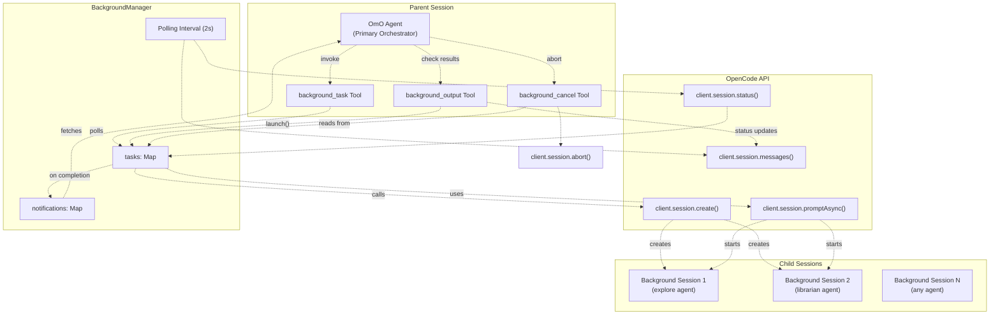
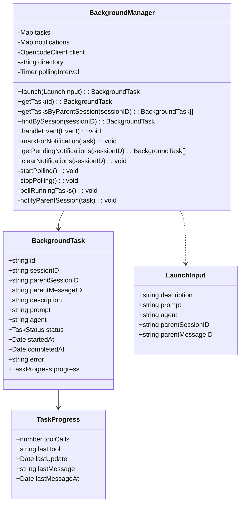
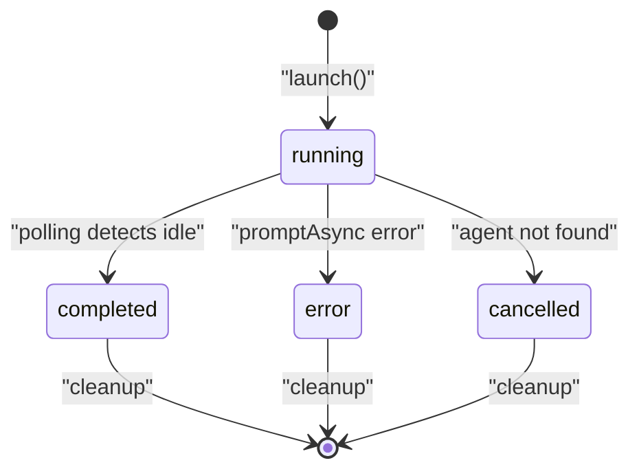
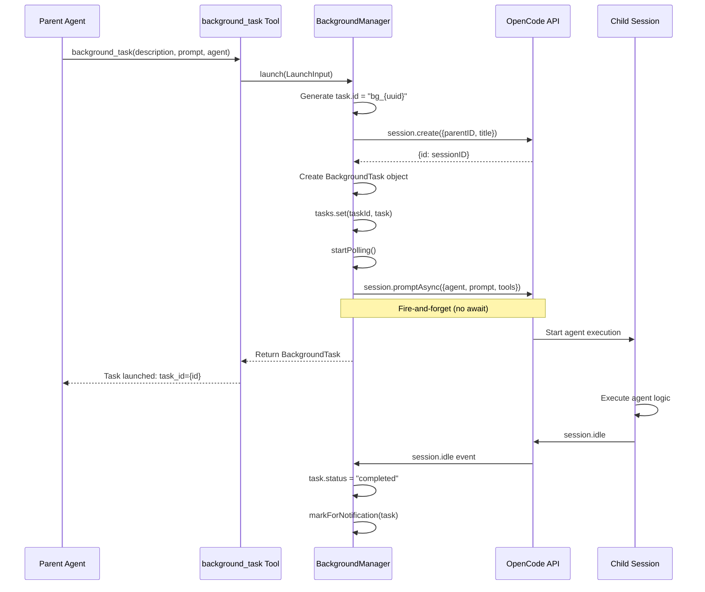
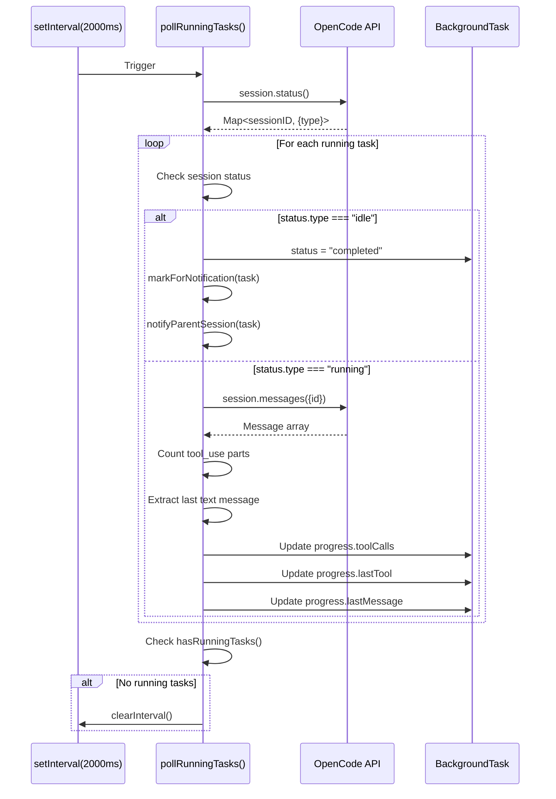
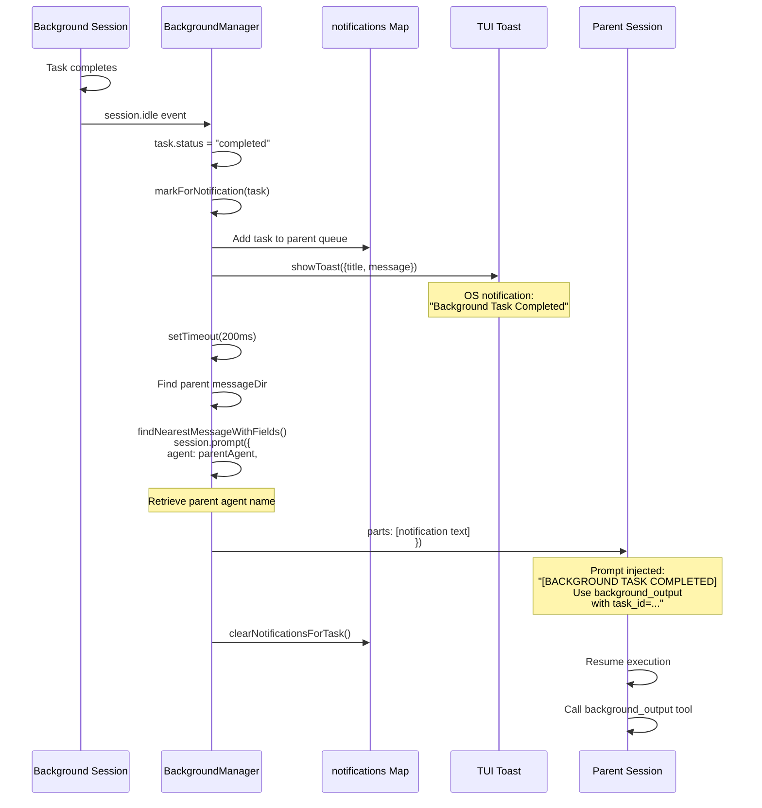
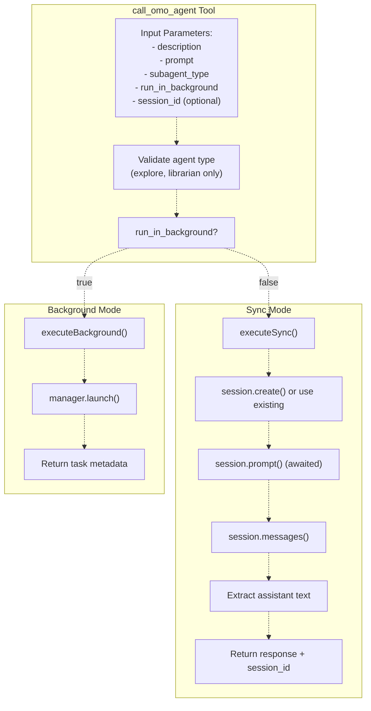

# Background Task System

> **Relevant source files**
> * [.opencode/background-tasks.json](https://github.com/code-yeongyu/oh-my-opencode/blob/b92cd6ab/.opencode/background-tasks.json)
> * [README.ja.md](https://github.com/code-yeongyu/oh-my-opencode/blob/b92cd6ab/README.ja.md)
> * [README.ko.md](https://github.com/code-yeongyu/oh-my-opencode/blob/b92cd6ab/README.ko.md)
> * [README.md](https://github.com/code-yeongyu/oh-my-opencode/blob/b92cd6ab/README.md)
> * [README.zh-cn.md](https://github.com/code-yeongyu/oh-my-opencode/blob/b92cd6ab/README.zh-cn.md)
> * [src/features/background-agent/index.ts](https://github.com/code-yeongyu/oh-my-opencode/blob/b92cd6ab/src/features/background-agent/index.ts)
> * [src/features/background-agent/manager.test.ts](https://github.com/code-yeongyu/oh-my-opencode/blob/b92cd6ab/src/features/background-agent/manager.test.ts)
> * [src/features/background-agent/manager.ts](https://github.com/code-yeongyu/oh-my-opencode/blob/b92cd6ab/src/features/background-agent/manager.ts)
> * [src/features/background-agent/types.ts](https://github.com/code-yeongyu/oh-my-opencode/blob/b92cd6ab/src/features/background-agent/types.ts)
> * [src/shared/config-path.ts](https://github.com/code-yeongyu/oh-my-opencode/blob/b92cd6ab/src/shared/config-path.ts)
> * [src/tools/background-task/tools.ts](https://github.com/code-yeongyu/oh-my-opencode/blob/b92cd6ab/src/tools/background-task/tools.ts)
> * [src/tools/call-omo-agent/tools.ts](https://github.com/code-yeongyu/oh-my-opencode/blob/b92cd6ab/src/tools/call-omo-agent/tools.ts)

## Purpose and Scope

The Background Task System enables parallel execution of specialized agents in oh-my-opencode. It allows the main orchestrator (OmO) to delegate work to subagents that run asynchronously, enabling true concurrent execution without blocking the primary session. This system handles task creation, lifecycle management, status tracking, and completion notifications.

For information about the agents that can be invoked as background tasks, see [Agent System](../agents/). For details on the specific tools that interact with this system, see [Background Tools](/code-yeongyu/oh-my-opencode/6.2-task-execution-and-polling). For the notification mechanism used to alert parent sessions, see [Notification System](/code-yeongyu/oh-my-opencode/6.3-notification-system).

## System Overview

The background task system consists of three main components:

1. **BackgroundManager**: Central coordinator that manages task lifecycle, state tracking, and notifications
2. **Background Tools**: Three tools (`background_task`, `background_output`, `background_cancel`) that provide the interface for agents to create and interact with background tasks
3. **Session Integration**: OpenCode session management that creates child sessions for each background task



**Sources:** [src/features/background-agent/manager.ts L1-L391](https://github.com/code-yeongyu/oh-my-opencode/blob/b92cd6ab/src/features/background-agent/manager.ts#L1-L391)

 [src/tools/background-task/tools.ts L1-L301](https://github.com/code-yeongyu/oh-my-opencode/blob/b92cd6ab/src/tools/background-task/tools.ts#L1-L301)

## BackgroundManager Class

The `BackgroundManager` class is the core coordinator for all background task operations. It maintains task state, tracks progress, and manages the notification system.

### Data Structures



**Task State Map**: The `tasks` map stores all active and completed background tasks indexed by task ID (format: `bg_{uuid}`). Each entry contains full task metadata including session IDs, agent type, status, and progress information.

**Notification Queue**: The `notifications` map stores tasks awaiting notification to their parent sessions, keyed by parent session ID. When a task completes, it's added to this queue and removed after the parent session is notified.

**Sources:** [src/features/background-agent/manager.ts L47-L59](https://github.com/code-yeongyu/oh-my-opencode/blob/b92cd6ab/src/features/background-agent/manager.ts#L47-L59)

 [src/features/background-agent/types.ts](https://github.com/code-yeongyu/oh-my-opencode/blob/b92cd6ab/src/features/background-agent/types.ts)

## Task Lifecycle

Background tasks progress through a well-defined lifecycle with five possible states:



### State Transitions

| Transition | Trigger | Implementation |
| --- | --- | --- |
| → `running` | `launch()` called | Creates child session, sends prompt via `promptAsync()` [src/features/background-agent/manager.ts L61-L129](https://github.com/code-yeongyu/oh-my-opencode/blob/b92cd6ab/src/features/background-agent/manager.ts#L61-L129) |
| `running` → `completed` | Session goes idle | Detected via `session.idle` event or polling [src/features/background-agent/manager.ts L179-L191](https://github.com/code-yeongyu/oh-my-opencode/blob/b92cd6ab/src/features/background-agent/manager.ts#L179-L191) <br>  [316-338](https://github.com/code-yeongyu/oh-my-opencode/blob/b92cd6ab/316-338) |
| `running` → `error` | Execution failure | `promptAsync()` catch block or agent not found [src/features/background-agent/manager.ts L111-L126](https://github.com/code-yeongyu/oh-my-opencode/blob/b92cd6ab/src/features/background-agent/manager.ts#L111-L126) |
| `running` → `cancelled` | Manual cancellation | `background_cancel` tool or `session.deleted` event [src/features/background-agent/manager.ts L193-L209](https://github.com/code-yeongyu/oh-my-opencode/blob/b92cd6ab/src/features/background-agent/manager.ts#L193-L209) <br>  [src/tools/background-task/tools.ts L262-L300](https://github.com/code-yeongyu/oh-my-opencode/blob/b92cd6ab/src/tools/background-task/tools.ts#L262-L300) |

**Sources:** [src/features/background-agent/manager.ts L61-L210](https://github.com/code-yeongyu/oh-my-opencode/blob/b92cd6ab/src/features/background-agent/manager.ts#L61-L210)

 [src/tools/background-task/tools.ts L262-L300](https://github.com/code-yeongyu/oh-my-opencode/blob/b92cd6ab/src/tools/background-task/tools.ts#L262-L300)

### Launch Process

The task launch sequence involves creating a child session and initiating agent execution:



**Key Implementation Details:**

1. **Task ID Generation**: Uses format `bg_{uuid.slice(0,8)}` for short, unique identifiers [src/features/background-agent/manager.ts L80](https://github.com/code-yeongyu/oh-my-opencode/blob/b92cd6ab/src/features/background-agent/manager.ts#L80-L80)
2. **Child Session Creation**: Sets `parentID` to link sessions hierarchically [src/features/background-agent/manager.ts L66-L77](https://github.com/code-yeongyu/oh-my-opencode/blob/b92cd6ab/src/features/background-agent/manager.ts#L66-L77)
3. **Tool Restrictions**: Background sessions disable `task`, `call_omo_agent`, and `background_task` tools to prevent recursion [src/features/background-agent/manager.ts L104-L108](https://github.com/code-yeongyu/oh-my-opencode/blob/b92cd6ab/src/features/background-agent/manager.ts#L104-L108)
4. **Asynchronous Execution**: Uses `promptAsync()` without awaiting, allowing immediate return [src/features/background-agent/manager.ts L100](https://github.com/code-yeongyu/oh-my-opencode/blob/b92cd6ab/src/features/background-agent/manager.ts#L100-L100)
5. **Error Handling**: Catches agent-not-found errors and sets descriptive error messages [src/features/background-agent/manager.ts L117-L119](https://github.com/code-yeongyu/oh-my-opencode/blob/b92cd6ab/src/features/background-agent/manager.ts#L117-L119)

**Sources:** [src/features/background-agent/manager.ts L61-L129](https://github.com/code-yeongyu/oh-my-opencode/blob/b92cd6ab/src/features/background-agent/manager.ts#L61-L129)

 [src/tools/background-task/tools.ts L23-L63](https://github.com/code-yeongyu/oh-my-opencode/blob/b92cd6ab/src/tools/background-task/tools.ts#L23-L63)

## Progress Tracking

The BackgroundManager tracks task progress through two mechanisms: event handling and periodic polling.

### Event-Based Tracking

The manager listens for three OpenCode events:

```mermaid
flowchart TD

E1["message.part.updated"]
E2["session.idle"]
E3["session.deleted"]
H1["Extract sessionID"]
H2["Find task by session"]
H3["Update task state"]
UpdateProgress["Increment progress.toolCalls<br>Record progress.lastTool"]
MarkCompleted["status = 'completed'<br>completedAt = now<br>markForNotification()"]
MarkCancelled["status = 'cancelled'<br>tasks.delete()<br>clearNotifications()"]

E1 -.->|"type=tool"| H1
E2 -.->|"marks completed"| H1
E3 -.->|"marks cancelled"| H1
H3 -.->|"message.part.updated"| UpdateProgress
H3 -.->|"session.deleted"| MarkCompleted
H3 -.-> MarkCancelled

subgraph BackgroundManager.handleEvent() ["BackgroundManager.handleEvent()"]
    H1
    H2
    H3
    H1 -.-> H2
    H2 -.->|"session.idle"| H3
end

subgraph subGraph0 ["OpenCode Events"]
    E1
    E2
    E3
end
```

**Tool Call Tracking**: Each `message.part.updated` event with `type=tool` increments the `progress.toolCalls` counter and records the tool name in `progress.lastTool` [src/features/background-agent/manager.ts L154-L177](https://github.com/code-yeongyu/oh-my-opencode/blob/b92cd6ab/src/features/background-agent/manager.ts#L154-L177)

**Completion Detection**: The `session.idle` event marks tasks as completed and triggers the notification system [src/features/background-agent/manager.ts L179-L191](https://github.com/code-yeongyu/oh-my-opencode/blob/b92cd6ab/src/features/background-agent/manager.ts#L179-L191)

**Cleanup**: The `session.deleted` event removes tasks from memory and clears pending notifications [src/features/background-agent/manager.ts L193-L209](https://github.com/code-yeongyu/oh-my-opencode/blob/b92cd6ab/src/features/background-agent/manager.ts#L193-L209)

**Sources:** [src/features/background-agent/manager.ts L154-L210](https://github.com/code-yeongyu/oh-my-opencode/blob/b92cd6ab/src/features/background-agent/manager.ts#L154-L210)

### Polling Mechanism

A 2-second interval polls running tasks to fetch detailed progress:



**Polling Start**: Starts automatically when first task is launched [src/features/background-agent/manager.ts L96](https://github.com/code-yeongyu/oh-my-opencode/blob/b92cd6ab/src/features/background-agent/manager.ts#L96-L96)

 [237-243](https://github.com/code-yeongyu/oh-my-opencode/blob/b92cd6ab/237-243)

**Polling Stop**: Stops automatically when no tasks remain in `running` state [src/features/background-agent/manager.ts L245-L250](https://github.com/code-yeongyu/oh-my-opencode/blob/b92cd6ab/src/features/background-agent/manager.ts#L245-L250)

 [386-388](https://github.com/code-yeongyu/oh-my-opencode/blob/b92cd6ab/386-388)

**Status Check**: Uses `session.status()` API to get all session states in a single call [src/features/background-agent/manager.ts L317-L318](https://github.com/code-yeongyu/oh-my-opencode/blob/b92cd6ab/src/features/background-agent/manager.ts#L317-L318)

**Message Analysis**: Parses message parts to count tool calls and extract assistant text [src/features/background-agent/manager.ts L344-L379](https://github.com/code-yeongyu/oh-my-opencode/blob/b92cd6ab/src/features/background-agent/manager.ts#L344-L379)

**Sources:** [src/features/background-agent/manager.ts L237-L389](https://github.com/code-yeongyu/oh-my-opencode/blob/b92cd6ab/src/features/background-agent/manager.ts#L237-L389)

## Notification System

When a background task completes, the parent session must be notified so the orchestrator can retrieve results and continue work.

### Notification Flow



**Notification Queue**: Tasks are queued by parent session ID before notification [src/features/background-agent/manager.ts L212-L216](https://github.com/code-yeongyu/oh-my-opencode/blob/b92cd6ab/src/features/background-agent/manager.ts#L212-L216)

**Dual Notification**: Both OS toast (via TUI) and prompt injection occur [src/features/background-agent/manager.ts L259-L268](https://github.com/code-yeongyu/oh-my-opencode/blob/b92cd6ab/src/features/background-agent/manager.ts#L259-L268)

 [274-293](https://github.com/code-yeongyu/oh-my-opencode/blob/b92cd6ab/274-293)

**Agent Preservation**: Retrieves parent session's agent to maintain context [src/features/background-agent/manager.ts L276-L278](https://github.com/code-yeongyu/oh-my-opencode/blob/b92cd6ab/src/features/background-agent/manager.ts#L276-L278)

**Delay Before Injection**: 200ms delay ensures session state is stable [src/features/background-agent/manager.ts L274](https://github.com/code-yeongyu/oh-my-opencode/blob/b92cd6ab/src/features/background-agent/manager.ts#L274-L274)

**Message Format**: Standardized notification includes task description, duration, and instructions for retrieving results [src/features/background-agent/manager.ts L270](https://github.com/code-yeongyu/oh-my-opencode/blob/b92cd6ab/src/features/background-agent/manager.ts#L270-L270)

**Sources:** [src/features/background-agent/manager.ts L212-L293](https://github.com/code-yeongyu/oh-my-opencode/blob/b92cd6ab/src/features/background-agent/manager.ts#L212-L293)

 [src/hooks/background-notification/hook.ts](https://github.com/code-yeongyu/oh-my-opencode/blob/b92cd6ab/src/hooks/background-notification/hook.ts)

## Background Tools

Three tools provide the interface for agents to create and interact with background tasks.

### background_task Tool

Creates and launches a new background task:

| Parameter | Type | Description |
| --- | --- | --- |
| `description` | string | Short task description (shown in status) |
| `prompt` | string | Full detailed prompt for the agent |
| `agent` | string | Agent type to use (any registered agent) |

**Return Value**: Task metadata including `task.id`, `task.sessionID`, and launch status.

**Implementation**: Validates agent parameter, calls `manager.launch()`, returns task information with usage instructions [src/tools/background-task/tools.ts L23-L63](https://github.com/code-yeongyu/oh-my-opencode/blob/b92cd6ab/src/tools/background-task/tools.ts#L23-L63)

**Tool Restrictions**: Cannot be called from within a background session (disabled in launch) [src/features/background-agent/manager.ts L104-L108](https://github.com/code-yeongyu/oh-my-opencode/blob/b92cd6ab/src/features/background-agent/manager.ts#L104-L108)

**Sources:** [src/tools/background-task/tools.ts L23-L63](https://github.com/code-yeongyu/oh-my-opencode/blob/b92cd6ab/src/tools/background-task/tools.ts#L23-L63)

### background_output Tool

Retrieves status or results from a background task:

| Parameter | Type | Default | Description |
| --- | --- | --- | --- |
| `task_id` | string | - | Task ID to get output from |
| `block` | boolean | `false` | Wait for completion (rarely needed) |
| `timeout` | number | `60000` | Max wait time in ms (max: 600000) |

**Non-Blocking Mode** (`block=false`): Returns immediate status with progress information [src/tools/background-task/tools.ts L225-L227](https://github.com/code-yeongyu/oh-my-opencode/blob/b92cd6ab/src/tools/background-task/tools.ts#L225-L227)

**Blocking Mode** (`block=true`): Polls task status until completion or timeout [src/tools/background-task/tools.ts L229-L254](https://github.com/code-yeongyu/oh-my-opencode/blob/b92cd6ab/src/tools/background-task/tools.ts#L229-L254)

**Status Format**: Returns markdown table with task metadata, duration, progress, and last tool used [src/tools/background-task/tools.ts L74-L125](https://github.com/code-yeongyu/oh-my-opencode/blob/b92cd6ab/src/tools/background-task/tools.ts#L74-L125)

**Result Format**: Returns task result with full assistant response text extracted from messages [src/tools/background-task/tools.ts L127-L194](https://github.com/code-yeongyu/oh-my-opencode/blob/b92cd6ab/src/tools/background-task/tools.ts#L127-L194)

**Sources:** [src/tools/background-task/tools.ts L196-L260](https://github.com/code-yeongyu/oh-my-opencode/blob/b92cd6ab/src/tools/background-task/tools.ts#L196-L260)

### background_cancel Tool

Cancels a running background task:

| Parameter | Type | Description |
| --- | --- | --- |
| `taskId` | string | Task ID to cancel |

**Validation**: Only tasks with `status="running"` can be cancelled [src/tools/background-task/tools.ts L275-L278](https://github.com/code-yeongyu/oh-my-opencode/blob/b92cd6ab/src/tools/background-task/tools.ts#L275-L278)

**Session Abort**: Calls `session.abort()` in fire-and-forget mode to avoid aborting parent session [src/tools/background-task/tools.ts L282-L284](https://github.com/code-yeongyu/oh-my-opencode/blob/b92cd6ab/src/tools/background-task/tools.ts#L282-L284)

**State Update**: Immediately updates task status to `"cancelled"` and sets `completedAt` [src/tools/background-task/tools.ts L286-L287](https://github.com/code-yeongyu/oh-my-opencode/blob/b92cd6ab/src/tools/background-task/tools.ts#L286-L287)

**Sources:** [src/tools/background-task/tools.ts L262-L300](https://github.com/code-yeongyu/oh-my-opencode/blob/b92cd6ab/src/tools/background-task/tools.ts#L262-L300)

## Integration with call_omo_agent

The `call_omo_agent` tool provides a higher-level interface for invoking specialized agents, with support for background execution:



**Agent Restrictions**: Only `explore` and `librarian` agents allowed via this tool [src/tools/call-omo-agent/constants.ts](https://github.com/code-yeongyu/oh-my-opencode/blob/b92cd6ab/src/tools/call-omo-agent/constants.ts)

**Background Mode**: Delegates to `manager.launch()` and returns immediately with task ID [src/tools/call-omo-agent/tools.ts L48-L78](https://github.com/code-yeongyu/oh-my-opencode/blob/b92cd6ab/src/tools/call-omo-agent/tools.ts#L48-L78)

**Sync Mode**: Creates child session, waits for completion, returns full response [src/tools/call-omo-agent/tools.ts L80-L178](https://github.com/code-yeongyu/oh-my-opencode/blob/b92cd6ab/src/tools/call-omo-agent/tools.ts#L80-L178)

**Session Continuation**: Supports `session_id` parameter in sync mode to continue previous sessions [src/tools/call-omo-agent/tools.ts L87-L96](https://github.com/code-yeongyu/oh-my-opencode/blob/b92cd6ab/src/tools/call-omo-agent/tools.ts#L87-L96)

**Tool Restrictions**: Disables `task`, `call_omo_agent`, and `background_task` in both modes to prevent recursion [src/tools/call-omo-agent/tools.ts L124-L127](https://github.com/code-yeongyu/oh-my-opencode/blob/b92cd6ab/src/tools/call-omo-agent/tools.ts#L124-L127)

**Sources:** [src/tools/call-omo-agent/tools.ts L7-L178](https://github.com/code-yeongyu/oh-my-opencode/blob/b92cd6ab/src/tools/call-omo-agent/tools.ts#L7-L178)

## Usage Patterns

### Pattern 1: Fire-and-Forget Exploration

Launch multiple explore agents in parallel without waiting:

```yaml
Agent invokes background_task:
  description: "Search for auth implementation"
  prompt: "Find all authentication-related code patterns..."
  agent: "explore"

Agent invokes background_task:
  description: "Search for database layer"
  prompt: "Locate database connection and query logic..."
  agent: "explore"

Agent continues other work...
System notifies when tasks complete.
Agent calls background_output with task IDs to get results.
```

**Sources:** [src/tools/background-task/tools.ts L23-L63](https://github.com/code-yeongyu/oh-my-opencode/blob/b92cd6ab/src/tools/background-task/tools.ts#L23-L63)

### Pattern 2: Blocking Research

Wait for librarian results before continuing:

```yaml
Agent invokes background_task:
  description: "Research OpenAI API"
  prompt: "Find documentation on streaming responses..."
  agent: "librarian"

(System notifies after completion)

Agent invokes background_output:
  task_id: "bg_abc123"
  block: true
  timeout: 120000

Agent uses results to implement feature.
```

**Sources:** [src/tools/background-task/tools.ts L196-L260](https://github.com/code-yeongyu/oh-my-opencode/blob/b92cd6ab/src/tools/background-task/tools.ts#L196-L260)

### Pattern 3: Multi-Agent Orchestration

Coordinate multiple specialized agents:

```
1. Launch oracle for architecture review (background)
2. Launch explore for code search (background)
3. Launch librarian for documentation (background)
4. Continue implementing basic structure
5. Wait for background tasks
6. Integrate findings into implementation
```

**Sources:** [README.md L282-L295](https://github.com/code-yeongyu/oh-my-opencode/blob/b92cd6ab/README.md#L282-L295)

## Error Handling

The system handles several error conditions:

| Error Condition | Detection | Handling |
| --- | --- | --- |
| Agent not found | `promptAsync()` catch | Sets `task.error` with descriptive message [src/features/background-agent/manager.ts L117-L121](https://github.com/code-yeongyu/oh-my-opencode/blob/b92cd6ab/src/features/background-agent/manager.ts#L117-L121) |
| Session creation fails | `session.create()` error | Returns error to caller [src/features/background-agent/manager.ts L73-L75](https://github.com/code-yeongyu/oh-my-opencode/blob/b92cd6ab/src/features/background-agent/manager.ts#L73-L75) |
| Session deleted | `session.deleted` event | Marks task cancelled, cleans up state [src/features/background-agent/manager.ts L193-L209](https://github.com/code-yeongyu/oh-my-opencode/blob/b92cd6ab/src/features/background-agent/manager.ts#L193-L209) |
| Timeout in blocking mode | Poll loop exceeds timeout | Returns current status with timeout message [src/tools/background-task/tools.ts L249-L254](https://github.com/code-yeongyu/oh-my-opencode/blob/b92cd6ab/src/tools/background-task/tools.ts#L249-L254) |
| Task not found | `getTask()` returns undefined | Returns "Task not found" message [src/tools/background-task/tools.ts L207-L209](https://github.com/code-yeongyu/oh-my-opencode/blob/b92cd6ab/src/tools/background-task/tools.ts#L207-L209) |

**Graceful Degradation**: Errors in notification delivery are caught and logged without affecting task state [src/features/background-agent/manager.ts L289-L291](https://github.com/code-yeongyu/oh-my-opencode/blob/b92cd6ab/src/features/background-agent/manager.ts#L289-L291)

**Sources:** [src/features/background-agent/manager.ts L73-L75](https://github.com/code-yeongyu/oh-my-opencode/blob/b92cd6ab/src/features/background-agent/manager.ts#L73-L75)

 [111-126](https://github.com/code-yeongyu/oh-my-opencode/blob/b92cd6ab/111-126)

 [193-209](https://github.com/code-yeongyu/oh-my-opencode/blob/b92cd6ab/193-209)

 [289-291](https://github.com/code-yeongyu/oh-my-opencode/blob/b92cd6ab/289-291)

 [src/tools/background-task/tools.ts L207-L254](https://github.com/code-yeongyu/oh-my-opencode/blob/b92cd6ab/src/tools/background-task/tools.ts#L207-L254)

## Memory Management

The system implements cleanup strategies to prevent memory leaks:

1. **Task Deletion**: Tasks removed from `tasks` map on `session.deleted` event [src/features/background-agent/manager.ts L207](https://github.com/code-yeongyu/oh-my-opencode/blob/b92cd6ab/src/features/background-agent/manager.ts#L207-L207)
2. **Notification Cleanup**: Notifications cleared after delivery or task deletion [src/features/background-agent/manager.ts L226-L235](https://github.com/code-yeongyu/oh-my-opencode/blob/b92cd6ab/src/features/background-agent/manager.ts#L226-L235)  [287](https://github.com/code-yeongyu/oh-my-opencode/blob/b92cd6ab/287)
3. **Polling Shutdown**: Interval stopped when no running tasks remain [src/features/background-agent/manager.ts L386-L388](https://github.com/code-yeongyu/oh-my-opencode/blob/b92cd6ab/src/features/background-agent/manager.ts#L386-L388)
4. **Event Handling**: Task lookup by session ID uses O(1) map operations [src/features/background-agent/manager.ts L145-L152](https://github.com/code-yeongyu/oh-my-opencode/blob/b92cd6ab/src/features/background-agent/manager.ts#L145-L152)

**Task Retention**: Completed and errored tasks remain in memory until parent session reads them or session is deleted. This allows parent sessions to retrieve results at any time after completion.

**Sources:** [src/features/background-agent/manager.ts L145-L152](https://github.com/code-yeongyu/oh-my-opencode/blob/b92cd6ab/src/features/background-agent/manager.ts#L145-L152)

 [207](https://github.com/code-yeongyu/oh-my-opencode/blob/b92cd6ab/207)

 [226-235](https://github.com/code-yeongyu/oh-my-opencode/blob/b92cd6ab/226-235)

 [287](https://github.com/code-yeongyu/oh-my-opencode/blob/b92cd6ab/287)

 [386-388](https://github.com/code-yeongyu/oh-my-opencode/blob/b92cd6ab/386-388)

## Configuration

No user-facing configuration is required for the background task system. However, it respects agent configuration settings:

* **Disabled Agents**: If an agent is in `disabled_agents` config, attempts to launch it will fail [README.md L552-L559](https://github.com/code-yeongyu/oh-my-opencode/blob/b92cd6ab/README.md#L552-L559)
* **Agent Overrides**: Background tasks use the same agent configuration (model, temperature, etc.) as sync invocations [README.md L506-L525](https://github.com/code-yeongyu/oh-my-opencode/blob/b92cd6ab/README.md#L506-L525)
* **Tool Permissions**: Agent permissions apply to background sessions [README.md L527-L551](https://github.com/code-yeongyu/oh-my-opencode/blob/b92cd6ab/README.md#L527-L551)

**Sources:** [README.md L506-L559](https://github.com/code-yeongyu/oh-my-opencode/blob/b92cd6ab/README.md#L506-L559)