# Claude Code Compatibility

> **Relevant source files**
> * [README.ja.md](https://github.com/code-yeongyu/oh-my-opencode/blob/b92cd6ab/README.ja.md)
> * [README.ko.md](https://github.com/code-yeongyu/oh-my-opencode/blob/b92cd6ab/README.ko.md)
> * [README.md](https://github.com/code-yeongyu/oh-my-opencode/blob/b92cd6ab/README.md)
> * [README.zh-cn.md](https://github.com/code-yeongyu/oh-my-opencode/blob/b92cd6ab/README.zh-cn.md)
> * [src/shared/config-path.ts](https://github.com/code-yeongyu/oh-my-opencode/blob/b92cd6ab/src/shared/config-path.ts)

## Purpose and Scope

The Claude Code Compatibility layer enables seamless migration from Claude Code to oh-my-opencode by loading existing Claude Code configurations, commands, skills, agents, MCP servers, and hooks from the `~/.claude/` directory structure. This allows users to retain their custom configurations without modification when switching platforms.

For information about configuring oh-my-opencode-specific features, see [Configuration System](/code-yeongyu/oh-my-opencode/3.2-configuration-system). For details on the built-in agent system, see [Agent System](../agents/).

## Architecture Overview

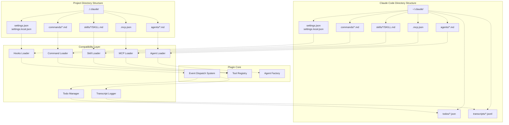

**Directory Loading Priority**

The compatibility layer loads assets from multiple locations with the following priority order (later sources override earlier ones):

| Asset Type | User-Level | Project-Level | Local (Git-ignored) |
| --- | --- | --- | --- |
| Hooks | `~/.claude/settings.json` | `./.claude/settings.json` | `./.claude/settings.local.json` |
| Commands | `~/.claude/commands/*.md` | `./.claude/commands/*.md` | - |
| Skills | `~/.claude/skills/*/SKILL.md` | `./.claude/skills/*/SKILL.md` | - |
| Agents | `~/.claude/agents/*.md` | `./.claude/agents/*.md` | - |
| MCPs | `~/.claude/.mcp.json` | `./.mcp.json` | `./.claude/.mcp.json` |

Sources: [README.md L578-L662](https://github.com/code-yeongyu/oh-my-opencode/blob/b92cd6ab/README.md#L578-L662)

## Configuration File Locations

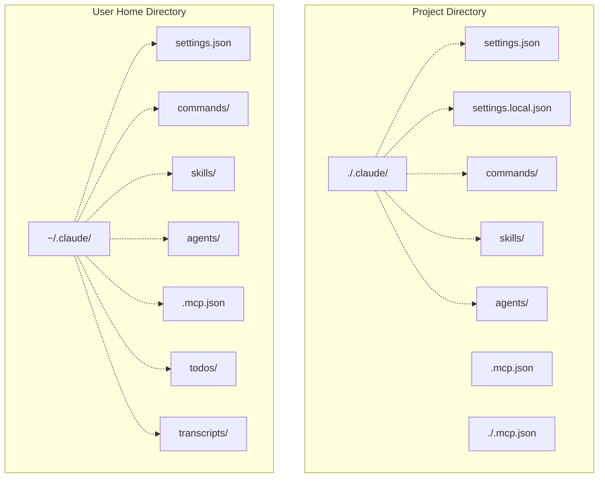

The compatibility layer scans both user-level (`~/.claude/`) and project-level (`./.claude/` or `./.mcp.json` at project root) directories. Project-level configurations override user-level defaults, enabling team-wide standards while preserving personal preferences.

Sources: [README.md L586-L632](https://github.com/code-yeongyu/oh-my-opencode/blob/b92cd6ab/README.md#L586-L632)

## Asset Loaders

### Command Loader

The Command Loader discovers markdown-based slash commands from four directories, merging them into the tool registry:

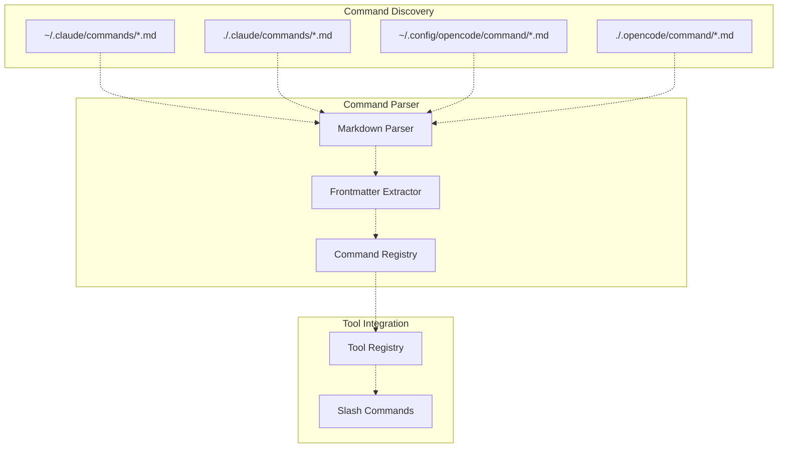

Command files are markdown documents with optional frontmatter for metadata. Each command becomes available as a slash command (e.g., `/command-name`) that agents can invoke.

**Command File Format:**

```go
---
name: example-command
description: Example command description
---

Command instructions go here...
```

Sources: [README.md L614-L618](https://github.com/code-yeongyu/oh-my-opencode/blob/b92cd6ab/README.md#L614-L618)

### Skill Loader

Skills are directory-based capabilities with a `SKILL.md` file that defines the skill's behavior:

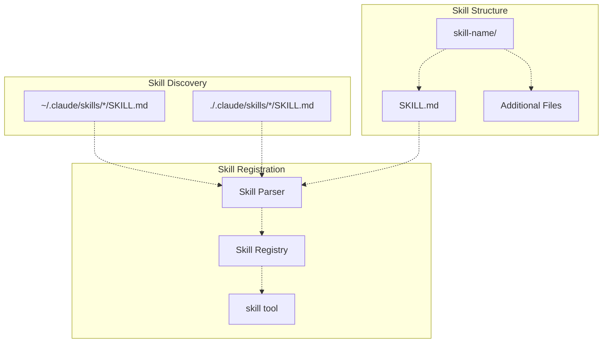

Each skill directory contains a `SKILL.md` file with instructions and may include additional files referenced by the skill. Skills are invoked via the `skill` tool, which passes the skill name and arguments.

**Example Directory Structure:**

```
~/.claude/skills/
├── code-review/
│   └── SKILL.md
├── test-generator/
│   └── SKILL.md
└── documentation/
    └── SKILL.md
```

Sources: [README.md L621-L623](https://github.com/code-yeongyu/oh-my-opencode/blob/b92cd6ab/README.md#L621-L623)

### Agent Loader

Custom agents are loaded from markdown files and integrated into the agent factory:

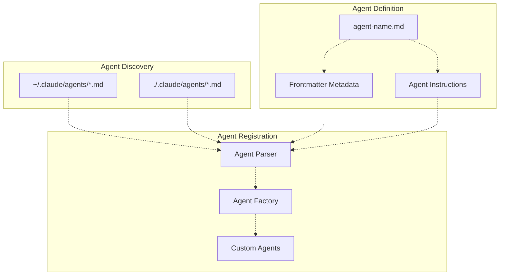

Custom agents extend the built-in agent system (oracle, librarian, explore, etc.) with project-specific or user-specific agents. Agent files define the agent's model, tools, permissions, and instructions.

**Agent File Format:**

```yaml
---
name: custom-agent
model: anthropic/claude-sonnet-4-5
temperature: 0.7
tools: [read, write, bash]
---

Custom agent instructions...
```

Sources: [README.md L625-L627](https://github.com/code-yeongyu/oh-my-opencode/blob/b92cd6ab/README.md#L625-L627)

### MCP Loader

The MCP (Micro-Capability Provider) Loader discovers and registers external MCP servers:

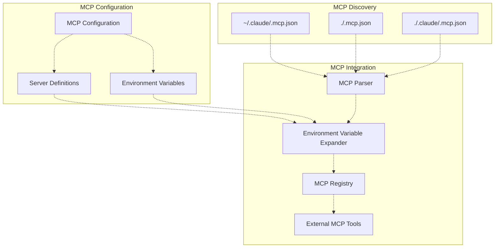

MCP configuration files define external services that provide additional capabilities. The loader supports environment variable expansion using `${VAR}` syntax.

**MCP Configuration Format:**

```json
{
  "mcpServers": {
    "custom-service": {
      "command": "node",
      "args": ["${HOME}/mcp-servers/custom/index.js"],
      "env": {
        "API_KEY": "${CUSTOM_SERVICE_API_KEY}"
      }
    }
  }
}
```

Sources: [README.md L629-L632](https://github.com/code-yeongyu/oh-my-opencode/blob/b92cd6ab/README.md#L629-L632)

## Hooks System

### Hook Types and Events

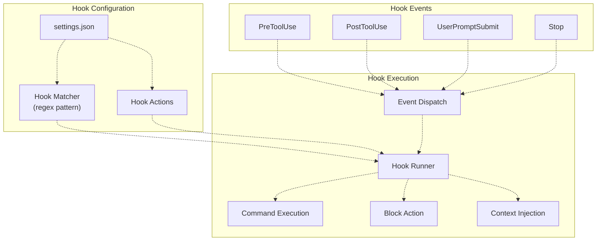

The hooks system intercepts four key events:

| Event | Timing | Capabilities |
| --- | --- | --- |
| `PreToolUse` | Before tool execution | Block execution, modify tool input |
| `PostToolUse` | After tool execution | Add warnings, inject context |
| `UserPromptSubmit` | When user submits prompt | Block submission, inject messages |
| `Stop` | When session goes idle | Inject follow-up prompts |

Sources: [README.md L593-L609](https://github.com/code-yeongyu/oh-my-opencode/blob/b92cd6ab/README.md#L593-L609)

### Hook Execution Flow

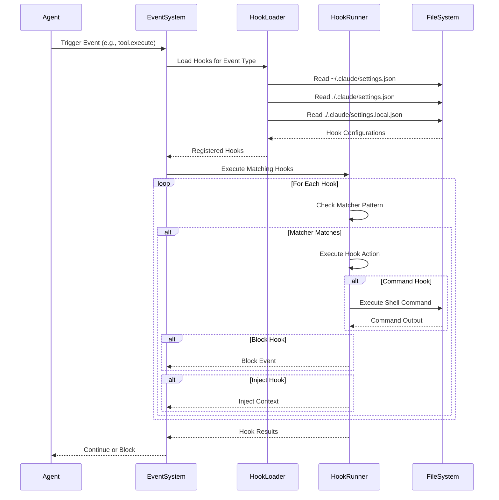

Hooks are executed in the order they are defined in configuration files. Local settings (`./.claude/settings.local.json`) override project settings, which override user settings.

**Hook Configuration Example:**

```json
{
  "hooks": {
    "PostToolUse": [
      {
        "matcher": "Write|Edit",
        "hooks": [
          {
            "type": "command",
            "command": "eslint --fix $FILE"
          }
        ]
      }
    ],
    "PreToolUse": [
      {
        "matcher": "bash",
        "hooks": [
          {
            "type": "block",
            "message": "Bash execution requires approval"
          }
        ]
      }
    ]
  }
}
```

Sources: [README.md L599-L610](https://github.com/code-yeongyu/oh-my-opencode/blob/b92cd6ab/README.md#L599-L610)

### Hook Variables

Hooks support variable substitution for dynamic command execution:

| Variable | Description | Available In |
| --- | --- | --- |
| `$FILE` | File path affected by tool | PostToolUse (Write, Edit) |
| `$TOOL` | Tool name being executed | PreToolUse, PostToolUse |
| `$ARGS` | Tool arguments (JSON) | PreToolUse, PostToolUse |
| `$CWD` | Current working directory | All hooks |
| `$SESSION_ID` | Current session identifier | All hooks |

Sources: [README.md L599-L610](https://github.com/code-yeongyu/oh-my-opencode/blob/b92cd6ab/README.md#L599-L610)

## Data Storage

### Todo Management

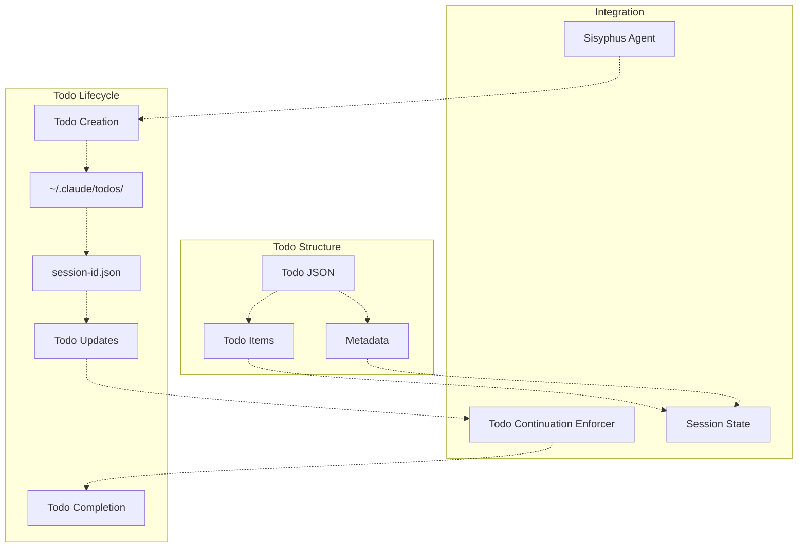

Session todos are stored in `~/.claude/todos/` with one JSON file per session. The format is compatible with Claude Code, enabling seamless transition between platforms.

**Todo File Format:**

```json
{
  "sessionId": "abc123",
  "createdAt": "2025-01-01T00:00:00Z",
  "updatedAt": "2025-01-01T00:30:00Z",
  "items": [
    {
      "id": "1",
      "description": "Implement feature X",
      "status": "in_progress",
      "createdAt": "2025-01-01T00:00:00Z"
    }
  ]
}
```

Sources: [README.md L636-L637](https://github.com/code-yeongyu/oh-my-opencode/blob/b92cd6ab/README.md#L636-L637)

### Transcript Logging

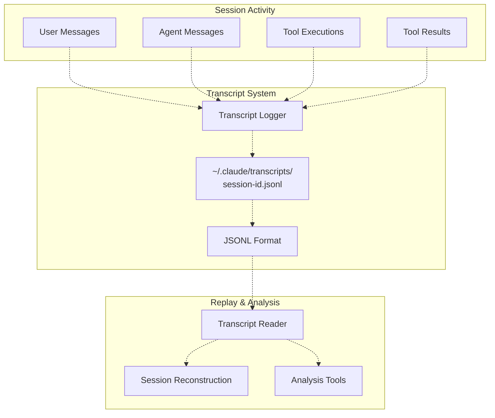

Session activity is logged to `~/.claude/transcripts/` in JSONL (JSON Lines) format, where each line represents a single event. This enables session replay, debugging, and analysis.

**Transcript Entry Format:**

```sql
{"type":"user_message","timestamp":"2025-01-01T00:00:00Z","content":"Implement feature X"}
{"type":"agent_message","timestamp":"2025-01-01T00:00:10Z","content":"I'll create the implementation..."}
{"type":"tool_execution","timestamp":"2025-01-01T00:00:15Z","tool":"write","args":{"path":"src/feature.ts"}}
{"type":"tool_result","timestamp":"2025-01-01T00:00:16Z","tool":"write","result":"File written"}
```

Sources: [README.md L639](https://github.com/code-yeongyu/oh-my-opencode/blob/b92cd6ab/README.md#L639-L639)

## Configuration Toggles

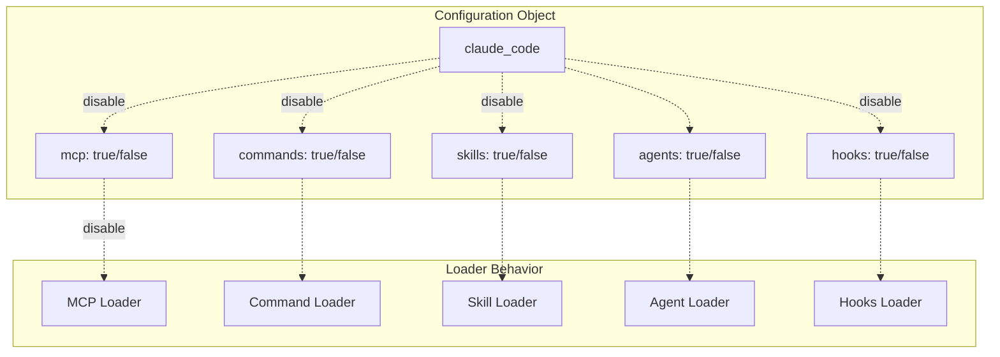

The `claude_code` configuration object provides granular control over which compatibility features to enable:

| Toggle | When `false` | Unaffected |
| --- | --- | --- |
| `mcp` | Stops loading `~/.claude/.mcp.json`, `./.mcp.json`, `./.claude/.mcp.json` | Built-in MCPs (context7, websearch_exa, grep_app) |
| `commands` | Stops loading `~/.claude/commands/*.md`, `./.claude/commands/*.md` | `~/.config/opencode/command/`, `./.opencode/command/` |
| `skills` | Stops loading `~/.claude/skills/*/SKILL.md`, `./.claude/skills/*/SKILL.md` | - |
| `agents` | Stops loading `~/.claude/agents/*.md`, `./.claude/agents/*.md` | Built-in agents (oracle, librarian, explore, etc.) |
| `hooks` | Stops loading `~/.claude/settings.json`, `./.claude/settings.json`, `./.claude/settings.local.json` | - |

**Configuration Example:**

```json
{
  "claude_code": {
    "mcp": false,
    "commands": false,
    "skills": false,
    "agents": false,
    "hooks": false
  }
}
```

All toggles default to `true` (enabled). Omitting the `claude_code` object enables full compatibility. This allows users to selectively disable Claude Code features while retaining oh-my-opencode-specific functionality.

Sources: [README.md L641-L664](https://github.com/code-yeongyu/oh-my-opencode/blob/b92cd6ab/README.md#L641-L664)

## File Path Resolution

The compatibility layer resolves configuration files using platform-specific paths:

| Platform | User Config Directory | Example |
| --- | --- | --- |
| Linux/macOS | `~/.claude/` | `/home/user/.claude/` |
| Windows | `~/.claude/` or `%USERPROFILE%\.claude\` | `C:\Users\user\.claude\` |

Project-level configurations are always resolved relative to the workspace root:

* `./.claude/` for project-specific overrides
* `./.mcp.json` for project-root MCP configuration

Sources: [README.md L586-L632](https://github.com/code-yeongyu/oh-my-opencode/blob/b92cd6ab/README.md#L586-L632)

 [src/shared/config-path.ts L1-L48](https://github.com/code-yeongyu/oh-my-opencode/blob/b92cd6ab/src/shared/config-path.ts#L1-L48)

## Migration Strategy

For users migrating from Claude Code:

1. **No Action Required**: Existing `~/.claude/` configurations are automatically discovered and loaded
2. **Incremental Migration**: Use compatibility toggles to gradually transition to oh-my-opencode-specific features
3. **Parallel Operation**: Both Claude Code and oh-my-opencode can share the same `~/.claude/` directory structure
4. **Project Isolation**: Use `./.claude/settings.local.json` for project-specific overrides without affecting the team's shared configuration

The compatibility layer ensures zero-downtime migration while providing an on-ramp to oh-my-opencode's enhanced features.

Sources: [README.md L578-L665](https://github.com/code-yeongyu/oh-my-opencode/blob/b92cd6ab/README.md#L578-L665)