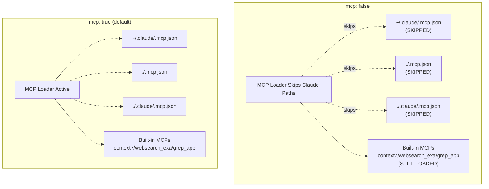
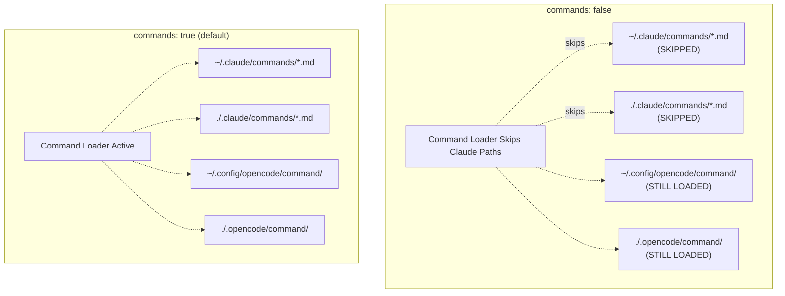
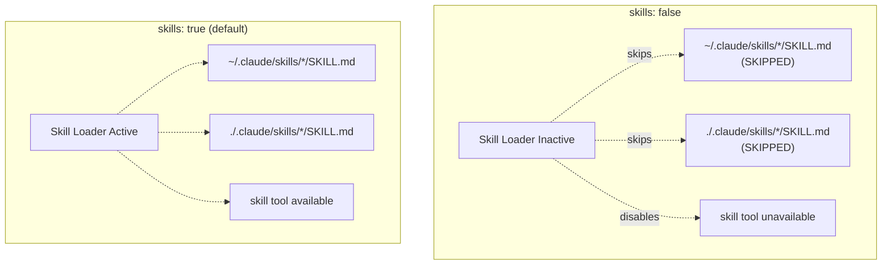
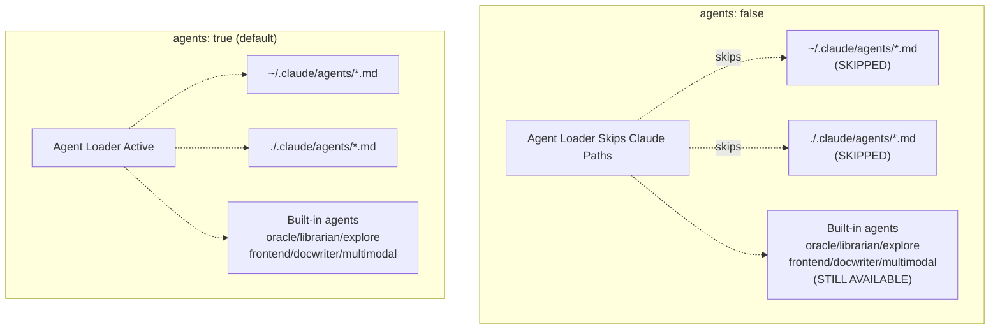
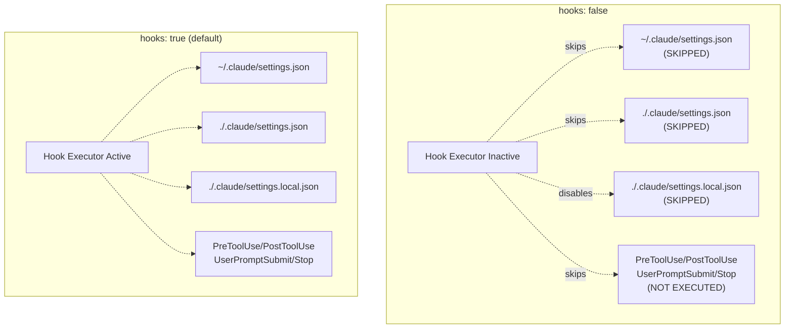
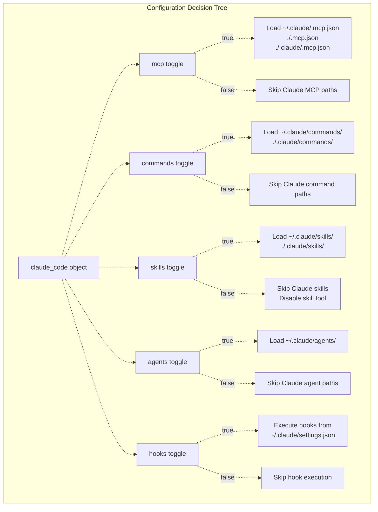

# Compatibility Toggles

> **Relevant source files**
> * [README.ja.md](https://github.com/code-yeongyu/oh-my-opencode/blob/b92cd6ab/README.ja.md)
> * [README.ko.md](https://github.com/code-yeongyu/oh-my-opencode/blob/b92cd6ab/README.ko.md)
> * [README.md](https://github.com/code-yeongyu/oh-my-opencode/blob/b92cd6ab/README.md)
> * [README.zh-cn.md](https://github.com/code-yeongyu/oh-my-opencode/blob/b92cd6ab/README.zh-cn.md)
> * [src/shared/config-path.ts](https://github.com/code-yeongyu/oh-my-opencode/blob/b92cd6ab/src/shared/config-path.ts)

This page documents the `claude_code` configuration object that allows selective disabling of Claude Code compatibility features. Use these toggles to maintain fine-grained control over which Claude Code assets are loaded while preserving oh-my-opencode's built-in functionality.

For information about how Claude Code configurations are loaded, see [Configuration Migration](/code-yeongyu/oh-my-opencode/9.1-configuration-migration). For details on hook execution, see [Hooks Integration](/code-yeongyu/oh-my-opencode/9.2-hooks-integration).

## Purpose

The compatibility toggle system enables users to:

* Disable specific Claude Code features without affecting others
* Maintain compatibility with existing Claude Code workflows while selectively opting out
* Prevent conflicts when both Claude Code and oh-my-opencode assets exist
* Preserve built-in oh-my-opencode features while disabling external Claude Code assets

## Configuration Structure

The `claude_code` object is defined in the oh-my-opencode configuration file with five boolean toggles:

```json
{
  "claude_code": {
    "mcp": true,
    "commands": true,
    "skills": true,
    "agents": true,
    "hooks": true
  }
}
```

**Default behavior:** All toggles default to `true` (enabled). Omitting the `claude_code` object entirely enables full Claude Code compatibility.

Sources: [README.md L640-L665](https://github.com/code-yeongyu/oh-my-opencode/blob/b92cd6ab/README.md#L640-L665)

## Toggle Reference

### MCP Toggle



**Purpose:** Controls loading of external MCP server configurations from Claude Code directories.

**When `false`:**

* Skips `~/.claude/.mcp.json`
* Skips `./.mcp.json`
* Skips `./.claude/.mcp.json`

**Unaffected:**

* Built-in MCPs: `context7`, `websearch_exa`, `grep_app` (always loaded unless disabled via `disabled_mcps`)

**Use case:** Disable when you want to use only oh-my-opencode's curated MCPs and avoid loading user-defined Claude Code MCP configurations that might conflict or duplicate functionality.

Sources: [README.md L642-L665](https://github.com/code-yeongyu/oh-my-opencode/blob/b92cd6ab/README.md#L642-L665)

### Commands Toggle



**Purpose:** Controls loading of slash command definitions from Claude Code directories.

**When `false`:**

* Skips `~/.claude/commands/*.md`
* Skips `./.claude/commands/*.md`

**Unaffected:**

* `~/.config/opencode/command/` (OpenCode global commands)
* `./.opencode/command/` (OpenCode project commands)

**Use case:** Disable when you have conflicting command names between Claude Code and OpenCode, or when you want to maintain command definitions only in OpenCode directories.

Sources: [README.md L642-L665](https://github.com/code-yeongyu/oh-my-opencode/blob/b92cd6ab/README.md#L642-L665)

### Skills Toggle



**Purpose:** Controls loading of directory-based skills with `SKILL.md` files.

**When `false`:**

* Skips `~/.claude/skills/*/SKILL.md`
* Skips `./.claude/skills/*/SKILL.md`
* Disables the `skill` tool entirely

**Unaffected:**

* None (no equivalent OpenCode skill system)

**Use case:** Disable when you don't use Claude Code skills or want to prevent agents from invoking skill-based workflows.

Sources: [README.md L642-L665](https://github.com/code-yeongyu/oh-my-opencode/blob/b92cd6ab/README.md#L642-L665)

### Agents Toggle



**Purpose:** Controls loading of custom agent definitions from Claude Code directories.

**When `false`:**

* Skips `~/.claude/agents/*.md`
* Skips `./.claude/agents/*.md`

**Unaffected:**

* Built-in agents: `oracle`, `librarian`, `explore`, `frontend-ui-ux-engineer`, `document-writer`, `multimodal-looker` (configured via `agents` section or `disabled_agents`)

**Use case:** Disable when you have custom Claude Code agents that conflict with oh-my-opencode's agent orchestration, or when you want to rely exclusively on built-in agents.

Sources: [README.md L642-L665](https://github.com/code-yeongyu/oh-my-opencode/blob/b92cd6ab/README.md#L642-L665)

### Hooks Toggle



**Purpose:** Controls execution of Claude Code hooks from settings files.

**When `false`:**

* Skips `~/.claude/settings.json`
* Skips `./.claude/settings.json`
* Skips `./.claude/settings.local.json`
* Disables execution of `PreToolUse`, `PostToolUse`, `UserPromptSubmit`, and `Stop` hooks

**Unaffected:**

* None (no equivalent OpenCode hook system in settings.json format)

**Use case:** Disable when Claude Code hooks cause conflicts, performance issues, or unwanted side effects. Note that this only disables Claude Code's `settings.json` hooks, not oh-my-opencode's internal hooks (controlled via `disabled_hooks`).

Sources: [README.md L642-L665](https://github.com/code-yeongyu/oh-my-opencode/blob/b92cd6ab/README.md#L642-L665)

## Configuration Examples

### Example 1: Disable All Claude Code Features

```json
{
  "claude_code": {
    "mcp": false,
    "commands": false,
    "skills": false,
    "agents": false,
    "hooks": false
  }
}
```

**Effect:** Complete isolation from Claude Code. Only oh-my-opencode's built-in features are active.

### Example 2: Use Claude Code Commands but Disable Everything Else

```json
{
  "claude_code": {
    "mcp": false,
    "commands": true,
    "skills": false,
    "agents": false,
    "hooks": false
  }
}
```

**Effect:** Slash commands from `~/.claude/commands/` and `./.claude/commands/` remain available, but no MCPs, skills, agents, or hooks from Claude Code are loaded.

### Example 3: Enable Hooks but Disable External Definitions

```json
{
  "claude_code": {
    "mcp": false,
    "commands": false,
    "skills": false,
    "agents": false,
    "hooks": true
  }
}
```

**Effect:** Claude Code hooks execute normally, but no external MCPs, commands, skills, or agents are loaded. Useful for maintaining workflow automation while using only built-in features.

### Example 4: Full Compatibility (Default)

```
{}
```

or

```json
{
  "claude_code": {
    "mcp": true,
    "commands": true,
    "skills": true,
    "agents": true,
    "hooks": true
  }
}
```

**Effect:** All Claude Code compatibility features enabled. Maximum compatibility for users migrating from Claude Code.

Sources: [README.md L642-L665](https://github.com/code-yeongyu/oh-my-opencode/blob/b92cd6ab/README.md#L642-L665)

## Toggle Impact Summary



| Toggle | Disabled Paths | Preserved Features |
| --- | --- | --- |
| `mcp: false` | `~/.claude/.mcp.json``./.mcp.json``./.claude/.mcp.json` | Built-in MCPs (`context7`, `websearch_exa`, `grep_app`) |
| `commands: false` | `~/.claude/commands/*.md``./.claude/commands/*.md` | `~/.config/opencode/command/``./.opencode/command/` |
| `skills: false` | `~/.claude/skills/*/SKILL.md``./.claude/skills/*/SKILL.md``skill` tool | None |
| `agents: false` | `~/.claude/agents/*.md``./.claude/agents/*.md` | Built-in agents (`oracle`, `librarian`, `explore`, `frontend-ui-ux-engineer`, `document-writer`, `multimodal-looker`) |
| `hooks: false` | `~/.claude/settings.json``./.claude/settings.json``./.claude/settings.local.json`Hook execution (`PreToolUse`, `PostToolUse`, `UserPromptSubmit`, `Stop`) | None |

Sources: [README.md L642-L665](https://github.com/code-yeongyu/oh-my-opencode/blob/b92cd6ab/README.md#L642-L665)

## Configuration File Locations

Compatibility toggles can be configured in either location:

1. **User-level:** `~/.config/opencode/oh-my-opencode.json` (or `%APPDATA%\opencode\oh-my-opencode.json` on Windows)
2. **Project-level:** `.opencode/oh-my-opencode.json`

Project-level configuration takes precedence over user-level configuration. When both files exist, project settings override user settings for the `claude_code` object.

Sources: [src/shared/config-path.ts L1-L48](https://github.com/code-yeongyu/oh-my-opencode/blob/b92cd6ab/src/shared/config-path.ts#L1-L48)

 [README.md L698-L706](https://github.com/code-yeongyu/oh-my-opencode/blob/b92cd6ab/README.md#L698-L706)

## Interaction with Other Configuration Options

The `claude_code` toggles are independent from other oh-my-opencode configuration options:

### Built-in Feature Toggles

```json
{
  "disabled_agents": ["oracle", "librarian"],
  "disabled_mcps": ["context7"],
  "disabled_hooks": ["comment-checker"],
  "claude_code": {
    "agents": false,
    "mcp": false
  }
}
```

* `disabled_agents`: Controls oh-my-opencode's built-in agents (unaffected by `claude_code.agents`)
* `disabled_mcps`: Controls oh-my-opencode's built-in MCPs (unaffected by `claude_code.mcp`)
* `disabled_hooks`: Controls oh-my-opencode's internal hooks (unaffected by `claude_code.hooks`)

### Sisyphus Agent Configuration

```json
{
  "sisyphus_agent": {
    "disabled": false
  },
  "claude_code": {
    "agents": false
  }
}
```

The `sisyphus_agent.disabled` setting controls oh-my-opencode's Sisyphus orchestrator, while `claude_code.agents: false` only prevents loading of custom Claude Code agent definitions from `~/.claude/agents/`.

Sources: [README.md L779-L869](https://github.com/code-yeongyu/oh-my-opencode/blob/b92cd6ab/README.md#L779-L869)

## Best Practices

### Migration Strategy

When migrating from Claude Code to oh-my-opencode:

1. **Start with full compatibility:** Omit the `claude_code` object initially
2. **Test incrementally:** Disable one feature at a time to identify conflicts
3. **Document dependencies:** Note which Claude Code assets are critical to your workflow

### Performance Optimization

Disable unused features to reduce startup time and memory usage:

```json
{
  "claude_code": {
    "mcp": false,
    "commands": true,
    "skills": false,
    "agents": false,
    "hooks": true
  }
}
```

### Conflict Resolution

If experiencing conflicts between Claude Code and oh-my-opencode features:

1. Disable the Claude Code feature via `claude_code` toggle
2. Migrate critical functionality to oh-my-opencode configuration
3. Test with `claude_code` toggle re-enabled to verify resolution

Sources: [README.md L640-L665](https://github.com/code-yeongyu/oh-my-opencode/blob/b92cd6ab/README.md#L640-L665)