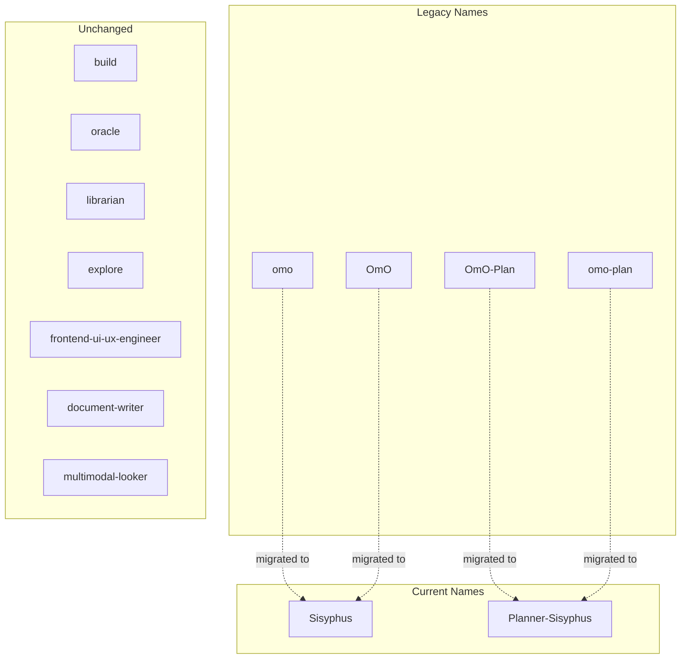
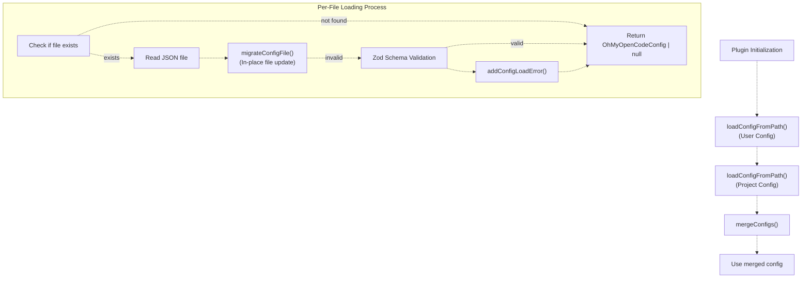
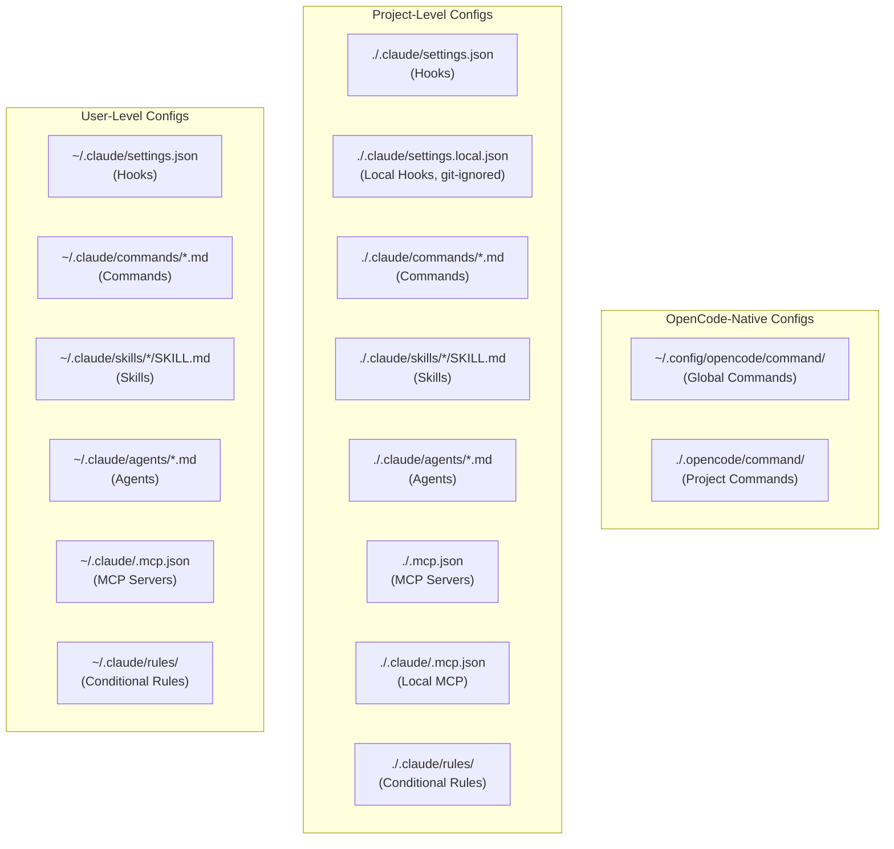
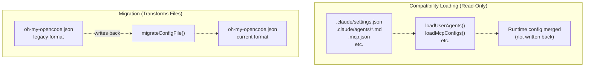

# Configuration Migration

> **Relevant source files**
> * [README.ja.md](https://github.com/code-yeongyu/oh-my-opencode/blob/b92cd6ab/README.ja.md)
> * [README.ko.md](https://github.com/code-yeongyu/oh-my-opencode/blob/b92cd6ab/README.ko.md)
> * [README.md](https://github.com/code-yeongyu/oh-my-opencode/blob/b92cd6ab/README.md)
> * [README.zh-cn.md](https://github.com/code-yeongyu/oh-my-opencode/blob/b92cd6ab/README.zh-cn.md)
> * [src/shared/config-path.ts](https://github.com/code-yeongyu/oh-my-opencode/blob/b92cd6ab/src/shared/config-path.ts)

This document describes how oh-my-opencode handles configuration migration from legacy formats to current formats, and how it loads and transforms Claude Code configuration files for compatibility.

For information about Claude Code compatibility features beyond configuration loading, see [Feature Parity](/code-yeongyu/oh-my-opencode/9.2-hooks-integration). For general configuration file structure and schema, see [Configuration Files](../getting-started/Configuration-Files.md) and [Configuration System](/code-yeongyu/oh-my-opencode/3.2-configuration-system).

---

## Purpose and Scope

Configuration migration ensures backward compatibility when oh-my-opencode evolves. The system automatically detects legacy configuration formats and transforms them to current standards, rewriting configuration files in place when necessary.

This page covers:

* **Agent name migration**: Transforming legacy agent identifiers (`omo`, `OmO`) to current naming (`Sisyphus`, `Planner-Sisyphus`)
* **Configuration key migration**: Renaming deprecated keys (`omo_agent` → `sisyphus_agent`)
* **File rewriting**: Automatic in-place updates to configuration files
* **Claude Code configuration loading**: How external Claude Code configurations are discovered and loaded

This does **not** cover:

* The configuration schema itself (see [Configuration Schema Reference](/code-yeongyu/oh-my-opencode/12.1-build-system))
* Runtime configuration merging logic (see [Configuration System](/code-yeongyu/oh-my-opencode/3.2-configuration-system))

---

## Agent Name Migration

### Legacy to Current Mapping

The plugin maintains backward compatibility for agent names that were changed during the project's evolution from "OmO" to "Sisyphus" branding.



**Agent Name Mapping Table**

| Legacy Name | Current Name | Notes |
| --- | --- | --- |
| `omo` | `Sisyphus` | Original main orchestrator name |
| `OmO` | `Sisyphus` | Case variant |
| `OmO-Plan` | `Planner-Sisyphus` | Planning mode variant |
| `omo-plan` | `Planner-Sisyphus` | Lowercase variant |
| `sisyphus` | `Sisyphus` | Case normalization |
| `planner-sisyphus` | `Planner-Sisyphus` | Case normalization |

The migration is **case-insensitive** during matching but outputs the canonical form.

**Sources:** [src/index.ts L56-L73](https://github.com/code-yeongyu/oh-my-opencode/blob/b92cd6ab/src/index.ts#L56-L73)

### Migration Function

The `migrateAgentNames()` function performs the transformation:

```javascript
function migrateAgentNames(agents: Record<string, unknown>): 
  { migrated: Record<string, unknown>; changed: boolean }
```

**Behavior:**

1. Iterates through all agent configuration keys
2. Looks up each key in `AGENT_NAME_MAP` (case-insensitive)
3. Renames the key if a mapping exists
4. Returns both the migrated object and a `changed` flag

**Sources:** [src/index.ts L75-L88](https://github.com/code-yeongyu/oh-my-opencode/blob/b92cd6ab/src/index.ts#L75-L88)

---

## Configuration Key Migration

Beyond agent names, the plugin migrates deprecated top-level configuration keys.

### Current Migrations

| Legacy Key | Current Key | Version Introduced |
| --- | --- | --- |
| `omo_agent` | `sisyphus_agent` | 1.0.0 |

### Migration Logic

The `migrateConfigFile()` function handles both agent name and configuration key migrations:

```javascript
function migrateConfigFile(configPath: string, rawConfig: Record<string, unknown>): boolean
```

**Process:**

1. **Agent name migration**: If `agents` object exists, run `migrateAgentNames()`
2. **Key migration**: If `omo_agent` exists, copy to `sisyphus_agent` and delete old key
3. **File rewriting**: If any changes occurred, write back to disk with formatted JSON
4. **Return value**: `true` if file was modified, `false` otherwise

**Sources:** [src/index.ts L90-L117](https://github.com/code-yeongyu/oh-my-opencode/blob/b92cd6ab/src/index.ts#L90-L117)

---

## Configuration Loading with Migration



**Configuration File Loading Order**

The plugin loads configuration from two locations, with project-level overriding user-level:

1. **User Config** (base): `~/.config/opencode/oh-my-opencode.json` * Windows fallback: `%APPDATA%\opencode\oh-my-opencode.json`
2. **Project Config** (override): `.opencode/oh-my-opencode.json` (relative to project root)

**Sources:** [src/index.ts L177-L209](https://github.com/code-yeongyu/oh-my-opencode/blob/b92cd6ab/src/index.ts#L177-L209)

 [src/shared/config-path.ts L13-L33](https://github.com/code-yeongyu/oh-my-opencode/blob/b92cd6ab/src/shared/config-path.ts#L13-L33)

### Migration Triggers

Migration runs **automatically** on every configuration load during these events:

* Plugin initialization
* Configuration file read
* Before schema validation

**Migration is idempotent**: Running migration multiple times on an already-migrated file produces no changes.

### File System Impact

When migration detects changes:

1. **Backup**: No automatic backup is created (migration is non-destructive by design)
2. **Rewrite**: File is overwritten with formatted JSON (`JSON.stringify(rawConfig, null, 2)`)
3. **Logging**: Migration event logged with config path
4. **Error handling**: Write failures logged but do not block plugin loading

```
fs.writeFileSync(configPath, JSON.stringify(rawConfig, null, 2) + "\n", "utf-8")
log(`Migrated config file: ${configPath} (OmO → Sisyphus)`)
```

**Sources:** [src/index.ts L107-L114](https://github.com/code-yeongyu/oh-my-opencode/blob/b92cd6ab/src/index.ts#L107-L114)

---

## Claude Code Configuration Loading

The plugin loads additional configuration from Claude Code directories to provide compatibility. This is **separate from migration** — these files are read but not modified.

### Configuration Sources



### Configuration Toggles

Each Claude Code configuration type can be disabled independently via the `claude_code` configuration object:

```json
{
  "claude_code": {
    "mcp": false,
    "commands": false,
    "skills": false,
    "agents": false,
    "hooks": false
  }
}
```

**Default**: All features enabled (`true`)

**Sources:** [src/config/schema.ts L97-L103](https://github.com/code-yeongyu/oh-my-opencode/blob/b92cd6ab/src/config/schema.ts#L97-L103)

 [src/index.ts L268-L270](https://github.com/code-yeongyu/oh-my-opencode/blob/b92cd6ab/src/index.ts#L268-L270)

 [src/index.ts L379-L380](https://github.com/code-yeongyu/oh-my-opencode/blob/b92cd6ab/src/index.ts#L379-L380)

 [src/index.ts L452-L467](https://github.com/code-yeongyu/oh-my-opencode/blob/b92cd6ab/src/index.ts#L452-L467)

### Configuration Loading Functions

| Loader Function | Config Type | Paths Checked | Toggle |
| --- | --- | --- | --- |
| `loadUserCommands()` | Slash commands | `~/.claude/commands/*.md` | `claude_code.commands` |
| `loadProjectCommands()` | Slash commands | `./.claude/commands/*.md` | `claude_code.commands` |
| `loadOpencodeGlobalCommands()` | Slash commands | `~/.config/opencode/command/` | Always loaded |
| `loadOpencodeProjectCommands()` | Slash commands | `./.opencode/command/` | Always loaded |
| `loadUserSkillsAsCommands()` | Skills | `~/.claude/skills/*/SKILL.md` | `claude_code.skills` |
| `loadProjectSkillsAsCommands()` | Skills | `./.claude/skills/*/SKILL.md` | `claude_code.skills` |
| `loadUserAgents()` | Custom agents | `~/.claude/agents/*.md` | `claude_code.agents` |
| `loadProjectAgents()` | Custom agents | `./.claude/agents/*.md` | `claude_code.agents` |
| `loadMcpConfigs()` | MCP servers | `~/.claude/.mcp.json`, `./.mcp.json`, `./.claude/.mcp.json` | `claude_code.mcp` |
| `createClaudeCodeHooksHook()` | Hooks | `~/.claude/settings.json`, `./.claude/settings.json`, `./.claude/settings.local.json` | `claude_code.hooks` |

**Sources:** [src/index.ts L461-L477](https://github.com/code-yeongyu/oh-my-opencode/blob/b92cd6ab/src/index.ts#L461-L477)

 [src/features/claude-code-command-loader.ts](https://github.com/code-yeongyu/oh-my-opencode/blob/b92cd6ab/src/features/claude-code-command-loader.ts)

 [src/features/claude-code-skill-loader.ts](https://github.com/code-yeongyu/oh-my-opencode/blob/b92cd6ab/src/features/claude-code-skill-loader.ts)

 [src/features/claude-code-agent-loader.ts](https://github.com/code-yeongyu/oh-my-opencode/blob/b92cd6ab/src/features/claude-code-agent-loader.ts)

 [src/features/claude-code-mcp-loader.ts](https://github.com/code-yeongyu/oh-my-opencode/blob/b92cd6ab/src/features/claude-code-mcp-loader.ts)

 [src/hooks/claude-code-hooks.ts](https://github.com/code-yeongyu/oh-my-opencode/blob/b92cd6ab/src/hooks/claude-code-hooks.ts)

---

## Migration vs. Compatibility Loading



**Key Differences:**

| Aspect | Migration | Compatibility Loading |
| --- | --- | --- |
| **Target Files** | `oh-my-opencode.json` | `.claude/*` directories |
| **File Modification** | Yes (rewrites file) | No (read-only) |
| **Trigger** | Every plugin load | Every plugin load |
| **Purpose** | Update deprecated formats | Support Claude Code ecosystem |
| **Controlled By** | Automatic (always runs) | `claude_code.*` toggles |

**Sources:** [src/index.ts L90-L117](https://github.com/code-yeongyu/oh-my-opencode/blob/b92cd6ab/src/index.ts#L90-L117)

 [src/index.ts L461-L477](https://github.com/code-yeongyu/oh-my-opencode/blob/b92cd6ab/src/index.ts#L461-L477)

---

## Error Handling

### Validation Errors

When schema validation fails after migration, errors are logged and stored:

```javascript
const result = OhMyOpenCodeConfigSchema.safeParse(rawConfig)
if (!result.success) {
  const errorMsg = result.error.issues.map(i => `${i.path.join(".")}: ${i.message}`).join(", ")
  log(`Config validation error in ${configPath}:`, result.error.issues)
  addConfigLoadError({ path: configPath, error: `Validation error: ${errorMsg}` })
  return null
}
```

**Behavior:**

* Validation errors do **not** block plugin loading
* Invalid configurations return `null` and defaults are used
* Errors are accessible via `getConfigLoadErrors()` for debugging

**Sources:** [src/index.ts L127-L134](https://github.com/code-yeongyu/oh-my-opencode/blob/b92cd6ab/src/index.ts#L127-L134)

### Migration Write Failures

If file writing fails during migration:

```
try {
  fs.writeFileSync(configPath, JSON.stringify(rawConfig, null, 2) + "\n", "utf-8")
  log(`Migrated config file: ${configPath} (OmO → Sisyphus)`)
} catch (err) {
  log(`Failed to write migrated config to ${configPath}:`, err)
}
```

**Behavior:**

* Write failures are logged but do not throw
* Plugin continues loading with in-memory migrated config
* File remains in legacy format (migration retries next load)

**Sources:** [src/index.ts L107-L114](https://github.com/code-yeongyu/oh-my-opencode/blob/b92cd6ab/src/index.ts#L107-L114)

---

## Configuration Merging After Migration

After both user and project configs are loaded and migrated, they are merged:

```javascript
function mergeConfigs(base: OhMyOpenCodeConfig, override: OhMyOpenCodeConfig): OhMyOpenCodeConfig
```

**Merge Strategy:**

1. **Simple overrides**: Top-level primitives and booleans from `override` replace `base`
2. **Deep merge**: `agents` object uses `deepMerge()` to combine nested properties
3. **Array deduplication**: `disabled_agents`, `disabled_mcps`, `disabled_hooks` merge and deduplicate with `Set`
4. **Nested objects**: `claude_code` uses `deepMerge()`

**Precedence**: Project config > User config

**Sources:** [src/index.ts L147-L175](https://github.com/code-yeongyu/oh-my-opencode/blob/b92cd6ab/src/index.ts#L147-L175)

---

## Platform-Specific Configuration Paths

### Windows Configuration Discovery

On Windows, the system checks multiple paths for cross-platform compatibility:

1. **Preferred**: `~/.config/opencode/oh-my-opencode.json` (cross-platform convention)
2. **Fallback**: `%APPDATA%\opencode\oh-my-opencode.json` (Windows-native)

**Discovery Logic:**

```javascript
if (process.platform === "win32") {
  const crossPlatformDir = path.join(os.homedir(), ".config")
  const crossPlatformConfigPath = path.join(crossPlatformDir, "opencode", "oh-my-opencode.json")
  
  const appdataDir = process.env.APPDATA || path.join(os.homedir(), "AppData", "Roaming")
  const appdataConfigPath = path.join(appdataDir, "opencode", "oh-my-opencode.json")
  
  if (fs.existsSync(crossPlatformConfigPath)) {
    return crossPlatformDir
  }
  
  if (fs.existsSync(appdataConfigPath)) {
    return appdataDir
  }
  
  return crossPlatformDir  // Default to cross-platform for new installations
}
```

**Migration Behavior on Windows:**

* Checks cross-platform path first
* Falls back to APPDATA path if found
* Writes migrations to whichever path was detected
* New installations default to `~/.config` for consistency

**Sources:** [src/shared/config-path.ts L13-L33](https://github.com/code-yeongyu/oh-my-opencode/blob/b92cd6ab/src/shared/config-path.ts#L13-L33)

### Linux/macOS Configuration Discovery

On Unix-like systems, configuration follows XDG Base Directory specification:

* **Config directory**: `$XDG_CONFIG_HOME` or `~/.config` (if env var not set)
* **Full path**: `$XDG_CONFIG_HOME/opencode/oh-my-opencode.json`

**Sources:** [src/shared/config-path.ts L32](https://github.com/code-yeongyu/oh-my-opencode/blob/b92cd6ab/src/shared/config-path.ts#L32-L32)

---

## Migration Example

### Before Migration

```json
{
  "$schema": "https://raw.githubusercontent.com/code-yeongyu/oh-my-opencode/master/assets/oh-my-opencode.schema.json",
  "agents": {
    "omo": {
      "model": "anthropic/claude-opus-4-5",
      "temperature": 0.3
    },
    "OmO-Plan": {
      "model": "anthropic/claude-sonnet-4"
    }
  },
  "omo_agent": {
    "disabled": false
  }
}
```

### After Migration (Automatic)

```json
{
  "$schema": "https://raw.githubusercontent.com/code-yeongyu/oh-my-opencode/master/assets/oh-my-opencode.schema.json",
  "agents": {
    "Sisyphus": {
      "model": "anthropic/claude-opus-4-5",
      "temperature": 0.3
    },
    "Planner-Sisyphus": {
      "model": "anthropic/claude-sonnet-4"
    }
  },
  "sisyphus_agent": {
    "disabled": false
  }
}
```

**Changes Applied:**

* `agents.omo` → `agents.Sisyphus`
* `agents.OmO-Plan` → `agents.Planner-Sisyphus`
* `omo_agent` → `sisyphus_agent`

---

## Summary

Configuration migration in oh-my-opencode ensures:

* **Backward compatibility**: Legacy configurations continue working
* **Automatic updates**: Files are migrated transparently on load
* **Non-destructive**: Migration only rewrites when changes are necessary
* **Separation of concerns**: Migration (file modification) is distinct from compatibility loading (read-only)
* **Error resilience**: Migration failures do not break plugin functionality

**Sources:** [src/index.ts L56-L209](https://github.com/code-yeongyu/oh-my-opencode/blob/b92cd6ab/src/index.ts#L56-L209)

 [src/shared/config-path.ts L1-L48](https://github.com/code-yeongyu/oh-my-opencode/blob/b92cd6ab/src/shared/config-path.ts#L1-L48)

 [src/config/schema.ts L97-L103](https://github.com/code-yeongyu/oh-my-opencode/blob/b92cd6ab/src/config/schema.ts#L97-L103)