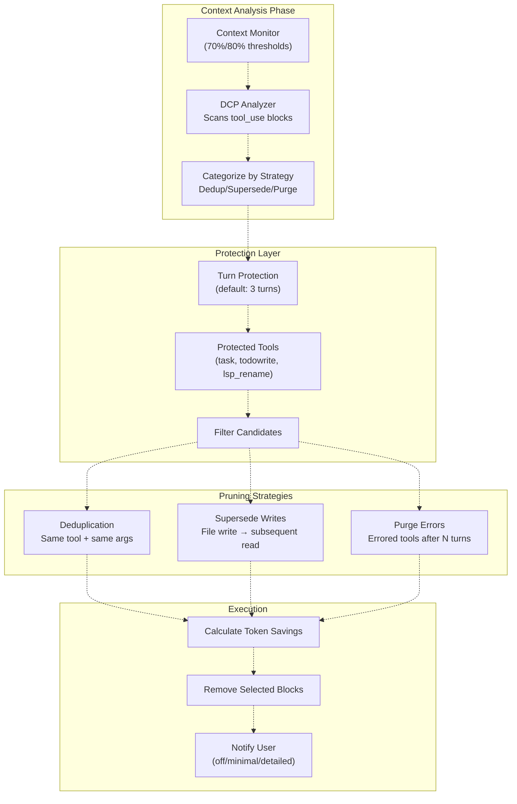
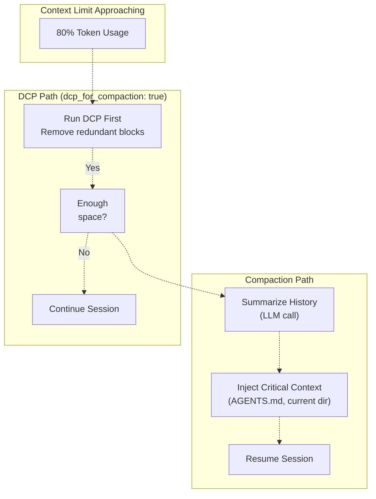
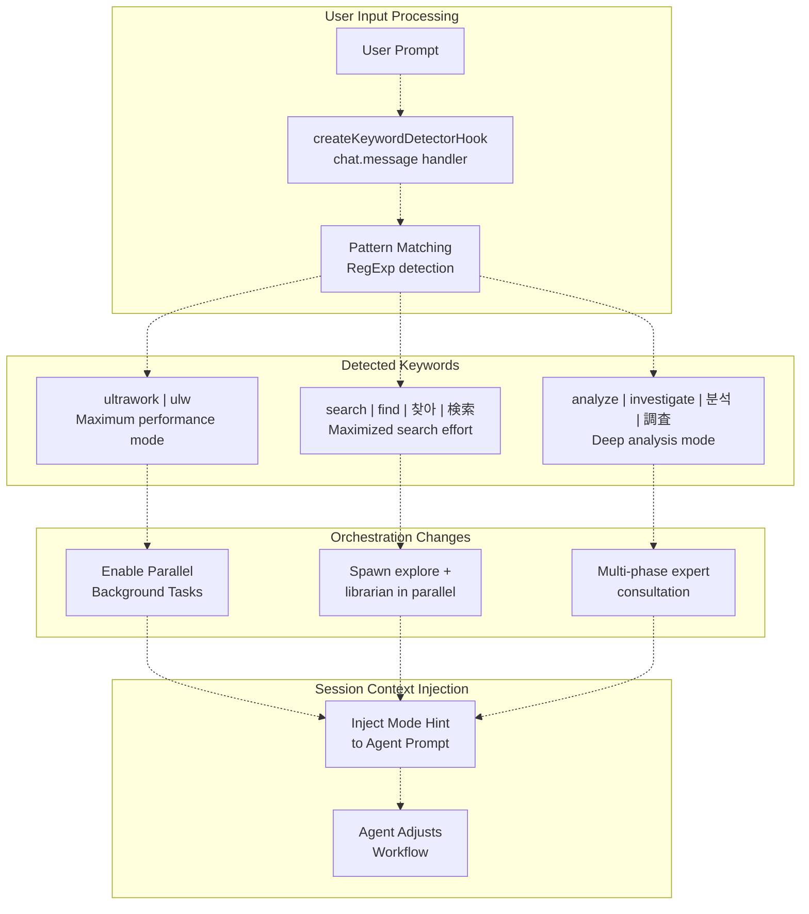
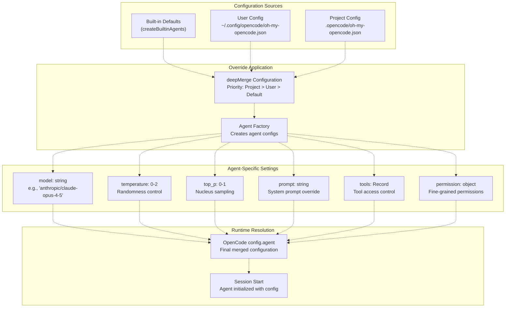
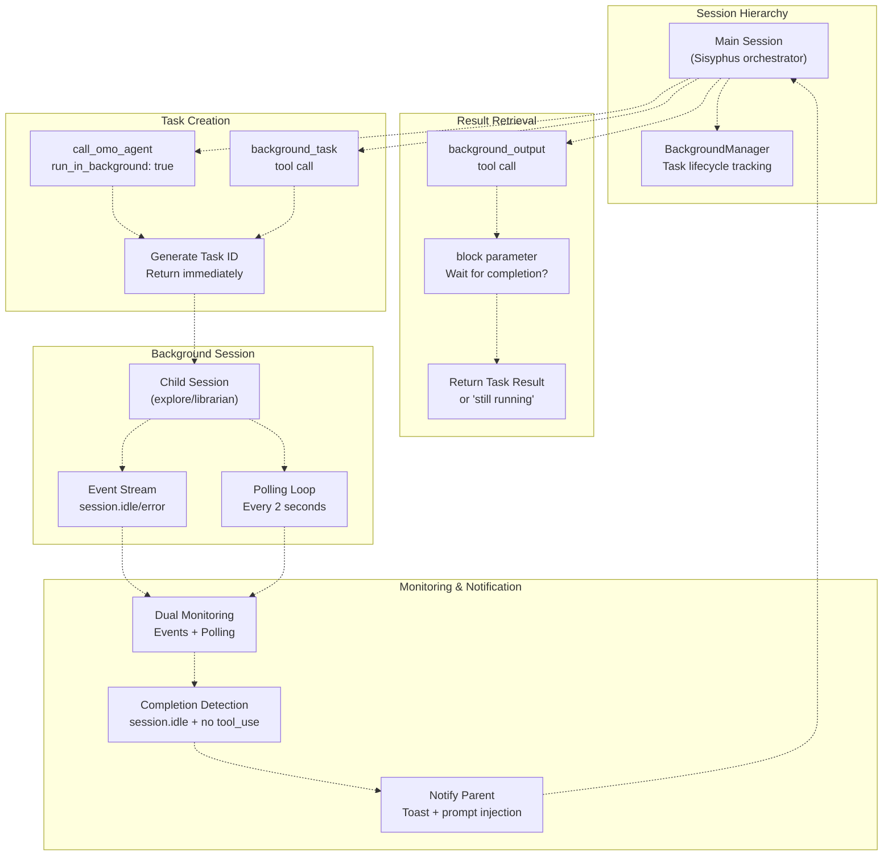

# Advanced Topics

> **Relevant source files**
> * [README.ja.md](https://github.com/code-yeongyu/oh-my-opencode/blob/b92cd6ab/README.ja.md)
> * [README.ko.md](https://github.com/code-yeongyu/oh-my-opencode/blob/b92cd6ab/README.ko.md)
> * [README.md](https://github.com/code-yeongyu/oh-my-opencode/blob/b92cd6ab/README.md)
> * [README.zh-cn.md](https://github.com/code-yeongyu/oh-my-opencode/blob/b92cd6ab/README.zh-cn.md)
> * [assets/oh-my-opencode.schema.json](https://github.com/code-yeongyu/oh-my-opencode/blob/b92cd6ab/assets/oh-my-opencode.schema.json)
> * [src/config/schema.ts](https://github.com/code-yeongyu/oh-my-opencode/blob/b92cd6ab/src/config/schema.ts)
> * [src/hooks/index.ts](https://github.com/code-yeongyu/oh-my-opencode/blob/b92cd6ab/src/hooks/index.ts)
> * [src/index.ts](https://github.com/code-yeongyu/oh-my-opencode/blob/b92cd6ab/src/index.ts)
> * [src/shared/config-path.ts](https://github.com/code-yeongyu/oh-my-opencode/blob/b92cd6ab/src/shared/config-path.ts)

This page covers advanced configuration options, experimental features, and optimization strategies for oh-my-opencode. These features are designed for users who want to fine-tune performance, enable bleeding-edge capabilities, or implement complex multi-agent workflows.

For basic configuration options, see [Configuration](/code-yeongyu/oh-my-opencode/13.1-configuration-schema-reference). For hook-specific configuration, see [Hook Reference](/code-yeongyu/oh-my-opencode/13.4-hook-reference). For agent configuration, see [Agent Reference](/code-yeongyu/oh-my-opencode/13.2-agent-reference).

---

## Experimental Configuration

oh-my-opencode includes experimental features that provide advanced context management and performance optimizations. These features are disabled by default and can be enabled in the `experimental` section of your configuration file.

### Configuration Structure

The experimental configuration object supports the following options:

| Option | Type | Default | Description |
| --- | --- | --- | --- |
| `aggressive_truncation` | `boolean` | `false` | Enable more aggressive truncation of tool outputs |
| `auto_resume` | `boolean` | `false` | Automatically resume sessions after errors |
| `preemptive_compaction` | `boolean` | `true` | Trigger compaction before hitting hard limits |
| `preemptive_compaction_threshold` | `number` | `0.80` | Context usage percentage (0.5-0.95) to trigger compaction |
| `truncate_all_tool_outputs` | `boolean` | `true` | Apply truncation to all tools, not just whitelisted ones |
| `dcp_for_compaction` | `boolean` | `false` | Use Dynamic Context Pruning before summarization |
| `dynamic_context_pruning` | `object` | `undefined` | DCP configuration (see below) |

**Example configuration:**

```json
{
  "experimental": {
    "preemptive_compaction": true,
    "preemptive_compaction_threshold": 0.75,
    "truncate_all_tool_outputs": true,
    "dcp_for_compaction": true,
    "dynamic_context_pruning": {
      "enabled": true,
      "notification": "detailed"
    }
  }
}
```

**Sources:** [src/config/schema.ts L163-L176](https://github.com/code-yeongyu/oh-my-opencode/blob/b92cd6ab/src/config/schema.ts#L163-L176)

 [src/index.ts L273-L277](https://github.com/code-yeongyu/oh-my-opencode/blob/b92cd6ab/src/index.ts#L273-L277)

 [README.md L689-L690](https://github.com/code-yeongyu/oh-my-opencode/blob/b92cd6ab/README.md#L689-L690)

---

## Dynamic Context Pruning (DCP)

Dynamic Context Pruning is an experimental feature that intelligently removes redundant or superseded content from the conversation history without performing full summarization. This preserves more context while staying within token limits.

### DCP Architecture



**Sources:** [src/config/schema.ts L127-L161](https://github.com/code-yeongyu/oh-my-opencode/blob/b92cd6ab/src/config/schema.ts#L127-L161)

 [README.md L688-L690](https://github.com/code-yeongyu/oh-my-opencode/blob/b92cd6ab/README.md#L688-L690)

### DCP Configuration Options

The `dynamic_context_pruning` object supports the following configuration:

```
{
  "dynamic_context_pruning": {
    // Enable/disable DCP
    "enabled": boolean,  // default: false
    
    // Notification level: "off" | "minimal" | "detailed"
    "notification": string,  // default: "detailed"
    
    // Turn protection - prevents pruning recent messages
    "turn_protection": {
      "enabled": boolean,  // default: true
      "turns": number      // default: 3, range: 1-10
    },
    
    // Tools that should never be pruned
    "protected_tools": string[],  // default: ["task", "todowrite", "lsp_rename", ...]
    
    // Individual strategy configuration
    "strategies": {
      "deduplication": {
        "enabled": boolean  // default: true
      },
      "supersede_writes": {
        "enabled": boolean,    // default: true
        "aggressive": boolean  // default: false
      },
      "purge_errors": {
        "enabled": boolean,  // default: true
        "turns": number      // default: 5, range: 1-20
      }
    }
  }
}
```

### Pruning Strategies Explained

| Strategy | Behavior | Example |
| --- | --- | --- |
| **Deduplication** | Removes duplicate tool calls with identical tool name and arguments | Two consecutive `lsp_hover` calls on the same file/position → keeps only the last one |
| **Supersede Writes** | Prunes write operations when the file is subsequently read | `write_file("foo.js", content)` followed by `read_file("foo.js")` → removes the write's input content |
| **Supersede Writes (Aggressive)** | Prunes ANY write if ANY subsequent read occurs | `write_file("a.js", ...)` followed by `read_file("b.js")` → removes the write (not recommended) |
| **Purge Errors** | Removes errored tool calls after N turns have passed | Failed `bash` command from 5+ turns ago → removes the input |

**Sources:** [src/config/schema.ts L143-L160](https://github.com/code-yeongyu/oh-my-opencode/blob/b92cd6ab/src/config/schema.ts#L143-L160)

 [README.md L688-L690](https://github.com/code-yeongyu/oh-my-opencode/blob/b92cd6ab/README.md#L688-L690)

### DCP vs. Preemptive Compaction



When `dcp_for_compaction` is enabled, DCP runs first when the context limit is exceeded. If DCP frees enough space, summarization is avoided entirely. If not, the system falls back to standard preemptive compaction with summarization.

**Sources:** [src/config/schema.ts L174-L175](https://github.com/code-yeongyu/oh-my-opencode/blob/b92cd6ab/src/config/schema.ts#L174-L175)

 [src/hooks/preemptive-compaction.ts L1-L100](https://github.com/code-yeongyu/oh-my-opencode/blob/b92cd6ab/src/hooks/preemptive-compaction.ts#L1-L100)

 (inferred from architecture)

---

## Keyword Detection Modes

oh-my-opencode includes a keyword detection system that activates specialized orchestration modes based on user prompts. This allows for optimized agent behavior without explicit configuration.

### Keyword Detection Flow



**Sources:** [src/hooks/keyword-detector.ts L1-L50](https://github.com/code-yeongyu/oh-my-opencode/blob/b92cd6ab/src/hooks/keyword-detector.ts#L1-L50)

 (inferred), [README.md L671-L675](https://github.com/code-yeongyu/oh-my-opencode/blob/b92cd6ab/README.md#L671-L675)

### Keyword Mode Behaviors

| Keyword | Language Variants | Behavior | Use Case |
| --- | --- | --- | --- |
| `ultrawork` | `ulw` | Maximum performance with aggressive parallel execution. Sisyphus spawns multiple background tasks simultaneously. | Complex multi-component tasks requiring maximum throughput |
| `search` | `find`, `찾아` (Korean), `検索` (Japanese) | Parallel search mode. Spawns both `explore` and `librarian` agents as background tasks to search code and docs simultaneously. | Finding implementations, patterns, or documentation references |
| `analyze` | `investigate`, `분석` (Korean), `調査` (Japanese) | Deep analysis mode with multi-phase expert consultation. Engages Oracle for architecture review. | Debugging complex issues, architecture decisions, code review |

**Example prompts:**

```yaml
ultrawork: Refactor the authentication system to use JWT tokens
search: Find all usages of the deprecated API endpoint
analyze: Why is the payment processing failing for international cards?
```

**Sources:** [README.md L671-L675](https://github.com/code-yeongyu/oh-my-opencode/blob/b92cd6ab/README.md#L671-L675)

 [src/hooks/keyword-detector.ts L1-L50](https://github.com/code-yeongyu/oh-my-opencode/blob/b92cd6ab/src/hooks/keyword-detector.ts#L1-L50)

 (inferred)

---

## Model Configuration

Agent model configuration allows fine-grained control over which AI models handle specific tasks, along with their behavior parameters.

### Agent Model Override Hierarchy



**Sources:** [src/index.ts L153-L187](https://github.com/code-yeongyu/oh-my-opencode/blob/b92cd6ab/src/index.ts#L153-L187)

 [src/agents/index.ts L1-L100](https://github.com/code-yeongyu/oh-my-opencode/blob/b92cd6ab/src/agents/index.ts#L1-L100)

 (inferred), [src/config/schema.ts L74-L103](https://github.com/code-yeongyu/oh-my-opencode/blob/b92cd6ab/src/config/schema.ts#L74-L103)

### Model Configuration Options

**Basic configuration:**

```json
{
  "agents": {
    "Sisyphus": {
      "model": "anthropic/claude-opus-4-5",
      "temperature": 1.0,
      "top_p": 0.95
    },
    "oracle": {
      "model": "openai/gpt-5.2",
      "temperature": 0.3
    },
    "explore": {
      "model": "opencode/grok-code"
    }
  }
}
```

**Advanced configuration with tool restrictions:**

```
{
  "agents": {
    "oracle": {
      "model": "openai/gpt-5.2",
      "tools": {
        "write_file": false,  // Read-only advisor
        "edit_file": false,
        "background_task": false
      },
      "permission": {
        "edit": "deny",
        "bash": "ask"
      }
    }
  }
}
```

**Sources:** [src/config/schema.ts L74-L89](https://github.com/code-yeongyu/oh-my-opencode/blob/b92cd6ab/src/config/schema.ts#L74-L89)

 [README.md L772-L787](https://github.com/code-yeongyu/oh-my-opencode/blob/b92cd6ab/README.md#L772-L787)

### Context Limit Management

oh-my-opencode tracks model context limits from the OpenCode configuration and uses them for preemptive compaction decisions:

```javascript
// From src/index.ts
const modelContextLimitsCache = new Map<string, number>();
const getModelLimit = (providerID: string, modelID: string): number | undefined => {
  const key = `${providerID}/${modelID}`;
  const cached = modelContextLimitsCache.get(key);
  if (cached) return cached;
  
  if (providerID === "anthropic" && anthropicContext1MEnabled && modelID.includes("sonnet")) {
    return 1_000_000;  // Anthropic extended context
  }
  return undefined;
};
```

The context limit is detected from:

1. OpenCode `config.provider[providerID].models[modelID].limit.context`
2. Special handling for Anthropic's `anthropic-beta: context-1m` header
3. Cached for performance

**Sources:** [src/index.ts L224-L236](https://github.com/code-yeongyu/oh-my-opencode/blob/b92cd6ab/src/index.ts#L224-L236)

 [src/index.ts L362-L386](https://github.com/code-yeongyu/oh-my-opencode/blob/b92cd6ab/src/index.ts#L362-L386)

### Thinking Mode Configuration

oh-my-opencode automatically detects when extended thinking is needed and adjusts model settings:

**Detection triggers:**

* User prompts containing: "think deeply", "ultrathink", "reason carefully"
* Complex tasks requiring multi-step reasoning

**Automatic adjustments:**

* Claude models: Sets `thinking` configuration
* OpenAI models: Adjusts `reasoning_effort` parameter
* Token budget allocation for extended thinking

**Sources:** [README.md L676-L677](https://github.com/code-yeongyu/oh-my-opencode/blob/b92cd6ab/README.md#L676-L677)

 [src/hooks/think-mode.ts L1-L50](https://github.com/code-yeongyu/oh-my-opencode/blob/b92cd6ab/src/hooks/think-mode.ts#L1-L50)

 (inferred)

---

## Parallel Execution Patterns

oh-my-opencode's background execution system enables true parallel agent workflows, allowing multiple agents to work simultaneously while maintaining coordination.

### Background Execution Architecture



**Sources:** [src/features/background-agent.ts L1-L200](https://github.com/code-yeongyu/oh-my-opencode/blob/b92cd6ab/src/features/background-agent.ts#L1-L200)

 (inferred), [src/tools/call-omo-agent.ts L1-L100](https://github.com/code-yeongyu/oh-my-opencode/blob/b92cd6ab/src/tools/call-omo-agent.ts#L1-L100)

 (inferred), [README.md L485-L496](https://github.com/code-yeongyu/oh-my-opencode/blob/b92cd6ab/README.md#L485-L496)

### Background Task Tools

| Tool | Parameters | Behavior | Return Value |
| --- | --- | --- | --- |
| `call_omo_agent` | `agent_name`, `task`, `run_in_background` | Spawns explore or librarian agent. If `run_in_background: true`, returns task_id immediately. | `task_id` (background) or full response (blocking) |
| `background_task` | `description` | Creates generic background task. Used by Sisyphus for parallel work. | `task_id` |
| `background_output` | `task_id`, `block` | Retrieves task output. If `block: true`, waits for completion. | Task result or "still running" |
| `background_cancel` | `task_id` or `all: true` | Cancels one or all background tasks | Confirmation message |

**Sources:** [src/tools/index.ts L53](https://github.com/code-yeongyu/oh-my-opencode/blob/b92cd6ab/src/tools/index.ts#L53-L53)

 [src/tools/call-omo-agent.ts L1-L100](https://github.com/code-yeongyu/oh-my-opencode/blob/b92cd6ab/src/tools/call-omo-agent.ts#L1-L100)

 (inferred), [README.md L525](https://github.com/code-yeongyu/oh-my-opencode/blob/b92cd6ab/README.md#L525-L525)

### Parallel Execution Patterns

**Pattern 1: Parallel Research**

```
Sisyphus's workflow:
1. Spawn explore agent in background: search for authentication patterns
2. Spawn librarian agent in background: find JWT documentation
3. Continue with initial implementation
4. Wait for both agents to complete
5. Integrate findings
```

**Implementation:**

```yaml
// Sisyphus calls:
call_omo_agent({
  agent_name: "explore",
  task: "Find authentication patterns in src/",
  run_in_background: true
})  // Returns task_id_1 immediately

call_omo_agent({
  agent_name: "librarian", 
  task: "Research JWT best practices",
  run_in_background: true
})  // Returns task_id_2 immediately

// Later, retrieve results:
background_output({ task_id: "task_id_1", block: true })
background_output({ task_id: "task_id_2", block: true })
```

**Pattern 2: Frontend/Backend Split**

```
Sisyphus's workflow:
1. background_task: "Gemini builds frontend components"
2. Continue with backend implementation
3. Get notified when frontend completes
4. Review and integrate
```

**Pattern 3: Multi-Angle Search**

```
Sisyphus activates "search" mode:
1. Spawn explore (code search via LSP/AST/grep_app)
2. Spawn librarian (docs search via context7/websearch_exa)
3. Both run in parallel
4. Aggregate results
```

**Sources:** [README.md L485-L496](https://github.com/code-yeongyu/oh-my-opencode/blob/b92cd6ab/README.md#L485-L496)

 [src/hooks/background-notification.ts L1-L50](https://github.com/code-yeongyu/oh-my-opencode/blob/b92cd6ab/src/hooks/background-notification.ts#L1-L50)

 (inferred)

### Background Session State Management

The `BackgroundManager` tracks all background tasks:

```python
// Task states (inferred from architecture)
type TaskState = 
  | "pending"     // Task created, session starting
  | "running"     // Session active, agent working
  | "completed"   // Session idle, results available
  | "failed"      // Error occurred
  | "cancelled"   // Manually cancelled

// BackgroundManager maintains:
class BackgroundManager {
  private tasks: Map<string, TaskInfo>  // task_id -> task metadata
  private sessions: Map<string, SessionInfo>  // session_id -> background session
  
  // Dual monitoring:
  - Event listener: session.idle, session.error
  - Polling: setInterval(checkSessions, 2000)
}
```

**Completion detection logic:**

1. Session emits `session.idle` event
2. No pending `tool_use` blocks in message array
3. Task marked as `completed`
4. Parent session notified via toast and prompt injection

**Sources:** [src/features/background-agent.ts L1-L200](https://github.com/code-yeongyu/oh-my-opencode/blob/b92cd6ab/src/features/background-agent.ts#L1-L200)

 (inferred), [src/index.ts L307-L320](https://github.com/code-yeongyu/oh-my-opencode/blob/b92cd6ab/src/index.ts#L307-L320)

### Notification System

When a background task completes, the parent session receives:

1. **OS Toast Notification:** "Background task completed: [task description]"
2. **Prompt Injection:** A synthetic user message injected into the session: ``` Background task [task_id] completed. Use background_output to retrieve results. ```

This dual notification ensures Sisyphus is aware of completion even if it's in the middle of other work.

**Sources:** [src/hooks/background-notification.ts L1-L50](https://github.com/code-yeongyu/oh-my-opencode/blob/b92cd6ab/src/hooks/background-notification.ts#L1-L50)

 (inferred), [README.md L683-L684](https://github.com/code-yeongyu/oh-my-opencode/blob/b92cd6ab/README.md#L683-L684)

---

## Performance Optimization Strategies

### Token Optimization

| Strategy | Configuration | Impact |
| --- | --- | --- |
| **Preemptive Compaction** | `experimental.preemptive_compaction_threshold: 0.75` | Triggers summarization at 75% usage instead of waiting for hard limit |
| **Tool Output Truncation** | `experimental.truncate_all_tool_outputs: true` | Truncates verbose tool outputs (grep, glob, LSP) dynamically |
| **DCP Before Compaction** | `experimental.dcp_for_compaction: true` | Attempts pruning before expensive summarization |
| **Aggressive Truncation** | `experimental.aggressive_truncation: true` | More aggressive truncation thresholds (use with caution) |

### Agent Specialization

| Pattern | Configuration | Benefit |
| --- | --- | --- |
| **Read-only Oracle** | `agents.oracle.permission.edit: "deny"` | Prevents expensive write operations from slow reasoning model |
| **Fast Exploration** | `agents.explore.model: "opencode/grok-code"` | Uses free, fast model for code search tasks |
| **Parallel Research** | `agents.librarian.tools.background_task: true` | Enables async research while Sisyphus continues work |

### Workflow Optimization

| Technique | Implementation | Use Case |
| --- | --- | --- |
| **Keyword Activation** | User adds `ultrawork` to prompt | Complex tasks requiring maximum parallelism |
| **Subagent Spawning** | `call_omo_agent(..., run_in_background: true)` | Research tasks that can run asynchronously |
| **Context Awareness** | Enable DCP with turn protection | Preserve recent context while managing limits |

**Sources:** [src/config/schema.ts L163-L176](https://github.com/code-yeongyu/oh-my-opencode/blob/b92cd6ab/src/config/schema.ts#L163-L176)

 [README.md L671-L692](https://github.com/code-yeongyu/oh-my-opencode/blob/b92cd6ab/README.md#L671-L692)

---

## Configuration Examples

### Maximum Performance Configuration

```
{
  "experimental": {
    "preemptive_compaction": true,
    "preemptive_compaction_threshold": 0.70,
    "truncate_all_tool_outputs": true,
    "dcp_for_compaction": true,
    "dynamic_context_pruning": {
      "enabled": true,
      "notification": "minimal",
      "turn_protection": {
        "enabled": true,
        "turns": 2
      },
      "strategies": {
        "deduplication": { "enabled": true },
        "supersede_writes": { "enabled": true, "aggressive": false },
        "purge_errors": { "enabled": true, "turns": 3 }
      }
    }
  },
  "agents": {
    "explore": {
      "model": "opencode/grok-code"  // Free, fast
    },
    "librarian": {
      "model": "google/gemini-3-flash"  // Fast, cheap
    }
  }
}
```

### Conservative Configuration

```
{
  "experimental": {
    "preemptive_compaction": true,
    "preemptive_compaction_threshold": 0.85,
    "truncate_all_tool_outputs": false,  // Preserve full outputs
    "dcp_for_compaction": false  // Use standard summarization
  },
  "agents": {
    "Sisyphus": {
      "temperature": 0.5  // More deterministic
    }
  }
}
```

**Sources:** [src/config/schema.ts L163-L191](https://github.com/code-yeongyu/oh-my-opencode/blob/b92cd6ab/src/config/schema.ts#L163-L191)

 [README.md L694-L760](https://github.com/code-yeongyu/oh-my-opencode/blob/b92cd6ab/README.md#L694-L760)