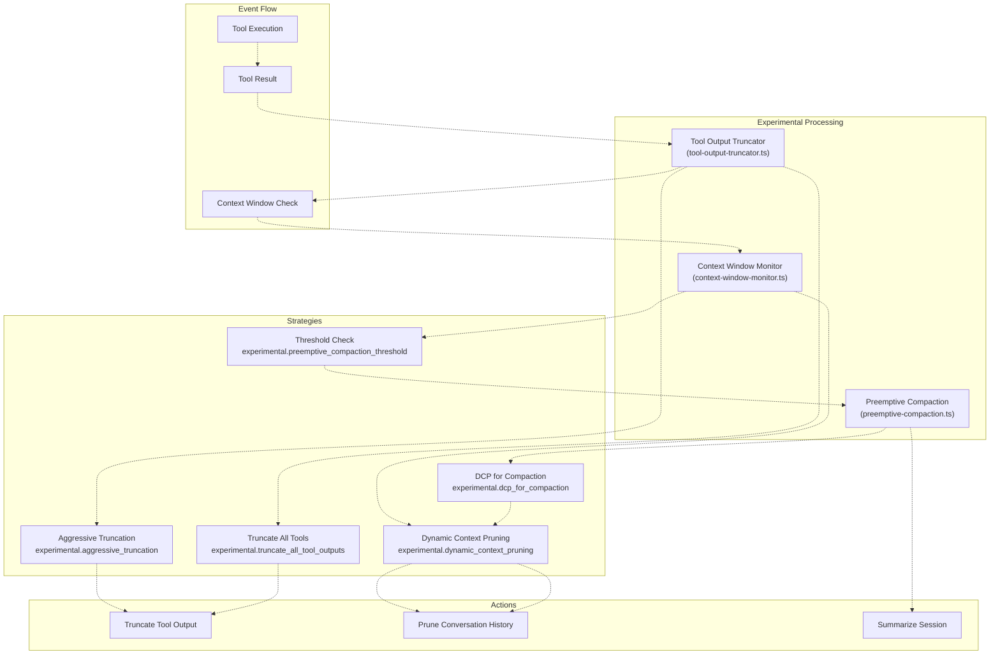
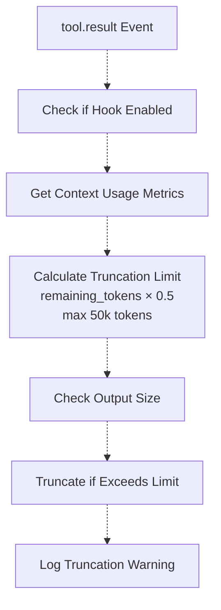
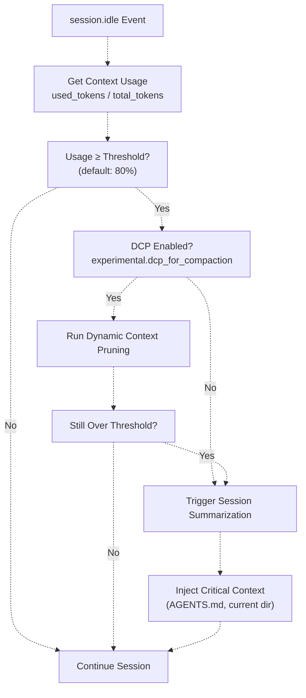
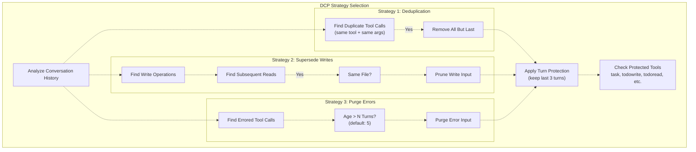
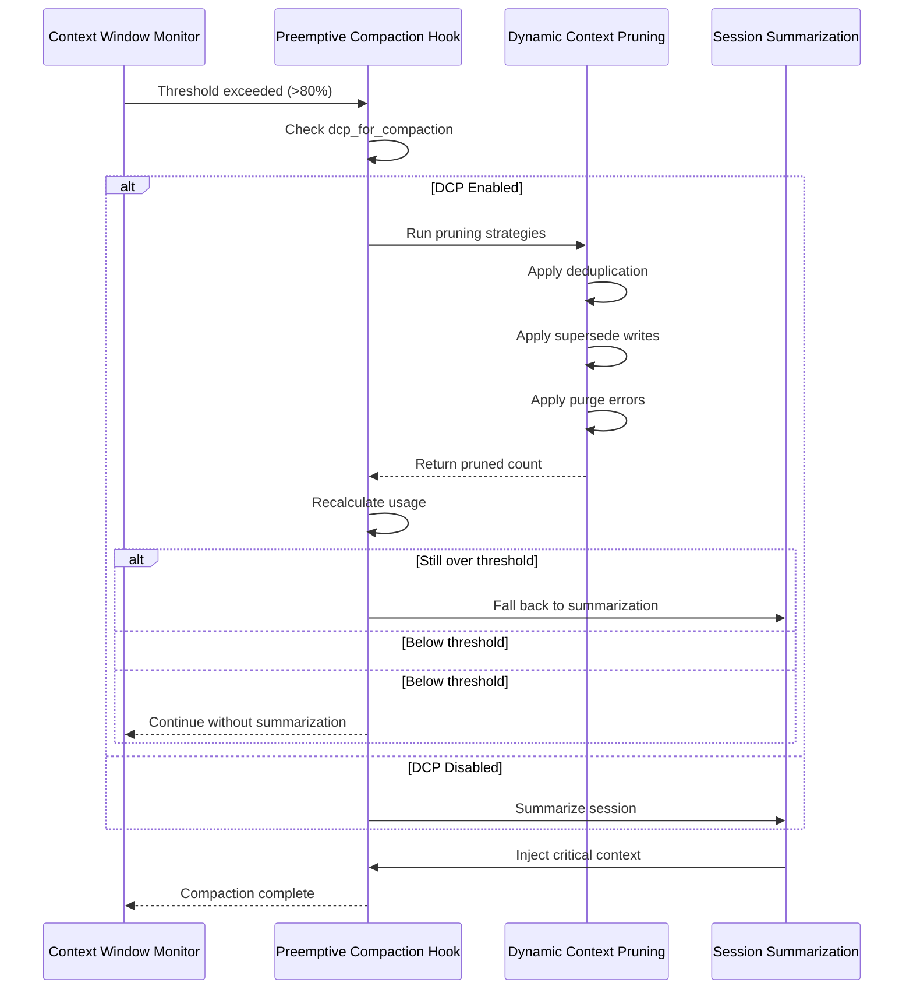
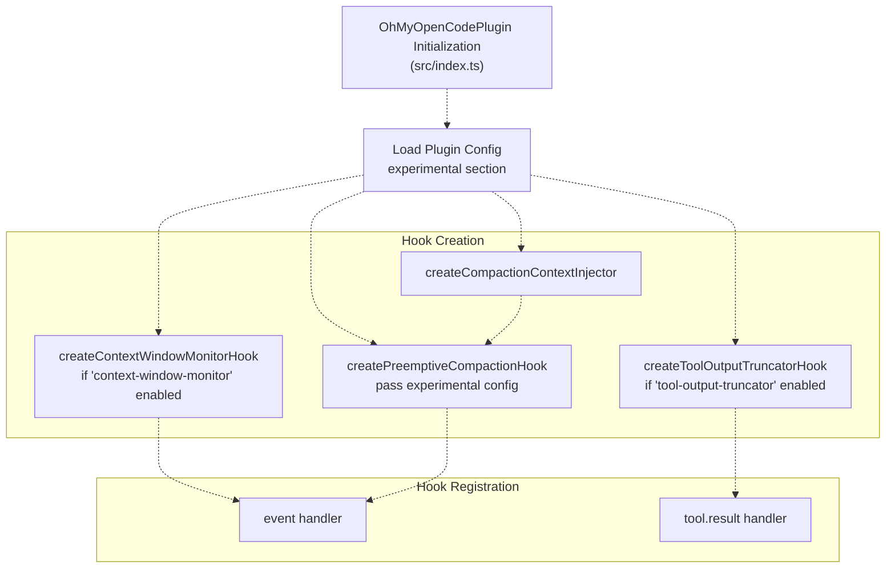

# 실험적 기능 (Experimental Features)

> **관련 소스 파일**
> * [README.ja.md](https://github.com/code-yeongyu/oh-my-opencode/blob/b92cd6ab/README.ja.md)
> * [README.ko.md](https://github.com/code-yeongyu/oh-my-opencode/blob/b92cd6ab/README.ko.md)
> * [README.md](https://github.com/code-yeongyu/oh-my-opencode/blob/b92cd6ab/README.md)
> * [README.zh-cn.md](https://github.com/code-yeongyu/oh-my-opencode/blob/b92cd6ab/README.zh-cn.md)
> * [assets/oh-my-opencode.schema.json](https://github.com/code-yeongyu/oh-my-opencode/blob/b92cd6ab/assets/oh-my-opencode.schema.json)
> * [src/config/schema.ts](https://github.com/code-yeongyu/oh-my-opencode/blob/b92cd6ab/src/config/schema.ts)
> * [src/hooks/index.ts](https://github.com/code-yeongyu/oh-my-opencode/blob/b92cd6ab/src/hooks/index.ts)
> * [src/index.ts](https://github.com/code-yeongyu/oh-my-opencode/blob/b92cd6ab/src/index.ts)
> * [src/shared/config-path.ts](https://github.com/code-yeongyu/oh-my-opencode/blob/b92cd6ab/src/shared/config-path.ts)

이 페이지는 현재 활발히 개발 중인 고급 컨텍스트 관리 및 최적화 기능에 대해 설명합니다. 이 기능들은 토큰 사용량, 컨텍스트 창(context window) 관리, 세션 압축(session compaction) 전략에 대한 세밀한 제어를 제공합니다. 프로덕션 환경에서 사용할 수 있을 만큼 안정적이지만, 사용자 피드백과 성능 데이터에 따라 향후 릴리스에서 동작 및 설정 옵션이 변경될 수 있습니다.

세션 복구 및 컨텍스트 모니터링과 같은 표준 안정성 기능은 [Reliability System](../reliability/)을 참조하십시오. MCP 통합 및 외부 서비스 연결은 [MCP Integration](/code-yeongyu/oh-my-opencode/8-mcp-integration)을 참조하십시오.

---

## 설정 위치 (Configuration Location)

실험적 기능은 `oh-my-opencode.json`의 `experimental` 섹션에서 설정합니다.

```json
{
  "experimental": {
    "aggressive_truncation": false,
    "preemptive_compaction": true,
    "preemptive_compaction_threshold": 0.80,
    "truncate_all_tool_outputs": true,
    "dcp_for_compaction": false,
    "dynamic_context_pruning": {
      "enabled": false,
      "notification": "detailed",
      "turn_protection": {
        "enabled": true,
        "turns": 3
      },
      "protected_tools": ["task", "todowrite", "todoread"],
      "strategies": {
        "deduplication": { "enabled": true },
        "supersede_writes": { "enabled": true, "aggressive": false },
        "purge_errors": { "enabled": true, "turns": 5 }
      }
    }
  }
}
```

**출처:** [src/config/schema.ts L163-L176](https://github.com/code-yeongyu/oh-my-opencode/blob/b92cd6ab/src/config/schema.ts#L163-L176)

 [README.md L116](https://github.com/code-yeongyu/oh-my-opencode/blob/b92cd6ab/README.md#L116-L116)

---

## 기능 아키텍처 개요 (Feature Architecture Overview)

실험적 기능은 도구 출력 가로채기, 대화 기록 정리, 토큰 제한 도달 전 압축 트리거 등을 수행하는 계층형 컨텍스트 관리 시스템을 구성합니다.



**출처:** [src/hooks/tool-output-truncator.ts](https://github.com/code-yeongyu/oh-my-opencode/blob/b92cd6ab/src/hooks/tool-output-truncator.ts)

 [src/hooks/preemptive-compaction.ts](https://github.com/code-yeongyu/oh-my-opencode/blob/b92cd6ab/src/hooks/preemptive-compaction.ts)

 [src/hooks/context-window-monitor.ts](https://github.com/code-yeongyu/oh-my-opencode/blob/b92cd6ab/src/hooks/context-window-monitor.ts)

---

## 공격적 잘림 (Aggressive Truncation)

공격적 잘림은 기본 동작보다 더 공격적으로 도구 출력 크기를 줄여, 출력의 완전성보다 컨텍스트 보존을 우선시합니다.

### 동작 방식

`aggressive_truncation`이 활성화되면, 도구 출력은 컨텍스트 창에서 **50%의 여유 공간(headroom)**을 유지하도록 잘리며, 도구 출력당 **50,000 토큰**의 하드 캡(hard cap)이 적용됩니다. 이는 표준 잘림 전략보다 더 보수적입니다.

### 설정

```json
{
  "experimental": {
    "aggressive_truncation": true,
    "truncate_all_tool_outputs": true
  }
}
```

| 옵션 | 타입 | 기본값 | 설명 |
| --- | --- | --- | --- |
| `aggressive_truncation` | boolean | `false` | 도구 출력에 대해 더 공격적인 잘림 활성화 |
| `truncate_all_tool_outputs` | boolean | `true` | 화이트리스트 도구(grep, glob, LSP, AST-grep)뿐만 아니라 모든 도구 출력 잘림 |

### 구현 세부 사항

잘림(truncator) 훅은 `tool.result` 이벤트 핸들러에서 도구 결과를 처리합니다.



잘림 로직은 출력의 시작과 끝 부분을 유지하고 중간을 생략 기호(ellipsis)로 대체하여, 에이전트에게 중요한 컨텍스트 단서를 보존합니다.

**출처:** [src/hooks/tool-output-truncator.ts L30-L120](https://github.com/code-yeongyu/oh-my-opencode/blob/b92cd6ab/src/hooks/tool-output-truncator.ts#L30-L120)

 [src/config/schema.ts L164-L171](https://github.com/code-yeongyu/oh-my-opencode/blob/b92cd6ab/src/config/schema.ts#L164-L171)

---

## 선제적 압축 (Preemptive Compaction)

선제적 압축은 하드 컨텍스트 제한에 도달하기 전에 세션 요약을 트리거하여 API 오류를 방지하고 대화 흐름을 유지합니다.

### 트리거 메커니즘

압축은 컨텍스트 사용량이 설정된 임계값(threshold) 백분율을 초과할 때 트리거됩니다.



### 설정

```json
{
  "experimental": {
    "preemptive_compaction": true,
    "preemptive_compaction_threshold": 0.80
  }
}
```

| 옵션 | 타입 | 기본값 | 설명 |
| --- | --- | --- | --- |
| `preemptive_compaction` | boolean | `true` | 하드 제한 도달 전 선제적 압축 활성화 |
| `preemptive_compaction_threshold` | number | `0.80` | 압축을 트리거할 컨텍스트 창 사용량 백분율 (0.5-0.95) |

### 컨텍스트 보존

`CompactionContextInjector`는 요약 과정에서 다음과 같은 중요한 정보를 보존합니다.

1. **AGENTS.md 내용** - 에이전트 위임 지침
2. **현재 디렉토리 정보** - 작업 디렉토리 컨텍스트
3. **최근 도구 출력** - 마지막 N개 턴의 도구 결과

**출처:** [src/hooks/preemptive-compaction.ts L20-L180](https://github.com/code-yeongyu/oh-my-opencode/blob/b92cd6ab/src/hooks/preemptive-compaction.ts#L20-L180)

 [src/hooks/compaction-context-injector.ts L10-85](https://github.com/code-yeongyu/oh-my-opencode/blob/b92cd6ab/src/hooks/compaction-context-injector.ts#L10-L85)

---

## 동적 컨텍스트 정리 (Dynamic Context Pruning, DCP)

동적 컨텍스트 정리는 전체 요약 없이 대화 기록에서 중복되거나 오래된 정보를 지능적으로 제거하여, 의미론적 흐름을 보존하면서 토큰 사용량을 줄입니다.

### 정리 전략 (Pruning Strategies)

DCP는 독립적으로 활성화할 수 있는 세 가지 정리 전략을 구현합니다.



### 설정

```json
{
  "experimental": {
    "dynamic_context_pruning": {
      "enabled": false,
      "notification": "detailed",
      "turn_protection": {
        "enabled": true,
        "turns": 3
      },
      "protected_tools": [
        "task",
        "todowrite", 
        "todoread",
        "lsp_rename",
        "lsp_code_action_resolve",
        "session_read",
        "session_write",
        "session_search"
      ],
      "strategies": {
        "deduplication": {
          "enabled": true
        },
        "supersede_writes": {
          "enabled": true,
          "aggressive": false
        },
        "purge_errors": {
          "enabled": true,
          "turns": 5
        }
      }
    }
  }
}
```

### 전략 세부 사항

#### 1. 중복 제거 전략 (Deduplication Strategy)

동일한 도구가 동일한 인자로 호출된 중복 도구 호출을 제거합니다. 가장 최근의 호출만 보존됩니다.

**예시:** 동일한 심볼에 대해 `lsp_goto_definition`이 세 번 호출된 경우, 처음 두 번의 호출은 정리됩니다.

#### 2. 쓰기 대체 전략 (Supersede Writes Strategy)

파일이 나중에 읽혀진 경우, 이전의 쓰기 작업 입력을 정리합니다. 근거: 파일이 나중에 읽혔다면 에이전트는 이미 현재 상태를 알고 있기 때문입니다.

**모드:**

* **일반 모드** (`aggressive: false`): 정확히 동일한 파일이 읽힌 경우에만 정리
* **공격적 모드** (`aggressive: true`): 이후에 **어떤** 읽기 작업이라도 발생하면 모든 쓰기 작업을 정리 (⚠️ 컨텍스트 손실 위험 있음)

#### 3. 오류 삭제 전략 (Purge Errors Strategy)

설정된 턴 수가 지난 후, 오류가 발생한 도구 호출 입력을 제거합니다. 에이전트가 이러한 실패한 시도에서 이미 벗어났을 가능성이 높기 때문입니다.

**기본값:** 5턴 후 삭제

### 턴 보호 (Turn Protection)

턴 보호는 대화의 일관성을 유지하기 위해 최근 도구 출력이 정리되는 것을 방지합니다. 기본적으로 마지막 3턴은 모든 정리 전략으로부터 보호됩니다.

### 보호된 도구 (Protected Tools)

워크플로우 관리에서 중요한 역할을 하는 특정 도구들은 절대 정리되지 않습니다.

* `task` - 작업 위임 도구
* `todowrite` / `todoread` - 할 일 관리
* `lsp_rename` / `lsp_code_action_resolve` - 리팩토링 작업
* `session_read` / `session_write` / `session_search` - 세션 관리

### 알림 레벨 (Notification Levels)

| 레벨 | 동작 |
| --- | --- |
| `off` | 알림 없이 조용히 정리 |
| `minimal` | 정리된 항목 수를 토스트 알림으로 표시 |
| `detailed` | 전략별로 정리된 항목의 상세 내역 표시 |

**출처:** [src/config/schema.ts L127-L161](https://github.com/code-yeongyu/oh-my-opencode/blob/b92cd6ab/src/config/schema.ts#L127-L161)

 [README.md L116](https://github.com/code-yeongyu/oh-my-opencode/blob/b92cd6ab/README.md#L116-L116)

---

## 압축을 위한 DCP (DCP for Compaction)

이 기능이 활성화되면, 선제적 압축 중에 DCP가 첫 번째 단계로 실행됩니다. 이를 통해 충분한 컨텍스트를 확보할 수 있는 경우 전체 요약을 피할 수 있습니다.

### 실행 흐름



### 설정

```json
{
  "experimental": {
    "dcp_for_compaction": true,
    "preemptive_compaction": true,
    "preemptive_compaction_threshold": 0.80,
    "dynamic_context_pruning": {
      "enabled": true,
      "strategies": {
        "deduplication": { "enabled": true },
        "supersede_writes": { "enabled": true },
        "purge_errors": { "enabled": true, "turns": 5 }
      }
    }
  }
}
```

### 장점

* **요약 오버헤드 방지** - 정리는 전체 요약보다 빠릅니다.
* **대화 흐름 보존** - 요약으로 인한 의미론적 손실이 없습니다.
* **세밀한 제어** - 어떤 콘텐츠를 정리할지 정확하게 설정할 수 있습니다.
* **폴백(Fallback) 안전성** - 정리가 불충분할 경우 자동으로 요약으로 전환됩니다.

**출처:** [src/hooks/preemptive-compaction.ts L80-L120](https://github.com/code-yeongyu/oh-my-opencode/blob/b92cd6ab/src/hooks/preemptive-compaction.ts#L80-L120)

 [src/config/schema.ts L175](https://github.com/code-yeongyu/oh-my-opencode/blob/b92cd6ab/src/config/schema.ts#L175-L175)

---

## 훅 통합 지점 (Hook Integration Points)

실험적 기능은 특정 훅 등록 지점을 통해 oh-my-opencode 플러그인 수명 주기와 통합됩니다.



훅 생성은 플러그인 초기화 시퀀스에서 발생합니다.

| 훅 | 파일 | 라인 | 설정 의존성 |
| --- | --- | --- | --- |
| Tool Output Truncator | [src/index.ts L251-L253](https://github.com/code-yeongyu/oh-my-opencode/blob/b92cd6ab/src/index.ts#L251-L253) | `experimental.aggressive_truncation` 및 `experimental.truncate_all_tool_outputs` 사용 |  |
| Context Window Monitor | [src/index.ts L238-L240](https://github.com/code-yeongyu/oh-my-opencode/blob/b92cd6ab/src/index.ts#L238-L240) | 없음 (`disabled_hooks`를 통해 비활성화하지 않는 한 항상 활성화) |  |
| Preemptive Compaction | [src/index.ts L273-L277](https://github.com/code-yeongyu/oh-my-opencode/blob/b92cd6ab/src/index.ts#L273-L277) | `experimental.preemptive_compaction`, `experimental.preemptive_compaction_threshold`, `experimental.dcp_for_compaction` 사용 |  |
| Compaction Context Injector | [src/index.ts L272](https://github.com/code-yeongyu/oh-my-opencode/blob/b92cd6ab/src/index.ts#L272-L272) | 없음 (내부 콜백) |  |

**출처:** [src/index.ts L219-L277](https://github.com/code-yeongyu/oh-my-opencode/blob/b92cd6ab/src/index.ts#L219-L277)

 [src/hooks/index.ts L1-L24](https://github.com/code-yeongyu/oh-my-opencode/blob/b92cd6ab/src/hooks/index.ts#L1-L24)

---

## 전체 설정 예시 (Complete Configuration Example)

보수적인 설정으로 모든 실험적 기능을 활성화한 프로덕션용 설정 예시입니다.

```json
{
  "$schema": "https://raw.githubusercontent.com/code-yeongyu/oh-my-opencode/master/assets/oh-my-opencode.schema.json",
  "experimental": {
    "aggressive_truncation": false,
    "preemptive_compaction": true,
    "preemptive_compaction_threshold": 0.75,
    "truncate_all_tool_outputs": true,
    "dcp_for_compaction": true,
    "dynamic_context_pruning": {
      "enabled": true,
      "notification": "detailed",
      "turn_protection": {
        "enabled": true,
        "turns": 3
      },
      "protected_tools": [
        "task",
        "todowrite",
        "todoread",
        "lsp_rename",
        "lsp_code_action_resolve",
        "session_read",
        "session_write",
        "session_search"
      ],
      "strategies": {
        "deduplication": {
          "enabled": true
        },
        "supersede_writes": {
          "enabled": true,
          "aggressive": false
        },
        "purge_errors": {
          "enabled": true,
          "turns": 5
        }
      }
    }
  }
}
```

### 유스케이스별 권장 설정

| 유스케이스 | `preemptive_compaction_threshold` | `dcp_for_compaction` | `aggressive_truncation` | `supersede_writes.aggressive` |
| --- | --- | --- | --- | --- |
| **장기 실행 리팩토링** | `0.70` | `true` | `false` | `false` |
| **빠른 프로토타이핑** | `0.80` | `true` | `true` | `true` |
| **프로덕션 디버깅** | `0.75` | `true` | `false` | `false` |
| **문서 작성** | `0.85` | `false` | `false` | 해당 없음 |

**출처:** [src/config/schema.ts L163-L176](https://github.com/code-yeongyu/oh-my-opencode/blob/b92cd6ab/src/config/schema.ts#L163-L176)

 [assets/oh-my-opencode.schema.json L1282-L1532](https://github.com/code-yeongyu/oh-my-opencode/blob/b92cd6ab/assets/oh-my-opencode.schema.json#L1282-L1532)

---

## 실험적 기능 비활성화 (Disabling Experimental Features)

특정 실험적 훅을 비활성화하려면 `disabled_hooks` 설정을 사용하십시오.

```json
{
  "disabled_hooks": [
    "tool-output-truncator",
    "context-window-monitor"
  ]
}
```

실험적 기능에 사용 가능한 훅 이름:

* `tool-output-truncator` - 도구 출력 잘림 비활성화
* `context-window-monitor` - 컨텍스트 사용량 모니터링 비활성화 (⚠️ 권장하지 않음)
* DCP에 대한 특정 훅 이름은 없음 (`experimental.dynamic_context_pruning.enabled`를 통해 제어)

**참고:** `context-window-monitor`를 비활성화하면 컨텍스트 사용량 지표에 의존하는 선제적 압축 기능이 작동하지 않습니다.

**출처:** [src/config/schema.ts L45-L68](https://github.com/code-yeongyu/oh-my-opencode/blob/b92cd6ab/src/config/schema.ts#L45-L68)

 [src/index.ts L221-L222](https://github.com/code-yeongyu/oh-my-opencode/blob/b92cd6ab/src/index.ts#L221-L222)