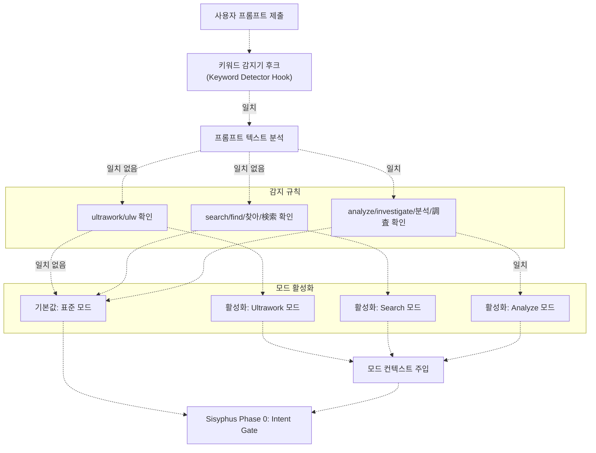
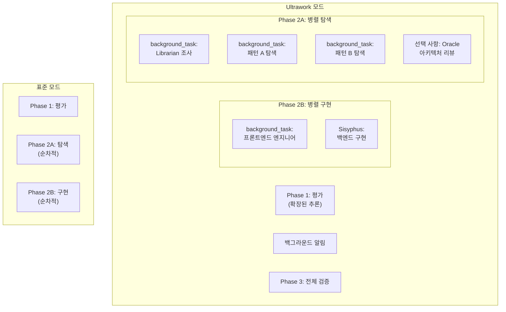
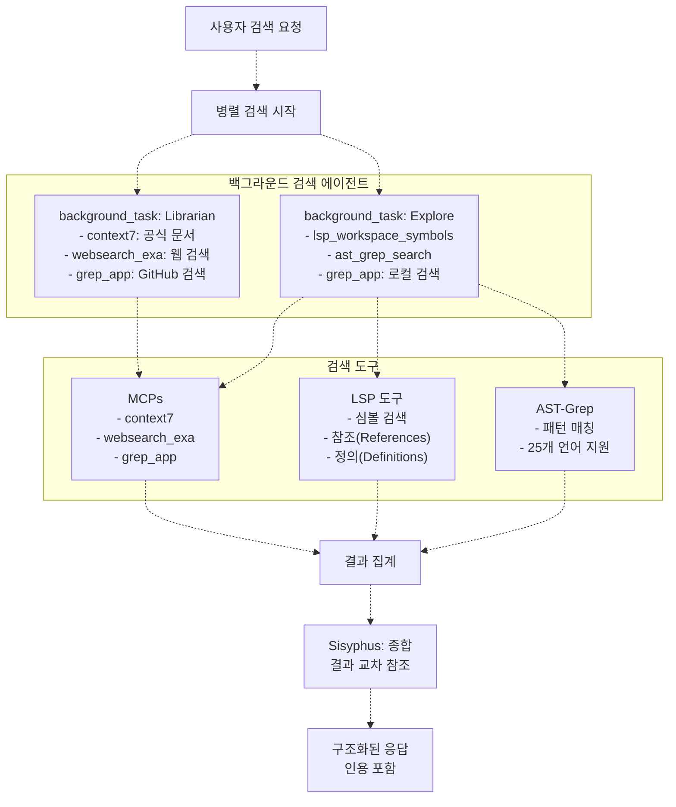
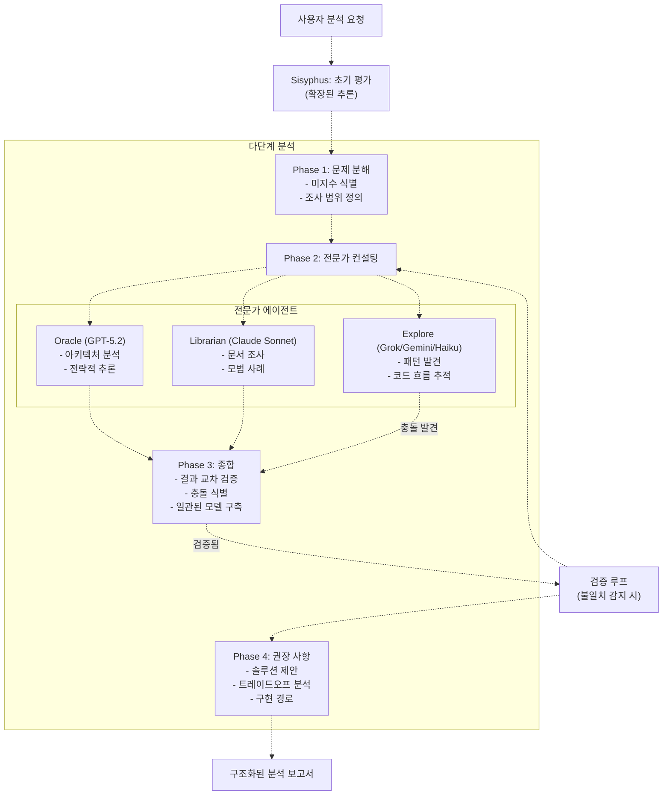
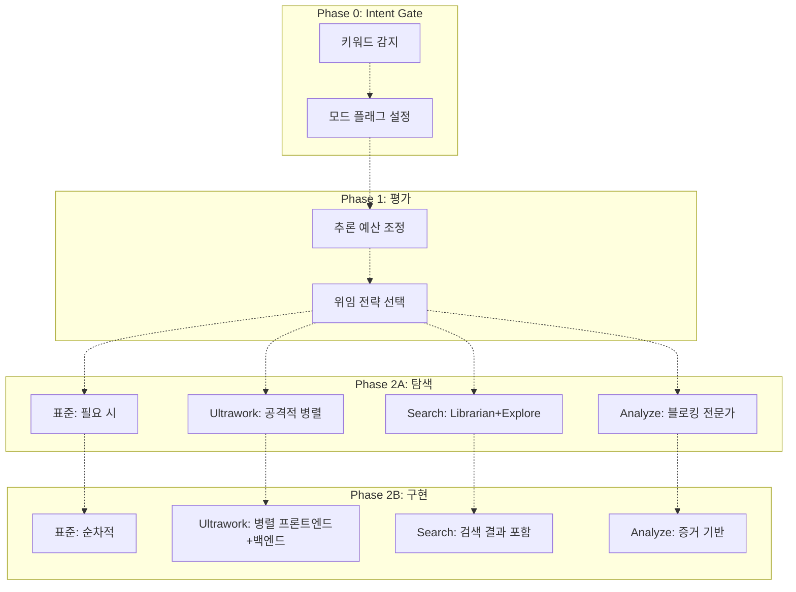

# 키워드 모드 (Keyword Modes)

> **관련 소스 파일**
> * [README.ja.md](https://github.com/code-yeongyu/oh-my-opencode/blob/b92cd6ab/README.ja.md)
> * [README.ko.md](https://github.com/code-yeongyu/oh-my-opencode/blob/b92cd6ab/README.ko.md)
> * [README.md](https://github.com/code-yeongyu/oh-my-opencode/blob/b92cd6ab/README.md)
> * [README.zh-cn.md](https://github.com/code-yeongyu/oh-my-opencode/blob/b92cd6ab/README.zh-cn.md)
> * [src/shared/config-path.ts](https://github.com/code-yeongyu/oh-my-opencode/blob/b92cd6ab/src/shared/config-path.ts)

## 목적 및 범위 (Purpose and Scope)

이 문서는 사용자 프롬프트에서 특정 키워드가 감지될 때 특화된 워크플로우를 자동으로 활성화하는 oh-my-opencode의 키워드 기반 오케스트레이션(Orchestration) 모드에 대해 설명합니다. 이러한 모드는 다양한 작업 유형에 따라 에이전트의 동작을 최적화합니다. 여기에는 최대 성능의 병렬 실행(`ultrawork`), 집중적인 검색 작업(`search`), 그리고 심층적인 분석 추론(`analyze`)이 포함됩니다.

기반이 되는 에이전트 오케스트레이션 시스템에 대한 정보는 [Sisyphus Orchestrator](/code-yeongyu/oh-my-opencode/4.1-sisyphus-orchestrator)를 참조하십시오. 개별 에이전트 설정에 대해서는 [Agent Configuration](/code-yeongyu/oh-my-opencode/4.3-agent-configuration)을, 동적 컨텍스트 프루닝(Dynamic context pruning)과 같은 실험적 기능에 대해서는 [Experimental Features](/code-yeongyu/oh-my-opencode/11.1-experimental-features)를 참조하십시오.

---

## 키워드 감지 시스템 (Keyword Detection System)

키워드 감지기는 사용자 프롬프트가 Sisyphus에 도달하기 전에 이를 분석하여, 사용자의 의도와 필요한 최적화 전략을 나타내는 트리거 단어를 식별합니다. 감지는 Sisyphus의 Intent Gate(Phase 0) 이전인 요청 수신 단계에서 발생합니다.

### 키워드 감지 흐름 (Keyword Detection Flow)



**출처:** README.md:670-673, High-Level Diagrams (Diagram 3)

### 감지 메커니즘 (Detection Mechanism)

키워드 감지기는 다음과 같은 전처리 후크(Pre-processing hook)로 작동합니다:

1. **원시 사용자 프롬프트 스캔**: 트리거 키워드를 대소문자 구분 없이 검색합니다.
2. **다국어 지원**: 해외 사용자를 위해 여러 언어를 지원합니다.
3. **모드별 컨텍스트 주입**: Sisyphus가 요청을 처리하기 전에 시스템 프롬프트에 모드별 지침을 삽입합니다.
4. **실행 플래그 설정**: Sisyphus의 위임 전략을 수정하는 실행 플래그를 설정합니다.

| 모드 | 영어 키워드 | 한국어 | 일본어 | 중국어 |
| --- | --- | --- | --- | --- |
| **Ultrawork** | `ultrawork`, `ulw` | - | - | - |
| **Search** | `search`, `find` | `찾아` | `検索` | - |
| **Analyze** | `analyze`, `investigate` | `분석` | `調査` | - |

**출처:** README.md:670-673

---

## Ultrawork 모드

### 목적

Ultrawork 모드는 공격적인 병렬 실행, 백그라운드 작업 위임 및 확장된 추론 예산(Thinking budgets)을 통해 최대 성능의 오케스트레이션을 활성화합니다. 이 모드는 속도와 완결성이 중요한 복잡하고 다각적인 작업을 위해 설계되었습니다.

### 워크플로우 수정 사항 (Workflow Modifications)



**출처:** README.md:670-673, README.md:184-189, High-Level Diagrams (Diagram 3)

### 동작 변화 (Behavioral Changes)

Ultrawork 모드가 활성화되면 Sisyphus는 다음과 같이 동작합니다:

| 항목 | 표준 동작 | Ultrawork 동작 |
| --- | --- | --- |
| **에이전트 위임** | 순차적, 필요 시 생성 | 공격적인 병렬 생성 |
| **백그라운드 작업** | 보수적 (이득이 있을 때만) | 광범위함 (frontend/librarian/explore) |
| **추론 예산** | 기본값 (모델에 따라 다름) | 지원되는 최대치까지 확장 |
| **탐색 단계** | 단일 관점 | 다수의 동시 관점 |
| **리스크 허용도** | 신중함 | 높음 (완벽한 계획보다 빠른 반복 우선) |

### 활성화 컨텍스트 주입 (Activation Context Injection)

키워드 감지기는 Sisyphus의 시스템 프롬프트를 수정하는 지침을 주입합니다:

* "사용자가 **최대 성능 모드(maximum performance mode)**를 요청했습니다. 보수적인 리소스 사용보다 속도와 완결성을 우선시하십시오."
* "병렬 작업을 위해 백그라운드 에이전트를 공격적으로 생성하십시오. 순차적 완료를 기다리지 마십시오."
* "복잡한 결정을 위해 확장된 추론을 사용하십시오. 다각도 탐색을 활성화하십시오."
* "가능한 경우 프론트엔드와 백엔드 작업을 병렬로 진행하십시오."

**출처:** README.md:670-673, README.md:184-191

---

## Search 모드

### 목적

Search 모드는 로컬 코드베이스, 외부 문서 및 공개 GitHub 리포지토리 등 다양한 소스에서의 정보 검색에 최적화되어 있습니다. 이 모드는 도구 액세스 권한이 극대화된 병렬 검색 에이전트를 활성화합니다.

### 검색 전략 (Search Strategy)



**출처:** README.md:670-673, High-Level Diagrams (Diagram 5), README.md:161-163

### 다국어 지원 (Multi-Language Support)

Search 모드는 해외 사용자를 위해 여러 언어의 키워드를 인식합니다:

* **영어**: `search`, `find`
* **한국어**: `찾아`
* **일본어**: `検索`

모든 변형 키워드는 동일한 검색 오케스트레이션 동작을 트리거합니다.

**출처:** README.md:670-673

### 검색 실행 패턴 (Search Execution Pattern)

1. **즉각적인 병렬 실행**: `librarian`과 `explore` 에이전트가 동시에 백그라운드 작업으로 생성됩니다.
2. **도구 극대화**: 각 에이전트에게 모든 검색 가능 도구(LSP, AST-grep, MCPs)에 대한 액세스 권한이 부여됩니다.
3. **대기 없음**: 검색이 실행되는 동안 Sisyphus는 계획 수립을 계속합니다.
4. **결과 집계**: 모든 백그라운드 작업이 완료되면 Sisyphus는 알림을 받고 결과를 종합합니다.
5. **인용 요구 사항**: Librarian 및 Explore 에이전트는 소스 참조가 포함된 증거 기반 답변을 제공해야 합니다.

| 검색 범위 | 에이전트 | 주요 도구 | 출력 형식 |
| --- | --- | --- | --- |
| **외부 문서** | Librarian | context7, websearch_exa, grep_app | URL이 포함된 증거 기반 답변 |
| **로컬 코드베이스** | Explore | lsp_workspace_symbols, ast_grep_search, grep_app | 파일 경로, 라인 번호, 정의 |
| **교차 리포지토리 예시** | Librarian + Explore | grep_app (두 에이전트 모두) | GitHub 리포지토리 참조 |

**출처:** README.md:670-673, README.md:467-472, High-Level Diagrams (Diagram 5)

---

## Analyze 모드

### 목적

Analyze 모드는 다단계 전문가 컨설팅을 통한 심층 추론을 활성화합니다. 이 모드는 디버깅, 아키텍처 결정 및 논리적 엄밀함이 필요한 복잡한 문제 해결에 최적화되어 있습니다.

### 분석 워크플로우 (Analysis Workflow)



**출처:** README.md:670-673, README.md:164-166

### 다국어 지원 (Multi-Language Support)

Analyze 모드는 여러 언어의 키워드를 인식합니다:

* **영어**: `analyze`, `investigate`
* **한국어**: `분석`
* **일본어**: `調査`

**출처:** README.md:670-673

### 전문가 컨설팅 전략 (Expert Consultation Strategy)

Analyze 모드는 Sisyphus의 동작을 다음과 같이 수정합니다:

1. **추론 예산 확장**: 모델이 지원하는 최대치까지 확장합니다.
2. **선제적 Oracle 호출**: 아키텍처 및 전략적 질문에 대해 Oracle을 즉시 호출합니다 (보통은 실패 복구용으로 예약됨).
3. **전문가 응답 대기(Blocking)**: 백그라운드 작업을 사용하는 대신 전문가의 응답을 기다립니다 (순차적 추론 보장).
4. **결과 교차 검증**: 결론을 제시하기 전에 여러 에이전트 간의 결과를 교차 검증합니다.
5. **증거 요구**: 모든 주장(인용, 코드 참조 또는 문서화된 추론)에 대한 증거를 요구합니다.

| 분석 항목 | 에이전트 | 역할 | 실행 모드 |
| --- | --- | --- | --- |
| **아키텍처 및 전략** | Oracle (GPT-5.2) | 심층 논리 추론, 트레이드오프 분석 | 블로킹 (run_in_background=false) |
| **도메인 지식** | Librarian (Claude Sonnet) | 문서, 모범 사례, 선례 | 블로킹 |
| **코드 구조** | Explore (Grok/Gemini/Haiku) | 패턴 발견, 흐름 추적 | 블로킹 |
| **종합** | Sisyphus (Opus 4.5) | 교차 검증, 충돌 해결 | 기본(Primary) |

**출처:** README.md:670-673, README.md:467-472, High-Level Diagrams (Diagram 3)

---

## Sisyphus 워크플로우와의 통합 (Integration with Sisyphus Workflow)

### 단계별 수정 사항 (Phase-Specific Modifications)



**출처:** README.md:670-673, High-Level Diagrams (Diagram 3), README.md:164-191

### 모드가 Sisyphus 단계에 미치는 영향 (Mode Impact on Sisyphus Phases)

| Sisyphus 단계 | 표준 (Standard) | Ultrawork | Search | Analyze |
| --- | --- | --- | --- | --- |
| **Phase 0: Intent Gate** | 요청 분류 | 분류 + 병렬 플래그 설정 | 분류 + 검색 플래그 설정 | 분류 + 전문가 플래그 설정 |
| **Phase 1: 평가** | 기본 추론 | 확장된 추론 | 기본 추론 | 확장된 추론 |
| **Phase 2A: 탐색** | 보수적 위임 | 공격적 병렬 | 병렬 librarian+explore | 블로킹 전문가 컨설팅 |
| **Phase 2B: 구현** | 순차적 | 병렬 프론트엔드+백엔드 | 검색 결과 포함 순차적 | 증거 기반 순차적 |
| **Phase 2C: 복구** | 3회 실패 → Oracle | 임계값 감소 | 검색 계속 | 즉각적인 Oracle 호출 |
| **Phase 3: 완료** | 표준 검증 | 병렬 검증 | 인용 유효성 검사 | 논리적 일관성 체크 |

**출처:** README.md:670-673, High-Level Diagrams (Diagram 3)

---

## 설정 및 커스터마이징 (Configuration and Customization)

### 키워드 감지 비활성화 (Disabling Keyword Detection)

키워드 감지기는 `disabled_hooks` 설정을 통해 비활성화할 수 있습니다:

```json
{
  "disabled_hooks": ["keyword-detector"]
}
```

비활성화되면 프롬프트에 키워드가 있더라도 모든 요청이 표준 모드로 처리됩니다.

**출처:** README.md:868

### 모드 조합 (Combining Modes)

하나의 프롬프트에 여러 키워드가 나타날 수 있습니다. 우선순위는 다음과 같습니다:

1. **Ultrawork** (가장 높은 우선순위 - 다른 모드를 무시함)
2. **Analyze** (중간 우선순위 - Search를 무시함)
3. **Search** (가장 낮은 우선순위)

예를 들어, "ultrawork: analyze the codebase and find all usages"라는 프롬프트는 **ultrawork 모드**만 활성화하며, analyze 및 search 키워드는 무시됩니다.

### 모드별 후크 상호작용 (Mode-Specific Hook Interactions)

키워드 모드는 안정성 레이어(Reliability layer)의 다른 후크들과 상호작용합니다:

| 후크 | 표준 | Ultrawork | Search | Analyze |
| --- | --- | --- | --- | --- |
| **Context Window Monitor** | 70% 경고 | 80% 경고 (더 많은 여유 공간 사용) | 70% 경고 | 70% 경고 |
| **Todo Continuation** | 강제 적용 | 강제 적용 + 병렬 완료 | 강제 적용 | 강제 적용 + 검증 |
| **Agent Usage Reminder** | 활성 | 억제됨 (이미 에이전트 사용 중) | 억제됨 | 억제됨 |
| **Background Notification** | 표준 | 높은 빈도 (많은 작업) | 표준 | 드묾 (대부분 블로킹) |

**출처:** README.md:670-693

---

## 설정 파일 참조 (Configuration File References)

키워드 모드는 키워드 감지기 후크에 의해 제어되며, 다음 위치에서 설정할 수 있습니다:

* 사용자 수준: `~/.config/opencode/oh-my-opencode.json`
* 프로젝트 수준: `.opencode/oh-my-opencode.json`

**출처:** src/shared/config-path.ts:38-47

---

## 요약 (Summary)

키워드 모드는 다양한 작업 유형에 최적화된 특화 오케스트레이션 전략을 활성화하는 선언적인 방법을 제공합니다:

* **Ultrawork**: 최대 병렬 실행, 공격적인 에이전트 생성, 확장된 추론.
* **Search**: 인용 요구 사항이 포함된 로컬/외부 소스 간의 병렬 검색.
* **Analyze**: 교차 검증 및 증거 기반 추론을 통한 다단계 전문가 컨설팅.

이러한 모드는 초기 평가부터 완료 검증에 이르기까지 모든 워크플로우 단계에서 Sisyphus의 동작을 수정하여, 각 작업 유형에 적절한 리소스 할당과 실행 전략을 보장합니다.

**출처:** README.md:670-673, README.md:184-191, High-Level Diagrams (Diagrams 1, 3)