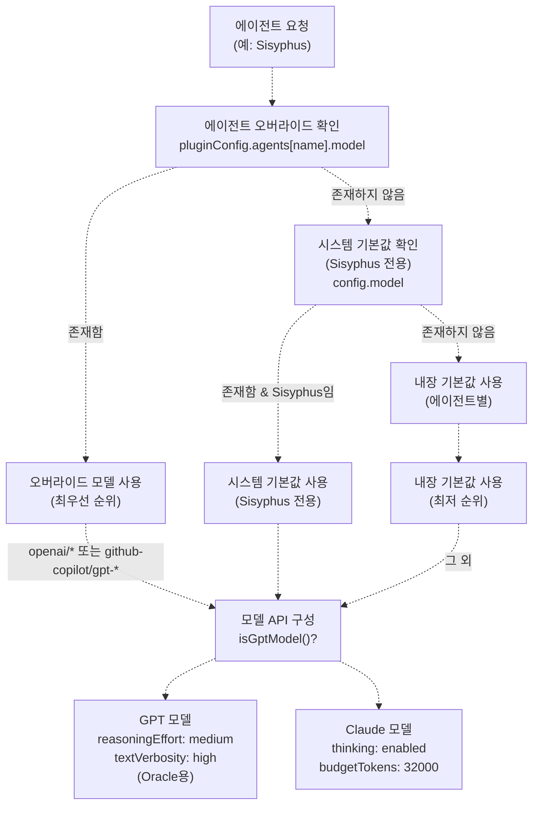
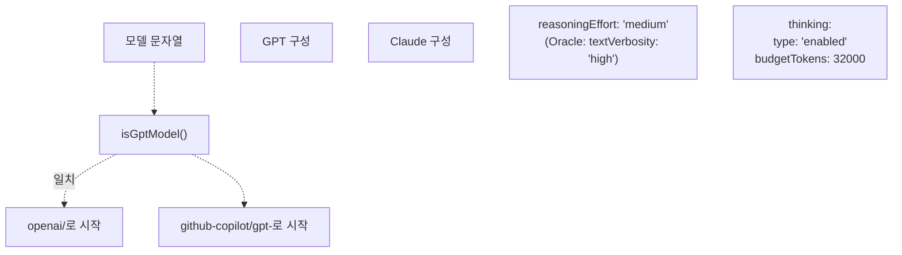
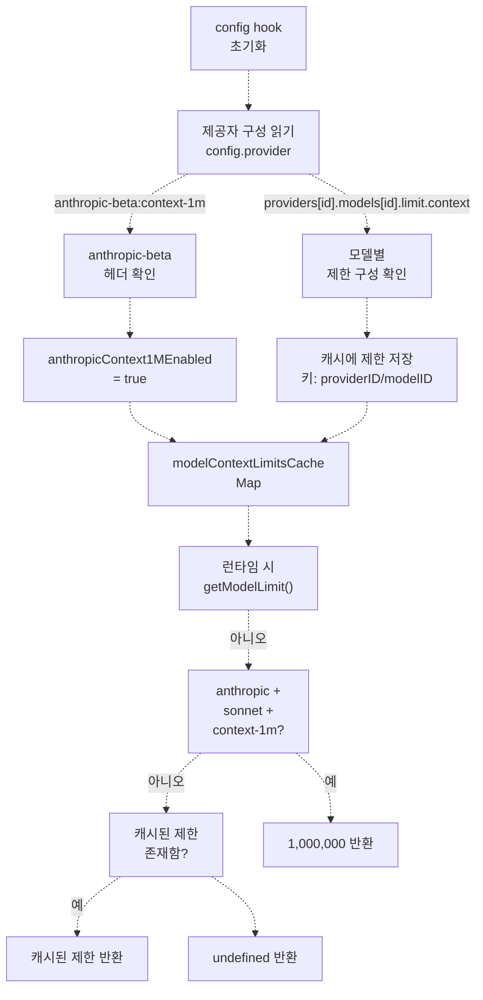
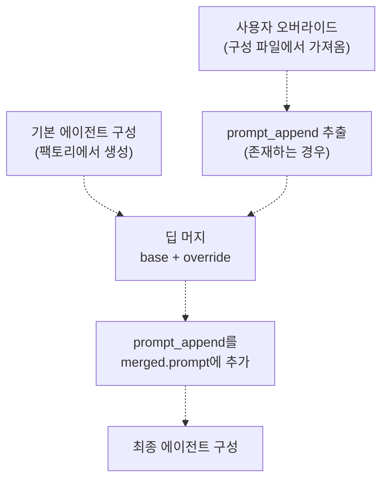

# 모델 구성 (Model Configuration)

> **관련 소스 파일**
> * [.github/assets/sisyphus.png](https://github.com/code-yeongyu/oh-my-opencode/blob/b92cd6ab/.github/assets/sisyphus.png)
> * [assets/oh-my-opencode.schema.json](https://github.com/code-yeongyu/oh-my-opencode/blob/b92cd6ab/assets/oh-my-opencode.schema.json)
> * [src/agents/index.ts](https://github.com/code-yeongyu/oh-my-opencode/blob/b92cd6ab/src/agents/index.ts)
> * [src/agents/sisyphus.ts](https://github.com/code-yeongyu/oh-my-opencode/blob/b92cd6ab/src/agents/sisyphus.ts)
> * [src/agents/types.ts](https://github.com/code-yeongyu/oh-my-opencode/blob/b92cd6ab/src/agents/types.ts)
> * [src/agents/utils.test.ts](https://github.com/code-yeongyu/oh-my-opencode/blob/b92cd6ab/src/agents/utils.test.ts)
> * [src/agents/utils.ts](https://github.com/code-yeongyu/oh-my-opencode/blob/b92cd6ab/src/agents/utils.ts)
> * [src/config/schema.ts](https://github.com/code-yeongyu/oh-my-opencode/blob/b92cd6ab/src/config/schema.ts)
> * [src/hooks/index.ts](https://github.com/code-yeongyu/oh-my-opencode/blob/b92cd6ab/src/hooks/index.ts)
> * [src/index.ts](https://github.com/code-yeongyu/oh-my-opencode/blob/b92cd6ab/src/index.ts)

이 페이지는 oh-my-opencode가 모델 선택 로직, 모델별 API 파라미터(thinking vs reasoning effort), 제공자(provider) 설정 및 컨텍스트 제한(context limits)을 포함하여 다양한 에이전트를 위해 AI 모델을 구성하는 방법을 설명합니다. 프롬프트와 도구를 포함한 일반적인 에이전트 구성에 대해서는 [에이전트 구성](/code-yeongyu/oh-my-opencode/4.3-agent-configuration)을 참조하십시오. 전체 스키마 레퍼런스는 [구성 스키마 레퍼런스](/code-yeongyu/oh-my-opencode/13.1-configuration-schema-reference)를 참조하십시오.

## 모델 선택 우선순위 (Model Selection Precedence)

에이전트의 모델 선택은 3단계 우선순위 계층을 따르며, 사용자 오버라이드(override, 재정의)가 시스템 기본값보다 우선합니다.

**모델 선택 우선순위 다이어그램**



출처: [src/agents/utils.ts L79-L112](https://github.com/code-yeongyu/oh-my-opencode/blob/b92cd6ab/src/agents/utils.ts#L79-L112)

 [src/agents/sisyphus.ts L528-L544](https://github.com/code-yeongyu/oh-my-opencode/blob/b92cd6ab/src/agents/sisyphus.ts#L528-L544)

 [src/agents/types.ts L5-L7](https://github.com/code-yeongyu/oh-my-opencode/blob/b92cd6ab/src/agents/types.ts#L5-L7)

### 우선순위 규칙

| 우선순위 | 소스 | 범위 | 예시 |
| --- | --- | --- | --- |
| 1 (최고) | `agents[name].model` 오버라이드 | 에이전트별 | `agents.Sisyphus.model: "openai/gpt-5.2"` |
| 2 | 시스템 `config.model` | Sisyphus 전용 | Sisyphus에 전달된 시스템 기본 모델 |
| 3 (최저) | 내장 기본값 | 에이전트별 | Sisyphus의 경우 `anthropic/claude-opus-4-5`, Oracle의 경우 `openai/gpt-5.2` |

Sisyphus 에이전트는 오버라이드가 지정되지 않은 경우 시스템의 기본 모델을 상속받는다는 점에서 독특합니다 [src/agents/utils.ts L95](https://github.com/code-yeongyu/oh-my-opencode/blob/b92cd6ab/src/agents/utils.ts#L95-L95). 이를 통해 사용자의 주 모델 구독에 맞게 적응할 수 있습니다. 다른 모든 에이전트는 명시적으로 오버라이드되지 않는 한 내장된 기본값을 사용합니다.

출처: [src/agents/utils.ts L79-L112](https://github.com/code-yeongyu/oh-my-opencode/blob/b92cd6ab/src/agents/utils.ts#L79-L112)

 [src/index.ts L404-L409](https://github.com/code-yeongyu/oh-my-opencode/blob/b92cd6ab/src/index.ts#L404-L409)

## 모델별 API 파라미터

다양한 AI 제공자는 서로 다른 추론 제어 파라미터를 노출합니다. Oh-my-opencode는 모델 유형을 감지하고 적절한 파라미터를 자동으로 구성합니다.

### Thinking vs Reasoning Effort

시스템은 모델이 GPT 변형인지 Claude 변형인지에 따라 다른 파라미터를 사용합니다.

**모델 유형 감지 및 구성**



출처: [src/agents/types.ts L5-L7](https://github.com/code-yeongyu/oh-my-opencode/blob/b92cd6ab/src/agents/types.ts#L5-L7)

 [src/agents/sisyphus.ts L539-L543](https://github.com/code-yeongyu/oh-my-opencode/blob/b92cd6ab/src/agents/sisyphus.ts#L539-L543)

#### Claude 모델: Thinking 구성

Claude 모델(Anthropic)은 내부 추론을 활성화하기 위해 `thinking` 파라미터를 사용합니다.

```yaml
{
  thinking: {
    type: "enabled",
    budgetTokens: 32000
  }
}
```

`budgetTokens` 필드는 모델이 응답을 생성하기 전에 내부 사고를 위해 사용할 수 있는 최대 토큰을 제한합니다. 이는 Sisyphus를 포함한 모든 Claude 기반 에이전트에 적용됩니다 [src/agents/sisyphus.ts L543](https://github.com/code-yeongyu/oh-my-opencode/blob/b92cd6ab/src/agents/sisyphus.ts#L543-L543).

출처: [src/agents/sisyphus.ts L528-L544](https://github.com/code-yeongyu/oh-my-opencode/blob/b92cd6ab/src/agents/sisyphus.ts#L528-L544)

#### GPT 모델: Reasoning Effort

GPT 모델(OpenAI, GitHub Copilot)은 thinking 토큰 대신 `reasoningEffort`를 사용합니다.

```yaml
{
  reasoningEffort: "medium"
}
```

유효한 값은 `"low"`, `"medium"`, `"high"`입니다. 시스템은 모든 GPT 기반 에이전트에 대해 기본적으로 `"medium"`을 사용합니다 [src/agents/sisyphus.ts L540](https://github.com/code-yeongyu/oh-my-opencode/blob/b92cd6ab/src/agents/sisyphus.ts#L540-L540).

특히 Oracle 에이전트의 경우, Oracle의 목적이 포괄적인 아키텍처 가이드를 제공하는 것이므로 추론 설명의 상세도를 극대화하기 위해 GPT 모델에 `textVerbosity: "high"`도 함께 전달됩니다.

출처: [src/agents/sisyphus.ts L528-L544](https://github.com/code-yeongyu/oh-my-opencode/blob/b92cd6ab/src/agents/sisyphus.ts#L528-L544)

 [src/agents/utils.test.ts L17-L30](https://github.com/code-yeongyu/oh-my-opencode/blob/b92cd6ab/src/agents/utils.test.ts#L17-L30)

### 구성 테이블

| 모델 유형 | 감지 패턴 | 적용되는 파라미터 | 예시 모델 |
| --- | --- | --- | --- |
| GPT | `openai/*` | `reasoningEffort: "medium"` | `openai/gpt-5.2` |
| GPT | `github-copilot/gpt-*` | `reasoningEffort: "medium"` | `github-copilot/gpt-5.2` |
| Claude | 그 외 모든 것 | `thinking: { type: "enabled", budgetTokens: 32000 }` | `anthropic/claude-opus-4-5`, `anthropic/claude-sonnet-4-5` |

출처: [src/agents/types.ts L5-L7](https://github.com/code-yeongyu/oh-my-opencode/blob/b92cd6ab/src/agents/types.ts#L5-L7)

 [src/agents/sisyphus.ts L528-L544](https://github.com/code-yeongyu/oh-my-opencode/blob/b92cd6ab/src/agents/sisyphus.ts#L528-L544)

### Temperature 및 Top-P

표준 샘플링 파라미터는 에이전트별로 구성 가능합니다.

| 파라미터 | 유형 | 범위 | 기본값 | 목적 |
| --- | --- | --- | --- | --- |
| `temperature` | number | 0.0 - 2.0 | 모델별 | 출력의 무작위성 제어 |
| `top_p` | number | 0.0 - 1.0 | 모델별 | 핵 샘플링(Nucleus sampling) 임계값 |

이 값들은 에이전트 구성에서 오버라이드할 수 있습니다 [src/config/schema.ts L76-L77](https://github.com/code-yeongyu/oh-my-opencode/blob/b92cd6ab/src/config/schema.ts#L76-L77).

출처: [src/config/schema.ts L74-L89](https://github.com/code-yeongyu/oh-my-opencode/blob/b92cd6ab/src/config/schema.ts#L74-L89)

## 제공자 구성 (Provider Configuration)

제공자 수준의 설정은 OpenCode의 메인 구성에서 설정되며 초기화 중에 플러그인에 의해 액세스됩니다.

### 컨텍스트 제한 감지

플러그인은 두 가지 소스에서 컨텍스트 제한을 모니터링하고 캐싱합니다.

**컨텍스트 제한 확인 흐름**



출처: [src/index.ts L224-L236](https://github.com/code-yeongyu/oh-my-opencode/blob/b92cd6ab/src/index.ts#L224-L236)

 [src/index.ts L362-L386](https://github.com/code-yeongyu/oh-my-opencode/blob/b92cd6ab/src/index.ts#L362-L386)

#### Anthropic Beta 기능 감지

플러그인은 Anthropic 제공자 헤더에서 `context-1m` 베타 기능을 감지합니다.

```javascript
const anthropicBeta = providers?.anthropic?.options?.headers?.["anthropic-beta"];
anthropicContext1MEnabled = anthropicBeta?.includes("context-1m") ?? false;
```

활성화되면 Sonnet 모델은 자동으로 1,000,000 토큰 컨텍스트 제한을 부여받습니다 [src/index.ts L369-L370](https://github.com/code-yeongyu/oh-my-opencode/blob/b92cd6ab/src/index.ts#L369-L370) [src/index.ts L232-L235](https://github.com/code-yeongyu/oh-my-opencode/blob/b92cd6ab/src/index.ts#L232-L235).

이를 통해 사용자는 OpenCode의 제공자 설정을 구성하여 확장된 컨텍스트를 활성화할 수 있습니다.

```json
{
  "provider": {
    "anthropic": {
      "options": {
        "headers": {
          "anthropic-beta": "max-tokens-3-5-sonnet-2024-07-15,context-1m"
        }
      }
    }
  }
}
```

출처: [src/index.ts L224-L236](https://github.com/code-yeongyu/oh-my-opencode/blob/b92cd6ab/src/index.ts#L224-L236)

 [src/index.ts L362-L386](https://github.com/code-yeongyu/oh-my-opencode/blob/b92cd6ab/src/index.ts#L362-L386)

#### 모델별 제한

컨텍스트 제한은 OpenCode의 제공자 구성에서 모델별로 설정할 수 있습니다.

```json
{
  "provider": {
    "anthropic": {
      "models": {
        "claude-sonnet-4-5": {
          "limit": {
            "context": 500000
          }
        }
      }
    }
  }
}
```

플러그인은 효율적인 조회를 위해 이러한 제한을 `providerID/modelID` 키 형식으로 캐싱합니다 [src/index.ts L372-L385](https://github.com/code-yeongyu/oh-my-opencode/blob/b92cd6ab/src/index.ts#L372-L385).

출처: [src/index.ts L362-L386](https://github.com/code-yeongyu/oh-my-opencode/blob/b92cd6ab/src/index.ts#L362-L386)

### 캐시 구조

| 변수 | 유형 | 목적 | 액세스 패턴 |
| --- | --- | --- | --- |
| `modelContextLimitsCache` | `Map<string, number>` | 모델별 컨텍스트 제한 저장 | 키: `"providerID/modelID"` |
| `anthropicContext1MEnabled` | `boolean` | 1M 컨텍스트 베타 기능 추적 | Anthropic Sonnet 모델을 위한 특수 사례 |
| `getModelLimit(providerID, modelID)` | Function | 런타임 시 제한 조회 | 선제적 압축(preemptive compaction) 훅에서 사용 |

`getModelLimit` 함수는 컨텍스트 제한 조회를 위한 통합 인터페이스를 제공하며, 캐시된 값으로 돌아가기 전에 Anthropic Sonnet 모델에 대한 1M 베타 플래그를 먼저 확인합니다 [src/index.ts L227-L236](https://github.com/code-yeongyu/oh-my-opencode/blob/b92cd6ab/src/index.ts#L227-L236).

출처: [src/index.ts L224-L236](https://github.com/code-yeongyu/oh-my-opencode/blob/b92cd6ab/src/index.ts#L224-L236)

## 에이전트 오버라이드 구성

에이전트 구성은 `oh-my-opencode.json` 구성 파일의 `agents` 키 아래에서 오버라이드할 수 있습니다.

### 사용 가능한 오버라이드 필드

`AgentOverrideConfig` 스키마는 모든 구성 가능한 파라미터를 정의합니다.

| 필드 | 유형 | 설명 | 예시 |
| --- | --- | --- | --- |
| `model` | `string` | 모델 선택 오버라이드 | `"openai/gpt-5.2"` |
| `temperature` | `number` | 샘플링 온도 (0-2) | `0.7` |
| `top_p` | `number` | 핵 샘플링 (0-1) | `0.9` |
| `prompt` | `string` | 전체 시스템 프롬프트 교체 | 전체 프롬프트 텍스트 |
| `prompt_append` | `string` | 시스템 프롬프트에 추가 | 추가 지침 |
| `tools` | `Record<string, boolean>` | 특정 도구 활성화/비활성화 | `{ "bash": false }` |
| `disable` | `boolean` | 에이전트 완전히 비활성화 | `true` |
| `description` | `string` | 에이전트 설명 변경 | 사용자 정의 설명 |
| `mode` | `"subagent" \| "primary" \| "all"` | 에이전트 호출 모드 | `"subagent"` |
| `color` | `string` | UI 색상 (hex) | `"#FF5733"` |
| `permission` | `AgentPermissionSchema` | 권한 오버라이드 | 권한 객체 |

출처: [src/config/schema.ts L74-L89](https://github.com/code-yeongyu/oh-my-opencode/blob/b92cd6ab/src/config/schema.ts#L74-L89)

### 구성 병합 동작

오버라이드가 지정되면 시스템은 기본 구성과 오버라이드 구성을 딥 머지(deep merge, 깊은 병합)합니다 [src/agents/utils.ts L65-L77](https://github.com/code-yeongyu/oh-my-opencode/blob/b92cd6ab/src/agents/utils.ts#L65-L77).

**오버라이드 병합 프로세스**



`prompt_append` 필드는 특별하게 처리됩니다. 이 필드는 최종 병합된 프롬프트를 대체하는 대신 그 끝에 추가됩니다 [src/agents/utils.ts L72-L74](https://github.com/code-yeongyu/oh-my-opencode/blob/b92cd6ab/src/agents/utils.ts#L72-L74).

출처: [src/agents/utils.ts L65-L77](https://github.com/code-yeongyu/oh-my-opencode/blob/b92cd6ab/src/agents/utils.ts#L65-L77)

### 오버라이드 가능한 에이전트

| 에이전트 이름 | 오버라이드 키 | 기본 모델 | 비고 |
| --- | --- | --- | --- |
| Sisyphus | `"Sisyphus"` | `anthropic/claude-opus-4-5` | 주 오케스트레이터 |
| Oracle | `"oracle"` | `openai/gpt-5.2` | 아키텍처 조언자 |
| Librarian | `"librarian"` | `anthropic/claude-sonnet-4-5` | 외부 리서치 |
| Explore | `"explore"` | `google/gemini-grok` | 코드 검색 |
| Frontend Engineer | `"frontend-ui-ux-engineer"` | `google/gemini-pro-1.5` | UI/UX 작업 |
| Document Writer | `"document-writer"` | `google/gemini-flash-2.0` | 문서화 |
| Multimodal Looker | `"multimodal-looker"` | `google/gemini-flash-2.0` | 미디어 분석 |
| OpenCode Builder | `"OpenCode-Builder"` | 시스템 기본값 | 빌드 에이전트용 선택적 래퍼 |
| Planner Sisyphus | `"Planner-Sisyphus"` | 시스템 기본값 | 플랜 에이전트용 선택적 래퍼 |

출처: [src/config/schema.ts L91-L103](https://github.com/code-yeongyu/oh-my-opencode/blob/b92cd6ab/src/config/schema.ts#L91-L103)

## 구성 예시

### 예시 1: Sisyphus를 GPT-5.2로 전환

```json
{
  "$schema": "https://raw.githubusercontent.com/code-yeongyu/oh-my-opencode/master/assets/oh-my-opencode.schema.json",
  "agents": {
    "Sisyphus": {
      "model": "openai/gpt-5.2"
    }
  }
}
```

결과: Sisyphus는 `thinking` 토큰 대신 `reasoningEffort: "medium"`을 사용하게 됩니다 [src/agents/utils.test.ts L17-L30](https://github.com/code-yeongyu/oh-my-opencode/blob/b92cd6ab/src/agents/utils.test.ts#L17-L30).

출처: [src/agents/utils.test.ts L17-L30](https://github.com/code-yeongyu/oh-my-opencode/blob/b92cd6ab/src/agents/utils.test.ts#L17-L30)

 [src/config/schema.ts L91-L103](https://github.com/code-yeongyu/oh-my-opencode/blob/b92cd6ab/src/config/schema.ts#L91-L103)

### 예시 2: Oracle을 Claude로 전환

```json
{
  "agents": {
    "oracle": {
      "model": "anthropic/claude-sonnet-4"
    }
  }
}
```

결과: Oracle은 `reasoningEffort` 대신 `thinking: { type: "enabled", budgetTokens: 32000 }`를 사용하게 되며, `textVerbosity: "high"` 파라미터는 제거됩니다 [src/agents/utils.test.ts L58-L72](https://github.com/code-yeongyu/oh-my-opencode/blob/b92cd6ab/src/agents/utils.test.ts#L58-L72).

출처: [src/agents/utils.test.ts L58-L72](https://github.com/code-yeongyu/oh-my-opencode/blob/b92cd6ab/src/agents/utils.test.ts#L58-L72)

### 예시 3: 결정론적 응답을 위해 Temperature 낮추기

```json
{
  "agents": {
    "Sisyphus": {
      "temperature": 0.3
    },
    "oracle": {
      "temperature": 0.2
    }
  }
}
```

결과: 낮은 temperature 값은 에이전트 응답의 결정론적 성격(determinism)을 높입니다.

출처: [src/config/schema.ts L74-L89](https://github.com/code-yeongyu/oh-my-opencode/blob/b92cd6ab/src/config/schema.ts#L74-L89)

### 예시 4: 사용자 정의 지침 추가

```json
{
  "agents": {
    "Sisyphus": {
      "prompt_append": "\n\nADDITIONAL CONSTRAINT: Always prefer functional programming patterns when working with TypeScript."
    }
  }
}
```

결과: 사용자 정의 지침이 Sisyphus의 시스템 프롬프트 끝에 추가됩니다 [src/agents/utils.ts L72-L74](https://github.com/code-yeongyu/oh-my-opencode/blob/b92cd6ab/src/agents/utils.ts#L72-L74).

출처: [src/agents/utils.ts L65-L77](https://github.com/code-yeongyu/oh-my-opencode/blob/b92cd6ab/src/agents/utils.ts#L65-L77)

### 예시 5: 여러 오버라이드 조합

```json
{
  "agents": {
    "Sisyphus": {
      "model": "github-copilot/gpt-5.2",
      "temperature": 0.5,
      "prompt_append": "\n\nAlways explain your reasoning before taking action.",
      "tools": {
        "bash": false
      }
    }
  }
}
```

결과: 모든 오버라이드가 기본 구성과 병합되어, 사용자 정의 temperature, 추가 지침이 적용된 GPT 모델로 전환되고 bash 도구는 비활성화됩니다.

출처: [src/agents/utils.ts L65-L77](https://github.com/code-yeongyu/oh-my-opencode/blob/b92cd6ab/src/agents/utils.ts#L65-L77)

 [src/config/schema.ts L74-L89](https://github.com/code-yeongyu/oh-my-opencode/blob/b92cd6ab/src/config/schema.ts#L74-L89)

## 환경 컨텍스트 주입 (Environment Context Injection)

Sisyphus 및 Librarian 에이전트는 에이전트 생성 중에 시스템 프롬프트에 환경 컨텍스트가 자동으로 추가됩니다 [src/agents/utils.ts L99-L102](https://github.com/code-yeongyu/oh-my-opencode/blob/b92cd6ab/src/agents/utils.ts#L99-L102).

**환경 컨텍스트 구조**

주입되는 컨텍스트에는 다음이 포함됩니다.

| 필드 | 소스 | 예시 값 |
| --- | --- | --- |
| 작업 디렉토리 | `directory` 파라미터 | `/home/user/project` |
| 플랫폼 | `process.platform` | `darwin`, `linux`, `win32` |
| 오늘 날짜 | `Date.toLocaleDateString()` | `Wed, Jan 15, 2025` |
| 현재 시간 | `Date.toLocaleTimeString()` | `02:30:45 PM` |
| 시간대 | `Intl.DateTimeFormat().resolvedOptions().timeZone` | `America/Los_Angeles` |
| 로케일 | `Intl.DateTimeFormat().resolvedOptions().locale` | `en-US` |

컨텍스트는 일관된 파싱을 위해 XML 형식으로 구성됩니다 [src/agents/utils.ts L32-L63](https://github.com/code-yeongyu/oh-my-opencode/blob/b92cd6ab/src/agents/utils.ts#L32-L63).

```xml
<env>
  Working directory: /home/user/project
  Platform: darwin
  Today's date: Wed, Jan 15, 2025 (NOT 2024, NEVEREVER 2024)
  Current time: 02:30:45 PM
  Timezone: America/Los_Angeles
  Locale: en-US
</env>
```

이를 통해 에이전트는 명시적인 사용자 입력 없이도 정확한 시간 및 환경 컨텍스트를 가질 수 있습니다.

출처: [src/agents/utils.ts L32-L63](https://github.com/code-yeongyu/oh-my-opencode/blob/b92cd6ab/src/agents/utils.ts#L32-L63)

 [src/agents/utils.ts L99-L102](https://github.com/code-yeongyu/oh-my-opencode/blob/b92cd6ab/src/agents/utils.ts#L99-L102)