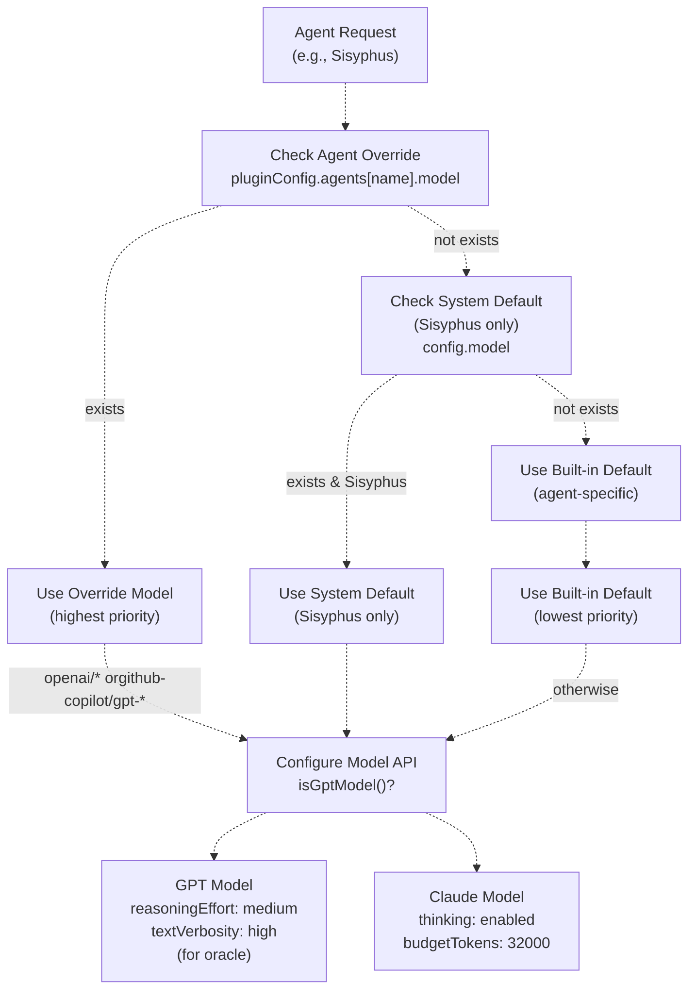
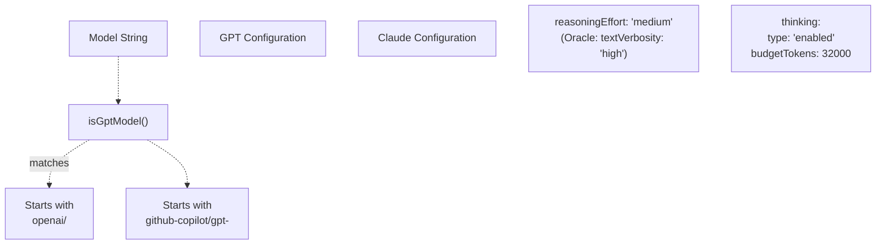
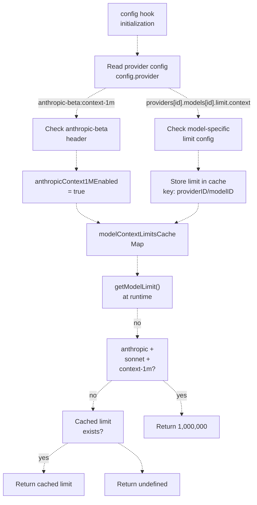
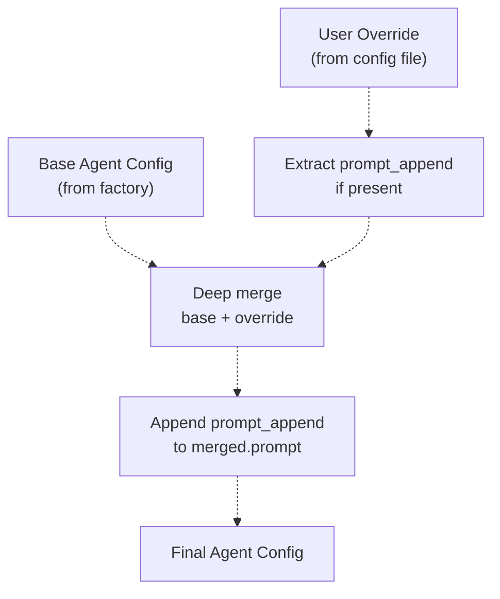

# Model Configuration

> **Relevant source files**
> * [.github/assets/sisyphus.png](https://github.com/code-yeongyu/oh-my-opencode/blob/b92cd6ab/.github/assets/sisyphus.png)
> * [assets/oh-my-opencode.schema.json](https://github.com/code-yeongyu/oh-my-opencode/blob/b92cd6ab/assets/oh-my-opencode.schema.json)
> * [src/agents/index.ts](https://github.com/code-yeongyu/oh-my-opencode/blob/b92cd6ab/src/agents/index.ts)
> * [src/agents/sisyphus.ts](https://github.com/code-yeongyu/oh-my-opencode/blob/b92cd6ab/src/agents/sisyphus.ts)
> * [src/agents/types.ts](https://github.com/code-yeongyu/oh-my-opencode/blob/b92cd6ab/src/agents/types.ts)
> * [src/agents/utils.test.ts](https://github.com/code-yeongyu/oh-my-opencode/blob/b92cd6ab/src/agents/utils.test.ts)
> * [src/agents/utils.ts](https://github.com/code-yeongyu/oh-my-opencode/blob/b92cd6ab/src/agents/utils.ts)
> * [src/config/schema.ts](https://github.com/code-yeongyu/oh-my-opencode/blob/b92cd6ab/src/config/schema.ts)
> * [src/hooks/index.ts](https://github.com/code-yeongyu/oh-my-opencode/blob/b92cd6ab/src/hooks/index.ts)
> * [src/index.ts](https://github.com/code-yeongyu/oh-my-opencode/blob/b92cd6ab/src/index.ts)

This page documents how oh-my-opencode configures AI models for different agents, including model selection logic, model-specific API parameters (thinking vs reasoning effort), provider settings, and context limits. For general agent configuration including prompts and tools, see [Agent Configuration](/code-yeongyu/oh-my-opencode/4.3-agent-configuration). For the complete schema reference, see [Configuration Schema Reference](/code-yeongyu/oh-my-opencode/13.1-configuration-schema-reference).

## Model Selection Precedence

Model selection for agents follows a three-tier precedence hierarchy, with user overrides taking priority over system defaults.

**Model Selection Precedence Diagram**



Sources: [src/agents/utils.ts L79-L112](https://github.com/code-yeongyu/oh-my-opencode/blob/b92cd6ab/src/agents/utils.ts#L79-L112)

 [src/agents/sisyphus.ts L528-L544](https://github.com/code-yeongyu/oh-my-opencode/blob/b92cd6ab/src/agents/sisyphus.ts#L528-L544)

 [src/agents/types.ts L5-L7](https://github.com/code-yeongyu/oh-my-opencode/blob/b92cd6ab/src/agents/types.ts#L5-L7)

### Precedence Rules

| Priority | Source | Scope | Example |
| --- | --- | --- | --- |
| 1 (Highest) | `agents[name].model` override | Per-agent | `agents.Sisyphus.model: "openai/gpt-5.2"` |
| 2 | System `config.model` | Sisyphus only | System default model passed to Sisyphus |
| 3 (Lowest) | Built-in default | Per-agent | `anthropic/claude-opus-4-5` for Sisyphus, `openai/gpt-5.2` for Oracle |

The Sisyphus agent is unique in that it inherits the system's default model if no override is specified [src/agents/utils.ts L95](https://github.com/code-yeongyu/oh-my-opencode/blob/b92cd6ab/src/agents/utils.ts#L95-L95)

 allowing it to adapt to the user's primary model subscription. All other agents use their built-in defaults unless explicitly overridden.

Sources: [src/agents/utils.ts L79-L112](https://github.com/code-yeongyu/oh-my-opencode/blob/b92cd6ab/src/agents/utils.ts#L79-L112)

 [src/index.ts L404-L409](https://github.com/code-yeongyu/oh-my-opencode/blob/b92cd6ab/src/index.ts#L404-L409)

## Model-Specific API Parameters

Different AI providers expose different inference control parameters. Oh-my-opencode detects the model type and configures appropriate parameters automatically.

### Thinking vs Reasoning Effort

The system uses different parameters depending on whether the model is a GPT variant or a Claude variant:

**Model Type Detection and Configuration**



Sources: [src/agents/types.ts L5-L7](https://github.com/code-yeongyu/oh-my-opencode/blob/b92cd6ab/src/agents/types.ts#L5-L7)

 [src/agents/sisyphus.ts L539-L543](https://github.com/code-yeongyu/oh-my-opencode/blob/b92cd6ab/src/agents/sisyphus.ts#L539-L543)

#### Claude Models: Thinking Configuration

Claude models (Anthropic) use the `thinking` parameter to enable internal reasoning:

```yaml
{
  thinking: {
    type: "enabled",
    budgetTokens: 32000
  }
}
```

The `budgetTokens` field limits the maximum tokens the model can use for internal thinking before generating the response. This is applied to all Claude-based agents including Sisyphus [src/agents/sisyphus.ts L543](https://github.com/code-yeongyu/oh-my-opencode/blob/b92cd6ab/src/agents/sisyphus.ts#L543-L543)

Sources: [src/agents/sisyphus.ts L528-L544](https://github.com/code-yeongyu/oh-my-opencode/blob/b92cd6ab/src/agents/sisyphus.ts#L528-L544)

#### GPT Models: Reasoning Effort

GPT models (OpenAI, GitHub Copilot) use `reasoningEffort` instead of thinking tokens:

```yaml
{
  reasoningEffort: "medium"
}
```

Valid values are `"low"`, `"medium"`, and `"high"`. The system defaults to `"medium"` for all GPT-based agents [src/agents/sisyphus.ts L540](https://github.com/code-yeongyu/oh-my-opencode/blob/b92cd6ab/src/agents/sisyphus.ts#L540-L540)

For the Oracle agent specifically, GPT models also receive `textVerbosity: "high"` to maximize the detail in reasoning explanations, since Oracle's purpose is to provide comprehensive architectural guidance.

Sources: [src/agents/sisyphus.ts L528-L544](https://github.com/code-yeongyu/oh-my-opencode/blob/b92cd6ab/src/agents/sisyphus.ts#L528-L544)

 [src/agents/utils.test.ts L17-L30](https://github.com/code-yeongyu/oh-my-opencode/blob/b92cd6ab/src/agents/utils.test.ts#L17-L30)

### Configuration Table

| Model Type | Detection Pattern | Parameters Applied | Example Models |
| --- | --- | --- | --- |
| GPT | `openai/*` | `reasoningEffort: "medium"` | `openai/gpt-5.2` |
| GPT | `github-copilot/gpt-*` | `reasoningEffort: "medium"` | `github-copilot/gpt-5.2` |
| Claude | Everything else | `thinking: { type: "enabled", budgetTokens: 32000 }` | `anthropic/claude-opus-4-5`, `anthropic/claude-sonnet-4-5` |

Sources: [src/agents/types.ts L5-L7](https://github.com/code-yeongyu/oh-my-opencode/blob/b92cd6ab/src/agents/types.ts#L5-L7)

 [src/agents/sisyphus.ts L528-L544](https://github.com/code-yeongyu/oh-my-opencode/blob/b92cd6ab/src/agents/sisyphus.ts#L528-L544)

### Temperature and Top-P

Standard sampling parameters are configurable per agent:

| Parameter | Type | Range | Default | Purpose |
| --- | --- | --- | --- | --- |
| `temperature` | number | 0.0 - 2.0 | Model-specific | Controls randomness in output |
| `top_p` | number | 0.0 - 1.0 | Model-specific | Nucleus sampling threshold |

These can be overridden in agent configuration [src/config/schema.ts L76-L77](https://github.com/code-yeongyu/oh-my-opencode/blob/b92cd6ab/src/config/schema.ts#L76-L77)

Sources: [src/config/schema.ts L74-L89](https://github.com/code-yeongyu/oh-my-opencode/blob/b92cd6ab/src/config/schema.ts#L74-L89)

## Provider Configuration

Provider-level settings are configured in OpenCode's main configuration and accessed by the plugin during initialization.

### Context Limit Detection

The plugin monitors and caches context limits from two sources:

**Context Limit Resolution Flow**



Sources: [src/index.ts L224-L236](https://github.com/code-yeongyu/oh-my-opencode/blob/b92cd6ab/src/index.ts#L224-L236)

 [src/index.ts L362-L386](https://github.com/code-yeongyu/oh-my-opencode/blob/b92cd6ab/src/index.ts#L362-L386)

#### Anthropic Beta Feature Detection

The plugin detects the `context-1m` beta feature from the Anthropic provider headers:

```javascript
const anthropicBeta = providers?.anthropic?.options?.headers?.["anthropic-beta"];
anthropicContext1MEnabled = anthropicBeta?.includes("context-1m") ?? false;
```

When enabled, Sonnet models automatically receive a 1,000,000 token context limit [src/index.ts L369-L370](https://github.com/code-yeongyu/oh-my-opencode/blob/b92cd6ab/src/index.ts#L369-L370)

 [src/index.ts L232-L235](https://github.com/code-yeongyu/oh-my-opencode/blob/b92cd6ab/src/index.ts#L232-L235)

This allows users to enable extended context by configuring OpenCode's provider settings:

```json
{
  "provider": {
    "anthropic": {
      "options": {
        "headers": {
          "anthropic-beta": "max-tokens-3-5-sonnet-2024-07-15,context-1m"
        }
      }
    }
  }
}
```

Sources: [src/index.ts L224-L236](https://github.com/code-yeongyu/oh-my-opencode/blob/b92cd6ab/src/index.ts#L224-L236)

 [src/index.ts L362-L386](https://github.com/code-yeongyu/oh-my-opencode/blob/b92cd6ab/src/index.ts#L362-L386)

#### Model-Specific Limits

Context limits can be configured per-model in OpenCode's provider configuration:

```json
{
  "provider": {
    "anthropic": {
      "models": {
        "claude-sonnet-4-5": {
          "limit": {
            "context": 500000
          }
        }
      }
    }
  }
}
```

The plugin caches these limits with the key format `providerID/modelID` for efficient lookup [src/index.ts L372-L385](https://github.com/code-yeongyu/oh-my-opencode/blob/b92cd6ab/src/index.ts#L372-L385)

Sources: [src/index.ts L362-L386](https://github.com/code-yeongyu/oh-my-opencode/blob/b92cd6ab/src/index.ts#L362-L386)

### Cache Structure

| Variable | Type | Purpose | Access Pattern |
| --- | --- | --- | --- |
| `modelContextLimitsCache` | `Map<string, number>` | Stores per-model context limits | Key: `"providerID/modelID"` |
| `anthropicContext1MEnabled` | `boolean` | Tracks 1M context beta feature | Special case for Anthropic Sonnet models |
| `getModelLimit(providerID, modelID)` | Function | Retrieves limit at runtime | Used by preemptive compaction hook |

The `getModelLimit` function provides a unified interface for context limit lookups, checking the 1M beta flag for Anthropic Sonnet models before falling back to cached values [src/index.ts L227-L236](https://github.com/code-yeongyu/oh-my-opencode/blob/b92cd6ab/src/index.ts#L227-L236)

Sources: [src/index.ts L224-L236](https://github.com/code-yeongyu/oh-my-opencode/blob/b92cd6ab/src/index.ts#L224-L236)

## Agent Override Configuration

Agent configurations can be overridden in the `oh-my-opencode.json` configuration file under the `agents` key.

### Available Override Fields

The `AgentOverrideConfig` schema defines all configurable parameters:

| Field | Type | Description | Example |
| --- | --- | --- | --- |
| `model` | `string` | Override model selection | `"openai/gpt-5.2"` |
| `temperature` | `number` | Sampling temperature (0-2) | `0.7` |
| `top_p` | `number` | Nucleus sampling (0-1) | `0.9` |
| `prompt` | `string` | Replace entire system prompt | Full prompt text |
| `prompt_append` | `string` | Append to system prompt | Additional instructions |
| `tools` | `Record<string, boolean>` | Enable/disable specific tools | `{ "bash": false }` |
| `disable` | `boolean` | Completely disable agent | `true` |
| `description` | `string` | Change agent description | Custom description |
| `mode` | `"subagent" \| "primary" \| "all"` | Agent invocation mode | `"subagent"` |
| `color` | `string` | UI color (hex) | `"#FF5733"` |
| `permission` | `AgentPermissionSchema` | Permission overrides | Permission object |

Sources: [src/config/schema.ts L74-L89](https://github.com/code-yeongyu/oh-my-opencode/blob/b92cd6ab/src/config/schema.ts#L74-L89)

### Configuration Merge Behavior

When an override is specified, the system performs a deep merge of the base configuration with the override [src/agents/utils.ts L65-L77](https://github.com/code-yeongyu/oh-my-opencode/blob/b92cd6ab/src/agents/utils.ts#L65-L77)

:

**Override Merge Process**



The `prompt_append` field receives special handling: it's appended to the final merged prompt rather than replacing it [src/agents/utils.ts L72-L74](https://github.com/code-yeongyu/oh-my-opencode/blob/b92cd6ab/src/agents/utils.ts#L72-L74)

Sources: [src/agents/utils.ts L65-L77](https://github.com/code-yeongyu/oh-my-opencode/blob/b92cd6ab/src/agents/utils.ts#L65-L77)

### Overridable Agents

| Agent Name | Override Key | Default Model | Notes |
| --- | --- | --- | --- |
| Sisyphus | `"Sisyphus"` | `anthropic/claude-opus-4-5` | Primary orchestrator |
| Oracle | `"oracle"` | `openai/gpt-5.2` | Architecture advisor |
| Librarian | `"librarian"` | `anthropic/claude-sonnet-4-5` | External research |
| Explore | `"explore"` | `google/gemini-grok` | Code search |
| Frontend Engineer | `"frontend-ui-ux-engineer"` | `google/gemini-pro-1.5` | UI/UX work |
| Document Writer | `"document-writer"` | `google/gemini-flash-2.0` | Documentation |
| Multimodal Looker | `"multimodal-looker"` | `google/gemini-flash-2.0` | Media analysis |
| OpenCode Builder | `"OpenCode-Builder"` | System default | Optional wrapper for build agent |
| Planner Sisyphus | `"Planner-Sisyphus"` | System default | Optional wrapper for plan agent |

Sources: [src/config/schema.ts L91-L103](https://github.com/code-yeongyu/oh-my-opencode/blob/b92cd6ab/src/config/schema.ts#L91-L103)

## Configuration Examples

### Example 1: Switching Sisyphus to GPT-5.2

```json
{
  "$schema": "https://raw.githubusercontent.com/code-yeongyu/oh-my-opencode/master/assets/oh-my-opencode.schema.json",
  "agents": {
    "Sisyphus": {
      "model": "openai/gpt-5.2"
    }
  }
}
```

Effect: Sisyphus will use `reasoningEffort: "medium"` instead of `thinking` tokens [src/agents/utils.test.ts L17-L30](https://github.com/code-yeongyu/oh-my-opencode/blob/b92cd6ab/src/agents/utils.test.ts#L17-L30)

Sources: [src/agents/utils.test.ts L17-L30](https://github.com/code-yeongyu/oh-my-opencode/blob/b92cd6ab/src/agents/utils.test.ts#L17-L30)

 [src/config/schema.ts L91-L103](https://github.com/code-yeongyu/oh-my-opencode/blob/b92cd6ab/src/config/schema.ts#L91-L103)

### Example 2: Switching Oracle to Claude

```json
{
  "agents": {
    "oracle": {
      "model": "anthropic/claude-sonnet-4"
    }
  }
}
```

Effect: Oracle will use `thinking: { type: "enabled", budgetTokens: 32000 }` instead of `reasoningEffort` and will lose the `textVerbosity: "high"` parameter [src/agents/utils.test.ts L58-L72](https://github.com/code-yeongyu/oh-my-opencode/blob/b92cd6ab/src/agents/utils.test.ts#L58-L72)

Sources: [src/agents/utils.test.ts L58-L72](https://github.com/code-yeongyu/oh-my-opencode/blob/b92cd6ab/src/agents/utils.test.ts#L58-L72)

### Example 3: Reducing Temperature for Determinism

```json
{
  "agents": {
    "Sisyphus": {
      "temperature": 0.3
    },
    "oracle": {
      "temperature": 0.2
    }
  }
}
```

Effect: Lower temperature values increase determinism in agent responses.

Sources: [src/config/schema.ts L74-L89](https://github.com/code-yeongyu/oh-my-opencode/blob/b92cd6ab/src/config/schema.ts#L74-L89)

### Example 4: Appending Custom Instructions

```json
{
  "agents": {
    "Sisyphus": {
      "prompt_append": "\n\nADDITIONAL CONSTRAINT: Always prefer functional programming patterns when working with TypeScript."
    }
  }
}
```

Effect: The custom instruction is appended to the end of Sisyphus's system prompt [src/agents/utils.ts L72-L74](https://github.com/code-yeongyu/oh-my-opencode/blob/b92cd6ab/src/agents/utils.ts#L72-L74)

Sources: [src/agents/utils.ts L65-L77](https://github.com/code-yeongyu/oh-my-opencode/blob/b92cd6ab/src/agents/utils.ts#L65-L77)

### Example 5: Combining Multiple Overrides

```json
{
  "agents": {
    "Sisyphus": {
      "model": "github-copilot/gpt-5.2",
      "temperature": 0.5,
      "prompt_append": "\n\nAlways explain your reasoning before taking action.",
      "tools": {
        "bash": false
      }
    }
  }
}
```

Effect: All overrides are merged with base configuration, switching to GPT model with custom temperature, additional instructions, and bash tool disabled.

Sources: [src/agents/utils.ts L65-L77](https://github.com/code-yeongyu/oh-my-opencode/blob/b92cd6ab/src/agents/utils.ts#L65-L77)

 [src/config/schema.ts L74-L89](https://github.com/code-yeongyu/oh-my-opencode/blob/b92cd6ab/src/config/schema.ts#L74-L89)

## Environment Context Injection

Sisyphus and Librarian agents automatically receive environment context appended to their system prompts during agent creation [src/agents/utils.ts L99-L102](https://github.com/code-yeongyu/oh-my-opencode/blob/b92cd6ab/src/agents/utils.ts#L99-L102)

**Environment Context Structure**

The injected context includes:

| Field | Source | Example Value |
| --- | --- | --- |
| Working directory | `directory` parameter | `/home/user/project` |
| Platform | `process.platform` | `darwin`, `linux`, `win32` |
| Today's date | `Date.toLocaleDateString()` | `Wed, Jan 15, 2025` |
| Current time | `Date.toLocaleTimeString()` | `02:30:45 PM` |
| Timezone | `Intl.DateTimeFormat().resolvedOptions().timeZone` | `America/Los_Angeles` |
| Locale | `Intl.DateTimeFormat().resolvedOptions().locale` | `en-US` |

The context is formatted as XML for consistent parsing [src/agents/utils.ts L32-L63](https://github.com/code-yeongyu/oh-my-opencode/blob/b92cd6ab/src/agents/utils.ts#L32-L63)

:

```xml
<env>
  Working directory: /home/user/project
  Platform: darwin
  Today's date: Wed, Jan 15, 2025 (NOT 2024, NEVEREVER 2024)
  Current time: 02:30:45 PM
  Timezone: America/Los_Angeles
  Locale: en-US
</env>
```

This ensures agents have accurate temporal and environmental context without requiring explicit user input.

Sources: [src/agents/utils.ts L32-L63](https://github.com/code-yeongyu/oh-my-opencode/blob/b92cd6ab/src/agents/utils.ts#L32-L63)

 [src/agents/utils.ts L99-L102](https://github.com/code-yeongyu/oh-my-opencode/blob/b92cd6ab/src/agents/utils.ts#L99-L102)