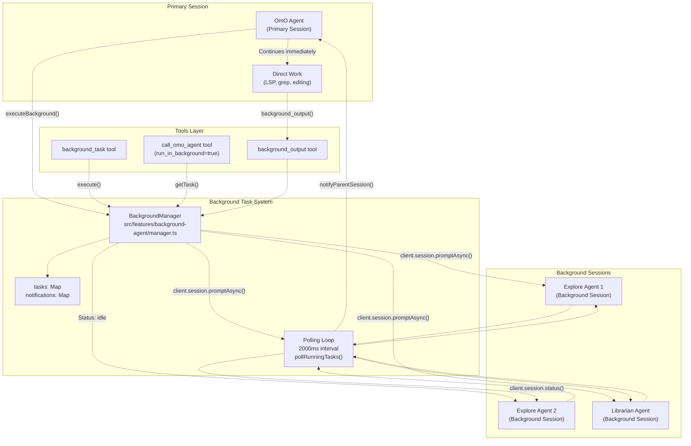
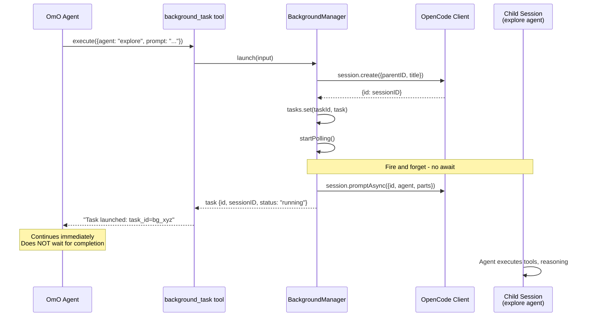
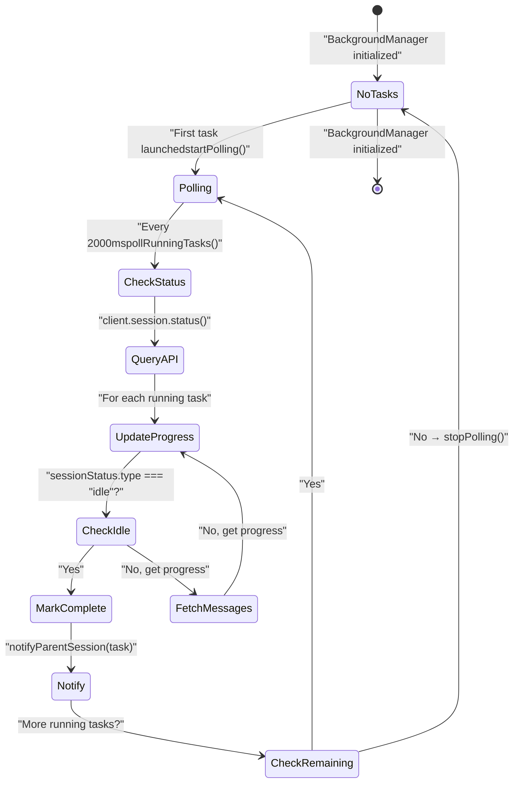
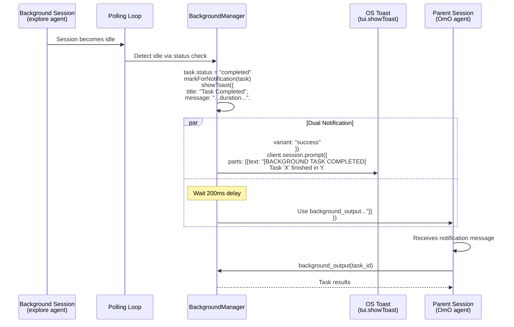
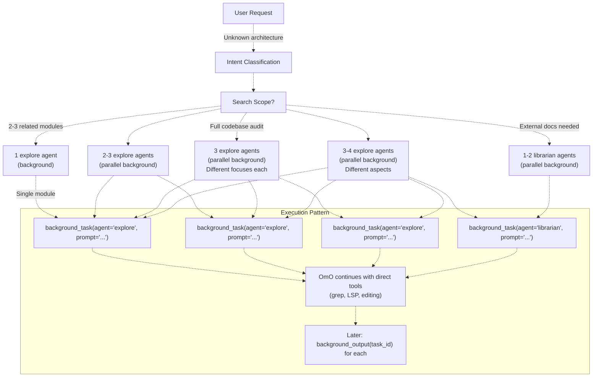
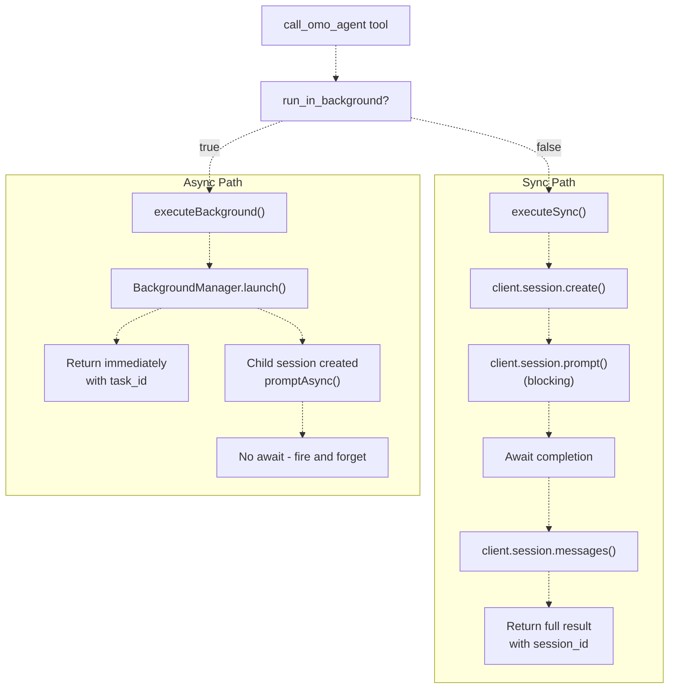
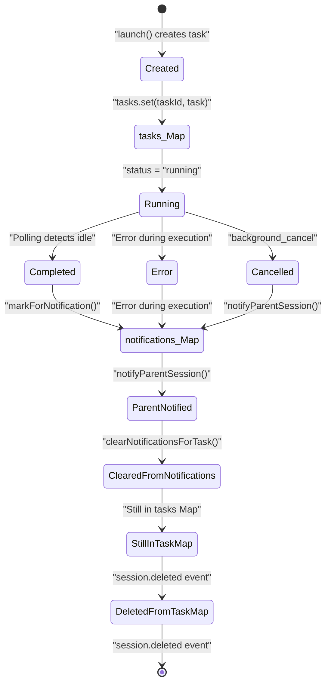
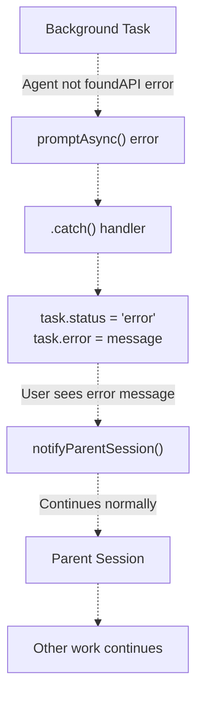

# Parallel Execution Patterns

> **Relevant source files**
> * [.opencode/background-tasks.json](https://github.com/code-yeongyu/oh-my-opencode/blob/b92cd6ab/.opencode/background-tasks.json)
> * [src/agents/document-writer.ts](https://github.com/code-yeongyu/oh-my-opencode/blob/b92cd6ab/src/agents/document-writer.ts)
> * [src/agents/explore.ts](https://github.com/code-yeongyu/oh-my-opencode/blob/b92cd6ab/src/agents/explore.ts)
> * [src/agents/frontend-ui-ux-engineer.ts](https://github.com/code-yeongyu/oh-my-opencode/blob/b92cd6ab/src/agents/frontend-ui-ux-engineer.ts)
> * [src/agents/librarian.ts](https://github.com/code-yeongyu/oh-my-opencode/blob/b92cd6ab/src/agents/librarian.ts)
> * [src/agents/multimodal-looker.ts](https://github.com/code-yeongyu/oh-my-opencode/blob/b92cd6ab/src/agents/multimodal-looker.ts)
> * [src/agents/oracle.ts](https://github.com/code-yeongyu/oh-my-opencode/blob/b92cd6ab/src/agents/oracle.ts)
> * [src/features/background-agent/index.ts](https://github.com/code-yeongyu/oh-my-opencode/blob/b92cd6ab/src/features/background-agent/index.ts)
> * [src/features/background-agent/manager.test.ts](https://github.com/code-yeongyu/oh-my-opencode/blob/b92cd6ab/src/features/background-agent/manager.test.ts)
> * [src/features/background-agent/manager.ts](https://github.com/code-yeongyu/oh-my-opencode/blob/b92cd6ab/src/features/background-agent/manager.ts)
> * [src/features/background-agent/types.ts](https://github.com/code-yeongyu/oh-my-opencode/blob/b92cd6ab/src/features/background-agent/types.ts)
> * [src/tools/background-task/tools.ts](https://github.com/code-yeongyu/oh-my-opencode/blob/b92cd6ab/src/tools/background-task/tools.ts)
> * [src/tools/call-omo-agent/tools.ts](https://github.com/code-yeongyu/oh-my-opencode/blob/b92cd6ab/src/tools/call-omo-agent/tools.ts)

## Purpose and Scope

This document describes how oh-my-opencode achieves true parallelism through background task execution and asynchronous agent invocation. The system allows the primary OmO orchestrator to launch multiple specialized agents (explore, librarian) simultaneously while continuing with other work, significantly improving throughput for complex software engineering tasks.

This page focuses specifically on the **execution patterns** that enable parallelism. For details on:

* Background task tools API: See [Background Tools](/code-yeongyu/oh-my-opencode/6.2-task-execution-and-polling)
* Task lifecycle management: See [Task Lifecycle](/code-yeongyu/oh-my-opencode/6.1-background-manager)
* Notification delivery mechanisms: See [Notification System](/code-yeongyu/oh-my-opencode/6.3-notification-system)
* OmO orchestrator strategy: See [OmO Orchestrator](/code-yeongyu/oh-my-opencode/4.1-sisyphus-orchestrator)

---

## Overview of Parallel Execution Architecture

The parallel execution system consists of four core components working together to enable non-blocking agent invocation:



**Sources:** [src/features/background-agent/manager.ts L47-L390](https://github.com/code-yeongyu/oh-my-opencode/blob/b92cd6ab/src/features/background-agent/manager.ts#L47-L390)

 [src/tools/background-task/tools.ts L23-L63](https://github.com/code-yeongyu/oh-my-opencode/blob/b92cd6ab/src/tools/background-task/tools.ts#L23-L63)

 [src/tools/call-omo-agent/tools.ts L48-L78](https://github.com/code-yeongyu/oh-my-opencode/blob/b92cd6ab/src/tools/call-omo-agent/tools.ts#L48-L78)

---

## Fire-and-Forget Pattern

The fire-and-forget pattern is the foundational parallel execution strategy. When OmO or any agent invokes a background task, the system:

1. Creates a new child session
2. Launches the agent via `client.session.promptAsync()`
3. Returns immediately without waiting
4. Continues with other work

### Task Launch Flow



**Sources:** [src/features/background-agent/manager.ts L61-L129](https://github.com/code-yeongyu/oh-my-opencode/blob/b92cd6ab/src/features/background-agent/manager.ts#L61-L129)

 [src/tools/background-task/tools.ts L31-L62](https://github.com/code-yeongyu/oh-my-opencode/blob/b92cd6ab/src/tools/background-task/tools.ts#L31-L62)

### Code Example: Launch Implementation

The critical implementation detail is the `.catch()` handler on `promptAsync()` that prevents awaiting:

```javascript
// From src/features/background-agent/manager.ts:100-126
this.client.session.promptAsync({
  path: { id: sessionID },
  body: {
    agent: input.agent,
    tools: {
      task: false,
      call_omo_agent: false,
      background_task: false,
    },
    parts: [{ type: "text", text: input.prompt }],
  },
}).catch((error) => {
  // Error handling without blocking
  log("[background-agent] promptAsync error:", error)
  const existingTask = this.findBySession(sessionID)
  if (existingTask) {
    existingTask.status = "error"
    existingTask.error = errorMessage
    existingTask.completedAt = new Date()
    this.markForNotification(existingTask)
    this.notifyParentSession(existingTask)
  }
})
```

**Key characteristics:**

* No `await` keyword - the promise is not awaited
* Error handling via `.catch()` prevents exceptions from propagating
* Task is stored in memory immediately with status `"running"`
* Returns control to caller instantly

**Sources:** [src/features/background-agent/manager.ts L100-L126](https://github.com/code-yeongyu/oh-my-opencode/blob/b92cd6ab/src/features/background-agent/manager.ts#L100-L126)

---

## Polling and Status Tracking

While tasks execute in background, the `BackgroundManager` continuously monitors their status through a polling loop that checks all running tasks every 2 seconds.

### Polling State Machine



**Sources:** [src/features/background-agent/manager.ts L237-L389](https://github.com/code-yeongyu/oh-my-opencode/blob/b92cd6ab/src/features/background-agent/manager.ts#L237-L389)

### Polling Implementation Details

The polling loop implements a two-tier status check:

| Check Type | API Call | Purpose | Data Extracted |
| --- | --- | --- | --- |
| **Session Status** | `client.session.status()` | Detect completion | `type: "idle"` → task done |
| **Message Fetch** | `client.session.messages({id})` | Track progress | Tool calls, last message, timestamps |

```typescript
// From src/features/background-agent/manager.ts:316-389
private async pollRunningTasks(): Promise<void> {
  // First: Get all session statuses in one API call
  const statusResult = await this.client.session.status()
  const allStatuses = (statusResult.data ?? {}) as Record<string, { type: string }>

  for (const task of this.tasks.values()) {
    if (task.status !== "running") continue

    const sessionStatus = allStatuses[task.sessionID]
    
    // Check 1: Is session idle? → Task complete
    if (sessionStatus.type === "idle") {
      task.status = "completed"
      task.completedAt = new Date()
      this.markForNotification(task)
      this.notifyParentSession(task)
      continue
    }

    // Check 2: Fetch messages for progress tracking
    const messagesResult = await this.client.session.messages({
      path: { id: task.sessionID },
    })
    
    // Extract progress: tool calls, last tool, last message
    if (!messagesResult.error && messagesResult.data) {
      const messages = messagesResult.data
      const assistantMsgs = messages.filter(m => m.info?.role === "assistant")
      
      let toolCalls = 0
      let lastTool: string | undefined
      let lastMessage: string | undefined
      
      for (const msg of assistantMsgs) {
        for (const part of msg.parts ?? []) {
          if (part.type === "tool_use" || part.tool) {
            toolCalls++
            lastTool = part.tool || part.name || "unknown"
          }
          if (part.type === "text" && part.text) {
            lastMessage = part.text
          }
        }
      }
      
      task.progress = {
        toolCalls,
        lastTool,
        lastUpdate: new Date(),
        lastMessage,
        lastMessageAt: lastMessage ? new Date() : undefined
      }
    }
  }

  // Stop polling when no more running tasks
  if (!this.hasRunningTasks()) {
    this.stopPolling()
  }
}
```

**Sources:** [src/features/background-agent/manager.ts L316-L389](https://github.com/code-yeongyu/oh-my-opencode/blob/b92cd6ab/src/features/background-agent/manager.ts#L316-L389)

### Event-Driven Status Updates

In addition to polling, the manager listens for events from OpenCode:

```mermaid
flowchart TD

Events["OpenCode Events"]
PartUpdate["message.part.updated"]
SessionIdle["session.idle"]
SessionDeleted["session.deleted"]
Progress["task.progress"]
Complete["task.status = 'completed'"]
Remove["tasks.delete(taskId)"]
Notify["notifyParentSession()"]

Events -.-> PartUpdate
Events -.-> SessionIdle
Events -.-> SessionDeleted
PartUpdate -.->|"Increment toolCalls"| Progress
SessionIdle -.->|"Mark completed"| Complete
SessionDeleted -.->|"Clean up"| Remove
Complete -.-> Notify

subgraph BackgroundManager.handleEvent() ["BackgroundManager.handleEvent()"]
    PartUpdate
    SessionIdle
    SessionDeleted
end
```

**Sources:** [src/features/background-agent/manager.ts L154-L210](https://github.com/code-yeongyu/oh-my-opencode/blob/b92cd6ab/src/features/background-agent/manager.ts#L154-L210)

---

## Notification System

When a background task completes, the parent session must be notified so the orchestrator can retrieve results. The notification system uses a two-channel approach:

### Notification Flow Diagram



**Sources:** [src/features/background-agent/manager.ts L252-L293](https://github.com/code-yeongyu/oh-my-opencode/blob/b92cd6ab/src/features/background-agent/manager.ts#L252-L293)

### Notification Implementation

The notification system implements three distinct mechanisms:

| Channel | API | Purpose | Timing |
| --- | --- | --- | --- |
| **In-Memory Queue** | `markForNotification()` | Store completed tasks per session | Immediate |
| **OS Toast** | `tui.showToast()` | Visual alert for user | Immediate |
| **Session Message** | `session.prompt()` | Inject notification into conversation | 200ms delay |

```javascript
// From src/features/background-agent/manager.ts:252-293
private notifyParentSession(task: BackgroundTask): void {
  const duration = this.formatDuration(task.startedAt, task.completedAt)

  // Channel 1: OS Toast notification
  const tuiClient = this.client as any
  if (tuiClient.tui?.showToast) {
    tuiClient.tui.showToast({
      body: {
        title: "Background Task Completed",
        message: `Task "${task.description}" finished in ${duration}.`,
        variant: "success",
        duration: 5000,
      },
    }).catch(() => {})
  }

  // Channel 2: Inject message into parent session
  const message = `[BACKGROUND TASK COMPLETED] Task "${task.description}" finished in ${duration}. Use background_output with task_id="${task.id}" to get results.`

  setTimeout(async () => {
    try {
      const messageDir = getMessageDir(task.parentSessionID)
      const prevMessage = messageDir ? findNearestMessageWithFields(messageDir) : null

      await this.client.session.prompt({
        path: { id: task.parentSessionID },
        body: {
          agent: prevMessage?.agent,
          parts: [{ type: "text", text: message }],
        },
        query: { directory: this.directory },
      })
      this.clearNotificationsForTask(task.id)
    } catch (error) {
      log("[background-agent] prompt failed:", String(error))
    }
  }, 200)
}
```

The 200ms delay before sending the session message prevents race conditions where the notification might arrive before the parent session is ready to receive it.

**Sources:** [src/features/background-agent/manager.ts L252-L293](https://github.com/code-yeongyu/oh-my-opencode/blob/b92cd6ab/src/features/background-agent/manager.ts#L252-L293)

---

## Collection Patterns (Blocking vs Non-Blocking)

The `background_output` tool provides two collection modes, allowing flexible result retrieval based on orchestrator strategy.

### Collection Mode Comparison

```mermaid
flowchart TD

BCall["background_output(task_id, block=true, timeout=60000)"]
BCheck["getTask(task_id)"]
BStatus["Task Status?"]
BResult["Return full result"]
BPoll["Poll loop<br>delay(1000)"]
BError["Return status"]
BRecheck["getTask(task_id)"]
BTimeout["Timeout?"]
BTimeoutResult["Return timeout status"]
BRecheckStatus["Status?"]
NBCall["background_output(task_id, block=false)"]
NBCheck["getTask(task_id)"]
NBStatus["Task Status?"]
NBResult["Return full result<br>formatTaskResult()"]
NBProgress["Return progress status<br>formatTaskStatus()"]
NBError["Return status with error"]
NBDone["Done"]

subgraph subGraph1 ["Blocking Mode"]
    BCall
    BCheck
    BStatus
    BResult
    BPoll
    BError
    BRecheck
    BTimeout
    BTimeoutResult
    BRecheckStatus
    BCall -.-> BCheck
    BCheck -.->|"running"| BStatus
    BStatus -.->|"completed"| BResult
    BStatus -.->|"error/cancelled"| BPoll
    BStatus -.->|"Check again"| BError
    BPoll -.->|"running"| BRecheck
    BRecheck -.->|"Exceeded"| BTimeout
    BTimeout -.->|"Still time"| BTimeoutResult
    BTimeout -.->|"completed"| BRecheckStatus
    BRecheckStatus -.-> BResult
    BRecheckStatus -.-> BPoll
end

subgraph subGraph0 ["Non-Blocking Mode (Default)"]
    NBCall
    NBCheck
    NBStatus
    NBResult
    NBProgress
    NBError
    NBDone
    NBCall -.-> NBCheck
    NBCheck -.->|"running"| NBStatus
    NBStatus -.->|"completed"| NBResult
    NBStatus -.->|"error/cancelled"| NBProgress
    NBStatus -.->|"Immediate return"| NBError
    NBResult -.->|"Immediate return"| NBDone
    NBProgress -.->|"Immediate return"| NBDone
    NBError -.-> NBDone
end
```



**Sources:** [src/tools/background-task/tools.ts L196-L259](https://github.com/code-yeongyu/oh-my-opencode/blob/b92cd6ab/src/tools/background-task/tools.ts#L196-L259)

### When to Use Each Mode

| Mode | Use Case | OmO Strategy | Return Time |
| --- | --- | --- | --- |
| **Non-blocking** (default) | Check if results ready | Default for all background tasks | Instant |
| **Blocking** | Rarely needed | Only when immediate result required AND notification missed | Up to timeout (60s default, 600s max) |

The system design intentionally favors non-blocking collection because:

1. Notifications are delivered automatically via `notifyParentSession()`
2. OmO can continue other work while tasks execute
3. Multiple tasks can be checked with single non-blocking calls
4. Blocking mode ties up the primary session unnecessarily

**Sources:** [src/tools/background-task/tools.ts L196-L259](https://github.com/code-yeongyu/oh-my-opencode/blob/b92cd6ab/src/tools/background-task/tools.ts#L196-L259)

 [src/tools/background-task/constants.ts L19-L26](https://github.com/code-yeongyu/oh-my-opencode/blob/b92cd6ab/src/tools/background-task/constants.ts#L19-L26)

---

## Parallel Agent Orchestration in OmO

The OmO orchestrator leverages parallel execution as a core strategy for maximizing throughput. The system prompt explicitly defines parallelism patterns for different search scopes.

### Parallel Dispatch Strategy



**Sources:** [src/agents/omo.ts L145-L169](https://github.com/code-yeongyu/oh-my-opencode/blob/b92cd6ab/src/agents/omo.ts#L145-L169)

 [src/agents/omo.ts L516-L555](https://github.com/code-yeongyu/oh-my-opencode/blob/b92cd6ab/src/agents/omo.ts#L516-L555)

### Example: Parallel Explore Pattern

The OmO system prompt codifies the parallel execution pattern:

```markdown
// From src/agents/omo.ts:145-169

### Level 2: Explore Agent = "Contextual Grep" (Internal Codebase)

**Think of Explore as a TOOL, not an agent.** It's your "contextual grep" that understands code.

- **grep** finds text patterns → Explore finds **semantic patterns + context**
- **grep** returns lines → Explore returns **understanding + relevant files**
- **Cost**: Cheap like grep. Fire liberally.

**ALWAYS use `background_task(agent="explore")` — fire and forget, collect later.**

| Search Scope | Explore Agents | Strategy |
|--------------|----------------|----------|
| Single module | 1 background | Quick scan |
| 2-3 related modules | 2-3 parallel background | Each takes a module |
| Unknown architecture | 3 parallel background | Structure, patterns, entry points |
| Full codebase audit | 3-4 parallel background | Different aspects each |

**Use it like grep — don't overthink, just fire:**
```typescript
// Fire as background tasks, continue working immediately
background_task(agent="explore", prompt="Find all [X] implementations...")
background_task(agent="explore", prompt="Find [X] usage patterns...")
background_task(agent="explore", prompt="Find [X] test cases...")
// Collect with background_output when you need the results
```

```xml
**Sources:** <FileRef file-url="https://github.com/code-yeongyu/oh-my-opencode/blob/b92cd6ab/src/agents/omo.ts#L145-L169" min=145 max=169 file-path="src/agents/omo.ts">Hii</FileRef>

### Implementation: Fire Multiple Agents

When OmO needs to understand a complex system, it follows this pattern:

1. **Classify scope** (trivial, exploration, implementation, orchestration)
2. **Fire multiple agents** in parallel based on scope
3. **Continue with direct work** (editing, LSP operations)
4. **Collect results** when needed via `background_output`

### Example: Broad Architecture Understanding
```

User: "How does authentication work in this codebase?"

OmO reasoning:

* Scope: Unknown architecture
* Strategy: 3 parallel explore agents

OmO execution:
background_task(agent="explore", prompt="Find all authentication-related files: login, logout, session management")
background_task(agent="explore", prompt="Find authentication middleware and guards")
background_task(agent="explore", prompt="Find authentication configuration and environment setup")

[Continues with other work...]

[Later, when agents complete:]
background_output(task_id="bg_abc123")
background_output(task_id="bg_def456")
background_output(task_id="bg_ghi789")

[Synthesize results and respond to user]

```css
**Sources:** <FileRef file-url="https://github.com/code-yeongyu/oh-my-opencode/blob/b92cd6ab/src/agents/omo.ts#L145-L212" min=145 max=212 file-path="src/agents/omo.ts">Hii</FileRef>

---

## Tool Permission System for Parallelism

To prevent infinite recursion and maintain controlled parallelism, background-executed agents have restricted tool access:

### Tool Access Control Matrix

| Agent Context | `task` | `call_omo_agent` | `background_task` | Reason |
|--------------|--------|------------------|-------------------|--------|
| **OmO (primary session)** | ✅ Enabled | ✅ Enabled | ✅ Enabled | Full orchestration capabilities |
| **Explore (background)** | ❌ Disabled | ❌ Disabled | ❌ Disabled | Prevent recursive spawning |
| **Librarian (background)** | ❌ Disabled | ❌ Disabled | ❌ Disabled | Prevent recursive spawning |

```typescript
// From src/features/background-agent/manager.ts:104-108
body: {
  agent: input.agent,
  tools: {
    task: false,
    call_omo_agent: false,
    background_task: false,
  },
  parts: [{ type: "text", text: input.prompt }],
}
```

```yaml
// From src/tools/call-omo-agent/tools.ts:122-128
body: {
  agent: args.subagent_type,
  tools: {
    task: false,
    call_omo_agent: false,
    background_task: false,
  },
  parts: [{ type: "text", text: args.prompt }],
}
```

This ensures:

* Only the primary orchestrator (OmO) can spawn background tasks
* Background agents cannot create more background tasks
* Parallelism is controlled and bounded
* No infinite agent spawning loops

**Sources:** [src/features/background-agent/manager.ts L100-L109](https://github.com/code-yeongyu/oh-my-opencode/blob/b92cd6ab/src/features/background-agent/manager.ts#L100-L109)

 [src/tools/call-omo-agent/tools.ts L119-L130](https://github.com/code-yeongyu/oh-my-opencode/blob/b92cd6ab/src/tools/call-omo-agent/tools.ts#L119-L130)

---

## Synchronous vs Asynchronous Invocation

The `call_omo_agent` tool provides both execution modes through a single interface:

### Dual-Mode Architecture



**Sources:** [src/tools/call-omo-agent/tools.ts L29-L178](https://github.com/code-yeongyu/oh-my-opencode/blob/b92cd6ab/src/tools/call-omo-agent/tools.ts#L29-L178)

### Mode Selection Guidelines

From the tool description and OmO system prompt:

| Scenario | Mode | Rationale |
| --- | --- | --- |
| **Explore agent invocation** | Async | Fast, cheap, parallelizable - fire 2-3 simultaneously |
| **Librarian research** | Async | External lookups benefit from parallelism |
| **Oracle consultation** | Sync | High-value advice needed for immediate decision |
| **Frontend delegation** | Sync | Must wait for implementation before proceeding |

The OmO prompt explicitly mandates async mode for explore and librarian:

```
**ALWAYS use `background_task(agent="explore")` — fire and forget, collect later.**

**Use `background_task(agent="librarian")` — fire in background, continue working.**
```

**Sources:** [src/agents/omo.ts L152](https://github.com/code-yeongyu/oh-my-opencode/blob/b92cd6ab/src/agents/omo.ts#L152-L152)

 [src/agents/omo.ts L186](https://github.com/code-yeongyu/oh-my-opencode/blob/b92cd6ab/src/agents/omo.ts#L186-L186)

 [src/tools/call-omo-agent/constants.ts L12-L16](https://github.com/code-yeongyu/oh-my-opencode/blob/b92cd6ab/src/tools/call-omo-agent/constants.ts#L12-L16)

---

## Memory Management and Cleanup

Background task state is managed carefully to prevent memory leaks:

### State Lifecycle Management



**Sources:** [src/features/background-agent/manager.ts L47-L59](https://github.com/code-yeongyu/oh-my-opencode/blob/b92cd6ab/src/features/background-agent/manager.ts#L47-L59)

 [src/features/background-agent/manager.ts L193-L209](https://github.com/code-yeongyu/oh-my-opencode/blob/b92cd6ab/src/features/background-agent/manager.ts#L193-L209)

 [src/features/background-agent/manager.ts L226-L235](https://github.com/code-yeongyu/oh-my-opencode/blob/b92cd6ab/src/features/background-agent/manager.ts#L226-L235)

### Cleanup Triggers

The system cleans up state in response to three events:

1. **Notification Delivered** → Remove from `notifications` Map ``` // From manager.ts:287 this.clearNotificationsForTask(task.id) ```
2. **Session Deleted** → Remove from both Maps ```javascript // From manager.ts:193-209 if (event.type === "session.deleted") {   const sessionID = info.id   const task = this.findBySession(sessionID)   if (!task) return   if (task.status === "running") {     task.status = "cancelled"     task.completedAt = new Date()     task.error = "Session deleted"   }   this.tasks.delete(task.id)   this.clearNotificationsForTask(task.id) } ```
3. **Polling Stops** → When no running tasks remain ``` // From manager.ts:386-388 if (!this.hasRunningTasks()) {   this.stopPolling() } ```

**Sources:** [src/features/background-agent/manager.ts L193-L209](https://github.com/code-yeongyu/oh-my-opencode/blob/b92cd6ab/src/features/background-agent/manager.ts#L193-L209)

 [src/features/background-agent/manager.ts L226-L235](https://github.com/code-yeongyu/oh-my-opencode/blob/b92cd6ab/src/features/background-agent/manager.ts#L226-L235)

 [src/features/background-agent/manager.ts L386-L388](https://github.com/code-yeongyu/oh-my-opencode/blob/b92cd6ab/src/features/background-agent/manager.ts#L386-L388)

---

## Performance Characteristics

### Throughput Improvements

| Pattern | Sequential Time | Parallel Time | Speedup |
| --- | --- | --- | --- |
| **3 explore agents** (30s each) | 90 seconds | ~30 seconds | 3x |
| **2 explore + 1 librarian** (30s + 45s) | 105 seconds | ~45 seconds | 2.3x |
| **Direct tools + background agents** | Blocked waiting | Continue immediately | ∞ (non-blocking) |

### Resource Utilization

The polling mechanism has minimal overhead:

* **Polling interval:** 2000ms (2 seconds)
* **Status check:** Single API call for all sessions (`client.session.status()`)
* **Message fetch:** One API call per task (only for progress tracking)
* **Polling stops:** Automatically when no tasks running

```javascript
// From manager.ts:316-318
const statusResult = await this.client.session.status()
const allStatuses = (statusResult.data ?? {}) as Record<string, { type: string }>
// Single call checks ALL sessions at once
```

**Sources:** [src/features/background-agent/manager.ts L316-L318](https://github.com/code-yeongyu/oh-my-opencode/blob/b92cd6ab/src/features/background-agent/manager.ts#L316-L318)

 [src/features/background-agent/manager.ts L237-L250](https://github.com/code-yeongyu/oh-my-opencode/blob/b92cd6ab/src/features/background-agent/manager.ts#L237-L250)

---

## Error Handling in Parallel Execution

### Error Propagation

Errors in background tasks are isolated and do not crash the parent session:



**Sources:** [src/features/background-agent/manager.ts L111-L126](https://github.com/code-yeongyu/oh-my-opencode/blob/b92cd6ab/src/features/background-agent/manager.ts#L111-L126)

### Error Types Handled

| Error Type | Detection | Status | User Impact |
| --- | --- | --- | --- |
| **Agent not found** | "agent.name" or "undefined" in error | `"error"` with descriptive message | Notification explains agent registration needed |
| **API failure** | `promptAsync` rejection | `"error"` with error message | Notification shows technical error |
| **Session deleted** | `session.deleted` event | `"cancelled"` | Task removed from tracking |
| **Polling failure** | Exception in `pollRunningTasks()` | Task status unchanged | Logged, continues polling |

```javascript
// From manager.ts:111-126
.catch((error) => {
  log("[background-agent] promptAsync error:", error)
  const existingTask = this.findBySession(sessionID)
  if (existingTask) {
    existingTask.status = "error"
    const errorMessage = error instanceof Error ? error.message : String(error)
    if (errorMessage.includes("agent.name") || errorMessage.includes("undefined")) {
      existingTask.error = `Agent "${input.agent}" not found. Make sure the agent is registered in your opencode.json or provided by a plugin.`
    } else {
      existingTask.error = errorMessage
    }
    existingTask.completedAt = new Date()
    this.markForNotification(existingTask)
    this.notifyParentSession(existingTask)
  }
})
```

**Sources:** [src/features/background-agent/manager.ts L111-L126](https://github.com/code-yeongyu/oh-my-opencode/blob/b92cd6ab/src/features/background-agent/manager.ts#L111-L126)

 [src/features/background-agent/manager.ts L381-L383](https://github.com/code-yeongyu/oh-my-opencode/blob/b92cd6ab/src/features/background-agent/manager.ts#L381-L383)