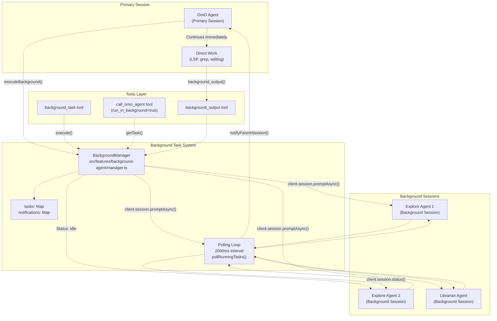
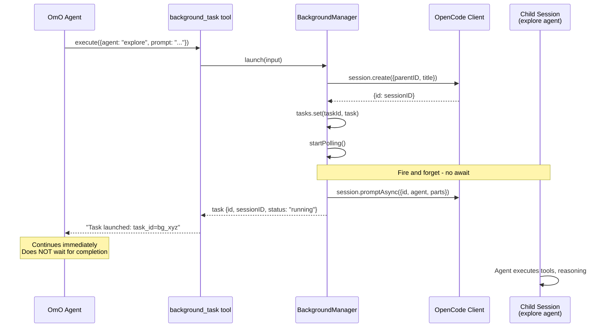
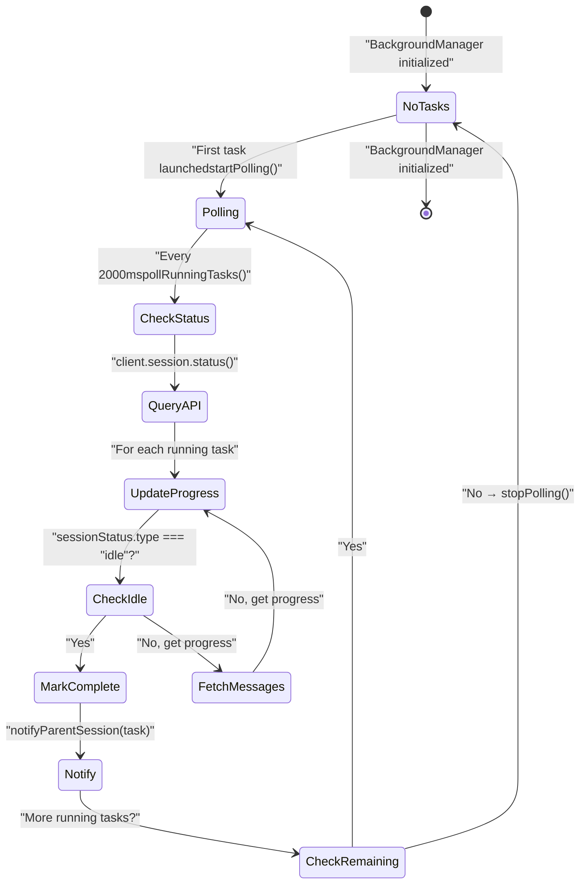
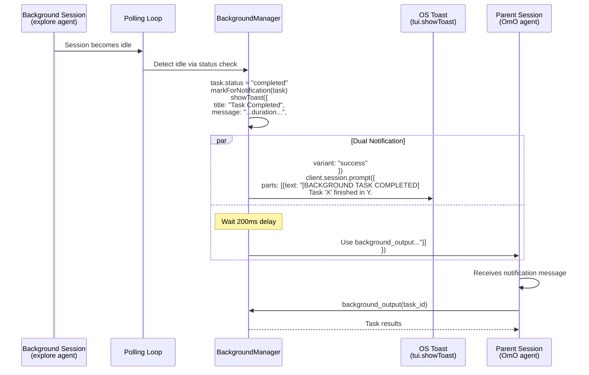
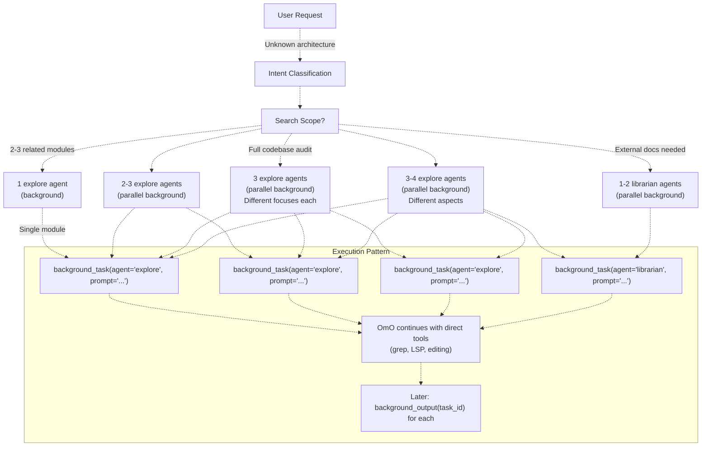
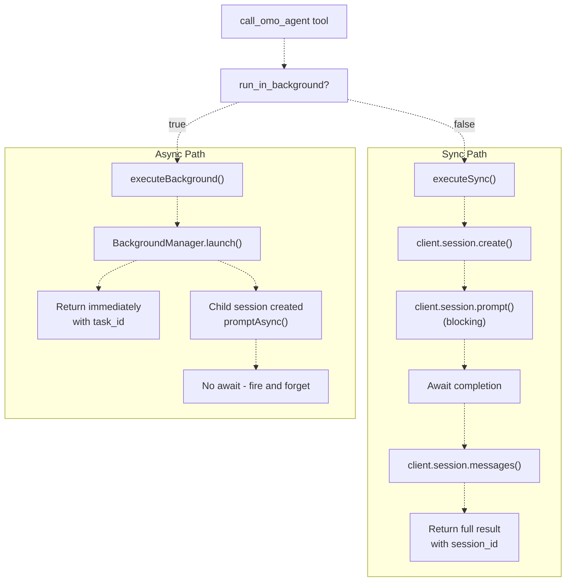
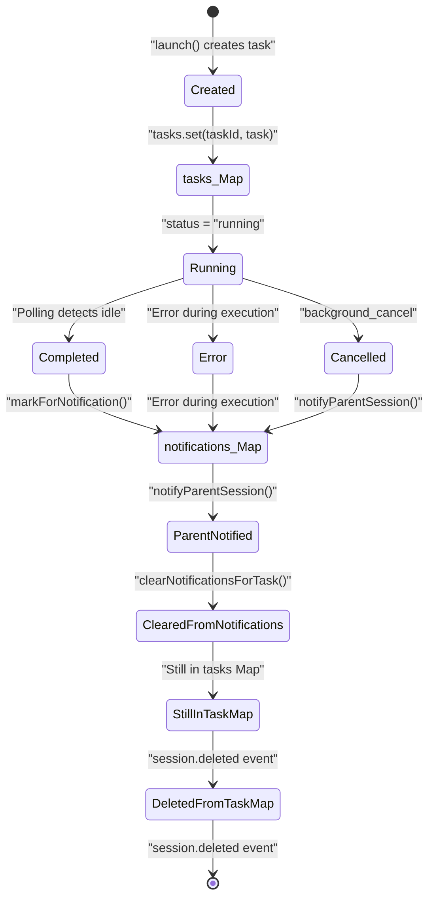
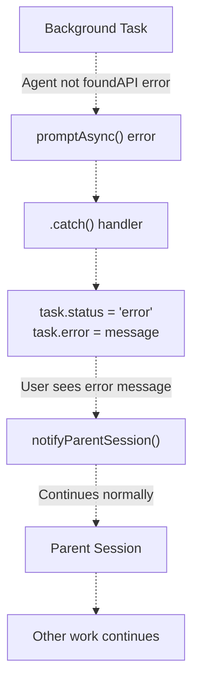

```mermaid
flowchart TD

BCall["background_output(task_id, block=true, timeout=60000)"]
BCheck["getTask(task_id)"]
BStatus["Task Status?"]
BResult["Return full result"]
BPoll["Poll loop<br>delay(1000)"]
BError["Return status"]
BRecheck["getTask(task_id)"]
BTimeout["Timeout?"]
BTimeoutResult["Return timeout status"]
BRecheckStatus["Status?"]
NBCall["background_output(task_id, block=false)"]
NBCheck["getTask(task_id)"]
NBStatus["Task Status?"]
NBResult["Return full result<br>formatTaskResult()"]
NBProgress["Return progress status<br>formatTaskStatus()"]
NBError["Return status with error"]
NBDone["Done"]

subgraph subGraph1 ["Blocking Mode"]
    BCall
    BCheck
    BStatus
    BResult
    BPoll
    BError
    BRecheck
    BTimeout
    BTimeoutResult
    BRecheckStatus
    BCall -.-> BCheck
    BCheck -.->|"running"| BStatus
    BStatus -.->|"completed"| BResult
    BStatus -.->|"error/cancelled"| BPoll
    BStatus -.->|"Check again"| BError
    BPoll -.->|"running"| BRecheck
    BRecheck -.->|"Exceeded"| BTimeout
    BTimeout -.->|"Still time"| BTimeoutResult
    BTimeout -.->|"completed"| BRecheckStatus
    BRecheckStatus -.-> BResult
    BRecheckStatus -.-> BPoll
end

subgraph subGraph0 ["Non-Blocking Mode (Default)"]
    NBCall
    NBCheck
    NBStatus
    NBResult
    NBProgress
    NBError
    NBDone
    NBCall -.-> NBCheck
    NBCheck -.->|"running"| NBStatus
    NBStatus -.->|"completed"| NBResult
    NBStatus -.->|"error/cancelled"| NBProgress
    NBStatus -.->|"Immediate return"| NBError
    NBResult -.->|"Immediate return"| NBDone
    NBProgress -.->|"Immediate return"| NBDone
    NBError -.-> NBDone
end
```

# 병렬 실행 패턴 (Parallel Execution Patterns)

> **관련 소스 파일**
> * [.opencode/background-tasks.json](https://github.com/code-yeongyu/oh-my-opencode/blob/b92cd6ab/.opencode/background-tasks.json)
> * [src/agents/document-writer.ts](https://github.com/code-yeongyu/oh-my-opencode/blob/b92cd6ab/src/agents/document-writer.ts)
> * [src/agents/explore.ts](https://github.com/code-yeongyu/oh-my-opencode/blob/b92cd6ab/src/agents/explore.ts)
> * [src/agents/frontend-ui-ux-engineer.ts](https://github.com/code-yeongyu/oh-my-opencode/blob/b92cd6ab/src/agents/frontend-ui-ux-engineer.ts)
> * [src/agents/librarian.ts](https://github.com/code-yeongyu/oh-my-opencode/blob/b92cd6ab/src/agents/librarian.ts)
> * [src/agents/multimodal-looker.ts](https://github.com/code-yeongyu/oh-my-opencode/blob/b92cd6ab/src/agents/multimodal-looker.ts)
> * [src/agents/oracle.ts](https://github.com/code-yeongyu/oh-my-opencode/blob/b92cd6ab/src/agents/oracle.ts)
> * [src/features/background-agent/index.ts](https://github.com/code-yeongyu/oh-my-opencode/blob/b92cd6ab/src/features/background-agent/index.ts)
> * [src/features/background-agent/manager.test.ts](https://github.com/code-yeongyu/oh-my-opencode/blob/b92cd6ab/src/features/background-agent/manager.test.ts)
> * [src/features/background-agent/manager.ts](https://github.com/code-yeongyu/oh-my-opencode/blob/b92cd6ab/src/features/background-agent/manager.ts)
> * [src/features/background-agent/types.ts](https://github.com/code-yeongyu/oh-my-opencode/blob/b92cd6ab/src/features/background-agent/types.ts)
> * [src/tools/background-task/tools.ts](https://github.com/code-yeongyu/oh-my-opencode/blob/b92cd6ab/src/tools/background-task/tools.ts)
> * [src/tools/call-omo-agent/tools.ts](https://github.com/code-yeongyu/oh-my-opencode/blob/b92cd6ab/src/tools/call-omo-agent/tools.ts)

## 목적 및 범위 (Purpose and Scope)

이 문서는 oh-my-opencode가 백그라운드 작업 실행 및 비동기 에이전트 호출을 통해 진정한 병렬성(parallelism)을 달성하는 방법을 설명합니다. 이 시스템은 기본 OmO 오케스트레이터(orchestrator)가 다른 작업을 계속 수행하는 동안 여러 전문 에이전트(explore, librarian)를 동시에 실행할 수 있게 하여, 복잡한 소프트웨어 엔지니어링 작업의 처리량(throughput)을 크게 향상시킵니다.

이 페이지는 특히 병렬 처리를 가능하게 하는 **실행 패턴(execution patterns)**에 초점을 맞춥니다. 다음 사항에 대한 자세한 내용은 해당 문서를 참조하십시오:

* 백그라운드 작업 도구 API: [Background Tools](/code-yeongyu/oh-my-opencode/6.2-task-execution-and-polling) 참조
* 작업 수명 주기 관리: [Task Lifecycle](/code-yeongyu/oh-my-opencode/6.1-background-manager) 참조
* 알림 전달 메커니즘: [Notification System](/code-yeongyu/oh-my-opencode/6.3-notification-system) 참조
* OmO 오케스트레이터 전략: [OmO Orchestrator](/code-yeongyu/oh-my-opencode/4.1-sisyphus-orchestrator) 참조

---

## 병렬 실행 아키텍처 개요 (Overview of Parallel Execution Architecture)

병렬 실행 시스템은 비차단(non-blocking) 에이전트 호출을 가능하게 하기 위해 함께 작동하는 네 가지 핵심 구성 요소로 이루어져 있습니다:



**출처:** [src/features/background-agent/manager.ts L47-L390](https://github.com/code-yeongyu/oh-my-opencode/blob/b92cd6ab/src/features/background-agent/manager.ts#L47-L390)

 [src/tools/background-task/tools.ts L23-L63](https://github.com/code-yeongyu/oh-my-opencode/blob/b92cd6ab/src/tools/background-task/tools.ts#L23-L63)

 [src/tools/call-omo-agent/tools.ts L48-L78](https://github.com/code-yeongyu/oh-my-opencode/blob/b92cd6ab/src/tools/call-omo-agent/tools.ts#L48-L78)

---

## Fire-and-Forget 패턴

Fire-and-forget(실행 후 망각) 패턴은 기초적인 병렬 실행 전략입니다. OmO 또는 다른 에이전트가 백그라운드 작업을 호출하면 시스템은 다음을 수행합니다:

1. 새로운 자식 세션(child session)을 생성합니다.
2. `client.session.promptAsync()`를 통해 에이전트를 실행합니다.
3. 대기하지 않고 즉시 반환합니다.
4. 다른 작업을 계속 수행합니다.

### 작업 실행 흐름 (Task Launch Flow)



**출처:** [src/features/background-agent/manager.ts L61-L129](https://github.com/code-yeongyu/oh-my-opencode/blob/b92cd6ab/src/features/background-agent/manager.ts#L61-L129)

 [src/tools/background-task/tools.ts L31-L62](https://github.com/code-yeongyu/oh-my-opencode/blob/b92cd6ab/src/tools/background-task/tools.ts#L31-L62)

### 코드 예시: 실행 구현 (Launch Implementation)

가장 중요한 구현 세부 사항은 `promptAsync()`에 대한 `.catch()` 핸들러로, 이를 통해 `await`를 방지합니다:

```javascript
// From src/features/background-agent/manager.ts:100-126
this.client.session.promptAsync({
  path: { id: sessionID },
  body: {
    agent: input.agent,
    tools: {
      task: false,
      call_omo_agent: false,
      background_task: false,
    },
    parts: [{ type: "text", text: input.prompt }],
  },
}).catch((error) => {
  // 차단 없이 오류 처리
  log("[background-agent] promptAsync error:", error)
  const existingTask = this.findBySession(sessionID)
  if (existingTask) {
    existingTask.status = "error"
    existingTask.error = errorMessage
    existingTask.completedAt = new Date()
    this.markForNotification(existingTask)
    this.notifyParentSession(existingTask)
  }
})
```

**주요 특징:**

* `await` 키워드가 없음 - 프로미스(promise)를 기다리지 않습니다.
* `.catch()`를 통한 오류 처리는 예외가 전파되는 것을 방지합니다.
* 작업은 즉시 `"running"` 상태로 메모리에 저장됩니다.
* 호출자에게 즉시 제어권을 반환합니다.

**출처:** [src/features/background-agent/manager.ts L100-L126](https://github.com/code-yeongyu/oh-my-opencode/blob/b92cd6ab/src/features/background-agent/manager.ts#L100-L126)

---

## 폴링 및 상태 추적 (Polling and Status Tracking)

작업이 백그라운드에서 실행되는 동안, `BackgroundManager`는 2초마다 모든 실행 중인 작업을 확인하는 폴링 루프(polling loop)를 통해 상태를 지속적으로 모니터링합니다.

### 폴링 상태 머신 (Polling State Machine)



**출처:** [src/features/background-agent/manager.ts L237-L389](https://github.com/code-yeongyu/oh-my-opencode/blob/b92cd6ab/src/features/background-agent/manager.ts#L237-L389)

### 폴링 구현 세부 사항 (Polling Implementation Details)

폴링 루프는 두 단계의 상태 확인을 구현합니다:

| 확인 유형 | API 호출 | 목적 | 추출 데이터 |
| --- | --- | --- | --- |
| **세션 상태** | `client.session.status()` | 완료 감지 | `type: "idle"` → 작업 완료 |
| **메시지 가져오기** | `client.session.messages({id})` | 진행 상황 추적 | 도구 호출, 마지막 메시지, 타임스탬프 |

```typescript
// From src/features/background-agent/manager.ts:316-389
private async pollRunningTasks(): Promise<void> {
  // 첫 번째: 한 번의 API 호출로 모든 세션 상태 가져오기
  const statusResult = await this.client.session.status()
  const allStatuses = (statusResult.data ?? {}) as Record<string, { type: string }>

  for (const task of this.tasks.values()) {
    if (task.status !== "running") continue

    const sessionStatus = allStatuses[task.sessionID]
    
    // 확인 1: 세션이 유휴(idle) 상태인가? → 작업 완료
    if (sessionStatus.type === "idle") {
      task.status = "completed"
      task.completedAt = new Date()
      this.markForNotification(task)
      this.notifyParentSession(task)
      continue
    }

    // 확인 2: 진행 상황 추적을 위해 메시지 가져오기
    const messagesResult = await this.client.session.messages({
      path: { id: task.sessionID },
    })
    
    // 진행 상황 추출: 도구 호출, 마지막 도구, 마지막 메시지
    if (!messagesResult.error && messagesResult.data) {
      const messages = messagesResult.data
      const assistantMsgs = messages.filter(m => m.info?.role === "assistant")
      
      let toolCalls = 0
      let lastTool: string | undefined
      let lastMessage: string | undefined
      
      for (const msg of assistantMsgs) {
        for (const part of msg.parts ?? []) {
          if (part.type === "tool_use" || part.tool) {
            toolCalls++
            lastTool = part.tool || part.name || "unknown"
          }
          if (part.type === "text" && part.text) {
            lastMessage = part.text
          }
        }
      }
      
      task.progress = {
        toolCalls,
        lastTool,
        lastUpdate: new Date(),
        lastMessage,
        lastMessageAt: lastMessage ? new Date() : undefined
      }
    }
  }

  // 실행 중인 작업이 더 이상 없으면 폴링 중지
  if (!this.hasRunningTasks()) {
    this.stopPolling()
  }
}
```

**출처:** [src/features/background-agent/manager.ts L316-L389](https://github.com/code-yeongyu/oh-my-opencode/blob/b92cd6ab/src/features/background-agent/manager.ts#L316-L389)

### 이벤트 기반 상태 업데이트 (Event-Driven Status Updates)

폴링 외에도 매니저는 OpenCode의 이벤트를 수신합니다:

```mermaid
flowchart TD

Events["OpenCode Events"]
PartUpdate["message.part.updated"]
SessionIdle["session.idle"]
SessionDeleted["session.deleted"]
Progress["task.progress"]
Complete["task.status = 'completed'"]
Remove["tasks.delete(taskId)"]
Notify["notifyParentSession()"]

Events -.-> PartUpdate
Events -.-> SessionIdle
Events -.-> SessionDeleted
PartUpdate -.->|"Increment toolCalls"| Progress
SessionIdle -.->|"Mark completed"| Complete
SessionDeleted -.->|"Clean up"| Remove
Complete -.-> Notify

subgraph BackgroundManager.handleEvent() ["BackgroundManager.handleEvent()"]
    PartUpdate
    SessionIdle
    SessionDeleted
end
```

**출처:** [src/features/background-agent/manager.ts L154-L210](https://github.com/code-yeongyu/oh-my-opencode/blob/b92cd6ab/src/features/background-agent/manager.ts#L154-L210)

---

## 알림 시스템 (Notification System)

백그라운드 작업이 완료되면 오케스트레이터가 결과를 회수할 수 있도록 부모 세션에 알림을 보내야 합니다. 알림 시스템은 두 가지 채널 방식을 사용합니다:

### 알림 흐름도 (Notification Flow Diagram)



**출처:** [src/features/background-agent/manager.ts L252-L293](https://github.com/code-yeongyu/oh-my-opencode/blob/b92cd6ab/src/features/background-agent/manager.ts#L252-L293)

### 알림 구현 (Notification Implementation)

알림 시스템은 세 가지 고유한 메커니즘을 구현합니다:

| 채널 | API | 목적 | 타이밍 |
| --- | --- | --- | --- |
| **인메모리 큐** | `markForNotification()` | 세션별 완료된 작업 저장 | 즉시 |
| **OS 토스트** | `tui.showToast()` | 사용자를 위한 시각적 경고 | 즉시 |
| **세션 메시지** | `session.prompt()` | 대화에 알림 주입 | 200ms 지연 |

```javascript
// From src/features/background-agent/manager.ts:252-293
private notifyParentSession(task: BackgroundTask): void {
  const duration = this.formatDuration(task.startedAt, task.completedAt)

  // 채널 1: OS 토스트 알림
  const tuiClient = this.client as any
  if (tuiClient.tui?.showToast) {
    tuiClient.tui.showToast({
      body: {
        title: "Background Task Completed",
        message: `Task "${task.description}" finished in ${duration}.`,
        variant: "success",
        duration: 5000,
      },
    }).catch(() => {})
  }

  // 채널 2: 부모 세션에 메시지 주입
  const message = `[BACKGROUND TASK COMPLETED] Task "${task.description}" finished in ${duration}. Use background_output with task_id="${task.id}" to get results.`

  setTimeout(async () => {
    try {
      const messageDir = getMessageDir(task.parentSessionID)
      const prevMessage = messageDir ? findNearestMessageWithFields(messageDir) : null

      await this.client.session.prompt({
        path: { id: task.parentSessionID },
        body: {
          agent: prevMessage?.agent,
          parts: [{ type: "text", text: message }],
        },
        query: { directory: this.directory },
      })
      this.clearNotificationsForTask(task.id)
    } catch (error) {
      log("[background-agent] prompt failed:", String(error))
    }
  }, 200)
}
```

세션 메시지를 보내기 전 200ms의 지연을 두는 이유는 부모 세션이 알림을 받을 준비가 되기 전에 알림이 도착하는 경합 조건(race condition)을 방지하기 위함입니다.

**출처:** [src/features/background-agent/manager.ts L252-L293](https://github.com/code-yeongyu/oh-my-opencode/blob/b92cd6ab/src/features/background-agent/manager.ts#L252-L293)

---

## 수집 패턴 (차단 vs 비차단) (Collection Patterns (Blocking vs Non-Blocking))

`background_output` 도구는 오케스트레이터 전략에 따라 유연하게 결과를 회수할 수 있도록 두 가지 수집 모드를 제공합니다.

### 수집 모드 비교 (Collection Mode Comparison)



**출처:** [src/tools/background-task/tools.ts L196-L259](https://github.com/code-yeongyu/oh-my-opencode/blob/b92cd6ab/src/tools/background-task/tools.ts#L196-L259)

### 각 모드 사용 시기

| 모드 | 사용 사례 | OmO 전략 | 반환 시간 |
| --- | --- | --- | --- |
| **비차단 (Non-blocking)** (기본값) | 결과 준비 여부 확인 | 모든 백그라운드 작업의 기본값 | 즉시 |
| **차단 (Blocking)** | 거의 필요하지 않음 | 즉각적인 결과가 필요하고 알림을 놓친 경우에만 사용 | 타임아웃까지 (기본 60초, 최대 600초) |

시스템 설계는 다음과 같은 이유로 비차단 수집을 의도적으로 선호합니다:

1. 알림은 `notifyParentSession()`을 통해 자동으로 전달됩니다.
2. OmO는 작업이 실행되는 동안 다른 작업을 계속할 수 있습니다.
3. 단일 비차단 호출로 여러 작업을 확인할 수 있습니다.
4. 차단 모드는 불필요하게 기본 세션을 점유합니다.

**출처:** [src/tools/background-task/tools.ts L196-L259](https://github.com/code-yeongyu/oh-my-opencode/blob/b92cd6ab/src/tools/background-task/tools.ts#L196-L259)

 [src/tools/background-task/constants.ts L19-L26](https://github.com/code-yeongyu/oh-my-opencode/blob/b92cd6ab/src/tools/background-task/constants.ts#L19-L26)

---

## OmO의 병렬 에이전트 오케스트레이션 (Parallel Agent Orchestration in OmO)

OmO 오케스트레이터는 처리량을 극대화하기 위한 핵심 전략으로 병렬 실행을 활용합니다. 시스템 프롬프트는 다양한 검색 범위에 대한 병렬 처리 패턴을 명시적으로 정의합니다.

### 병렬 디스패치 전략 (Parallel Dispatch Strategy)



**출처:** [src/agents/omo.ts L145-L169](https://github.com/code-yeongyu/oh-my-opencode/blob/b92cd6ab/src/agents/omo.ts#L145-L169)

 [src/agents/omo.ts L516-L555](https://github.com/code-yeongyu/oh-my-opencode/blob/b92cd6ab/src/agents/omo.ts#L516-L555)

### 예시: 병렬 Explore 패턴 (Parallel Explore Pattern)

OmO 시스템 프롬프트는 병렬 실행 패턴을 규정합니다:

```markdown
// From src/agents/omo.ts:145-169

### 레벨 2: Explore 에이전트 = "문맥 인식 Grep" (내부 코드베이스)

**Explore를 에이전트가 아닌 도구(TOOL)로 생각하십시오.** 이는 코드를 이해하는 "문맥 인식 grep"입니다.

- **grep**은 텍스트 패턴을 찾음 → Explore는 **의미론적 패턴 + 문맥**을 찾음
- **grep**은 라인을 반환함 → Explore는 **이해 + 관련 파일**을 반환함
- **비용**: grep처럼 저렴합니다. 아낌없이 실행하십시오.

**항상 `background_task(agent="explore")`를 사용하십시오 — 실행 후 나중에 결과를 수집합니다.**

| 검색 범위 | Explore 에이전트 수 | 전략 |
|--------------|----------------|----------|
| 단일 모듈 | 백그라운드 1개 | 빠른 스캔 |
| 2-3개 관련 모듈 | 병렬 백그라운드 2-3개 | 각 에이전트가 모듈 하나씩 담당 |
| 알 수 없는 아키텍처 | 병렬 백그라운드 3개 | 구조, 패턴, 진입점 파악 |
| 전체 코드베이스 감사 | 병렬 백그라운드 3-4개 | 각 에이전트가 서로 다른 측면 담당 |

**grep처럼 사용하십시오 — 너무 고민하지 말고 실행하십시오:**
```typescript
// 백그라운드 작업으로 실행하고 즉시 작업을 계속합니다.
background_task(agent="explore", prompt="모든 [X] 구현체 찾기...")
background_task(agent="explore", prompt="[X] 사용 패턴 찾기...")
background_task(agent="explore", prompt="[X] 테스트 케이스 찾기...")
// 결과가 필요할 때 background_output으로 수집합니다.
```

```xml
**출처:** <FileRef file-url="https://github.com/code-yeongyu/oh-my-opencode/blob/b92cd6ab/src/agents/omo.ts#L145-L169" min=145 max=169 file-path="src/agents/omo.ts">Hii</FileRef>

### 구현: 여러 에이전트 실행 (Fire Multiple Agents)

OmO가 복잡한 시스템을 이해해야 할 때 다음 패턴을 따릅니다:

1. **범위 분류** (사소함, 탐색, 구현, 오케스트레이션)
2. 범위에 따라 **여러 에이전트를 병렬로 실행**
3. **직접 작업 계속 수행** (편집, LSP 작업)
4. 필요할 때 `background_output`을 통해 **결과 수집**

### 예시: 광범위한 아키텍처 이해
```

사용자: "이 코드베이스에서 인증(authentication)은 어떻게 작동하나요?"

OmO 추론:

* 범위: 알 수 없는 아키텍처
* 전략: 병렬 explore 에이전트 3개

OmO 실행:
background_task(agent="explore", prompt="로그인, 로그아웃, 세션 관리 등 모든 인증 관련 파일 찾기")
background_task(agent="explore", prompt="인증 미들웨어 및 가드(guards) 찾기")
background_task(agent="explore", prompt="인증 구성 및 환경 설정 찾기")

[다른 작업 계속 수행...]

[나중에 에이전트가 완료되면:]
background_output(task_id="bg_abc123")
background_output(task_id="bg_def456")
background_output(task_id="bg_ghi789")

[결과를 종합하여 사용자에게 응답]

```css
**출처:** <FileRef file-url="https://github.com/code-yeongyu/oh-my-opencode/blob/b92cd6ab/src/agents/omo.ts#L145-L212" min=145 max=212 file-path="src/agents/omo.ts">Hii</FileRef>

---

## 병렬 처리를 위한 도구 권한 시스템 (Tool Permission System for Parallelism)

무한 재귀(infinite recursion)를 방지하고 제어된 병렬성을 유지하기 위해, 백그라운드에서 실행되는 에이전트는 도구 액세스가 제한됩니다:

### 도구 액세스 제어 매트릭스 (Tool Access Control Matrix)

| 에이전트 컨텍스트 | `task` | `call_omo_agent` | `background_task` | 이유 |
|--------------|--------|------------------|-------------------|--------|
| **OmO (기본 세션)** | ✅ 활성화 | ✅ 활성화 | ✅ 활성화 | 전체 오케스트레이션 기능 |
| **Explore (백그라운드)** | ❌ 비활성화 | ❌ 비활성화 | ❌ 비활성화 | 재귀적 생성 방지 |
| **Librarian (백그라운드)** | ❌ 비활성화 | ❌ 비활성화 | ❌ 비활성화 | 재귀적 생성 방지 |

```typescript
// From src/features/background-agent/manager.ts:104-108
body: {
  agent: input.agent,
  tools: {
    task: false,
    call_omo_agent: false,
    background_task: false,
  },
  parts: [{ type: "text", text: input.prompt }],
}
```

```yaml
// From src/tools/call-omo-agent/tools.ts:122-128
body: {
  agent: args.subagent_type,
  tools: {
    task: false,
    call_omo_agent: false,
    background_task: false,
  },
  parts: [{ type: "text", text: args.prompt }],
}
```

이를 통해 다음이 보장됩니다:

* 기본 오케스트레이터(OmO)만 백그라운드 작업을 생성할 수 있습니다.
* 백그라운드 에이전트는 추가 백그라운드 작업을 생성할 수 없습니다.
* 병렬 처리가 제어되고 제한됩니다.
* 무한 에이전트 생성 루프가 발생하지 않습니다.

**출처:** [src/features/background-agent/manager.ts L100-L109](https://github.com/code-yeongyu/oh-my-opencode/blob/b92cd6ab/src/features/background-agent/manager.ts#L100-L109)

 [src/tools/call-omo-agent/tools.ts L119-L130](https://github.com/code-yeongyu/oh-my-opencode/blob/b92cd6ab/src/tools/call-omo-agent/tools.ts#L119-L130)

---

## 동기 vs 비동기 호출 (Synchronous vs Asynchronous Invocation)

`call_omo_agent` 도구는 단일 인터페이스를 통해 두 가지 실행 모드를 모두 제공합니다:

### 이중 모드 아키텍처 (Dual-Mode Architecture)



**출처:** [src/tools/call-omo-agent/tools.ts L29-L178](https://github.com/code-yeongyu/oh-my-opencode/blob/b92cd6ab/src/tools/call-omo-agent/tools.ts#L29-L178)

### 모드 선택 가이드라인 (Mode Selection Guidelines)

도구 설명 및 OmO 시스템 프롬프트에 따른 가이드라인:

| 시나리오 | 모드 | 근거 |
| --- | --- | --- |
| **Explore 에이전트 호출** | 비동기 | 빠르고 저렴하며 병렬화 가능 - 2-3개를 동시에 실행 |
| **Librarian 조사** | 비동기 | 외부 조회는 병렬 처리의 이점이 큼 |
| **Oracle 상담** | 동기 | 즉각적인 결정을 위해 가치 높은 조언이 필요함 |
| **Frontend 위임** | 동기 | 진행하기 전에 구현이 완료될 때까지 기다려야 함 |

OmO 프롬프트는 explore와 librarian에 대해 비동기 모드를 명시적으로 의무화합니다:

```
**항상 `background_task(agent="explore")`를 사용하십시오 — 실행 후 나중에 결과를 수집합니다.**

**`background_task(agent="librarian")`를 사용하십시오 — 백그라운드에서 실행하고 작업을 계속합니다.**
```

**출처:** [src/agents/omo.ts L152](https://github.com/code-yeongyu/oh-my-opencode/blob/b92cd6ab/src/agents/omo.ts#L152-L152)

 [src/agents/omo.ts L186](https://github.com/code-yeongyu/oh-my-opencode/blob/b92cd6ab/src/agents/omo.ts#L186-L186)

 [src/tools/call-omo-agent/constants.ts L12-L16](https://github.com/code-yeongyu/oh-my-opencode/blob/b92cd6ab/src/tools/call-omo-agent/constants.ts#L12-L16)

---

## 메모리 관리 및 정리 (Memory Management and Cleanup)

메모리 누수(memory leaks)를 방지하기 위해 백그라운드 작업 상태는 신중하게 관리됩니다:

### 상태 수명 주기 관리 (State Lifecycle Management)



**출처:** [src/features/background-agent/manager.ts L47-L59](https://github.com/code-yeongyu/oh-my-opencode/blob/b92cd6ab/src/features/background-agent/manager.ts#L47-L59)

 [src/features/background-agent/manager.ts L193-L209](https://github.com/code-yeongyu/oh-my-opencode/blob/b92cd6ab/src/features/background-agent/manager.ts#L193-L209)

 [src/features/background-agent/manager.ts L226-L235](https://github.com/code-yeongyu/oh-my-opencode/blob/b92cd6ab/src/features/background-agent/manager.ts#L226-L235)

### 정리 트리거 (Cleanup Triggers)

시스템은 다음 세 가지 이벤트에 반응하여 상태를 정리합니다:

1. **알림 전달됨** → `notifications` Map에서 제거 ``` // From manager.ts:287 this.clearNotificationsForTask(task.id) ```
2. **세션 삭제됨** → 두 Map 모두에서 제거 ```javascript // From manager.ts:193-209 if (event.type === "session.deleted") {   const sessionID = info.id   const task = this.findBySession(sessionID)   if (!task) return   if (task.status === "running") {     task.status = "cancelled"     task.completedAt = new Date()     task.error = "Session deleted"   }   this.tasks.delete(task.id)   this.clearNotificationsForTask(task.id) } ```
3. **폴링 중지** → 실행 중인 작업이 더 이상 남지 않았을 때 ``` // From manager.ts:386-388 if (!this.hasRunningTasks()) {   this.stopPolling() } ```

**출처:** [src/features/background-agent/manager.ts L193-L209](https://github.com/code-yeongyu/oh-my-opencode/blob/b92cd6ab/src/features/background-agent/manager.ts#L193-L209)

 [src/features/background-agent/manager.ts L226-L235](https://github.com/code-yeongyu/oh-my-opencode/blob/b92cd6ab/src/features/background-agent/manager.ts#L226-L235)

 [src/features/background-agent/manager.ts L386-L388](https://github.com/code-yeongyu/oh-my-opencode/blob/b92cd6ab/src/features/background-agent/manager.ts#L386-L388)

---

## 성능 특성 (Performance Characteristics)

### 처리량 향상 (Throughput Improvements)

| 패턴 | 순차적 시간 | 병렬 시간 | 속도 향상 |
| --- | --- | --- | --- |
| **Explore 에이전트 3개** (각 30초) | 90초 | ~30초 | 3배 |
| **Explore 2개 + Librarian 1개** (30초 + 45초) | 105초 | ~45초 | 2.3배 |
| **직접 도구 + 백그라운드 에이전트** | 대기 중 차단됨 | 즉시 계속 | ∞ (비차단) |

### 자원 활용 (Resource Utilization)

폴링 메커니즘은 오버헤드가 최소화되어 있습니다:

* **폴링 간격:** 2000ms (2초)
* **상태 확인:** 모든 세션에 대해 단일 API 호출 (`client.session.status()`)
* **메시지 가져오기:** 작업당 하나의 API 호출 (진행 상황 추적용으로만 사용)
* **폴링 중지:** 실행 중인 작업이 없으면 자동으로 중지

```javascript
// From manager.ts:316-318
const statusResult = await this.client.session.status()
const allStatuses = (statusResult.data ?? {}) as Record<string, { type: string }>
// 단일 호출로 모든 세션을 한 번에 확인
```

**출처:** [src/features/background-agent/manager.ts L316-L318](https://github.com/code-yeongyu/oh-my-opencode/blob/b92cd6ab/src/features/background-agent/manager.ts#L316-L318)

 [src/features/background-agent/manager.ts L237-L250](https://github.com/code-yeongyu/oh-my-opencode/blob/b92cd6ab/src/features/background-agent/manager.ts#L237-L250)

---

## 병렬 실행에서의 오류 처리 (Error Handling in Parallel Execution)

### 오류 전파 (Error Propagation)

백그라운드 작업의 오류는 격리되며 부모 세션을 중단시키지 않습니다:



**출처:** [src/features/background-agent/manager.ts L111-L126](https://github.com/code-yeongyu/oh-my-opencode/blob/b92cd6ab/src/features/background-agent/manager.ts#L111-L126)

### 처리되는 오류 유형 (Error Types Handled)

| 오류 유형 | 감지 방법 | 상태 | 사용자 영향 |
| --- | --- | --- | --- |
| **에이전트를 찾을 수 없음** | 오류 메시지에 "agent.name" 또는 "undefined" 포함 | 설명 메시지와 함께 `"error"` | 에이전트 등록이 필요하다는 알림 |
| **API 실패** | `promptAsync` 거부(rejection) | 오류 메시지와 함께 `"error"` | 기술적 오류를 보여주는 알림 |
| **세션 삭제됨** | `session.deleted` 이벤트 | `"cancelled"` | 추적에서 작업 제거 |
| **폴링 실패** | `pollRunningTasks()` 내 예외 발생 | 작업 상태 유지 | 로그 기록 후 폴링 계속 수행 |

```javascript
// From manager.ts:111-126
.catch((error) => {
  log("[background-agent] promptAsync error:", error)
  const existingTask = this.findBySession(sessionID)
  if (existingTask) {
    existingTask.status = "error"
    const errorMessage = error instanceof Error ? error.message : String(error)
    if (errorMessage.includes("agent.name") || errorMessage.includes("undefined")) {
      existingTask.error = `Agent "${input.agent}" not found. Make sure the agent is registered in your opencode.json or provided by a plugin.`
    } else {
      existingTask.error = errorMessage
    }
    existingTask.completedAt = new Date()
    this.markForNotification(existingTask)
    this.notifyParentSession(existingTask)
  }
})
```

**출처:** [src/features/background-agent/manager.ts L111-L126](https://github.com/code-yeongyu/oh-my-opencode/blob/b92cd6ab/src/features/background-agent/manager.ts#L111-L126)

 [src/features/background-agent/manager.ts L381-L383](https://github.com/code-yeongyu/oh-my-opencode/blob/b92cd6ab/src/features/background-agent/manager.ts#L381-L383)