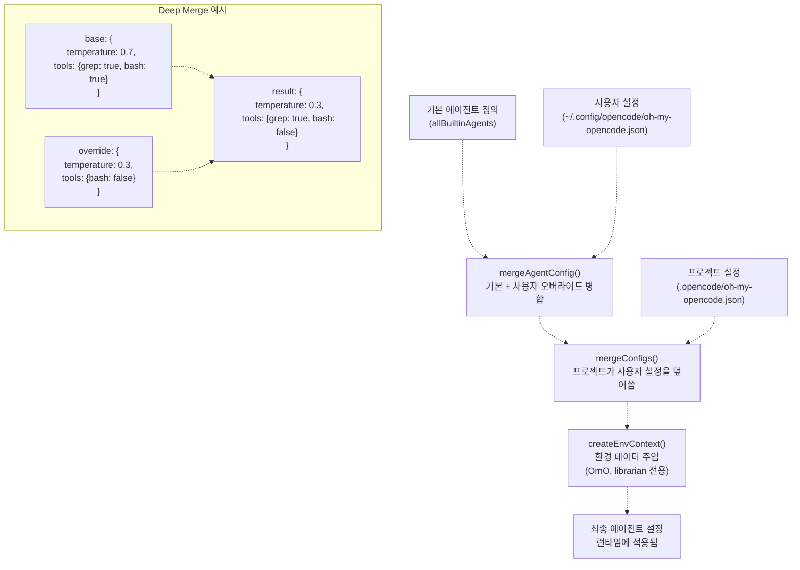
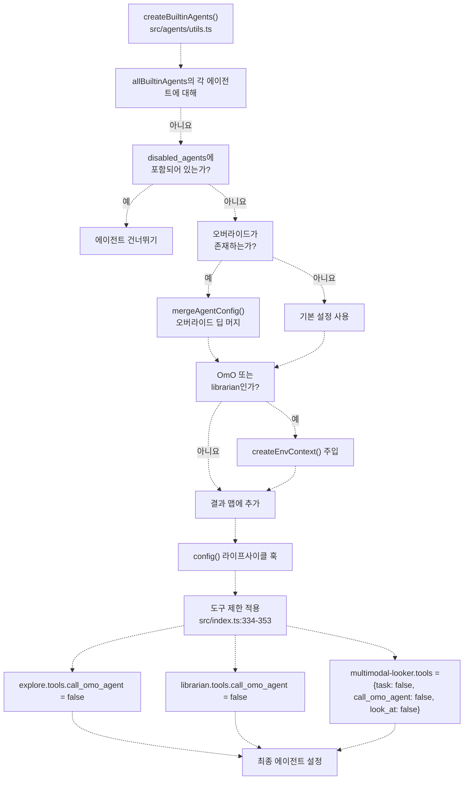
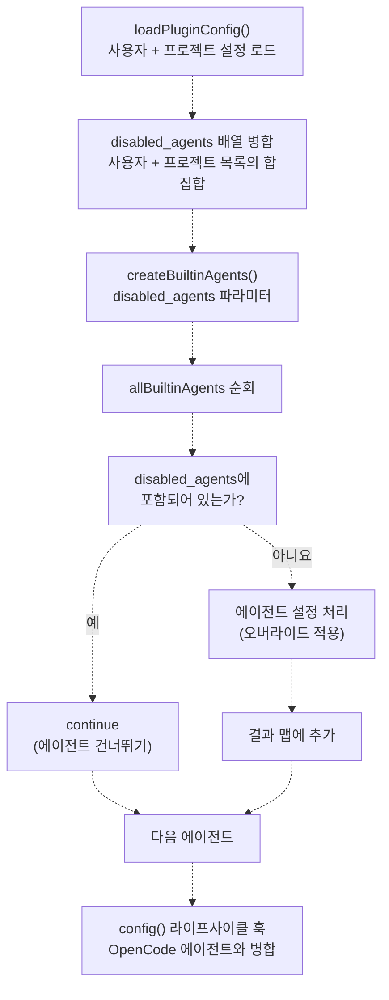
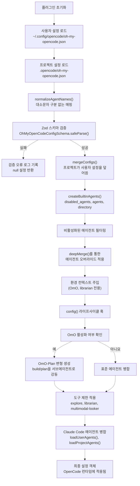

# 에이전트 설정 (Agent Configuration)

> **관련 소스 파일**
> * [.github/assets/sisyphus.png](https://github.com/code-yeongyu/oh-my-opencode/blob/b92cd6ab/.github/assets/sisyphus.png)
> * [assets/oh-my-opencode.schema.json](https://github.com/code-yeongyu/oh-my-opencode/blob/b92cd6ab/assets/oh-my-opencode.schema.json)
> * [src/agents/index.ts](https://github.com/code-yeongyu/oh-my-opencode/blob/b92cd6ab/src/agents/index.ts)
> * [src/agents/sisyphus.ts](https://github.com/code-yeongyu/oh-my-opencode/blob/b92cd6ab/src/agents/sisyphus.ts)
> * [src/agents/types.ts](https://github.com/code-yeongyu/oh-my-opencode/blob/b92cd6ab/src/agents/types.ts)
> * [src/agents/utils.test.ts](https://github.com/code-yeongyu/oh-my-opencode/blob/b92cd6ab/src/agents/utils.test.ts)
> * [src/agents/utils.ts](https://github.com/code-yeongyu/oh-my-opencode/blob/b92cd6ab/src/agents/utils.ts)
> * [src/config/schema.ts](https://github.com/code-yeongyu/oh-my-opencode/blob/b92cd6ab/src/config/schema.ts)
> * [src/hooks/index.ts](https://github.com/code-yeongyu/oh-my-opencode/blob/b92cd6ab/src/hooks/index.ts)
> * [src/index.ts](https://github.com/code-yeongyu/oh-my-opencode/blob/b92cd6ab/src/index.ts)

이 페이지는 설정 시스템을 통해 내장 에이전트를 커스터마이징하는 방법을 설명합니다. 에이전트 오버라이드(Override), 환경 컨텍스트 주입(Environment context injection), 도구 권한 제어, 그리고 에이전트 비활성화 시스템에 대해 다룹니다.

특정 에이전트의 기능 및 위임 패턴에 대한 정보는 [OmO Orchestrator](/code-yeongyu/oh-my-opencode/4.1-sisyphus-orchestrator), [Oracle Agent](/code-yeongyu/oh-my-opencode/4.2-specialized-agents), [Explore Agent](/code-yeongyu/oh-my-opencode/4.3-agent-configuration), [Librarian Agent](#4.4), 및 [Implementation Agents](#4.5)를 참조하십시오. 설정 파일 구조 및 로딩에 대해서는 [설정 파일(Configuration Files)](../getting-started/Configuration-Files.md) 및 [설정 시스템(Configuration System)](/code-yeongyu/oh-my-opencode/3.2-configuration-system)을 참조하십시오.

## 에이전트 오버라이드 시스템 (Agent Override System)

플러그인은 `agents` 설정 객체를 통해 모든 내장 에이전트의 커스터마이징을 허용합니다. 오버라이드는 `deep merge`(깊은 병합) 방식을 사용하여 전체 에이전트 설정을 다시 정의하지 않고도 부분적인 수정이 가능합니다.

### 오버라이드 설정 스키마 (Override Configuration Schema)

에이전트 오버라이드는 `AgentOverrideConfigSchema`를 통해 정의되며, 다음 속성들을 지원합니다:

| 속성 | 타입 | 범위 | 설명 |
| --- | --- | --- | --- |
| `model` | string | - | AI 모델 식별자 (예: `"claude-opus-4-5"`, `"gemini-3-pro"`) |
| `temperature` | number | 0.0 - 2.0 | 응답의 무작위성을 위한 샘플링 온도 |
| `top_p` | number | 0.0 - 1.0 | 핵 샘플링(Nucleus sampling) 임계값 |
| `prompt` | string | - | 에이전트 지침을 오버라이드하거나 확장하기 위한 시스템 프롬프트 |
| `tools` | Record<string, boolean> | - | 도구 가용성 오버라이드 (true = 활성화, false = 비활성화) |
| `disable` | boolean | - | 에이전트를 완전히 비활성화 |
| `description` | string | - | 사용자가 읽을 수 있는 에이전트 설명 |
| `mode` | enum | `"subagent"` \| `"primary"` \| `"all"` | 에이전트 호출 모드 |
| `color` | string | hex color | 에이전트 식별을 위한 UI 색상 (형식: `#RRGGBB`) |
| `permission` | object | - | edit, bash, webfetch, doom_loop, external_directory에 대한 권한 오버라이드 |

출처: [src/config/schema.ts L67-L81](https://github.com/code-yeongyu/oh-my-opencode/blob/b92cd6ab/src/config/schema.ts#L67-L81)

### 설정 파일 구조

에이전트 오버라이드는 `oh-my-opencode.json`의 `agents` 키 아래에 지정됩니다:

```json
{
  "agents": {
    "OmO": {
      "temperature": 0.3,
      "tools": {
        "bash": false
      }
    },
    "explore": {
      "model": "claude-opus-4",
      "temperature": 0.1
    },
    "oracle": {
      "prompt": "You are a senior architect specializing in distributed systems..."
    }
  }
}
```

출처: [src/config/schema.ts L83-L94](https://github.com/code-yeongyu/oh-my-opencode/blob/b92cd6ab/src/config/schema.ts#L83-L94)

 [src/index.ts L90-L113](https://github.com/code-yeongyu/oh-my-opencode/blob/b92cd6ab/src/index.ts#L90-L113)

### 오버라이드 가능 에이전트

다음 에이전트들은 설정 오버라이드를 지원합니다:

| 에이전트 이름 | 기본 모델 | 용도 |
| --- | --- | --- |
| `OmO` | claude-opus-4-5 | 기본 오케스트레이터 |
| `OmO-Plan` | (plan에서 상속) | OmO의 계획 수립 변형 |
| `build` | (OpenCode 기본값) | 빌드 에이전트 |
| `plan` | (OpenCode 기본값) | 계획 수립 에이전트 |
| `oracle` | gpt-5.2 | 전문가 자문 |
| `librarian` | big-pickle | 외부 리서치 |
| `explore` | grok-code | 코드베이스 탐색 |
| `frontend-ui-ux-engineer` | gemini-3-pro | UI 구현 |
| `document-writer` | gemini-3-pro | 문서 생성 |
| `multimodal-looker` | gemini-2.5-flash | 미디어 분석 |

출처: [src/config/schema.ts L29-L40](https://github.com/code-yeongyu/oh-my-opencode/blob/b92cd6ab/src/config/schema.ts#L29-L40)

 [src/agents/utils.ts L12-L20](https://github.com/code-yeongyu/oh-my-opencode/blob/b92cd6ab/src/agents/utils.ts#L12-L20)

## 딥 머지 동작 (Deep Merge Behavior)

설정 시스템은 `deepMerge`를 사용하여 기본 에이전트 정의와 사용자 오버라이드를 결합합니다. 이를 통해 기본 설정을 유지하면서 부분적인 수정이 가능합니다.

### 머지 흐름도 (Merge Flow Diagram)



출처: [src/agents/utils.ts L55-L60](https://github.com/code-yeongyu/oh-my-opencode/blob/b92cd6ab/src/agents/utils.ts#L55-L60)

 [src/index.ts L116-L144](https://github.com/code-yeongyu/oh-my-opencode/blob/b92cd6ab/src/index.ts#L116-L144)

 [src/shared/index.ts](https://github.com/code-yeongyu/oh-my-opencode/blob/b92cd6ab/src/shared/index.ts)

### 머지 우선순위 (Merge Priority)

병합 프로세스는 다음 우선순위(높은 순에서 낮은 순)를 따릅니다:

1. **프로젝트 레벨 오버라이드** (`.opencode/oh-my-opencode.json`)
2. **사용자 레벨 오버라이드** (`~/.config/opencode/oh-my-opencode.json`)
3. **기본 에이전트 정의** (`allBuiltinAgents`)

출처: [src/index.ts L146-L178](https://github.com/code-yeongyu/oh-my-opencode/blob/b92cd6ab/src/index.ts#L146-L178)

## 환경 컨텍스트 주입 (Environment Context Injection)

`createEnvContext` 함수는 에이전트 프롬프트에 자동으로 추가되는 런타임 환경 정보를 생성합니다. 이는 에이전트에게 시간 및 플랫폼 인지 능력을 제공합니다.

### 컨텍스트 정보

환경 컨텍스트에는 다음 내용이 포함됩니다:

```yaml
Working directory: /path/to/project
Platform: darwin | linux | win32
Today's date: Mon, Jan 15, 2024 (NOT 2024, NEVEREVER 2024)
Current time: 02:45:30 PM
Timezone: America/New_York
Locale: en-US
```

출처: [src/agents/utils.ts L22-L53](https://github.com/code-yeongyu/oh-my-opencode/blob/b92cd6ab/src/agents/utils.ts#L22-L53)

### 주입 대상

환경 컨텍스트는 특정 에이전트에게만 주입됩니다:

| 에이전트 | 컨텍스트 수신 여부 | 근거 |
| --- | --- | --- |
| `OmO` | ✅ 예 | 작업 계획 및 사용자 커뮤니케이션을 위해 시간 인지 능력이 필요함 |
| `librarian` | ✅ 예 | 문서 버전 관련성을 위해 날짜 컨텍스트가 필요함 |
| `oracle` | ❌ 아니요 | 아키텍처 조언은 컨텍스트와 무관함 |
| `explore` | ❌ 아니요 | 파일 탐색은 시간 데이터를 필요로 하지 않음 |
| `frontend-ui-ux-engineer` | ❌ 아니요 | UI 구현은 컨텍스트와 무관함 |
| `document-writer` | ❌ 아니요 | 문서 작성은 환경 데이터를 필요로 하지 않음 |
| `multimodal-looker` | ❌ 아니요 | 미디어 분석은 컨텍스트와 무관함 |

주입은 디렉토리 경로가 제공된 경우 `createBuiltinAgents` 중에 발생합니다:

```javascript
if ((agentName === "OmO" || agentName === "librarian") && directory && config.prompt) {
  const envContext = createEnvContext(directory)
  finalConfig = {
    ...config,
    prompt: config.prompt + envContext,
  }
}
```

출처: [src/agents/utils.ts L78-L84](https://github.com/code-yeongyu/oh-my-opencode/blob/b92cd6ab/src/agents/utils.ts#L78-L84)

## 도구 권한 제어 (Tool Permission Control)

플러그인은 액세스 제어를 강화하고 에이전트 위임 시 재귀를 방지하기 위해 계층적 도구 권한 시스템을 구현합니다.

### 도구 제한이 포함된 에이전트 생성 파이프라인



출처: [src/agents/utils.ts L62-L95](https://github.com/code-yeongyu/oh-my-opencode/blob/b92cd6ab/src/agents/utils.ts#L62-L95)

 [src/index.ts L284-L353](https://github.com/code-yeongyu/oh-my-opencode/blob/b92cd6ab/src/index.ts#L284-L353)

### 권한 매트릭스 (Permission Matrix)

| 에이전트 | call_omo_agent | task | look_at | bash | edit | 근거 |
| --- | --- | --- | --- | --- | --- | --- |
| OmO | ✅ 전체 | ✅ 전체 | ✅ 전체 | ✅ 전체 | ✅ 전체 | 기본 오케스트레이터는 모든 도구가 필요함 |
| oracle | ✅ 전체 | ✅ 전체 | ✅ 전체 | ✅ 전체 | ✅ 전체 | 전문가 자문은 위임이 가능함 |
| explore | ❌ 비활성 | ✅ 전체 | ✅ 전체 | ✅ 전체 | ❌ 읽기 전용 | 재귀 및 수정을 방지함 |
| librarian | ❌ 비활성 | ✅ 전체 | ✅ 전체 | ✅ 전체 | ❌ 읽기 전용 | 재귀 및 외부 변경을 방지함 |
| frontend-ui-ux-engineer | ✅ 전체 | ✅ 전체 | ✅ 전체 | ✅ 전체 | ✅ 전체 | 구현을 위해 쓰기 권한이 필요함 |
| document-writer | ✅ 전체 | ✅ 전체 | ✅ 전체 | ✅ 전체 | ✅ 전체 | 문서화를 위해 쓰기 권한이 필요함 |
| multimodal-looker | ❌ 비활성 | ❌ 비활성 | ❌ 비활성 | ❌ 읽기 전용 | ❌ 읽기 전용 | 특수 미디어 분석 전용 |

출처: [src/index.ts L334-L353](https://github.com/code-yeongyu/oh-my-opencode/blob/b92cd6ab/src/index.ts#L334-L353)

 [src/index.ts L498-L508](https://github.com/code-yeongyu/oh-my-opencode/blob/b92cd6ab/src/index.ts#L498-L508)

### 런타임 도구 제한

작업 호출 중에 `tool.execute.before` 라이프사이클 훅에서 추가적인 제한이 적용됩니다:

```typescript
if (input.tool === "task") {
  const args = output.args as Record<string, unknown>;
  const subagentType = args.subagent_type as string;
  const isExploreOrLibrarian = ["explore", "librarian"].includes(subagentType);

  args.tools = {
    ...(args.tools as Record<string, boolean> | undefined),
    background_task: false,
    ...(isExploreOrLibrarian ? { call_omo_agent: false } : {}),
  };
}
```

이를 통해 다음 사항이 보장됩니다:

1. 어떤 에이전트도 `task()`를 통해 호출될 때 `background_task`를 사용할 수 없음 (중첩된 백그라운드 실행 방지)
2. `explore` 및 `librarian`은 `call_omo_agent`를 사용할 수 없음 (재귀 방지)

출처: [src/index.ts L498-L508](https://github.com/code-yeongyu/oh-my-opencode/blob/b92cd6ab/src/index.ts#L498-L508)

## 에이전트 비활성화 시스템 (Disabled Agents System)

`disabled_agents` 설정 배열을 통해 에이전트를 완전히 비활성화할 수 있습니다. 비활성화된 에이전트는 에이전트 생성 단계에서 제외됩니다.

### 설정 예시

```json
{
  "disabled_agents": ["oracle", "document-writer"]
}
```

### 비활성화된 에이전트 흐름



출처: [src/index.ts L124-L141](https://github.com/code-yeongyu/oh-my-opencode/blob/b92cd6ab/src/index.ts#L124-L141)

 [src/agents/utils.ts L62-L95](https://github.com/code-yeongyu/oh-my-opencode/blob/b92cd6ab/src/agents/utils.ts#L62-L95)

### 비활성화 vs. 오버라이드 비활성화

에이전트를 비활성화하는 방법에는 두 가지가 있습니다:

| 방법 | 설정 | 동작 | 사용 사례 |
| --- | --- | --- | --- |
| `disabled_agents` 배열 | `"disabled_agents": ["oracle"]` | 에이전트가 생성되지 않으며 모든 설정에서 제외됨 | 영구적인 비활성화, 플러그인 오버헤드 감소 |
| `agents.{name}.disable` | `"agents": {"oracle": {"disable": true}}` | 에이전트가 생성되지만 비활성 상태로 표시됨 | 조건부 비활성화, 설정 구조 유지 |

출처: [src/config/schema.ts L73](https://github.com/code-yeongyu/oh-my-opencode/blob/b92cd6ab/src/config/schema.ts#L73-L73)

 [src/index.ts L124-L141](https://github.com/code-yeongyu/oh-my-opencode/blob/b92cd6ab/src/index.ts#L124-L141)

## 에이전트 이름 정규화 (Agent Name Normalization)

설정 시스템은 대소문자를 구분하지 않는 매칭을 처리하기 위해 에이전트 이름을 정규화합니다. 이는 사용자가 일관되지 않은 대소문자로 에이전트 이름을 지정할 때 발생하는 오류를 방지합니다.

### 정규화 매핑

```javascript
const AGENT_NAME_MAP: Record<string, string> = {
  omo: "OmO",
  build: "build",
  oracle: "oracle",
  librarian: "librarian",
  explore: "explore",
  "frontend-ui-ux-engineer": "frontend-ui-ux-engineer",
  "document-writer": "document-writer",
  "multimodal-looker": "multimodal-looker",
};
```

모든 소문자 키는 정규 형식으로 매핑됩니다. 이를 통해 다음과 같은 설정이 가능합니다:

```json
{
  "agents": {
    "omo": { "temperature": 0.3 },
    "OmO": { "temperature": 0.3 }
  }
}
```

두 설정 모두 `"OmO"`로 정규화됩니다.

출처: [src/index.ts L70-L88](https://github.com/code-yeongyu/oh-my-opencode/blob/b92cd6ab/src/index.ts#L70-L88)

## 특수 에이전트 설정 (Special Agent Configurations)

### OmO-Plan 오버라이드

OmO가 활성화된 경우(`omo_agent.disabled !== true`), 플러그인은 OpenCode의 내장 `plan` 에이전트 설정을 상속받는 `OmO-Plan` 에이전트를 생성합니다:

```javascript
const { name: _planName, ...planConfigWithoutName } = config.agent?.plan ?? {};
const omoPlanOverride = pluginConfig.agents?.["OmO-Plan"];
const omoPlanBase = {
  ...builtinAgents.OmO,
  ...planConfigWithoutName,
  description: `${config.agent?.plan?.description ?? "Plan agent"} (OhMyOpenCode version)`,
  color: config.agent?.plan?.color ?? "#6495ED",
};

const omoPlanConfig = omoPlanOverride ? deepMerge(omoPlanBase, omoPlanOverride) : omoPlanBase;
```

이는 다음을 결합하여 계획 수립에 특화된 OmO 변형을 생성합니다:

1. OmO의 기본 설정
2. OpenCode의 `plan` 에이전트 설정 (이름 제외)
3. 사용자가 제공한 `OmO-Plan` 오버라이드

출처: [src/index.ts L300-L320](https://github.com/code-yeongyu/oh-my-opencode/blob/b92cd6ab/src/index.ts#L300-L320)

### Build 및 Plan 모드 강등 (Demotion)

OmO가 활성화되면 기본 `build` 및 `plan` 에이전트는 `subagent` 모드로 강등됩니다:

```javascript
config.agent = {
  OmO: builtinAgents.OmO,
  "OmO-Plan": omoPlanConfig,
  ...Object.fromEntries(Object.entries(builtinAgents).filter(([k]) => k !== "OmO")),
  ...userAgents,
  ...projectAgents,
  ...config.agent,
  build: { ...config.agent?.build, mode: "subagent" },
  plan: { ...config.agent?.plan, mode: "subagent" },
};
```

이를 통해 OmO를 기본 에이전트로 만들면서, `build`와 `plan`은 작업 위임을 위한 서브에이전트로 유지합니다.

출처: [src/index.ts L311-L320](https://github.com/code-yeongyu/oh-my-opencode/blob/b92cd6ab/src/index.ts#L311-L320)

## 설정 라이프사이클 요약 (Configuration Lifecycle Summary)



출처: [src/index.ts L90-L178](https://github.com/code-yeongyu/oh-my-opencode/blob/b92cd6ab/src/index.ts#L90-L178)

 [src/index.ts L180-L381](https://github.com/code-yeongyu/oh-my-opencode/blob/b92cd6ab/src/index.ts#L180-L381)

 [src/agents/utils.ts L62-L95](https://github.com/code-yeongyu/oh-my-opencode/blob/b92cd6ab/src/agents/utils.ts#L62-L95)

## 검증 및 오류 처리 (Validation and Error Handling)

모든 설정 입력은 Zod 스키마를 사용하여 검증됩니다. 유효하지 않은 설정은 상세한 오류 로그를 생성합니다:

```javascript
const result = OhMyOpenCodeConfigSchema.safeParse(rawConfig);

if (!result.success) {
  log(`Config validation error in ${configPath}:`, result.error.issues);
  return null;
}
```

일반적인 검증 오류:

* 유효하지 않은 모델 이름 (문자열이어야 함)
* 범위를 벗어난 온도 (0.0 - 2.0)
* 범위를 벗어난 Top_p (0.0 - 1.0)
* 유효하지 않은 색상 형식 (`#RRGGBB`여야 함)
* 알 수 없는 에이전트 이름 (`BuiltinAgentNameSchema`와 일치해야 함)
* 알 수 없는 훅 이름 (`HookNameSchema`와 일치해야 함)

출처: [src/index.ts L100-L113](https://github.com/code-yeongyu/oh-my-opencode/blob/b92cd6ab/src/index.ts#L100-L113)

 [src/config/schema.ts L1-L127](https://github.com/code-yeongyu/oh-my-opencode/blob/b92cd6ab/src/config/schema.ts#L1-L127)