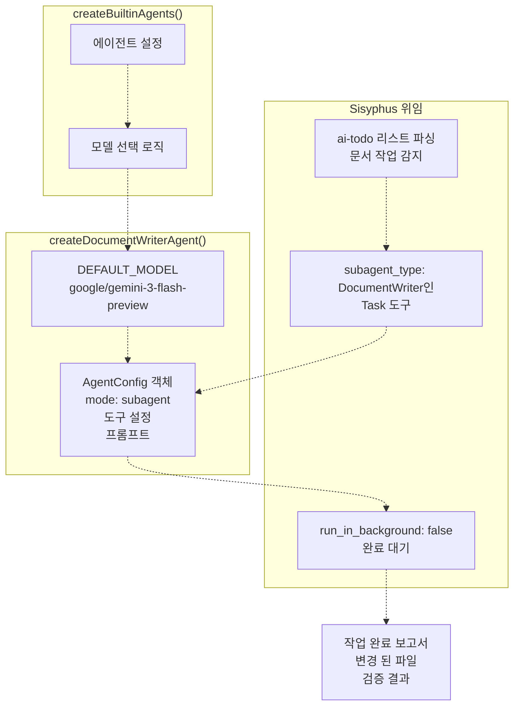
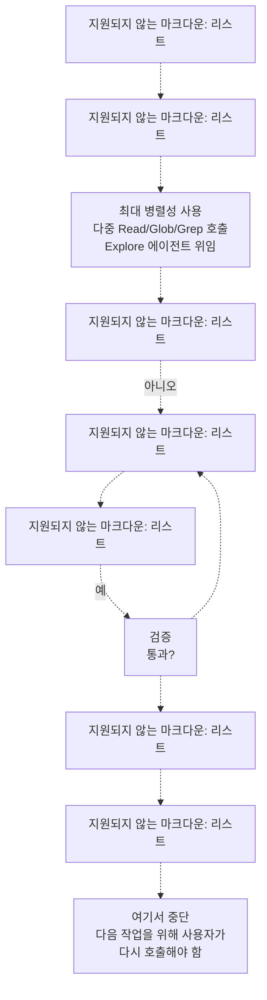
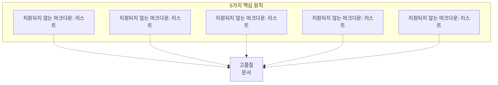
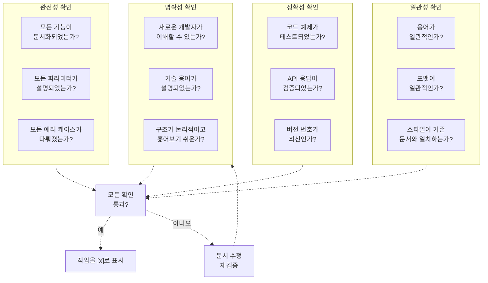
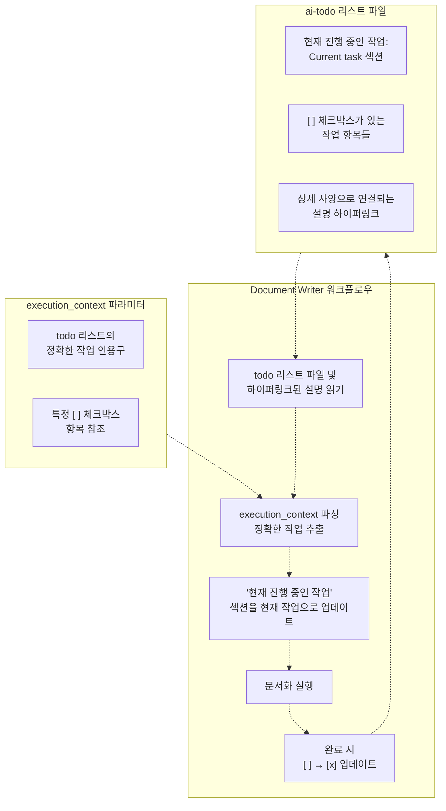
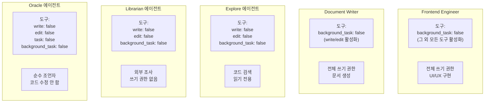
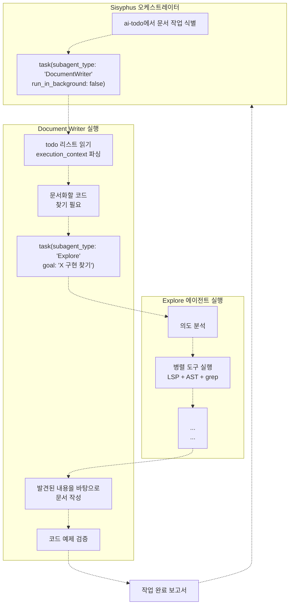
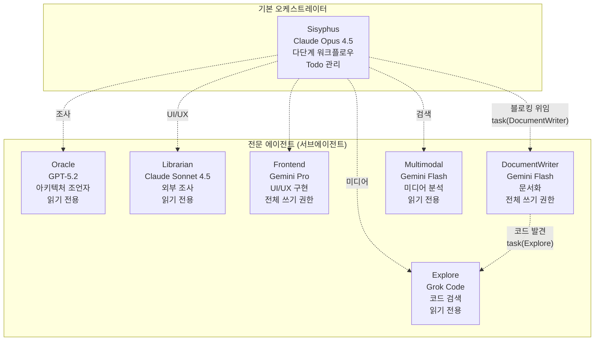

# Document Writer

> **관련 소스 파일**
> * [src/agents/document-writer.ts](https://github.com/code-yeongyu/oh-my-opencode/blob/b92cd6ab/src/agents/document-writer.ts)
> * [src/agents/explore.ts](https://github.com/code-yeongyu/oh-my-opencode/blob/b92cd6ab/src/agents/explore.ts)
> * [src/agents/frontend-ui-ux-engineer.ts](https://github.com/code-yeongyu/oh-my-opencode/blob/b92cd6ab/src/agents/frontend-ui-ux-engineer.ts)
> * [src/agents/librarian.ts](https://github.com/code-yeongyu/oh-my-opencode/blob/b92cd6ab/src/agents/librarian.ts)
> * [src/agents/multimodal-looker.ts](https://github.com/code-yeongyu/oh-my-opencode/blob/b92cd6ab/src/agents/multimodal-looker.ts)
> * [src/agents/oracle.ts](https://github.com/code-yeongyu/oh-my-opencode/blob/b92cd6ab/src/agents/oracle.ts)

Document Writer는 README 파일, API 문서, 아키텍처 문서 및 사용자 가이드를 포함한 기술 문서를 작성하는 전문 서브에이전트(subagent)입니다. 이 에이전트는 엄격한 검증 요구 사항과 품질 표준을 준수하며 ai-todo 리스트 계획에 따른 문서화 작업을 수행합니다.

다른 전문 에이전트에 대한 정보는 [Specialized Agents](/code-yeongyu/oh-my-opencode/4.2-specialized-agents)를 참조하십시오. 이 에이전트에게 작업을 위임하는 기본 오케스트레이터(orchestrator)에 대해서는 [Sisyphus Orchestrator](/code-yeongyu/oh-my-opencode/4.1-sisyphus-orchestrator)를 참조하십시오.

## 에이전트 설정 (Agent Configuration)

Document Writer 에이전트는 `createDocumentWriterAgent()`를 통해 생성되며 다음과 같이 구성됩니다:

| 속성 | 값 | 목적 |
| --- | --- | --- |
| **Model** | `google/gemini-3-flash-preview` | 구조화된 글쓰기를 위한 빠르고 비용 효율적인 모델 |
| **Mode** | `subagent` | Sisyphus 아래에서 위임된 전문가로 작동 |
| **Temperature** | `0.1` (상속됨) | 일관성을 위한 낮은 온도 설정 |
| **Tools** | `background_task`를 제외한 모든 도구 활성화 | 전체 읽기/쓰기 권한을 가지나, 백그라운드 작업 생성은 불가 |
| **Delegation** | 블로킹 (동기식) | Sisyphus는 진행하기 전 작업 완료를 대기함 |

**주요 제약 사항**: 에이전트는 백그라운드 작업(`background_task: false`)을 생성할 수 없으며, 이는 재귀적인 위임 체인을 방지합니다.

**출처**: [src/agents/document-writer.ts L1-L13](https://github.com/code-yeongyu/oh-my-opencode/blob/b92cd6ab/src/agents/document-writer.ts#L1-L13)

### 에이전트 팩토리 통합 (Agent Factory Integration)



**출처**: [src/agents/document-writer.ts L5-L13](https://github.com/code-yeongyu/oh-my-opencode/blob/b92cd6ab/src/agents/document-writer.ts#L5-L13)

## 핵심 책임 (Core Responsibilities)

Document Writer는 네 가지 주요 문서 카테고리를 전문으로 합니다:

### 문서 유형 (Documentation Types)

| 유형 | 구조 | 어조 | 중점 사항 |
| --- | --- | --- | --- |
| **README 파일** | 제목, 설명, 설치, 사용법, API 참조, 기여, 라이선스 | 환영하는 분위기이면서도 전문적임 | 명확한 예시를 통해 사용자가 빠르게 시작할 수 있도록 함 |
| **API 문서** | 엔드포인트, 메서드, 파라미터, 요청/응답 예시, 에러 코드 | 기술적이고 정밀하며 포괄적임 | 개발자가 통합하는 데 필요한 모든 세부 사항 제공 |
| **아키텍처 문서** | 개요, 구성 요소, 데이터 흐름, 의존성, 설계 결정 | 교육적이고 설명적임 | 시스템이 왜 그렇게 구축되었는지에 대한 이유 설명 |
| **사용자 가이드** | 서론, 전제 조건, 단계별 튜토리얼, 문제 해결 | 친절하고 지원적임 | 사용자를 성공적인 결과로 안내 |

**출처**: [src/agents/document-writer.ts L93-L113](https://github.com/code-yeongyu/oh-my-opencode/blob/b92cd6ab/src/agents/document-writer.ts#L93-L113)

## 워크플로우 프로세스 (Workflow Process)

Document Writer는 시스템 프롬프트를 통해 강제되는 필수 7단계 워크플로우를 따릅니다:



**중요 규칙**:

* **호출당 단 하나의 체크박스 항목만 실행** - 단일 작업 제약으로 작업 범위 확장(scope creep) 방지
* **한 가지 작업을 완료한 후 즉시 중단** - Sisyphus에 의한 명시적 지속 호출 강제
* **성공적으로 완료된 후에만 체크박스를 `[ ]`에서 `[x]`로 업데이트** - 조기 표시 금지
* **절대 다음 작업으로 계속 진행하지 않음** - 사용자/Sisyphus가 다시 호출해야 함

**출처**: [src/agents/document-writer.ts L74-L149](https://github.com/code-yeongyu/oh-my-opencode/blob/b92cd6ab/src/agents/document-writer.ts#L74-L149)

### 병렬 탐색 전략 (Parallel Exploration Strategy)

워크플로우는 탐색 단계에서 공격적인 병렬 처리를 강조합니다:

| 작업 유형 | 전략 | 예시 도구 |
| --- | --- | --- |
| **코드베이스 탐색** | 다수의 동시 읽기 작업 수행 | 단일 메시지 내 `read()`, `glob()`, `grep()` 사용 |
| **코드 발견** | Explore 에이전트에게 위임 | `task(subagent_type: "Explore")` |
| **패턴 분석** | LSP 및 AST 도구 병렬 사용 | `lsp_workspace_symbols()`, `ast_grep_search()` |

프롬프트에는 다음과 같이 명시되어 있습니다: **"최대 병렬성 사용: 코드베이스를 탐색할 때(Read, Glob, Grep), 단일 메시지에서 다중 도구 호출을 수행하십시오"** 및 **"공격적으로 탐색하십시오: 문서화할 코드를 찾기 위해 `subagent_type=Explore`인 Task 도구를 사용하십시오"**.

**출처**: [src/agents/document-writer.ts L84-L86](https://github.com/code-yeongyu/oh-my-opencode/blob/b92cd6ab/src/agents/document-writer.ts#L84-L86)

## 행동 강령 원칙 (Code of Conduct Principles)

Document Writer는 시스템 프롬프트에 내장된 5가지 핵심 원칙에 따라 작동합니다:



### 원칙 1: 근면 및 성실 (Diligence & Integrity)

**협상 불가능한 요구 사항**:

* 관련 없는 내용을 추가하지 않고 지정된 정확한 작업을 수행합니다.
* 적절한 검증 없이 작업을 완료로 표시하지 않습니다.
* 모든 코드 예제가 실제로 작동하는지 확인합니다 (단순 복사-붙여넣기 금지).
* 처음에 불분명하더라도 문서가 올바르게 작성될 때까지 반복합니다.
* 품질과 정확성에 대해 전적인 책임을 집니다.

**출처**: [src/agents/document-writer.ts L24-L33](https://github.com/code-yeongyu/oh-my-opencode/blob/b92cd6ab/src/agents/document-writer.ts#L24-L33)

### 원칙 4: 검증 주도 문서화 (Verification-Driven Documentation)

**중요 명령**: *"검증 없는 문서는 잠재적으로 해롭습니다."*

**검증 요구 사항**:

1. **모든 코드 스니펫 테스트** - 반드시 테스트되고 작동해야 합니다.
2. **기존 문서 검색** - 변경 사항의 영향을 받는 문서를 찾아 업데이트합니다.
3. **문서화된 모든 명령 실행** - 정확성을 보장합니다.
4. **엣지 케이스 처리** - 정상적인 경로뿐만 아니라 오류 조건도 문서화합니다.
5. **현실에 맞춰 문서 수정** - 문서가 현실과 일치하지 않으면 문서를 업데이트합니다 (또는 코드 문제를 제기합니다).

**문서가 검증될 때까지 작업은 완료된 것이 아닙니다.**

**출처**: [src/agents/document-writer.ts L52-L62](https://github.com/code-yeongyu/oh-my-opencode/blob/b92cd6ab/src/agents/document-writer.ts#L52-L62)

## 검증 시스템 (Verification System)

검증 단계는 필수이며 작업을 완료로 표시하기 전에 반드시 통과해야 합니다:

| 검증 유형 | 확인 사항 | 실패 시 조치 |
| --- | --- | --- |
| **코드 예제** | 모든 스니펫이 테스트되고 작동함 | 4단계(문서화 실행)로 돌아감 |
| **설치 지침** | 해당되는 경우 설정 단계 실행 확인 | 수정 후 재검증 |
| **링크** | 내부 및 외부 링크의 유효성 | 링크 업데이트 후 재검증 |
| **API 예제** | 실제 API와 대조하여 요청/응답 검증 | 예제 수정 후 재검증 |

**검증 실패 루프**: 검증이 실패하면 에이전트는 체크박스를 선택해서는 **안 되며**, 문서를 수정하기 위해 4단계로 돌아간 후 다시 검증해야 합니다.

**출처**: [src/agents/document-writer.ts L115-L122](https://github.com/code-yeongyu/oh-my-opencode/blob/b92cd6ab/src/agents/document-writer.ts#L115-L122)

### 품질 체크리스트 (Quality Checklist)

시스템 프롬프트에는 내장된 품질 체크리스트가 포함되어 있습니다:



**출처**: [src/agents/document-writer.ts L152-L173](https://github.com/code-yeongyu/oh-my-opencode/blob/b92cd6ab/src/agents/document-writer.ts#L152-L173)

## Todo 시스템과의 통합 (Integration with Todo System)

Document Writer는 Sisyphus의 todo 관리 시스템과 긴밀하게 결합되어 있습니다:

### Todo 리스트 처리 (Todo List Processing)



**작업 식별**: 에이전트는 todo 리스트 파일의 `execution_context`에서 **정확한 작업 인용구(EXACT TASK QUOTE)**를 찾아야 합니다. 이를 통해 의도된 작업만 실행하도록 보장합니다.

**단일 작업 제약**: 워크플로우는 다음 작업으로 계속 진행하는 것을 명시적으로 금지합니다. 하나의 체크박스 항목을 완료한 후, 에이전트는 **반드시 중단**하고 완료 보고서를 생성해야 합니다. Sisyphus는 다음 작업을 위해 에이전트를 다시 호출해야 합니다.

**출처**: [src/agents/document-writer.ts L76-L90](https://github.com/code-yeongyu/oh-my-opencode/blob/b92cd6ab/src/agents/document-writer.ts#L76-L90)

### 완료 보고서 형식 (Completion Report Format)

성공적으로 실행된 후, 에이전트는 구조화된 보고서를 생성합니다:

```
**TASK COMPLETION REPORT**
```

COMPLETED TASK: [정확한 작업 설명]
STATUS: SUCCESS/FAILED/BLOCKED

WHAT WAS DOCUMENTED:

* [작성된 모든 문서의 상세 리스트]
* [경로를 포함하여 생성/수정된 파일]

FILES CHANGED:

* Created: [새 파일 리스트]
* Modified: [수정된 파일 리스트]

VERIFICATION RESULTS:

* [코드 예제 테스트: X/Y 작동함]
* [링크 확인: X/Y 유효함]

TIME TAKEN: [소요 시간]

```
STOP HERE - DO NOT CONTINUE TO NEXT TASK
```

**출처**: [src/agents/document-writer.ts L127-L148](https://github.com/code-yeongyu/oh-my-opencode/blob/b92cd6ab/src/agents/document-writer.ts#L127-L148)

## 도구 액세스 및 기능 (Tool Access and Capabilities)

Document Writer는 다른 에이전트와 차별화된 도구 액세스 권한을 가집니다:

### 도구 권한 (Tool Permissions)

| 도구 카테고리 | 액세스 | 근거 |
| --- | --- | --- |
| **read** | ✓ 활성화 | 소스 코드 및 기존 문서 읽기 |
| **write** | ✓ 활성화 | 문서 파일 생성 및 업데이트 |
| **edit** | ✓ 활성화 | 기존 문서 수정 |
| **bash** | ✓ 활성화 | 예제 검증을 위한 명령 실행 |
| **task** | ✓ 활성화 | 코드 발견을 위해 Explore 에이전트에게 위임 |
| **background_task** | ✗ 비활성화 | 재귀적 위임 방지 |
| **LSP tools** | ✓ 활성화 (상속됨) | 코드 구조 탐색 |
| **AST-Grep** | ✓ 활성화 (상속됨) | 코드 패턴 검색 |

**주요 차이점**: Librarian 및 Explore 에이전트(`write: false, edit: false`)와 달리, Document Writer는 문서 파일을 생성/수정하는 것이 주 업무이므로 전체 쓰기 권한을 가집니다.

**출처**: [src/agents/document-writer.ts L13](https://github.com/code-yeongyu/oh-my-opencode/blob/b92cd6ab/src/agents/document-writer.ts#L13-L13)

### 다른 에이전트와의 비교 (Comparison with Other Agents)



**출처**: [src/agents/oracle.ts L79](https://github.com/code-yeongyu/oh-my-opencode/blob/b92cd6ab/src/agents/oracle.ts#L79-L79)

 [src/agents/librarian.ts L12](https://github.com/code-yeongyu/oh-my-opencode/blob/b92cd6ab/src/agents/librarian.ts#L12-L12)

 [src/agents/explore.ts L12](https://github.com/code-yeongyu/oh-my-opencode/blob/b92cd6ab/src/agents/explore.ts#L12-L12)

 [src/agents/document-writer.ts L13](https://github.com/code-yeongyu/oh-my-opencode/blob/b92cd6ab/src/agents/document-writer.ts#L13-L13)

 [src/agents/frontend-ui-ux-engineer.ts L13](https://github.com/code-yeongyu/oh-my-opencode/blob/b92cd6ab/src/agents/frontend-ui-ux-engineer.ts#L13-L13)

## 위임 패턴 (Delegation Patterns)

### Sisyphus가 Document Writer에게 위임하는 경우

Document Writer는 `subagent_type: "DocumentWriter"`인 `task` 도구를 통해 호출됩니다:

**트리거 조건**:

1. **ai-todo 리스트에 문서화 작업 포함** - 작업 설명이 문서화 작업을 나타내는 경우
2. **명시적인 문서화 요청** - 사용자가 README, API 문서 또는 가이드를 요청하는 경우
3. **구현 후 문서화** - 기능 구현 후, Sisyphus가 문서 업데이트를 위임하는 경우

**위임 모드**: 항상 **블로킹(blocking)** 방식(`run_in_background: false`)입니다. Sisyphus는 Document Writer가 완료되고 보고할 때까지 기다린 후 다음 단계로 진행합니다.

**출처**: [src/agents/document-writer.ts L10](https://github.com/code-yeongyu/oh-my-opencode/blob/b92cd6ab/src/agents/document-writer.ts#L10-L10)

### Document Writer의 Explore 위임

Document Writer는 코드 발견을 위해 Explore 에이전트에게 작업을 위임할 수 있습니다:



**탐색 전략**: 프롬프트에는 **"공격적으로 탐색하십시오: 문서화할 코드를 찾기 위해 `subagent_type=Explore`인 Task 도구를 사용하십시오"**라고 명시되어 있습니다.

**출처**: [src/agents/document-writer.ts L85-L86](https://github.com/code-yeongyu/oh-my-opencode/blob/b92cd6ab/src/agents/document-writer.ts#L85-L86)

## 문서 스타일 가이드 (Documentation Style Guide)

에이전트는 프롬프트에 내장된 특정 스타일 가이드를 준수합니다:

### 어조 가이드라인 (Tone Guidelines)

| 측면 | 규칙 |
| --- | --- |
| **음성(Voice)** | 전문적이면서도 접근하기 쉬움 |
| **직접성(Directness)** | 직접적이고 자신감 있게, 불필요한 수식어나 모호한 표현 피하기 |
| **문법(Grammar)** | 능동태 사용 |
| **태도(Attitude)** | 불필요한 주의나 단서 조항 배제 |

### 포맷 표준 (Formatting Standards)

| 요소 | 표준 |
| --- | --- |
| **헤더(Headers)** | 훑어보기 쉬운 구조와 계층을 위해 사용 |
| **코드 블록(Code Blocks)** | 항상 구문 강조(syntax highlighting) 포함 |
| **구조화된 데이터** | 명확성을 위해 표(table) 사용 |
| **다이어그램** | 도움이 되는 경우 추가 (Mermaid 선호) |

### 코드 예제 표준 (Code Example Standards)

| 원칙 | 구현 |
| --- | --- |
| **점진적 복잡성** | 단순하게 시작하여 점차 복잡도를 높임 |
| **에러 처리** | 성공 및 에러 케이스 모두 포함 |
| **완전성** | 완전하고 실행 가능한 예제 제시 |
| **주석(Annotations)** | 주요 부분을 설명하는 주석 추가 |

**출처**: [src/agents/document-writer.ts L186-L205](https://github.com/code-yeongyu/oh-my-opencode/blob/b92cd6ab/src/agents/document-writer.ts#L186-L205)

## 에이전트 시스템과의 통합 (Integration with Agent System)

### 에이전트 계층 구조에서의 위치 (Position in Agent Hierarchy)



**고유한 특성**:

* **쓰기 권한**: Oracle, Librarian, Explore와 달리 전체 쓰기/수정 권한을 가집니다.
* **Todo 통합**: ai-todo 시스템과 깊게 통합되어 있습니다 (읽기, 업데이트 및 완료 표시).
* **검증 의무**: 워크플로우에 명시적인 검증 요구 사항이 있는 유일한 에이전트입니다.
* **단일 작업 제약**: Sisyphus의 다중 작업 오케스트레이션과 달리, 하나의 작업을 마친 후 반드시 중단해야 합니다.

**출처**: [src/agents/document-writer.ts L1-L211](https://github.com/code-yeongyu/oh-my-opencode/blob/b92cd6ab/src/agents/document-writer.ts#L1-L211)

 [src/agents/oracle.ts L1-L91](https://github.com/code-yeongyu/oh-my-opencode/blob/b92cd6ab/src/agents/oracle.ts#L1-L91)

 [src/agents/librarian.ts L1-L247](https://github.com/code-yeongyu/oh-my-opencode/blob/b92cd6ab/src/agents/librarian.ts#L1-L247)

 [src/agents/explore.ts L1-L106](https://github.com/code-yeongyu/oh-my-opencode/blob/b92cd6ab/src/agents/explore.ts#L1-L106)

 [src/agents/frontend-ui-ux-engineer.ts L1-L91](https://github.com/code-yeongyu/oh-my-opencode/blob/b92cd6ab/src/agents/frontend-ui-ux-engineer.ts#L1-L91)

 [src/agents/multimodal-looker.ts L1-L51](https://github.com/code-yeongyu/oh-my-opencode/blob/b92cd6ab/src/agents/multimodal-looker.ts#L1-L51)