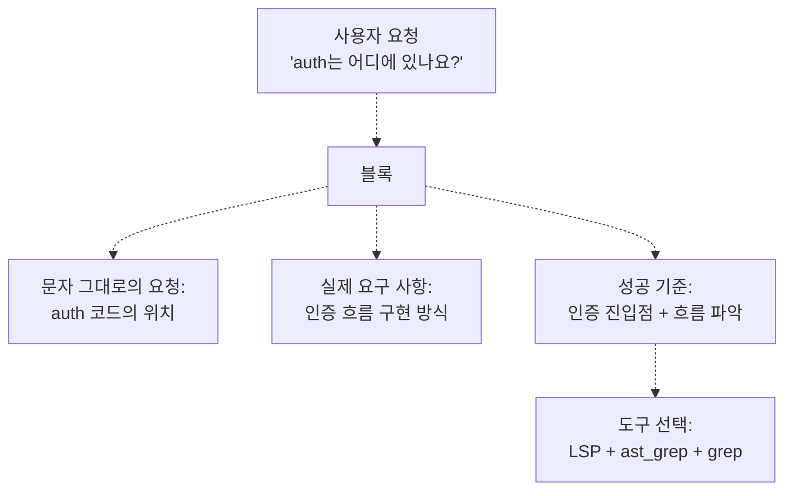
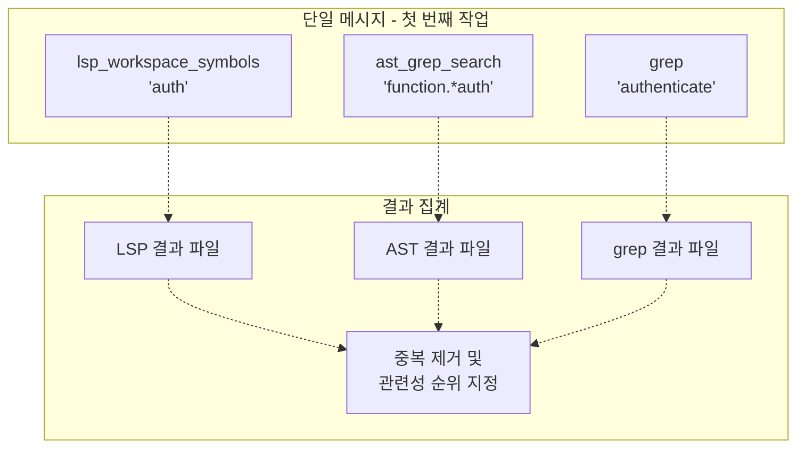
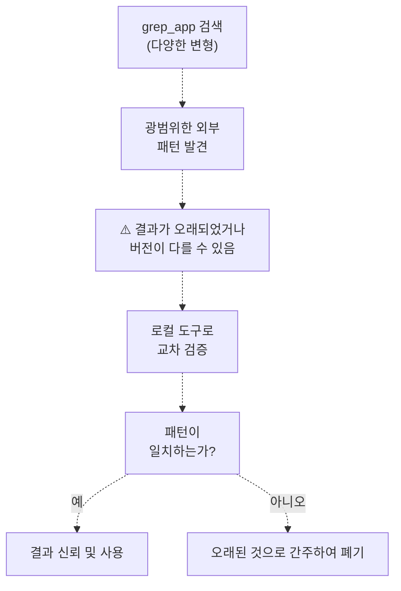
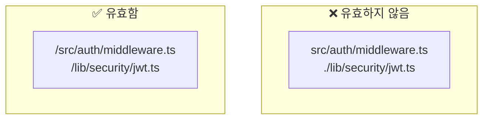
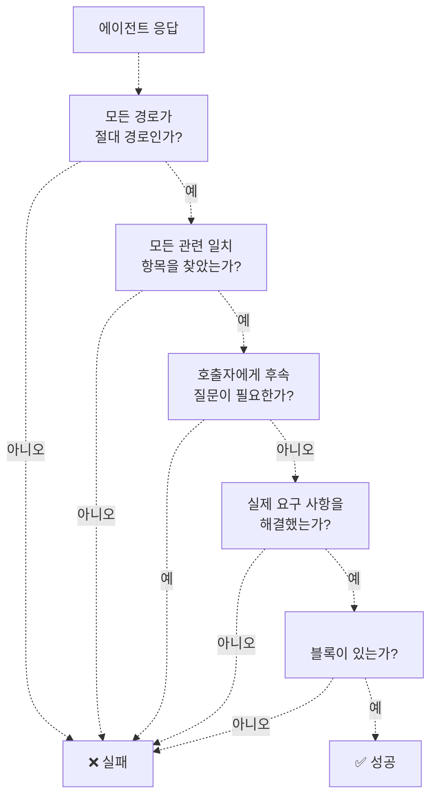
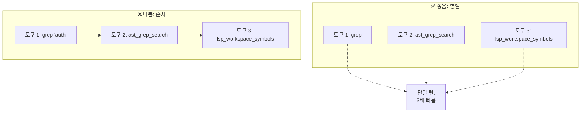
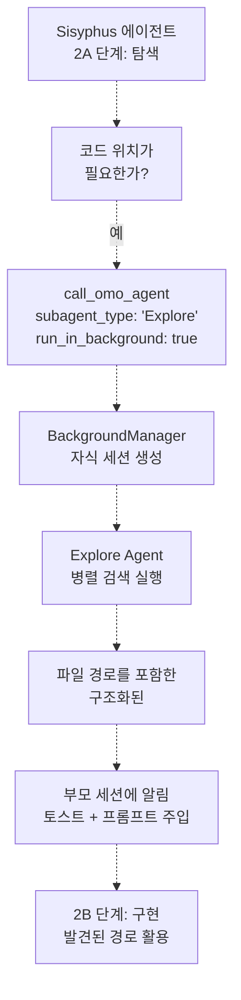

# Explore Agent

> **관련 소스 파일**
> * [src/agents/document-writer.ts](https://github.com/code-yeongyu/oh-my-opencode/blob/b92cd6ab/src/agents/document-writer.ts)
> * [src/agents/explore.ts](https://github.com/code-yeongyu/oh-my-opencode/blob/b92cd6ab/src/agents/explore.ts)
> * [src/agents/frontend-ui-ux-engineer.ts](https://github.com/code-yeongyu/oh-my-opencode/blob/b92cd6ab/src/agents/frontend-ui-ux-engineer.ts)
> * [src/agents/librarian.ts](https://github.com/code-yeongyu/oh-my-opencode/blob/b92cd6ab/src/agents/librarian.ts)
> * [src/agents/multimodal-looker.ts](https://github.com/code-yeongyu/oh-my-opencode/blob/b92cd6ab/src/agents/multimodal-looker.ts)
> * [src/agents/oracle.ts](https://github.com/code-yeongyu/oh-my-opencode/blob/b92cd6ab/src/agents/oracle.ts)

## 목적 및 범위 (Purpose and Scope)

Explore Agent는 코드베이스 검색 및 탐색 작업을 위해 설계된 읽기 전용 전문 에이전트입니다. 이 에이전트는 병렬 도구 검색을 실행하고 구조화된 실행 가능한 결과를 반환함으로써 "X는 어디에 구현되어 있나요?", "Y를 포함하는 파일은 무엇인가요?", "Z를 수행하는 코드를 찾아주세요"와 같은 질문에 답변합니다. 이 에이전트는 쓰기 권한이 없는 서브에이전트(subagent)로 작동하며, 코드 위치를 찾고 분석하는 데에만 전적으로 집중합니다.

더 광범위한 에이전트 오케스트레이션 시스템에 대해서는 [Agent System](../agents/)을 참조하십시오. Librarian(외부 조사) 및 Oracle(아키텍처 결정)과 같은 다른 전문 에이전트에 대해서는 [Specialized Agents](/code-yeongyu/oh-my-opencode/4.2-specialized-agents)를 참조하십시오.

**출처:** [src/agents/explore.ts L1-L106](https://github.com/code-yeongyu/oh-my-opencode/blob/b92cd6ab/src/agents/explore.ts#L1-L106)

## 에이전트 구성 (Agent Configuration)

Explore Agent는 `createExploreAgent` 함수를 통해 다음과 같은 특성으로 구성됩니다:

| 속성 | 값 | 목적 |
| --- | --- | --- |
| **Model** | `opencode/grok-code` (기본값) | 코드 이해에 최적화된 Grok |
| **Mode** | `subagent` | 위임된 작업 실행자로 작동 |
| **Temperature** | `0.1` | 결정론적이고 일관된 결과 제공 |
| **Tools Access** | 읽기 전용 | 쓰기(write), 수정(edit) 또는 background_task 권한 없음 |
| **Description** | 코드베이스를 위한 문맥적 grep | 위치 쿼리에 대해 자동 호출됨 |

에이전트는 철저함(thoroughness) 사양에 따라 호출될 수 있습니다: 기본적인 검색을 위한 `"quick"`, 중간 정도의 분석을 위한 `"medium"`, 그리고 포괄적인 탐색을 위한 `"very thorough"`가 있습니다.

**출처:** [src/agents/explore.ts L1-L12](https://github.com/code-yeongyu/oh-my-opencode/blob/b92cd6ab/src/agents/explore.ts#L1-L12)

## 의도 분석 워크플로우 (Intent Analysis Workflow)

### 필수 검색 전 분석

검색 작업을 실행하기 전에, Explore Agent는 반드시 `<analysis>` 태그 내에 분석 내용을 포함하여 문자 그대로의 요청 뒤에 숨겨진 실제 요구 사항을 명확히 해야 합니다:



**분석 구조**

분석 블록에는 다음 세 가지 필수 요소가 포함되어야 합니다:

```javascript
<analysis>
**Literal Request**: [사용자가 문자 그대로 요청한 내용]
**Actual Need**: [사용자가 실제로 달성하려는 목적]
**Success Looks Like**: [사용자가 즉시 작업을 진행할 수 있게 하는 결과의 모습]
</analysis>
```

이 모호성 제거 단계는 에이전트가 표면적인 쿼리뿐만 아니라 근본적인 요구 사항을 해결하도록 보장하여 불필요한 후속 질문을 방지합니다.

**출처:** [src/agents/explore.ts L26-L33](https://github.com/code-yeongyu/oh-my-opencode/blob/b92cd6ab/src/agents/explore.ts#L26-L33)

## 병렬 실행 요구 사항 (Parallel Execution Requirements)

### 필수 병렬 처리

Explore Agent는 첫 번째 작업에서 **3개 이상의 동시 도구 호출**을 강제합니다. 순차적 실행은 출력이 이전 결과에 명시적으로 의존하는 경우에만 허용됩니다.



**근거:** 병렬 실행은 검색 범위를 최대화하고 전체 지연 시간(latency)을 줄입니다. 에이전트의 읽기 전용 특성 덕분에 대부분의 작업에서 순서 의존성이 제거됩니다.

**출처:** [src/agents/explore.ts L35-L36](https://github.com/code-yeongyu/oh-my-opencode/blob/b92cd6ab/src/agents/explore.ts#L35-L36)

## 도구 선택 전략 (Tool Selection Strategy)

에이전트는 검색 패턴 유형에 따라 결정 매트릭스를 따라 도구를 선택합니다:

| 검색 패턴 | 주요 도구 | 보조 도구 | 사용 사례 |
| --- | --- | --- | --- |
| **의미론적 (Semantic)** (정의, 참조) | LSP 도구 | `lsp_goto_definition`, `lsp_find_references` | 심볼이 정의되거나 사용되는 위치 찾기 |
| **구조적 (Structural)** (함수 형태, 클래스 구조) | `ast_grep_search` | 검증을 위한 `grep` | AST(Abstract Syntax Tree) 노드 패턴 매칭 |
| **텍스트 (Text)** (문자열, 주석, 로그) | `grep` | `lsp_workspace_symbols` | 문자 그대로의 텍스트 검색 |
| **파일 패턴 (File patterns)** (이름/확장자) | `glob` | N/A | 패턴으로 파일 찾기 |
| **이력 (History)** (추가 시점, 변경자) | git 명령 | `git log`, `git blame` | 코드 진화 분석 |
| **외부 예시 (External examples)** | `grep_app` | 로컬 도구와 교차 검증 | 다른 프로젝트의 패턴 구현 방식 |

### grep_app 특별 처리

`grep_app` 도구는 수백만 개의 공개 GitHub 리포지토리를 검색하지만 특별한 처리가 필요합니다:



**중요 규칙:** 항상 쿼리 변형을 사용하여 여러 `grep_app` 호출을 병렬로 실행한 다음, 결과를 신뢰하기 전에 로컬 도구(`grep`, `ast_grep_search`, LSP)로 교차 검증하십시오.

**출처:** [src/agents/explore.ts L84-L101](https://github.com/code-yeongyu/oh-my-opencode/blob/b92cd6ab/src/agents/explore.ts#L84-L101)

## 구조화된 출력 형식 (Structured Output Format)

### 필수 결과 블록

모든 응답은 반드시 세 개의 구조화된 섹션을 포함하는 `<results>` 블록으로 끝나야 합니다:

```xml
<results>
<files>
- /absolute/path/to/file1.ts — [이 파일이 관련 있는 이유]
- /absolute/path/to/file2.ts — [이 파일이 관련 있는 이유]
</files>

<answer>
[단순한 파일 목록이 아닌, 실제 요구 사항에 대한 직접적인 답변]
[만약 "auth는 어디에 있나요?"라고 물었다면, 찾은 인증 흐름을 설명하십시오]
</answer>

<next_steps>
[이 정보를 바탕으로 사용자가 수행해야 할 작업]
[또는: "진행 준비 완료 - 후속 조치 필요 없음"]
</next_steps>
</results>
```

### 경로 요구 사항

**모든 파일 경로는 반드시 절대 경로**(`/`로 시작)여야 합니다. 상대 경로는 실패 조건으로 간주됩니다.



**출처:** [src/agents/explore.ts L38-L56](https://github.com/code-yeongyu/oh-my-opencode/blob/b92cd6ab/src/agents/explore.ts#L38-L56)

## 성공 기준 및 실패 조건 (Success Criteria and Failure Conditions)

### 성공 기준 표

| 기준 | 요구 사항 |
| --- | --- |
| **경로 (Paths)** | 모든 경로는 반드시 **절대 경로**(`/`로 시작)여야 함 |
| **완전성 (Completeness)** | 첫 번째 일치 항목뿐만 아니라 모든 관련 일치 항목을 찾음 |
| **실행 가능성 (Actionability)** | 호출자가 **후속 질문 없이** 작업을 진행할 수 있음 |
| **의도 (Intent)** | 문자 그대로의 요청이 아닌 **실제 요구 사항**을 해결함 |

### 실패 감지

다음 조건 중 하나라도 해당되면 응답은 **실패**한 것으로 간주됩니다:



**실패 지표 예시:**

* 경로가 상대 경로인 경우 (절대 경로가 아님)
* 코드베이스에서 명백한 일치 항목을 놓친 경우
* 호출자가 "하지만 정확히 어디인가요?" 또는 "X는 어떤가요?"라고 다시 물어야 하는 경우
* 근본적인 요구 사항이 아닌 문자 그대로의 질문에만 답변한 경우
* 구조화된 출력이 포함된 `<results>` 블록이 없는 경우

**출처:** [src/agents/explore.ts L58-L74](https://github.com/code-yeongyu/oh-my-opencode/blob/b92cd6ab/src/agents/explore.ts#L58-L74)

## 제약 사항 및 안티 패턴 (Constraints and Anti-Patterns)

### 엄격한 제약 사항

Explore Agent는 엄격한 읽기 전용 제약 조건 하에서 작동합니다:

| 제약 사항 | 이유 |
| --- | --- |
| **쓰기 작업 금지** | `tools: { write: false }` - 검색 에이전트는 코드를 수정할 수 없음 |
| **수정 작업 금지** | `tools: { edit: false }` - 의도치 않은 수정을 방지함 |
| **백그라운드 작업 금지** | `tools: { background_task: false }` - 재귀적 생성 방지 |
| **출력에 이모지 금지** | 출력을 깔끔하고 파싱 가능하게 유지 |
| **파일 생성 금지** | 발견된 내용을 메시지 텍스트로만 보고함 |

### 안티 패턴: 순차적 실행



**출처:** [src/agents/explore.ts L76-L81](https://github.com/code-yeongyu/oh-my-opencode/blob/b92cd6ab/src/agents/explore.ts#L76-L81)

## 에이전트 시스템과의 통합 (Integration with Agent System)

### Sisyphus에 의한 호출

Sisyphus는 2A 단계(탐색 및 조사) 중에 병렬 백그라운드 실행을 통해 Explore Agent를 호출합니다:



### 액세스 패턴 비교

| 에이전트 | LSP | AST-Grep | grep_app | 쓰기 | 수정 | 백그라운드 작업 |
| --- | --- | --- | --- | --- | --- | --- |
| **Explore** | ✅ 예 | ✅ 예 | ✅ 예 | ❌ 아니오 | ❌ 아니오 | ❌ 아니오 |
| **Librarian** | ❌ 아니오 | ❌ 아니오 | ✅ 예 | ❌ 아니오 | ❌ 아니오 | ❌ 아니오 |
| **Oracle** | ✅ 예 | ✅ 예 | ❌ 아니오 | ❌ 아니오 | ❌ 아니오 | ❌ 아니오 |
| **Sisyphus** | ✅ 예 | ✅ 예 | ✅ 예 | ✅ 예 | ✅ 예 | ✅ 예 |

**주요 차이점:**

* **Explore vs Librarian:** Explore는 LSP/AST 도구로 *로컬* 코드베이스를 검색합니다. Librarian은 *외부* 문서 및 GitHub 리포지토리를 검색합니다.
* **Explore vs Oracle:** Explore는 위치를 찾습니다. Oracle은 아키텍처적 추론을 제공합니다 (외부 검색 권한 없음).
* **Explore vs Sisyphus:** Explore는 읽기 전용 서브에이전트입니다. Sisyphus는 전체 쓰기/수정 권한을 가집니다.

**출처:** [src/agents/explore.ts L1-L106](https://github.com/code-yeongyu/oh-my-opencode/blob/b92cd6ab/src/agents/explore.ts#L1-L106)

High-Level Diagram 3 (에이전트 오케스트레이션), High-Level Diagram 5 (도구 생태계)

## 코드 위치 참조 (Code Location Reference)

Explore Agent 구현은 단일 파일에 위치합니다:

```
src/agents/explore.ts
├── createExploreAgent(model)  [5-103]
│   ├── 에이전트 구성
│   ├── 워크플로우 규칙이 포함된 시스템 프롬프트
│   └── 도구 액세스 제한
└── exploreAgent (기본 내보내기) [105]
```

에이전트 팩토리 시스템은 다음을 통해 이를 로드합니다:

```
src/agents/builtin-agents.ts
└── 모델 오버라이드를 사용하여 explore 에이전트 생성
```

**출처:** [src/agents/explore.ts L1-L106](https://github.com/code-yeongyu/oh-my-opencode/blob/b92cd6ab/src/agents/explore.ts#L1-L106)