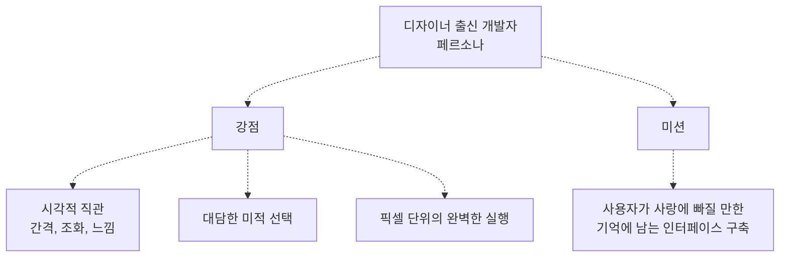
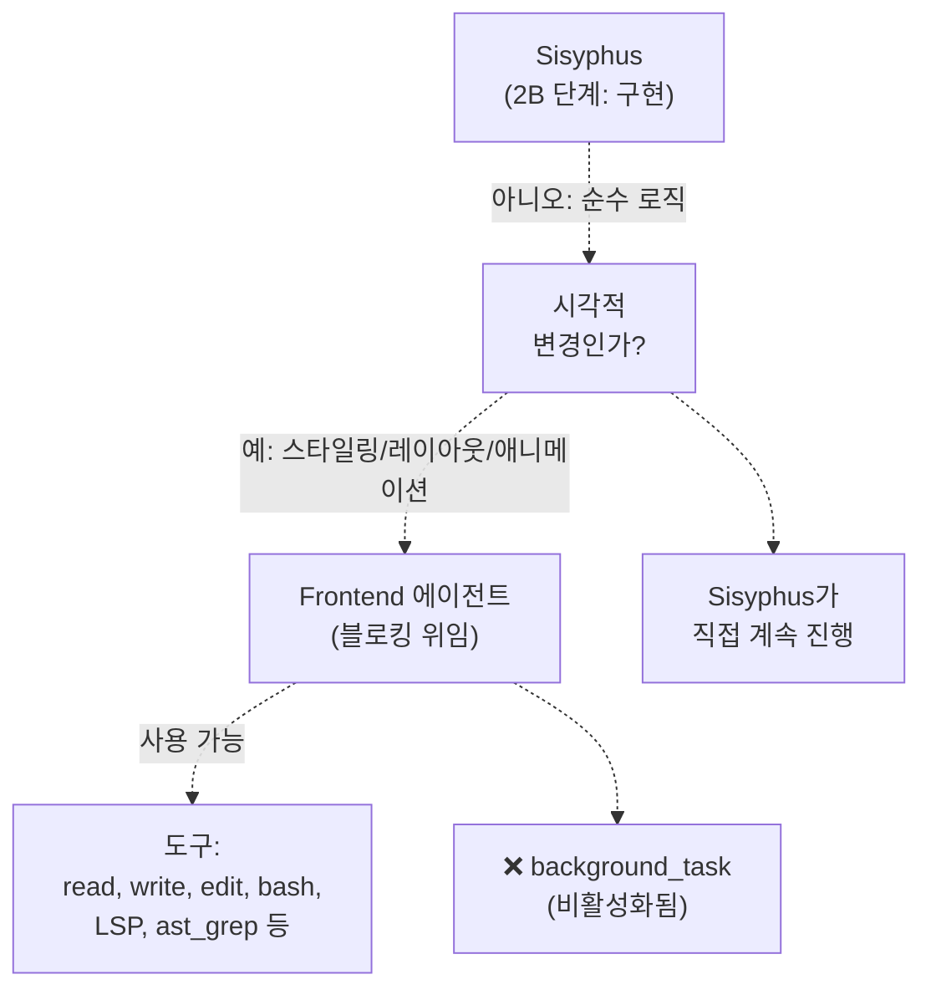
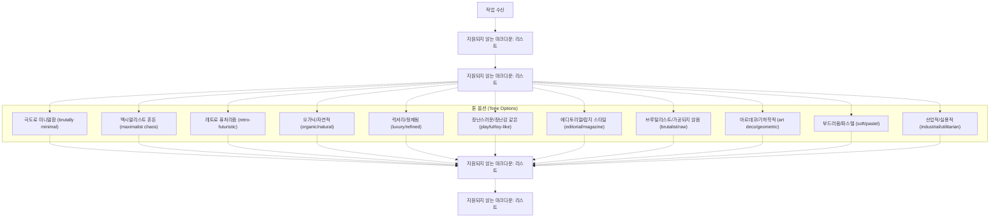
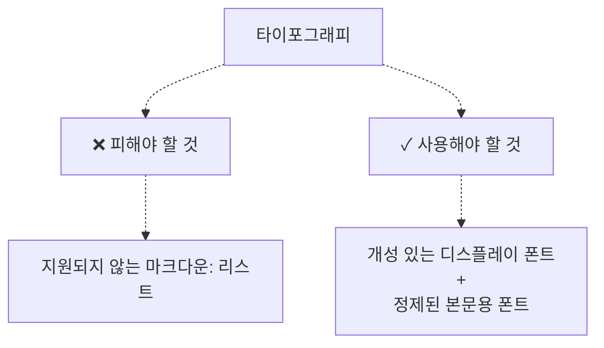
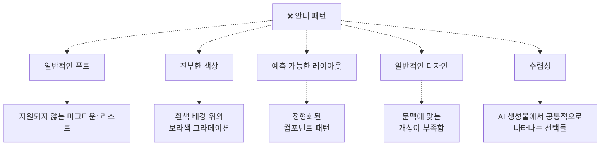
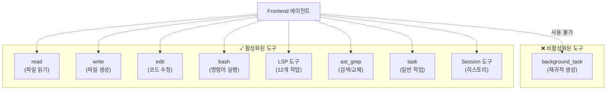
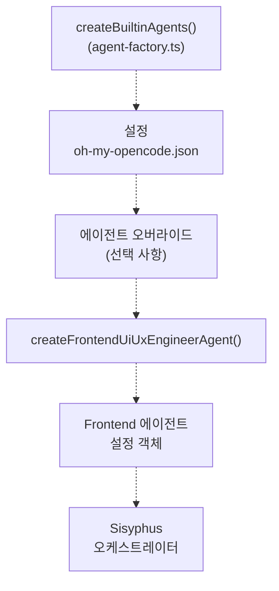

# Frontend UI/UX Engineer

> **관련 소스 파일**
> * [src/agents/document-writer.ts](https://github.com/code-yeongyu/oh-my-opencode/blob/b92cd6ab/src/agents/document-writer.ts)
> * [src/agents/explore.ts](https://github.com/code-yeongyu/oh-my-opencode/blob/b92cd6ab/src/agents/explore.ts)
> * [src/agents/frontend-ui-ux-engineer.ts](https://github.com/code-yeongyu/oh-my-opencode/blob/b92cd6ab/src/agents/frontend-ui-ux-engineer.ts)
> * [src/agents/librarian.ts](https://github.com/code-yeongyu/oh-my-opencode/blob/b92cd6ab/src/agents/librarian.ts)
> * [src/agents/multimodal-looker.ts](https://github.com/code-yeongyu/oh-my-opencode/blob/b92cd6ab/src/agents/multimodal-looker.ts)
> * [src/agents/oracle.ts](https://github.com/code-yeongyu/oh-my-opencode/blob/b92cd6ab/src/agents/oracle.ts)

이 문서는 oh-my-opencode 시스템에서 모든 시각적 및 인터페이스 관련 변경을 담당하는 전문 서브에이전트(subagent)인 Frontend UI/UX Engineer 에이전트에 대해 자세히 설명합니다. 이 에이전트는 스타일링, 레이아웃(layout), 애니메이션 또는 시각적 디자인과 관련된 작업이 포함될 때마다 Sisyphus에 의해 호출됩니다.

이 에이전트에게 작업을 위임하는 오케스트레이터(orchestrator)에 대한 정보는 [Sisyphus 오케스트레이터](/code-yeongyu/oh-my-opencode/4.1-sisyphus-orchestrator)를 참조하십시오. 다른 전문 에이전트에 대해서는 [전문 에이전트](/code-yeongyu/oh-my-opencode/4.2-specialized-agents)를 참조하십시오.

## 목적 및 범위 (Purpose and Scope)

Frontend UI/UX Engineer는 다음을 처리합니다:

* 사용자 인터페이스(UI)에 대한 모든 시각적 변경
* 스타일링 및 레이아웃 수정
* 애니메이션 및 마이크로 인터랙션(micro-interactions)
* 컴포넌트 미학 및 디자인 시스템(design systems)
* 타이포그래피(typography) 및 컬러 팔레트(color palette) 구현

이 에이전트는 시각적 작업만 전담하도록 명시적으로 구성되어 있습니다. 시각적 영향이 없는 순수 로직 변경은 Sisyphus 또는 다른 에이전트가 담당합니다.

출처: [src/agents/frontend-ui-ux-engineer.ts L1-L91](https://github.com/code-yeongyu/oh-my-opencode/blob/b92cd6ab/src/agents/frontend-ui-ux-engineer.ts#L1-L91)

## 에이전트 설정 (Agent Configuration)

Frontend 에이전트는 특정 모델 및 도구 액세스 패턴으로 구성됩니다:

```yaml
{
  description: "A designer-turned-developer who crafts stunning UI/UX...",
  mode: "subagent",
  model: "google/gemini-3-pro-preview",
  tools: { background_task: false }
}
```

### 설정 파라미터 (Configuration Parameters)

| 파라미터 | 값 | 근거 |
| --- | --- | --- |
| `model` | `google/gemini-3-pro-preview` | 기본 모델이며, 에이전트 오버라이드를 통해 설정 가능 |
| `mode` | `subagent` | 사용자가 직접 호출할 수 없음 |
| `temperature` | 지정되지 않음 (기본값 사용) | 표준 창의성 수준 |
| `tools.background_task` | `false` | 재귀적인 에이전트 생성을 방지 |

다른 모든 도구(`read`, `write`, `edit`, `bash`, `LSP` 등)는 활성화된 상태로 유지되어 Frontend 에이전트에게 완전한 구현 능력을 부여합니다.

출처: [src/agents/frontend-ui-ux-engineer.ts L3-L13](https://github.com/code-yeongyu/oh-my-opencode/blob/b92cd6ab/src/agents/frontend-ui-ux-engineer.ts#L3-L13)

## 에이전트 페르소나 및 역할 (Agent Persona and Role)

Frontend 에이전트는 디자이너 우선의 사고방식으로 작동합니다:



**주요 정체성 특성:**

* 순수 개발자가 놓치는 부분(간격, 색상 조화, 마이크로 인터랙션)을 포착함
* 목업(mockup)이 없어도 아름다운 인터페이스를 구상하고 생성함
* 코드 품질을 유지하면서 디테일에 집착함
* 코드는 "다소 복잡할 수" 있지만 시각적 결과물은 "항상 훌륭함"

출처: [src/agents/frontend-ui-ux-engineer.ts L14-L18](https://github.com/code-yeongyu/oh-my-opencode/blob/b92cd6ab/src/agents/frontend-ui-ux-engineer.ts#L14-L18)

## 위임 패턴 (Delegation Pattern)

Sisyphus는 **블로킹 패턴(blocking pattern)**(동기 실행)을 사용하여 Frontend 에이전트에게 위임합니다:



**위임 규칙:**

| 시나리오 | 담당자 | 패턴 |
| --- | --- | --- |
| 모든 시각적 변경 | Frontend 에이전트 | 블로킹 (`run_in_background=false`) |
| 스타일링/레이아웃 | Frontend 에이전트 | 블로킹 |
| 애니메이션 | Frontend 에이전트 | 블로킹 |
| 순수 백엔드 로직 | Sisyphus | 직접 실행 |
| 시각적 요소 + 로직 혼합 | Frontend 에이전트 | 시각적 부분만 처리 |

출처: [src/agents/frontend-ui-ux-engineer.ts L1-L91](https://github.com/code-yeongyu/oh-my-opencode/blob/b92cd6ab/src/agents/frontend-ui-ux-engineer.ts#L1-L91)

## 작업 원칙 (Work Principles)

이 에이전트는 프롬프트에 인코딩된 다섯 가지 핵심 원칙을 따릅니다:

### 1. 요청받은 사항 완수 (Complete What's Asked)

* 지정된 작업을 정확하게 실행합니다.
* 범위 확장(scope creep)을 하지 않습니다.
* 작동할 때까지 작업합니다.
* 검증 없이 완료로 표시하지 않습니다.

### 2. 더 나은 상태로 유지 (Leave It Better)

* 프로젝트가 작동 가능한 상태를 유지하도록 합니다.
* 빌드 오류나 누락된 의존성이 없어야 합니다.

### 3. 행동 전 연구 (Study Before Acting)

* 기존 패턴과 컨벤션을 조사합니다.
* `git log`로 커밋 히스토리를 확인합니다.
* 코드가 왜 그렇게 구조화되었는지 이해합니다.

### 4. 완벽한 조화 (Blend Seamlessly)

* 기존 코드 패턴과 일치시킵니다.
* 팀이 작성한 코드처럼 보여야 합니다.
* 일관성을 유지합니다.

### 5. 투명성 유지 (Be Transparent)

* 각 단계를 알립니다.
* 추론 과정을 설명합니다.
* 성공과 실패를 모두 보고합니다.

출처: [src/agents/frontend-ui-ux-engineer.ts L23-L29](https://github.com/code-yeongyu/oh-my-opencode/blob/b92cd6ab/src/agents/frontend-ui-ux-engineer.ts#L23-L29)

## 디자인 프로세스 워크플로우 (Design Process Workflow)

에이전트는 구현 전에 구조화된 디자인 프로세스를 실행합니다:



### 디자인 결정 프레임워크 (Design Decision Framework)

코딩을 시작하기 전에 에이전트는 디자인 방향을 결정합니다:

1. **목적(Purpose)**: 문제와 사용자를 정의합니다.
2. **톤(Tone)**: 미학적 극단을 선택합니다 (중간 지점이 아님).
3. **제약 사항(Constraints)**: 기술적 요구 사항(프레임워크, 성능, 접근성)을 기록합니다.
4. **차별화(Differentiation)**: 기억에 남을 단 하나의 요소를 식별합니다.

**핵심 철학**: "의도성이 강렬함보다 중요하다(Intentionality > intensity)" - 목적 없는 강렬한 효과보다 정밀하게 실행된 명확한 방향이 더 낫습니다.

출처: [src/agents/frontend-ui-ux-engineer.ts L32-L48](https://github.com/code-yeongyu/oh-my-opencode/blob/b92cd6ab/src/agents/frontend-ui-ux-engineer.ts#L32-L48)

## 미학적 가이드라인 (Aesthetic Guidelines)

에이전트는 카테고리별로 정리된 엄격한 미학적 규칙을 따릅니다:

### 타이포그래피 규칙 (Typography Rules)



**요구 사항:**

* 독특한 폰트를 선택합니다.
* 디스플레이 폰트와 본문용 폰트를 조합합니다.
* 일반적이거나 흔한 폰트는 절대 사용하지 않습니다.

출처: [src/agents/frontend-ui-ux-engineer.ts L53-L54](https://github.com/code-yeongyu/oh-my-opencode/blob/b92cd6ab/src/agents/frontend-ui-ux-engineer.ts#L53-L54)

### 색상 가이드라인 (Color Guidelines)

| 원칙 | 구현 방식 |
| --- | --- |
| 응집력 있는 팔레트 | 일관성을 위해 CSS 변수를 사용합니다. |
| 지배적 색상 + 강조색 | 강한 주색상과 날카로운 강조색을 사용합니다. |
| 균등한 분포 지양 | 소심하고 균등하게 분포된 팔레트는 임팩트가 부족합니다. |
| 안티 패턴 | 흰색 배경 위의 보라색 그라데이션 (AI 생성물의 전형적인 징후) |

출처: [src/agents/frontend-ui-ux-engineer.ts L56-L57](https://github.com/code-yeongyu/oh-my-opencode/blob/b92cd6ab/src/agents/frontend-ui-ux-engineer.ts#L56-L57)

### 모션 디자인 (Motion Design)

**중점**: 산만한 마이크로 인터랙션보다 임팩트가 큰 순간에 집중합니다.

**선호하는 접근 방식:**

```
순차적으로 나타나는 잘 조율된 페이지 로드
> 여기저기 흩어져 있는 마이크로 인터랙션
```

**구현 우선순위:**

1. CSS 전용 애니메이션 (선호됨)
2. React용 모션 라이브러리 (사용 가능한 경우)
3. JavaScript 애니메이션 (필요한 경우)

**주요 기법:**

* 순차적 노출을 위한 `animation-delay`
* 점진적 공개를 위한 스크롤 트리거(Scroll-triggering)
* 놀라움과 즐거움을 주는 호버(Hover) 상태

출처: [src/agents/frontend-ui-ux-engineer.ts L59-L60](https://github.com/code-yeongyu/oh-my-opencode/blob/b92cd6ab/src/agents/frontend-ui-ux-engineer.ts#L59-L60)

### 공간 구성 (Spatial Composition)

**권장 패턴:**

* 예상치 못한 레이아웃
* 비대칭성
* 겹치는 요소들
* 대각선 흐름
* 그리드를 깨는 컴포넌트
* 넉넉한 여백(negative space) 또는 통제된 밀도

**철학**: 기억에 남는 레이아웃을 만들기 위해 관습적인 그리드 패턴을 깨뜨립니다.

출처: [src/agents/frontend-ui-ux-engineer.ts L62-L63](https://github.com/code-yeongyu/oh-my-opencode/blob/b92cd6ab/src/agents/frontend-ui-ux-engineer.ts#L62-L63)

### 시각적 디테일 기법 (Visual Detail Techniques)

에이전트는 다음을 사용하여 분위기와 깊이감을 조성합니다:

| 기법 | 목적 |
| --- | --- |
| 그라데이션 메쉬 (Gradient meshes) | 시각적 풍부함 |
| 노이즈 텍스처 (Noise textures) | 유기적인 느낌 |
| 기하학적 패턴 (Geometric patterns) | 구조와 리듬 |
| 레이어드 투명도 (Layered transparencies) | 깊이감 인지 |
| 드라마틱한 그림자 (Dramatic shadows) | 강조 및 계층 구조 |
| 장식적 테두리 (Decorative borders) | 프레임 및 분리 |
| 커스텀 커서 (Custom cursors) | 인터랙티브한 개성 |
| 그레인 오버레이 (Grain overlays) | 질감과 따뜻함 |

**중요 규칙**: 절대 단색을 기본으로 사용하지 마십시오. 항상 질감과 깊이를 추가하십시오.

출처: [src/agents/frontend-ui-ux-engineer.ts L65-L66](https://github.com/code-yeongyu/oh-my-opencode/blob/b92cd6ab/src/agents/frontend-ui-ux-engineer.ts#L65-L66)

## 안티 패턴 (엄격히 금지됨) (Anti-Patterns)

에이전트는 다음 패턴을 절대 사용하지 않도록 명시적으로 지시받습니다:



**근거**: 이러한 패턴은 인간의 의도와 문맥 인식이 부족한 AI 생성 디자인임을 나타내는 신호입니다.

출처: [src/agents/frontend-ui-ux-engineer.ts L70-L77](https://github.com/code-yeongyu/oh-my-opencode/blob/b92cd6ab/src/agents/frontend-ui-ux-engineer.ts#L70-L77)

## 실행 전략 (Execution Strategy)

에이전트는 미학적 비전에 맞춰 구현 복잡도를 조정합니다:

### 복잡도 매핑 (Complexity Mapping)

| 미학적 선택 | 코드 접근 방식 |
| --- | --- |
| **맥시멀리스트** | 광범위한 애니메이션과 효과가 포함된 정교한 코드 |
| **미니멀리스트** | 절제, 정밀함, 신중한 간격 및 타이포그래피 |
| **브루탈리스트** | 대담한 타이포그래피를 사용한 가공되지 않은 최소한의 스타일링 |
| **럭셔리** | 정제된 디테일, 부드러운 애니메이션, 간격에 대한 세심한 주의 |
| **장난스러움** | 역동적인 상호작용, 예상치 못한 애니메이션 |

### 창의적 권한 (Creative Mandate)

에이전트는 다음과 같이 지시받습니다:

* 요청을 창의적으로 해석할 것
* 예상치 못한 선택을 할 것
* 디자인이 진정으로 문맥에 맞게 느껴지도록 할 것
* 라이트/다크 테마를 다양하게 사용할 것
* 프로젝트마다 다른 폰트와 미학을 사용할 것
* 흔한 패턴으로 수렴하지 말 것

**철학**: "당신은 비범하고 창의적인 작업을 수행할 능력이 있습니다. 주저하지 마십시오."

출처: [src/agents/frontend-ui-ux-engineer.ts L80-L86](https://github.com/code-yeongyu/oh-my-opencode/blob/b92cd6ab/src/agents/frontend-ui-ux-engineer.ts#L80-L86)

## 도구 액세스 패턴 (Tool Access Pattern)



**도구 액세스 요약:**

| 카테고리 | 상태 | 근거 |
| --- | --- | --- |
| 파일 작업 | ✓ 활성화됨 | 완전한 구현 능력 보장 |
| LSP 도구 | ✓ 활성화됨 | 타입 인식 리팩토링 가능 |
| AST-grep | ✓ 활성화됨 | 구조적 코드 변경 가능 |
| Bash | ✓ 활성화됨 | 빌드 명령어, 패키지 설치 가능 |
| background_task | ❌ 비활성화됨 | 무한한 에이전트 재귀 방지 |

`background_task` 금지는 Frontend 에이전트가 추가 에이전트를 생성하는 것을 방지하여 평면적인 위임 계층 구조를 유지합니다.

출처: [src/agents/frontend-ui-ux-engineer.ts L13](https://github.com/code-yeongyu/oh-my-opencode/blob/b92cd6ab/src/agents/frontend-ui-ux-engineer.ts#L13-L13)

## 에이전트 팩토리와의 통합 (Integration with Agent Factory)

Frontend 에이전트는 에이전트 팩토리 시스템에 의해 생성됩니다:



### 설정 오버라이드 (Configuration Override)

사용자는 `oh-my-opencode.json`에서 기본 모델을 오버라이드할 수 있습니다:

```json
{
  "agents": {
    "override": {
      "FrontendEngineer": {
        "model": "anthropic/claude-sonnet-4-5",
        "temperature": 0.2
      }
    }
  }
}
```

팩토리 함수는 모델 파라미터를 허용합니다: `createFrontendUiUxEngineerAgent(model: string = DEFAULT_MODEL)`

출처: [src/agents/frontend-ui-ux-engineer.ts L5-L8](https://github.com/code-yeongyu/oh-my-opencode/blob/b92cd6ab/src/agents/frontend-ui-ux-engineer.ts#L5-L8)

## 다른 에이전트와의 비교 (Comparison with Other Agents)

Frontend 에이전트의 역할은 다른 전문 에이전트와 뚜렷하게 구분됩니다:

| 에이전트 | 시각적 작업 | 코드 변경 | 백그라운드 작업 |
| --- | --- | --- | --- |
| **Frontend** | ✓ 모든 시각적 변경 | ✓ 전체 액세스 | ❌ 비활성화됨 |
| **Sisyphus** | ❌ 스타일링 절대 안 함 | ✓ 로직만 담당 | ✓ 활성화됨 |
| **Oracle** | ❌ 읽기 전용 조언자 | ❌ 쓰기 불가 | ❌ 비활성화됨 |
| **Explore** | ❌ 검색 전용 | ❌ 쓰기 불가 | ❌ 비활성화됨 |
| **Librarian** | ❌ 조사 전용 | ❌ 쓰기 불가 | ❌ 비활성화됨 |
| **DocWriter** | ❌ 문서화 전용 | ✓ 문서 파일만 | ❌ 비활성화됨 |

**주요 차별점**: Frontend 에이전트는 스타일링, 레이아웃 및 애니메이션 변경을 수행할 권한이 있는 **유일한** 에이전트입니다.

출처: [src/agents/frontend-ui-ux-engineer.ts L1-L91](https://github.com/code-yeongyu/oh-my-opencode/blob/b92cd6ab/src/agents/frontend-ui-ux-engineer.ts#L1-L91)
[src/agents/oracle.ts L79](https://github.com/code-yeongyu/oh-my-opencode/blob/b92cd6ab/src/agents/oracle.ts#L79-L79)
[src/agents/librarian.ts L12](https://github.com/code-yeongyu/oh-my-opencode/blob/b92cd6ab/src/agents/librarian.ts#L12-L12)
[src/agents/explore.ts L12](https://github.com/code-yeongyu/oh-my-opencode/blob/b92cd6ab/src/agents/explore.ts#L12-L12)

## 사용 예시 (Usage Examples)

### 전형적인 호출 시나리오

**시나리오 1: 시각적 컴포넌트가 포함된 사용자 요청**

```sql
사용자: "지표를 보여주는 차트가 있는 대시보드를 추가해줘"

Sisyphus 분석:
- 시각적 컴포넌트: 대시보드 UI, 차트
- 로직 컴포넌트: 데이터 페칭, 지표 계산

위임:
1. Frontend 에이전트: 대시보드 레이아웃 생성, 차트 스타일링
2. Sisyphus: 데이터 페칭 및 지표 로직 구현
```

**시나리오 2: 순수 스타일링 작업**

```yaml
사용자: "버튼을 더 현대적으로 만들고 호버 효과를 추가해줘"

Sisyphus 작업:
- Frontend 에이전트에게 전체 위임 (블로킹)
- 완료될 때까지 대기 후 계속 진행

Frontend 실행:
1. 기존 버튼 패턴 연구
2. 미학적 방향 선택 (예: "부드러움/현대적")
3. CSS/컴포넌트 변경 구현
4. 호버 상태 작동 확인
```

**시나리오 3: 혼합 구현**

```sql
사용자: "설정 페이지를 만들어줘"

Sisyphus 할 일 목록:
- [ ] 설정 페이지 레이아웃 생성 (Frontend)
- [ ] 설정 API 호출 구현 (Sisyphus)
- [ ] 폼 컴포넌트 스타일링 (Frontend)
- [ ] 유효성 검사 로직 추가 (Sisyphus)
```

출처: [src/agents/frontend-ui-ux-engineer.ts L1-L91](https://github.com/code-yeongyu/oh-my-opencode/blob/b92cd6ab/src/agents/frontend-ui-ux-engineer.ts#L1-L91)

## 에이전트 호출을 위한 모범 사례 (Best Practices for Agent Invocation)

Sisyphus가 Frontend 에이전트에게 위임할 때는 다음을 준수해야 합니다:

1. **구체적일 것**: 명확한 시각적 요구 사항을 제공합니다.
    * 좋은 예: "미묘한 호버 효과가 있는 미니멀한 내비게이션 바를 만들어줘"
    * 나쁜 예: "내비바 만들어줘"
2. **문맥 제공**: 미학적 제약 사항을 포함합니다.
    * 기존 디자인 시스템
    * 브랜드 가이드라인
    * 목표로 하는 미학
3. **경계 설정**: 범위를 명확히 정의합니다.
    * 시각적 변경만 할 것인지 전체 기능을 구현할 것인지
    * 스타일링이 필요한 컴포넌트
    * 변경하지 말아야 할 부분
4. **완료 대기**: 블로킹 위임을 사용합니다.
    * UI가 완료될 때까지 로직 변경을 진행하지 마십시오.
    * 시각적 토대는 로직 구현 방식에 영향을 줄 수 있습니다.

출처: [src/agents/frontend-ui-ux-engineer.ts L23-L29](https://github.com/code-yeongyu/oh-my-opencode/blob/b92cd6ab/src/agents/frontend-ui-ux-engineer.ts#L23-L29)