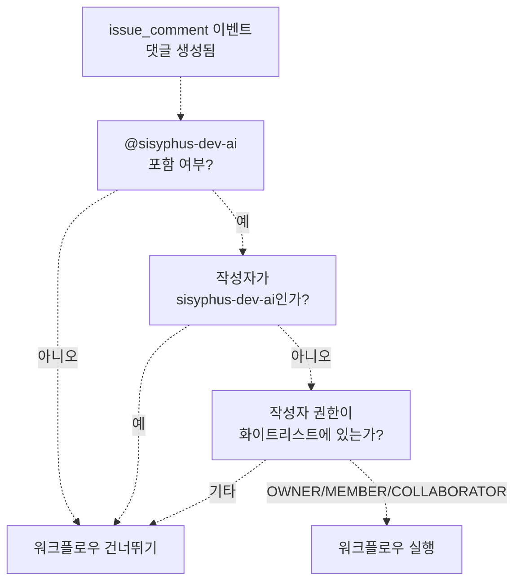
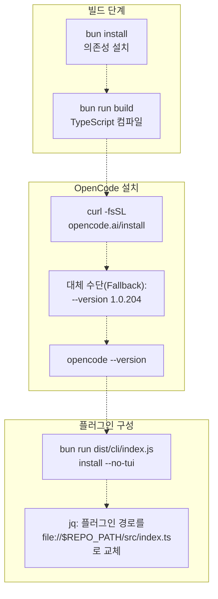
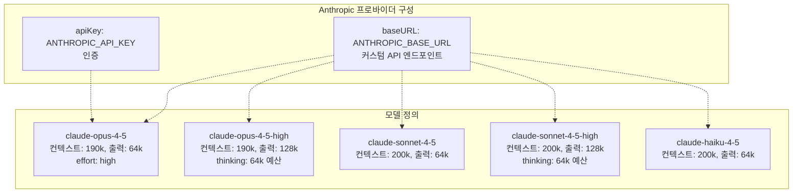
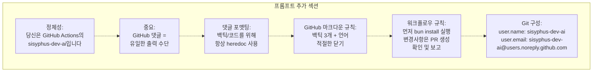
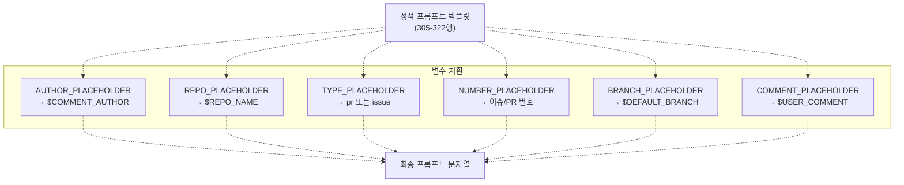
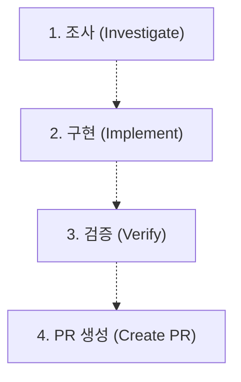
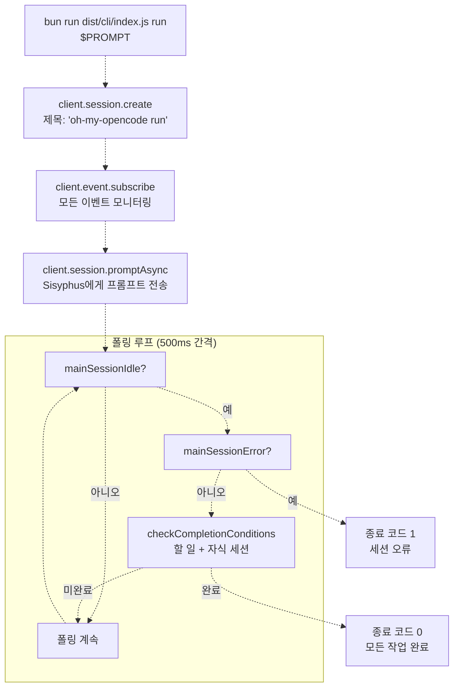
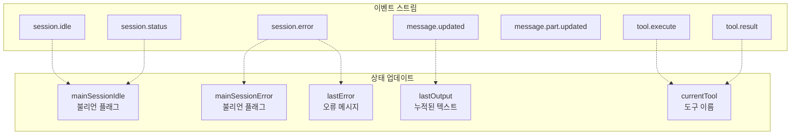
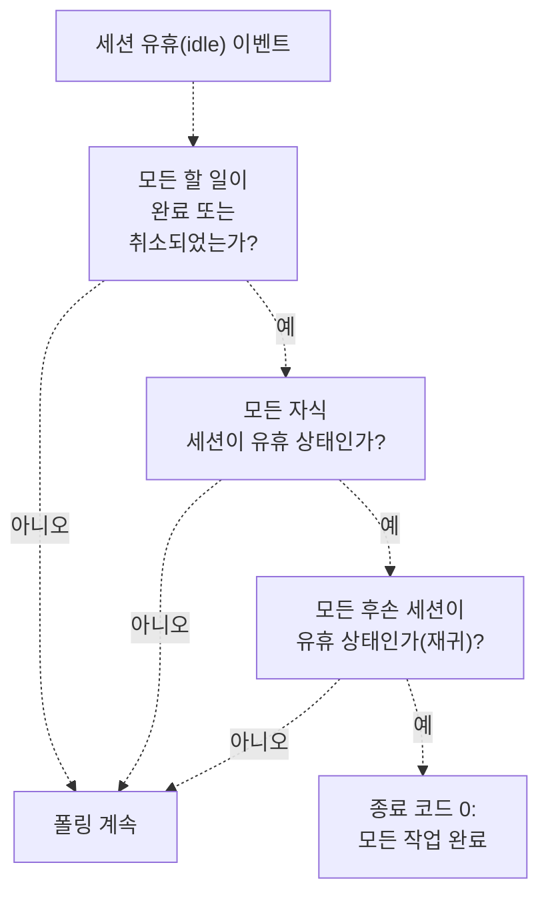
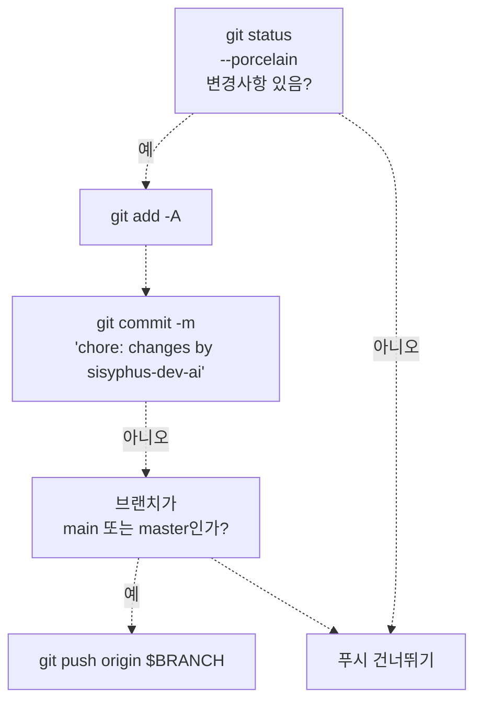

# GitHub 워크플로우 통합 (GitHub Workflow Integration)

> **관련 소스 파일**
> * [.github/assets/sisyphus.png](https://github.com/code-yeongyu/oh-my-opencode/blob/b92cd6ab/.github/assets/sisyphus.png)
> * [.github/workflows/sisyphus-agent.yml](https://github.com/code-yeongyu/oh-my-opencode/blob/b92cd6ab/.github/workflows/sisyphus-agent.yml)
> * [src/agents/index.ts](https://github.com/code-yeongyu/oh-my-opencode/blob/b92cd6ab/src/agents/index.ts)
> * [src/agents/sisyphus.ts](https://github.com/code-yeongyu/oh-my-opencode/blob/b92cd6ab/src/agents/sisyphus.ts)
> * [src/agents/types.ts](https://github.com/code-yeongyu/oh-my-opencode/blob/b92cd6ab/src/agents/types.ts)
> * [src/agents/utils.test.ts](https://github.com/code-yeongyu/oh-my-opencode/blob/b92cd6ab/src/agents/utils.test.ts)
> * [src/agents/utils.ts](https://github.com/code-yeongyu/oh-my-opencode/blob/b92cd6ab/src/agents/utils.ts)
> * [src/cli/run/completion.test.ts](https://github.com/code-yeongyu/oh-my-opencode/blob/b92cd6ab/src/cli/run/completion.test.ts)
> * [src/cli/run/completion.ts](https://github.com/code-yeongyu/oh-my-opencode/blob/b92cd6ab/src/cli/run/completion.ts)
> * [src/cli/run/events.test.ts](https://github.com/code-yeongyu/oh-my-opencode/blob/b92cd6ab/src/cli/run/events.test.ts)
> * [src/cli/run/events.ts](https://github.com/code-yeongyu/oh-my-opencode/blob/b92cd6ab/src/cli/run/events.ts)
> * [src/cli/run/index.ts](https://github.com/code-yeongyu/oh-my-opencode/blob/b92cd6ab/src/cli/run/index.ts)
> * [src/cli/run/runner.ts](https://github.com/code-yeongyu/oh-my-opencode/blob/b92cd6ab/src/cli/run/runner.ts)
> * [src/cli/run/types.ts](https://github.com/code-yeongyu/oh-my-opencode/blob/b92cd6ab/src/cli/run/types.ts)

## 목적 및 범위

이 문서는 이슈 및 PR(Pull Request) 댓글을 통해 자동화된 저장소 작업을 가능하게 하는 Sisyphus의 GitHub Actions 통합 전용 워크플로우를 설명합니다. 사용자가 GitHub 이슈나 풀 리퀘스트에서 `@sisyphus-dev-ai`를 멘션하면, 시스템은 자동으로 조사, 구현, 검증을 수행하고 풀 리퀘스트를 생성합니다.

이 페이지는 GitHub Actions 트리거 메커니즘, 환경 구성 및 특수 프롬프트 컨텍스트(Prompt Context)에 초점을 맞춥니다. Sisyphus의 일반적인 워크플로우 단계에 대해서는 [워크플로우 단계(Workflow Phases)](/code-yeongyu/oh-my-opencode/4.1.1-workflow-phases)를 참조하십시오. 실행 중 사용되는 할 일(todo) 기반 작업 추적에 대해서는 [할 일 관리(Todo Management)](/code-yeongyu/oh-my-opencode/4.1.2-todo-management)를 참조하십시오. 일반적인 CLI 실행 명령 동작에 대해서는 [CLI 실행 명령(CLI Run Command)](/code-yeongyu/oh-my-opencode/10.2-cli-run-command)을 참조하십시오.

---

## 트리거 메커니즘 (Trigger Mechanism)

GitHub Actions 워크플로우는 수동 `workflow_dispatch` 또는 `@sisyphus-dev-ai` 멘션이 포함된 `issue_comment` 이벤트의 두 가지 유형에서 활성화됩니다.

### 권한 기반 활성화



**허용된 작성자 권한(Author associations):**

* `OWNER`: 저장소 소유자
* `MEMBER`: 조직 구성원
* `COLLABORATOR`: 저장소 협력자

워크플로우는 sisyphus-dev-ai가 자신의 작업에 댓글을 달 때 발생할 수 있는 무한 루프를 방지하기 위해 자기 자신에 대한 멘션은 명시적으로 제외합니다.

출처: [.github/workflows/sisyphus-agent.yml L17-L22](https://github.com/code-yeongyu/oh-my-opencode/blob/b92cd6ab/.github/workflows/sisyphus-agent.yml#L17-L22)

### 컨텍스트 수집

워크플로우는 GitHub API를 쿼리하여 댓글이 이슈에 달린 것인지 아니면 풀 리퀘스트에 달린 것인지 판단합니다.

| 컨텍스트 유형 | 감지 방법 | 출력 변수 |
| --- | --- | --- |
| 풀 리퀘스트 (PR) | `gh api "repos/$REPO/issues/${ISSUE_NUM}"` 호출 시 `.pull_request` 필드 존재 | `type=pr`, `number=${ISSUE_NUM}` |
| 이슈 (Issue) | 동일한 API 호출 시, `.pull_request` 필드 없음 | `type=issue`, `number=${ISSUE_NUM}` |

추가로 수집되는 컨텍스트:

* `comment`: 전체 댓글 본문
* `author`: 댓글 작성자 사용자 이름
* `comment_id`: 리액션을 위한 댓글 ID

출처: [.github/workflows/sisyphus-agent.yml L230-L261](https://github.com/code-yeongyu/oh-my-opencode/blob/b92cd6ab/.github/workflows/sisyphus-agent.yml#L230-L261)

---

## 환경 설정 (Environment Setup)

워크플로우는 실행 시마다 처음부터 완전한 oh-my-opencode 환경을 구축하여 일관된 구성을 보장합니다.

### 빌드 및 설치 파이프라인



**주요 구성 단계:**

1. **로컬 oh-my-opencode 빌드**: 워크플로우가 현재 커밋의 최신 코드를 사용하도록 보장합니다.
2. **OpenCode SDK 설치**: 기본 설치 프로그램을 시도하고, 다운로드 실패 시 고정된 버전인 1.0.204로 대체합니다.
3. **로컬 설치 실행**: 빌드된 `dist/cli/index.js`를 `--no-tui --claude=max20 --chatgpt=no --gemini=no` 옵션과 함께 사용합니다.
4. **플러그인 경로 재정의(Override)**: npm 패키지 참조를 `src/index.ts`에 대한 직접 파일 참조로 교체합니다.

출처: [.github/workflows/sisyphus-agent.yml L72-L113](https://github.com/code-yeongyu/oh-my-opencode/blob/b92cd6ab/.github/workflows/sisyphus-agent.yml#L72-L113)

### 모델 구성 재정의

워크플로우는 확장된 사고 능력(extended thinking capabilities)을 갖춘 커스텀 Anthropic 모델을 구성합니다.



이 구성은 `jq`를 사용하여 `~/.config/opencode/opencode.json`을 정밀하게 수정하며, 다른 모든 설정은 유지하면서 커스텀 모델을 주입합니다.

출처: [.github/workflows/sisyphus-agent.yml L115-L155](https://github.com/code-yeongyu/oh-my-opencode/blob/b92cd6ab/.github/workflows/sisyphus-agent.yml#L115-L155)

---

## 프롬프트 컨텍스트 주입 (Prompt Context Injection)

Sisyphus는 GitHub Actions에서 실행될 때 특수한 지침을 받으며, 이는 대화형 콘솔 세션에서 GitHub 댓글 기반 상호작용으로 동작 방식을 근본적으로 변화시킵니다.

### 환경 컨텍스트 구조

워크플로우는 두 개의 컨텍스트 레이어를 주입합니다.

**레이어 1: 표준 환경 컨텍스트** (항상 주입됨)

```
// src/agents/utils.ts의 createEnvContext()에 의해 생성됨
`
Working directory: ${directory}
Platform: ${platform}
Today's date: ${dateStr} (NOT 2024, NEVEREVER 2024)
Current time: ${timeStr}
Timezone: ${timezone}
Locale: ${locale}
`
```

**레이어 2: GitHub Actions 컨텍스트** (워크플로우 전용)

워크플로우는 `~/.config/opencode/oh-my-opencode.json`의 `prompt_append` 필드를 통해 포괄적인 GitHub 전용 지침을 추가합니다.



**주요 행동 변화:**

| 표준 세션 | GitHub Actions 세션 |
| --- | --- |
| 사용자에게 보이는 콘솔로 출력 | 사용자가 콘솔을 볼 수 없음 |
| 파일 수정사항이 워크스페이스에 유지됨 | `gh issue comment` 또는 `gh pr comment`를 통해 결과를 게시해야 함 |
| 대화형 응답 기대 | 모든 통신은 GitHub 댓글을 통해 이루어짐 |
| 응답에 일반 백틱 사용 가능 | 쉘 안전성을 위해 반드시 히어독(heredoc) 구문을 사용해야 함 |

출처: [.github/workflows/sisyphus-agent.yml L157-L222](https://github.com/code-yeongyu/oh-my-opencode/blob/b92cd6ab/.github/workflows/sisyphus-agent.yml#L157-L222)

 [src/agents/utils.ts L32-L63](https://github.com/code-yeongyu/oh-my-opencode/blob/b92cd6ab/src/agents/utils.ts#L32-L63)

### 히어독(Heredoc) 요구 사항

워크플로우는 쉘 해석 문제를 방지하기 위해 모든 GitHub 댓글에 대해 히어독 구문을 강제합니다.

```markdown
# 잘못됨 - 명령 치환으로 인해 백틱이 사라짐
gh issue comment 123 --body "text with `code`"

# 올바름 - 히어독을 통해 백틱이 보존됨
gh issue comment 123 --body "$(cat <<'EOF'
text with `code`
EOF
)"
```

이 요구 사항은 [.github/workflows/sisyphus-agent.yml L169-L190](https://github.com/code-yeongyu/oh-my-opencode/blob/b92cd6ab/.github/workflows/sisyphus-agent.yml#L169-L190)에 문서화되어 있습니다.

---

## 프롬프트 구성 (Prompt Construction)

워크플로우는 정적 템플릿과 런타임 컨텍스트를 결합하여 최종 프롬프트를 구성합니다.



**템플릿 구조:**

```sql
Your username is @sisyphus-dev-ai, mentioned by @AUTHOR_PLACEHOLDER in REPO_PLACEHOLDER.

## Context
- Type: TYPE_PLACEHOLDER
- Number: #NUMBER_PLACEHOLDER
- Repository: REPO_PLACEHOLDER
- Default Branch: BRANCH_PLACEHOLDER

## User's Request
COMMENT_PLACEHOLDER

---

Write everything using the todo tools.
Then investigate and satisfy the request. Only if user requested to you to work explicitely, then use plan agent to plan, todo obsessivley then create a PR to `BRANCH_PLACEHOLDER` branch.
When done, report the result to the issue/PR with `gh issue comment NUMBER_PLACEHOLDER` or `gh pr comment NUMBER_PLACEHOLDER`.
```

템플릿은 Sisyphus에게 다음을 명시적으로 지시합니다:

1. 모든 작업 추적에 할 일(todo) 도구를 사용할 것
2. 철저히 조사할 것
3. 작업이 요청되면 기본 브랜치로 PR을 생성할 것
4. 완료 시 GitHub 댓글을 통해 보고할 것

출처: [.github/workflows/sisyphus-agent.yml L305-L330](https://github.com/code-yeongyu/oh-my-opencode/blob/b92cd6ab/.github/workflows/sisyphus-agent.yml#L305-L330)

---

## Sisyphus의 패턴 인식

Sisyphus의 프롬프트에는 GitHub 워크플로우 요청에 대한 특정 패턴 인식이 포함되어 있습니다.

### 트리거 문구

| 문구 패턴 | 해석 | 기대 결과 |
| --- | --- | --- |
| `@sisyphus look into X` | 전체 작업 사이클 | 조사 + 구현 + 검증 + PR |
| `look into X and create PR` | 명시적 작업 요청 | PR을 포함한 전체 구현 |
| `investigate Y and make PR` | 명시적 작업 요청 | PR을 포함한 전체 구현 |
| 이슈 댓글에서 멘션됨 | 컨텍스트에 따름 | 요청에 따른 조사 또는 전체 작업 |

**중요한 차이점:** GitHub Actions 컨텍스트에서 "look into"는 단순히 "조사하고 보고하라"는 의미가 아닙니다. 이는 "조사하고, 이해하고, 해결책을 구현하고, PR을 생성하라"는 의미입니다.

출처: [src/agents/sisyphus.ts L264-L296](https://github.com/code-yeongyu/oh-my-opencode/blob/b92cd6ab/src/agents/sisyphus.ts#L264-L296)

### 필수 워크플로우 단계



각 단계에는 구체적인 검증 요구 사항이 있습니다.

| 단계 | 필요한 증거 |
| --- | --- |
| 조사 | 근본 원인 파악, 범위 문서화 |
| 구현 | 변경된 파일에 대해 `lsp_diagnostics` 결과가 깨끗함 |
| 검증 | 빌드 성공 (종료 코드 0), 테스트 통과 |
| PR 생성 | 이슈 참조 및 의미 있는 설명이 포함된 PR 생성 |

출처: [src/agents/sisyphus.ts L276-L293](https://github.com/code-yeongyu/oh-my-opencode/blob/b92cd6ab/src/agents/sisyphus.ts#L276-L293)

---

## CLI 실행 명령 실행 (CLI Run Command Execution)

워크플로우는 세션 수명 주기 및 완료 감지를 관리하는 oh-my-opencode CLI 실행 명령을 호출합니다.

### 실행 흐름



러너(Runner)는 500ms 폴링 간격을 사용하여 세션 상태를 확인하며, 응답성과 API 부하 사이의 균형을 맞춥니다.

출처: [src/cli/run/runner.ts L10-L121](https://github.com/code-yeongyu/oh-my-opencode/blob/b92cd6ab/src/cli/run/runner.ts#L10-L121)

 [src/cli/run/events.ts L34-L62](https://github.com/code-yeongyu/oh-my-opencode/blob/b92cd6ab/src/cli/run/events.ts#L34-L62)

### 이벤트 처리

CLI는 진행 상황을 추적하기 위해 여러 이벤트 유형을 모니터링합니다.



**주요 상태 전환:**

* `session.idle` + `mainSessionIdle=true` → 완료 확인 트리거
* `type=busy`인 `session.status` → `mainSessionIdle=false`로 리셋
* `session.error` → `mainSessionError=true` 설정, 종료 코드 1로 종료
* `message.part.updated` → 실시간으로 텍스트를 stdout으로 스트리밍

출처: [src/cli/run/events.ts L14-L31](https://github.com/code-yeongyu/oh-my-opencode/blob/b92cd6ab/src/cli/run/events.ts#L14-L31)

 [src/cli/run/events.ts L133-L220](https://github.com/code-yeongyu/oh-my-opencode/blob/b92cd6ab/src/cli/run/events.ts#L133-L220)

---

## 완료 감지 (Completion Detection)

CLI는 종료하기 전에 모든 작업이 끝났는지 확인하기 위해 2단계 완료 확인을 사용합니다.

### 완료 기준



**할 일 상태 필터링:**

```javascript
// src/cli/run/completion.ts:25-27에서 발췌
const incompleteTodos = todos.filter(
  (t) => t.status !== "completed" && t.status !== "cancelled"
)
```

`completed` 및 `cancelled` 상태의 할 일만 완료된 것으로 간주됩니다. `in_progress`, `pending` 또는 기타 상태의 할 일은 완료를 차단합니다.

**자식 세션 재귀 확인:**

완료 확인은 Sisyphus에 의해 생성된 백그라운드 작업이 완료되었는지 확인하기 위해 모든 후손 세션(자식, 손자 등)을 재귀적으로 검증합니다.

```typescript
// 재귀적 검증 패턴
async function areAllDescendantsIdle(
  ctx: RunContext,
  sessionID: string,
  allStatuses: Record<string, SessionStatus>
): Promise<boolean> {
  const children = await ctx.client.session.children({ path: { id: sessionID } })
  
  for (const child of children) {
    const status = allStatuses[child.id]
    if (status && status.type !== "idle") {
      return false  // 자식이 여전히 작업 중
    }
    
    // 손자 세션 재귀 확인
    const descendantsIdle = await areAllDescendantsIdle(ctx, child.id, allStatuses)
    if (!descendantsIdle) {
      return false
    }
  }
  
  return true
}
```

이를 통해 `background_task`를 통해 실행된 병렬 백그라운드 작업(참조: [백그라운드 작업 도구](/code-yeongyu/oh-my-opencode/5.3-background-task-tools))이 워크플로우 종료 전에 완료되도록 보장합니다.

출처: [src/cli/run/completion.ts L4-L79](https://github.com/code-yeongyu/oh-my-opencode/blob/b92cd6ab/src/cli/run/completion.ts#L4-L79)

### 종료 코드

| 종료 코드 | 조건 | 의미 |
| --- | --- | --- |
| 0 | 모든 할 일 완료 + 모든 세션 유휴 상태 | 성공 |
| 1 | `session.error` 이벤트 수신 | API 오류 또는 내부 실패 |
| 1 | 완료 확인 API 오류 | 완료 상태를 확인할 수 없음 |
| 130 | SIGINT (Ctrl+C) 또는 타임아웃 | 사용자에 의한 중단 또는 타임아웃 |

출처: [src/cli/run/runner.ts L10-L121](https://github.com/code-yeongyu/oh-my-opencode/blob/b92cd6ab/src/cli/run/runner.ts#L10-L121)

 [src/cli/run/events.ts L159-L173](https://github.com/code-yeongyu/oh-my-opencode/blob/b92cd6ab/src/cli/run/events.ts#L159-L173)

---

## 실행 후 단계 (Post-Execution Steps)

CLI 실행이 완료된 후, 워크플로우는 정리 및 상태 업데이트를 수행합니다.

### Git 작업



**브랜치 보호:**

* 변경사항은 `"chore: changes by sisyphus-dev-ai"`라는 메시지와 함께 커밋됩니다.
* 푸시는 브랜치가 `main` 또는 `master`가 아닐 때만 발생합니다.
* 이는 모든 실질적인 변경사항에 대해 PR을 강제하여 보호된 브랜치에 직접 커밋하는 것을 방지합니다.

출처: [.github/workflows/sisyphus-agent.yml L335-L348](https://github.com/code-yeongyu/oh-my-opencode/blob/b92cd6ab/.github/workflows/sisyphus-agent.yml#L335-L348)

### 리액션 및 라벨 업데이트

워크플로우는 시각적 피드백을 제공하기 위해 GitHub API를 사용합니다.

**리액션:**

| 단계 | 리액션 | 목적 |
| --- | --- | --- |
| 시작 | 👀 (eyes) | 수신 확인 |
| 완료 | 👍 (+1) | 완료 신호 |

워크플로우는 명확한 상태 진행을 보여주기 위해 👍를 추가하기 전에 👀 리액션을 제거합니다.

**라벨:**

| 라벨 | 색상 | 설명 | 적용 시점 |
| --- | --- | --- | --- |
| `sisyphus: working` | `#fcf2e1` | Sisyphus가 현재 작업 중임 | 👀 리액션 추가 후 |
| (제거됨) | - | - | 완료 후 |

라벨 작업은 `gh` CLI를 사용합니다:

* `gh label create --force`는 라벨 존재를 보장합니다.
* `gh pr edit --add-label` 또는 `gh issue edit --add-label`은 항목에 적용합니다.
* `gh pr edit --remove-label` 또는 `gh issue edit --remove-label`은 정리합니다.

모든 작업에는 워크플로우 완료가 실패로 인해 차단되지 않도록 `|| true`가 포함됩니다.

출처: [.github/workflows/sisyphus-agent.yml L263-L376](https://github.com/code-yeongyu/oh-my-opencode/blob/b92cd6ab/.github/workflows/sisyphus-agent.yml#L263-L376)

---

## 코드 엔티티 참조

### 주요 파일 및 함수

| 컴포넌트 | 파일 경로 | 주요 함수/단계 |
| --- | --- | --- |
| 워크플로우 정의 | `.github/workflows/sisyphus-agent.yml` | 11개 단계가 포함된 `agent` 잡(job) |
| 환경 컨텍스트 | `src/agents/utils.ts:32-63` | `createEnvContext(directory)` |
| 에이전트 생성 | `src/agents/utils.ts:79-112` | `prompt_append` 병합이 포함된 `createBuiltinAgents()` |
| Sisyphus 워크플로우 | `src/agents/sisyphus.ts:264-296` | 프롬프트 내 GitHub 워크플로우 섹션 |
| CLI 러너 | `src/cli/run/runner.ts:10-121` | `run(options: RunOptions)` |
| 이벤트 프로세서 | `src/cli/run/events.ts:34-62` | 상태 업데이트가 포함된 `processEvents()` |
| 완료 확인 | `src/cli/run/completion.ts:4-79` | `checkCompletionConditions()` |

### GitHub Actions 단계

| 단계 이름 | 행 번호 | 목적 |
| --- | --- | --- |
| Configure Git as sisyphus-dev-ai | 36-39 | git 정체성 설정 |
| Authenticate gh CLI as sisyphus-dev-ai | 42-45 | gh 명령 활성화 |
| Build oh-my-opencode | 73-76 | TypeScript 컴파일 |
| Setup OpenCode with oh-my-opencode | 79-228 | 모든 컴포넌트 설치 및 구성 |
| Collect Context | 231-261 | 이슈 vs PR 판단, 메타데이터 추출 |
| Add eyes reaction | 264-270 | 수신 확인 |
| Add working label | 272-291 | 시각적 진행 표시기 |
| Run oh-my-opencode | 293-332 | 구성된 프롬프트로 Sisyphus 실행 |
| Push changes | 335-348 | 피처 브랜치인 경우 커밋 및 푸시 |
| Update reaction and remove label | 350-376 | 완료 신호 |

출처: [.github/workflows/sisyphus-agent.yml L1-L377](https://github.com/code-yeongyu/oh-my-opencode/blob/b92cd6ab/.github/workflows/sisyphus-agent.yml#L1-L377)