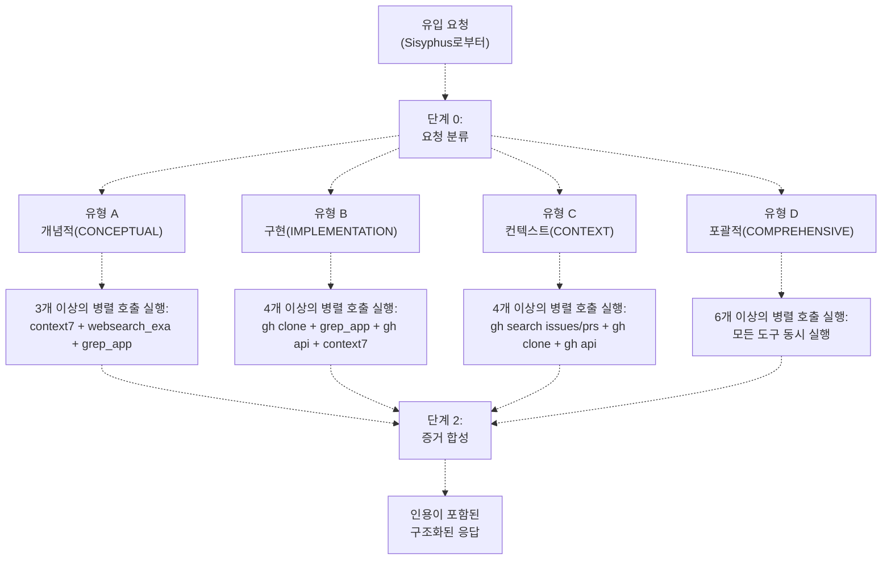
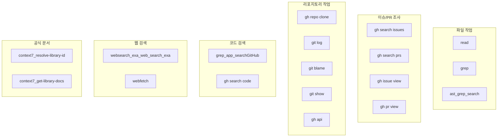
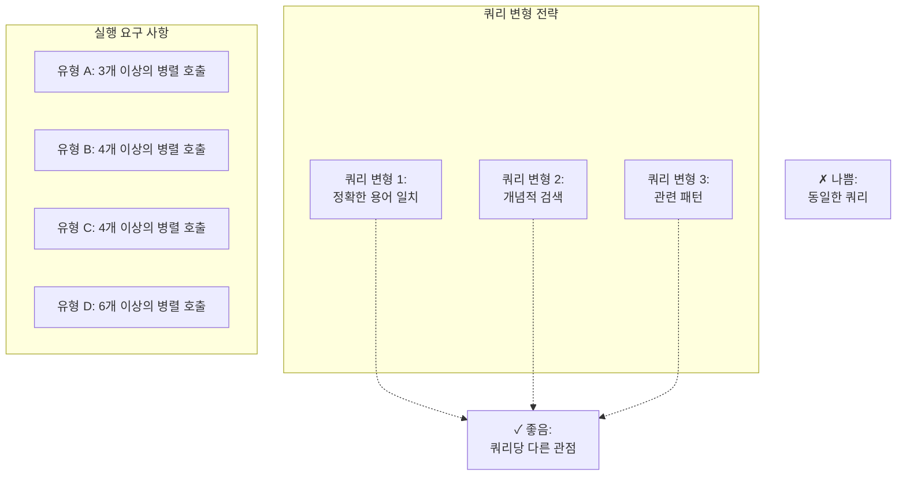
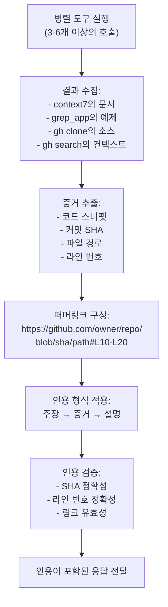
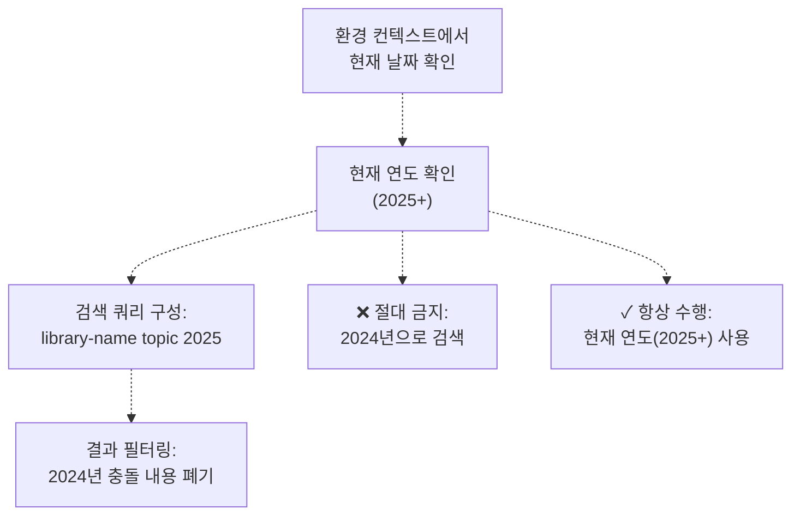
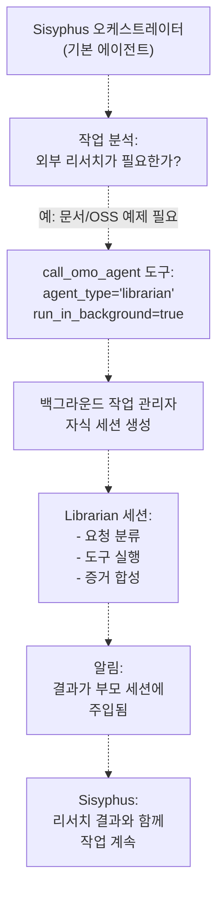

# Librarian 에이전트

> **관련 소스 파일**
> * [src/agents/document-writer.ts](https://github.com/code-yeongyu/oh-my-opencode/blob/b92cd6ab/src/agents/document-writer.ts)
> * [src/agents/explore.ts](https://github.com/code-yeongyu/oh-my-opencode/blob/b92cd6ab/src/agents/explore.ts)
> * [src/agents/frontend-ui-ux-engineer.ts](https://github.com/code-yeongyu/oh-my-opencode/blob/b92cd6ab/src/agents/frontend-ui-ux-engineer.ts)
> * [src/agents/librarian.ts](https://github.com/code-yeongyu/oh-my-opencode/blob/b92cd6ab/src/agents/librarian.ts)
> * [src/agents/multimodal-looker.ts](https://github.com/code-yeongyu/oh-my-opencode/blob/b92cd6ab/src/agents/multimodal-looker.ts)
> * [src/agents/oracle.ts](https://github.com/code-yeongyu/oh-my-opencode/blob/b92cd6ab/src/agents/oracle.ts)

## 목적 및 범위

Librarian 에이전트는 외부 지식 습득 및 다중 리포지토리(multi-repository) 분석을 위해 설계된 전문 리서치 에이전트입니다. 공식 문서 조회, 오픈 소스 코드 예제, 라이브러리 내부 구조 및 GitHub 리포지토리 검색 등 현재 코드베이스 외부의 정보가 필요한 요청을 처리합니다.

이 페이지는 Librarian의 요청 분류 시스템, 도구 실행 전략, 인용 요구 사항 및 통합 패턴을 설명합니다. Librarian에게 작업을 위임하는 기본 오케스트레이터(orchestrator)에 대한 정보는 [Sisyphus 오케스트레이터](/code-yeongyu/oh-my-opencode/4.1-sisyphus-orchestrator)를 참조하십시오. 내부 코드베이스 검색에 대해서는 [Explore 에이전트](/code-yeongyu/oh-my-opencode/4.2.3-explore-agent)를, 아키텍처 가이드 및 코드 분석에 대해서는 [Oracle 에이전트](/code-yeongyu/oh-my-opencode/4.2.1-oracle-agent)를 참조하십시오.

## 에이전트 설정

Librarian 에이전트는 `createLibrarianAgent()` 팩토리 함수에 의해 생성되며 다음과 같은 특성으로 설정됩니다.

| 속성 | 값 | 목적 |
| --- | --- | --- |
| **Model** | `anthropic/claude-sonnet-4-5` | 리서치 작업에 최적화된 균형 잡힌 성능 |
| **Mode** | `subagent` | Sisyphus에 의해 호출되며 사용자가 직접 호출하지 않음 |
| **Temperature** | `0.1` | 사실적이고 일관된 응답을 위한 낮은 온도 설정 |
| **Write Access** | 비활성화 | 읽기 전용 에이전트, 코드 수정 불가 |
| **Edit Access** | 비활성화 | 코드 편집 수행 불가 |
| **Background Tasks** | 비활성화 | 재귀적 생성 방지 |

이 에이전트는 다음과 같이 정의됩니다: "GitHub CLI, Context7 및 웹 검색을 사용하여 다중 리포지토리 분석, 원격 코드베이스 검색, 공식 문서 검색 및 구현 예제 찾기에 특화된 코드베이스 이해 전문 에이전트입니다."

**출처:** [src/agents/librarian.ts L1-L12](https://github.com/code-yeongyu/oh-my-opencode/blob/b92cd6ab/src/agents/librarian.ts#L1-L12)

## 요청 분류 시스템

Librarian은 검색을 실행하기 전에 필수적으로 요청 분류 단계를 거칩니다. 모든 유입 요청은 네 가지 유형 중 하나로 분류되어야 하며, 각 유형은 고유한 도구 실행 전략과 병렬 실행 요구 사항을 가집니다.

### 분류 워크플로우



**출처:** [src/agents/librarian.ts L29-L39](https://github.com/code-yeongyu/oh-my-opencode/blob/b92cd6ab/src/agents/librarian.ts#L29-L39)

### 요청 유형 정의

#### 유형 A: 개념적 (CONCEPTUAL)

**트리거 예시:** "X를 어떻게 사용하나요?", "Y의 모범 사례는 무엇인가요?", "Z란 무엇인가요?"

**특징:** 사용자가 구체적인 구현 세부 사항보다는 상위 수준의 이해나 사용 패턴을 필요로 하는 경우입니다.

**도구 전략:**

* `context7_resolve-library-id()` 실행 후 `context7_get-library-docs()` 호출
* 현재 연도 필터(2025+)를 적용한 `websearch_exa_web_search_exa()`
* 실제 사용 패턴 확인을 위한 `grep_app_searchGitHub()`

**최소 병렬 호출 수:** 3개 이상

**출처:** [src/agents/librarian.ts L44-L56](https://github.com/code-yeongyu/oh-my-opencode/blob/b92cd6ab/src/agents/librarian.ts#L44-L56)

#### 유형 B: 구현 (IMPLEMENTATION)

**트리거 예시:** "X는 Y를 어떻게 구현하나요?", "Z의 소스를 보여주세요", "...의 내부 로직은?"

**특징:** 사용자가 실제 소스 코드를 조사하고 구현 세부 사항을 이해해야 하는 경우입니다.

**도구 전략:**

1. 임시 디렉터리(`${TMPDIR:-/tmp}/repo-name`)에 `gh repo clone` 실행
2. 퍼머링크(permalink)를 위한 커밋 SHA를 얻기 위해 `git rev-parse HEAD` 실행
3. 코드 위치를 찾기 위해 `grep` 또는 `ast_grep_search` 사용
4. 특정 파일을 조사하기 위해 `read` 사용
5. 작성자 컨텍스트 확인을 위해 `git blame` 사용

**병렬 가속:** `gh repo clone`, `grep_app_searchGitHub()`, `gh api`, `context7_get-library-docs()`를 동시에 실행 (4개 이상의 호출)

**최소 병렬 호출 수:** 4개 이상

**출처:** [src/agents/librarian.ts L59-L86](https://github.com/code-yeongyu/oh-my-opencode/blob/b92cd6ab/src/agents/librarian.ts#L59-L86)

#### 유형 C: 컨텍스트 및 이력 (CONTEXT & HISTORY)

**트리거 예시:** "이것이 왜 변경되었나요?", "이력은 어떻게 되나요?", "관련 이슈/PR이 있나요?"

**특징:** 사용자가 역사적 맥락, 결정 근거 또는 관련 논의를 필요로 하는 경우입니다.

**도구 전략:**

* 리포지토리 필터가 적용된 `gh search issues`
* 머지(merged) 상태 필터가 적용된 `gh search prs`
* 이력 확인을 위해 depth 50으로 `gh repo clone` 실행
* 파일의 진화 과정을 확인하기 위한 `git log --oneline` 및 `git blame`
* 버전 컨텍스트 확인을 위한 `gh api repos/owner/repo/releases`

**특정 이슈/PR 컨텍스트:**

* `gh issue view <number> --comments`
* `gh pr view <number> --comments`
* `gh api repos/owner/repo/pulls/<number>/files`

**최소 병렬 호출 수:** 4개 이상

**출처:** [src/agents/librarian.ts L89-L107](https://github.com/code-yeongyu/oh-my-opencode/blob/b92cd6ab/src/agents/librarian.ts#L89-L107)

#### 유형 D: 포괄적 (COMPREHENSIVE)

**트리거 예시:** 복잡한 질문, 모호한 요청, "...에 대한 심층 분석"

**특징:** 문서, 코드 검색 및 컨텍스트 분석을 결합한 다각적인 조사가 필요한 요청입니다.

**도구 전략:** 모든 도구 카테고리를 병렬로 실행합니다.

* 문서 및 웹: `context7` + `websearch_exa`
* 코드 검색: 다양한 쿼리를 사용한 다수의 `grep_app_searchGitHub()` 호출
* 소스 분석: `gh repo clone`
* 컨텍스트: `gh search issues`

**최소 병렬 호출 수:** 6개 이상

**출처:** [src/agents/librarian.ts L112-L129](https://github.com/code-yeongyu/oh-my-opencode/blob/b92cd6ab/src/agents/librarian.ts#L112-L129)

## 도구 실행 전략

Librarian은 외부 리서치에 최적화된 전문 도구 세트에 접근할 수 있습니다. 의도치 않은 부작용을 방지하기 위해 Sisyphus에 비해 도구 접근 권한이 제한됩니다.

### 목적별 사용 가능 도구



**출처:** [src/agents/librarian.ts L167-L182](https://github.com/code-yeongyu/oh-my-opencode/blob/b92cd6ab/src/agents/librarian.ts#L167-L182)

### 도구 접근 제한

Librarian은 리서치 중심의 역할을 유지하기 위해 엄격한 제약 하에 작동합니다.

| 도구 카테고리 | 접근 권한 | 근거 |
| --- | --- | --- |
| `write` | **비활성화** | 읽기 전용 에이전트, 코드 수정 불가 |
| `edit` | **비활성화** | 코드 편집 기능 없음 |
| `background_task` | **비활성화** | 재귀적인 에이전트 생성 방지 |
| `bash` | **활성화** | git/gh 작업을 위해 필요 |
| `read` | **활성화** | 복제된 코드 조사를 위해 필수적 |

**출처:** [src/agents/librarian.ts L12](https://github.com/code-yeongyu/oh-my-opencode/blob/b92cd6ab/src/agents/librarian.ts#L12-L12)

### 병렬 실행 요구 사항

Librarian은 리서치 지연 시간을 최소화하기 위해 공격적인 병렬 처리를 수행하도록 설계되었습니다. 시스템은 요청 유형에 따라 최소 병렬 호출 횟수를 강제합니다.



**쿼리 변형 예시** (프롬프트 발췌):

```
// 좋음: 다른 관점
grep_app_searchGitHub(query: "useQuery(", language: ["TypeScript"])
grep_app_searchGitHub(query: "queryOptions", language: ["TypeScript"])
grep_app_searchGitHub(query: "staleTime:", language: ["TypeScript"])

// 나쁨: 동일한 패턴
grep_app_searchGitHub(query: "useQuery")
grep_app_searchGitHub(query: "useQuery")
```

**출처:** [src/agents/librarian.ts L199-L218](https://github.com/code-yeongyu/oh-my-opencode/blob/b92cd6ab/src/agents/librarian.ts#L199-L218)

## 인용 요구 사항

Librarian은 모든 주장에 대해 검증 가능한 증거를 제공해야 합니다. 이는 GitHub 퍼머링크(permalink)를 사용하는 필수 인용 형식을 통해 강제됩니다.

### 퍼머링크 구성

모든 코드 참조는 안정성을 위해 커밋 SHA 기반의 퍼머링크를 사용해야 합니다.

```yaml
https://github.com/<owner>/<repo>/blob/<commit-sha>/<filepath>#L<start>-L<end>
```

**SHA를 얻는 방법:**

* 복제본에서: `git rev-parse HEAD`
* API에서: `gh api repos/owner/repo/commits/HEAD --jq '.sha'`
* 태그에서: `gh api repos/owner/repo/git/refs/tags/v1.0.0 --jq '.object.sha'`

### 필수 인용 형식

```javascript
**주장**: [주장하는 내용]

**증거** (<FileRef file-url="https://github.com/code-yeongyu/oh-my-opencode/blob/b92cd6ab/source" undefined  file-path="source">Hii</FileRef>):
```typescript
// 실제 코드
function example() { ... }
```

**설명**: [코드의 특정 이유] 때문에 이와 같이 작동합니다.
```

**출처:** [src/agents/librarian.ts L133-L163](https://github.com/code-yeongyu/oh-my-opencode/blob/b92cd6ab/src/agents/librarian.ts#L133-L163)

### 증거 합성 워크플로우



**출처:** [src/agents/librarian.ts L133-L149](https://github.com/code-yeongyu/oh-my-opencode/blob/b92cd6ab/src/agents/librarian.ts#L133-L149)

## 임시 디렉터리 관리

Librarian은 작업 디렉터리를 오염시키지 않기 위해 OS에 적합한 임시 디렉터리에 리포지토리를 복제합니다.

### 크로스 플랫폼 임시 디렉터리 패턴

```
${TMPDIR:-/tmp}/repo-name
```

**플랫폼별 확인:**

* **macOS:** `/var/folders/.../T/repo-name` 또는 `/tmp/repo-name`
* **Linux:** `/tmp/repo-name`
* **Windows:** `C:\Users\...\AppData\Local\Temp\repo-name`

**복제 명령 예시:**

```
gh repo clone owner/repo ${TMPDIR:-/tmp}/repo-name -- --depth 1
```

`--depth 1` 플래그는 유형 B(구현) 요청에 대해 다운로드 크기와 시간을 최소화하기 위해 얕은 복제(shallow clone)를 생성합니다. 이력이 필요한 유형 C(컨텍스트) 요청의 경우 depth를 50으로 늘립니다.

**출처:** [src/agents/librarian.ts L184-L195](https://github.com/code-yeongyu/oh-my-opencode/blob/b92cd6ab/src/agents/librarian.ts#L184-L195)

## 날짜 인식 및 검색 필터링

Librarian은 오래된 정보가 결과에 섞이는 것을 방지하기 위해 중요한 날짜 인식 기능을 포함합니다.

### 날짜 필터링 규칙



**강제 규칙:**

1. 어떠한 검색을 수행하기 전에도 환경 컨텍스트에서 현재 날짜를 확인합니다.
2. 절대 "2024"로 검색하지 마십시오. 이는 구식 정보입니다.
3. 검색 쿼리에는 항상 현재 연도(2025+)를 사용하십시오.
4. 형식: `"library-name topic 2025"` ( `"library-name topic 2024"`가 아님)
5. 2025년 정보와 충돌하는 오래된 2024년 결과는 필터링하여 제외합니다.

**출처:** [src/agents/librarian.ts L19-L26](https://github.com/code-yeongyu/oh-my-opencode/blob/b92cd6ab/src/agents/librarian.ts#L19-L26)

## 실패 복구 전략

Librarian은 도구가 실패하거나 예상치 못한 결과를 반환할 때 단계적 기능 축소(graceful degradation)를 구현합니다.

### 실패 유형별 복구 작업

| 실패 유형 | 복구 작업 |
| --- | --- |
| **context7 찾을 수 없음** | 리포지토리를 직접 복제하여 소스 및 README 읽기 |
| **grep_app 결과 없음** | 쿼리 범위를 넓히고, 정확한 이름 대신 개념적 용어 시도 |
| **gh API 속도 제한** | API 호출 대신 임시 디렉터리의 복제된 리포지토리 사용 |
| **리포지토리 찾을 수 없음** | `gh search repos`를 사용하여 포크(fork) 또는 미러(mirror) 검색 |
| **불확실함** | 불확실한 상태를 명시적으로 밝히고, 주의 사항과 함께 가설 제안 |

**출처:** [src/agents/librarian.ts L222-L230](https://github.com/code-yeongyu/oh-my-opencode/blob/b92cd6ab/src/agents/librarian.ts#L222-L230)

## 통신 규칙

Librarian은 사용자의 기대와 일관성을 유지하기 위해 엄격한 통신 가이드를 따릅니다.

### 응답 가이드라인

1. **도구 이름 언급 금지**: "grep_app을 사용하겠습니다" 대신 "코드베이스를 검색하겠습니다"라고 말하십시오.
2. **서두 생략**: "도와드리겠습니다..."와 같은 말을 생략하고 즉시 답변하십시오.
3. **항상 인용**: 코드에 관한 모든 주장에는 퍼머링크가 필요합니다.
4. **마크다운 사용**: 언어 식별자가 포함된 코드 블록을 사용하십시오.
5. **간결함 유지**: 의견보다는 사실을, 추측보다는 증거를 우선시하십시오.

**근거:** 도구 이름은 사용자에게 불필요한 구현 세부 사항입니다. 직접적인 답변은 사용자의 시간을 존중하는 것입니다. 인용은 검증을 가능하게 합니다. 마크다운은 가독성을 보장합니다. 간결함은 정보 밀도를 극대화합니다.

**출처:** [src/agents/librarian.ts L234-L241](https://github.com/code-yeongyu/oh-my-opencode/blob/b92cd6ab/src/agents/librarian.ts#L234-L241)

## Sisyphus와의 통합

Librarian은 외부 지식이 필요한 탐색 및 리서치 단계(Phase 2A)에서 Sisyphus에 의해 호출됩니다.

### 위임 패턴



### 호출 기준

Sisyphus는 다음과 같은 경우 Librarian에게 작업을 위임합니다.

* 사용자가 명시적으로 "원격 리포지토리에서 코드를 찾아달라"고 요청할 때
* 사용자가 "라이브러리 내부 구조" 또는 "공식 문서"를 요청할 때
* 사용자가 "오픈 소스의 사용 예제"를 찾을 때
* 작업에 외부 라이브러리나 프레임워크에 대한 이해가 필요할 때
* 공개 리포지토리의 구현 참조가 필요할 때

### 백그라운드 실행

Librarian은 일반적으로 `run_in_background=true`로 호출되어 Sisyphus가 다른 작업을 계속하는 동안 병렬로 리서치를 수행할 수 있습니다. 이는 복잡한 워크플로우에서 핵심적인 성능 최적화 요소입니다.

**출처:** [src/agents/librarian.ts L1-L8](https://github.com/code-yeongyu/oh-my-opencode/blob/b92cd6ab/src/agents/librarian.ts#L1-L8)

## 다른 리서치 에이전트와의 비교

Librarian과 관련 에이전트 간의 책임 분담을 이해하면 위임 패턴이 명확해집니다.

| 측면 | Librarian | Explore | Oracle |
| --- | --- | --- | --- |
| **범위** | 외부 리포지토리 | 현재 코드베이스 | 자문 전용 |
| **주요 도구** | context7, grep_app, gh CLI | LSP, ast_grep, grep | LSP, read |
| **검색 도메인** | GitHub, 문서, 웹 | 로컬 워크스페이스 | 제공된 컨텍스트 |
| **출력 유형** | 퍼머링크가 포함된 코드 인용 | 분석이 포함된 파일 경로 | 아키텍처 가이드 |
| **쓰기 권한** | 없음 | 없음 | 없음 |
| **전형적인 쿼리** | "OSS 프로젝트는 X를 어떻게 사용합니까?" | "우리 코드에서 X는 어디에 있습니까?" | "X를 리팩토링해야 합니까?" |
| **백그라운드 실행** | 예 (항상 비동기) | 예 (항상 비동기) | 아니요 (블로킹) |

**주요 차이점:**

* **Librarian**: 문서, OSS 예제, 라이브러리 내부 구조 등 외부 지식에 사용
* **Explore**: 현재 코드베이스 내의 코드 찾기 등 내부 탐색에 사용
* **Oracle**: 아키텍처 결정, 복잡한 분석 등 추론에 사용

**출처:** [src/agents/librarian.ts L1-L8](https://github.com/code-yeongyu/oh-my-opencode/blob/b92cd6ab/src/agents/librarian.ts#L1-L8), [src/agents/explore.ts L1-L8](https://github.com/code-yeongyu/oh-my-opencode/blob/b92cd6ab/src/agents/explore.ts#L1-L8), [src/agents/oracle.ts L1-L8](https://github.com/code-yeongyu/oh-my-opencode/blob/b92cd6ab/src/agents/oracle.ts#L1-L8)

## 설정 및 커스터마이징

Librarian 에이전트는 `createLibrarianAgent()` 팩토리 함수를 통해 커스터마이징할 수 있습니다.

### 모델 오버라이드 (Model Override)

```javascript
// 기본 모델 (Claude Sonnet 4.5)
const librarian = createLibrarianAgent()

// 커스텀 모델 오버라이드
const librarian = createLibrarianAgent("anthropic/claude-opus-4-5")
```

모델 파라미터는 OpenCode의 모델 레지스트리에 있는 유효한 모델 식별자를 허용합니다. 기본 모델(`anthropic/claude-sonnet-4-5`)은 리서치 작업에 대한 성능과 비용의 균형을 고려하여 선택되었습니다.

### 에이전트 팩토리 통합

Librarian은 플러그인 초기화 중에 에이전트 팩토리 시스템을 통해 등록됩니다.

```javascript
const agents = {
  librarian: createLibrarianAgent(config.agentOverrides?.librarian?.model)
}
```

이를 통해 `oh-my-opencode.json`을 통한 설정 기반 모델 선택이 가능합니다.

```json
{
  "agentOverrides": {
    "librarian": {
      "model": "anthropic/claude-opus-4-5"
    }
  }
}
```

**출처:** [src/agents/librarian.ts L1-L12](https://github.com/code-yeongyu/oh-my-opencode/blob/b92cd6ab/src/agents/librarian.ts#L1-L12), [src/agents/librarian.ts L245-L246](https://github.com/code-yeongyu/oh-my-opencode/blob/b92cd6ab/src/agents/librarian.ts#L245-L246)

## 사용 예시

### 예시 1: 개념적 쿼리 (유형 A)

**사용자 요청:** "TanStack Query의 staleTime 옵션은 어떻게 사용하나요?"

**Librarian 분류:** 유형 A (개념적)

**병렬 도구 실행:**

1. `context7_resolve-library-id("@tanstack/react-query")`
2. `context7_get-library-docs(id, "staleTime configuration")`
3. `websearch_exa_web_search_exa("TanStack Query staleTime 2025")`
4. `grep_app_searchGitHub(query: "staleTime:", language: ["TypeScript"])`

**예상 출력:** 공식 문서 링크가 포함된 문서 요약, 웹 리소스, 그리고 GitHub 퍼머링크가 포함된 실제 사용 예제.

### 예시 2: 구현 쿼리 (유형 B)

**사용자 요청:** "Next.js가 미들웨어 라우팅을 어떻게 구현하는지 보여주세요."

**Librarian 분류:** 유형 B (구현)

**병렬 도구 실행:**

1. `gh repo clone vercel/next.js ${TMPDIR:-/tmp}/nextjs -- --depth 1`
2. `grep_app_searchGitHub(query: "middleware routing", repo: "vercel/next.js")`
3. `gh api repos/vercel/next.js/commits/HEAD --jq '.sha'`
4. `context7_get-library-docs(id, "middleware")`

**예상 출력:** 미들웨어 구현을 보여주는 GitHub 퍼머링크가 포함된 소스 코드와 라인별 인용.

### 예시 3: 컨텍스트 쿼리 (유형 C)

**사용자 요청:** "React Router가 v6에서 Switch를 왜 지원 중단(deprecate)했나요?"

**Librarian 분류:** 유형 C (컨텍스트 및 이력)

**병렬 도구 실행:**

1. `gh search issues "Switch deprecated" --repo remix-run/react-router`
2. `gh search prs "Switch Routes" --repo remix-run/react-router --state merged`
3. `gh repo clone remix-run/react-router ${TMPDIR:-/tmp}/react-router -- --depth 50`
4. `gh api repos/remix-run/react-router/releases`

**예상 출력:** 지원 중단 근거를 설명하는 이슈, PR 및 릴리스 노트 링크가 포함된 역사적 맥락.

**출처:** [src/agents/librarian.ts L29-L129](https://github.com/code-yeongyu/oh-my-opencode/blob/b92cd6ab/src/agents/librarian.ts#L29-L129)