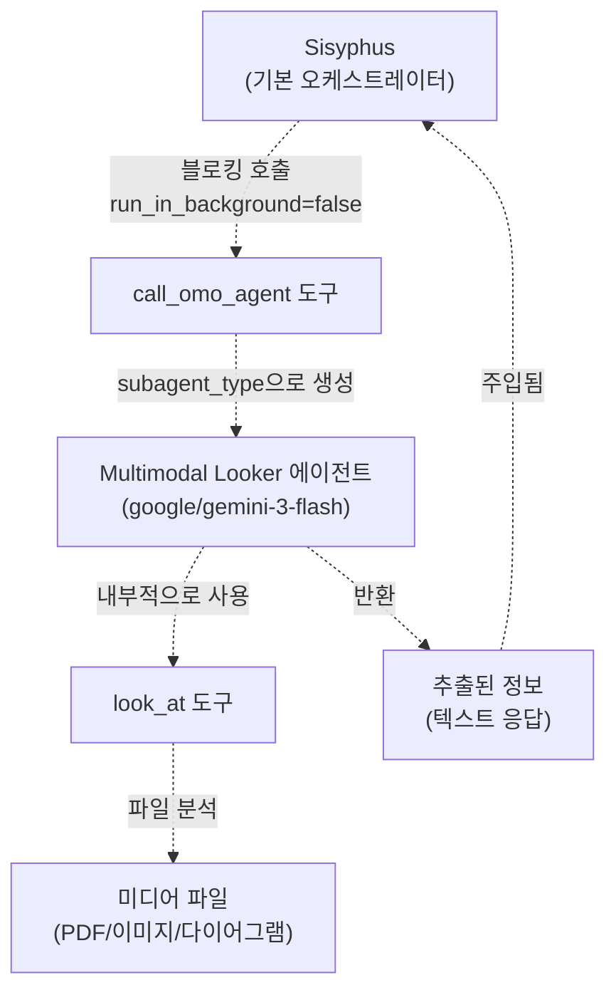
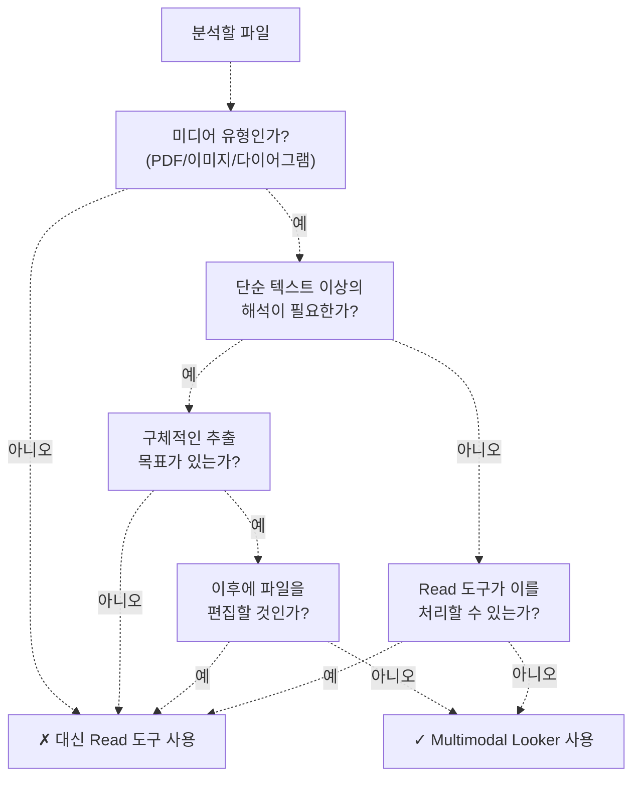
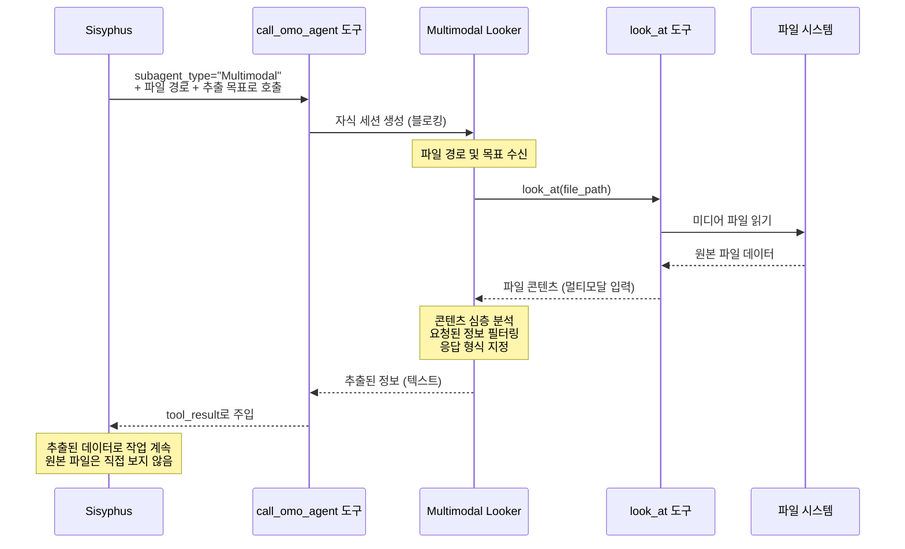
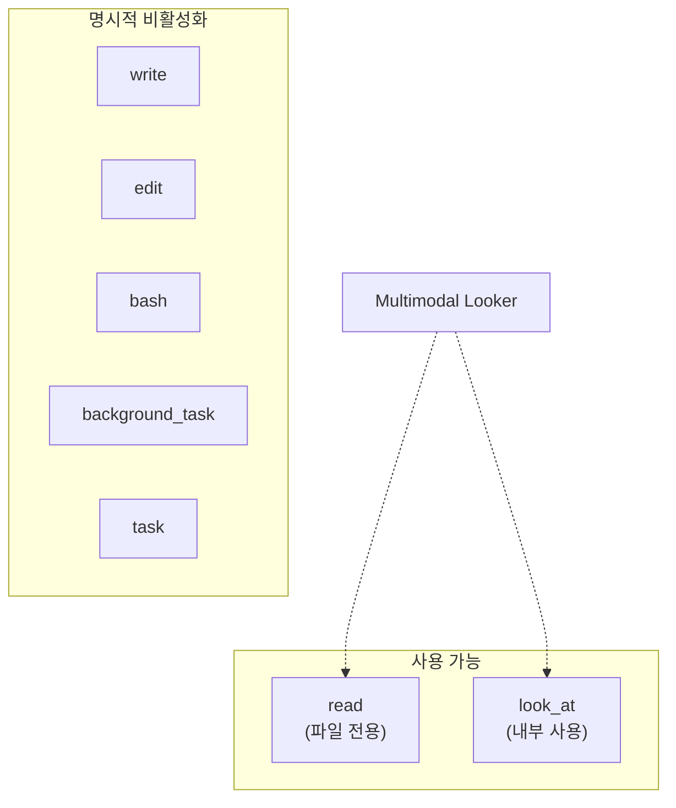
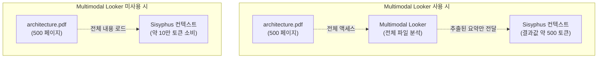
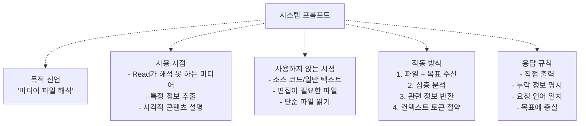

# Multimodal Looker (멀티모달 루커)

> **관련 소스 파일**
> * [src/agents/document-writer.ts](https://github.com/code-yeongyu/oh-my-opencode/blob/b92cd6ab/src/agents/document-writer.ts)
> * [src/agents/explore.ts](https://github.com/code-yeongyu/oh-my-opencode/blob/b92cd6ab/src/agents/explore.ts)
> * [src/agents/frontend-ui-ux-engineer.ts](https://github.com/code-yeongyu/oh-my-opencode/blob/b92cd6ab/src/agents/frontend-ui-ux-engineer.ts)
> * [src/agents/librarian.ts](https://github.com/code-yeongyu/oh-my-opencode/blob/b92cd6ab/src/agents/librarian.ts)
> * [src/agents/multimodal-looker.ts](https://github.com/code-yeongyu/oh-my-opencode/blob/b92cd6ab/src/agents/multimodal-looker.ts)
> * [src/agents/oracle.ts](https://github.com/code-yeongyu/oh-my-opencode/blob/b92cd6ab/src/agents/oracle.ts)

Multimodal Looker는 일반 텍스트로 처리할 수 없는 미디어 파일을 해석하는 전문 서브에이전트(subagent)입니다. 이 에이전트는 PDF, 이미지, 다이어그램을 분석하여 특정 정보를 추출하며, 시각적 콘텐츠가 메인 오케스트레이터(orchestrator)에 도달하기 전에 미리 전처리함으로써 컨텍스트 토큰(context tokens)을 절약합니다.

다른 전문 에이전트에 대한 정보는 [Specialized Agents](/code-yeongyu/oh-my-opencode/4.2-specialized-agents)를 참조하십시오. 일반적인 에이전트 설정은 [Agent Configuration](/code-yeongyu/oh-my-opencode/4.3-agent-configuration)을, 이 에이전트의 기능을 활성화하는 `look_at` 도구에 대해서는 [Specialized Tools](/code-yeongyu/oh-my-opencode/5.5-specialized-tools)를 참조하십시오.

## 목적 및 기능 (Purpose and Capabilities)

Multimodal Looker 에이전트는 시각적 및 구조화된 콘텐츠를 위한 타겟팅된 해석기 역할을 합니다. 소스 코드와 텍스트 파일을 다루는 범용 에이전트와 달리, 이 에이전트는 단순 텍스트 추출 이상의 해석이 필요한 미디어 파일만을 전담하여 처리합니다.

**핵심 기능:**

* PDF의 특정 섹션에서 텍스트, 구조, 표 및 데이터를 추출합니다.
* 이미지 내의 레이아웃, UI 요소, 텍스트 내용, 다이어그램 및 차트를 설명합니다.
* 다이어그램에 묘사된 관계, 흐름 및 아키텍처를 설명합니다.
* 불필요한 내용을 필터링하고 요청된 정보만 반환합니다.
* 메인 에이전트를 위해 컨텍스트를 절약하는 전처리기(preprocessor) 역할을 수행합니다.

출처: [src/agents/multimodal-looker.ts L1-L50](https://github.com/code-yeongyu/oh-my-opencode/blob/b92cd6ab/src/agents/multimodal-looker.ts#L1-L50)

## 에이전트 설정 (Agent Configuration)

### createMultimodalLookerAgent 함수

이 에이전트는 `createMultimodalLookerAgent` 팩토리 함수를 통해 다음과 같은 설정으로 생성됩니다.

```yaml
{
  description: "Analyze media files (PDFs, images, diagrams) that require interpretation beyond raw text...",
  mode: "subagent",
  model: "google/gemini-3-flash",
  temperature: 0.1,
  tools: { 
    write: false, 
    edit: false, 
    bash: false, 
    background_task: false 
  }
}
```

| 설정 키 (Configuration Key) | 값 | 근거 (Rationale) |
| --- | --- | --- |
| `model` | `google/gemini-3-flash` | Gemini Flash는 비용 효율적이면서도 빠른 멀티모달 분석을 제공합니다. |
| `mode` | `subagent` | 기본 오케스트레이터가 아닌, 호출 시 생성되는 전문가로 작동합니다. |
| `temperature` | `0.1` | 일관된 추출 결과를 위해 결정론적(deterministic) 출력을 유지합니다. |
| `tools.write` | `false` | 읽기 전용 에이전트이며 파일을 수정할 수 없습니다. |
| `tools.edit` | `false` | 기존 파일을 편집할 수 없습니다. |
| `tools.bash` | `false` | 미디어 분석에는 명령 실행이 필요하지 않습니다. |
| `tools.background_task` | `false` | 에이전트의 재귀적 생성을 방지합니다. |

출처: [src/agents/multimodal-looker.ts L5-L14](https://github.com/code-yeongyu/oh-my-opencode/blob/b92cd6ab/src/agents/multimodal-looker.ts#L5-L14)

## 위임 및 통합 (Delegation and Integration)

### 에이전트 계층 구조 내 위치



Multimodal Looker는 Sisyphus로부터의 **블로킹 위임(blocking delegation)**을 통해서만 호출됩니다. 메인 에이전트가 구현을 진행하기 전에 추출된 콘텐츠를 기다려야 하므로 백그라운드에서 실행되지 않습니다.

출처: [src/agents/multimodal-looker.ts L1-L50](https://github.com/code-yeongyu/oh-my-opencode/blob/b92cd6ab/src/agents/multimodal-looker.ts#L1-L50)

## 호출 패턴 (Invocation Pattern)

Sisyphus가 해석이 필요한 미디어 파일을 발견하면, 명시적인 추출 목표와 함께 위임 호출을 구성합니다.

```python
call_omo_agent(
  subagent_type: "Multimodal",
  run_in_background: false,  # 항상 블로킹 방식
  prompt: "docs/architecture.pdf에서 데이터베이스 스키마 다이어그램을 추출하세요. 
           모든 테이블, 컬럼 및 관계를 나열하세요."
)
```

Multimodal Looker는 다음을 수신합니다:

1. 분석할 파일 경로
2. 필요한 정보가 무엇인지 설명하는 구체적인 추출 목표
3. 추가 컨텍스트 없음 (격리된 상태에서 작동)

출처: [src/agents/multimodal-looker.ts L16-L46](https://github.com/code-yeongyu/oh-my-opencode/blob/b92cd6ab/src/agents/multimodal-looker.ts#L16-L46)

## 사용 사례 및 결정 로직 (Use Cases and Decision Logic)

### Multimodal Looker 사용 시점

다음 조건이 모두 충족될 때 에이전트를 호출해야 합니다.



**적절한 사용 사례:**

| 시나리오 | Multimodal Looker를 사용하는 이유 | 예시 |
| --- | --- | --- |
| PDF 데이터 추출 | 표, 섹션, 구조화된 데이터 추출 | "API-spec.pdf에서 API 엔드포인트를 추출하세요" |
| UI 스크린샷 분석 | 레이아웃, 요소, 디자인 설명 | "mockup.png의 모든 버튼과 라벨을 나열하세요" |
| 아키텍처 다이어그램 해석 | 구성 요소, 데이터 흐름 설명 | "diagram.svg의 마이크로서비스 아키텍처를 설명하세요" |
| 차트/그래프 분석 | 데이터 포인트, 트렌드 추출 | "benchmark-chart.png의 성능 지표는 무엇인가요?" |

**부적절한 사용 사례:**

| 시나리오 | 사용하지 않는 이유 | 대신 사용할 도구 |
| --- | --- | --- |
| 소스 코드 읽기 | 일반 텍스트는 해석이 필요 없음 | `read` 도구 |
| PDF 내용 편집 | 에이전트에게 쓰기/편집 권한이 없음 | 해당 없음 (PDF는 이 방식으로 편집 불가) |
| 파일 내용 그대로가 필요한 경우 | 에이전트는 해석/필터링된 결과를 반환함 | `read` 도구 |
| 단순 파일 검사 | 해석이 필요하지 않음 | `read` 도구 |

출처: [src/agents/multimodal-looker.ts L18-L28](https://github.com/code-yeongyu/oh-my-opencode/blob/b92cd6ab/src/agents/multimodal-looker.ts#L18-L28)

## 워크플로우 및 응답 프로토콜 (Workflow and Response Protocol)

### 실행 흐름



### 응답 구조

에이전트는 유용성을 극대화하기 위해 엄격한 응답 규칙을 따릅니다.

**직접 추출:**

```
[서문 없이 추출된 정보만 출력]
```

**정보 누락 시:**

```
파일에서 요청하신 [X]를 찾을 수 없습니다.
확인 가능한 콘텐츠는 다음과 같습니다: [Y], [Z]
```

**구조화된 데이터:**

```yaml
발견된 테이블:
- users: id (int), name (text), email (text)
- posts: id (int), user_id (int), content (text)

관계:
- posts.user_id → users.id (외래 키)
```

에이전트의 출력은 Sisyphus가 즉시 사용할 수 있도록 설계되었으며, 추가적인 파싱이나 변환이 필요하지 않습니다.

출처: [src/agents/multimodal-looker.ts L40-L46](https://github.com/code-yeongyu/oh-my-opencode/blob/b92cd6ab/src/agents/multimodal-looker.ts#L40-L46)

## 도구 액세스 제한 (Tool Access Restrictions)

### 제한된 도구 세트

Multimodal Looker는 모든 에이전트 중 가장 제한적인 도구 액세스 권한으로 작동합니다.



**제한 근거:**

| 도구 | 비활성화 여부 | 이유 |
| --- | --- | --- |
| `write` | ✓ | 순수 분석 역할이며 파일을 생성해서는 안 됩니다. |
| `edit` | ✓ | 기존 파일을 수정해서는 안 됩니다. |
| `bash` | ✓ | 미디어 분석 중 명령 실행이 필요하지 않습니다. |
| `background_task` | ✓ | 재귀적 생성을 방지합니다. 이미 서브에이전트입니다. |
| `task` | ✓ | 다른 서브에이전트를 생성할 수 없습니다. |

`look_at` 도구는 내부적으로 사용되지만 도구 제한 목록에 명시적으로 나열되지는 않습니다. 이는 미디어 파일 콘텐츠에 액세스하기 위한 기본 메커니즘입니다.

출처: [src/agents/multimodal-looker.ts L14](https://github.com/code-yeongyu/oh-my-opencode/blob/b92cd6ab/src/agents/multimodal-looker.ts#L14-L14)

## 상위 세션과의 통합 (Integration with Parent Session)

### 컨텍스트 토큰 최적화

Multimodal Looker의 주요 아키텍처적 이점은 **컨텍스트 보존(context conservation)**입니다. PDF나 이미지 전체를 Sisyphus의 컨텍스트 창에 로드하는 대신, 에이전트가 전처리기 역할을 수행합니다.



**토큰 절약 예시:**

* 전체 PDF 주입: 약 100,000 토큰
* 추출된 요약: 약 500 토큰
* **절감 효과: 컨텍스트 99.5% 감소**

출처: [src/agents/multimodal-looker.ts L31-L35](https://github.com/code-yeongyu/oh-my-opencode/blob/b92cd6ab/src/agents/multimodal-looker.ts#L31-L35)

### 언어 일치 (Language Matching)

에이전트는 요청된 언어에 자동으로 맞춰 응답합니다.

```python
요청 (한국어): "이 PDF에서 데이터베이스 스키마를 추출해주세요"
응답 (한국어): "다음 테이블들이 발견되었습니다..."

요청 (영어): "Extract the database schema from this PDF"
응답 (영어): "The following tables were found..."
```

이를 통해 사용자나 Sisyphus의 작업 언어에 관계없이 원활한 통합이 보장됩니다.

출처: [src/agents/multimodal-looker.ts L43](https://github.com/code-yeongyu/oh-my-opencode/blob/b92cd6ab/src/agents/multimodal-looker.ts#L43-L43)

## 다른 에이전트와의 비교 (Comparison with Other Agents)

### Multimodal Looker vs 다른 전문가 에이전트

| 에이전트 | 입력 유형 | 출력 유형 | 도구 액세스 | 실행 모드 |
| --- | --- | --- | --- | --- |
| **Multimodal Looker** | 미디어 파일 (PDF/이미지) | 추출된 텍스트/데이터 | Read-only + look_at | 블로킹 서브에이전트 |
| Librarian | 라이브러리 관련 질문 | 코드 링크 + 설명 | Read + MCPs + bash | 백그라운드/블로킹 |
| Explore | 코드 위치 쿼리 | 파일 경로 + 컨텍스트 | Read + LSP + AST | 백그라운드 |
| Oracle | 복잡한 의사결정 | 권장 사항 | Read + LSP + AST | 블로킹 서브에이전트 |
| Frontend | 시각적 구현 | 수정된 코드 | 전체 쓰기 권한 | 블로킹 서브에이전트 |
| DocWriter | 문서화 작업 | 문서 파일 | 전체 쓰기 권한 | 블로킹 서브에이전트 |

Multimodal Looker는 미디어 해석에만 집중하며 도구 액세스가 매우 제한적이라는 점에서 독특합니다.

출처: [src/agents/multimodal-looker.ts L1-L50](https://github.com/code-yeongyu/oh-my-opencode/blob/b92cd6ab/src/agents/multimodal-looker.ts#L1-L50)

## 시스템 프롬프트 분석 (System Prompt Analysis)

### 프롬프트 구조

이 에이전트의 시스템 프롬프트는 다른 에이전트에 비해 의도적으로 최소화되어 있으며, 다섯 개의 핵심 섹션으로 구성됩니다.



**주요 프롬프트 지침:**

1. **부정적 가이드라인 (Negative Guidance)**: 오용을 방지하기 위해 에이전트를 사용하지 말아야 할 때를 명시적으로 기술합니다.
2. **목표 지향성 (Goal Orientation)**: "요청된 것만" 추출하는 것을 강조합니다.
3. **컨텍스트 인식 (Context Awareness)**: "메인 에이전트는 원본 파일을 직접 처리하지 않는다"는 점을 상기시킵니다.
4. **출력의 직접성 (Output Directness)**: "서문 없이 추출된 정보를 직접 반환"하도록 합니다.
5. **실패 처리 (Failure Handling)**: "정보를 찾을 수 없는 경우 무엇이 누락되었는지 명확히 기술"합니다.

출처: [src/agents/multimodal-looker.ts L15-L46](https://github.com/code-yeongyu/oh-my-opencode/blob/b92cd6ab/src/agents/multimodal-looker.ts#L15-L46)

### 프롬프트 비교

다른 에이전트의 장황한 프롬프트와 달리 Multimodal Looker의 프롬프트가 간결한(33행) 이유는 다음과 같습니다.

* 제한된 도구 액세스로 인해 복잡성이 낮음
* 단일 목적의 역할로 인해 적은 지침이 필요함
* Sisyphus나 DocWriter와 같은 다단계 워크플로우가 없음
* Librarian이나 Explore와 같은 조사 전략이 필요하지 않음

출처: [src/agents/multimodal-looker.ts L15-L46](https://github.com/code-yeongyu/oh-my-opencode/blob/b92cd6ab/src/agents/multimodal-looker.ts#L15-L46)

## 파일 참조 (File Reference)

**주요 소스 파일:**

* [src/agents/multimodal-looker.ts L1-L50](https://github.com/code-yeongyu/oh-my-opencode/blob/b92cd6ab/src/agents/multimodal-looker.ts#L1-L50) - 전체 에이전트 정의
* [src/agents/index.ts](https://github.com/code-yeongyu/oh-my-opencode/blob/b92cd6ab/src/agents/index.ts) - 에이전트 내보내기(exports)

**관련 문서:**

* [Agent System](../agents/) - 멀티 에이전트 아키텍처 개요
* [Specialized Agents](/code-yeongyu/oh-my-opencode/4.2-specialized-agents) - 모든 전문 에이전트
* [Agent Configuration](/code-yeongyu/oh-my-opencode/4.3-agent-configuration) - 팩토리 시스템 및 오버라이드
* [Specialized Tools](/code-yeongyu/oh-my-opencode/5.5-specialized-tools) - `look_at` 도구 구현