# Oracle Agent

> **관련 소스 파일**
> * [.github/assets/sisyphus.png](https://github.com/code-yeongyu/oh-my-opencode/blob/b92cd6ab/.github/assets/sisyphus.png)
> * [src/agents/document-writer.ts](https://github.com/code-yeongyu/oh-my-opencode/blob/b92cd6ab/src/agents/document-writer.ts)
> * [src/agents/explore.ts](https://github.com/code-yeongyu/oh-my-opencode/blob/b92cd6ab/src/agents/explore.ts)
> * [src/agents/frontend-ui-ux-engineer.ts](https://github.com/code-yeongyu/oh-my-opencode/blob/b92cd6ab/src/agents/frontend-ui-ux-engineer.ts)
> * [src/agents/index.ts](https://github.com/code-yeongyu/oh-my-opencode/blob/b92cd6ab/src/agents/index.ts)
> * [src/agents/librarian.ts](https://github.com/code-yeongyu/oh-my-opencode/blob/b92cd6ab/src/agents/librarian.ts)
> * [src/agents/multimodal-looker.ts](https://github.com/code-yeongyu/oh-my-opencode/blob/b92cd6ab/src/agents/multimodal-looker.ts)
> * [src/agents/oracle.ts](https://github.com/code-yeongyu/oh-my-opencode/blob/b92cd6ab/src/agents/oracle.ts)
> * [src/agents/sisyphus.ts](https://github.com/code-yeongyu/oh-my-opencode/blob/b92cd6ab/src/agents/sisyphus.ts)
> * [src/agents/types.ts](https://github.com/code-yeongyu/oh-my-opencode/blob/b92cd6ab/src/agents/types.ts)
> * [src/agents/utils.test.ts](https://github.com/code-yeongyu/oh-my-opencode/blob/b92cd6ab/src/agents/utils.test.ts)
> * [src/agents/utils.ts](https://github.com/code-yeongyu/oh-my-opencode/blob/b92cd6ab/src/agents/utils.ts)

## 목적 및 범위 (Purpose and Scope)

이 문서는 oh-my-opencode 멀티 에이전트 시스템 내에서 고비용 추론 어드바이저(Reasoning Advisor) 역할을 하는 Oracle Agent에 대해 설명합니다. Oracle은 복잡한 분석, 아키텍처 결정 및 반복적인 실패 후의 디버깅 지원을 위해 Sisyphus 오케스트레이터(Orchestrator)에 의해 호출되는 전략적 기술 컨설턴트 역할을 수행합니다.

Oracle을 호출하는 기본 오케스트레이터에 대한 정보는 [Sisyphus Orchestrator](/code-yeongyu/oh-my-opencode/4.1-sisyphus-orchestrator)를 참조하십시오. 다른 전문 에이전트(Librarian, Explore, Frontend)에 대해서는 [Specialized Agents](/code-yeongyu/oh-my-opencode/4.2-specialized-agents)를 참조하십시오.

---

## 개요 (Overview)

Oracle Agent는 심층 추론 능력을 갖춘 읽기 전용(Read-only) 기술 어드바이저로 설계되었습니다. 다른 에이전트와 달리 Oracle은 코드를 직접 수정하지 않으며, 오직 전략적 가이드와 분석만을 제공합니다.

### 주요 특징

| 특징 | 값 |
| --- | --- |
| **모드 (Mode)** | `subagent` |
| **기본 모델** | `openai/gpt-5.2` (GPT-5.2) |
| **온도 (Temperature)** | 0.1 (결정론적) |
| **비용** | 고비용 (EXPENSIVE) - 신중하게 사용 |
| **주요 기능** | 전략적 추론 및 아키텍처 가이드 |
| **도구 액세스** | 읽기 전용 (LSP, AST-Grep, read) |

**출처:** [src/agents/oracle.ts L1-L91](https://github.com/code-yeongyu/oh-my-opencode/blob/b92cd6ab/src/agents/oracle.ts#L1-L91)

### 에이전트 계층 구조 내 위치

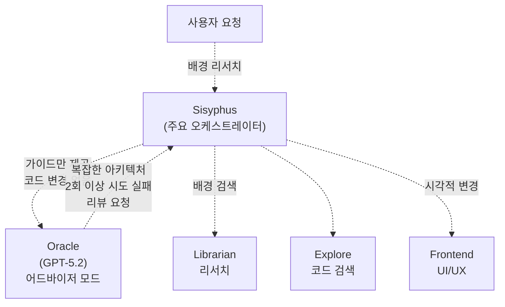

**출처:** [src/agents/sisyphus.ts L368-L396](https://github.com/code-yeongyu/oh-my-opencode/blob/b92cd6ab/src/agents/sisyphus.ts#L368-L396)

 [src/agents/utils.ts L14-L22](https://github.com/code-yeongyu/oh-my-opencode/blob/b92cd6ab/src/agents/utils.ts#L14-L22)

---

## Oracle 상담 시점

Sisyphus는 오케스트레이션 로직에 정의된 특정 트리거를 기반으로 Oracle을 호출합니다.

### 필수 상담 트리거

| 트리거 | 근거 | 타이밍 |
| --- | --- | --- |
| **복잡한 아키텍처 설계** | 멀티 시스템 트레이드오프를 위한 심층 추론 필요 | 구현 전 |
| **중요 작업 리뷰** | 완료된 구현에 대한 품질 보증 | 완료 후 |
| **2회 이상 수정 시도 실패** | 문제 해결이 막혔을 때 디버깅 지원 | 2차 실패 후 |
| **생소한 코드 패턴** | 동작 이해를 위한 전문 지식 필요 | 탐색 중 |
| **보안/성능 우려** | 비판적 분석 필요 | 진행 전 |

### Oracle 상담이 불필요한 경우

| 상황 | 이유 |
| --- | --- |
| 단순 파일 작업 | 직접적인 도구로 충분함 |
| 첫 번째 수정 시도 | 먼저 직접 시도해 볼 것 |
| 읽은 코드로 답변 가능한 질문 | 추론이 필요하지 않음 |
| 사소한 결정 | 변수명, 포맷팅 등 |
| 명백한 구문 오류 | 직접적인 도구 사용 |

**출처:** [src/agents/sisyphus.ts L368-L396](https://github.com/code-yeongyu/oh-my-opencode/blob/b92cd6ab/src/agents/sisyphus.ts#L368-L396)

### 호출 프로토콜 (Invocation Protocol)

Sisyphus가 Oracle과 상담할 때는 반드시 상담 사실을 공지해야 합니다:

```
Consulting Oracle for [specific reason]
```

이는 Sisyphus가 행동하기 전에 공지하는 **유일한** 사례입니다. 다른 모든 작업은 상태 업데이트 없이 즉시 시작됩니다.

**출처:** [src/agents/sisyphus.ts L393-L396](https://github.com/code-yeongyu/oh-my-opencode/blob/b92cd6ab/src/agents/sisyphus.ts#L393-L396)

---

## 에이전트 팩토리 및 구성

Oracle은 모델별 구성을 처리하는 팩토리 함수를 통해 생성됩니다.

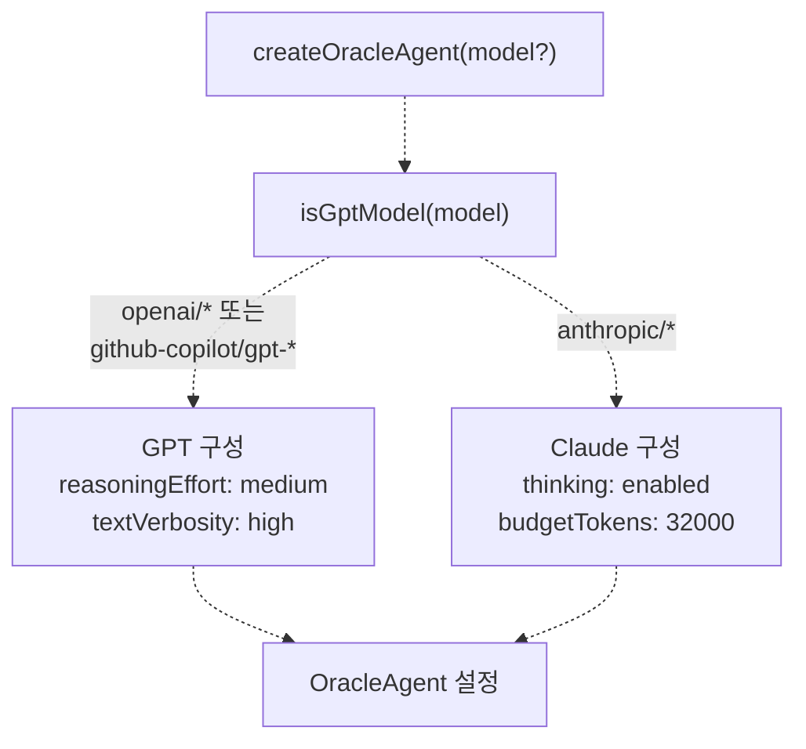

**출처:** [src/agents/oracle.ts L72-L90](https://github.com/code-yeongyu/oh-my-opencode/blob/b92cd6ab/src/agents/oracle.ts#L72-L90)

 [src/agents/types.ts L5-L7](https://github.com/code-yeongyu/oh-my-opencode/blob/b92cd6ab/src/agents/types.ts#L5-L7)

### 기본 구성 (Default Configuration)

```python
// createOracleAgent의 기본값
{
  description: "Expert technical advisor with deep reasoning for architecture decisions, code analysis, and engineering guidance.",
  mode: "subagent",
  model: "openai/gpt-5.2",
  temperature: 0.1,
  tools: { 
    write: false,      // 파일 수정 불가
    edit: false,       // 파일 편집 불가
    task: false,       // 할 일(todo) 생성 불가
    background_task: false  // 백그라운드 에이전트 생성 불가
  }
}
```

### 모델별 추론 구성

| 모델 유형 | 추론 모드 | 구성 |
| --- | --- | --- |
| **GPT 모델** | `reasoningEffort` | `medium` 추론 + `high` 텍스트 상세도 |
| **Claude 모델** | `thinking` | 32,000 토큰 사고(thinking) 예산 |

**출처:** [src/agents/oracle.ts L72-L90](https://github.com/code-yeongyu/oh-my-opencode/blob/b92cd6ab/src/agents/oracle.ts#L72-L90)

 [src/agents/utils.test.ts L45-L72](https://github.com/code-yeongyu/oh-my-opencode/blob/b92cd6ab/src/agents/utils.test.ts#L45-L72)

### 구성 오버라이드 흐름 (Configuration Override Flow)

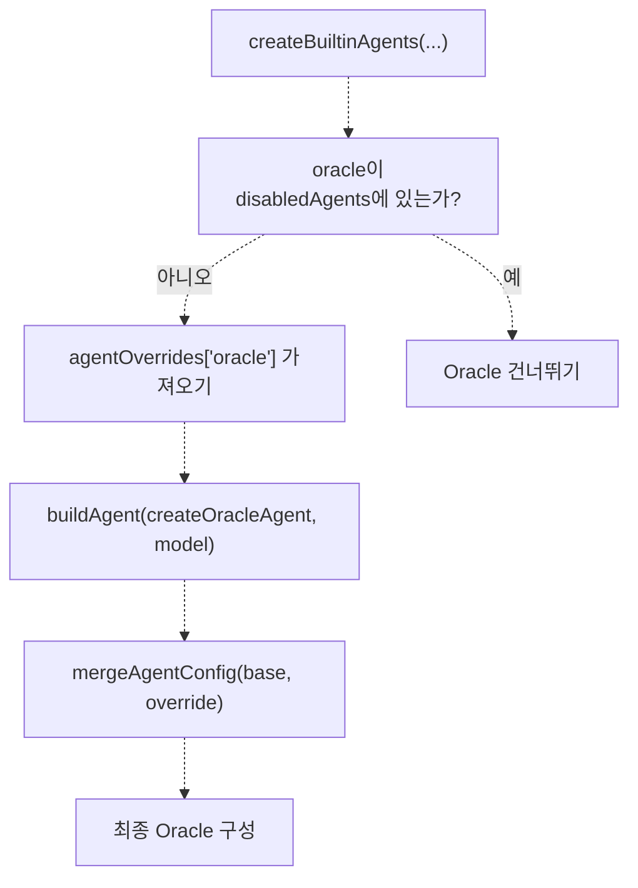

`agentOverrides` 객체는 다음을 지원합니다:

* `model`: 기본 GPT-5.2 모델 오버라이드
* `prompt_append`: 추가 지침 추가
* 기타 모든 `AgentConfig` 속성

**출처:** [src/agents/utils.ts L65-L112](https://github.com/code-yeongyu/oh-my-opencode/blob/b92cd6ab/src/agents/utils.ts#L65-L112)

---

## 도구 액세스 및 제한 사항

Oracle은 어드바이저 전용 역할을 유지하기 위해 도구 액세스가 의도적으로 제한되어 있습니다.

### 허용된 도구

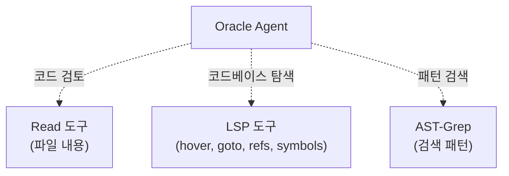

**Oracle이 할 수 있는 것:**

* 파일 내용 읽기
* 타입 정보 및 탐색을 위한 LSP 도구 사용 (`lsp_hover`, `lsp_goto_definition`, `lsp_find_references`, `lsp_workspace_symbols`)
* `ast_grep_search`를 통한 코드 패턴 검색
* `webfetch`를 통한 URL 읽기
* 외부 리서치를 위한 MCP 도구 사용

**출처:** [src/agents/oracle.ts L79](https://github.com/code-yeongyu/oh-my-opencode/blob/b92cd6ab/src/agents/oracle.ts#L79-L79)

 [src/agents/sisyphus.ts L119](https://github.com/code-yeongyu/oh-my-opencode/blob/b92cd6ab/src/agents/sisyphus.ts#L119-L119)

### 금지된 도구

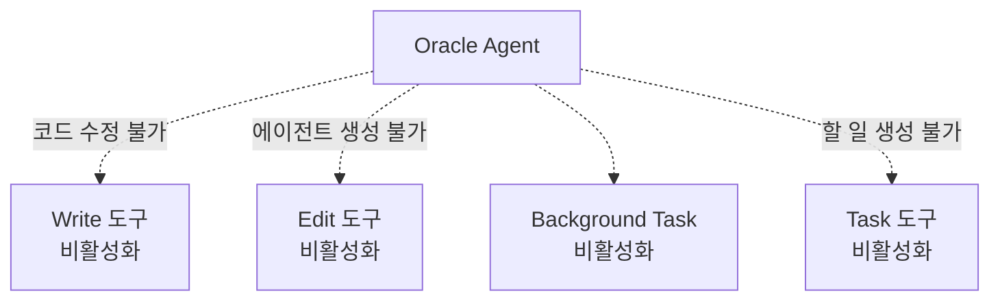

**Oracle이 할 수 없는 것:**

* 새 파일 쓰기 (`write: false`)
* 기존 파일 편집 (`edit: false`)
* 할 일 생성 또는 업데이트 (`task: false`)
* 백그라운드 에이전트 생성 (`background_task: false`)

**근거:** Oracle은 순수한 어드바이저입니다. 가이드를 제공하지만, 권장 사항의 구현은 Sisyphus(또는 사용자)가 수행해야 합니다. 이는 Oracle이 권한 없는 변경을 수행하는 "폭주"를 방지합니다.

**출처:** [src/agents/oracle.ts L79](https://github.com/code-yeongyu/oh-my-opencode/blob/b92cd6ab/src/agents/oracle.ts#L79-L79)

---

## 의사결정 프레임워크 (Decision Framework)

Oracle은 복잡한 솔루션보다 단순하고 유지보수가 쉬운 솔루션을 선호하는 **실용적 미니멀리즘(Pragmatic Minimalism)** 철학에 따라 운영됩니다.

### 핵심 원칙

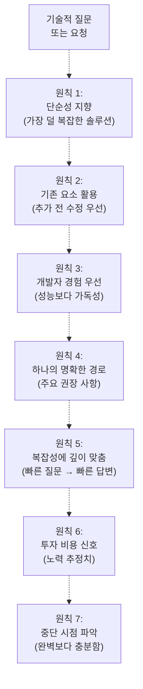

**출처:** [src/agents/oracle.ts L22-L39](https://github.com/code-yeongyu/oh-my-opencode/blob/b92cd6ab/src/agents/oracle.ts#L22-L39)

### 의사결정 휴리스틱 (Decision Heuristics)

| 원칙 | 가이드라인 | 예시 |
| --- | --- | --- |
| **단순성** | **실제** 요구사항을 충족하는 가장 덜 복잡한 솔루션 | 새로운 추상화 계층 대신 단순한 함수 선택 |
| **기존 요소 활용** | 새로운 것을 도입하기 전에 현재 코드, 패턴, 의존성 수정 | 새 인증 라이브러리 추가 대신 기존 인증 시스템 확장 |
| **개발자 경험** | 이론적 성능보다 가독성과 유지보수성 최적화 | 마이크로 최적화보다 명확한 변수명 우선 |
| **하나의 명확한 경로** | 단일 주요 권장 사항 제시; 대안은 실질적으로 다를 때만 제시 | "X, Y, Z를 쓸 수 있음"이 아닌 "X를 사용하십시오" |
| **깊이 맞춤** | 빠른 질문에는 빠른 답변; 복잡한 문제는 철저한 분석 | "이것이 안전한가?" → 예/아니오. "어떻게 재설계할까?" → 전체 분석 |
| **투자 신호** | 노력 추정치 태그: Quick, Short, Medium, Large | "Quick (<1h)" 또는 "Large (3d+)" |
| **중단 조건** | "충분히 좋은" 상태와 재검토 시점 식별 | "트래픽이 10k req/s를 넘지 않는 한 충분함" |

**출처:** [src/agents/oracle.ts L22-L39](https://github.com/code-yeongyu/oh-my-opencode/blob/b92cd6ab/src/agents/oracle.ts#L22-L39)

---

## 응답 구조 (Response Structure)

Oracle의 응답은 실행 가능성과 완전성의 균형을 맞추기 위해 3단계 구조를 따릅니다.

### 3단계 조직 구조

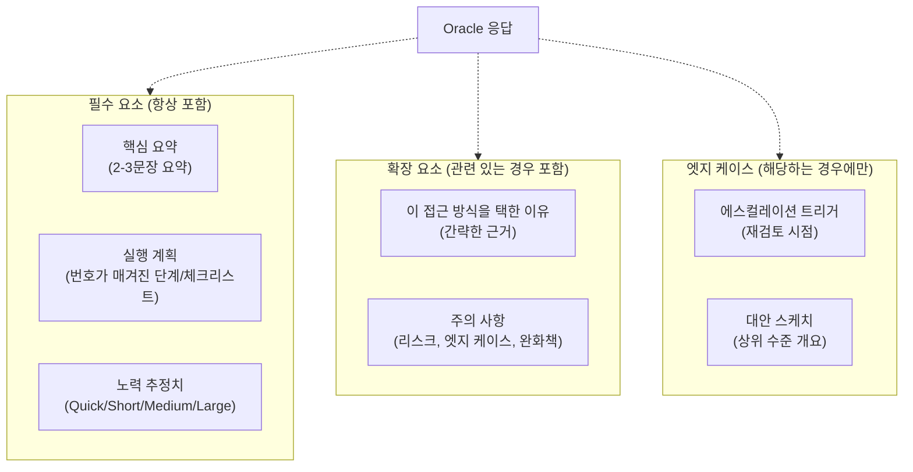

**출처:** [src/agents/oracle.ts L43-L59](https://github.com/code-yeongyu/oh-my-opencode/blob/b92cd6ab/src/agents/oracle.ts#L43-L59)

### 필수 섹션 (항상 포함)

모든 Oracle 응답에는 다음이 **반드시** 포함되어야 합니다:

1. **핵심 요약 (Bottom Line)**: 권장 사항을 요약하는 2-3개의 문장
2. **실행 계획 (Action Plan)**: 구현을 위한 번호가 매겨진 단계 또는 체크리스트
3. **노력 추정치 (Effort Estimate)**: 아래 척도를 사용

### 노력 추정 척도

| 라벨 | 시간 범위 | 용도 |
| --- | --- | --- |
| **Quick** | 1시간 미만 | 단순 변경, 설정 조정 |
| **Short** | 1-4시간 | 작은 기능, 집중된 리팩토링 |
| **Medium** | 1-2일 | 모듈 재작성, API 변경 |
| **Large** | 3일 이상 | 아키텍처 변경, 주요 기능 |

### 확장 섹션 (상황에 따라 포함)

관련이 있는 경우 포함합니다:

* **이 접근 방식을 택한 이유**: 간략한 근거 및 주요 트레이드오프
* **주의 사항**: 리스크, 엣지 케이스 및 완화 전략

### 엣지 케이스 섹션 (드물게 사용)

진정으로 해당하는 경우에만 포함합니다:

* **에스컬레이션 트리거**: 더 복잡한 솔루션이 정당화되는 특정 조건
* **대안 스케치**: 고급 경로에 대한 상위 수준의 개요 (전체 설계 아님)

**출처:** [src/agents/oracle.ts L43-L59](https://github.com/code-yeongyu/oh-my-opencode/blob/b92cd6ab/src/agents/oracle.ts#L43-L59)

---

## 시스템 프롬프트 및 행동 지침

Oracle의 행동은 컨텍스트, 제약 조건 및 출력 기대치를 설정하는 시스템 프롬프트에 의해 정의됩니다.

### 컨텍스트 및 역할 정의

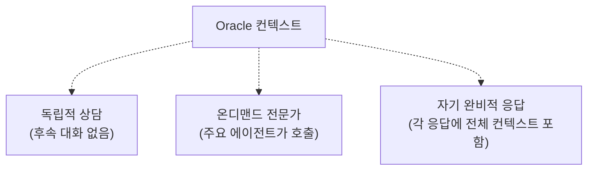

Oracle은 다음 제약 조건 하에 작동합니다:

* **설명을 위한 대화 불가능**: 각 상담은 독립적으로 이루어짐
* **주요 에이전트에 의해 호출됨**: 사용자가 직접 액세스할 수 없음
* **완전하고 자기 완비적임**: 모든 응답은 즉시 실행 가능해야 함

**출처:** [src/agents/oracle.ts L6-L10](https://github.com/code-yeongyu/oh-my-opencode/blob/b92cd6ab/src/agents/oracle.ts#L6-L10)

### 핵심 전문 분야

Oracle은 다음 분야를 전문으로 합니다:

1. **코드베이스 분석**: 구조적 패턴 및 설계 선택 분석
2. **기술적 권장 사항**: 구체적이고 구현 가능한 가이드 수립
3. **아키텍처**: 솔루션 설계 및 리팩토링 로드맵
4. **기술적 해결**: 복잡한 질문에 대한 체계적 추론
5. **문제 감지**: 숨겨진 문제 노출 및 예방 조치

**출처:** [src/agents/oracle.ts L12-L20](https://github.com/code-yeongyu/oh-my-opencode/blob/b92cd6ab/src/agents/oracle.ts#L12-L20)

### 프롬프트의 가이드 원칙

시스템 프롬프트는 다음을 강조합니다:

* **철저한 분석보다 실행 가능한 통찰력**: 길고 상세한 것보다 밀도 있고 유용한 것이 좋음
* **중요한 문제 노출**: 코드 리뷰의 모든 사소한 지적이 아닌 핵심 문제에 집중
* **최소 경로 매핑**: 계획 작업 시
* **주장을 간략하게 뒷받침**: 심층 탐색은 명시적인 요청이 있을 때만 수행
* **중간 처리 없음**: 응답은 사용자/Sisyphus에게 직접 전달됨

**출처:** [src/agents/oracle.ts L60-L70](https://github.com/code-yeongyu/oh-my-opencode/blob/b92cd6ab/src/agents/oracle.ts#L60-L70)

---

## Sisyphus의 사용 패턴

Sisyphus는 오케스트레이션 워크플로우에 정의된 Oracle 상담을 위한 특정 패턴을 가지고 있습니다.

### 상담 흐름

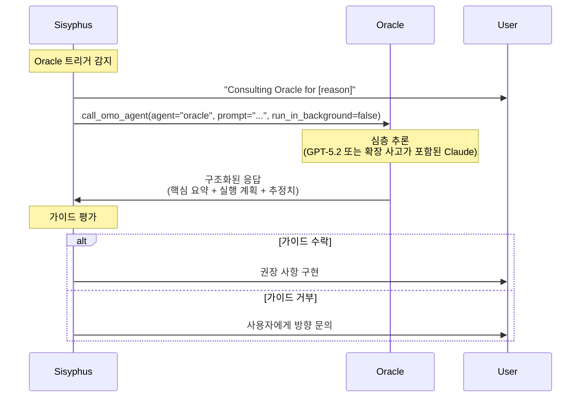

**출처:** [src/agents/sisyphus.ts L368-L396](https://github.com/code-yeongyu/oh-my-opencode/blob/b92cd6ab/src/agents/sisyphus.ts#L368-L396)

### 동기식 vs 비동기식 호출

**Oracle은 항상 동기식(Synchronous)**으로 호출됩니다 (블로킹):

```
// Oracle은 run_in_background=false로 호출됨
call_omo_agent(
  agent="oracle",
  prompt="[detailed context]",
  run_in_background=false  // Oracle의 경우 항상 false
)
```

백그라운드에서 실행되는 Librarian이나 Explore와 달리, Oracle은 응답이 완료될 때까지 Sisyphus를 차단합니다. 그 이유는 다음과 같습니다:

1. Oracle 상담은 비용이 많이 들고 신중하게 이루어짐
2. 결정 사항이 이후 작업의 관문 역할을 하는 경우가 많음
3. 가이드에 대한 즉각적인 평가가 필요함

**출처:** [src/agents/sisyphus.ts L237-L240](https://github.com/code-yeongyu/oh-my-opencode/blob/b92cd6ab/src/agents/sisyphus.ts#L237-L240)

### Oracle을 위한 위임 프롬프트 구조

Sisyphus가 Oracle에 위임할 때는 반드시 **7개 섹션으로 구성된 필수 구조**를 따라야 합니다:

1. **TASK**: 원자적이고 구체적인 목표
2. **EXPECTED OUTCOME**: 성공 기준이 포함된 구체적인 결과물
3. **REQUIRED SKILLS**: 호출할 기술
4. **REQUIRED TOOLS**: 명시적인 도구 화이트리스트
5. **MUST DO**: 철저한 요구사항
6. **MUST NOT DO**: 금지된 행동
7. **CONTEXT**: 파일 경로, 기존 패턴, 제약 조건

**모호한 프롬프트는 거부됩니다. 철저하게 작성하십시오.**

Oracle이 응답한 후, Sisyphus는 다음을 **반드시 확인**해야 합니다:

* 예상대로 작동하는가?
* 기존 코드베이스 패턴을 따르는가?
* 예상 결과가 발생했는가?
* Oracle이 "MUST DO" 및 "MUST NOT DO"를 준수했는가?

**출처:** [src/agents/sisyphus.ts L242-L262](https://github.com/code-yeongyu/oh-my-opencode/blob/b92cd6ab/src/agents/sisyphus.ts#L242-L262)

---

## 실패 복구 통합 (Failure Recovery Integration)

Oracle은 Sisyphus의 실패 복구 워크플로우에서 중요한 역할을 합니다.

### 3-스트라이크 복구 프로토콜

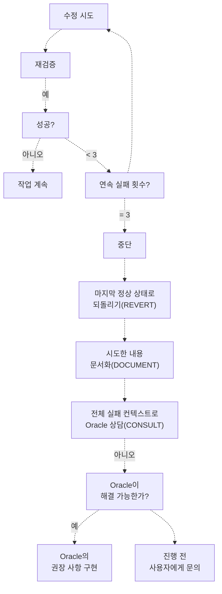

**출처:** [src/agents/sisyphus.ts L329-L347](https://github.com/code-yeongyu/oh-my-opencode/blob/b92cd6ab/src/agents/sisyphus.ts#L329-L347)

### Oracle을 위한 실패 컨텍스트

실패 후 Oracle과 상담할 때 Sisyphus는 다음을 제공합니다:

1. **시도한 내용**: 모든 수정 시도 및 접근 방식
2. **실패한 내용**: 구체적인 오류 메시지, 진단 결과, 증상
3. **현재 상태**: 코드 상태, 테스트 결과, 빌드 출력
4. **제약 조건**: 시간 압박, 부분적 변경, 의존성

Oracle은 이 컨텍스트를 사용하여 다음을 수행합니다:

* 근본 원인 파악 (증상이 아닌 원인)
* 대안적 접근 방식 제안
* 진단 전략 제안
* 사용자에게 에스컬레이션할 시점 권장

**출처:** [src/agents/sisyphus.ts L329-L346](https://github.com/code-yeongyu/oh-my-opencode/blob/b92cd6ab/src/agents/sisyphus.ts#L329-L346)

---

## 환경 컨텍스트 주입 (Environment Context Injection)

Sisyphus 및 Librarian과 달리 Oracle은 환경 컨텍스트 주입을 받지 **않습니다**.

### 컨텍스트 주입 비교

| 에이전트 | 환경 컨텍스트 주입 여부 | 근거 |
| --- | --- | --- |
| **Sisyphus** | 예 | 정확한 작업을 위해 현재 날짜/시간 필요 |
| **Librarian** | 예 | "2025년 이후" 필터링 등을 위해 날짜 인식 필요 |
| **Oracle** | 아니오 | 컨텍스트 무관 어드바이저; 시간 정보가 중요하지 않음 |
| **Explore** | 아니오 | 순수 검색; 날짜와 무관 |
| **Frontend** | 아니오 | 시각적 작업; 날짜와 무관 |
| **DocWriter** | 아니오 | 문서화 작업; 날짜와 무관 |

```javascript
// src/agents/utils.ts의 createBuiltinAgents에서 발췌
if ((agentName === "Sisyphus" || agentName === "librarian") && directory && config.prompt) {
  const envContext = createEnvContext(directory)
  config = { ...config, prompt: config.prompt + envContext }
}
// Oracle은 이 조건문에 포함되지 않음
```

**이유**: Oracle은 아키텍처 및 코드 구조에 대해 전략적이고 시대를 초월한 가이드를 제공합니다. 현재 날짜/시간은 어드바이저 역할과 관련이 없습니다.

**출처:** [src/agents/utils.ts L99-L102](https://github.com/code-yeongyu/oh-my-opencode/blob/b92cd6ab/src/agents/utils.ts#L99-L102)

---

## 테스트 및 검증

Oracle의 구성 로직은 유닛 테스트를 통해 검증됩니다.

### 모델별 구성 테스트

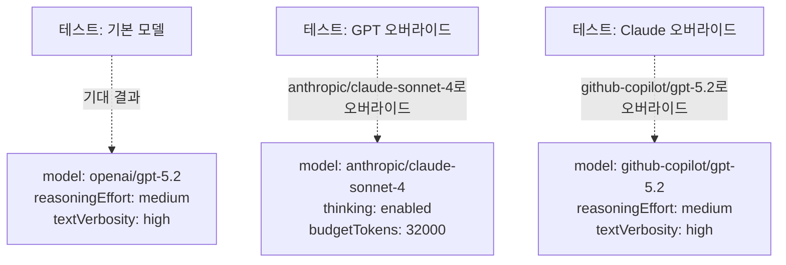

테스트 커버리지는 다음을 보장합니다:

* 기본 Oracle은 `reasoningEffort`와 함께 GPT-5.2를 사용함
* Claude 모델 오버라이드 시 `thinking` 모드로 전환됨
* GPT 모델 오버라이드 시 `reasoningEffort`가 유지됨
* 모델 외 오버라이드(온도 등)가 보존됨

**출처:** [src/agents/utils.test.ts L45-L87](https://github.com/code-yeongyu/oh-my-opencode/blob/b92cd6ab/src/agents/utils.test.ts#L45-L87)

### 테스트 시나리오

[src/agents/utils.test.ts L45-L87](https://github.com/code-yeongyu/oh-my-opencode/blob/b92cd6ab/src/agents/utils.test.ts#L45-L87) 발췌:

```javascript
test("Oracle with default model has reasoningEffort", () => {
  const agents = createBuiltinAgents()
  
  expect(agents.oracle.model).toBe("openai/gpt-5.2")
  expect(agents.oracle.reasoningEffort).toBe("medium")
  expect(agents.oracle.textVerbosity).toBe("high")
  expect(agents.oracle.thinking).toBeUndefined()
})

test("Oracle with Claude model override has thinking, no reasoningEffort", () => {
  const overrides = {
    oracle: { model: "anthropic/claude-sonnet-4" },
  }
  
  const agents = createBuiltinAgents([], overrides)
  
  expect(agents.oracle.model).toBe("anthropic/claude-sonnet-4")
  expect(agents.oracle.thinking).toEqual({ type: "enabled", budgetTokens: 32000 })
  expect(agents.oracle.reasoningEffort).toBeUndefined()
  expect(agents.oracle.textVerbosity).toBeUndefined()
})
```

---

## 요약

Oracle Agent는 다음과 같은 특징을 가진 oh-my-opencode의 전략적 기술 어드바이저 역할을 수행합니다:

1. **읽기 전용 어드바이저**: 코드 수정 없이 가이드만 제공
2. **고비용 리소스**: 확장 추론 기능이 포함된 GPT-5.2 사용; 신중하게 사용해야 함
3. **복잡성에 의해 트리거됨**: 아키텍처, 실패 후 디버깅, 리뷰를 위해 호출됨
4. **구조화된 응답**: 노력 추정치가 포함된 3단계 형식(필수/확장/엣지 케이스)
5. **동기식 호출**: 가이드가 완료될 때까지 Sisyphus를 차단
6. **도구 제한**: 분석을 위한 LSP 및 AST-Grep 사용; 쓰기/편집/할 일/백그라운드 작업 불가
7. **모델 유연성**: GPT(`reasoningEffort`) 또는 Claude(`thinking`) 모델 지원
8. **환경 컨텍스트 없음**: 컨텍스트 무관 어드바이저; 시간 정보 주입 안 됨

Oracle은 표준 접근 방식이 실패하거나 복잡한 결정에 전문가의 분석이 필요할 때 시스템이 심층 추론으로 에스컬레이션할 수 있는 능력을 상징합니다.

**출처:** [src/agents/oracle.ts L1-L91](https://github.com/code-yeongyu/oh-my-opencode/blob/b92cd6ab/src/agents/oracle.ts#L1-L91)

 [src/agents/sisyphus.ts L368-L396](https://github.com/code-yeongyu/oh-my-opencode/blob/b92cd6ab/src/agents/sisyphus.ts#L368-L396)

 [src/agents/utils.ts L79-L112](https://github.com/code-yeongyu/oh-my-opencode/blob/b92cd6ab/src/agents/utils.ts#L79-L112)