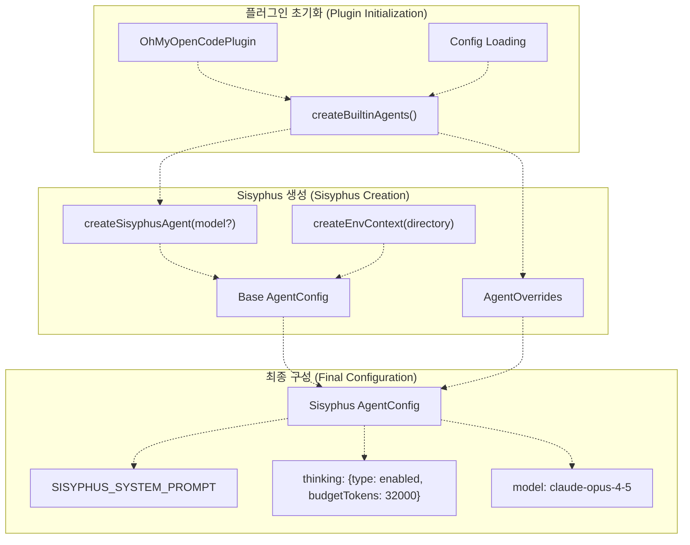
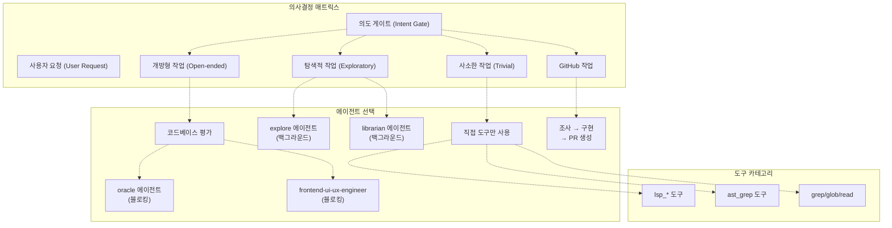
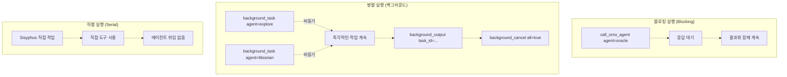
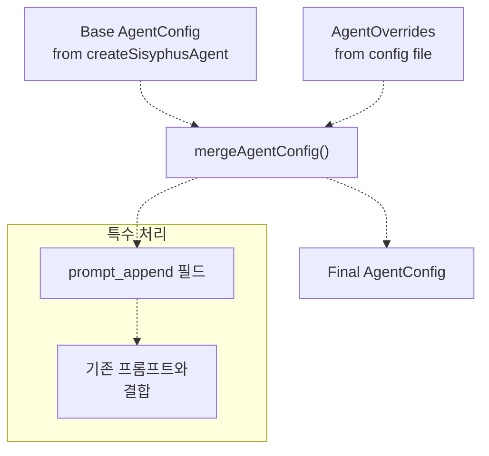

# Sisyphus Orchestrator (시지프스 오케스트레이터)

> **관련 소스 파일**
> * [.github/assets/sisyphus.png](https://github.com/code-yeongyu/oh-my-opencode/blob/b92cd6ab/.github/assets/sisyphus.png)
> * [README.ja.md](https://github.com/code-yeongyu/oh-my-opencode/blob/b92cd6ab/README.ja.md)
> * [README.ko.md](https://github.com/code-yeongyu/oh-my-opencode/blob/b92cd6ab/README.ko.md)
> * [README.md](https://github.com/code-yeongyu/oh-my-opencode/blob/b92cd6ab/README.md)
> * [README.zh-cn.md](https://github.com/code-yeongyu/oh-my-opencode/blob/b92cd6ab/README.zh-cn.md)
> * [src/agents/index.ts](https://github.com/code-yeongyu/oh-my-opencode/blob/b92cd6ab/src/agents/index.ts)
> * [src/agents/sisyphus.ts](https://github.com/code-yeongyu/oh-my-opencode/blob/b92cd6ab/src/agents/sisyphus.ts)
> * [src/agents/types.ts](https://github.com/code-yeongyu/oh-my-opencode/blob/b92cd6ab/src/agents/types.ts)
> * [src/agents/utils.test.ts](https://github.com/code-yeongyu/oh-my-opencode/blob/b92cd6ab/src/agents/utils.test.ts)
> * [src/agents/utils.ts](https://github.com/code-yeongyu/oh-my-opencode/blob/b92cd6ab/src/agents/utils.ts)
> * [src/shared/config-path.ts](https://github.com/code-yeongyu/oh-my-opencode/blob/b92cd6ab/src/shared/config-path.ts)

이 문서는 oh-my-opencode의 주요 오케스트레이터(Orchestrator, 작업을 조율하고 관리하는 주체) 에이전트인 Sisyphus에 대해 설명합니다. 에이전트 시스템에서 Sisyphus의 역할, 위임 전략, 실행 패턴 및 구성을 다룹니다. Sisyphus의 다단계 워크플로우에 대한 자세한 정보는 [Workflow Phases](/code-yeongyu/oh-my-opencode/4.1.1-workflow-phases)를 참조하십시오. 할 일 관리 동작에 대해서는 [Todo Management](/code-yeongyu/oh-my-opencode/4.1.2-todo-management)를, GitHub 전용 워크플로우는 [GitHub Workflow Integration](/code-yeongyu/oh-my-opencode/4.1.3-github-workflow-integration)을 참조하십시오.

## 목적 및 역할 (Purpose and Role)

Sisyphus는 전문화된 하위 에이전트(subagents)에게 작업을 위임하여 복잡한 코딩 작업을 조율하는 메인 오케스트레이터 에이전트입니다. 영원히 바위를 산 위로 밀어 올리는 신화 속 인물의 이름을 딴 Sisyphus는 작업이 완료될 때까지 지속되는 실행력을 상징합니다. 이 에이전트는 최대의 추론 능력을 발휘하기 위해 확장된 사고(extended thinking, 32k 토큰 예산) 기능이 활성화된 Claude Opus 4.5에서 실행됩니다.

**핵심 책임:**

* 사용자의 명시적 요청으로부터 암시적 요구사항 파싱(Parsing)
* 코드베이스 성숙도 평가 및 그에 따른 동작 조정
* 적절한 하위 에이전트에게 전문 작업 위임
* 병렬 및 순차적 작업 실행 관리
* 할 일(todo) 기반의 워크플로우 완료 강제

**설계 철학:** Sisyphus는 전문가(specialists)를 활용할 수 있는 상황에서 결코 혼자 작업하지 않습니다. 직접 구현하는 실무자보다는 작업을 위임하는 팀 리더로서 작동합니다.

출처: [README.md L160-L191](https://github.com/code-yeongyu/oh-my-opencode/blob/b92cd6ab/README.md#L160-L191)
 [src/agents/sisyphus.ts L6-L24](https://github.com/code-yeongyu/oh-my-opencode/blob/b92cd6ab/src/agents/sisyphus.ts#L6-L24)

## 아키텍처 및 초기화 (Architecture and Initialization)



**초기화 흐름**

[src/agents/utils.ts L79-L112](https://github.com/code-yeongyu/oh-my-opencode/blob/b92cd6ab/src/agents/utils.ts#L79-L112)에 정의된 `createBuiltinAgents()` 함수는 Sisyphus를 포함한 모든 내장 에이전트를 생성합니다. Sisyphus의 경우 구체적으로 다음과 같습니다:

1. **팩토리 호출**: 선택적인 모델 오버라이드와 함께 `createSisyphusAgent(model)`가 호출됩니다.
2. **환경 컨텍스트 (Environment Context)**: `directory`가 제공되면, `createEnvContext(directory)`가 컨텍스트 정보(현재 날짜, 시간, 시간대, 플랫폼, 작업 디렉토리)를 생성하여 프롬프트에 추가합니다.
3. **모델 선택**: `systemDefaultModel`이 제공되면 이를 사용하고, 그렇지 않으면 기본값인 `anthropic/claude-opus-4-5`를 사용합니다.
4. **오버라이드 적용**: `oh-my-opencode.json`에 설정된 사용자 구성 오버라이드가 `mergeAgentConfig()`를 통해 적용됩니다.

환경 컨텍스트 주입을 통해 Sisyphus는 정확한 시간 및 플랫폼 인식을 갖게 됩니다:

```xml
// 환경 컨텍스트 형식
<env>
  Working directory: /path/to/project
  Platform: darwin
  Today's date: Wed, Jan 15, 2025 (NOT 2024, NEVEREVER 2024)
  Current time: 02:30:45 PM
  Timezone: America/Los_Angeles
  Locale: en-US
</env>
```

출처: [src/agents/utils.ts L32-L63](https://github.com/code-yeongyu/oh-my-opencode/blob/b92cd6ab/src/agents/utils.ts#L32-L63)
 [src/agents/utils.ts L79-L112](https://github.com/code-yeongyu/oh-my-opencode/blob/b92cd6ab/src/agents/utils.ts#L79-L112)
 [src/agents/sisyphus.ts L1-L4](https://github.com/code-yeongyu/oh-my-opencode/blob/b92cd6ab/src/agents/sisyphus.ts#L1-L4)

## 에이전트 위임 전략 (Agent Delegation Strategy)



**위임 규칙**

Sisyphus는 요청을 분류하고 비용, 범위, 전문성에 따라 에이전트를 선택합니다:

| 에이전트 | 비용 | 실행 모드 | 사용 사례 |
| --- | --- | --- | --- |
| **explore** | 무료 | 백그라운드 (항상 비동기) | 다각도 검색, 익숙하지 않은 모듈, 계층 간 패턴 발견 |
| **librarian** | 저렴 | 백그라운드 (항상 비동기) | 외부 문서, GitHub 예제, OSS 구현체, 라이브러리 API 조사 |
| **oracle** | 비쌈 | 블로킹 (동기) | 아키텍처 결정, 코드 리뷰, 3회 이상 실패 후 디버깅 |
| **frontend-ui-ux-engineer** | 중간 | 블로킹 (동기) | 모든 시각적 변경 (색상, 간격, 레이아웃, 애니메이션, CSS) |
| **document-writer** | 저렴 | 블로킹 (동기) | README, API 문서, 아키텍처 문서 |
| **multimodal-looker** | 저렴 | 블로킹 (동기) | PDF 분석, 이미지 해석, 다이어그램 추출 |

**주요 위임 원칙:**

1. **Grep 대용으로서의 Explore/Librarian**: 이 에이전트들은 컨설턴트가 아닌 컨텍스트 및 참조 검색 도구로 취급됩니다. 항상 병렬 실행과 함께 백그라운드에서 실행됩니다.
2. **프론트엔드 규칙**: 순수 로직이 아닌 모든 시각적/UI/UX 변경은 반드시 `frontend-ui-ux-engineer`에게 위임해야 합니다. Sisyphus는 스타일링을 직접 수정하지 않습니다.
3. **Oracle 자문**: 고부가가치 추론(아키텍처, 지속적인 버그, 디자인 리뷰)을 위해 예약되어 있습니다. 블로킹 실행이 필요합니다.
4. **기본 흐름**: `explore` + `librarian` (백그라운드) → 작업 → `oracle` (필요한 경우)

출처: [src/agents/sisyphus.ts L114-L186](https://github.com/code-yeongyu/oh-my-opencode/blob/b92cd6ab/src/agents/sisyphus.ts#L114-L186)
 [README.md L164-L180](https://github.com/code-yeongyu/oh-my-opencode/blob/b92cd6ab/README.md#L164-L180)

## 실행 패턴 (Execution Patterns)

Sisyphus는 에이전트 위임을 위해 세 가지 실행 패턴을 지원합니다:



**1. 직렬 실행 (직접 도구 사용)**

범위가 명확하고 사소한 요청의 경우, Sisyphus는 에이전트 위임 없이 도구를 직접 사용합니다:

```
// 위임 불필요
lsp_goto_definition(file="auth.ts", line=42)
read_file(path="src/config.ts")
```

**2. 병렬 실행 (백그라운드 작업)**

Explore 및 Librarian 에이전트는 항상 백그라운드 모드에서 실행됩니다. 패턴은 다음과 같습니다:

```
// 병렬 검색 시작 (논블로킹)
background_task(agent="explore", prompt="Find auth implementations...", background_task=true)
background_task(agent="librarian", prompt="Find JWT best practices...", background_task=true)

// 검색이 실행되는 동안 즉각적인 작업 계속
// ...

// 필요할 때 결과 수집
background_output(task_id="task_001")
background_output(task_id="task_002")

// 완료 전 정리
background_cancel(all=true)
```

**3. 블로킹 실행 (동기 에이전트)**

Oracle, Frontend, Docwriter, Multimodal은 동기 실행이 필요합니다:

```
// 진행하기 전에 oracle의 응답을 대기
call_omo_agent(
  agent="oracle",
  prompt="Review this architecture design...",
  run_in_background=false
)
```

**백그라운드 작업 중단 조건**

Sisyphus는 다음과 같은 경우 새로운 검색 실행을 중단합니다:

* 자신 있게 진행할 수 있는 충분한 컨텍스트가 확보되었을 때
* 여러 소스에서 동일한 정보가 나타날 때
* 2회 반복 후에도 새로운 유용한 데이터가 나오지 않을 때
* 직접적인 해답을 찾았을 때

출처: [src/agents/sisyphus.ts L153-L186](https://github.com/code-yeongyu/oh-my-opencode/blob/b92cd6ab/src/agents/sisyphus.ts#L153-L186)
 [README.md L484-L495](https://github.com/code-yeongyu/oh-my-opencode/blob/b92cd6ab/README.md#L484-L495)

## 모델 구성 (Model Configuration)

Sisyphus의 추론 동작은 설정된 모델에 따라 조정됩니다:

| 모델 제품군 | 구성 | 추론 메커니즘 |
| --- | --- | --- |
| **Claude (기본값)** | `anthropic/claude-opus-4-5` | `thinking: {type: "enabled", budgetTokens: 32000}` |
| **GPT** | `openai/gpt-5.2` 또는 `github-copilot/gpt-*` | `reasoningEffort: "medium"`, `textVerbosity: "high"` |

**모델 감지 로직**

[src/agents/types.ts L5-L7](https://github.com/code-yeongyu/oh-my-opencode/blob/b92cd6ab/src/agents/types.ts#L5-L7)에 정의된 `isGptModel()` 함수가 모델 제품군을 결정합니다:

```javascript
function isGptModel(model: string): boolean {
  return model.startsWith("openai/") || model.startsWith("github-copilot/gpt-")
}
```

**구성 선택**

`createSisyphusAgent(model)`가 호출될 때:

1. `model` 파라미터가 GPT 모델인 경우 → `reasoningEffort` + `textVerbosity` 적용
2. `model` 파라미터가 Claude이거나 지정되지 않은 경우 → `thinking` 구성 적용
3. 기본 모델: `anthropic/claude-opus-4-5`

이를 통해 사용자가 어떤 프로바이더를 사용하든 최적의 추론 능력을 보장합니다.

출처: [src/agents/sisyphus.ts L1-L4](https://github.com/code-yeongyu/oh-my-opencode/blob/b92cd6ab/src/agents/sisyphus.ts#L1-L4)
 [src/agents/types.ts L5-L7](https://github.com/code-yeongyu/oh-my-opencode/blob/b92cd6ab/src/agents/types.ts#L5-L7)

## 환경 컨텍스트 주입 (Environment Context Injection)

`createEnvContext()` 함수는 Sisyphus의 프롬프트에 추가되는 시간 및 플랫폼 인식을 생성합니다:

**컨텍스트 구성 요소**

| 필드 | 소스 | 형식 예시 |
| --- | --- | --- |
| **Working directory** | `directory` 파라미터 | `/Users/dev/project` |
| **Platform** | `process.platform` | `darwin`, `linux`, `win32` |
| **Today's date** | `new Date()` | `Wed, Jan 15, 2025 (NOT 2024, NEVEREVER 2024)` |
| **Current time** | `new Date()` | `02:30:45 PM` |
| **Timezone** | `Intl.DateTimeFormat()` | `America/Los_Angeles` |
| **Locale** | `Intl.DateTimeFormat()` | `en-US` |

**주입 지점**

환경 컨텍스트는 다음의 경우에 주입됩니다:

* **Sisyphus**: `directory`가 제공되면 항상 컨텍스트를 받습니다.
* **librarian**: `directory`가 제공되면 항상 컨텍스트를 받습니다.
* 기타 에이전트: 컨텍스트 주입 없음.

명시적인 날짜 경고(`NOT 2024, NEVEREVER 2024`)는 모델의 응답에서 발생할 수 있는 시간적 혼란을 방지합니다.

출처: [src/agents/utils.ts L32-L63](https://github.com/code-yeongyu/oh-my-opencode/blob/b92cd6ab/src/agents/utils.ts#L32-L63)
 [src/agents/utils.ts L99-L102](https://github.com/code-yeongyu/oh-my-opencode/blob/b92cd6ab/src/agents/utils.ts#L99-L102)

## 구성 및 오버라이드 (Configuration and Overrides)

사용자는 `oh-my-opencode.json`을 통해 Sisyphus의 동작을 커스터마이징할 수 있습니다:

**기본 오버라이드 구문**

```json
{
  "agents": {
    "Sisyphus": {
      "model": "anthropic/claude-sonnet-4",
      "temperature": 0.3,
      "prompt_append": "Additional instructions..."
    }
  }
}
```

**오버라이드 적용 흐름**



**오버라이드 병합 로직**

[src/agents/utils.ts L65-L77](https://github.com/code-yeongyu/oh-my-opencode/blob/b92cd6ab/src/agents/utils.ts#L65-L77)에 정의된 `mergeAgentConfig()` 함수가 구성 병합을 처리합니다:

1. 오버라이드에서 `prompt_append` 추출 (특수 처리)
2. `deepMerge(base, rest)`를 통해 나머지 필드 딥 머지(Deep merge)
3. `prompt_append`가 존재하는 경우 결합: `merged.prompt = merged.prompt + "\n" + prompt_append`

이를 통해 사용자는 전체 기본 프롬프트를 교체하지 않고도 Sisyphus의 프롬프트를 확장할 수 있습니다.

**Sisyphus 비활성화**

Sisyphus 오케스트레이션을 완전히 비활성화하려면:

```json
{
  "sisyphus_agent": {
    "disabled": true
  }
}
```

이렇게 하면 OpenCode는 기본 build/plan 에이전트 동작으로 돌아갑니다.

출처: [src/agents/utils.ts L65-L77](https://github.com/code-yeongyu/oh-my-opencode/blob/b92cd6ab/src/agents/utils.ts#L65-L77)
 [src/agents/utils.ts L79-L112](https://github.com/code-yeongyu/oh-my-opencode/blob/b92cd6ab/src/agents/utils.ts#L79-L112)
 [README.md L789-L850](https://github.com/code-yeongyu/oh-my-opencode/blob/b92cd6ab/README.md#L789-L850)

## 에이전트 시스템과의 통합 (Integration with Agent System)

Sisyphus는 기본 에이전트이자 OpenCode의 기본 "build" 에이전트의 대체제로 등록됩니다:

**에이전트 등록**

[src/agents/index.ts L10-L18](https://github.com/code-yeongyu/oh-my-opencode/blob/b92cd6ab/src/agents/index.ts#L10-L18)의 `builtinAgents` 객체는 Sisyphus를 다른 에이전트들과 함께 내보냅니다:

```javascript
export const builtinAgents: Record<string, AgentConfig> = {
  Sisyphus: sisyphusAgent,
  oracle: oracleAgent,
  librarian: librarianAgent,
  explore: exploreAgent,
  "frontend-ui-ux-engineer": frontendUiUxEngineerAgent,
  "document-writer": documentWriterAgent,
  "multimodal-looker": multimodalLookerAgent,
}
```

**기본 에이전트 모드 vs 하위 에이전트 모드**

| 모드 | 구성 | 동작 |
| --- | --- | --- |
| **기본 (Primary)** | sisyphus_agent 활성화 시 기본값 | Sisyphus가 모든 세션의 기본 에이전트가 됨 |
| **하위 (Subagent)** | 다른 에이전트가 `call_omo_agent`를 통해 호출할 때 | Sisyphus가 전문 오케스트레이터로 작동 |

이러한 구분을 통해 Sisyphus는 세션을 주도할 수도 있고, 필요한 경우 다른 에이전트에 의해 자문을 받을 수도 있습니다.

출처: [src/agents/index.ts L1-L22](https://github.com/code-yeongyu/oh-my-opencode/blob/b92cd6ab/src/agents/index.ts#L1-L22)
 [README.md L789-L831](https://github.com/code-yeongyu/oh-my-opencode/blob/b92cd6ab/README.md#L789-L831)