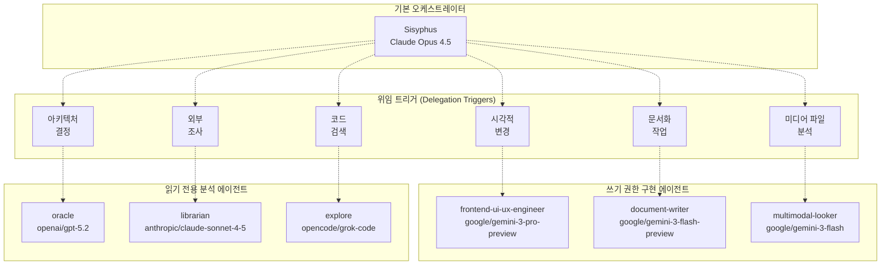
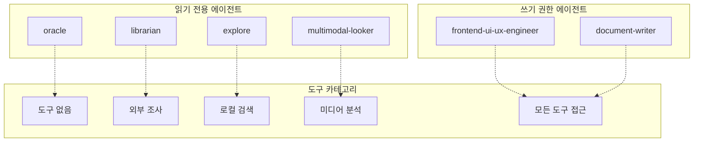
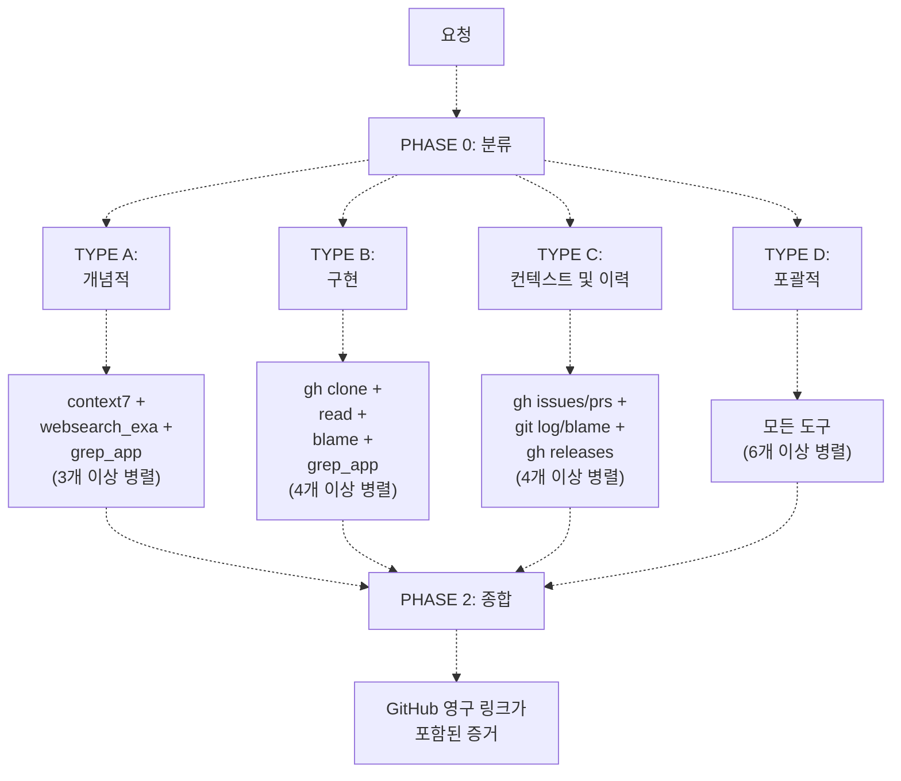

# 특화 에이전트 (Specialized Agents)

> **관련 소스 파일**
> * [.github/assets/sisyphus.png](https://github.com/code-yeongyu/oh-my-opencode/blob/b92cd6ab/.github/assets/sisyphus.png)
> * [README.ja.md](https://github.com/code-yeongyu/oh-my-opencode/blob/b92cd6ab/README.ja.md)
> * [README.ko.md](https://github.com/code-yeongyu/oh-my-opencode/blob/b92cd6ab/README.ko.md)
> * [README.md](https://github.com/code-yeongyu/oh-my-opencode/blob/b92cd6ab/README.md)
> * [README.zh-cn.md](https://github.com/code-yeongyu/oh-my-opencode/blob/b92cd6ab/README.zh-cn.md)
> * [src/agents/document-writer.ts](https://github.com/code-yeongyu/oh-my-opencode/blob/b92cd6ab/src/agents/document-writer.ts)
> * [src/agents/explore.ts](https://github.com/code-yeongyu/oh-my-opencode/blob/b92cd6ab/src/agents/explore.ts)
> * [src/agents/frontend-ui-ux-engineer.ts](https://github.com/code-yeongyu/oh-my-opencode/blob/b92cd6ab/src/agents/frontend-ui-ux-engineer.ts)
> * [src/agents/index.ts](https://github.com/code-yeongyu/oh-my-opencode/blob/b92cd6ab/src/agents/index.ts)
> * [src/agents/librarian.ts](https://github.com/code-yeongyu/oh-my-opencode/blob/b92cd6ab/src/agents/librarian.ts)
> * [src/agents/multimodal-looker.ts](https://github.com/code-yeongyu/oh-my-opencode/blob/b92cd6ab/src/agents/multimodal-looker.ts)
> * [src/agents/oracle.ts](https://github.com/code-yeongyu/oh-my-opencode/blob/b92cd6ab/src/agents/oracle.ts)
> * [src/agents/sisyphus.ts](https://github.com/code-yeongyu/oh-my-opencode/blob/b92cd6ab/src/agents/sisyphus.ts)
> * [src/agents/types.ts](https://github.com/code-yeongyu/oh-my-opencode/blob/b92cd6ab/src/agents/types.ts)
> * [src/agents/utils.test.ts](https://github.com/code-yeongyu/oh-my-opencode/blob/b92cd6ab/src/agents/utils.test.ts)
> * [src/agents/utils.ts](https://github.com/code-yeongyu/oh-my-opencode/blob/b92cd6ab/src/agents/utils.ts)
> * [src/shared/config-path.ts](https://github.com/code-yeongyu/oh-my-opencode/blob/b92cd6ab/src/shared/config-path.ts)

이 페이지는 oh-my-opencode 시스템 내에서 도메인 특화 기능을 제공하는 6가지 특화 에이전트에 대해 설명합니다. 이 에이전트들은 `subagent` 모드로 작동하며, 전문 지식이 필요한 특정 작업을 위해 기본 오케스트레이터(Orchestrator)인 Sisyphus에 의해 호출됩니다.

특화 에이전트는 다음 두 가지 카테고리로 나뉩니다:

* **읽기 전용 분석 에이전트 (Read-only Analytical Agents)**: Oracle, Librarian, Explore (조사 및 분석 중심)
* **쓰기 권한이 있는 구현 에이전트 (Write-capable Implementation Agents)**: Frontend UI/UX Engineer, Document Writer, Multimodal Looker

이 에이전트들에게 작업을 위임하는 기본 오케스트레이터에 대해서는 [Sisyphus Orchestrator](/code-yeongyu/oh-my-opencode/4.1-sisyphus-orchestrator)를 참조하십시오. 에이전트 설정 및 오버라이드(Override)에 대해서는 [Agent Configuration](/code-yeongyu/oh-my-opencode/4.3-agent-configuration)을 참조하십시오.

## 개요 (Overview)

특화 에이전트들은 Sisyphus가 도메인 특화 작업을 위해 호출하는 다계층 기능 시스템을 구성합니다. 각 에이전트는 엄선된 모델과 도구 접근 권한을 통해 고유한 목적에 최적화되어 있습니다.

| 에이전트 | 주요 목적 | 모델 | 쓰기 권한 | 주요 도구 |
| --- | --- | --- | --- | --- |
| **Oracle** | 전략적 기술 자문, 아키텍처, 디버깅 | `openai/gpt-5.2` | ❌ | 없음 (추론 전용) |
| **Librarian** | 외부 문서, 오픈소스 조사, GitHub 분석 | `anthropic/claude-sonnet-4-5` | ❌ | `context7`, `websearch_exa`, `grep_app`, `gh` |
| **Explore** | 빠른 코드베이스 검색, 파일 위치 확인, 패턴 매칭 | `opencode/grok-code` | ❌ | `grep`, `glob`, `ast_grep_search`, `lsp_*` |
| **Frontend UI/UX Engineer** | 시각적 디자인 및 UI 구현 | `google/gemini-3-pro-preview` | ✅ | `background_task`를 제외한 모든 도구 |
| **Document Writer** | 기술 문서, README, API 문서 작성 | `google/gemini-3-flash-preview` | ✅ | `background_task`를 제외한 모든 도구 |
| **Multimodal Looker** | 미디어 파일 분석 (PDF, 이미지, 다이어그램) | `google/gemini-3-flash` | ❌ | 없음 (직접 미디어 분석) |

모든 특화 에이전트의 공통 특성:

* `mode: "subagent"` - Sisyphus에 의해 필요 시 호출됨
* `tools.background_task: false` - 재귀적인 에이전트 생성 불가
* 모델별 온도(Temperature) 설정 (분석용은 0.1, 구현용은 가변적)

출처: [src/agents/index.ts L10-L18](https://github.com/code-yeongyu/oh-my-opencode/blob/b92cd6ab/src/agents/index.ts#L10-L18)

 [src/agents/utils.ts L14-L22](https://github.com/code-yeongyu/oh-my-opencode/blob/b92cd6ab/src/agents/utils.ts#L14-L22)

 [README.md L464-L472](https://github.com/code-yeongyu/oh-my-opencode/blob/b92cd6ab/README.md#L464-L472)

## 에이전트 아키텍처 및 위임 패턴 (Agent Architecture and Delegation Patterns)

**기능별 에이전트 역량 매트릭스**



**에이전트별 도구 접근 및 권한**



출처: [src/agents/utils.ts L79-L112](https://github.com/code-yeongyu/oh-my-opencode/blob/b92cd6ab/src/agents/utils.ts#L79-L112)

 [src/agents/index.ts L10-L18](https://github.com/code-yeongyu/oh-my-opencode/blob/b92cd6ab/src/agents/index.ts#L10-L18)

 [README.md L464-L496](https://github.com/code-yeongyu/oh-my-opencode/blob/b92cd6ab/README.md#L464-L496)

## Oracle 에이전트

Oracle 에이전트는 도구 접근 없이 순수 추론만을 사용하여 전략적 기술 자문과 심층적인 아키텍처 분석을 제공합니다. 깊은 분석적 사고가 필요한 복잡한 의사결정을 위해 설계되었습니다.

### 설정 (Configuration)

[src/agents/oracle.ts L72-L89](https://github.com/code-yeongyu/oh-my-opencode/blob/b92cd6ab/src/agents/oracle.ts#L72-L89)에 정의된 `createOracleAgent` 함수는 모델에 따른 설정을 통해 에이전트를 생성합니다:

```javascript
export function createOracleAgent(model: string = DEFAULT_MODEL): AgentConfig {
  const base = {
    description: "Expert technical advisor with deep reasoning for architecture decisions...",
    mode: "subagent" as const,
    model,
    temperature: 0.1,
    tools: { write: false, edit: false, task: false, background_task: false },
    prompt: ORACLE_SYSTEM_PROMPT,
  }

  if (isGptModel(model)) {
    return { ...base, reasoningEffort: "medium", textVerbosity: "high" }
  }

  return { ...base, thinking: { type: "enabled", budgetTokens: 32000 } }
}
```

**GPT 모델 설정**: GPT 모델을 사용할 때 Oracle은 OpenAI의 추론 기능을 활용하며, 분석 결과물을 극대화하기 위해 `reasoningEffort: "medium"` 및 `textVerbosity: "high"`를 설정합니다.

**비 GPT 설정**: 다른 모델(예: Claude Opus)의 경우, 심층 추론을 위해 32,000 토큰 예산의 확장 사고(Extended thinking) 기능이 활성화됩니다.

### 의사결정 프레임워크 (Decision Framework)

Oracle 시스템 프롬프트([src/agents/oracle.ts L6-L70](https://github.com/code-yeongyu/oh-my-opencode/blob/b92cd6ab/src/agents/oracle.ts#L6-L70))는 실용적인 의사결정 프레임워크를 강제합니다:

| 원칙 | 구현 방식 |
| --- | --- |
| **단순성 지향** | 실제 요구사항을 충족하는 가장 덜 복잡한 솔루션을 권장함 |
| **기존 자산 활용** | 새로운 컴포넌트 도입보다 기존 요소의 수정을 선호함 |
| **개발자 경험 우선** | 이론적 순수성보다 가독성과 유지보수성을 최적화함 |
| **하나의 명확한 경로** | 단일한 주요 권장 사항을 제공하며, 대안은 필요한 경우에만 제시함 |
| **복잡도에 따른 깊이 조절** | 간단한 질문에는 빠르게 답변하고, 철저한 분석은 복잡한 문제에 집중함 |
| **투자 비용 신호** | 권장 사항에 예상 공수 태그를 부착함: Quick(<1h), Short(1-4h), Medium(1-2d), Large(3d+) |

### 응답 구조 (Response Structure)

Oracle의 응답은 세 가지 계층으로 구성됩니다:

1. **필수 사항 (Essential)** (항상 포함): * 핵심 요약: 2-3문장의 권장 사항 * 실행 계획: 번호가 매겨진 단계 또는 체크리스트 * 공수 예상: Quick/Short/Medium/Large 척도 사용
2. **확장 사항 (Expanded)** (관련 있는 경우): * 이 접근 방식을 선택한 이유: 간략한 추론 및 주요 트레이드오프(Trade-off) * 주의 사항: 리스크, 엣지 케이스(Edge case), 완화 전략
3. **엣지 케이스 (Edge cases)** (해당하는 경우에만): * 에스컬레이션 트리거: 더 복잡한 솔루션이 정당화되는 조건 * 대안 스케치: 고급 접근 방식에 대한 상위 수준의 개요

### 호출 패턴 (Invocation Pattern)

Oracle은 심층적인 추론이 필요할 때 명시적으로 호출됩니다:

```
Ask @oracle to review this architecture and propose an alternative approach
Ask @oracle how to optimize this database query pattern
```

Sisyphus 오케스트레이터는 복잡한 아키텍처 결정이나 전략적 질문을 감지했을 때 자동으로 Oracle에 작업을 위임할 수도 있습니다.

출처: [src/agents/oracle.ts L1-L91](https://github.com/code-yeongyu/oh-my-opencode/blob/b92cd6ab/src/agents/oracle.ts#L1-L91)

 [README.md L491](https://github.com/code-yeongyu/oh-my-opencode/blob/b92cd6ab/README.md#L491-L491)

## Librarian 에이전트

Librarian 에이전트는 다중 리포지토리 분석, 외부 문서 조회 및 오픈소스 조사를 전문으로 합니다. 외부 정보 소스에 접근할 수 있는 유일한 분석 에이전트입니다.

### 설정 (Configuration)

[src/agents/librarian.ts L3-L10](https://github.com/code-yeongyu/oh-my-opencode/blob/b92cd6ab/src/agents/librarian.ts#L3-L10)에 정의되어 있습니다:

```javascript
export const librarianAgent: AgentConfig = {
  description: "Specialized codebase understanding agent for multi-repository analysis...",
  mode: "subagent",
  model: "anthropic/claude-sonnet-4-5",
  temperature: 0.1,
  tools: { write: false, edit: false, background_task: false },
  prompt: `# THE LIBRARIAN...`
}
```

### 3단계 워크플로우 (Three-Phase Workflow)

Librarian은 시스템 프롬프트에 정의된 필수 분류 및 실행 파이프라인을 통해 작동합니다:



**Phase 0: 요청 분류** ([src/agents/librarian.ts L26-L36](https://github.com/code-yeongyu/oh-my-opencode/blob/b92cd6ab/src/agents/librarian.ts#L26-L36))

모든 요청은 실행 전에 분류되어야 합니다:

| 유형 | 트리거 | 도구 | 병렬 호출 |
| --- | --- | --- | --- |
| **TYPE A: 개념적** | "X를 어떻게 사용하나요?", "베스트 프랙티스는?" | `context7`, `websearch_exa`, `grep_app` | 3+ |
| **TYPE B: 구현** | "X는 Y를 어떻게 구현했나요?", "소스 보여줘" | `gh clone`, `read`, `blame`, `grep_app` | 4+ |
| **TYPE C: 컨텍스트 및 이력** | "이게 왜 변경됐나요?", "X의 이력은?" | `gh issues/prs`, `git log`, `blame` | 4+ |
| **TYPE D: 포괄적** | 복잡하거나 모호한 요청 | 모든 도구 | 6+ |

**Phase 1: 유형별 실행** ([src/agents/librarian.ts L39-L128](https://github.com/code-yeongyu/oh-my-opencode/blob/b92cd6ab/src/agents/librarian.ts#L39-L128))

각 요청 유형은 정보 수집 효율성을 극대화하기 위해 필수적인 병렬 도구 호출을 포함하는 특정 도구 실행 패턴을 가집니다.

**Phase 2: 증거 종합** ([src/agents/librarian.ts L130-L161](https://github.com/code-yeongyu/oh-my-opencode/blob/b92cd6ab/src/agents/librarian.ts#L130-L161))

모든 응답에는 다음 형식의 GitHub 영구 링크(Permalink)가 포함되어야 합니다:

```javascript
**주장**: [주장하는 내용]

**증거** (<FileRef file-url="https://github.com/code-yeongyu/oh-my-opencode/blob/b92cd6ab/source" undefined  file-path="source">Hii</FileRef>):
```typescript
// 실제 코드
function example() { ... }
```

**설명**: [코드의 특정 이유] 때문에 이렇게 작동합니다.

```xml
### 도구 접근 매트릭스

| 도구 카테고리 | 도구 | 목적 |
|---------------|-------|---------|
| **공식 문서** | `context7_resolve-library-id`, `context7_get-library-docs` | 권위 있는 API 문서 검색 |
| **웹 검색** | `websearch_exa_web_search_exa` | 최근 토론, 블로그 포스트, 이슈 검색 |
| **코드 검색** | `grep_app_searchGitHub` | 수백만 개의 공개 리포지토리에서 빠른 검색 |
| **GitHub CLI** | `gh repo clone`, `gh search code/issues/prs`, `gh api` | 리포지토리 작업 및 메타데이터 |
| **Git 작업** | `git log`, `git blame`, `git show`, `git rev-parse` | 이력 및 작성자 분석 |
| **URL 페칭** | `webfetch` | 특정 URL(블로그 포스트, Stack Overflow) 내용 가져오기 |

### 날짜 인식 (Date Awareness)

Librarian 시스템 프롬프트에는 오래된 정보를 방지하기 위한 중요한 날짜 인식 규칙이 포함되어 있습니다 (<FileRef file-url="https://github.com/code-yeongyu/oh-my-opencode/blob/b92cd6ab/src/agents/librarian.ts#L16-L23" min=16 max=23 file-path="src/agents/librarian.ts">Hii</FileRef>):
```

**현재 연도 확인**: 어떠한 검색을 하기 전에도 환경 컨텍스트에서 현재 날짜를 확인하십시오.

* **절대 2024년을 검색하지 마십시오** - 더 이상 2024년이 아닙니다.
* 검색 쿼리에는 **항상 현재 연도**(2025년 이상)를 사용하십시오.
* 2025년 정보와 충돌하는 오래된 2024년 결과는 필터링하십시오.

```css
### 병렬 실행 요구사항

Librarian은 처리량을 극대화하기 위해 최소 병렬 도구 호출 수를 강제합니다:

| 요청 유형 | 최소 병렬 호출 수 |
|--------------|------------------------|
| TYPE A (개념적) | 3+ |
| TYPE B (구현) | 4+ |
| TYPE C (컨텍스트) | 4+ |
| TYPE D (포괄적) | 6+ |

쿼리는 중복되지 않아야 하며, 동일한 주제의 다양한 측면을 다룰 수 있도록 다양화되어야 합니다.

### 임시 디렉토리 사용

리포지토리 클론 작업을 위해 Librarian은 OS에 적합한 임시 디렉토리를 사용합니다:

```bash
${TMPDIR:-/tmp}/repo-name

# 플랫폼별 예시:
# macOS: /var/folders/.../repo-name 또는 /tmp/repo-name
# Linux: /tmp/repo-name
# Windows: C:\Users\...\AppData\Local\Temp\repo-name
```

출처: [src/agents/librarian.ts L1-L241](https://github.com/code-yeongyu/oh-my-opencode/blob/b92cd6ab/src/agents/librarian.ts#L1-L241)

 [README.md L492](https://github.com/code-yeongyu/oh-my-opencode/blob/b92cd6ab/README.md#L492-L492)

## Explore 에이전트

Explore 에이전트는 로컬 도구를 사용하여 빠르고 문맥에 맞는 코드베이스 검색을 제공합니다. "X가 어디에 있나요?"라는 질문에 답하고 현재 프로젝트 내에서 패턴 매칭을 수행하는 데 최적화되어 있습니다.

### 설정 (Configuration)

[src/agents/explore.ts L3-L10](https://github.com/code-yeongyu/oh-my-opencode/blob/b92cd6ab/src/agents/explore.ts#L3-L10)에 정의되어 있습니다:

```javascript
export const exploreAgent: AgentConfig = {
  description: 'Contextual grep for codebases. Answers "Where is X?", "Which file has Y?"...',
  mode: "subagent",
  model: "opencode/grok-code",
  temperature: 0.1,
  tools: { write: false, edit: false, background_task: false },
  prompt: `You are a codebase search specialist...`
}
```

`opencode/grok-code` 모델은 파일 탐색 작업에서의 속도와 비용 효율성 때문에 선택되었습니다. Claude Code는 유사한 목적으로 Haiku를 사용하지만, oh-my-opencode는 무료이면서 패턴 매칭에 충분한 성능을 내는 Grok을 사용합니다.

### 구조화된 출력 형식 (Structured Output Format)

Explore 에이전트는 필수적인 3부 구성의 응답 구조를 강제합니다 ([src/agents/explore.ts L22-L53](https://github.com/code-yeongyu/oh-my-opencode/blob/b92cd6ab/src/agents/explore.ts#L22-L53)):

**1. 의도 분석 (Intent Analysis)** (검색 전 필수):

```javascript
<analysis>
**Literal Request**: [사용자가 문자 그대로 요청한 내용]
**Actual Need**: [사용자가 실제로 달성하려는 목적]
**Success Looks Like**: [사용자가 즉시 작업을 진행할 수 있게 하는 결과물]
</analysis>
```

**2. 병렬 실행 (Parallel Execution)** (필수):

* 첫 번째 작업에서 3개 이상의 도구를 동시에 실행
* 이전 결과에 의존하는 경우에만 순차적 실행 허용

**3. 구조화된 결과 (Structured Results)** (필수):

```xml
<results>
<files>
- /absolute/path/to/file1.ts — [이 파일이 관련 있는 이유]
- /absolute/path/to/file2.ts — [이 파일이 관련 있는 이유]
</files>

<answer>
[단순 파일 목록이 아닌, 실제 필요에 대한 직접적인 답변]
</answer>

<next_steps>
[이 정보를 가지고 사용자가 다음에 해야 할 일]
</next_steps>
</results>
```

### 성공 기준 및 실패 조건 (Success Criteria and Failure Conditions)

시스템 프롬프트는 명시적인 성공/실패 지표를 정의합니다 ([src/agents/explore.ts L55-L70](https://github.com/code-yeongyu/oh-my-opencode/blob/b92cd6ab/src/agents/explore.ts#L55-L70)):

| 기준 | 요구사항 |
| --- | --- |
| **경로** | 모든 경로는 절대 경로여야 함 (`/`로 시작) |
| **완전성** | 첫 번째 결과뿐만 아니라 모든 관련 매칭 항목을 찾아야 함 |
| **실행 가능성** | 호출자가 추가 질문 없이 작업을 진행할 수 있어야 함 |
| **의도** | 문자 그대로의 요청이 아닌 실제 필요를 해결해야 함 |

**실패 조건** (다음의 경우 응답은 실패로 간주됨):

* 경로가 상대 경로인 경우
* 코드베이스에서 명백한 매칭 항목을 놓친 경우
* 호출자가 "정확히 어디인가요?" 또는 "X는 어떤가요?"라고 다시 물어야 하는 경우
* 근본적인 필요가 아닌 문자 그대로의 질문에만 답한 경우
* 구조화된 출력이 포함된 `<results>` 블록이 없는 경우

### 도구 선택 전략 (Tool Selection Strategy)

Explore 에이전트는 검색 유형에 따라 다른 도구를 사용합니다 ([src/agents/explore.ts L81-L88](https://github.com/code-yeongyu/oh-my-opencode/blob/b92cd6ab/src/agents/explore.ts#L81-L88)):

| 검색 유형 | 도구 |
| --- | --- |
| **시맨틱 검색** (정의, 참조) | `lsp_hover`, `lsp_goto_definition`, `lsp_find_references` |
| **구조적 패턴** (함수 형태, 클래스 구조) | `ast_grep_search` |
| **텍스트 패턴** (문자열, 주석, 로그) | `grep` |
| **파일 패턴** (이름/확장자로 찾기) | `glob` |
| **이력/진화** (추가 시점, 변경자) | `git log`, `git blame` |
| **외부 예시** (타 프로젝트 구현 방식) | `grep_app` |

### grep_app 통합

Explore 에이전트는 외부 공개 리포지토리 검색을 위해 `grep_app`에 접근할 수 있습니다 ([src/agents/explore.ts L90-L98](https://github.com/code-yeongyu/oh-my-opencode/blob/b92cd6ab/src/agents/explore.ts#L90-L98)). 그러나 엄격한 검증 프로토콜을 따릅니다:

1. 광범위한 탐색을 위해 `grep_app`으로 시작
2. 다양한 쿼리 변형으로 여러 `grep_app` 호출을 병렬로 실행
3. 결과를 신뢰하기 전에 **로컬 도구**(`grep`, `ast_grep_search`, LSP)로 교차 검증

**중요 경고**: grep_app 결과는 오래되었거나 다른 라이브러리 버전의 것일 수 있습니다. 교차 검증은 필수입니다.

### 제약 사항 강제 (Constraint Enforcement)

Explore 에이전트 시스템 프롬프트는 다음과 같은 엄격한 제약 사항을 강제합니다:

* **읽기 전용**: 파일을 생성, 수정 또는 삭제할 수 없음
* **이모지 사용 금지**: 출력을 깔끔하고 파싱 가능하게 유지
* **파일 생성 금지**: 발견한 내용을 메시지 텍스트로 보고하며, 절대 파일로 작성하지 않음

출처: [src/agents/explore.ts L1-L100](https://github.com/code-yeongyu/oh-my-opencode/blob/b92cd6ab/src/agents/explore.ts#L1-L100)

 [README.md L493](https://github.com/code-yeongyu/oh-my-opencode/blob/b92cd6ab/README.md#L493-L493)

## Frontend UI/UX Engineer 에이전트

Frontend UI/UX Engineer 에이전트는 시각적으로 뛰어난 사용자 인터페이스를 제작하기 위한 특화 구현 에이전트입니다. 분석 에이전트와 달리 모든 쓰기 권한을 가지며, 코드베이스의 모든 시각적 변경 사항을 처리하도록 설계되었습니다.

### 설정 및 모델 선택 (Configuration and Model Selection)

[src/agents/frontend-ui-ux-engineer.ts L5-L13](https://github.com/code-yeongyu/oh-my-opencode/blob/b92cd6ab/src/agents/frontend-ui-ux-engineer.ts#L5-L13)에 정의되어 있습니다:

```javascript
export function createFrontendUiUxEngineerAgent(model: string = DEFAULT_MODEL): AgentConfig {
  return {
    description: "A designer-turned-developer who crafts stunning UI/UX...",
    mode: "subagent" as const,
    model: "google/gemini-3-pro-preview",
    tools: { background_task: false },
    prompt: `# Role: Designer-Turned-Developer...`
  }
}
```

**모델 선정 이유**: Gemini 3 Pro는 UI 코드를 생성할 때 탁월한 창의성과 미적 감각을 보여주기 때문에 선택되었습니다. 이 모델은 명시적인 목업(Mockup) 없이도 디자인 의도를 구현으로 옮기는 데 뛰어납니다.

### 디자인 철학 및 프로세스 (Design Philosophy and Process)

Frontend 에이전트는 시스템 프롬프트 [src/agents/frontend-ui-ux-engineer.ts L34-L48](https://github.com/code-yeongyu/oh-my-opencode/blob/b92cd6ab/src/agents/frontend-ui-ux-engineer.ts#L34-L48)에 정의된 '디자이너 우선' 마인드로 작동합니다:

**구현 전 약속:**

1. **목적**: 이 작업이 어떤 문제를 해결하는가? 누가 사용하는가?
2. **톤(Tone)**: 대담한 미적 방향을 선택 (brutally minimal, maximalist chaos, retro-futuristic, organic/natural, luxury/refined, playful, editorial, brutalist, art deco, soft/pastel, industrial)
3. **제약 사항**: 기술적 요구사항 (프레임워크, 성능, 접근성)
4. **차별화**: 사람들이 기억할 단 한 가지는 무엇인가?

**핵심 원칙**: 명확한 방향을 선택하고 정밀하게 실행하십시오. 강도보다는 의도성이 중요합니다.

### 미적 가이드라인 및 안티 패턴 (Aesthetic Guidelines and Anti-Patterns)

에이전트는 특정 디자인 표준을 준수합니다 [src/agents/frontend-ui-ux-engineer.ts L50-L85](https://github.com/code-yeongyu/oh-my-opencode/blob/b92cd6ab/src/agents/frontend-ui-ux-engineer.ts#L50-L85):

| 디자인 요소 | 요구사항 | 금지 사항 |
| --- | --- | --- |
| **타이포그래피** | 개성 있는 폰트, 특징 있는 디스플레이 + 정제된 본문 | Arial, Inter, Roboto, 시스템 폰트, Space Grotesk |
| **컬러** | CSS 변수를 활용한 응집력 있는 팔레트, 지배적 컬러 + 날카로운 포인트 | 흰색 배경의 보라색 그라데이션 (AI 느낌), 소심하고 균등하게 분산된 팔레트 |
| **모션** | 임팩트 있는 순간, `animation-delay`를 활용한 순차적 노출, CSS 우선 | 목적 없는 산만한 마이크로 인터랙션 |
| **레이아웃** | 비대칭, 오버랩, 대각선 흐름, 그리드 파괴, 넉넉한 여백 | 예측 가능한 레이아웃, 판에 박힌 패턴 |
| **시각적 디테일** | 그라데이션 메쉬, 노이즈 텍스처, 기하학적 패턴, 드라마틱한 그림자 | 깊이 없는 단색, 일반적인 선택 |

### 작업 원칙 (Work Principles)

Frontend 에이전트는 엄격한 실행 원칙을 따릅니다 [src/agents/frontend-ui-ux-engineer.ts L22-L29](https://github.com/code-yeongyu/oh-my-opencode/blob/b92cd6ab/src/agents/frontend-ui-ux-engineer.ts#L22-L29):

1. **요청된 사항 완수** - 정확한 작업을 실행하고 범위를 확장하지 않음
2. **더 나은 상태로 유지** - 변경 후 프로젝트가 정상 작동하는지 확인
3. **행동 전 학습** - 기존 패턴과 `git log`를 조사
4. **완벽한 조화** - 기존 코드 패턴과 일치시킴
5. **투명성 유지** - 각 단계를 알리고 추론 과정을 설명

### 도구 접근 권한 (Tool Access)

Frontend 에이전트는 한 가지 제한 사항을 제외하고 모든 도구에 접근할 수 있습니다 [src/agents/frontend-ui-ux-engineer.ts L13](https://github.com/code-yeongyu/oh-my-opencode/blob/b92cd6ab/src/agents/frontend-ui-ux-engineer.ts#L13-L13):

```
tools: { background_task: false }
```

**활성화된 도구**: `write`, `edit`, `bash`, `read`, `glob`, `grep`, LSP 도구, AST-grep

**비활성화된 도구**: `background_task` - 재귀적인 에이전트 생성을 방지

### 위임 규칙 (Delegation Rules)

Sisyphus 시스템 프롬프트에 따라, 모든 시각적 변경 사항은 Frontend 에이전트가 호출됩니다:

```
모든 UI/시각적 작업 → @frontend-ui-ux-engineer
백엔드 로직 → Sisyphus가 직접 처리
```

이 위임은 필수적입니다. Sisyphus는 스타일링이나 시각적 구현을 직접 건드리지 않습니다.

출처: [src/agents/frontend-ui-ux-engineer.ts L1-L91](https://github.com/code-yeongyu/oh-my-opencode/blob/b92cd6ab/src/agents/frontend-ui-ux-engineer.ts#L1-L91)

 [README.md L470](https://github.com/code-yeongyu/oh-my-opencode/blob/b92cd6ab/README.md#L470-L470)

## Document Writer 에이전트

Document Writer 에이전트는 검증과 정확성에 중점을 둔 포괄적인 기술 문서 작성을 전문으로 합니다.

### 설정 (Configuration)

[src/agents/document-writer.ts L5-L13](https://github.com/code-yeongyu/oh-my-opencode/blob/b92cd6ab/src/agents/document-writer.ts#L5-L13)에 정의되어 있습니다:

```javascript
export function createDocumentWriterAgent(model: string = DEFAULT_MODEL): AgentConfig {
  return {
    description: "A technical writer who crafts clear, comprehensive documentation...",
    mode: "subagent" as const,
    model: "google/gemini-3-flash-preview",
    tools: { background_task: false },
    prompt: `<role>You are a TECHNICAL WRITER...`
  }
}
```

**모델 선정 이유**: Gemini 3 Flash는 강력한 산문 생성 능력과 문서화 작업에서의 비용 효율성 때문에 선택되었습니다. Gemini는 매끄럽고 읽기 쉬운 기술 콘텐츠를 만드는 데 뛰어납니다.

### 핵심 미션 및 행동 강령 (Core Mission and Code of Conduct)

Document Writer는 엄격한 행동 강령에 따라 작동합니다 [src/agents/document-writer.ts L19-L66](https://github.com/code-yeongyu/oh-my-opencode/blob/b92cd6ab/src/agents/document-writer.ts#L19-L66):

**1. 근면 및 성실**

* 관련 없는 내용을 추가하지 않고 요청된 사항을 완수함
* 적절한 검증 없이 작업을 완료로 표시하지 않음
* 모든 코드 예제가 실제로 작동하는지 확인

**2. 지속적인 학습 및 겸손**

* 작성 전 학습: 기존 패턴과 API 시그니처를 조사
* 발견 사항 기록: 프로젝트 특유의 컨벤션과 주의 사항을 기록
* 지식 공유: 미래의 개발자들을 도움

**3. 정밀성 및 표준 준수**

* 정확한 사양을 따름
* 기존 문서 스타일과 일치시킴
* `git log`를 확인하여 커밋 스타일을 맞춤

**4. 검증 기반 문서화**

* **항상 코드 예제 검증** - 모든 스니펫은 테스트되어야 함
* 변경 사항의 영향을 받는 기존 문서를 검색
* 문서화하기 전에 모든 명령어를 테스트
* 해피 패스(Happy path)뿐만 아니라 엣지 케이스도 처리

**5. 투명성 및 책임**

* 각 단계를 알림
* 추론 과정을 설명
* 정직하게 보고

### 문서화 워크플로우 (Documentation Workflow)

Document Writer는 [src/agents/document-writer.ts L68-L141](https://github.com/code-yeongyu/oh-my-opencode/blob/b92cd6ab/src/agents/document-writer.ts#L68-L141)에 정의된 구조화된 다단계 워크플로우를 따릅니다:

**Phase 1: 요구사항 이해**

* 작업 사양 파싱
* 문서화 범위 식별 (README, API 문서, 아키텍처 문서, 사용자 가이드)
* 타겟 독자 결정

**Phase 2: 조사 및 탐색**

* 스타일과 구조 파악을 위해 기존 문서 읽기
* 구현 이해를 위해 코드베이스 탐색
* 현재 문서의 공백 식별

**Phase 3: 구조 계획**

* 문서 개요 작성
* 콘텐츠 계층 구조 조직
* 코드 예제 및 다이어그램 계획

**Phase 4: 콘텐츠 제작**

* 명확하고 간결한 콘텐츠 작성
* 작동하는 코드 예제 생성
* 도움이 되는 경우 다이어그램 추가

**Phase 5: 검증**

* 모든 코드 예제 테스트
* 모든 명령어가 작동하는지 확인
* 링크 및 참조 확인
* 기술적 정확성 보장

**Phase 6: 통합**

* 문서를 올바른 위치에 배치
* 목차 업데이트
* 관련 문서 간 상호 링크 연결

### 문서화 표준 (Documentation Standards)

에이전트는 특정 작성 표준을 준수합니다 [src/agents/document-writer.ts L143-L188](https://github.com/code-yeongyu/oh-my-opencode/blob/b92cd6ab/src/agents/document-writer.ts#L143-L188):

| 표준 | 요구사항 |
| --- | --- |
| **명확성** | 쉬운 언어 사용, 불필요한 전문 용어 지양 |
| **구조** | 명확한 헤더를 가진 논리적 계층 구조 |
| **예제** | 모든 코드 예제는 테스트를 거쳐 작동해야 함 |
| **완전성** | 설치, 사용법, 설정, 트러블슈팅을 포함 |
| **정확성** | 모든 기술적 주장은 검증되어야 함 |
| **일관성** | 기존 프로젝트 문서 스타일을 따름 |

### 도구 접근 및 검증 (Tool Access and Verification)

Frontend 에이전트와 마찬가지로 Document Writer는 `background_task`를 제외한 모든 도구에 접근할 수 있습니다:

```
tools: { background_task: false }
```

에이전트는 검증을 위해 도구를 적극적으로 사용합니다:

* `bash` - 명령어 및 스크립트 테스트
* `read` - 기존 문서 및 코드 조사
* `write` - 문서 파일 생성/업데이트
* `grep`, `glob` - 기존 문서 찾기

### 위임 패턴 (Delegation Pattern)

Document Writer는 모든 문서 관련 작업에 호출됩니다:

```
README 생성/업데이트 → @document-writer
API 문서화 → @document-writer
아키텍처 다이어그램 → @document-writer
사용자 가이드 → @document-writer
```

출처: [src/agents/document-writer.ts L1-L188](https://github.com/code-yeongyu/oh-my-opencode/blob/b92cd6ab/src/agents/document-writer.ts#L1-L188)

 [README.md L471](https://github.com/code-yeongyu/oh-my-opencode/blob/b92cd6ab/README.md#L471-L471)

## Multimodal Looker 에이전트

Multimodal Looker 에이전트는 일반 텍스트로 읽을 수 없는 미디어 파일을 분석하는 데 특화되어 있으며, 컨텍스트 토큰(Context tokens)을 절약하기 위해 해석 서비스를 제공합니다.

### 설정 (Configuration)

[src/agents/multimodal-looker.ts L5-L14](https://github.com/code-yeongyu/oh-my-opencode/blob/b92cd6ab/src/agents/multimodal-looker.ts#L5-L14)에 정의되어 있습니다:

```javascript
export function createMultimodalLookerAgent(model: string = DEFAULT_MODEL): AgentConfig {
  return {
    description: "Analyze media files (PDFs, images, diagrams)...",
    mode: "subagent" as const,
    model: "google/gemini-3-flash",
    temperature: 0.1,
    tools: { write: false, edit: false, bash: false, background_task: false },
    prompt: `You interpret media files that cannot be read as plain text...`
  }
}
```

**모델 선정 이유**: Gemini 3 Flash는 저렴한 비용으로 강력한 멀티모달 기능을 제공하므로 미디어 파일 분석 작업에 이상적입니다.

### 목적 및 사용 사례 (Purpose and Use Cases)

Multimodal 에이전트는 컨텍스트를 절약하는 중개자 역할을 합니다 [src/agents/multimodal-looker.ts L15-L33](https://github.com/code-yeongyu/oh-my-opencode/blob/b92cd6ab/src/agents/multimodal-looker.ts#L15-L33):

**사용해야 할 때:**

* Read 도구가 해석할 수 없는 미디어 파일인 경우
* 문서에서 특정 정보나 요약을 추출해야 할 때
* 이미지나 다이어그램의 시각적 내용을 설명해야 할 때
* 원본 파일 내용이 아닌 분석/추출된 데이터가 필요할 때

**사용하지 말아야 할 때:**

* 소스 코드나 일반 텍스트 파일 (Read 도구 사용)
* 나중에 편집이 필요한 파일 (Read 도구의 문자 그대로의 내용이 필요함)
* 해석이 필요 없는 단순 파일 읽기

**작동 방식:**

1. 파일 경로와 추출할 내용에 대한 목표를 전달받음
2. 파일을 깊이 있게 읽고 분석함
3. 관련 있는 추출 정보**만** 반환함
4. 메인 에이전트는 원본 파일을 처리하지 않으므로 컨텍스트 토큰을 절약함

### 미디어 유형 지원 (Media Type Support)

에이전트는 세 가지 주요 미디어 카테고리를 처리합니다 [src/agents/multimodal-looker.ts L36-L38](https://github.com/code-yeongyu/oh-my-opencode/blob/b92cd6ab/src/agents/multimodal-looker.ts#L36-L38):

| 미디어 유형 | 기능 |
| --- | --- |
| **PDF** | 텍스트, 구조, 표, 특정 섹션의 데이터 추출 |
| **이미지** | 레이아웃, UI 요소, 텍스트, 다이어그램, 차트 설명 |
| **다이어그램** | 묘사된 관계, 흐름, 아키텍처 설명 |

### 응답 형식 (Response Format)

에이전트는 엄격한 응답 규칙을 따릅니다 [src/agents/multimodal-looker.ts L40-L44](https://github.com/code-yeongyu/oh-my-opencode/blob/b92cd6ab/src/agents/multimodal-looker.ts#L40-L44):

1. 서론 없이 추출된 정보를 직접 반환
2. 정보를 찾을 수 없는 경우 누락된 내용을 명확히 기술
3. 요청된 언어와 일치시킴
4. 목표에 대해서는 철저하게, 그 외의 것에는 간결하게 답변

출력은 후속 작업을 위해 메인 에이전트로 직접 전달됩니다.

### 도구 제한 사항 (Tool Restrictions)

쓰기 권한이 있는 에이전트와 달리 Multimodal 에이전트는 광범위한 제한 사항을 가집니다 [src/agents/multimodal-looker.ts L14](https://github.com/code-yeongyu/oh-my-opencode/blob/b92cd6ab/src/agents/multimodal-looker.ts#L14-L14):

```
tools: { write: false, edit: false, bash: false, background_task: false }
```

**이유**: 이 에이전트는 미디어 파일을 읽고 분석하기만 하면 됩니다. 특화된 역할에 집중하기 위해 다른 모든 작업은 금지됩니다.

### look_at 도구와의 통합

Multimodal 에이전트는 README.md에 언급된 `look_at` 도구를 통해 호출됩니다:

```python
AmpCode의 look_at 도구가 이제 OhMyOpenCode에 포함되었습니다.
에이전트가 거대한 파일을 읽어 컨텍스트를 낭비하는 대신, 
내부적으로 다른 에이전트를 활용하여 필요한 것만 추출합니다.
```

출처: [src/agents/multimodal-looker.ts L1-L51](https://github.com/code-yeongyu/oh-my-opencode/blob/b92cd6ab/src/agents/multimodal-looker.ts#L1-L51)

 [README.md L472-L573](https://github.com/code-yeongyu/oh-my-opencode/blob/b92cd6ab/README.md#L472-L573)

## 도구 접근 및 권한 모델 (Tool Access and Permission Model)

**전체 권한 매트릭스**

| 에이전트 | write | edit | bash | read | background_task | 모든 LSP/AST | 추론 모드 |
| --- | --- | --- | --- | --- | --- | --- | --- |
| **oracle** | ❌ | ❌ | ❌ | ❌ | ❌ | ❌ | ✅ GPT reasoning / Claude thinking |
| **librarian** | ❌ | ❌ | ✅ | ✅ | ❌ | ❌ | 표준 |
| **explore** | ❌ | ❌ | ✅ | ✅ | ❌ | ✅ | 표준 |
| **frontend-ui-ux-engineer** | ✅ | ✅ | ✅ | ✅ | ❌ | ✅ | 표준 |
| **document-writer** | ✅ | ✅ | ✅ | ✅ | ❌ | ✅ | 표준 |
| **multimodal-looker** | ❌ | ❌ | ❌ | ✅ | ❌ | ❌ | 표준 |

**제한 사항의 근거**

| 제한 사항 | 에이전트 | 이유 |
| --- | --- | --- |
| `background_task: false` | **모두** | 재귀적인 에이전트 생성을 방지하고 컨텍스트 손실을 피함 |
| `write: false`, `edit: false` | oracle, librarian, explore, multimodal | 읽기 전용 분석 역할 수행 |
| `bash: false` | oracle, multimodal | 외부 실행이 필요 없음 |
| 모든 도구 비활성화 | oracle | 순수 추론 기반의 자문 역할 |

출처: [src/agents/oracle.ts L79](https://github.com/code-yeongyu/oh-my-opencode/blob/b92cd6ab/src/agents/oracle.ts#L79-L79)

 [src/agents/librarian.ts L12](https://github.com/code-yeongyu/oh-my-opencode/blob/b92cd6ab/src/agents/librarian.ts#L12-L12)

 [src/agents/explore.ts L12](https://github.com/code-yeongyu/oh-my-opencode/blob/b92cd6ab/src/agents/explore.ts#L12-L12)

 [src/agents/frontend-ui-ux-engineer.ts L13](https://github.com/code-yeongyu/oh-my-opencode/blob/b92cd6ab/src/agents/frontend-ui-ux-engineer.ts#L13-L13)

 [src/agents/document-writer.ts L13](https://github.com/code-yeongyu/oh-my-opencode/blob/b92cd6ab/src/agents/document-writer.ts#L13-L13)

 [src/agents/multimodal-looker.ts L14](https://github.com/code-yeongyu/oh-my-opencode/blob/b92cd6ab/src/agents/multimodal-looker.ts#L14-L14)

## 호출 패턴 (Invocation Patterns)

### 명시적 호출 (Explicit Invocation)

사용자는 `@agent` 구문을 사용하여 특화 에이전트를 명시적으로 호출할 수 있습니다:

```python
Ask @oracle to review this design and propose an architecture
Ask @librarian how this is implemented in TanStack Query
Ask @explore for the policy file that controls feature X
Ask @frontend-ui-ux-engineer to redesign this landing page
Ask @document-writer to create API documentation for this module
Ask @multimodal-looker to extract the table from this PDF
```

### Sisyphus에 의한 자동 위임 (Automatic Delegation by Sisyphus)

Sisyphus 오케스트레이터는 [src/agents/sisyphus.ts L28-L82](https://github.com/code-yeongyu/oh-my-opencode/blob/b92cd6ab/src/agents/sisyphus.ts#L28-L82)에 정의된 요청 분류 패턴에 따라 특화 에이전트에게 자동으로 작업을 위임합니다:

| 요청 패턴 | 위임된 에이전트 | 근거 |
| --- | --- | --- |
| 아키텍처 결정, 전략적 질문, 3회 이상의 실패 | `oracle` | 고비용의 심층 추론이 필요함 |
| "라이브러리 Y에서 X는 어떻게 구현되었나요?", 외부 문서 | `librarian` | 외부 문서 조회가 필요함 |
| "X가 어디 있나요?", "코드베이스에서 Y 찾기", 다각도 검색 | `explore` | 빠른 로컬 검색 |
| **모든 시각적 변경**, 스타일링, 레이아웃, 애니메이션 | `frontend-ui-ux-engineer` | 모든 UI 작업에 필수적임 |
| README, API 문서, 아키텍처 문서, 사용자 가이드 | `document-writer` | 모든 문서화 작업 |
| PDF 분석, 이미지 해석, 다이어그램 추출 | `multimodal-looker` | 미디어 파일 분석 |

**중요 위임 규칙** (Sisyphus 프롬프트 발췌):

```
모든 UI/시각적 작업 → @frontend-ui-ux-engineer (Sisyphus는 절대 스타일링을 건드리지 않음)
백엔드 로직 → Sisyphus가 직접 처리
```

### 동기식 실행 모델 (Synchronous Execution Model)

모든 특화 에이전트는 동기적으로 실행됩니다 (`background_task` 기능 없음). 이 설계는 다음을 보장합니다:

* **결과 즉시 사용 가능**: 폴링(Polling)이나 대기 루프가 필요 없음
* **컨텍스트 손실 없음**: 호출과 결과 사이에 완전한 컨텍스트가 보존됨
* **단순한 실행 모델**: 명확한 호출-응답 패턴
* **무한 재귀 방지**: 에이전트가 다른 에이전트를 생성할 수 없음

**백그라운드 실행은 병렬 워크플로우를 위해 예약되어 있습니다.** 이 경우 Sisyphus는 `call_omo_agent` 도구와 `run_in_background: true` 설정을 사용하여 Librarian이나 Explore에 비차단(Non-blocking) 모드로 작업을 위임합니다. 자세한 내용은 [Background Execution System](../background-execution/)을 참조하십시오.

출처: [README.md L474-L506](https://github.com/code-yeongyu/oh-my-opencode/blob/b92cd6ab/README.md#L474-L506)

 [src/agents/oracle.ts L79](https://github.com/code-yeongyu/oh-my-opencode/blob/b92cd6ab/src/agents/oracle.ts#L79-L79)

 [src/agents/librarian.ts L12](https://github.com/code-yeongyu/oh-my-opencode/blob/b92cd6ab/src/agents/librarian.ts#L12-L12)

 [src/agents/explore.ts L12](https://github.com/code-yeongyu/oh-my-opencode/blob/b92cd6ab/src/agents/explore.ts#L12-L12)

 [src/agents/frontend-ui-ux-engineer.ts L13](https://github.com/code-yeongyu/oh-my-opencode/blob/b92cd6ab/src/agents/frontend-ui-ux-engineer.ts#L13-L13)

 [src/agents/sisyphus.ts L1-L200](https://github.com/code-yeongyu/oh-my-opencode/blob/b92cd6ab/src/agents/sisyphus.ts#L1-L200)

## 설정 및 오버라이드 (Configuration and Overrides)

분석 에이전트 설정은 사용자 또는 프로젝트의 `oh-my-opencode.json` 파일에서 오버라이드(재정의)할 수 있습니다. 전체 오버라이드 구문은 [Agent Configuration](#4.4)을 참조하십시오.

Librarian이 다른 모델을 사용하도록 하는 오버라이드 예시:

```json
{
  "agents": {
    "librarian": {
      "model": "opencode/big-pickle",
      "temperature": 0.2
    }
  }
}
```

GPT 구독을 사용할 수 없을 때 Oracle을 비활성화하는 예시:

```json
{
  "disabled_agents": ["oracle"]
}
```

설정 파일 위치는 [src/shared/config-path.ts L1-L48](https://github.com/code-yeongyu/oh-my-opencode/blob/b92cd6ab/src/shared/config-path.ts#L1-L48)의 함수들을 통해 결정되며, 프로젝트 수준의 설정이 사용자 수준의 설정보다 우선합니다.

출처: [src/shared/config-path.ts L1-L48](https://github.com/code-yeongyu/oh-my-opencode/blob/b92cd6ab/src/shared/config-path.ts#L1-L48)

 [README.md L751-L806](https://github.com/code-yeongyu/oh-my-opencode/blob/b92cd6ab/README.md#L751-L806)