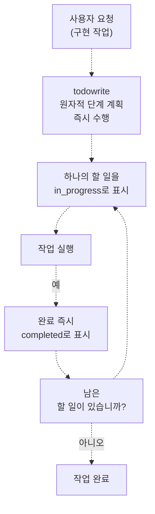
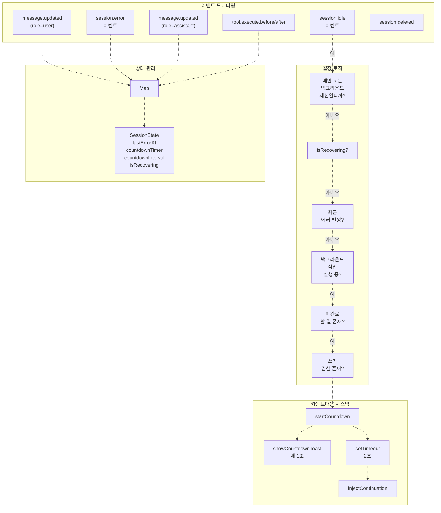
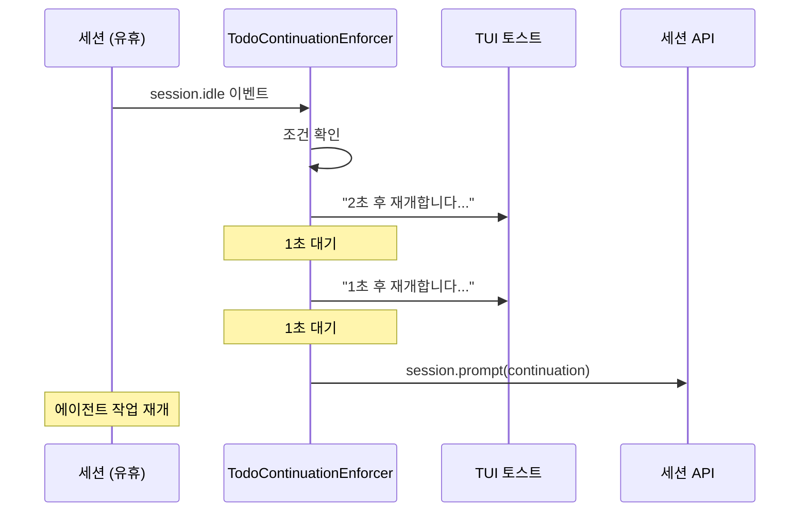
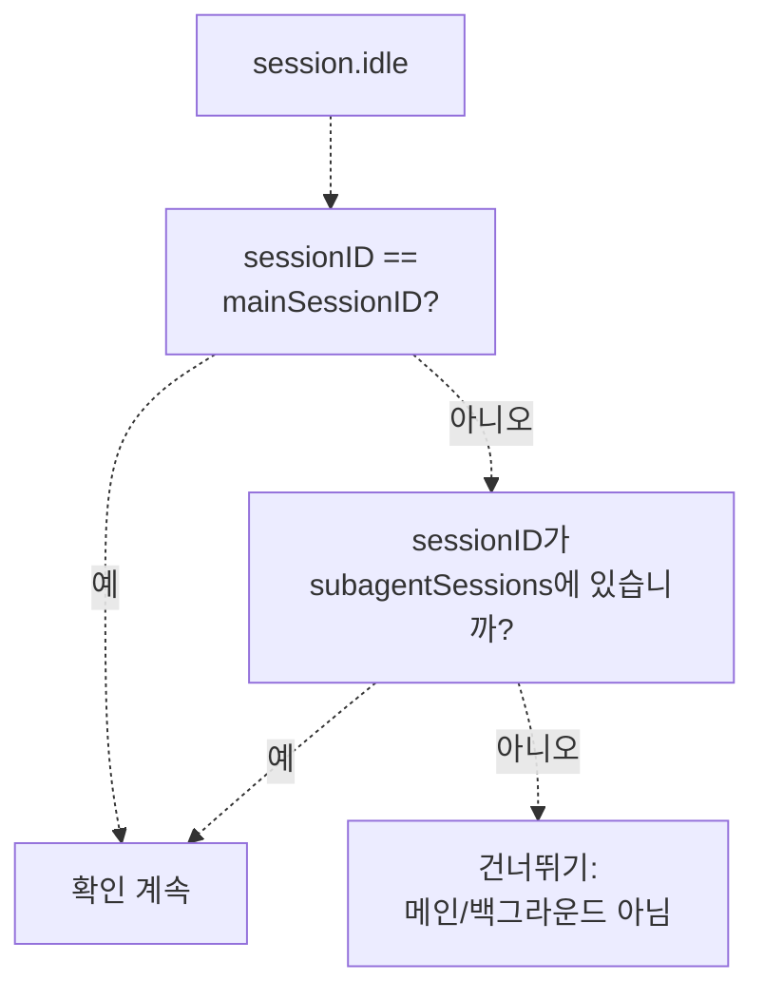

# 할 일 관리 (Todo Management)

> **관련 소스 파일**
> * [.github/assets/sisyphus.png](https://github.com/code-yeongyu/oh-my-opencode/blob/b92cd6ab/.github/assets/sisyphus.png)
> * [src/agents/index.ts](https://github.com/code-yeongyu/oh-my-opencode/blob/b92cd6ab/src/agents/index.ts)
> * [src/agents/sisyphus.ts](https://github.com/code-yeongyu/oh-my-opencode/blob/b92cd6ab/src/agents/sisyphus.ts)
> * [src/agents/types.ts](https://github.com/code-yeongyu/oh-my-opencode/blob/b92cd6ab/src/agents/types.ts)
> * [src/agents/utils.test.ts](https://github.com/code-yeongyu/oh-my-opencode/blob/b92cd6ab/src/agents/utils.test.ts)
> * [src/agents/utils.ts](https://github.com/code-yeongyu/oh-my-opencode/blob/b92cd6ab/src/agents/utils.ts)
> * [src/hooks/non-interactive-env/constants.ts](https://github.com/code-yeongyu/oh-my-opencode/blob/b92cd6ab/src/hooks/non-interactive-env/constants.ts)
> * [src/hooks/non-interactive-env/detector.ts](https://github.com/code-yeongyu/oh-my-opencode/blob/b92cd6ab/src/hooks/non-interactive-env/detector.ts)
> * [src/hooks/non-interactive-env/index.ts](https://github.com/code-yeongyu/oh-my-opencode/blob/b92cd6ab/src/hooks/non-interactive-env/index.ts)
> * [src/hooks/non-interactive-env/types.ts](https://github.com/code-yeongyu/oh-my-opencode/blob/b92cd6ab/src/hooks/non-interactive-env/types.ts)
> * [src/hooks/todo-continuation-enforcer.test.ts](https://github.com/code-yeongyu/oh-my-opencode/blob/b92cd6ab/src/hooks/todo-continuation-enforcer.test.ts)
> * [src/hooks/todo-continuation-enforcer.ts](https://github.com/code-yeongyu/oh-my-opencode/blob/b92cd6ab/src/hooks/todo-continuation-enforcer.ts)

할 일 관리(Todo management) 시스템은 여러 단계로 구성된 작업을 처리하기 위한 Sisyphus의 주요 조정 메커니즘입니다. 이 시스템은 명시적인 작업 계획, 실시간 진행 상황 추적, 그리고 작업이 미완료 상태로 남았을 때의 자동 연속 실행을 강제합니다. 이 시스템은 Sisyphus 프롬프트의 필수 워크플로우 규칙과, 세션 상태를 모니터링하여 에이전트가 대기 중인 작업을 남겨두고 중단될 때 연속 실행 프롬프트를 주입하는 자동 연속 실행 엔포서(continuation enforcer) 훅을 결합합니다.

구현을 포함한 Sisyphus의 전체 워크플로우 단계에 대해서는 [워크플로우 단계(Workflow Phases)](/code-yeongyu/oh-my-opencode/4.1.1-workflow-phases)를 참조하십시오. 할 일을 통한 세션 복구 조정에 대해서는 [세션 복구(Session Recovery)](/code-yeongyu/oh-my-opencode/7.1-session-recovery)를 참조하십시오.

## 필수 할 일 규칙 (Mandatory Todo Rules)

Sisyphus는 사소하지 않은 모든 작업에 대해 할 일을 생성하는 것을 **기본 동작(default behavior)**으로 하도록 프로그래밍되어 있습니다. 이는 엄격한 시스템 프롬프트 지침을 통해 강제되며 런타임 모니터링에 의해 보완됩니다.

### 할 일이 필요한 경우

| 트리거 | 필수 조치 | 근거 |
| --- | --- | --- |
| 다단계 작업 (2단계 이상) | 항상 할 일을 먼저 생성 | 진행 상황에 대한 사용자 가시성 확보 |
| 불확실한 범위 | 항상 할 일을 생성 | 할 일을 통해 사고를 명확히 함 |
| 여러 항목이 포함된 사용자 요청 | 항상 할 일을 생성 | 항목 누락 방지 |
| 복잡한 단일 작업 | 단계를 나누기 위해 할 일 생성 | 진행 상황을 추적 가능하게 만듦 |

**예외**: 할 일은 사용자가 명시적으로 구현 작업을 요청할 때만 생성됩니다. Sisyphus는 구현이 요청되지 않은 탐색 또는 조사 전용 작업에 대해서는 할 일을 생성하지 않습니다.

출처: [src/agents/sisyphus.ts L398-L420](https://github.com/code-yeongyu/oh-my-opencode/blob/b92cd6ab/src/agents/sisyphus.ts#L398-L420)

### 워크플로우 시퀀스

할 일 워크플로우는 타협의 여지가 없으며 다음 시퀀스를 정확히 따릅니다:



**주요 규칙**:

1. **즉시(IMMEDIATELY)**: 작업을 시작한 후가 아니라 시작하기 전에 할 일을 생성합니다.
2. **한 번에 하나씩(ONE at a time)**: 어느 순간에도 하나의 할 일만 `in_progress` 상태일 수 있습니다.
3. **일괄 처리 금지(NEVER batch)**: 각 할 일은 완료되는 즉시 `completed`로 표시해야 하며, 모아서 처리하지 않습니다.
4. **동적 업데이트**: 범위가 변경되면 진행하기 전에 할 일을 업데이트합니다.

출처: [src/agents/sisyphus.ts L412-L419](https://github.com/code-yeongyu/oh-my-opencode/blob/b92cd6ab/src/agents/sisyphus.ts#L412-L419)

### 이것이 타협 불가능한 이유

| 이점 | 구현 방식 |
| --- | --- |
| **사용자 가시성** | 사용자는 블랙박스가 아닌 할 일 목록을 통해 실시간 진행 상황을 확인 |
| **이탈 방지** | 할 일은 Sisyphus가 실제 요청에 집중하도록 고정하는 역할 수행 |
| **복구** | 중단된 경우, 할 일을 통해 원활한 연속 실행 가능 |
| **책임감** | 각 할 일은 명시적인 약속임 |

시스템 프롬프트에는 다음과 같이 명시되어 있습니다: **"사소하지 않은 작업에서 할 일을 사용하지 않는 것은 미완료 작업으로 간주됨(FAILURE TO USE TODOS ON NON-TRIVIAL TASKS = INCOMPLETE WORK)."**

출처: [src/agents/sisyphus.ts L420-L426](https://github.com/code-yeongyu/oh-my-opencode/blob/b92cd6ab/src/agents/sisyphus.ts#L420-L426)

## 자동 연속 실행 시스템 (Automatic Continuation System)

`createTodoContinuationEnforcer` 함수는 세션 수명 주기 이벤트를 모니터링하고, Sisyphus가 미완료된 할 일을 남겨두고 중단될 때 자동으로 연속 실행 프롬프트를 주입합니다.

### 아키텍처



출처: [src/hooks/todo-continuation-enforcer.ts L89-L377](https://github.com/code-yeongyu/oh-my-opencode/blob/b92cd6ab/src/hooks/todo-continuation-enforcer.ts#L89-L377)

### 연속 실행 프롬프트 (Continuation Prompt)

조건이 충족되면 엔포서는 `ctx.client.session.prompt()`를 통해 다음 프롬프트를 주입합니다:

```
[시스템 알림 - 할 일 연속 실행]

할 일 목록에 미완료된 작업이 남아 있습니다. 다음 대기 중인 작업을 계속 진행하십시오.

- 허가를 구하지 말고 진행하십시오.
- 각 작업이 끝나면 완료로 표시하십시오.
- 모든 작업이 끝날 때까지 멈추지 마십시오.

[상태: X/Y 완료, Z개 남음]
```

프롬프트는 이전에 활성화되었던 에이전트(메시지 저장소에서 검색됨)와 동일한 에이전트로 주입되어 에이전트 컨텍스트를 유지합니다.

출처: [src/hooks/todo-continuation-enforcer.ts L38-L44](https://github.com/code-yeongyu/oh-my-opencode/blob/b92cd6ab/src/hooks/todo-continuation-enforcer.ts#L38-L44)

 [src/hooks/todo-continuation-enforcer.ts L204-L221](https://github.com/code-yeongyu/oh-my-opencode/blob/b92cd6ab/src/hooks/todo-continuation-enforcer.ts#L204-L221)

### 카운트다운 메커니즘

미완료된 할 일이 있는 상태에서 `session.idle`이 발생하면:

1. **카운트다운 시작**: 2초 타이머가 시작됩니다.
2. **토스트 알림**: UI 토스트가 매초 업데이트되며 "Xs 후 재개합니다... (N개의 작업 남음)"을 표시합니다.
3. **취소 지점**: 모든 활동(사용자 입력, 에이전트 응답, 도구 실행)은 카운트다운을 취소합니다.
4. **주입**: 2초간 유휴 상태가 유지되면 연속 실행 프롬프트가 주입됩니다.



상수:

* `COUNTDOWN_SECONDS = 2`
* `TOAST_DURATION_MS = 900`
* `ERROR_COOLDOWN_MS = 3000`

출처: [src/hooks/todo-continuation-enforcer.ts L46-L48](https://github.com/code-yeongyu/oh-my-opencode/blob/b92cd6ab/src/hooks/todo-continuation-enforcer.ts#L46-L48)

 [src/hooks/todo-continuation-enforcer.ts L224-L244](https://github.com/code-yeongyu/oh-my-opencode/blob/b92cd6ab/src/hooks/todo-continuation-enforcer.ts#L224-L244)

## 건너뛰기 조건 및 가드 (Skip Conditions and Guards)

연속 실행 엔포서는 부적절한 주입을 방지하기 위해 여러 가드(guard)를 구현합니다.

### 세션 유형 필터링



다음 두 가지 세션 유형만 연속 실행을 수신합니다:

1. **메인 세션(Main session)**: 사용자가 직접 대면하는 기본 세션 (`setMainSession`을 통해 설정됨)
2. **백그라운드 작업 세션(Background task sessions)**: 서브 에이전트 세션 (`subagentSessions`에서 추적됨)

관련 없는 작업을 방해하지 않도록 그 외의 모든 세션은 건너뜁니다.

출처: [src/hooks/todo-continuation-enforcer.ts L261-L274](https://github.com/code-yeongyu/oh-my-opencode/blob/b92cd6ab/src/hooks/todo-continuation-enforcer.ts#L261-L274)

### 복구 모드 조정 (Recovery Mode Coordination)

```javascript
interface SessionState {
  lastErrorAt?: number
  countdownTimer?: ReturnType<typeof setTimeout>
  countdownInterval?: ReturnType<typeof setInterval>
  isRecovering?: boolean
}
```

`isRecovering` 플래그는 세션 복구 시스템에 의해 제어됩니다:

* `markRecovering(sessionID)`: 플래그를 설정하고 대기 중인 카운트다운을 취소합니다.
* `markRecoveryComplete(sessionID)`: 플래그를 해제하여 향후 주입을 허용합니다.

이를 통해 할 일 연속 실행이 에러 복구 워크플로우를 방해하는 것을 방지합니다.

출처: [src/hooks/todo-continuation-enforcer.ts L31-L36](https://github.com/code-yeongyu/oh-my-opencode/blob/b92cd6ab/src/hooks/todo-continuation-enforcer.ts#L31-L36)

 [src/hooks/todo-continuation-enforcer.ts L124-L137](https://github.com/code-yeongyu/oh-my-opencode/blob/b92cd6ab/src/hooks/todo-continuation-enforcer.ts#L124-L137)

### 전체 건너뛰기 조건 표

| 조건 | 확인 사항 | 건너뛰기 이유 |
| --- | --- | --- |
| 세션 유형 | 메인 또는 백그라운드 작업이 아님 | 관련 없는 세션 방해 방지 |
| 복구 모드 | `state.isRecovering === true` | 복구 시스템이 먼저 완료되도록 함 |
| 최근 에러 | 3초 이내에 `lastErrorAt` 발생 | 에러 쿨다운 기간 |
| 백그라운드 작업 | `backgroundManager.getTasksByParentSession()`에 실행 중인 작업 있음 | 비동기 작업이 완료될 때까지 대기 |
| 할 일 없음 | `todos.length === 0` | 계속할 작업이 없음 |
| 모두 완료 | 모든 할 일이 `completed` 또는 `cancelled` 상태임 | 작업이 완료됨 |
| 쓰기 권한 없음 | `prevMessage.tools.write === false` | 에러 에이전트가 코드를 수정할 수 없음 |
| 계획 모드 에러 | 에이전트가 `"plan"` 또는 `"planner-sisyphus"`임 | 계획 에이전트는 구현을 수행하지 않음 |

출처: [src/hooks/todo-continuation-enforcer.ts L150-L221](https://github.com/code-yeongyu/oh-my-opencode/blob/b92cd6ab/src/hooks/todo-continuation-enforcer.ts#L150-L221)

 [src/hooks/todo-continuation-enforcer.ts L276-L317](https://github.com/code-yeongyu/oh-my-opencode/blob/b92cd6ab/src/hooks/todo-continuation-enforcer.ts#L276-L317)

### 에러 쿨다운 메커니즘 (Error Cooldown Mechanism)


`session.error`가 발생하면:

1. `state.lastErrorAt = Date.now()`를 설정합니다.
2. 대기 중인 카운트다운을 취소합니다.
3. 3000ms 동안 주입을 건너뜁니다.
4. 사용자 메시지는 즉시 쿨다운을 해제합니다.

이는 API 에러나 중단 발생 후 연속 실행 시도가 연달아 발생하는 것을 방지합니다.

출처: [src/hooks/todo-continuation-enforcer.ts L158-L161](https://github.com/code-yeongyu/oh-my-opencode/blob/b92cd6ab/src/hooks/todo-continuation-enforcer.ts#L158-L161)

 [src/hooks/todo-continuation-enforcer.ts L249-L259](https://github.com/code-yeongyu/oh-my-opencode/blob/b92cd6ab/src/hooks/todo-continuation-enforcer.ts#L249-L259)

 [src/hooks/todo-continuation-enforcer.ts L328-L335](https://github.com/code-yeongyu/oh-my-opencode/blob/b92cd6ab/src/hooks/todo-continuation-enforcer.ts#L328-L335)

## 취소 이벤트 (Cancellation Events)

여러 유형의 이벤트가 활성화된 카운트다운을 취소할 수 있습니다:

### 취소 이벤트 표

| 이벤트 유형 | 역할/조건 | 조치 | 근거 |
| --- | --- | --- | --- |
| `message.updated` | `role === "user"` | 카운트다운 취소, `lastErrorAt` 초기화 | 사용자가 활발히 참여 중임 |
| `message.updated` | `role === "assistant"` | 카운트다운 취소 | 에이전트가 이미 응답 중임 |
| `message.part.updated` | `role === "assistant"` | 카운트다운 취소 | 스트리밍 응답이 시작됨 |
| `tool.execute.before` | 모든 도구 | 카운트다운 취소 | 에이전트가 작업 중임 |
| `tool.execute.after` | 모든 도구 | 카운트다운 취소 | 도구 실행이 활성화됨 |
| `session.deleted` | 세션 ID 일치 | 카운트다운 취소, 상태 정리 | 세션이 더 이상 존재하지 않음 |

`cancelCountdown` 함수는 두 가지 타이머 유형을 모두 해제합니다:

* `clearTimeout(state.countdownTimer)` - 주입을 중단합니다.
* `clearInterval(state.countdownInterval)` - 토스트 업데이트를 중단합니다.

출처: [src/hooks/todo-continuation-enforcer.ts L105-L117](https://github.com/code-yeongyu/oh-my-opencode/blob/b92cd6ab/src/hooks/todo-continuation-enforcer.ts#L105-L117)

 [src/hooks/todo-continuation-enforcer.ts L321-L369](https://github.com/code-yeongyu/oh-my-opencode/blob/b92cd6ab/src/hooks/todo-continuation-enforcer.ts#L321-L369)

## 쓰기 권한 확인 (Write Permission Check)

엔포서는 읽기 전용 컨텍스트에서 연속 실행이 발생하는 것을 방지하기 위해 도구 제한 사항을 준수합니다:

```javascript
const messageDir = getMessageDir(sessionID)
const prevMessage = messageDir ? findNearestMessageWithFields(messageDir) : null

const hasWritePermission = !prevMessage?.tools || 
  (prevMessage.tools.write !== false && prevMessage.tools.edit !== false)

if (!hasWritePermission) {
  log(`Skipped: agent lacks write permission`, { sessionID, agent: prevMessage?.agent })
  return
}
```

이 코드는 가장 최근 메시지의 도구 구성을 확인합니다. `write` 또는 `edit` 도구가 명시적으로 비활성화된 경우(예: Oracle 또는 Librarian), 해당 에이전트는 변경 사항을 구현할 수 없으므로 연속 실행을 건너뜁니다.

출처: [src/hooks/todo-continuation-enforcer.ts L187-L196](https://github.com/code-yeongyu/oh-my-opencode/blob/b92cd6ab/src/hooks/todo-continuation-enforcer.ts#L187-L196)

## 백그라운드 매니저와의 통합 (Integration with Background Manager)

엔포서는 병렬 에이전트 작업을 방해하지 않기 위해 `BackgroundManager`와 협력합니다:

```javascript
const hasRunningBgTasks = backgroundManager
  ? backgroundManager.getTasksByParentSession(sessionID).some(t => t.status === "running")
  : false

if (hasRunningBgTasks) {
  log(`Skipped injection: background tasks running`, { sessionID })
  return
}
```

Sisyphus가 `background_task`를 통해 `explore` 또는 `librarian` 에이전트에게 작업을 위임한 경우, 연속 실행 엔포서는 비동기 조사가 진행되는 동안 조기 주입을 방지하기 위해 해당 작업들이 완료될 때까지 기다립니다.

출처: [src/hooks/todo-continuation-enforcer.ts L163-L170](https://github.com/code-yeongyu/oh-my-opencode/blob/b92cd6ab/src/hooks/todo-continuation-enforcer.ts#L163-L170)

 [src/hooks/todo-continuation-enforcer.ts L288-L295](https://github.com/code-yeongyu/oh-my-opencode/blob/b92cd6ab/src/hooks/todo-continuation-enforcer.ts#L288-L295)

## 안티 패턴 및 위반 사항 (Anti-Patterns and Violations)

시스템 프롬프트에는 차단 대상이 되는 위반 사항이 명시되어 있습니다:

| 위반 사항 | 나쁜 이유 | 시스템 반응 |
| --- | --- | --- |
| 다단계 작업에서 할 일 건너뛰기 | 사용자 가시성 상실, 단계 망각 발생 | 미완료 작업으로 표시됨 |
| 여러 할 일을 일괄 완료 처리 | 실시간 추적 목적에 어긋남 | 연속 실행 엔포서가 재트리거될 수 있음 |
| `in_progress` 표시 없이 진행 | 무엇을 작업 중인지 알 수 없음 | 상태에 대한 사용자 혼란 야기 |
| 할 일을 완료하지 않고 종료 | 사용자에게 작업이 미완료된 것으로 보임 | 연속 실행 엔포서가 자동 주입됨 |

연속 실행 엔포서는 안전망 역할을 합니다. Sisyphus가 이러한 규칙을 위반하고 미완료된 할 일을 남긴 채 중단하면, 시스템은 2초 후에 자동으로 에이전트를 다시 참여시킵니다.

출처: [src/agents/sisyphus.ts L427-L436](https://github.com/code-yeongyu/oh-my-opencode/blob/b92cd6ab/src/agents/sisyphus.ts#L427-L436)

## 테스트 전략 (Testing Strategy)

`todo-continuation-enforcer.test.ts`의 테스트 스위트는 모든 건너뛰기 조건과 타이밍을 검증합니다:

주요 테스트 시나리오:

* 미완료된 할 일이 있을 때 2초 카운트다운 후 주입 발생
* 모든 할 일이 완료되었을 때 건너뛰기
* 백그라운드 작업이 실행 중일 때 건너뛰기
* 메인 세션이 아닌 경우 건너뛰기 (백그라운드 작업 세션 제외)
* 에러 쿨다운이 즉각적인 재주입 방지
* 사용자 메시지가 에러 상태를 해제하고 주입 허용
* 사용자/에이전트 활동 시 카운트다운 취소
* 복구 모드에서 주입 차단
* 세션 삭제 시 정리 작업 트리거
* 카운트다운 중 토스트 업데이트 표시
* 연속된 주입 사이의 스로틀링 없음 (구현에서 제거됨)

테스트는 실제 API 호출 없이 다양한 시나리오를 시뮬레이션하기 위해 `PluginInput` 및 `BackgroundManager`의 모의(mock) 구현을 사용합니다.

출처: [src/hooks/todo-continuation-enforcer.test.ts L1-L404](https://github.com/code-yeongyu/oh-my-opencode/blob/b92cd6ab/src/hooks/todo-continuation-enforcer.test.ts#L1-L404)