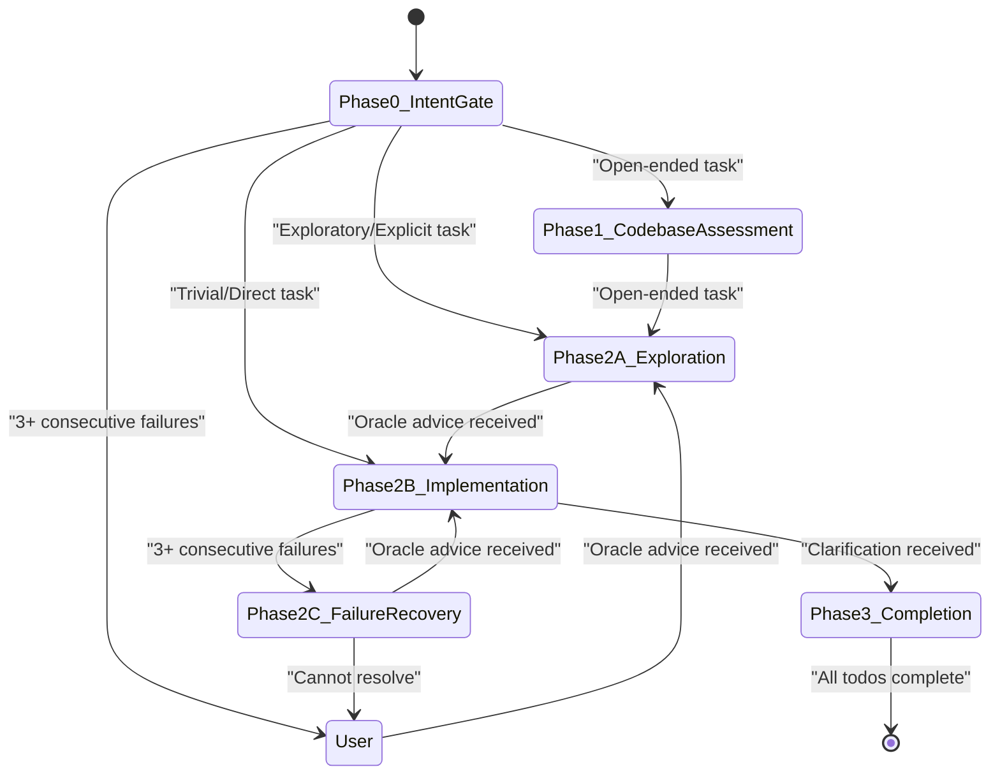
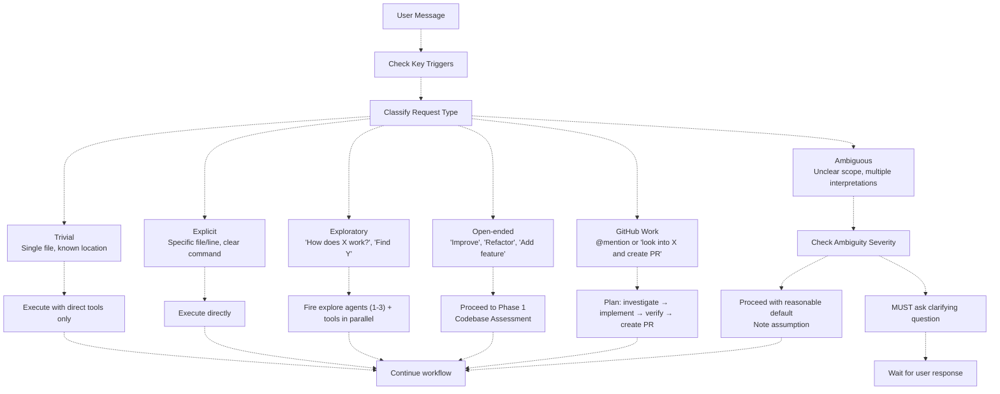
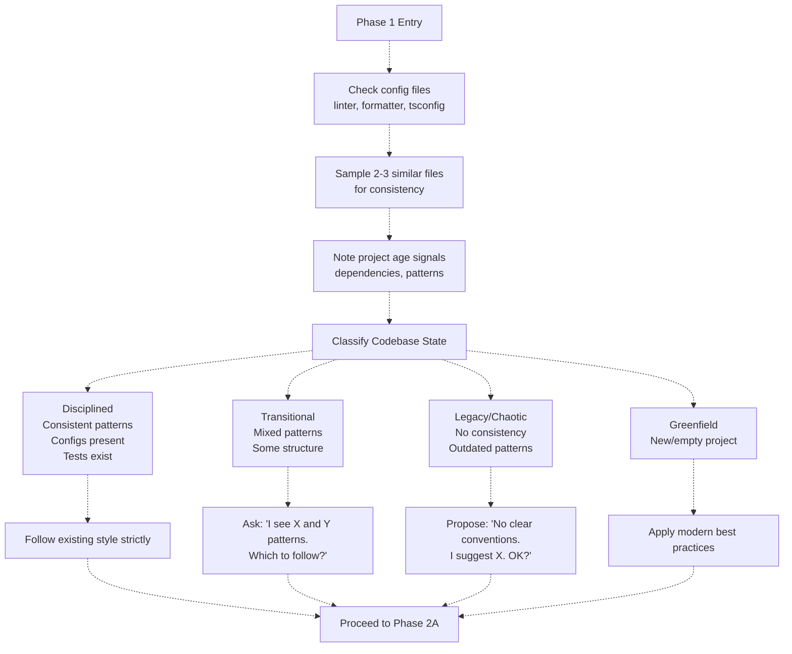
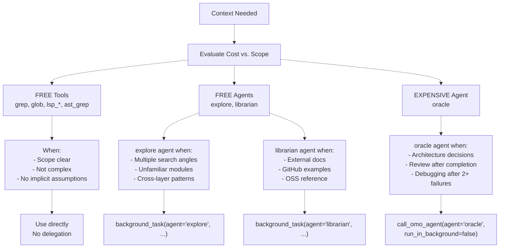
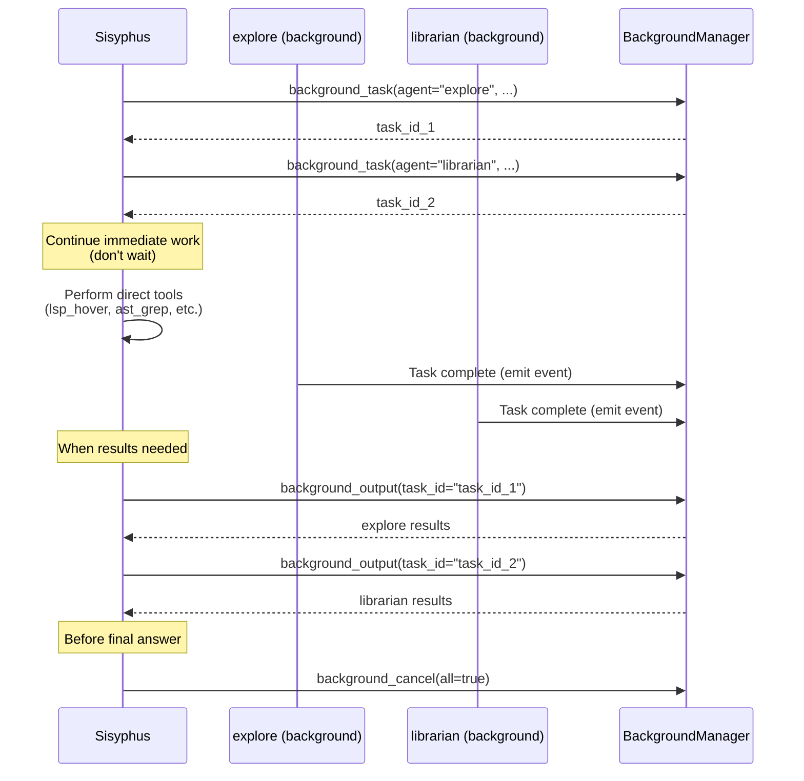
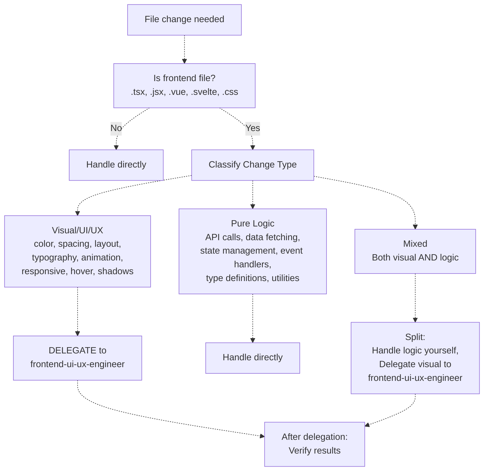
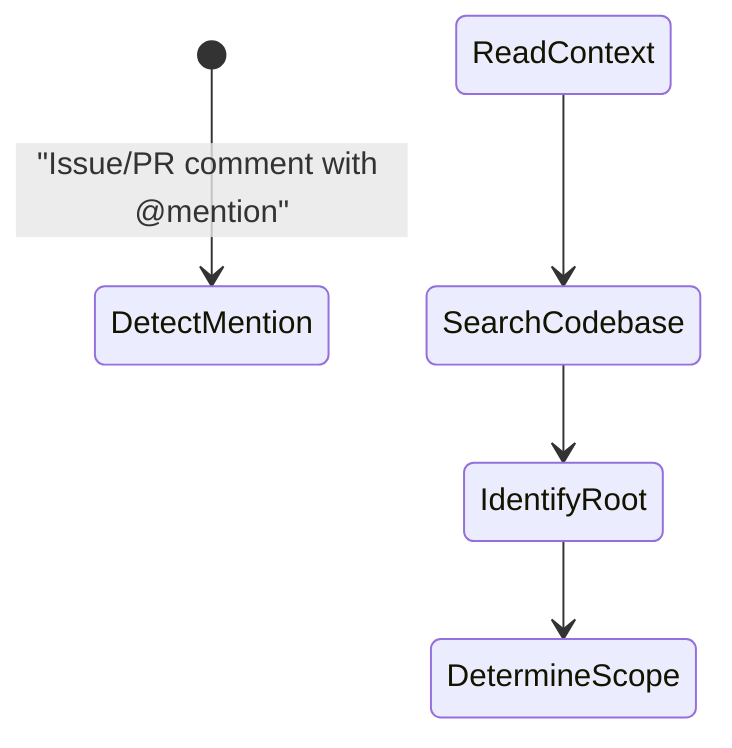
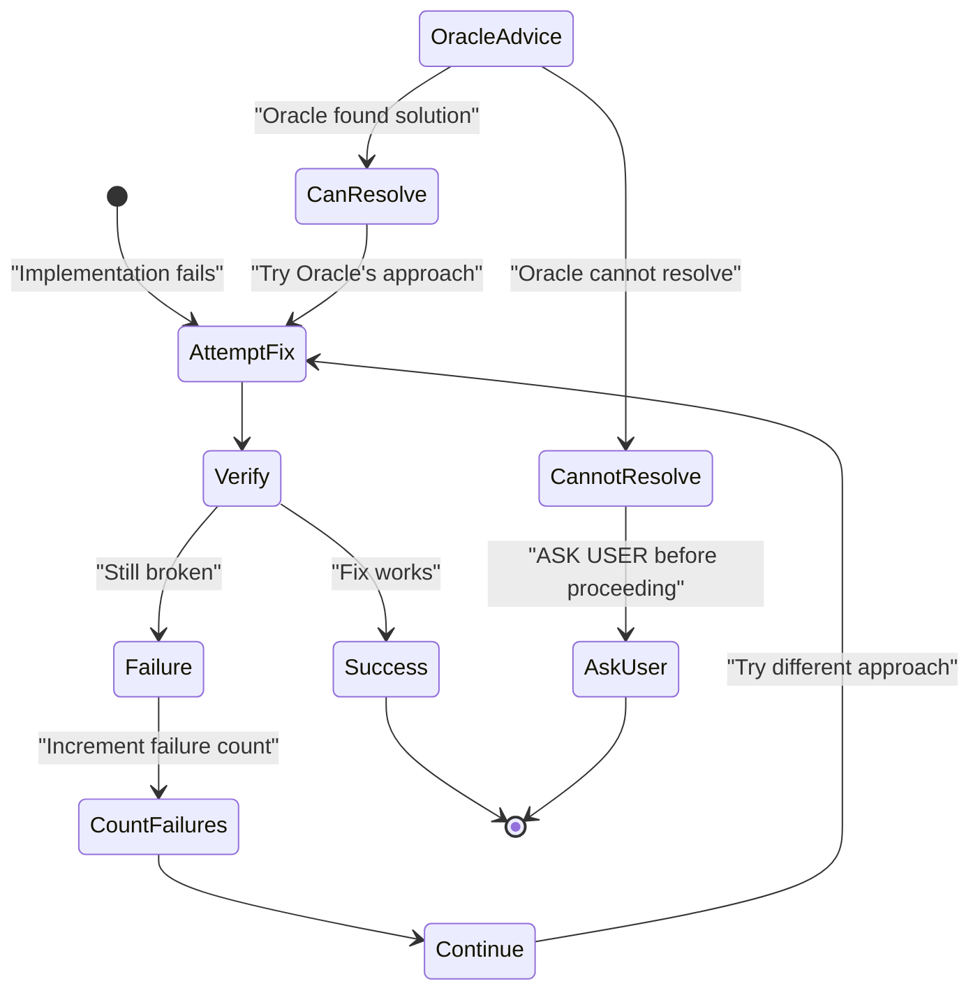
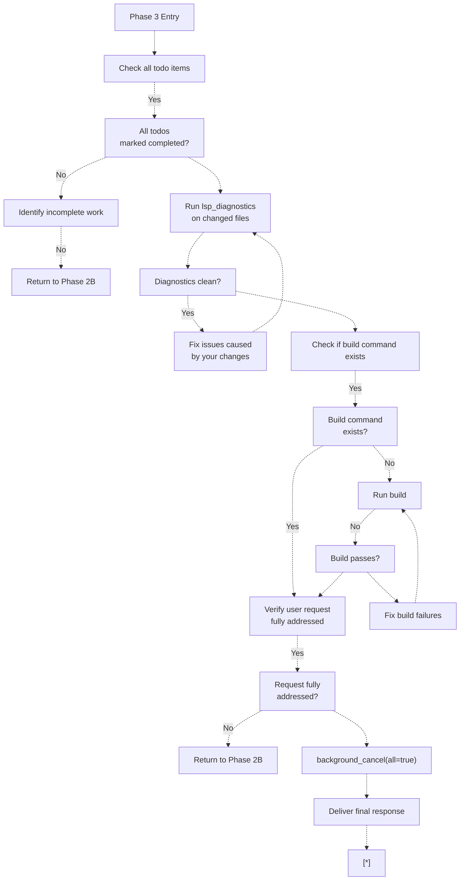

# Workflow Phases

> **Relevant source files**
> * [.github/assets/sisyphus.png](https://github.com/code-yeongyu/oh-my-opencode/blob/b92cd6ab/.github/assets/sisyphus.png)
> * [src/agents/index.ts](https://github.com/code-yeongyu/oh-my-opencode/blob/b92cd6ab/src/agents/index.ts)
> * [src/agents/sisyphus.ts](https://github.com/code-yeongyu/oh-my-opencode/blob/b92cd6ab/src/agents/sisyphus.ts)
> * [src/agents/types.ts](https://github.com/code-yeongyu/oh-my-opencode/blob/b92cd6ab/src/agents/types.ts)
> * [src/agents/utils.test.ts](https://github.com/code-yeongyu/oh-my-opencode/blob/b92cd6ab/src/agents/utils.test.ts)
> * [src/agents/utils.ts](https://github.com/code-yeongyu/oh-my-opencode/blob/b92cd6ab/src/agents/utils.ts)

## Purpose and Scope

This document details the six-phase workflow that the Sisyphus orchestrator follows when processing user requests. Each phase serves a specific purpose in ensuring systematic task handling, from initial classification through completion and verification.

For information about Sisyphus's role as primary orchestrator and delegation strategy, see [Sisyphus Orchestrator](/code-yeongyu/oh-my-opencode/4.1-sisyphus-orchestrator). For details on todo management mechanisms, see [Todo Management](/code-yeongyu/oh-my-opencode/4.1.2-todo-management). For information on specialized agent capabilities, see [Specialized Agents](/code-yeongyu/oh-my-opencode/4.2-specialized-agents).

## Workflow Overview

Sisyphus executes a structured, state-based workflow with six distinct phases. Each phase has specific entry conditions, execution rules, and exit criteria that determine progression through the workflow.

### Phase Transitions



**Phase Transition Diagram**

Sources: [src/agents/sisyphus.ts L28-L365](https://github.com/code-yeongyu/oh-my-opencode/blob/b92cd6ab/src/agents/sisyphus.ts#L28-L365)

The workflow is non-linear: Phase 2B can loop internally (multi-step implementation), transition to Phase 2C (failure handling), or jump directly to Phase 3 (completion). Phase 0 runs on every user message to reclassify intent.

## Phase 0: Intent Gate

**Purpose**: Classify request type and validate clarity before executing any actions.

**Execution Frequency**: Runs on EVERY user message, not just initial requests.

### Key Trigger Detection

Before classification, Sisyphus scans for specific patterns that activate immediate background delegation:

| Trigger Pattern | Action | Agent | Reason |
| --- | --- | --- | --- |
| External library/source mentioned | Fire `background_task(agent="librarian")` | `librarian` | External documentation lookup needed |
| 2+ modules involved | Fire `background_task(agent="explore")` | `explore` | Multi-angle code search required |
| `@mention` in GitHub issue/PR | Plan full work cycle | N/A | This is a WORK REQUEST, not just query |
| "look into" + "create PR" | Plan full implementation cycle | N/A | Complete implementation expected, not analysis |

Sources: [src/agents/sisyphus.ts L30-L34](https://github.com/code-yeongyu/oh-my-opencode/blob/b92cd6ab/src/agents/sisyphus.ts#L30-L34)

### Request Type Classification



**Request Classification Decision Tree**

Sources: [src/agents/sisyphus.ts L36-L55](https://github.com/code-yeongyu/oh-my-opencode/blob/b92cd6ab/src/agents/sisyphus.ts#L36-L55)

### Ambiguity Protocol

| Situation | Action |
| --- | --- |
| Single valid interpretation | Proceed immediately |
| Multiple interpretations, similar effort | Proceed with reasonable default, document assumption |
| Multiple interpretations, 2x+ effort difference | **MUST ask** clarifying question |
| Missing critical info (file, error, context) | **MUST ask** |
| User's design seems flawed | **MUST raise concern** before implementing |

Sources: [src/agents/sisyphus.ts L47-L55](https://github.com/code-yeongyu/oh-my-opencode/blob/b92cd6ab/src/agents/sisyphus.ts#L47-L55)

### Validation Checklist

Before Phase 0 exits, Sisyphus validates:

1. **Implicit Assumptions**: Are there any unstated assumptions that might affect outcome?
2. **Search Scope**: Is the scope clear, or does it need definition?
3. **Tool/Agent Selection**: What tools/agents can satisfy this request? * Available tools inventory check * Leverage strategy (background tasks, parallel calls, LSP tools)

Sources: [src/agents/sisyphus.ts L57-L66](https://github.com/code-yeongyu/oh-my-opencode/blob/b92cd6ab/src/agents/sisyphus.ts#L57-L66)

### User Challenge Protocol

When problematic design decisions are detected, Sisyphus follows this template:

```yaml
I notice [observation]. This might cause [problem] because [reason].
Alternative: [your suggestion].
Should I proceed with your original request, or try the alternative?
```

**Triggers for challenge**:

* Design decision causing obvious problems
* Approach contradicting established codebase patterns
* Request misunderstanding existing code behavior

Sources: [src/agents/sisyphus.ts L69-L81](https://github.com/code-yeongyu/oh-my-opencode/blob/b92cd6ab/src/agents/sisyphus.ts#L69-L81)

## Phase 1: Codebase Assessment

**Purpose**: Determine codebase maturity level to inform pattern-following strategy.

**Entry Condition**: Request classified as "Open-ended" in Phase 0.

### Quick Assessment Process



**Codebase State Classification Flow**

Sources: [src/agents/sisyphus.ts L85-L107](https://github.com/code-yeongyu/oh-my-opencode/blob/b92cd6ab/src/agents/sisyphus.ts#L85-L107)

### State Classification Matrix

| State | Signals | Sisyphus Behavior |
| --- | --- | --- |
| **Disciplined** | Consistent patterns, configs present (`.eslintrc`, `tsconfig.json`), tests exist | Follow existing style strictly, no questions |
| **Transitional** | Mixed patterns (some TypeScript, some JavaScript), some structure | Ask: "I see X and Y patterns. Which to follow?" |
| **Legacy/Chaotic** | No consistency, outdated patterns, missing configs | Propose: "No clear conventions. I suggest [X]. OK?" |
| **Greenfield** | New/empty project, minimal files | Apply modern best practices without asking |

Sources: [src/agents/sisyphus.ts L94-L101](https://github.com/code-yeongyu/oh-my-opencode/blob/b92cd6ab/src/agents/sisyphus.ts#L94-L101)

### Verification Before Assumption

If codebase appears undisciplined, Sisyphus verifies:

* Different patterns may serve different purposes (intentional diversity)
* Migration might be in progress (transitional state)
* Wrong reference files might have been sampled

Sources: [src/agents/sisyphus.ts L103-L106](https://github.com/code-yeongyu/oh-my-opencode/blob/b92cd6ab/src/agents/sisyphus.ts#L103-L106)

## Phase 2A: Exploration & Research

**Purpose**: Gather necessary context using optimal tool/agent combinations before implementation.

**Entry Condition**: Non-trivial task requiring context discovery.

### Tool Selection Cost Matrix



**Tool Selection Decision Tree by Cost**

Sources: [src/agents/sisyphus.ts L110-L120](https://github.com/code-yeongyu/oh-my-opencode/blob/b92cd6ab/src/agents/sisyphus.ts#L110-L120)

### Explore vs. Librarian: Contextual Grep vs. Reference Grep

| Dimension | `explore` Agent (Contextual Grep) | `librarian` Agent (Reference Grep) |
| --- | --- | --- |
| **Search Target** | Internal codebase (THIS repo) | External resources (OTHER repos, docs) |
| **Use Case** | Find patterns in project code | Official API documentation |
| **Example Query** | "How does our auth work?" | "How do I use JWT with Express?" |
| **Purpose** | Project-specific logic | Library best practices & quirks |
| **Tool Access** | `lsp_*`, `ast_grep`, `grep_app` | `context7`, `websearch_exa`, `grep_app` |

**Trigger phrases for `librarian`**:

* "How do I use [library]?"
* "What's the best practice for [framework feature]?"
* "Why does [external dependency] behave this way?"
* "Find examples of [library] usage"
* Working with unfamiliar npm/pip/cargo packages

Sources: [src/agents/sisyphus.ts L123-L151](https://github.com/code-yeongyu/oh-my-opencode/blob/b92cd6ab/src/agents/sisyphus.ts#L123-L151)

### Parallel Execution Pattern

**Default behavior**: `explore` and `librarian` always execute in background, never blocking.

```
// CORRECT: Always background, always parallel
background_task(agent="explore", prompt="Find auth implementations in our codebase...")
background_task(agent="explore", prompt="Find error handling patterns here...")
background_task(agent="librarian", prompt="Find JWT best practices in official docs...")
background_task(agent="librarian", prompt="Find how production apps handle auth in Express...")
// Continue working immediately. Collect with background_output when needed.

// WRONG: Sequential or blocking
result = call_omo_agent(agent="explore", run_in_background=false)  // NEVER do this
```

Sources: [src/agents/sisyphus.ts L153-L169](https://github.com/code-yeongyu/oh-my-opencode/blob/b92cd6ab/src/agents/sisyphus.ts#L153-L169)

### Background Result Collection Flow



**Parallel Background Execution Sequence**

Sources: [src/agents/sisyphus.ts L171-L176](https://github.com/code-yeongyu/oh-my-opencode/blob/b92cd6ab/src/agents/sisyphus.ts#L171-L176)

### Search Stop Conditions

Stop searching when:

* Enough context to proceed confidently
* Same information appearing across multiple sources
* 2 search iterations yielded no new useful data
* Direct answer found

**Anti-pattern**: Over-exploration. Time is precious.

Sources: [src/agents/sisyphus.ts L177-L185](https://github.com/code-yeongyu/oh-my-opencode/blob/b92cd6ab/src/agents/sisyphus.ts#L177-L185)

## Phase 2B: Implementation

**Purpose**: Execute planned changes with systematic todo tracking and strategic delegation.

**Entry Condition**: Sufficient context gathered, implementation ready to begin.

### Pre-Implementation Protocol

1. **Todo Creation**: If task has 2+ steps → Create todo list IMMEDIATELY with `todowrite`. Super detailed, no announcements.
2. **Mark `in_progress`**: Before starting each step
3. **Mark `completed`**: As soon as step done (NEVER batch complete)

Sources: [src/agents/sisyphus.ts L192-L194](https://github.com/code-yeongyu/oh-my-opencode/blob/b92cd6ab/src/agents/sisyphus.ts#L192-L194)

### Frontend File Decision Gate



**Frontend File Classification Decision Tree**

Sources: [src/agents/sisyphus.ts L196-L228](https://github.com/code-yeongyu/oh-my-opencode/blob/b92cd6ab/src/agents/sisyphus.ts#L196-L228)

#### Classification Matrix

| Change Type | Examples | Action |
| --- | --- | --- |
| **Visual/UI/UX** | Color, spacing, layout, typography, animation, responsive breakpoints, hover states, shadows, borders, icons, images | **DELEGATE** to `frontend-ui-ux-engineer` |
| **Pure Logic** | API calls, data fetching, state management, event handlers (non-visual), type definitions, utility functions, business logic | **CAN handle directly** |
| **Mixed** | Component changes both visual AND logic | **Split**: handle logic yourself, delegate visual to `frontend-ui-ux-engineer` |

**Decision Heuristic**: "Is this change about **how it LOOKS** or **how it WORKS**?"

* **LOOKS** (colors, sizes, positions, animations) → DELEGATE
* **WORKS** (data flow, API integration, state) → Handle directly

Sources: [src/agents/sisyphus.ts L200-L226](https://github.com/code-yeongyu/oh-my-opencode/blob/b92cd6ab/src/agents/sisyphus.ts#L200-L226)

### Delegation Protocol: 7 Mandatory Sections

When delegating to any agent, the prompt MUST include all 7 sections:

```
1. TASK: Atomic, specific goal (one action per delegation)
2. EXPECTED OUTCOME: Concrete deliverables with success criteria
3. REQUIRED SKILLS: Which skill to invoke
4. REQUIRED TOOLS: Explicit tool whitelist (prevents tool sprawl)
5. MUST DO: Exhaustive requirements - leave NOTHING implicit
6. MUST NOT DO: Forbidden actions - anticipate and block rogue behavior
7. CONTEXT: File paths, existing patterns, constraints
```

**Vague prompts = rejected. Be exhaustive.**

Sources: [src/agents/sisyphus.ts L242-L254](https://github.com/code-yeongyu/oh-my-opencode/blob/b92cd6ab/src/agents/sisyphus.ts#L242-L254)

### Delegation Target Matrix

| Domain | Agent | Trigger Keywords |
| --- | --- | --- |
| Explore codebase | `explore` | Find existing structure, patterns, styles |
| Frontend UI/UX | `frontend-ui-ux-engineer` | Visual changes ONLY (styling, layout, animation). Pure logic → handle directly |
| External research | `librarian` | Unfamiliar packages/libraries, weird behavior (find OSS implementations) |
| Documentation | `document-writer` | README, API docs, guides |
| Architecture decisions | `oracle` | Multi-system tradeoffs, unfamiliar patterns |
| Self-review | `oracle` | After completing significant implementation |
| Hard debugging | `oracle` | After 2+ failed fix attempts |

Sources: [src/agents/sisyphus.ts L230-L240](https://github.com/code-yeongyu/oh-my-opencode/blob/b92cd6ab/src/agents/sisyphus.ts#L230-L240)

### Post-Delegation Verification

After delegated work appears done, ALWAYS verify:

* Does it work as expected?
* Does it follow existing codebase patterns?
* Expected result came out?
* Did the agent follow "MUST DO" and "MUST NOT DO" requirements?

Sources: [src/agents/sisyphus.ts L256-L260](https://github.com/code-yeongyu/oh-my-opencode/blob/b92cd6ab/src/agents/sisyphus.ts#L256-L260)

### GitHub PR Creation Workflow



**GitHub PR Creation Full Cycle**

When mentioned in GitHub issues or asked to "look into X and create PR":

**Pattern Recognition**:

* `@sisyphus look into X`
* "look into X and create PR"
* "investigate Y and make PR"
* Mentioned in issue comments

**Required Workflow (NON-NEGOTIABLE)**:

1. **Investigate**: Read issue/PR context, search codebase, identify root cause and scope
2. **Implement**: Follow patterns, add tests if applicable, verify with `lsp_diagnostics`
3. **Verify**: Run build if exists, run tests if exists, check for regressions
4. **Create PR**: Use `gh pr create` with meaningful title/description, reference issue number

**EMPHASIS**: "Look into" does NOT mean "just investigate and report." It means "investigate, implement solution, and create PR."

Sources: [src/agents/sisyphus.ts L264-L297](https://github.com/code-yeongyu/oh-my-opencode/blob/b92cd6ab/src/agents/sisyphus.ts#L264-L297)

### Code Change Rules

* Match existing patterns (if codebase is disciplined)
* Propose approach first (if codebase is chaotic)
* Never suppress type errors with `as any`, `@ts-ignore`, `@ts-expect-error`
* Never commit unless explicitly requested
* Use various tools to ensure safe refactorings
* **Bugfix Rule**: Fix minimally. NEVER refactor while fixing.

Sources: [src/agents/sisyphus.ts L299-L305](https://github.com/code-yeongyu/oh-my-opencode/blob/b92cd6ab/src/agents/sisyphus.ts#L299-L305)

### Verification Requirements

Run `lsp_diagnostics` on changed files at:

* End of a logical task unit
* Before marking a todo item complete
* Before reporting completion to user

If project has build/test commands, run them at task completion.

Sources: [src/agents/sisyphus.ts L307-L314](https://github.com/code-yeongyu/oh-my-opencode/blob/b92cd6ab/src/agents/sisyphus.ts#L307-L314)

### Evidence Requirements

| Action | Required Evidence |
| --- | --- |
| File edit | `lsp_diagnostics` clean on changed files |
| Build command | Exit code 0 |
| Test run | Pass (or explicit note of pre-existing failures) |
| Delegation | Agent result received and verified |

**NO EVIDENCE = NOT COMPLETE.**

Sources: [src/agents/sisyphus.ts L316-L325](https://github.com/code-yeongyu/oh-my-opencode/blob/b92cd6ab/src/agents/sisyphus.ts#L316-L325)

## Phase 2C: Failure Recovery

**Purpose**: Handle implementation failures systematically using structured recovery protocol.

**Entry Condition**: Fix attempt fails OR 3 consecutive failures occurred.

### Failure Handling Protocol



**Failure Recovery State Machine**

Sources: [src/agents/sisyphus.ts L329-L346](https://github.com/code-yeongyu/oh-my-opencode/blob/b92cd6ab/src/agents/sisyphus.ts#L329-L346)

### Fix Attempt Rules

1. **Fix root causes, not symptoms**
2. **Re-verify after EVERY fix attempt** (run `lsp_diagnostics`)
3. **Never shotgun debug** (random changes hoping something works)

Sources: [src/agents/sisyphus.ts L332-L335](https://github.com/code-yeongyu/oh-my-opencode/blob/b92cd6ab/src/agents/sisyphus.ts#L332-L335)

### 3-Strike Protocol

After 3 consecutive failures:

1. **STOP**: Halt all further edits immediately
2. **REVERT**: Return to last known working state (`git checkout` / undo edits)
3. **DOCUMENT**: Record what was attempted and what failed
4. **CONSULT**: Invoke `oracle` agent with full failure context
5. **ASK USER**: If Oracle cannot resolve, ask user before proceeding

**Never**:

* Leave code in broken state
* Continue hoping it'll work
* Delete failing tests to "pass"

Sources: [src/agents/sisyphus.ts L337-L345](https://github.com/code-yeongyu/oh-my-opencode/blob/b92cd6ab/src/agents/sisyphus.ts#L337-L345)

## Phase 3: Completion

**Purpose**: Verify all work is complete, clean, and meets requirements before delivering final response.

**Entry Condition**: All planned work finished OR user requests status.

### Completion Checklist



**Completion Verification Flow**

Sources: [src/agents/sisyphus.ts L349-L365](https://github.com/code-yeongyu/oh-my-opencode/blob/b92cd6ab/src/agents/sisyphus.ts#L349-L365)

### Completion Criteria

A task is complete when:

* All planned todo items marked done
* Diagnostics clean on changed files
* Build passes (if applicable)
* User's original request fully addressed

Sources: [src/agents/sisyphus.ts L352-L355](https://github.com/code-yeongyu/oh-my-opencode/blob/b92cd6ab/src/agents/sisyphus.ts#L352-L355)

### Verification Failure Handling

If verification fails:

1. **Fix issues caused by your changes**
2. **Do NOT fix pre-existing issues** unless asked
3. **Report**: "Done. Note: found N pre-existing lint errors unrelated to my changes."

Sources: [src/agents/sisyphus.ts L357-L360](https://github.com/code-yeongyu/oh-my-opencode/blob/b92cd6ab/src/agents/sisyphus.ts#L357-L360)

### Final Cleanup

Before delivering final answer:

* **Cancel ALL running background tasks**: `background_cancel(all=true)`
* This conserves resources and ensures clean workflow completion

Sources: [src/agents/sisyphus.ts L362-L364](https://github.com/code-yeongyu/oh-my-opencode/blob/b92cd6ab/src/agents/sisyphus.ts#L362-L364)

## Phase Execution Context

The entire workflow is embedded in the Sisyphus agent system prompt at [src/agents/sisyphus.ts L6-L526](https://github.com/code-yeongyu/oh-my-opencode/blob/b92cd6ab/src/agents/sisyphus.ts#L6-L526)

 The `createSisyphusAgent` factory function at [src/agents/sisyphus.ts L528-L544](https://github.com/code-yeongyu/oh-my-opencode/blob/b92cd6ab/src/agents/sisyphus.ts#L528-L544)

 instantiates the agent with:

* **Default Model**: `anthropic/claude-opus-4-5`
* **Mode**: `primary` (main orchestrator)
* **Max Tokens**: 64000
* **Thinking Budget**: 32000 tokens (for Claude models) OR `reasoningEffort: "medium"` (for GPT models)
* **Color**: `#00CED1` (cyan, for UI identification)

The agent configuration includes conditional logic for model-specific settings: Claude models receive `thinking: { type: "enabled", budgetTokens: 32000 }` while GPT models receive `reasoningEffort: "medium"`.

Environment context (current date, time, timezone, working directory, platform) is automatically injected into Sisyphus's prompt via `createEnvContext()` at [src/agents/utils.ts L32-L63](https://github.com/code-yeongyu/oh-my-opencode/blob/b92cd6ab/src/agents/utils.ts#L32-L63)

Sources: [src/agents/sisyphus.ts L528-L546](https://github.com/code-yeongyu/oh-my-opencode/blob/b92cd6ab/src/agents/sisyphus.ts#L528-L546)

 [src/agents/utils.ts L32-L63](https://github.com/code-yeongyu/oh-my-opencode/blob/b92cd6ab/src/agents/utils.ts#L32-L63)

 [src/agents/utils.ts L99-L102](https://github.com/code-yeongyu/oh-my-opencode/blob/b92cd6ab/src/agents/utils.ts#L99-L102)