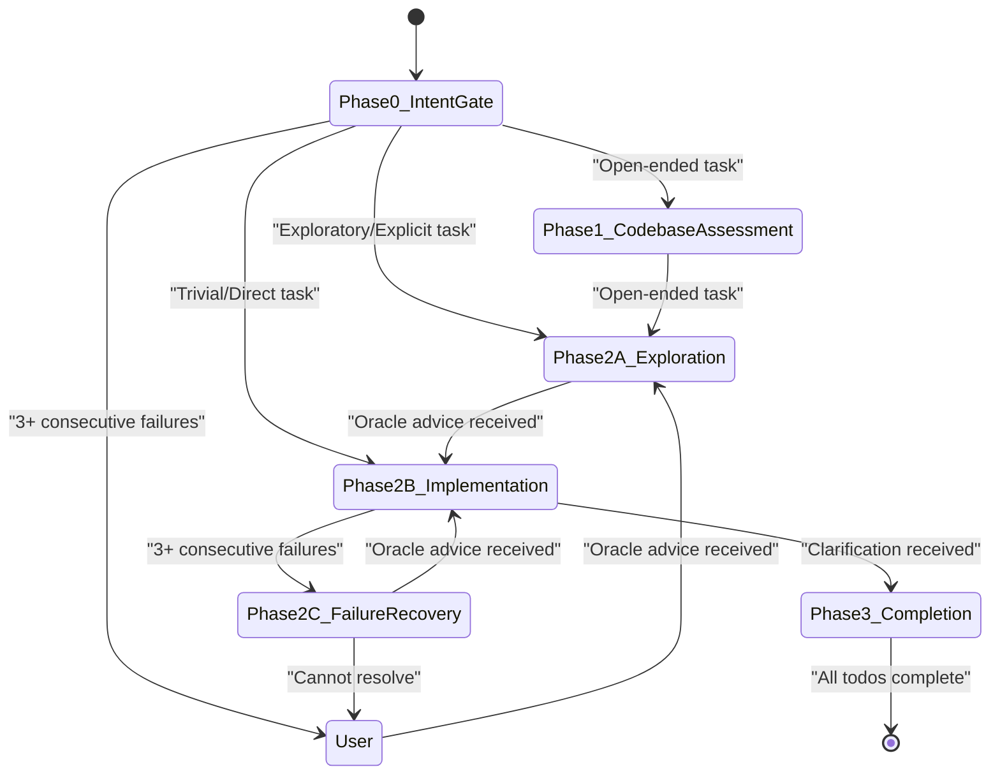
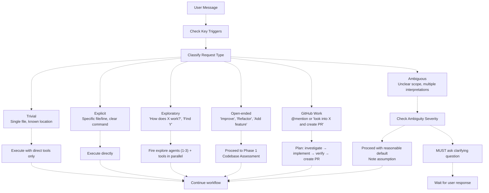
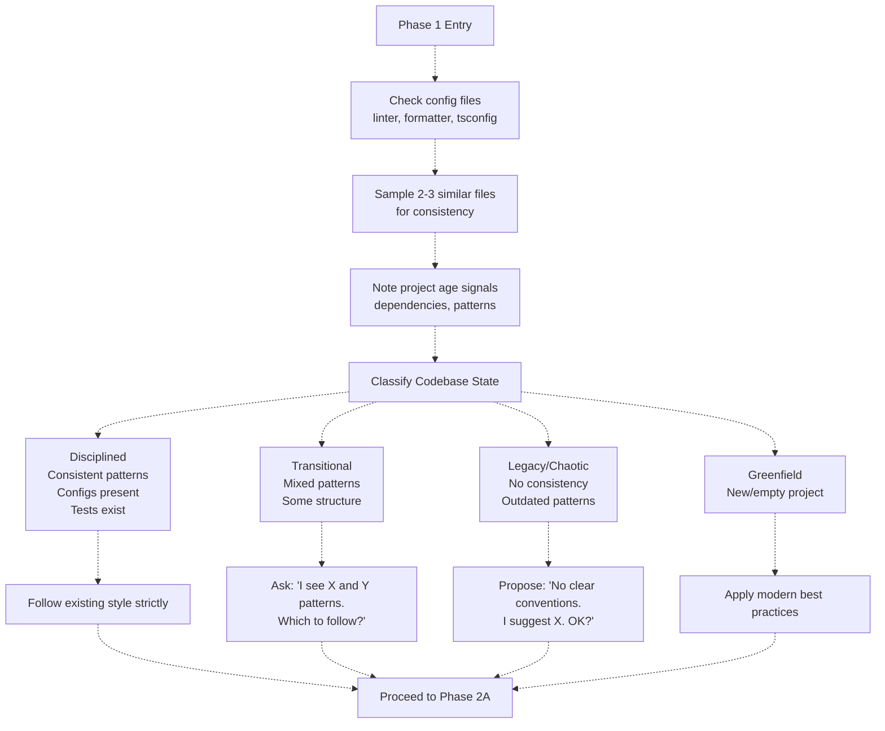
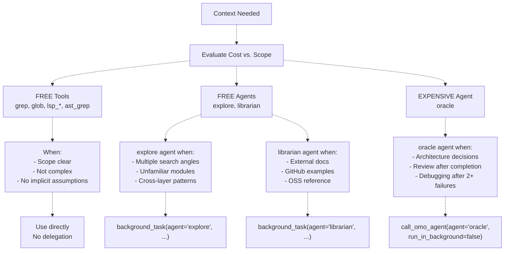
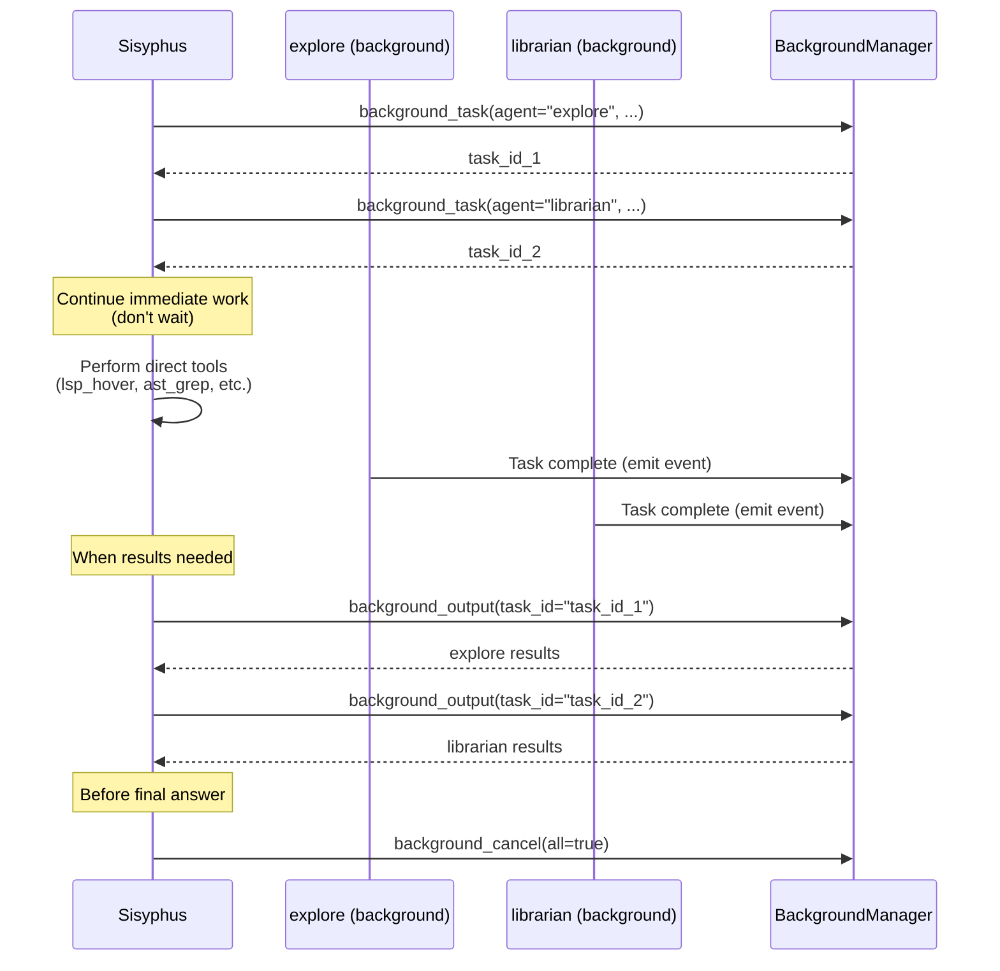
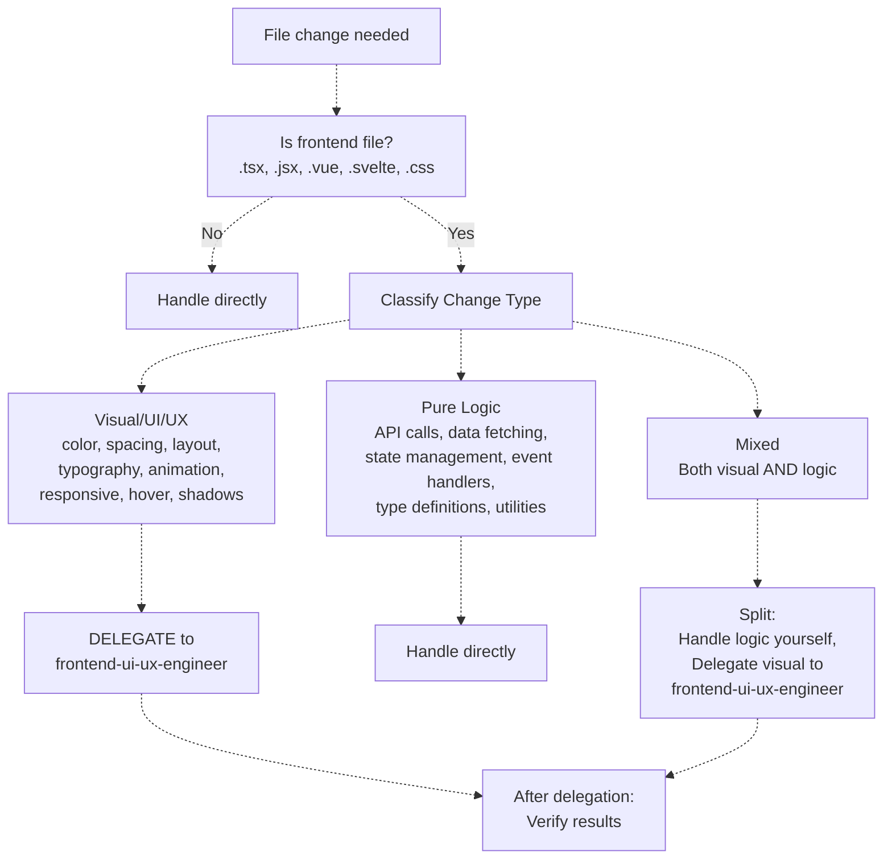
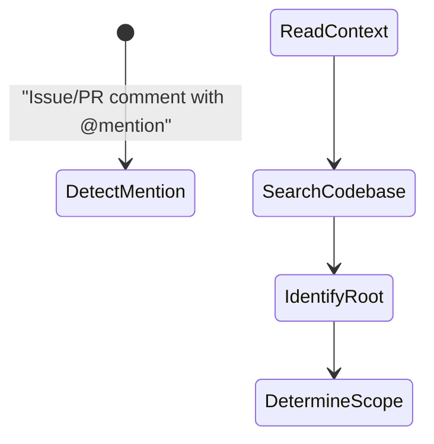
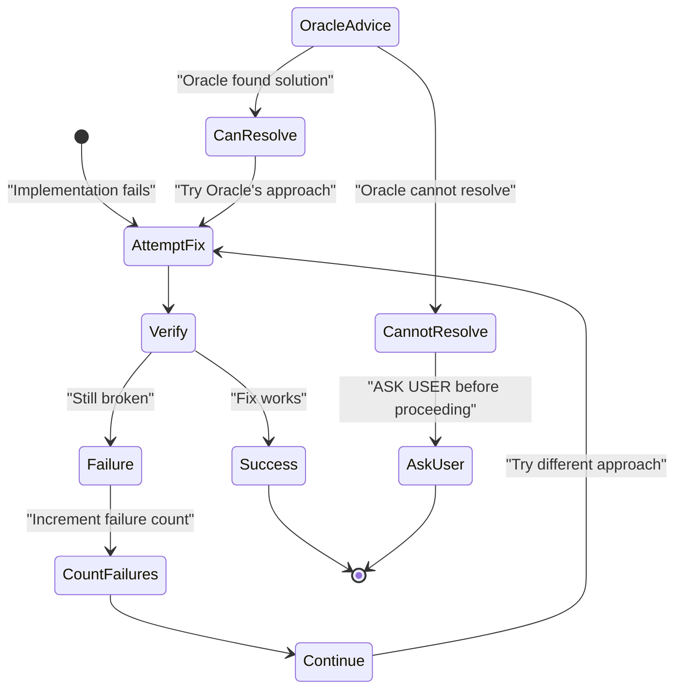
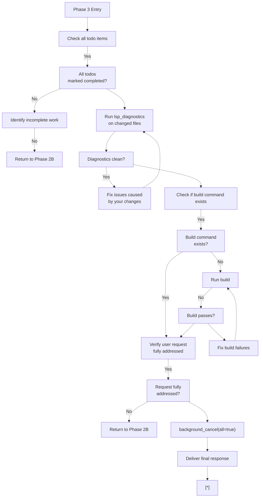

# 워크플로우 단계 (Workflow Phases)

> **관련 소스 파일**
> * [.github/assets/sisyphus.png](https://github.com/code-yeongyu/oh-my-opencode/blob/b92cd6ab/.github/assets/sisyphus.png)
> * [src/agents/index.ts](https://github.com/code-yeongyu/oh-my-opencode/blob/b92cd6ab/src/agents/index.ts)
> * [src/agents/sisyphus.ts](https://github.com/code-yeongyu/oh-my-opencode/blob/b92cd6ab/src/agents/sisyphus.ts)
> * [src/agents/types.ts](https://github.com/code-yeongyu/oh-my-opencode/blob/b92cd6ab/src/agents/types.ts)
> * [src/agents/utils.test.ts](https://github.com/code-yeongyu/oh-my-opencode/blob/b92cd6ab/src/agents/utils.test.ts)
> * [src/agents/utils.ts](https://github.com/code-yeongyu/oh-my-opencode/blob/b92cd6ab/src/agents/utils.ts)

## 목적 및 범위 (Purpose and Scope)

이 문서는 Sisyphus 오케스트레이터(orchestrator)가 사용자 요청을 처리할 때 따르는 6단계 워크플로우에 대해 자세히 설명합니다. 각 단계는 초기 분류부터 완료 및 검증에 이르기까지 체계적인 작업 처리를 보장하는 특정 목적을 수행합니다.

기본 오케스트레이터로서의 Sisyphus의 역할과 위임 전략에 대한 정보는 [Sisyphus Orchestrator](/code-yeongyu/oh-my-opencode/4.1-sisyphus-orchestrator)를 참조하십시오. 할 일(todo) 관리 메커니즘에 대한 자세한 내용은 [Todo Management](/code-yeongyu/oh-my-opencode/4.1.2-todo-management)를, 전문 에이전트 기능에 대한 정보는 [Specialized Agents](/code-yeongyu/oh-my-opencode/4.2-specialized-agents)를 참조하십시오.

## 워크플로우 개요 (Workflow Overview)

Sisyphus는 6개의 고유한 단계로 구성된 구조화된 상태 기반 워크플로우를 실행합니다. 각 단계에는 워크플로우 진행을 결정하는 특정 진입 조건, 실행 규칙 및 종료 기준이 있습니다.

### 단계 전환 (Phase Transitions)



**단계 전환 다이어그램**

출처: [src/agents/sisyphus.ts L28-L365](https://github.com/code-yeongyu/oh-my-opencode/blob/b92cd6ab/src/agents/sisyphus.ts#L28-L365)

워크플로우는 비선형적입니다. Phase 2B는 내부적으로 루프를 돌거나(다단계 구현), Phase 2C(실패 처리)로 전환되거나, Phase 3(완료)으로 직접 이동할 수 있습니다. Phase 0은 의도를 재분류하기 위해 모든 사용자 메시지에서 실행됩니다.

## Phase 0: 인텐트 게이트 (Intent Gate)

**목적**: 작업을 실행하기 전에 요청 유형을 분류하고 명확성을 검증합니다.

**실행 빈도**: 초기 요청뿐만 아니라 **모든** 사용자 메시지에서 실행됩니다.

### 주요 트리거 탐지 (Key Trigger Detection)

분류 전에 Sisyphus는 즉각적인 백그라운드 위임을 활성화하는 특정 패턴을 스캔합니다.

| 트리거 패턴 | 작업 | 에이전트 | 이유 |
| --- | --- | --- | --- |
| 외부 라이브러리/소스 언급 | `background_task(agent="librarian")` 실행 | `librarian` | 외부 문서 조회가 필요함 |
| 2개 이상의 모듈 관련 | `background_task(agent="explore")` 실행 | `explore` | 다각도의 코드 검색이 필요함 |
| GitHub issue/PR에서 `@mention` | 전체 작업 사이클 계획 | N/A | 단순 쿼리가 아닌 '작업 요청'임 |
| "look into" + "create PR" | 전체 구현 사이클 계획 | N/A | 분석뿐만 아니라 완전한 구현이 기대됨 |

출처: [src/agents/sisyphus.ts L30-L34](https://github.com/code-yeongyu/oh-my-opencode/blob/b92cd6ab/src/agents/sisyphus.ts#L30-L34)

### 요청 유형 분류 (Request Type Classification)



**요청 분류 의사결정 트리**

출처: [src/agents/sisyphus.ts L36-L55](https://github.com/code-yeongyu/oh-my-opencode/blob/b92cd6ab/src/agents/sisyphus.ts#L36-L55)

### 모호성 프로토콜 (Ambiguity Protocol)

| 상황 | 조치 |
| --- | --- |
| 단일한 유효 해석 가능 | 즉시 진행 |
| 여러 해석이 가능하나 노력이 비슷함 | 합리적인 기본값으로 진행하고 가정을 문서화함 |
| 여러 해석이 가능하며 노력 차이가 2배 이상임 | **반드시** 명확화 질문을 던져야 함 |
| 중요 정보 누락 (파일, 에러, 컨텍스트) | **반드시** 질문해야 함 |
| 사용자의 설계에 결함이 있어 보임 | 구현 전에 **반드시 우려 사항을 제기**해야 함 |

출처: [src/agents/sisyphus.ts L47-L55](https://github.com/code-yeongyu/oh-my-opencode/blob/b92cd6ab/src/agents/sisyphus.ts#L47-L55)

### 검증 체크리스트 (Validation Checklist)

Phase 0이 종료되기 전에 Sisyphus는 다음을 검증합니다.

1. **암시적 가정**: 결과에 영향을 줄 수 있는 언급되지 않은 가정이 있는가?
2. **검색 범위**: 범위가 명확한가, 아니면 정의가 필요한가?
3. **도구/에이전트 선택**: 이 요청을 충족할 수 있는 도구/에이전트는 무엇인가? * 가용 도구 인벤토리 확인 * 활용 전략 (백그라운드 작업, 병렬 호출, LSP 도구)

출처: [src/agents/sisyphus.ts L57-L66](https://github.com/code-yeongyu/oh-my-opencode/blob/b92cd6ab/src/agents/sisyphus.ts#L57-L66)

### 사용자 챌린지 프로토콜 (User Challenge Protocol)

문제가 있는 설계 결정이 감지되면 Sisyphus는 다음 템플릿을 따릅니다.

```yaml
I notice [observation]. This might cause [problem] because [reason].
Alternative: [your suggestion].
Should I proceed with your original request, or try the alternative?
```

**챌린지 트리거**:

* 명백한 문제를 일으키는 설계 결정
* 확립된 코드베이스 패턴과 모순되는 접근 방식
* 기존 코드 동작에 대한 오해를 바탕으로 한 요청

출처: [src/agents/sisyphus.ts L69-L81](https://github.com/code-yeongyu/oh-my-opencode/blob/b92cd6ab/src/agents/sisyphus.ts#L69-L81)

## Phase 1: 코드베이스 평가 (Codebase Assessment)

**목적**: 패턴 준수 전략을 수립하기 위해 코드베이스의 성숙도 수준을 결정합니다.

**진입 조건**: Phase 0에서 요청이 "Open-ended"(개방형)로 분류된 경우.

### 빠른 평가 프로세스 (Quick Assessment Process)



**코드베이스 상태 분류 흐름**

출처: [src/agents/sisyphus.ts L85-L107](https://github.com/code-yeongyu/oh-my-opencode/blob/b92cd6ab/src/agents/sisyphus.ts#L85-L107)

### 상태 분류 매트릭스 (State Classification Matrix)

| 상태 | 신호 | Sisyphus 행동 |
| --- | --- | --- |
| **Disciplined (규율됨)** | 일관된 패턴, 설정 파일 존재 (`.eslintrc`, `tsconfig.json`), 테스트 존재 | 기존 스타일을 엄격히 따르며 질문하지 않음 |
| **Transitional (전환기)** | 혼합된 패턴 (일부 TS, 일부 JS), 어느 정도의 구조 | 질문: "X와 Y 패턴이 보입니다. 어떤 것을 따를까요?" |
| **Legacy/Chaotic (레거시/혼란)** | 일관성 없음, 오래된 패턴, 설정 파일 누락 | 제안: "명확한 컨벤션이 없습니다. [X]를 제안합니다. 괜찮으신가요?" |
| **Greenfield (그린필드)** | 신규/빈 프로젝트, 최소한의 파일 | 질문 없이 현대적인 모범 사례(best practices) 적용 |

출처: [src/agents/sisyphus.ts L94-L101](https://github.com/code-yeongyu/oh-my-opencode/blob/b92cd6ab/src/agents/sisyphus.ts#L94-L101)

### 가정 전 검증 (Verification Before Assumption)

코드베이스가 규율되지 않은 것처럼 보일 경우 Sisyphus는 다음을 확인합니다.

* 서로 다른 패턴이 서로 다른 목적을 수행하는가? (의도적인 다양성)
* 마이그레이션이 진행 중인가? (전환 상태)
* 잘못된 참조 파일을 샘플링했는가?

출처: [src/agents/sisyphus.ts L103-L106](https://github.com/code-yeongyu/oh-my-opencode/blob/b92cd6ab/src/agents/sisyphus.ts#L103-L106)

## Phase 2A: 탐색 및 조사 (Exploration & Research)

**목적**: 구현 전에 최적의 도구/에이전트 조합을 사용하여 필요한 컨텍스트(context)를 수집합니다.

**진입 조건**: 컨텍스트 발견이 필요한 사소하지 않은(non-trivial) 작업.

### 도구 선택 비용 매트릭스 (Tool Selection Cost Matrix)



**비용에 따른 도구 선택 의사결정 트리**

출처: [src/agents/sisyphus.ts L110-L120](https://github.com/code-yeongyu/oh-my-opencode/blob/b92cd6ab/src/agents/sisyphus.ts#L110-L120)

### Explore vs. Librarian: 컨텍스트 Grep vs. 참조 Grep

| 차원 | `explore` 에이전트 (Contextual Grep) | `librarian` 에이전트 (Reference Grep) |
| --- | --- | --- |
| **검색 대상** | 내부 코드베이스 (현재 저장소) | 외부 리소스 (다른 저장소, 문서) |
| **사용 사례** | 프로젝트 코드 내 패턴 찾기 | 공식 API 문서 |
| **예시 쿼리** | "우리 인증 방식은 어떻게 동작하나요?" | "Express에서 JWT를 어떻게 사용하나요?" |
| **목적** | 프로젝트별 로직 파악 | 라이브러리 모범 사례 및 특이사항 파악 |
| **도구 액세스** | `lsp_*`, `ast_grep`, `grep_app` | `context7`, `websearch_exa`, `grep_app` |

**`librarian` 트리거 문구**:

* "[library]를 어떻게 사용하나요?"
* "[framework feature]의 모범 사례는 무엇인가요?"
* "왜 [external dependency]가 이렇게 동작하나요?"
* "[library] 사용 예시 찾아줘"
* 익숙하지 않은 npm/pip/cargo 패키지 작업 시

출처: [src/agents/sisyphus.ts L123-L151](https://github.com/code-yeongyu/oh-my-opencode/blob/b92cd6ab/src/agents/sisyphus.ts#L123-L151)

### 병렬 실행 패턴 (Parallel Execution Pattern)

**기본 동작**: `explore`와 `librarian`은 항상 백그라운드에서 실행되며, 절대 블로킹(blocking)되지 않습니다.

```
// 올바른 예: 항상 백그라운드, 항상 병렬
background_task(agent="explore", prompt="우리 코드베이스에서 인증 구현을 찾아줘...")
background_task(agent="explore", prompt="여기서 에러 처리 패턴을 찾아줘...")
background_task(agent="librarian", prompt="공식 문서에서 JWT 모범 사례를 찾아줘...")
background_task(agent="librarian", prompt="Express에서 프로덕션 앱들이 인증을 어떻게 처리하는지 찾아줘...")
// 즉시 작업을 계속합니다. 필요할 때 background_output으로 수집합니다.

// 잘못된 예: 순차적 또는 블로킹
result = call_omo_agent(agent="explore", run_in_background=false)  // 절대 이렇게 하지 마세요
```

출처: [src/agents/sisyphus.ts L153-L169](https://github.com/code-yeongyu/oh-my-opencode/blob/b92cd6ab/src/agents/sisyphus.ts#L153-L169)

### 백그라운드 결과 수집 흐름 (Background Result Collection Flow)



**병렬 백그라운드 실행 시퀀스**

출처: [src/agents/sisyphus.ts L171-L176](https://github.com/code-yeongyu/oh-my-opencode/blob/b92cd6ab/src/agents/sisyphus.ts#L171-L176)

### 검색 중단 조건 (Search Stop Conditions)

다음의 경우 검색을 중단합니다.

* 자신 있게 진행할 수 있는 충분한 컨텍스트를 확보했을 때
* 여러 소스에서 동일한 정보가 반복될 때
* 2번의 검색 반복 후에도 새로운 유용한 데이터가 없을 때
* 직접적인 해답을 찾았을 때

**안티 패턴**: 과도한 탐색. 시간은 소중합니다.

출처: [src/agents/sisyphus.ts L177-L185](https://github.com/code-yeongyu/oh-my-opencode/blob/b92cd6ab/src/agents/sisyphus.ts#L177-L185)

## Phase 2B: 구현 (Implementation)

**목적**: 체계적인 할 일 추적 및 전략적 위임을 통해 계획된 변경 사항을 실행합니다.

**진입 조건**: 충분한 컨텍스트가 수집되어 구현을 시작할 준비가 된 경우.

### 구현 전 프로토콜 (Pre-Implementation Protocol)

1. **할 일 생성**: 작업이 2단계 이상인 경우 → 즉시 `todowrite`로 할 일 목록을 생성합니다. 매우 상세하게 작성하되, 별도의 안내 멘트는 생략합니다.
2. **`in_progress` 표시**: 각 단계를 시작하기 전에 표시합니다.
3. **`completed` 표시**: 단계가 완료되는 즉시 표시합니다. (절대 한꺼번에 완료 처리하지 마세요)

출처: [src/agents/sisyphus.ts L192-L194](https://github.com/code-yeongyu/oh-my-opencode/blob/b92cd6ab/src/agents/sisyphus.ts#L192-L194)

### 프론트엔드 파일 의사결정 게이트 (Frontend File Decision Gate)



**프론트엔드 파일 분류 의사결정 트리**

출처: [src/agents/sisyphus.ts L196-L228](https://github.com/code-yeongyu/oh-my-opencode/blob/b92cd6ab/src/agents/sisyphus.ts#L196-L228)

#### 분류 매트릭스 (Classification Matrix)

| 변경 유형 | 예시 | 조치 |
| --- | --- | --- |
| **Visual/UI/UX** | 색상, 간격, 레이아웃, 타이포그래피, 애니메이션, 반응형 중단점, 호버 상태, 그림자, 테두리, 아이콘, 이미지 | `frontend-ui-ux-engineer`에게 **위임** |
| **Pure Logic** | API 호출, 데이터 페칭, 상태 관리, 이벤트 핸들러(비시각적), 타입 정의, 유틸리티 함수, 비즈니스 로직 | **직접 처리 가능** |
| **Mixed** | 시각적 요소와 로직이 모두 포함된 컴포넌트 변경 | **분리**: 로직은 직접 처리하고, 시각적 요소는 `frontend-ui-ux-engineer`에게 위임 |

**의사결정 휴리스틱**: "이 변경이 **어떻게 보이는가(LOOKS)**에 관한 것인가, 아니면 **어떻게 동작하는가(WORKS)**에 관한 것인가?"

* **LOOKS** (색상, 크기, 위치, 애니메이션) → 위임
* **WORKS** (데이터 흐름, API 연동, 상태) → 직접 처리

출처: [src/agents/sisyphus.ts L200-L226](https://github.com/code-yeongyu/oh-my-opencode/blob/b92cd6ab/src/agents/sisyphus.ts#L200-L226)

### 위임 프로토콜: 7가지 필수 섹션 (Delegation Protocol)

에이전트에게 위임할 때 프롬프트에는 반드시 다음 7가지 섹션이 포함되어야 합니다.

```
1. TASK: 원자적이고 구체적인 목표 (위임당 하나의 작업)
2. EXPECTED OUTCOME: 성공 기준이 포함된 구체적인 결과물
3. REQUIRED SKILLS: 호출할 기술/역량
4. REQUIRED TOOLS: 명시적인 도구 화이트리스트 (도구 남용 방지)
5. MUST DO: 철저한 요구 사항 - 어떤 것도 암시적으로 남겨두지 말 것
6. MUST NOT DO: 금지된 작업 - 예상되는 잘못된 행동을 미리 차단
7. CONTEXT: 파일 경로, 기존 패턴, 제약 조건
```

**모호한 프롬프트는 거부됩니다. 철저하게 작성하십시오.**

출처: [src/agents/sisyphus.ts L242-L254](https://github.com/code-yeongyu/oh-my-opencode/blob/b92cd6ab/src/agents/sisyphus.ts#L242-L254)

### 위임 대상 매트릭스 (Delegation Target Matrix)

| 도메인 | 에이전트 | 트리거 키워드 |
| --- | --- | --- |
| 코드베이스 탐색 | `explore` | 기존 구조, 패턴, 스타일 찾기 |
| 프론트엔드 UI/UX | `frontend-ui-ux-engineer` | 시각적 변경 전용 (스타일링, 레이아웃, 애니메이션). 순수 로직은 직접 처리 |
| 외부 조사 | `librarian` | 익숙하지 않은 패키지/라이브러리, 이상 동작 (OSS 구현체 찾기) |
| 문서화 | `document-writer` | README, API 문서, 가이드 |
| 아키텍처 결정 | `oracle` | 다중 시스템 트레이드오프, 익숙하지 않은 패턴 |
| 셀프 리뷰 | `oracle` | 중요한 구현 완료 후 |
| 어려운 디버깅 | `oracle` | 2회 이상의 수정 시도 실패 후 |

출처: [src/agents/sisyphus.ts L230-L240](https://github.com/code-yeongyu/oh-my-opencode/blob/b92cd6ab/src/agents/sisyphus.ts#L230-L240)

### 위임 후 검증 (Post-Delegation Verification)

위임된 작업이 완료된 것처럼 보이면 항상 다음을 검증합니다.

* 예상대로 동작하는가?
* 기존 코드베이스 패턴을 따르는가?
* 기대한 결과가 나왔는가?
* 에이전트가 "MUST DO" 및 "MUST NOT DO" 요구 사항을 준수했는가?

출처: [src/agents/sisyphus.ts L256-L260](https://github.com/code-yeongyu/oh-my-opencode/blob/b92cd6ab/src/agents/sisyphus.ts#L256-L260)

### GitHub PR 생성 워크플로우 (GitHub PR Creation Workflow)



**GitHub PR 생성 전체 사이클**

GitHub issue에서 멘션되거나 "X를 조사해서 PR을 만들어줘"라는 요청을 받았을 때:

**패턴 인식**:

* `@sisyphus look into X`
* "look into X and create PR"
* "investigate Y and make PR"
* issue 댓글에서의 멘션

**필수 워크플로우 (협상 불가)**:

1. **조사(Investigate)**: issue/PR 컨텍스트를 읽고, 코드베이스를 검색하여 근본 원인과 범위를 파악합니다.
2. **구현(Implement)**: 패턴을 따르고, 해당하는 경우 테스트를 추가하며, `lsp_diagnostics`로 검증합니다.
3. **검증(Verify)**: 빌드 명령이 있으면 실행하고, 테스트가 있으면 실행하여 회귀(regression)가 없는지 확인합니다.
4. **PR 생성(Create PR)**: 의미 있는 제목과 설명을 작성하고 issue 번호를 참조하여 `gh pr create`를 사용합니다.

**강조**: "Look into"는 "조사해서 보고만 하는 것"을 의미하지 않습니다. "조사하고, 해결책을 구현하고, PR을 생성하는 것"을 의미합니다.

출처: [src/agents/sisyphus.ts L264-L297](https://github.com/code-yeongyu/oh-my-opencode/blob/b92cd6ab/src/agents/sisyphus.ts#L264-L297)

### 코드 변경 규칙 (Code Change Rules)

* 기존 패턴과 일치시킵니다. (코드베이스가 규율된 경우)
* 접근 방식을 먼저 제안합니다. (코드베이스가 혼란스러운 경우)
* `as any`, `@ts-ignore`, `@ts-expect-error`로 타입 에러를 억제하지 마십시오.
* 명시적으로 요청받지 않는 한 커밋(commit)하지 마십시오.
* 안전한 리팩토링을 위해 다양한 도구를 사용하십시오.
* **버그 수정 규칙**: 최소한으로 수정하십시오. 수정하는 동안 리팩토링을 **절대** 하지 마십시오.

출처: [src/agents/sisyphus.ts L299-L305](https://github.com/code-yeongyu/oh-my-opencode/blob/b92cd6ab/src/agents/sisyphus.ts#L299-L305)

### 검증 요구 사항 (Verification Requirements)

다음 시점에 변경된 파일에 대해 `lsp_diagnostics`를 실행하십시오.

* 논리적 작업 단위가 끝날 때
* 할 일 항목을 완료로 표시하기 전
* 사용자에게 완료를 보고하기 전

프로젝트에 빌드/테스트 명령이 있는 경우 작업 완료 시 실행하십시오.

출처: [src/agents/sisyphus.ts L307-L314](https://github.com/code-yeongyu/oh-my-opencode/blob/b92cd6ab/src/agents/sisyphus.ts#L307-L314)

### 증거 요구 사항 (Evidence Requirements)

| 작업 | 필수 증거 |
| --- | --- |
| 파일 수정 | 변경된 파일에 대한 `lsp_diagnostics` 결과가 깨끗함 |
| 빌드 명령 | 종료 코드(Exit code) 0 |
| 테스트 실행 | 통과 (또는 기존 실패에 대한 명시적 언급) |
| 위임 | 에이전트 결과를 수신하고 검증함 |

**증거가 없으면 완료된 것이 아닙니다.**

출처: [src/agents/sisyphus.ts L316-L325](https://github.com/code-yeongyu/oh-my-opencode/blob/b92cd6ab/src/agents/sisyphus.ts#L316-L325)

## Phase 2C: 실패 복구 (Failure Recovery)

**목적**: 구조화된 복구 프로토콜을 사용하여 구현 실패를 체계적으로 처리합니다.

**진입 조건**: 수정 시도가 실패하거나 3회 연속 실패가 발생한 경우.

### 실패 처리 프로토콜 (Failure Handling Protocol)



**실패 복구 상태 머신**

출처: [src/agents/sisyphus.ts L329-L346](https://github.com/code-yeongyu/oh-my-opencode/blob/b92cd6ab/src/agents/sisyphus.ts#L329-L346)

### 수정 시도 규칙 (Fix Attempt Rules)

1. **증상이 아닌 근본 원인을 수정하십시오.**
2. **모든 수정 시도 후에는 다시 검증하십시오.** (`lsp_diagnostics` 실행)
3. **무작위 디버깅(shotgun debug)을 하지 마십시오.** (무언가 작동하기를 바라며 무작위로 변경하는 행위)

출처: [src/agents/sisyphus.ts L332-L335](https://github.com/code-yeongyu/oh-my-opencode/blob/b92cd6ab/src/agents/sisyphus.ts#L332-L335)

### 3-스트라이크 프로토콜 (3-Strike Protocol)

3회 연속 실패 후에는 다음을 수행합니다.

1. **중단(STOP)**: 즉시 모든 추가 수정을 중단합니다.
2. **되돌리기(REVERT)**: 마지막으로 확인된 정상 상태로 돌아갑니다. (`git checkout` / 수정 취소)
3. **문서화(DOCUMENT)**: 시도한 내용과 실패한 내용을 기록합니다.
4. **상담(CONSULT)**: 전체 실패 컨텍스트와 함께 `oracle` 에이전트를 호출합니다.
5. **사용자에게 질문(ASK USER)**: Oracle이 해결할 수 없는 경우 진행하기 전에 사용자에게 묻습니다.

**절대 금지 사항**:

* 코드를 깨진 상태로 두는 것
* 작동하기를 바라며 계속 진행하는 것
* "통과"시키기 위해 실패하는 테스트를 삭제하는 것

출처: [src/agents/sisyphus.ts L337-L345](https://github.com/code-yeongyu/oh-my-opencode/blob/b92cd6ab/src/agents/sisyphus.ts#L337-L345)

## Phase 3: 완료 (Completion)

**목적**: 최종 응답을 전달하기 전에 모든 작업이 완료되고 깨끗하며 요구 사항을 충족하는지 확인합니다.

**진입 조건**: 계획된 모든 작업이 완료되었거나 사용자가 상태를 요청한 경우.

### 완료 체크리스트 (Completion Checklist)



**완료 검증 흐름**

출처: [src/agents/sisyphus.ts L349-L365](https://github.com/code-yeongyu/oh-my-opencode/blob/b92cd6ab/src/agents/sisyphus.ts#L349-L365)

### 완료 기준 (Completion Criteria)

다음 조건이 충족되면 작업이 완료된 것입니다.

* 계획된 모든 할 일 항목이 완료로 표시됨
* 변경된 파일에 대한 진단 결과가 깨끗함
* 빌드가 통과함 (해당하는 경우)
* 사용자의 원래 요청이 완전히 처리됨

출처: [src/agents/sisyphus.ts L352-L355](https://github.com/code-yeongyu/oh-my-opencode/blob/b92cd6ab/src/agents/sisyphus.ts#L352-L355)

### 검증 실패 처리 (Verification Failure Handling)

검증이 실패할 경우:

1. **본인의 변경으로 인해 발생한 문제를 수정하십시오.**
2. 요청받지 않는 한 **기존에 존재하던 문제는 수정하지 마십시오.**
3. **보고**: "완료되었습니다. 참고: 제 변경 사항과 무관한 N개의 기존 린트(lint) 에러가 발견되었습니다."

출처: [src/agents/sisyphus.ts L357-L360](https://github.com/code-yeongyu/oh-my-opencode/blob/b92cd6ab/src/agents/sisyphus.ts#L357-L360)

### 최종 정리 (Final Cleanup)

최종 답변을 전달하기 전에:

* **실행 중인 모든 백그라운드 작업을 취소하십시오**: `background_cancel(all=true)`
* 이는 리소스를 절약하고 깨끗한 워크플로우 완료를 보장합니다.

출처: [src/agents/sisyphus.ts L362-L364](https://github.com/code-yeongyu/oh-my-opencode/blob/b92cd6ab/src/agents/sisyphus.ts#L362-L364)

## 단계 실행 컨텍스트 (Phase Execution Context)

전체 워크플로우는 [src/agents/sisyphus.ts L6-L526](https://github.com/code-yeongyu/oh-my-opencode/blob/b92cd6ab/src/agents/sisyphus.ts#L6-L526)에 있는 Sisyphus 에이전트 시스템 프롬프트에 포함되어 있습니다.

[src/agents/sisyphus.ts L528-L544](https://github.com/code-yeongyu/oh-my-opencode/blob/b92cd6ab/src/agents/sisyphus.ts#L528-L544)의 `createSisyphusAgent` 팩토리 함수는 다음 설정을 사용하여 에이전트를 인스턴스화합니다.

* **기본 모델(Default Model)**: `anthropic/claude-opus-4-5`
* **모드(Mode)**: `primary` (메인 오케스트레이터)
* **최대 토큰(Max Tokens)**: 64000
* **생각 예산(Thinking Budget)**: 32000 토큰 (Claude 모델용) 또는 `reasoningEffort: "medium"` (GPT 모델용)
* **색상(Color)**: `#00CED1` (UI 식별용 시안색)

에이전트 구성에는 모델별 설정을 위한 조건부 로직이 포함되어 있습니다. Claude 모델은 `thinking: { type: "enabled", budgetTokens: 32000 }`을 수신하고, GPT 모델은 `reasoningEffort: "medium"`을 수신합니다.

환경 컨텍스트(현재 날짜, 시간, 시간대, 작업 디렉토리, 플랫폼)는 [src/agents/utils.ts L32-L63](https://github.com/code-yeongyu/oh-my-opencode/blob/b92cd6ab/src/agents/utils.ts#L32-L63)의 `createEnvContext()`를 통해 Sisyphus의 프롬프트에 자동으로 주입됩니다.

출처: [src/agents/sisyphus.ts L528-L546](https://github.com/code-yeongyu/oh-my-opencode/blob/b92cd6ab/src/agents/sisyphus.ts#L528-L546)
[src/agents/utils.ts L32-L63](https://github.com/code-yeongyu/oh-my-opencode/blob/b92cd6ab/src/agents/utils.ts#L32-L63)
[src/agents/utils.ts L99-L102](https://github.com/code-yeongyu/oh-my-opencode/blob/b92cd6ab/src/agents/utils.ts#L99-L102)