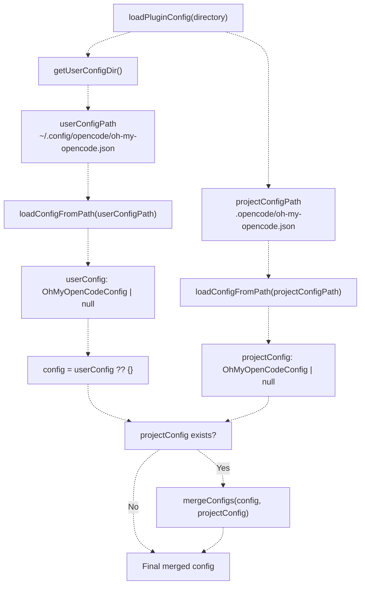
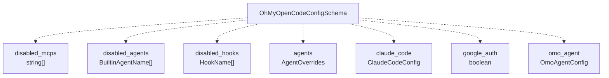
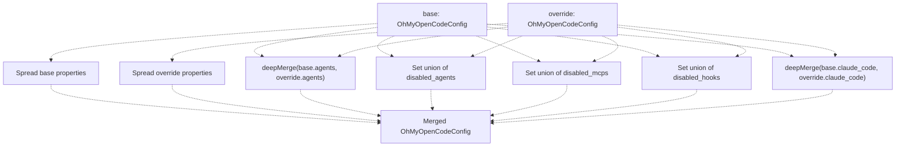
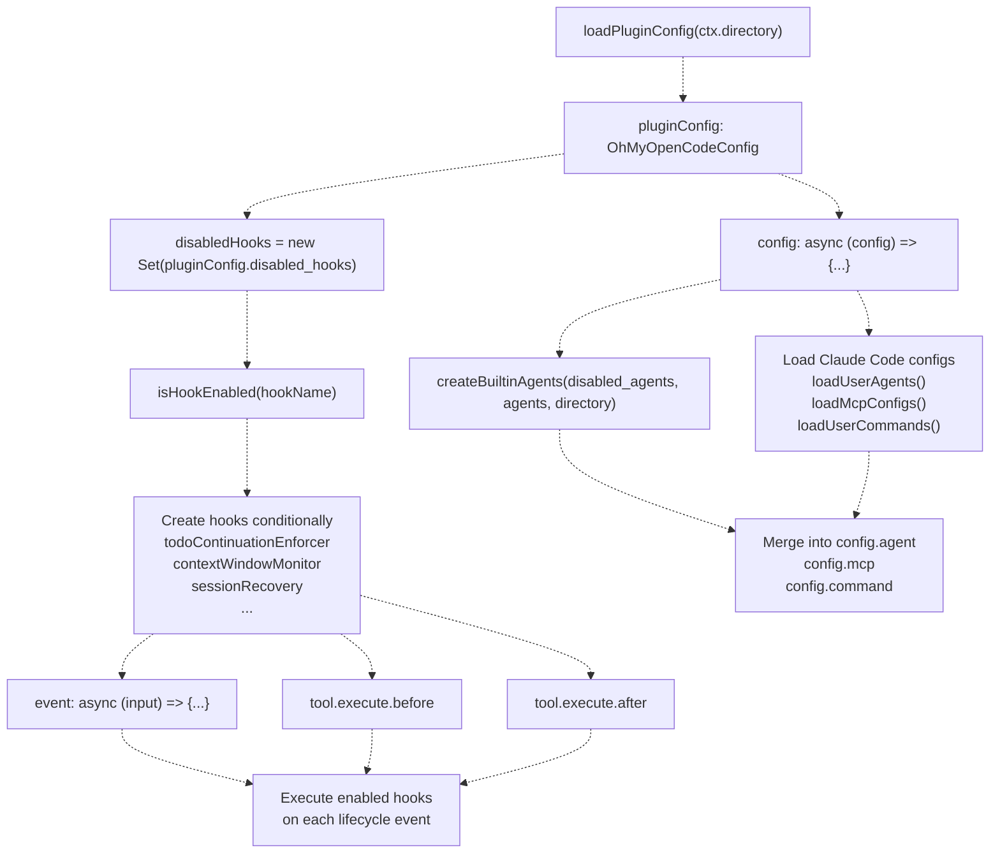
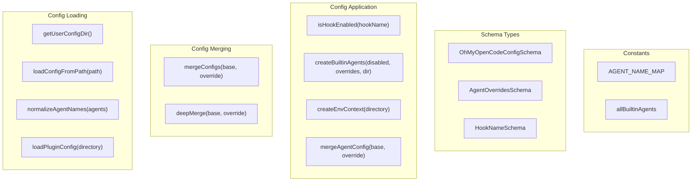
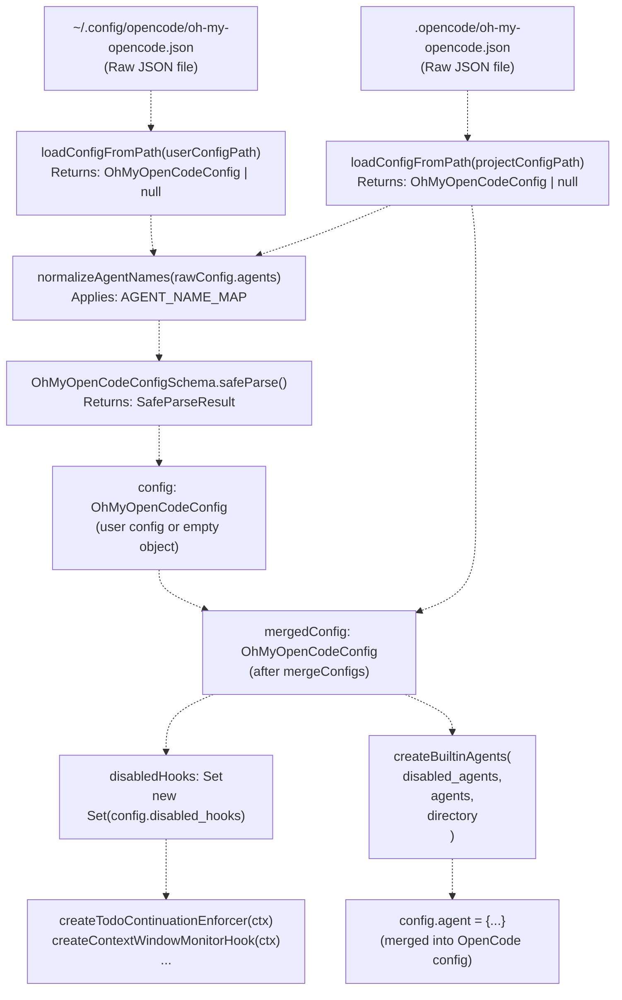

# 설정 시스템 (Configuration System)

> **관련 소스 파일**
> * [assets/oh-my-opencode.schema.json](https://github.com/code-yeongyu/oh-my-opencode/blob/b92cd6ab/assets/oh-my-opencode.schema.json)
> * [bun.lock](https://github.com/code-yeongyu/oh-my-opencode/blob/b92cd6ab/bun.lock)
> * [package.json](https://github.com/code-yeongyu/oh-my-opencode/blob/b92cd6ab/package.json)
> * [src/cli/config-manager.ts](https://github.com/code-yeongyu/oh-my-opencode/blob/b92cd6ab/src/cli/config-manager.ts)
> * [src/config/schema.ts](https://github.com/code-yeongyu/oh-my-opencode/blob/b92cd6ab/src/config/schema.ts)
> * [src/hooks/index.ts](https://github.com/code-yeongyu/oh-my-opencode/blob/b92cd6ab/src/hooks/index.ts)
> * [src/index.ts](https://github.com/code-yeongyu/oh-my-opencode/blob/b92cd6ab/src/index.ts)
> * [src/shared/jsonc-parser.test.ts](https://github.com/code-yeongyu/oh-my-opencode/blob/b92cd6ab/src/shared/jsonc-parser.test.ts)
> * [src/shared/jsonc-parser.ts](https://github.com/code-yeongyu/oh-my-opencode/blob/b92cd6ab/src/shared/jsonc-parser.ts)

## 목적 및 범위

설정 시스템은 oh-my-opencode 플러그인에 대한 사용자 기본 설정의 로드, 검증, 병합 및 적용을 관리합니다. 이 시스템은 프로젝트 수준의 설정이 사용자 수준의 기본 설정보다 우선하는 2단계 오버라이드(Override, 덮어쓰기) 계층 구조를 구현하며, Zod를 사용한 스키마 검증(Schema validation)을 제공하여 타입 안정성(Type safety)을 보장하고 설정 오류를 조기에 발견합니다.

이 페이지에서는 설정 로드 메커니즘, 스키마 구조 및 병합 전략을 다룹니다. 특정 에이전트 구성에 대한 정보는 [에이전트 설정](#4.6)을 참조하십시오. Claude Code 호환성 토글에 대해서는 [설정 로딩](/code-yeongyu/oh-my-opencode/8.1-mcp-system-overview)을 참조하십시오.

**소스:** [src/index.ts L1-L178](https://github.com/code-yeongyu/oh-my-opencode/blob/b92cd6ab/src/index.ts#L1-L178)

 [src/config/schema.ts L1-L127](https://github.com/code-yeongyu/oh-my-opencode/blob/b92cd6ab/src/config/schema.ts#L1-L127)

---

## 설정 파일 위치

시스템은 플랫폼별 관례에 따라 다음 두 위치에서 설정 파일을 검색합니다.

| 우선순위 | 위치 | 플랫폼별 동작 |
| --- | --- | --- |
| **1 (최고)** | `.opencode/oh-my-opencode.json` | 현재 작업 디렉토리의 프로젝트 전용 설정 |
| **2 (기본)** | `~/.config/opencode/oh-my-opencode.json` | 사용자 수준 설정 (XDG를 통한 Linux/macOS) |
| **2 (기본)** | `%APPDATA%\opencode\oh-my-opencode.json` | 사용자 수준 설정 (Windows) |

`getUserConfigDir()` 함수는 운영 체제에 따라 올바른 경로를 결정합니다.

```yaml
Windows: process.env.APPDATA || %USERPROFILE%\AppData\Roaming
Unix-like: process.env.XDG_CONFIG_HOME || ~/.config
```

**소스:** [src/index.ts L61-L68](https://github.com/code-yeongyu/oh-my-opencode/blob/b92cd6ab/src/index.ts#L61-L68)

 [src/index.ts L146-L159](https://github.com/code-yeongyu/oh-my-opencode/blob/b92cd6ab/src/index.ts#L146-L159)

---

## 설정 로딩 파이프라인 (Configuration Loading Pipeline)

### 로드 및 병합 흐름도



**소스:** [src/index.ts L146-L178](https://github.com/code-yeongyu/oh-my-opencode/blob/b92cd6ab/src/index.ts#L146-L178)

### 로드 함수 구현

`loadConfigFromPath()` 함수는 각 설정 파일에 대해 네 가지 작업을 수행합니다.

1. **파일 존재 확인**: `fs.existsSync()`를 사용하여 파일이 존재하는지 확인합니다.
2. **JSON 파싱**: 파일 내용을 읽고 파싱합니다.
3. **에이전트 이름 정규화**: `AGENT_NAME_MAP`을 적용하여 에이전트 키를 표준화합니다.
4. **스키마 검증**: `OhMyOpenCodeConfigSchema.safeParse()`로 검증합니다.

어느 단계에서든 실패하면 함수는 `null`을 반환하고 오류를 기록합니다. 검증 오류에는 Zod의 상세한 이슈 정보가 포함됩니다.

**소스:** [src/index.ts L90-L114](https://github.com/code-yeongyu/oh-my-opencode/blob/b92cd6ab/src/index.ts#L90-L114)

 [src/index.ts L70-L88](https://github.com/code-yeongyu/oh-my-opencode/blob/b92cd6ab/src/index.ts#L70-L88)

---

## 설정 스키마 참조 (Configuration Schema Reference)

### 최상위 스키마 구조

`OhMyOpenCodeConfigSchema`는 일곱 개의 설정 도메인을 정의합니다.



**소스:** [src/config/schema.ts L108-L117](https://github.com/code-yeongyu/oh-my-opencode/blob/b92cd6ab/src/config/schema.ts#L108-L117)

### 전체 스키마 분석

| 필드 | 타입 | 목적 | 기본값 |
| --- | --- | --- | --- |
| `$schema` | `string` (선택 사항) | IDE 지원을 위한 JSON 스키마 참조 | - |
| `disabled_mcps` | `McpName[]` | 비활성화할 MCP 서버 목록 | `[]` |
| `disabled_agents` | `BuiltinAgentName[]` | 비활성화할 내장 에이전트 목록 | `[]` |
| `disabled_hooks` | `HookName[]` | 비활성화할 훅(Hook) 목록 | `[]` |
| `agents` | `AgentOverrides` | 에이전트별 설정 오버라이드 | `{}` |
| `claude_code.mcp` | `boolean` | `~/.claude/.mcp.json`에서 MCP 설정 로드 여부 | `true` |
| `claude_code.commands` | `boolean` | `~/.claude/commands/`에서 명령 로드 여부 | `true` |
| `claude_code.skills` | `boolean` | `~/.claude/skills/`에서 스킬 로드 여부 | `true` |
| `claude_code.agents` | `boolean` | `~/.claude/agents/`에서 에이전트 로드 여부 | `true` |
| `claude_code.hooks` | `boolean` | `~/.claude/settings.json`에서 외부 훅 로드 여부 | `true` |
| `google_auth` | `boolean` | Google Antigravity 인증 플러그인 활성화 여부 | `false` |
| `omo_agent.disabled` | `boolean` | OmO 오케스트레이터 에이전트 비활성화 여부 | `false` |

**소스:** [src/config/schema.ts L108-L117](https://github.com/code-yeongyu/oh-my-opencode/blob/b92cd6ab/src/config/schema.ts#L108-L117)

 [src/config/schema.ts L96-L102](https://github.com/code-yeongyu/oh-my-opencode/blob/b92cd6ab/src/config/schema.ts#L96-L102)

 [src/config/schema.ts L104-L106](https://github.com/code-yeongyu/oh-my-opencode/blob/b92cd6ab/src/config/schema.ts#L104-L106)

### 에이전트 오버라이드 스키마

`AgentOverrideConfigSchema`는 에이전트 설정의 부분적인 오버라이드를 허용합니다.

| 필드 | 타입 | 제약 조건 | 설명 |
| --- | --- | --- | --- |
| `model` | `string` | - | AI 모델 오버라이드 (예: `"claude-opus-4-5"`) |
| `temperature` | `number` | `0.0` ~ `2.0` | 샘플링 온도 |
| `top_p` | `number` | `0.0` ~ `1.0` | 핵 샘플링(Nucleus sampling) 파라미터 |
| `prompt` | `string` | - | 시스템 프롬프트 오버라이드 |
| `tools` | `Record<string, boolean>` | - | 특정 도구 활성화/비활성화 |
| `disable` | `boolean` | - | 이 에이전트를 완전히 비활성화 |
| `description` | `string` | - | UI에 표시되는 에이전트 설명 |
| `mode` | `"subagent"` \| `"primary"` \| `"all"` | - | 에이전트 가용성 모드 |
| `color` | `string` | Hex 형식 `#RRGGBB` | 이 에이전트의 UI 색상 |
| `permission` | `AgentPermissionSchema` | - | 세밀한 권한 제어 |

**소스:** [src/config/schema.ts L67-L81](https://github.com/code-yeongyu/oh-my-opencode/blob/b92cd6ab/src/config/schema.ts#L67-L81)

### 오버라이드 가능한 에이전트

`AgentOverridesSchema`는 다음 에이전트들에 대한 오버라이드를 지원합니다.

```
type OverridableAgents = 
  | "build"           // OpenCode의 내장 빌드 에이전트
  | "plan"            // OpenCode의 내장 플랜 에이전트  
  | "OmO"             // 기본 오케스트레이터
  | "OmO-Plan"        // OmO의 플래닝 변형
  | "oracle"          // 전문가 자문가
  | "librarian"       // 외부 리서치 에이전트
  | "explore"         // 코드베이스 탐색 에이전트
  | "frontend-ui-ux-engineer"  // UI/UX 구현 에이전트
  | "document-writer" // 문서화 에이전트
  | "multimodal-looker"  // 시각적 분석 에이전트
```

**소스:** [src/config/schema.ts L83-L94](https://github.com/code-yeongyu/oh-my-opencode/blob/b92cd6ab/src/config/schema.ts#L83-L94)

 [src/config/schema.ts L29-L40](https://github.com/code-yeongyu/oh-my-opencode/blob/b92cd6ab/src/config/schema.ts#L29-L40)

### 훅 이름 (Hook Names)

`HookNameSchema`는 설정 가능한 19개의 모든 훅을 나열합니다.

```sql
type HookName =
  | "todo-continuation-enforcer"
  | "context-window-monitor"
  | "session-recovery"
  | "session-notification"
  | "comment-checker"
  | "grep-output-truncator"
  | "tool-output-truncator"
  | "directory-agents-injector"
  | "directory-readme-injector"
  | "empty-task-response-detector"
  | "think-mode"
  | "anthropic-auto-compact"
  | "rules-injector"
  | "background-notification"
  | "auto-update-checker"
  | "startup-toast"
  | "keyword-detector"
  | "agent-usage-reminder"
  | "non-interactive-env"
  | "interactive-bash-session"
```

**소스:** [src/config/schema.ts L44-L65](https://github.com/code-yeongyu/oh-my-opencode/blob/b92cd6ab/src/config/schema.ts#L44-L65)

---

## 병합 전략 (Merge Strategy)

### 설정 병합 알고리즘

`mergeConfigs()` 함수는 두 개의 `OhMyOpenCodeConfig` 객체를 필드별로 다른 전략을 사용하여 결합합니다.



**소스:** [src/index.ts L116-L144](https://github.com/code-yeongyu/oh-my-opencode/blob/b92cd6ab/src/index.ts#L116-L144)

### 필드 타입별 병합 동작

| 필드 타입 | 병합 전략 | 근거 |
| --- | --- | --- |
| **스칼라 필드 (Scalar fields)** (예: `google_auth`, `omo_agent`) | 오버라이드가 베이스를 대체 | 단순한 오버라이드 의미론 적용 |
| **중첩된 객체 (Nested objects)** (`agents`, `claude_code`) | `deepMerge()` | 전체 구조를 대체하지 않고 부분적인 오버라이드 허용 |
| **배열 (Arrays)** (`disabled_mcps`, `disabled_agents`, `disabled_hooks`) | `[...new Set([...base, ...override])]`를 통한 집합 합집합 | 두 설정 모두에서 비활성화된 항목을 누적 |

### 딥 머지(Deep Merge) 구현

`deepMerge()` 함수(`src/shared` 위치)는 재귀적 병합을 수행합니다.

* **일반 객체**: 모든 키를 재귀적으로 병합합니다.
* **배열**: 대체(병합 아님) - 오버라이드 배열이 우선합니다.
* **원시 타입(Primitives)**: 오버라이드 값이 우선합니다.
* **undefined 값**: 베이스 값이 유지됩니다.

이를 통해 다음과 같은 패턴이 가능해집니다.

```
// 사용자 설정 (User config)
{
  "agents": {
    "OmO": {
      "model": "claude-opus-4-5",
      "temperature": 1.0,
      "prompt": "Base prompt..."
    }
  }
}

// 프로젝트 설정 (온도만 오버라이드)
{
  "agents": {
    "OmO": {
      "temperature": 0.7
    }
  }
}

// 결과: model과 prompt는 유지되고, temperature만 오버라이드됨
```

**소스:** [src/index.ts L116-L144](https://github.com/code-yeongyu/oh-my-opencode/blob/b92cd6ab/src/index.ts#L116-L144)

 [src/shared](https://github.com/code-yeongyu/oh-my-opencode/blob/b92cd6ab/src/shared#LNaN-LNaN)

---

## 에이전트 이름 정규화 (Agent Name Normalization)

### 에이전트 이름 매핑

`AGENT_NAME_MAP`은 대소문자를 구분하지 않는 키 정규화를 제공합니다.

```javascript
const AGENT_NAME_MAP: Record<string, string> = {
  omo: "OmO",
  build: "build",
  oracle: "oracle",
  librarian: "librarian",
  explore: "explore",
  "frontend-ui-ux-engineer": "frontend-ui-ux-engineer",
  "document-writer": "document-writer",
  "multimodal-looker": "multimodal-looker",
}
```

`normalizeAgentNames()` 함수는 검증 전에 설정 키에 이 매핑을 적용하여, 사용자가 설정 파일에서 `"OmO"` 대신 `"omo"`라고 작성할 수 있도록 합니다.

**소스:** [src/index.ts L70-L88](https://github.com/code-yeongyu/oh-my-opencode/blob/b92cd6ab/src/index.ts#L70-L88)

---

## 플러그인 수명 주기에서의 설정 사용

### 설정 적용 파이프라인



**소스:** [src/index.ts L180-L543](https://github.com/code-yeongyu/oh-my-opencode/blob/b92cd6ab/src/index.ts#L180-L543)

### 훅 초기화 패턴

각 훅은 조건부 초기화 패턴을 따릅니다.

```javascript
const todoContinuationEnforcer = isHookEnabled("todo-continuation-enforcer")
  ? createTodoContinuationEnforcer(ctx)
  : null;

const contextWindowMonitor = isHookEnabled("context-window-monitor")
  ? createContextWindowMonitorHook(ctx)
  : null;
```

비활성화된 훅은 `null`을 반환하며 수명 주기 핸들러에서 호출되지 않습니다. 이 패턴은 [src/index.ts L185-L248](https://github.com/code-yeongyu/oh-my-opencode/blob/b92cd6ab/src/index.ts#L185-L248) 전반에 걸쳐 나타납니다.

**소스:** [src/index.ts L182-L248](https://github.com/code-yeongyu/oh-my-opencode/blob/b92cd6ab/src/index.ts#L182-L248)

### 설정을 통한 에이전트 초기화

`config` 수명 주기 핸들러는 `pluginConfig`를 사용하여 에이전트를 초기화합니다.

```javascript
const builtinAgents = createBuiltinAgents(
  pluginConfig.disabled_agents,
  pluginConfig.agents,
  ctx.directory,
);
```

`createBuiltinAgents()` 함수는 세 가지 변환을 적용합니다.

1. **필터링**: `disabled_agents` 배열에 포함된 에이전트를 제외합니다.
2. **환경 주입**: OmO 및 librarian 프롬프트에 `createEnvContext()`를 추가합니다.
3. **오버라이드 병합**: `mergeAgentConfig()`를 사용하여 `agentOverrides`를 적용합니다.

**소스:** [src/index.ts L284-L289](https://github.com/code-yeongyu/oh-my-opencode/blob/b92cd6ab/src/index.ts#L284-L289)

 [src/agents/utils.ts L62-L95](https://github.com/code-yeongyu/oh-my-opencode/blob/b92cd6ab/src/agents/utils.ts#L62-L95)

### Claude Code 호환성 레이어

`claude_code` 토글은 `~/.claude/*` 디렉토리에서의 로딩을 제어합니다.

```javascript
const userAgents = (pluginConfig.claude_code?.agents ?? true) 
  ? loadUserAgents() 
  : {};

const mcpResult = (pluginConfig.claude_code?.mcp ?? true)
  ? await loadMcpConfigs()
  : { servers: {} };

const userCommands = (pluginConfig.claude_code?.commands ?? true) 
  ? loadUserCommands() 
  : {};
```

모든 토글은 지정되지 않은 경우(`?? true`) 기본값이 `true`로 설정되어 하위 호환성을 보장합니다.

**소스:** [src/index.ts L291-L380](https://github.com/code-yeongyu/oh-my-opencode/blob/b92cd6ab/src/index.ts#L291-L380)

---

## 검증 및 오류 처리 (Validation and Error Handling)

### Zod 스키마 검증

`loadConfigFromPath()` 함수는 `OhMyOpenCodeConfigSchema.safeParse()`를 사용합니다.

```javascript
const result = OhMyOpenCodeConfigSchema.safeParse(rawConfig);

if (!result.success) {
  log(`Config validation error in ${configPath}:`, result.error.issues);
  return null;
}
```

검증 실패 시:

* 상세한 오류 정보가 `result.error.issues`를 통해 기록됩니다.
* 함수는 `null`을 반환합니다.
* 플러그인은 남은 설정(사용자 설정 또는 빈 객체)으로 계속 진행합니다.
* 치명적인 오류가 발생하지 않으며, 우아한 성능 저하(Graceful degradation)를 유지합니다.

**소스:** [src/index.ts L100-L108](https://github.com/code-yeongyu/oh-my-opencode/blob/b92cd6ab/src/index.ts#L100-L108)

### 검증 오류 예시

Zod는 구조화된 오류를 제공합니다.

| 오류 유형 | 예시 | 오류 메시지 |
| --- | --- | --- |
| 잘못된 타입 | `{"temperature": "hot"}` | Expected number, received string |
| 범위를 벗어남 | `{"temperature": 3.0}` | Number must be less than or equal to 2 |
| 잘못된 열거형(Enum) | `{"disabled_hooks": ["fake-hook"]}` | Invalid enum value |
| 잘못된 형식 | `{"color": "#XYZ"}` | Invalid color format |

**소스:** [src/config/schema.ts L67-L81](https://github.com/code-yeongyu/oh-my-opencode/blob/b92cd6ab/src/config/schema.ts#L67-L81)

---

## 설정-코드 엔티티 매핑 (Configuration-to-Code Entity Mapping)

### 주요 함수 및 데이터 구조



**소스:** [src/index.ts L61-L178](https://github.com/code-yeongyu/oh-my-opencode/blob/b92cd6ab/src/index.ts#L61-L178)

 [src/agents/utils.ts L12-L95](https://github.com/code-yeongyu/oh-my-opencode/blob/b92cd6ab/src/agents/utils.ts#L12-L95)

 [src/config/schema.ts L1-L127](https://github.com/code-yeongyu/oh-my-opencode/blob/b92cd6ab/src/config/schema.ts#L1-L127)

### 설정 파일에서 런타임 설정으로의 흐름



**소스:** [src/index.ts L90-L178](https://github.com/code-yeongyu/oh-my-opencode/blob/b92cd6ab/src/index.ts#L90-L178)

 [src/index.ts L180-L289](https://github.com/code-yeongyu/oh-my-opencode/blob/b92cd6ab/src/index.ts#L180-L289)

---

## 설정 예시

### 모든 기능을 포함한 전체 예시

```sql
{
  "$schema": "https://raw.githubusercontent.com/code-yeongyu/oh-my-opencode/main/oh-my-opencode-config-schema.json",
  
  "disabled_mcps": ["filesystem", "memory"],
  "disabled_agents": ["multimodal-looker"],
  "disabled_hooks": ["startup-toast", "auto-update-checker"],
  
  "agents": {
    "OmO": {
      "temperature": 0.7,
      "description": "Custom OmO orchestrator"
    },
    "explore": {
      "model": "grok-code-2",
      "temperature": 0.3
    },
    "oracle": {
      "prompt": "Custom oracle prompt with additional guidelines..."
    }
  },
  
  "claude_code": {
    "mcp": true,
    "commands": true,
    "skills": false,
    "agents": false,
    "hooks": true
  },
  
  "google_auth": true,
  
  "omo_agent": {
    "disabled": false
  }
}
```

**소스:** [src/config/schema.ts L108-L117](https://github.com/code-yeongyu/oh-my-opencode/blob/b92cd6ab/src/config/schema.ts#L108-L117)

---

## 설정 우선순위 규칙

### 오버라이드 우선순위 요약

1. **프로젝트 설정** (`.opencode/oh-my-opencode.json`)이 사용자 설정을 오버라이드합니다.
2. **사용자 설정** (`~/.config/opencode/oh-my-opencode.json`)이 기본값을 제공합니다.
3. 설정이 존재하지 않을 경우 **내장 기본값**이 적용됩니다.

### 필드별 병합 의미론

* **원시 타입 오버라이드**: 마지막에 적용된 것이 승리합니다 (프로젝트 > 사용자 > 기본값).
* **객체 오버라이드**: 프로젝트 설정이 우선순위를 갖는 딥 머지가 수행됩니다.
* **배열 누적**: `disabled_*` 배열에 대해 집합 합집합이 수행됩니다.
* **도구 권한**: 얕은 병합(Shallow merge)이 수행됩니다 (프로젝트 도구가 사용자 도구를 오버라이드).

**소스:** [src/index.ts L116-L178](https://github.com/code-yeongyu/oh-my-opencode/blob/b92cd6ab/src/index.ts#L116-L178)