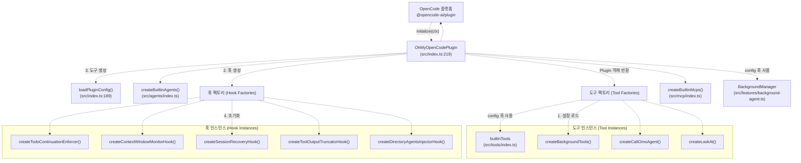
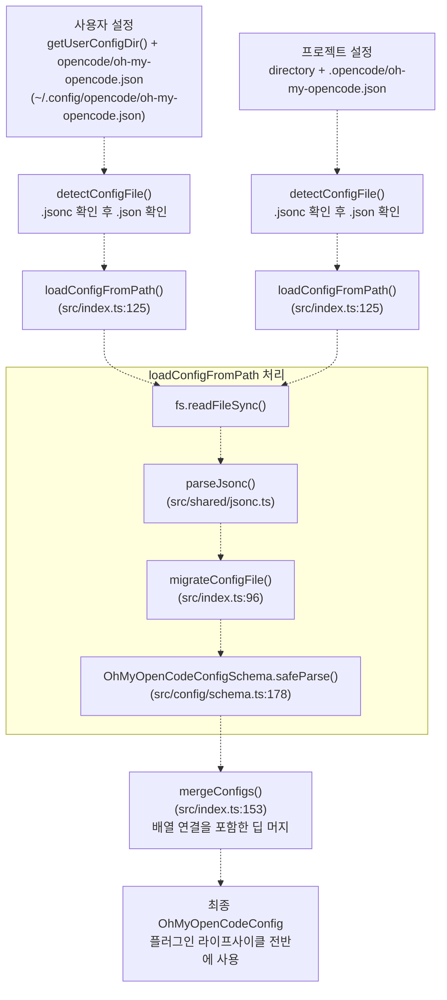
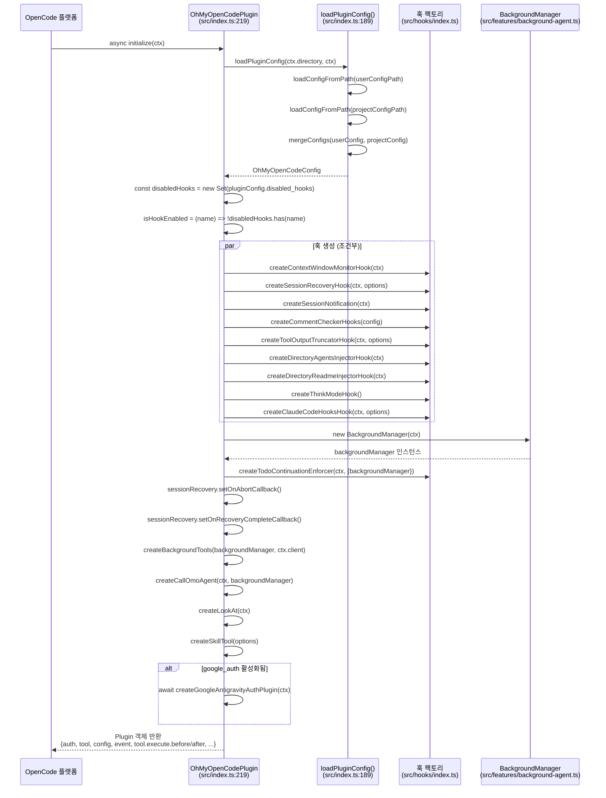
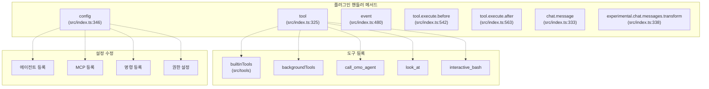
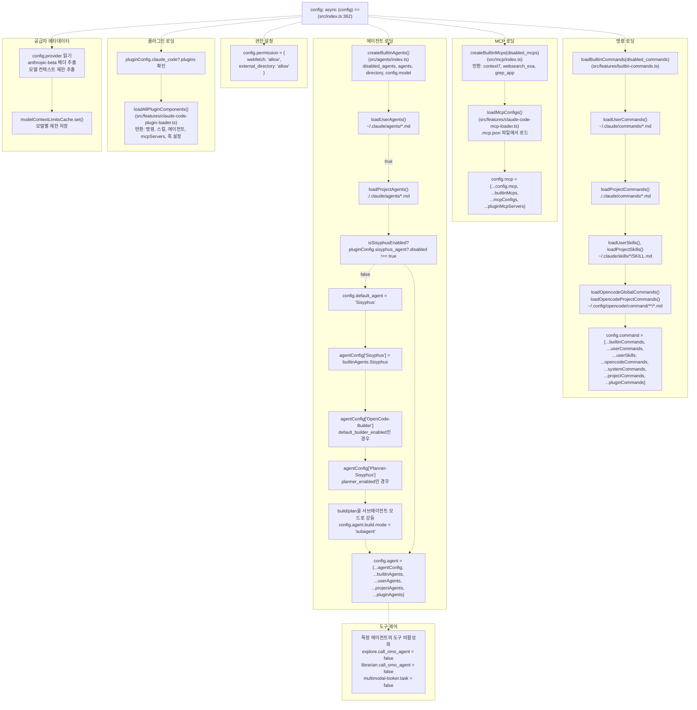
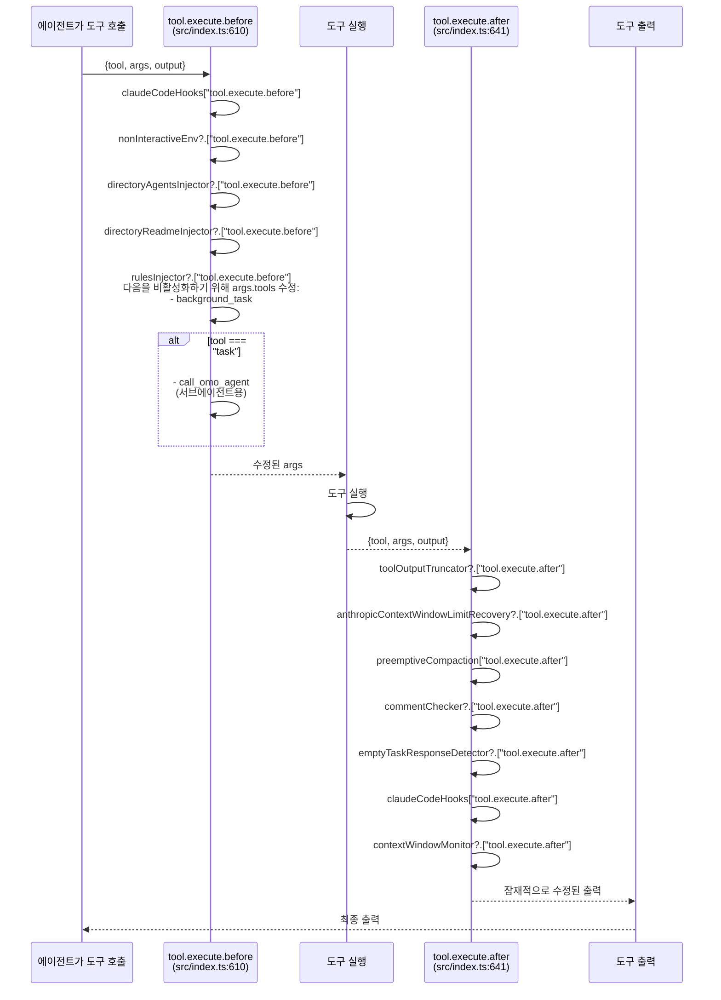

# 핵심 아키텍처 (Core Architecture)

> **관련 소스 파일**
> * [README.ja.md](https://github.com/code-yeongyu/oh-my-opencode/blob/b92cd6ab/README.ja.md)
> * [README.ko.md](https://github.com/code-yeongyu/oh-my-opencode/blob/b92cd6ab/README.ko.md)
> * [README.md](https://github.com/code-yeongyu/oh-my-opencode/blob/b92cd6ab/README.md)
> * [README.zh-cn.md](https://github.com/code-yeongyu/oh-my-opencode/blob/b92cd6ab/README.zh-cn.md)
> * [assets/oh-my-opencode.schema.json](https://github.com/code-yeongyu/oh-my-opencode/blob/b92cd6ab/assets/oh-my-opencode.schema.json)
> * [src/config/schema.ts](https://github.com/code-yeongyu/oh-my-opencode/blob/b92cd6ab/src/config/schema.ts)
> * [src/hooks/index.ts](https://github.com/code-yeongyu/oh-my-opencode/blob/b92cd6ab/src/hooks/index.ts)
> * [src/index.ts](https://github.com/code-yeongyu/oh-my-opencode/blob/b92cd6ab/src/index.ts)
> * [src/shared/config-path.ts](https://github.com/code-yeongyu/oh-my-opencode/blob/b92cd6ab/src/shared/config-path.ts)

이 페이지는 oh-my-opencode의 내부 아키텍처를 OpenCode 플러그인 관점에서 설명하며, 초기화 흐름, 설정 시스템 및 OpenCode 플랫폼과의 통합 지점을 다룹니다. 특정 하위 시스템에 대한 자세한 내용은 [플러그인 라이프사이클 (Plugin Lifecycle)](/code-yeongyu/oh-my-opencode/3.1-plugin-lifecycle), [설정 시스템 (Configuration System)](/code-yeongyu/oh-my-opencode/3.2-configuration-system), [이벤트 핸들링 (Event Handling)](/code-yeongyu/oh-my-opencode/3.3-event-handling)을 참조하십시오.

## 플러그인 엔트리 포인트 및 구조 (Plugin Entry Point and Structure)

oh-my-opencode는 [src/index.ts L219](https://github.com/code-yeongyu/oh-my-opencode/blob/b92cd6ab/src/index.ts#L219-L219)에서 단일 기본 함수 `OhMyOpenCodePlugin`을 내보내는 OpenCode 플러그인으로 구현되어 있으며, 이는 OpenCode `Plugin` 인터페이스를 준수합니다. 플러그인은 프로젝트 디렉토리 경로와 OpenCode와 상호작용하기 위한 API 클라이언트를 포함하는 컨텍스트 객체(`ctx`)를 전달받습니다.

**플러그인 엔트리 포인트 아키텍처**



플러그인은 다음과 같은 핸들러 메서드를 가진 객체를 반환합니다:

* `config`: OpenCode 설정 수정 (에이전트, MCP, 명령)
* `tool`: 커스텀 도구 등록
* `event`: OpenCode 라이프사이클 이벤트 처리
* `tool.execute.before`: 도구 실행 전 훅
* `tool.execute.after`: 도구 실행 후 훅
* `chat.message`: 채팅 메시지 처리 훅
* `experimental.chat.messages.transform`: 메시지 변환 훅

**소스:** [src/index.ts L219-L576](https://github.com/code-yeongyu/oh-my-opencode/blob/b92cd6ab/src/index.ts#L219-L576), [src/index.ts L1-L60](https://github.com/code-yeongyu/oh-my-opencode/blob/b92cd6ab/src/index.ts#L1-L60)

## 설정 아키텍처 (Configuration Architecture)

설정 시스템은 검증, 마이그레이션 및 병합 기능을 갖춘 계층적 로딩 전략을 구현합니다.

### 설정 로딩 계층 구조 (Configuration Loading Hierarchy)

**설정 로드 및 병합 흐름**



설정 로더는 다음 우선순위를 따릅니다:

1. **사용자 수준 설정** (기본): `getUserConfigDir()`를 통해 `~/.config/opencode/oh-my-opencode.json`에서 로드 [src/shared/config-path.ts L13-L33](https://github.com/code-yeongyu/oh-my-opencode/blob/b92cd6ab/src/shared/config-path.ts#L13-L33)
2. **프로젝트 수준 설정** (오버라이드): 프로젝트 디렉토리의 `.opencode/oh-my-opencode.json`에서 로드
3. **형식 감지**: JSONC(`.jsonc`) 파일이 JSON(`.json`) 파일보다 우선순위를 가짐 [src/shared/jsonc.ts](https://github.com/code-yeongyu/oh-my-opencode/blob/b92cd6ab/src/shared/jsonc.ts)
4. **딥 머지 (Deep merge)**: 배열은 연결(concatenate)되고(예: `disabled_agents`, `disabled_hooks`), 객체는 재귀적으로 병합됨 [src/index.ts L153-L187](https://github.com/code-yeongyu/oh-my-opencode/blob/b92cd6ab/src/index.ts#L153-L187)

Windows에서 사용자 설정 경로는 폴백(fallback) 전략을 구현합니다. 크로스 플랫폼 일관성을 위해 `~/.config`를 선호하지만, 하위 호환성을 위해 `%APPDATA%`도 확인합니다. [src/shared/config-path.ts L13-L33](https://github.com/code-yeongyu/oh-my-opencode/blob/b92cd6ab/src/shared/config-path.ts#L13-L33)

### 설정 스키마 및 검증 (Configuration Schema and Validation)

설정 검증은 [src/config/schema.ts](https://github.com/code-yeongyu/oh-my-opencode/blob/b92cd6ab/src/config/schema.ts)에 정의된 Zod 스키마를 사용합니다. `OhMyOpenCodeConfigSchema` [src/config/schema.ts L178-L191](https://github.com/code-yeongyu/oh-my-opencode/blob/b92cd6ab/src/config/schema.ts#L178-L191)는 타입 안전성을 강제하고 런타임 검증을 제공합니다.

| 스키마 구성 요소 | 목적 | 주요 필드 | 위치 |
| --- | --- | --- | --- |
| `OhMyOpenCodeConfigSchema` | 루트 설정 스키마 | disabled_mcps, disabled_agents, disabled_hooks, agents, claude_code, experimental | [src/config/schema.ts L178-L191](https://github.com/code-yeongyu/oh-my-opencode/blob/b92cd6ab/src/config/schema.ts#L178-L191) |
| `AgentOverridesSchema` | 에이전트 커스터마이징 옵션 | build, plan, Sisyphus, oracle, librarian, explore, frontend-ui-ux-engineer | [src/config/schema.ts L91-L103](https://github.com/code-yeongyu/oh-my-opencode/blob/b92cd6ab/src/config/schema.ts#L91-L103) |
| `AgentOverrideConfigSchema` | 에이전트별 설정 | model, temperature, top_p, prompt, tools, permission, disable, mode | [src/config/schema.ts L74-L89](https://github.com/code-yeongyu/oh-my-opencode/blob/b92cd6ab/src/config/schema.ts#L74-L89) |
| `HookNameSchema` | 비활성화 가능한 유효한 훅 식별자 | todo-continuation-enforcer, context-window-monitor, session-recovery 등 | [src/config/schema.ts L45-L68](https://github.com/code-yeongyu/oh-my-opencode/blob/b92cd6ab/src/config/schema.ts#L45-L68) |
| `BuiltinAgentNameSchema` | 유효한 에이전트 식별자 | Sisyphus, oracle, librarian, explore, frontend-ui-ux-engineer, document-writer, multimodal-looker | [src/config/schema.ts L19-L27](https://github.com/code-yeongyu/oh-my-opencode/blob/b92cd6ab/src/config/schema.ts#L19-L27) |
| `ClaudeCodeConfigSchema` | Claude Code 호환성 토글 | mcp, commands, skills, agents, hooks, plugins | [src/config/schema.ts L105-L113](https://github.com/code-yeongyu/oh-my-opencode/blob/b92cd6ab/src/config/schema.ts#L105-L113) |
| `SisyphusAgentConfigSchema` | Sisyphus 에이전트 설정 | disabled, default_builder_enabled, planner_enabled, replace_plan | [src/config/schema.ts L115-L120](https://github.com/code-yeongyu/oh-my-opencode/blob/b92cd6ab/src/config/schema.ts#L115-L120) |
| `ExperimentalConfigSchema` | 실험적 기능 | aggressive_truncation, preemptive_compaction, dynamic_context_pruning | [src/config/schema.ts L163-L176](https://github.com/code-yeongyu/oh-my-opencode/blob/b92cd6ab/src/config/schema.ts#L163-L176) |

스키마 검증은 `loadConfigFromPath()` [src/index.ts L133](https://github.com/code-yeongyu/oh-my-opencode/blob/b92cd6ab/src/index.ts#L133-L133)에서 `OhMyOpenCodeConfigSchema.safeParse()`를 사용하여 수행됩니다. 검증 실패는 로그에 기록되고 `configLoadErrors`에서 추적되지만 플러그인 초기화를 중단시키지는 않습니다.

**소스:** [src/config/schema.ts L1-L205](https://github.com/code-yeongyu/oh-my-opencode/blob/b92cd6ab/src/config/schema.ts#L1-L205), [src/index.ts L125-L151](https://github.com/code-yeongyu/oh-my-opencode/blob/b92cd6ab/src/index.ts#L125-L151), [src/shared/config-path.ts L13-L48](https://github.com/code-yeongyu/oh-my-opencode/blob/b92cd6ab/src/shared/config-path.ts#L13-L48)

### 설정 마이그레이션 (Configuration Migration)

마이그레이션 시스템은 이름이 변경된 에이전트 및 설정 키에 대한 하위 호환성을 처리합니다.

**에이전트 이름 마이그레이션 맵** [src/index.ts L63-L79](https://github.com/code-yeongyu/oh-my-opencode/blob/b92cd6ab/src/index.ts#L63-L79):

```
Legacy → Current
omo → Sisyphus
OmO → Sisyphus
OmO-Plan → Planner-Sisyphus
omo-plan → Planner-Sisyphus
```

**마이그레이션 프로세스:**

1. `migrateAgentNames()` [src/index.ts L81-L94](https://github.com/code-yeongyu/oh-my-opencode/blob/b92cd6ab/src/index.ts#L81-L94): `AGENT_NAME_MAP`을 사용하여 `agents` 설정 객체의 에이전트 키를 대소문자 구분 없이 변환합니다.
2. `migrateConfigFile()` [src/index.ts L96-L123](https://github.com/code-yeongyu/oh-my-opencode/blob/b92cd6ab/src/index.ts#L96-L123):
   * `migrateAgentNames()`를 통해 에이전트 이름을 마이그레이션합니다.
   * `omo_agent` → `sisyphus_agent` 설정 키를 마이그레이션합니다.
   * `fs.writeFileSync()`를 사용하여 업데이트된 설정을 디스크에 다시 씁니다.
3. 스키마 검증 전 `loadConfigFromPath()` [src/index.ts L131](https://github.com/code-yeongyu/oh-my-opencode/blob/b92cd6ab/src/index.ts#L131-L131)에서 자동으로 호출됩니다.

마이그레이션은 사용자에게 투명하게 진행되며 변경 사항을 콘솔에 기록합니다. [src/index.ts L116](https://github.com/code-yeongyu/oh-my-opencode/blob/b92cd6ab/src/index.ts#L116-L116)

**소스:** [src/index.ts L63-L123](https://github.com/code-yeongyu/oh-my-opencode/blob/b92cd6ab/src/index.ts#L63-L123)

## 플러그인 초기화 흐름 (Plugin Initialization Flow)

**초기화 시퀀스 다이어그램**



[src/index.ts L219-L335](https://github.com/code-yeongyu/oh-my-opencode/blob/b92cd6ab/src/index.ts#L219-L335)의 초기화 시퀀스는 다음 단계를 따릅니다:

1. **설정 로드** [src/index.ts L220](https://github.com/code-yeongyu/oh-my-opencode/blob/b92cd6ab/src/index.ts#L220-L220): 사용자 및 프로젝트 설정을 로드, 검증 및 병합하는 `loadPluginConfig(ctx.directory, ctx)`를 호출합니다.
2. **비활성화된 훅 세트 초기화** [src/index.ts L221-L222](https://github.com/code-yeongyu/oh-my-opencode/blob/b92cd6ab/src/index.ts#L221-L222): `pluginConfig.disabled_hooks`를 기반으로 `isHookEnabled()` 함수를 생성합니다.
3. **컨텍스트 추적 초기화** [src/index.ts L224-L236](https://github.com/code-yeongyu/oh-my-opencode/blob/b92cd6ab/src/index.ts#L224-L236): 컨텍스트 윈도우 관리를 위해 `modelContextLimitsCache` 및 `getModelLimit()`을 설정합니다.
4. **훅 인스턴스 생성 (조건부)** [src/index.ts L238-L305](https://github.com/code-yeongyu/oh-my-opencode/blob/b92cd6ab/src/index.ts#L238-L305):
   * 각 훅은 `isHookEnabled(hookName)`이 true를 반환하는 경우에만 생성됩니다.
   * 훅은 `ctx`, `pluginConfig` 또는 특정 옵션을 전달받습니다.
   * 예: "context-window-monitor"가 활성화된 경우에만 `createContextWindowMonitorHook(ctx)`이 호출됩니다.
5. **백그라운드 매니저 초기화** [src/index.ts L307](https://github.com/code-yeongyu/oh-my-opencode/blob/b92cd6ab/src/index.ts#L307-L307): 백그라운드 에이전트 작업을 관리하기 위한 `BackgroundManager` 인스턴스를 생성합니다.
6. **훅 의존성 연결** [src/index.ts L313-L316](https://github.com/code-yeongyu/oh-my-opencode/blob/b92cd6ab/src/index.ts#L313-L316): 조정을 위해 `sessionRecovery` 콜백을 `todoContinuationEnforcer`에 연결합니다.
7. **도구 팩토리 생성** [src/index.ts L318-L327](https://github.com/code-yeongyu/oh-my-opencode/blob/b92cd6ab/src/index.ts#L318-L327):
   * `createBackgroundTools()`: background_task, background_output, background_cancel
   * `createCallOmoAgent()`: call_omo_agent 도구
   * `createLookAt()`: look_at 멀티모달 도구
   * `createSkillTool()`: 스킬 실행 도구
8. **Google 인증 설정** (활성화된 경우) [src/index.ts L329-L331](https://github.com/code-yeongyu/oh-my-opencode/blob/b92cd6ab/src/index.ts#L329-L331): `google_auth !== false`인 경우 Antigravity 인증 플러그인을 초기화합니다.
9. **tmux 가용성 확인** [src/index.ts L333](https://github.com/code-yeongyu/oh-my-opencode/blob/b92cd6ab/src/index.ts#L333-L333): `interactive_bash` 도구를 활성화하기 위해 tmux를 확인합니다.
10. **Plugin 객체 반환** [src/index.ts L335-L576](https://github.com/code-yeongyu/oh-my-opencode/blob/b92cd6ab/src/index.ts#L335-L576): `auth`, `tool`, `config`, `event`, `tool.execute.before`, `tool.execute.after`, `chat.message`, `experimental.chat.messages.transform`에 대한 핸들러가 포함된 객체를 반환합니다.

**소스:** [src/index.ts L219-L335](https://github.com/code-yeongyu/oh-my-opencode/blob/b92cd6ab/src/index.ts#L219-L335)

## 플러그인 통합 지점 (Plugin Integration Points)

플러그인은 OpenCode에 여러 통합 지점을 노출합니다:



### Config 훅 (Config Hook)

`config` 훅 [src/index.ts L362-L556](https://github.com/code-yeongyu/oh-my-opencode/blob/b92cd6ab/src/index.ts#L362-L556)은 초기화 중에 OpenCode에 의해 호출되며, 에이전트, 도구, MCP, 명령 및 권한을 등록하기 위해 OpenCode 설정 객체를 수정합니다.

**Config 훅 처리 흐름**



**주요 설정 작업:**

1. **공급자 메타데이터 추출** [src/index.ts L362-L386](https://github.com/code-yeongyu/oh-my-opencode/blob/b92cd6ab/src/index.ts#L362-L386):
   * `config.provider`를 읽어 Anthropic beta 헤더와 모델 컨텍스트 제한을 추출합니다.
   * 컨텍스트 윈도우 추적을 위해 `modelContextLimitsCache`를 채웁니다.
2. **Claude Code 플러그인 로딩** [src/index.ts L388-L402](https://github.com/code-yeongyu/oh-my-opencode/blob/b92cd6ab/src/index.ts#L388-L402):
   * `claude_code?.plugins !== false`인 경우 `loadAllPluginComponents()`를 호출합니다.
   * Claude Code 플러그인에서 명령, 스킬, 에이전트, MCP를 가져옵니다.
3. **에이전트 등록** [src/index.ts L404-L486](https://github.com/code-yeongyu/oh-my-opencode/blob/b92cd6ab/src/index.ts#L404-L486):
   * 설정 오버라이드를 포함하여 `createBuiltinAgents()`를 호출합니다. [src/index.ts L404-L409](https://github.com/code-yeongyu/oh-my-opencode/blob/b92cd6ab/src/index.ts#L404-L409)
   * `~/.claude/agents/*.md`에서 사용자/프로젝트 에이전트를 로드합니다. [src/index.ts L411-L413](https://github.com/code-yeongyu/oh-my-opencode/blob/b92cd6ab/src/index.ts#L411-L413)
   * Sisyphus가 활성화된 경우 [src/index.ts L415-L476](https://github.com/code-yeongyu/oh-my-opencode/blob/b92cd6ab/src/index.ts#L415-L476):
     * `config.default_agent = "Sisyphus"`로 설정합니다. [src/index.ts L422](https://github.com/code-yeongyu/oh-my-opencode/blob/b92cd6ab/src/index.ts#L422-L422)
     * `builtinAgents`에서 Sisyphus 에이전트를 등록합니다. [src/index.ts L425](https://github.com/code-yeongyu/oh-my-opencode/blob/b92cd6ab/src/index.ts#L425-L425)
     * 선택적으로 OpenCode-Builder를 등록합니다. [src/index.ts L428-L438](https://github.com/code-yeongyu/oh-my-opencode/blob/b92cd6ab/src/index.ts#L428-L438)
     * 선택적으로 Planner-Sisyphus를 등록합니다. [src/index.ts L440-L454](https://github.com/code-yeongyu/oh-my-opencode/blob/b92cd6ab/src/index.ts#L440-L454)
     * build/plan을 서브에이전트 모드로 강등합니다. [src/index.ts L475-L476](https://github.com/code-yeongyu/oh-my-opencode/blob/b92cd6ab/src/index.ts#L475-L476)
   * 모든 에이전트 소스를 병합합니다. [src/index.ts L467-L477](https://github.com/code-yeongyu/oh-my-opencode/blob/b92cd6ab/src/index.ts#L467-L477)
4. **도구 설정** [src/index.ts L488-L511](https://github.com/code-yeongyu/oh-my-opencode/blob/b92cd6ab/src/index.ts#L488-L511):
   * explore 및 librarian 에이전트에 대해 `call_omo_agent`를 비활성화합니다.
   * multimodal-looker 에이전트에 대해 `task`, `call_omo_agent`, `look_at`을 비활성화합니다.
5. **권한 기본값** [src/index.ts L513-L517](https://github.com/code-yeongyu/oh-my-opencode/blob/b92cd6ab/src/index.ts#L513-L517):
   * `webfetch: "allow"` 및 `external_directory: "allow"`를 설정합니다.
6. **MCP 등록** [src/index.ts L519-L528](https://github.com/code-yeongyu/oh-my-opencode/blob/b92cd6ab/src/index.ts#L519-L528):
   * context7, websearch_exa, grep_app을 위해 `createBuiltinMcps(disabled_mcps)`를 호출합니다.
   * `.mcp.json` 파일에서 로드하기 위해 `loadMcpConfigs()`를 호출합니다.
   * `config.mcp`에 병합합니다.
7. **명령 등록** [src/index.ts L530-L555](https://github.com/code-yeongyu/oh-my-opencode/blob/b92cd6ab/src/index.ts#L530-L555):
   * `loadBuiltinCommands()`를 통해 내장 명령을 로드합니다. [src/index.ts L530](https://github.com/code-yeongyu/oh-my-opencode/blob/b92cd6ab/src/index.ts#L530-L530)
   * `~/.claude/commands/`에서 사용자 명령을 로드합니다. [src/index.ts L531](https://github.com/code-yeongyu/oh-my-opencode/blob/b92cd6ab/src/index.ts#L531-L531)
   * `~/.config/opencode/command/`에서 OpenCode 전역 명령을 로드합니다. [src/index.ts L532](https://github.com/code-yeongyu/oh-my-opencode/blob/b92cd6ab/src/index.ts#L532-L532)
   * `./.claude/commands/`에서 프로젝트 명령을 로드합니다. [src/index.ts L534](https://github.com/code-yeongyu/oh-my-opencode/blob/b92cd6ab/src/index.ts#L534-L534)
   * `~/.claude/skills/` 및 `./.claude/skills/`에서 스킬을 로드합니다. [src/index.ts L537-L540](https://github.com/code-yeongyu/oh-my-opencode/blob/b92cd6ab/src/index.ts#L537-L540)
   * 우선순위에 따라 병합합니다. [src/index.ts L542-L555](https://github.com/code-yeongyu/oh-my-opencode/blob/b92cd6ab/src/index.ts#L542-L555)

**소스:** [src/index.ts L362-L556](https://github.com/code-yeongyu/oh-my-opencode/blob/b92cd6ab/src/index.ts#L362-L556), [src/agents/index.ts](https://github.com/code-yeongyu/oh-my-opencode/blob/b92cd6ab/src/agents/index.ts), [src/mcp/index.ts](https://github.com/code-yeongyu/oh-my-opencode/blob/b92cd6ab/src/mcp/index.ts), [src/features/builtin-commands.ts](https://github.com/code-yeongyu/oh-my-opencode/blob/b92cd6ab/src/features/builtin-commands.ts), [src/features/claude-code-command-loader.ts](https://github.com/code-yeongyu/oh-my-opencode/blob/b92cd6ab/src/features/claude-code-command-loader.ts), [src/features/opencode-skill-loader.ts](https://github.com/code-yeongyu/oh-my-opencode/blob/b92cd6ab/src/features/opencode-skill-loader.ts), [src/features/claude-code-agent-loader.ts](https://github.com/code-yeongyu/oh-my-opencode/blob/b92cd6ab/src/features/claude-code-agent-loader.ts), [src/features/claude-code-mcp-loader.ts](https://github.com/code-yeongyu/oh-my-opencode/blob/b92cd6ab/src/features/claude-code-mcp-loader.ts)

### 이벤트 훅 (Event Hook)

`event` 훅 [src/index.ts L558-L608](https://github.com/code-yeongyu/oh-my-opencode/blob/b92cd6ab/src/index.ts#L558-L608)은 OpenCode 라이프사이클 이벤트를 처리하고 등록된 훅으로 전달합니다.

**이벤트 전달 흐름**

```mermaid
flowchart TD

EventInput["이벤트 입력<br>{type, sessionId, ...}"]
EventHandler["event: async (input) =><br>(src/index.ts:558)"]
AutoUpdate["autoUpdateChecker?.event(input)"]
ClaudeCode["claudeCodeHooks.event(input)"]
BgNotif["backgroundNotificationHook?.event(input)"]
SessionNotif["sessionNotification?.(input)"]
TodoCont["todoContinuationEnforcer?.handler(input)"]
ContextMon["contextWindowMonitor?.event(input)"]
DirAgents["directoryAgentsInjector?.event(input)"]
DirReadme["directoryReadmeInjector?.event(input)"]
Rules["rulesInjector?.event(input)"]
ThinkMode["thinkMode?.event(input)"]
EmptyTask["emptyTaskResponseDetector?.event(input)"]
ClaudeCodeHookExec["claudeCodeHooks.eventHook?.(input)"]
AgentReminder["agentUsageReminder?.event?.(input)"]
BashSession["interactiveBashSession?.event?.(input)"]
SessionCreated["input.type === 'session.created'"]
SetMainSession["setMainSession(input.sessionId)<br>(src/features/claude-code-session-state.ts)"]
SessionDeleted["input.type === 'session.deleted'"]
CheckMainSession["getMainSessionID() === input.sessionId"]
ClearMainSession["setMainSession(undefined)"]
SessionError["input.type === 'session.error'"]
CheckRecoverable["복구 가능한 에러인가?<br>tool_result_missing, thinking_block_order,<br>thinking_disabled, empty_content"]
TriggerRecovery["sessionRecovery?.abort(sessionId)<br>await sessionRecovery?.recover(sessionId)"]
AutoContinue["ctx.client.session.execute(sessionId, '')<br>복구 후 자동 계속"]

EventInput -.-> EventHandler
EventHandler -.->|"예"| AutoUpdate
EventHandler -.-> ClaudeCode
EventHandler -.-> BgNotif
EventHandler -.-> SessionNotif
EventHandler -.-> TodoCont
EventHandler -.-> ContextMon
EventHandler -.-> DirAgents
EventHandler -.-> DirReadme
EventHandler -.-> Rules
EventHandler -.-> ThinkMode
EventHandler -.-> EmptyTask
EventHandler -.-> ClaudeCodeHookExec
EventHandler -.-> AgentReminder
EventHandler -.-> BashSession
EventHandler -.->|"예"| SessionCreated
EventHandler -.->|"예"| SessionDeleted
EventHandler -.-> SessionError

subgraph subGraph1 ["세션별 이벤트 처리"]
    SessionCreated
    SetMainSession
    SessionDeleted
    CheckMainSession
    ClearMainSession
    SessionError
    CheckRecoverable
    TriggerRecovery
    AutoContinue
    SessionCreated -.->|"예"| SetMainSession
    SessionDeleted -.->|"예"| CheckMainSession
    CheckMainSession -.-> ClearMainSession
    SessionError -.-> CheckRecoverable
    CheckRecoverable -.-> TriggerRecovery
    TriggerRecovery -.-> AutoContinue
end

subgraph subGraph0 ["일반 이벤트 전달"]
    AutoUpdate
    ClaudeCode
    BgNotif
    SessionNotif
    TodoCont
    ContextMon
    DirAgents
    DirReadme
    Rules
    ThinkMode
    EmptyTask
    ClaudeCodeHookExec
    AgentReminder
    BashSession
end
```



**이벤트 처리 동작:**

1. **일반 이벤트 전달** [src/index.ts L559-L575](https://github.com/code-yeongyu/oh-my-opencode/blob/b92cd6ab/src/index.ts#L559-L575): 모든 이벤트는 등록된 모든 훅(활성화된 경우)으로 전달됩니다.
2. **session.created** [src/index.ts L577-L584](https://github.com/code-yeongyu/oh-my-opencode/blob/b92cd6ab/src/index.ts#L577-L584):
   * 사용자와 직접 대면하는 기본 세션을 추적하기 위해 `setMainSession(input.sessionId)`를 호출합니다.
   * 기본 세션 ID는 부모 세션과 자식 백그라운드 세션을 구분하는 데 사용됩니다.
3. **session.deleted** [src/index.ts L586-L591](https://github.com/code-yeongyu/oh-my-opencode/blob/b92cd6ab/src/index.ts#L586-L591):
   * 삭제된 세션이 기본 세션인지 확인합니다.
   * `setMainSession(undefined)`를 통해 기본 세션 추적을 해제합니다.
4. **session.error** [src/index.ts L593-L607](https://github.com/code-yeongyu/oh-my-opencode/blob/b92cd6ab/src/index.ts#L593-L607):
   * 에러 메시지의 문자열 매칭을 사용하여 에러가 복구 가능한지 확인합니다.
   * 복구 가능한 에러 유형: `tool_result_missing`, `thinking_block_order`, `thinking_disabled`, `empty_content`
   * 복구 중 프롬프트 인젝션을 방지하기 위해 `sessionRecovery?.abort()`를 트리거합니다.
   * 손상된 세션 상태를 수정하기 위해 `sessionRecovery?.recover()`를 호출합니다.
   * 성공적인 복구 후 `ctx.client.session.execute(sessionId, '')`를 통해 세션을 자동으로 계속합니다.

**소스:** [src/index.ts L558-L608](https://github.com/code-yeongyu/oh-my-opencode/blob/b92cd6ab/src/index.ts#L558-L608), [src/features/claude-code-session-state.ts L44-L58](https://github.com/code-yeongyu/oh-my-opencode/blob/b92cd6ab/src/features/claude-code-session-state.ts#L44-L58), [src/hooks/session-recovery.ts](https://github.com/code-yeongyu/oh-my-opencode/blob/b92cd6ab/src/hooks/session-recovery.ts)

### 도구 실행 훅 (Tool Execution Hooks)

도구 실행 훅은 도구 호출 전후에 인터셉션 지점(interception points)을 제공합니다.

**도구 실행 라이프사이클**



**tool.execute.before** [src/index.ts L610-L639](https://github.com/code-yeongyu/oh-my-opencode/blob/b92cd6ab/src/index.ts#L610-L639):

도구 실행 전에 호출되어 다음을 수행합니다:

1. Claude Code PreToolUse 훅 실행 [src/index.ts L611](https://github.com/code-yeongyu/oh-my-opencode/blob/b92cd6ab/src/index.ts#L611-L611)
2. bash 명령을 위한 비대화형(non-interactive) 환경 변수 설정 [src/index.ts L612](https://github.com/code-yeongyu/oh-my-opencode/blob/b92cd6ab/src/index.ts#L612-L612)
3. 디렉토리별 컨텍스트 주입 [src/index.ts L613-L615](https://github.com/code-yeongyu/oh-my-opencode/blob/b92cd6ab/src/index.ts#L613-L615):
   * 디렉토리 계층 구조의 `AGENTS.md` 파일
   * 디렉토리 계층 구조의 `README.md` 파일
   * glob 패턴과 일치하는 `.claude/rules/`의 조건부 규칙
4. 서브에이전트를 위한 `task` 도구 인자 수정 [src/index.ts L617-L638](https://github.com/code-yeongyu/oh-my-opencode/blob/b92cd6ab/src/index.ts#L617-L638):
   * 서브에이전트에 의해 task가 호출될 때 `background_task` 및 `call_omo_agent` 도구를 비활성화합니다.
   * 무한 재귀를 방지하고 적절한 도구 경계를 보장합니다.

**tool.execute.after** [src/index.ts L641-L665](https://github.com/code-yeongyu/oh-my-opencode/blob/b92cd6ab/src/index.ts#L641-L665):

도구 실행 후에 호출되어 다음을 수행합니다:

1. 대규모 도구 출력 트런케이션(truncation, 자르기) [src/index.ts L642](https://github.com/code-yeongyu/oh-my-opencode/blob/b92cd6ab/src/index.ts#L642-L642): 남은 컨텍스트 윈도우에 따라 동적으로 자릅니다.
2. Anthropic 컨텍스트 제한 복구 트리거 [src/index.ts L643](https://github.com/code-yeongyu/oh-my-opencode/blob/b92cd6ab/src/index.ts#L643-L643): 자동 컴팩션(compaction)으로 하드 컨텍스트 제한을 처리합니다.
3. 선제적 컴팩션 트리거 [src/index.ts L644](https://github.com/code-yeongyu/oh-my-opencode/blob/b92cd6ab/src/index.ts#L644-L644): 80% 임계값에서 선제적으로 컴팩션을 수행합니다.
4. 코드 내 과도한 주석 확인 [src/index.ts L645](https://github.com/code-yeongyu/oh-my-opencode/blob/b92cd6ab/src/index.ts#L645-L645): 도구 출력에 코드 주석이 너무 많은 경우 경고합니다.
5. 빈 task 응답 감지 [src/index.ts L646](https://github.com/code-yeongyu/oh-my-opencode/blob/b92cd6ab/src/index.ts#L646-L646): task 도구가 콘텐츠를 반환하지 않는 경우 경고합니다.
6. Claude Code PostToolUse 훅 실행 [src/index.ts L647](https://github.com/code-yeongyu/oh-my-opencode/blob/b92cd6ab/src/index.ts#L647-L647)
7. 컨텍스트 윈도우 메트릭 업데이트 [src/index.ts L648](https://github.com/code-yeongyu/oh-my-opencode/blob/b92cd6ab/src/index.ts#L648-L648): 세션별 토큰 사용량을 추적합니다.

**소스:** [src/index.ts L610-L665](https://github.com/code-yeongyu/oh-my-opencode/blob/b92cd6ab/src/index.ts#L610-L665), [src/hooks/non-interactive-env.ts](https://github.com/code-yeongyu/oh-my-opencode/blob/b92cd6ab/src/hooks/non-interactive-env.ts), [src/hooks/directory-agents-injector.ts](https://github.com/code-yeongyu/oh-my-opencode/blob/b92cd6ab/src/hooks/directory-agents-injector.ts), [src/hooks/directory-readme-injector.ts](https://github.com/code-yeongyu/oh-my-opencode/blob/b92cd6ab/src/hooks/directory-readme-injector.ts), [src/hooks/rules-injector.ts](https://github.com/code-yeongyu/oh-my-opencode/blob/b92cd6ab/src/hooks/rules-injector.ts), [src/hooks/tool-output-truncator.ts](https://github.com/code-yeongyu/oh-my-opencode/blob/b92cd6ab/src/hooks/tool-output-truncator.ts), [src/hooks/comment-checker.ts](https://github.com/code-yeongyu/oh-my-opencode/blob/b92cd6ab/src/hooks/comment-checker.ts), [src/hooks/empty-task-response-detector.ts](https://github.com/code-yeongyu/oh-my-opencode/blob/b92cd6ab/src/hooks/empty-task-response-detector.ts)

## 컴포넌트 의존성 (Component Dependencies)

**컴포넌트 간 의존성 그래프**

```mermaid
flowchart TD

Plugin["OhMyOpenCodePlugin<br>(src/index.ts:219)"]
ConfigSys["설정 시스템<br>loadPluginConfig()<br>(src/index.ts:189)"]
TodoHook["createTodoContinuationEnforcer<br>(todo-continuation-enforcer.ts)"]
ContextHook["createContextWindowMonitorHook<br>(context-window-monitor.ts)"]
RecoveryHook["createSessionRecoveryHook<br>(session-recovery.ts)"]
TruncateHook["createToolOutputTruncatorHook<br>(tool-output-truncator.ts)"]
CompactionHook["createPreemptiveCompactionHook<br>(preemptive-compaction.ts)"]
CompactionInject["createCompactionContextInjector<br>(compaction-context-injector.ts)"]
DirAgentsHook["createDirectoryAgentsInjectorHook<br>(directory-agents-injector.ts)"]
DirReadmeHook["createDirectoryReadmeInjectorHook<br>(directory-readme-injector.ts)"]
RulesHook["createRulesInjectorHook<br>(rules-injector.ts)"]
NonInteractiveHook["createNonInteractiveEnvHook<br>(non-interactive-env.ts)"]
AgentFactory["createBuiltinAgents()<br>(agents/index.ts)"]
SisyphusAgent["Sisyphus 에이전트<br>(agents/sisyphus-prompt.ts)"]
SpecializedAgents["특화 에이전트<br>oracle, librarian, explore 등"]
BgTools["createBackgroundTools()<br>(tools/background-*.ts)"]
CallAgent["createCallOmoAgent()<br>(tools/call-omo-agent.ts)"]
LookAtTool["createLookAt()<br>(tools/look-at.ts)"]
SkillTool["createSkillTool()<br>(tools/skill.ts)"]
BuiltinTools["builtinTools<br>(tools/index.ts)"]
InteractiveBash["interactive_bash<br>(tools/interactive-bash.ts)"]
BackgroundMgr["BackgroundManager<br>(background-agent.ts)"]
SessionState["세션 상태<br>(claude-code-session-state.ts)<br>setMainSession(), getMainSessionID()"]
MCPSystem["createBuiltinMcps()<br>(mcp/index.ts)"]
ClaudeCode["Claude Code 로더<br>(features/claude-code-*.ts)"]
GoogleAuth["createGoogleAntigravityAuthPlugin<br>(auth/antigravity.ts)"]

Plugin -.->|"config 훅 사용"| AgentFactory
Plugin -.->|"생성"| BackgroundMgr
Plugin -.->|"모든 훅 생성"| TodoHook
Plugin -.->|"모든 훅 생성"| ContextHook
Plugin -.->|"모든 훅 생성"| RecoveryHook
Plugin -.->|"읽기"| TruncateHook
Plugin -.->|"setOnAbortCallback()setOnRecoveryCompleteCallback()"| CompactionHook
Plugin -.->|"의존"| DirAgentsHook
Plugin -.->|"메트릭 읽기"| DirReadmeHook
Plugin -.->|"모든 훅 생성"| RulesHook
BgTools -.->|"의존"| BackgroundMgr
CallAgent -.->|"의존"| BackgroundMgr
TodoHook -.->|"모든 훅 생성"| BackgroundMgr
Plugin -.-> SessionState
Plugin -.-> SessionState
Plugin -.->|"초기화"| MCPSystem
Plugin -.->|"조건부 초기화"| ClaudeCode
Plugin -.->|"생성"| GoogleAuth
NonInteractiveHook -.->|"모든 훅 생성"| InteractiveBash

subgraph subGraph5 ["외부 통합"]
    MCPSystem
    ClaudeCode
    GoogleAuth
end

subgraph subGraph4 ["백그라운드 시스템 (src/features/)"]
    BackgroundMgr
    SessionState
end

subgraph subGraph3 ["도구 시스템 (src/tools/)"]
    BgTools
    CallAgent
    LookAtTool
    SkillTool
    BuiltinTools
    InteractiveBash
end

subgraph subGraph2 ["에이전트 시스템 (src/agents/)"]
    AgentFactory
    SisyphusAgent
    SpecializedAgents
    AgentFactory -.->|"생성"| SisyphusAgent
    AgentFactory -.->|"config 훅 사용"| SpecializedAgents
end

subgraph subGraph1 ["훅 시스템 (src/hooks/)"]
    TodoHook
    ContextHook
    RecoveryHook
    TruncateHook
    CompactionHook
    CompactionInject
    DirAgentsHook
    DirReadmeHook
    RulesHook
    NonInteractiveHook
    RecoveryHook -.->|"메트릭 읽기"| TodoHook
    CompactionHook -.->|"onBeforeSummarize 콜백"| CompactionInject
    TruncateHook -.-> ContextHook
    CompactionHook -.->|"session.created"| ContextHook
end

subgraph subGraph0 ["핵심 플러그인 인프라"]
    Plugin
    ConfigSys
    Plugin -.->|"모든 훅 생성"| ConfigSys
end
```



**중요 의존성 관계:**

1. **SessionRecoveryHook ↔ TodoContinuationEnforcer** [src/index.ts L313-L316](https://github.com/code-yeongyu/oh-my-opencode/blob/b92cd6ab/src/index.ts#L313-L316):
   ```javascript
   sessionRecovery.setOnAbortCallback(todoContinuationEnforcer.markRecovering);
   sessionRecovery.setOnRecoveryCompleteCallback(todoContinuationEnforcer.markRecoveryComplete);
   ```
   * 복구 코디네이터는 에러 복구 중에 todo 프롬프트가 발생하는 것을 방지합니다.
   * 세션 복구 중에 충돌하는 계속(continuation) 프롬프트가 주입되지 않도록 보장합니다.
2. **BackgroundManager ↔ 백그라운드 도구** [src/index.ts L307-L323](https://github.com/code-yeongyu/oh-my-opencode/blob/b92cd6ab/src/index.ts#L307-L323):
   * `createBackgroundTools(backgroundManager, ctx.client)`는 `background_task`, `background_output`, `background_cancel`을 생성합니다.
   * `createCallOmoAgent(ctx, backgroundManager)`는 선택적 비동기 실행이 가능한 `call_omo_agent` 도구를 생성합니다.
   * 두 도구 세트 모두 작업 조정을 위해 동일한 BackgroundManager 인스턴스를 공유합니다.
3. **BackgroundManager ↔ TodoContinuationEnforcer** [src/index.ts L309-L311](https://github.com/code-yeongyu/oh-my-opencode/blob/b92cd6ab/src/index.ts#L309-L311):
   ```javascript
   const todoContinuationEnforcer = createTodoContinuationEnforcer(ctx, { backgroundManager });
   ```
   * Todo 집행자(enforcer)는 계속 프롬프트를 주입하기 전에 백그라운드 작업 상태를 확인합니다.
   * 백그라운드 에이전트가 여전히 작업 중일 때 조기에 계속 프롬프트가 발생하는 것을 방지합니다.
4. **ContextWindowMonitor → OutputTruncator** [src/index.ts L238-L253](https://github.com/code-yeongyu/oh-my-opencode/blob/b92cd6ab/src/index.ts#L238-L253):
   * 트런케이터는 현재 사용량 메트릭을 위해 컨텍스트 모니터에 쿼리합니다.
   * 남은 여유 공간에 따라 트런케이션 임계값을 동적으로 조정합니다.
5. **PreemptiveCompaction → CompactionContextInjector** [src/index.ts L272-L277](https://github.com/code-yeongyu/oh-my-opencode/blob/b92cd6ab/src/index.ts#L272-L277):
   ```javascript
   const preemptiveCompaction = createPreemptiveCompactionHook(ctx, {
     experimental: pluginConfig.experimental,
     onBeforeSummarize: compactionContextInjector,
     getModelLimit,
   });
   ```
   * 컴팩션 훅은 요약(summarization) 전에 인젝터 콜백을 호출합니다.
   * 세션 컴팩션 중에 `AGENTS.md` 및 디렉토리 컨텍스트를 보존합니다.
6. **NonInteractiveEnvHook → InteractiveBash** [src/index.ts L294-L299](https://github.com/code-yeongyu/oh-my-opencode/blob/b92cd6ab/src/index.ts#L294-L299):
   * 비대화형 훅은 bash 명령을 위한 환경 변수를 설정합니다.
   * 대화형 프롬프트를 비활성화하여 명령이 중단(hang)되는 것을 방지합니다.
7. **AgentFactory ← ConfigurationSystem** [src/index.ts L404-L409](https://github.com/code-yeongyu/oh-my-opencode/blob/b92cd6ab/src/index.ts#L404-L409):
   ```javascript
   const builtinAgents = createBuiltinAgents(
     pluginConfig.disabled_agents,
     pluginConfig.agents,
     ctx.directory,
     config.model,
   );
   ```
   * 에이전트 팩토리는 모델 선택, 프롬프트, 도구에 대한 설정 오버라이드를 읽습니다.
   * 병합된 설정에서 에이전트별 커스터마이징을 적용합니다.

**소스:** [src/index.ts L219-L335](https://github.com/code-yeongyu/oh-my-opencode/blob/b92cd6ab/src/index.ts#L219-L335), [src/index.ts L313-L316](https://github.com/code-yeongyu/oh-my-opencode/blob/b92cd6ab/src/index.ts#L313-L316), [src/index.ts L307-L323](https://github.com/code-yeongyu/oh-my-opencode/blob/b92cd6ab/src/index.ts#L307-L323), [src/index.ts L309-L311](https://github.com/code-yeongyu/oh-my-opencode/blob/b92cd6ab/src/index.ts#L309-L311), [src/index.ts L238-L253](https://github.com/code-yeongyu/oh-my-opencode/blob/b92cd6ab/src/index.ts#L238-L253), [src/index.ts L272-L277](https://github.com/code-yeongyu/oh-my-opencode/blob/b92cd6ab/src/index.ts#L272-L277), [src/index.ts L294-L299](https://github.com/code-yeongyu/oh-my-opencode/blob/b92cd6ab/src/index.ts#L294-L299), [src/index.ts L404-L409](https://github.com/code-yeongyu/oh-my-opencode/blob/b92cd6ab/src/index.ts#L404-L409), [src/hooks/index.ts L1-L24](https://github.com/code-yeongyu/oh-my-opencode/blob/b92cd6ab/src/hooks/index.ts#L1-L24), [src/features/background-agent.ts](https://github.com/code-yeongyu/oh-my-opencode/blob/b92cd6ab/src/features/background-agent.ts), [src/features/claude-code-session-state.ts](https://github.com/code-yeongyu/oh-my-opencode/blob/b92cd6ab/src/features/claude-code-session-state.ts)

## 상태 관리 (State Management)

플러그인은 여러 유형의 상태를 유지합니다:

### 세션 상태 (Session State)

세션별 상태는 [src/features/claude-code-session-state.ts](https://github.com/code-yeongyu/oh-my-opencode/blob/b92cd6ab/src/features/claude-code-session-state.ts)에서 추적됩니다:

* **기본 세션 ID (Main Session ID)**: 사용자와 직접 대면하는 기본 세션을 식별합니다.
* **백그라운드 작업 레지스트리 (Background Task Registry)**: 백그라운드 에이전트 작업의 계층적 추적을 수행합니다.
* **대화형 Bash 세션 (Interactive Bash Sessions)**: OpenCode 세션별 tmux 세션 추적을 수행합니다.

### 훅 상태 (Hook State)

개별 훅은 자체 상태를 유지합니다:

| 훅 | 상태 | 위치 |
| --- | --- | --- |
| 컨텍스트 윈도우 모니터 | 세션별 토큰 사용량 | [src/hooks/context-window-monitor.ts](https://github.com/code-yeongyu/oh-my-opencode/blob/b92cd6ab/src/hooks/context-window-monitor.ts) |
| 세션 복구 | 재시도 횟수, 폴백 추적 | [src/hooks/session-recovery.ts](https://github.com/code-yeongyu/oh-my-opencode/blob/b92cd6ab/src/hooks/session-recovery.ts) |
| Todo 계속 | 복구 모드 플래그 | [src/hooks/todo-continuation-enforcer.ts](https://github.com/code-yeongyu/oh-my-opencode/blob/b92cd6ab/src/hooks/todo-continuation-enforcer.ts) |
| 디렉토리 인젝터 | 세션별 주입된 경로 | [src/hooks/directory-agents-injector.ts](https://github.com/code-yeongyu/oh-my-opencode/blob/b92cd6ab/src/hooks/directory-agents-injector.ts) |
| Anthropic 자동 컴팩션 | 컴팩션 시도 횟수 | [src/hooks/anthropic-auto-compact.ts](https://github.com/code-yeongyu/oh-my-opencode/blob/b92cd6ab/src/hooks/anthropic-auto-compact.ts) |

### 설정 상태 (Configuration State)

설정은 초기화 시 한 번 로드되며 플러그인 라이프사이클 동안 불변(immutable) 상태로 유지됩니다. 병합된 설정 객체는 기능 활성화 여부와 에이전트/훅 동작을 결정하는 데 전반적으로 사용됩니다.

**소스:** [src/features/claude-code-session-state.ts](https://github.com/code-yeongyu/oh-my-opencode/blob/b92cd6ab/src/features/claude-code-session-state.ts), [src/hooks/](https://github.com/code-yeongyu/oh-my-opencode/blob/b92cd6ab/src/hooks/)

## 에러 핸들링 전략 (Error Handling Strategy)

플러그인은 방어적인 에러 핸들링을 구현합니다:

1. **설정 검증 에러** [src/index.ts L129-L133](https://github.com/code-yeongyu/oh-my-opencode/blob/b92cd6ab/src/index.ts#L129-L133):
   * 검증 실패는 로그에 기록되고 `configLoadErrors`에서 추적됩니다.
   * `null` 설정을 반환하여 플러그인이 기본값으로 계속 실행될 수 있도록 합니다.
2. **훅 활성화 확인** [src/index.ts L213-L214](https://github.com/code-yeongyu/oh-my-opencode/blob/b92cd6ab/src/index.ts#L213-L214):
   * 훅이 비활성화된 경우 `null`을 반환하여 런타임 에러를 방지합니다.
   * 이벤트/도구 핸들러는 훅 메서드를 호출하기 전에 `null` 여부를 확인합니다.
3. **세션 복구** [src/index.ts L515-L539](https://github.com/code-yeongyu/oh-my-opencode/blob/b92cd6ab/src/index.ts#L515-L539):
   * 복구 가능한 에러(도구 결과 누락, 생각 블록 문제 등)를 자동으로 감지합니다.
   * 손상된 상태를 수정하기 위해 세션 스토리지를 조작합니다.
   * 성공적인 복구 후 자동으로 세션을 계속합니다.
4. **도구 실행 안전장치** [src/index.ts L550-L560](https://github.com/code-yeongyu/oh-my-opencode/blob/b92cd6ab/src/index.ts#L550-L560):
   * 실행 전 도구 인자를 검증합니다.
   * 특정 서브에이전트 유형에 대해 도구를 비활성화합니다 (예: explore/librarian은 `call_omo_agent`를 사용할 수 없음).

**소스:** [src/index.ts L129-L133](https://github.com/code-yeongyu/oh-my-opencode/blob/b92cd6ab/src/index.ts#L129-L133), [src/index.ts L213-L214](https://github.com/code-yeongyu/oh-my-opencode/blob/b92cd6ab/src/index.ts#L213-L214), [src/index.ts L515-L539](https://github.com/code-yeongyu/oh-my-opencode/blob/b92cd6ab/src/index.ts#L515-L539), [src/hooks/session-recovery.ts](https://github.com/code-yeongyu/oh-my-opencode/blob/b92cd6ab/src/hooks/session-recovery.ts)