# 이벤트 처리 (Event Handling)

> **관련 소스 파일**
> * [assets/oh-my-opencode.schema.json](https://github.com/code-yeongyu/oh-my-opencode/blob/b92cd6ab/assets/oh-my-opencode.schema.json)
> * [src/config/schema.ts](https://github.com/code-yeongyu/oh-my-opencode/blob/b92cd6ab/src/config/schema.ts)
> * [src/hooks/index.ts](https://github.com/code-yeongyu/oh-my-opencode/blob/b92cd6ab/src/hooks/index.ts)
> * [src/index.ts](https://github.com/code-yeongyu/oh-my-opencode/blob/b92cd6ab/src/index.ts)

## 목적 및 범위

이 문서는 oh-my-opencode의 이벤트 기반 아키텍처(Event-driven architecture)를 설명하며, OpenCode에서 발생한 이벤트가 플러그인을 거쳐 등록된 훅(Hooks)으로 전달되는 흐름을 다룹니다. 플러그인이 구독하는 이벤트 유형, 훅을 호출하는 데 사용되는 디스패치(Dispatch) 패턴, 그리고 이벤트 파이프라인을 통해 전달되는 데이터 구조에 대해 설명합니다.

개별 훅과 그 동작에 대한 정보는 [Hook System](../reliability/)을 참조하십시오. 플러그인의 초기화 및 생명주기 관리에 대해서는 [Plugin Lifecycle](/code-yeongyu/oh-my-opencode/3.1-plugin-lifecycle)를 참조하십시오.

---

## 이벤트 기반 아키텍처 개요

oh-my-opencode 플러그인은 OpenCode가 다양한 생명주기 시점에서 이벤트를 발생시키고, 플러그인이 디스패처(Dispatcher) 역할을 하여 이러한 이벤트를 특정 동작을 구현하는 전문화된 훅으로 라우팅하는 이벤트 기반 아키텍처를 구현합니다. 플러그인은 특정 이벤트가 발생할 때 OpenCode가 호출하는 여러 이벤트 핸들러 함수를 등록합니다.

**이벤트 핸들러 등록 패턴**

플러그인은 메인 엔트리 포인트(Entry point)에서 핸들러 함수가 포함된 객체를 반환합니다.

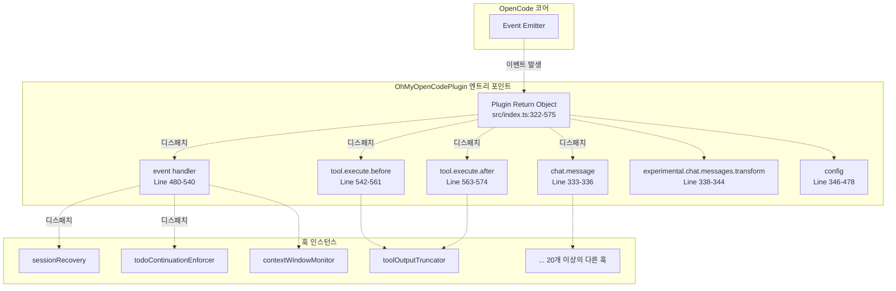

**출처:** [src/index.ts L211-L576](https://github.com/code-yeongyu/oh-my-opencode/blob/b92cd6ab/src/index.ts#L211-L576)

---

## OpenCode 이벤트 유형

OpenCode는 세션 및 도구 실행 생명주기의 다양한 시점에서 이벤트를 발생시킵니다. 플러그인은 다음과 같은 이벤트 카테고리를 구독합니다.

### 이벤트 유형 분류 (Taxonomy)

| 이벤트 핸들러 | 목적 | 전형적인 이벤트 유형 | 빈도 |
| --- | --- | --- | --- |
| `event` | 세션 생명주기 이벤트를 위한 일반 이벤트 디스패처 | `session.created`, `session.deleted`, `session.error`, `session.idle`, `message.updated` | 세션 생명주기당 발생 |
| `tool.execute.before` | 도구 실행 전 가로채기 (Interception) | 해당 없음 (도구별) | 모든 도구 호출 전 |
| `tool.execute.after` | 도구 실행 후 기능 강화 | 해당 없음 (도구별) | 모든 도구 호출 후 |
| `chat.message` | 사용자 메시지 가로채기 | 해당 없음 (메시지별) | 사용자 메시지당 발생 |
| `experimental.chat.messages.transform` | 메시지 배열 변환 | 해당 없음 (메시지 배치) | LLM으로 전송되기 전 |
| `config` | 설정 마무리 | 해당 없음 (초기화) | 세션 시작 시 1회 |

### 이벤트 속성 구조

일반 `event` 핸들러로 전달되는 이벤트는 다음과 같은 구조를 따릅니다.

```yaml
{
  event: {
    type: string,           // 예: "session.created", "session.error"
    properties: {
      info?: { id?: string, title?: string, parentID?: string },
      sessionID?: string,
      messageID?: string,
      error?: unknown,
      // ... 기타 유형별 속성
    }
  }
}
```

**출처:** [src/index.ts L480-L540](https://github.com/code-yeongyu/oh-my-opencode/blob/b92cd6ab/src/index.ts#L480-L540)

---

## 이벤트 디스패처 패턴

플러그인은 이벤트가 특정 순서에 따라 여러 훅으로 전달되는 순차적 디스패치 패턴을 사용합니다. 각 훅은 `await`와 함께 호출되어 동기적인 처리를 보장합니다.

### 메인 이벤트 디스패처

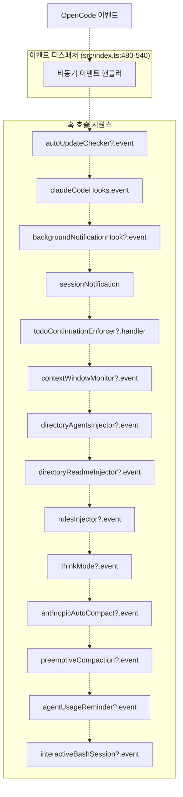

**참고:** `?` 접미사는 설정을 통해 비활성화된 경우 `null`이 될 수 있는 조건부 훅을 나타냅니다. 디스패처는 옵셔널 체이닝(`?.`)을 사용하여 비활성화된 훅을 안전하게 건너뜁니다.

**훅 활성화 로직**

훅은 설정에 따라 조건부로 인스턴스화됩니다.

```javascript
const isHookEnabled = (hookName: HookName) => !disabledHooks.has(hookName);

const contextWindowMonitor = isHookEnabled("context-window-monitor")
  ? createContextWindowMonitorHook(ctx)
  : null;
```

**출처:** [src/index.ts L213-L214](https://github.com/code-yeongyu/oh-my-opencode/blob/b92cd6ab/src/index.ts#L213-L214)

 [src/index.ts L233-L235](https://github.com/code-yeongyu/oh-my-opencode/blob/b92cd6ab/src/index.ts#L233-L235)

 [src/index.ts L480-L494](https://github.com/code-yeongyu/oh-my-opencode/blob/b92cd6ab/src/index.ts#L480-L494)

---

## 세션 이벤트 처리

세션 이벤트는 생성, 삭제 및 오류 처리를 포함하여 대화 세션의 생명주기를 관리합니다.

### 세션 생성 및 추적

세션이 생성될 때, 플러그인은 해당 세션이 메인 세션인지 아니면 백그라운드(자식) 세션인지 추적합니다.

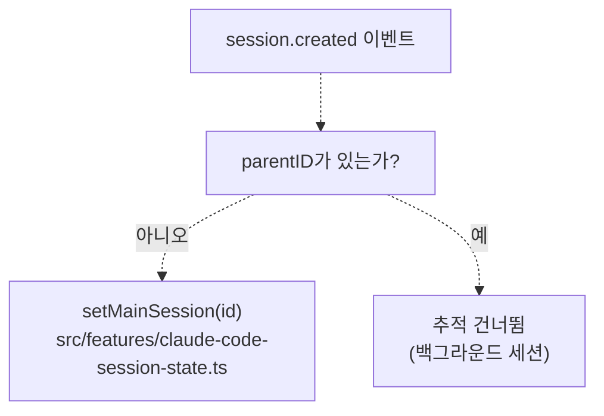

**코드 구현:**

[src/index.ts L499-L506](https://github.com/code-yeongyu/oh-my-opencode/blob/b92cd6ab/src/index.ts#L499-L506)에서 `session.created` 이벤트를 처리합니다.

```typescript
if (event.type === "session.created") {
  const sessionInfo = props?.info as
    | { id?: string; title?: string; parentID?: string }
    | undefined;
  if (!sessionInfo?.parentID) {
    setMainSession(sessionInfo?.id);
  }
}
```

### 세션 삭제

[src/index.ts L508-L513](https://github.com/code-yeongyu/oh-my-opencode/blob/b92cd6ab/src/index.ts#L508-L513)에서 `session.deleted` 이벤트를 처리하여 메인 세션 추적 정보를 정리합니다.

```typescript
if (event.type === "session.deleted") {
  const sessionInfo = props?.info as { id?: string } | undefined;
  if (sessionInfo?.id === getMainSessionID()) {
    setMainSession(undefined);
  }
}
```

### 세션 오류 복구

세션 오류는 여러 컴포넌트 간의 조율을 통해 정교한 복구 메커니즘을 트리거합니다.

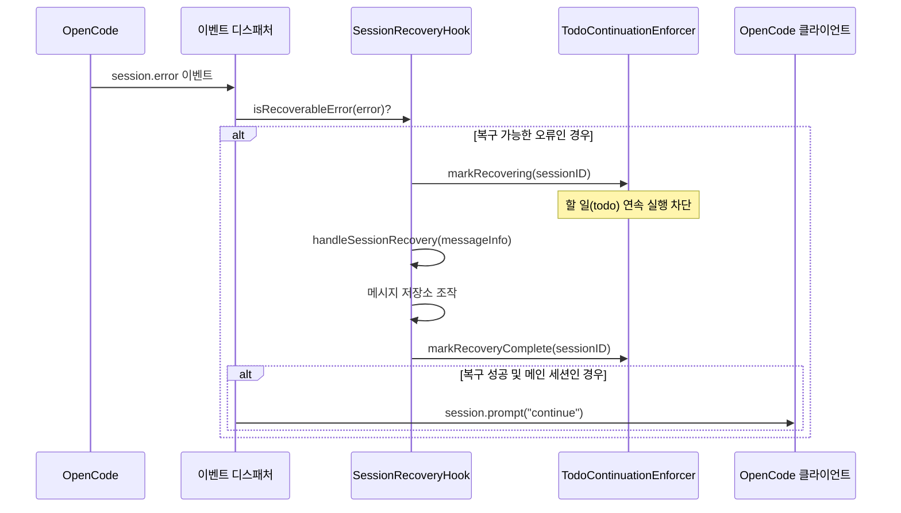

**코드 구현:**

[src/index.ts L515-L539](https://github.com/code-yeongyu/oh-my-opencode/blob/b92cd6ab/src/index.ts#L515-L539)에서 세션 오류 핸들러를 구현합니다.

```typescript
if (event.type === "session.error") {
  const sessionID = props?.sessionID as string | undefined;
  const error = props?.error;

  if (sessionRecovery?.isRecoverableError(error)) {
    const messageInfo = {
      id: props?.messageID as string | undefined,
      role: "assistant" as const,
      sessionID,
      error,
    };
    const recovered =
      await sessionRecovery.handleSessionRecovery(messageInfo);

    if (recovered && sessionID && sessionID === getMainSessionID()) {
      await ctx.client.session
        .prompt({
          path: { id: sessionID },
          body: { parts: [{ type: "text", text: "continue" }] },
          query: { directory: ctx.directory },
        })
        .catch(() => {});
    }
  }
}
```

**복구와 연속 실행 간의 조율:**

[src/index.ts L244-L248](https://github.com/code-yeongyu/oh-my-opencode/blob/b92cd6ab/src/index.ts#L244-L248)에서 상태 조율을 위한 콜백을 연결합니다.

```
if (sessionRecovery && todoContinuationEnforcer) {
  sessionRecovery.setOnAbortCallback(todoContinuationEnforcer.markRecovering);
  sessionRecovery.setOnRecoveryCompleteCallback(todoContinuationEnforcer.markRecoveryComplete);
}
```

**출처:** [src/index.ts L244-L248](https://github.com/code-yeongyu/oh-my-opencode/blob/b92cd6ab/src/index.ts#L244-L248)

 [src/index.ts L515-L539](https://github.com/code-yeongyu/oh-my-opencode/blob/b92cd6ab/src/index.ts#L515-L539)

---

## 도구 실행 이벤트

도구 실행 이벤트는 도구 실행 전후에 도구 호출을 가로채고 향상시킬 수 있게 합니다.

### 도구 실행 이벤트 흐름

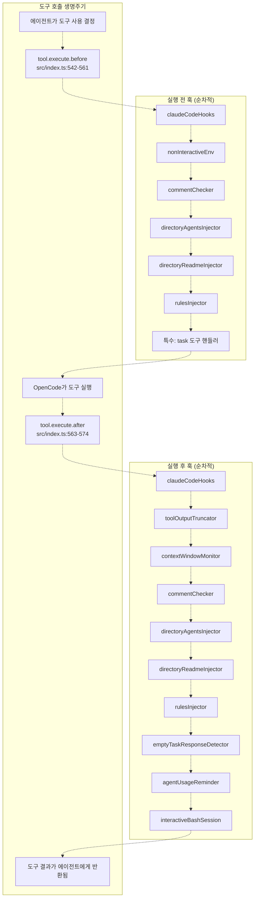

### 실행 전 (Before Execution)

`tool.execute.before` 핸들러는 `input`과 `output` 파라미터를 받으며, 훅은 실행 전에 도구 인자(arguments)를 수정할 수 있습니다.

```typescript
"tool.execute.before": async (input, output) => {
  await claudeCodeHooks["tool.execute.before"]?.(input, output);
  await nonInteractiveEnv?.["tool.execute.before"]?.(input, output);
  await commentChecker?.["tool.execute.before"]?.(input, output);
  await directoryAgentsInjector?.["tool.execute.before"]?.(input, output);
  await directoryReadmeInjector?.["tool.execute.before"]?.(input, output);
  await rulesInjector?.["tool.execute.before"]?.(input, output);

  // task 도구에 대한 특수 처리
  if (input.tool === "task") {
    const args = output.args as Record<string, unknown>;
    const subagentType = args.subagent_type as string;
    const isExploreOrLibrarian = ["explore", "librarian"].includes(subagentType);

    args.tools = {
      ...(args.tools as Record<string, boolean> | undefined),
      background_task: false,
      ...(isExploreOrLibrarian ? { call_omo_agent: false } : {}),
    };
  }
}
```

**Task 도구 필터링:**

[src/index.ts L550-L560](https://github.com/code-yeongyu/oh-my-opencode/blob/b92cd6ab/src/index.ts#L550-L560)은 서브에이전트가 사용할 수 있는 도구를 제한하는 특수 로직을 구현합니다.

* 모든 서브에이전트는 `background_task`가 비활성화됩니다 (재귀적 백그라운드 작업 방지).
* `explore` 및 `librarian` 에이전트는 `call_omo_agent`가 비활성화됩니다 (위임 루프 방지).

### 실행 후 (After Execution)

`tool.execute.after` 핸들러는 도구 결과를 처리하여 텍스트 자르기(truncation), 검증 및 모니터링을 가능하게 합니다.

```javascript
"tool.execute.after": async (input, output) => {
  await claudeCodeHooks["tool.execute.after"]?.(input, output);
  await toolOutputTruncator?.["tool.execute.after"]?.(input, output);
  await contextWindowMonitor?.["tool.execute.after"]?.(input, output);
  await commentChecker?.["tool.execute.after"]?.(input, output);
  await directoryAgentsInjector?.["tool.execute.after"]?.(input, output);
  await directoryReadmeInjector?.["tool.execute.after"]?.(input, output);
  await rulesInjector?.["tool.execute.after"]?.(input, output);
  await emptyTaskResponseDetector?.["tool.execute.after"]?.(input, output);
  await agentUsageReminder?.["tool.execute.after"]?.(input, output);
  await interactiveBashSession?.["tool.execute.after"]?.(input, output);
}
```

**출처:** [src/index.ts L542-L574](https://github.com/code-yeongyu/oh-my-opencode/blob/b92cd6ab/src/index.ts#L542-L574)

---

## 메시지 이벤트

메시지 이벤트는 채팅 메시지가 LLM에 도달하기 전에 가로채고 변환할 수 있게 합니다.

### 채팅 메시지 이벤트

`chat.message` 핸들러는 사용자 메시지가 도착하는 즉시 처리합니다.

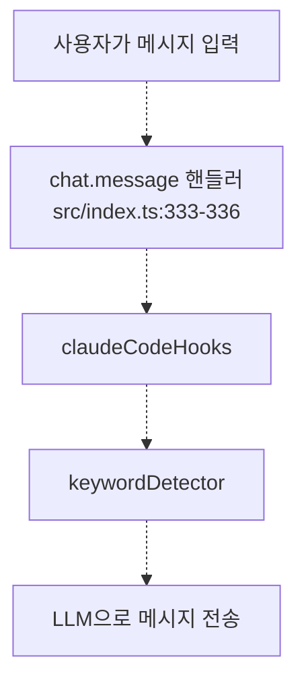

[src/index.ts L333-L336](https://github.com/code-yeongyu/oh-my-opencode/blob/b92cd6ab/src/index.ts#L333-L336)에서 핸들러를 구현합니다.

```javascript
"chat.message": async (input, output) => {
  await claudeCodeHooks["chat.message"]?.(input, output);
  await keywordDetector?.["chat.message"]?.(input, output);
}
```

**키워드 감지 유스케이스:**

`keywordDetector` 훅은 사용자 메시지에서 "ultrawork", "search", "analyze"와 같은 특수 키워드를 스캔하여 다른 에이전트 모드나 동작을 활성화합니다.

### 실험적 메시지 변환 (Experimental Message Transform)

`experimental.chat.messages.transform` 핸들러는 메시지 배열 전체가 LLM으로 전송되기 전에 작동합니다.

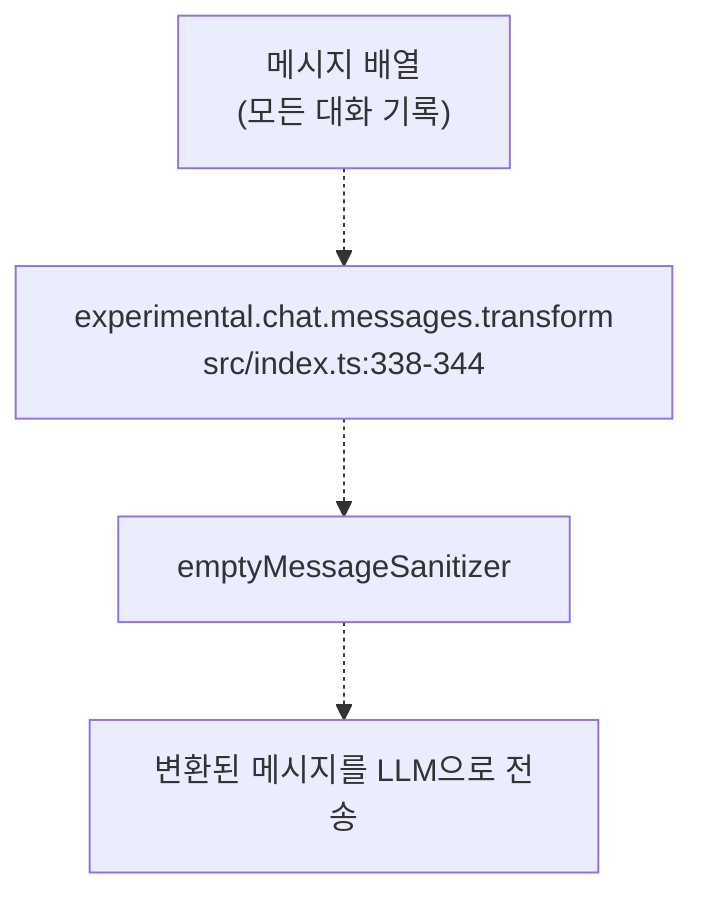

[src/index.ts L338-L344](https://github.com/code-yeongyu/oh-my-opencode/blob/b92cd6ab/src/index.ts#L338-L344)에서 구현 내용을 보여줍니다.

```javascript
"experimental.chat.messages.transform": async (
  input: Record<string, never>,
  output: { messages: Array<{ info: unknown; parts: unknown[] }> }
) => {
  await emptyMessageSanitizer?.["experimental.chat.messages.transform"]?.(input, output as any);
}
```

**빈 메시지 새니타이저 (Empty Message Sanitizer):**

이 훅은 잘못된 형식의 메시지로 인해 발생하는 LLM 오류를 방지하기 위해 `parts` 배열이 비어 있는 메시지를 제거합니다.

**출처:** [src/index.ts L333-L344](https://github.com/code-yeongyu/oh-my-opencode/blob/b92cd6ab/src/index.ts#L333-L344)

---

## 이벤트 흐름 예시

### 예시 1: 출력이 잘리는 도구 실행 (Truncation)

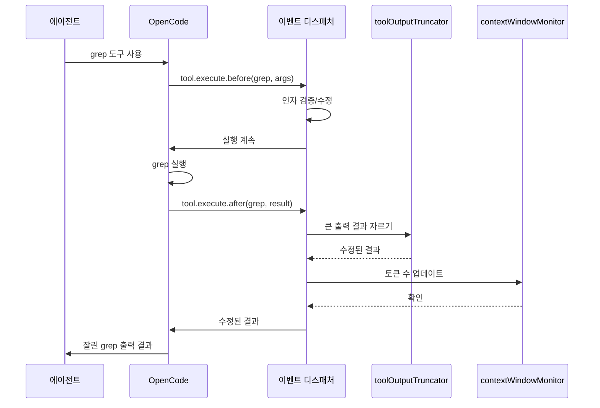

### 예시 2: 세션 오류 복구

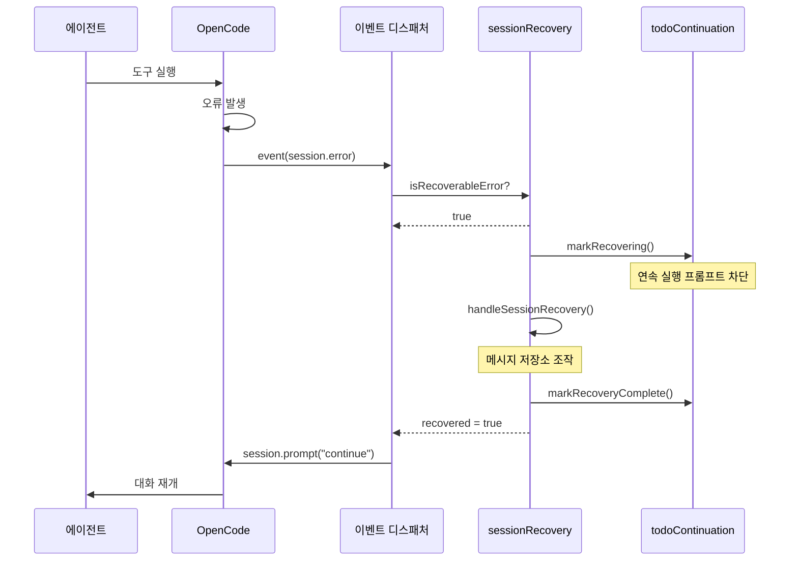

**출처:** [src/index.ts L515-L539](https://github.com/code-yeongyu/oh-my-opencode/blob/b92cd6ab/src/index.ts#L515-L539)

 [src/index.ts L542-L574](https://github.com/code-yeongyu/oh-my-opencode/blob/b92cd6ab/src/index.ts#L542-L574)

---

## 이벤트 핸들러 초기화

이벤트 핸들러는 플러그인 설정 중에 초기화되며, 설정에 따라 훅이 인스턴스화됩니다.

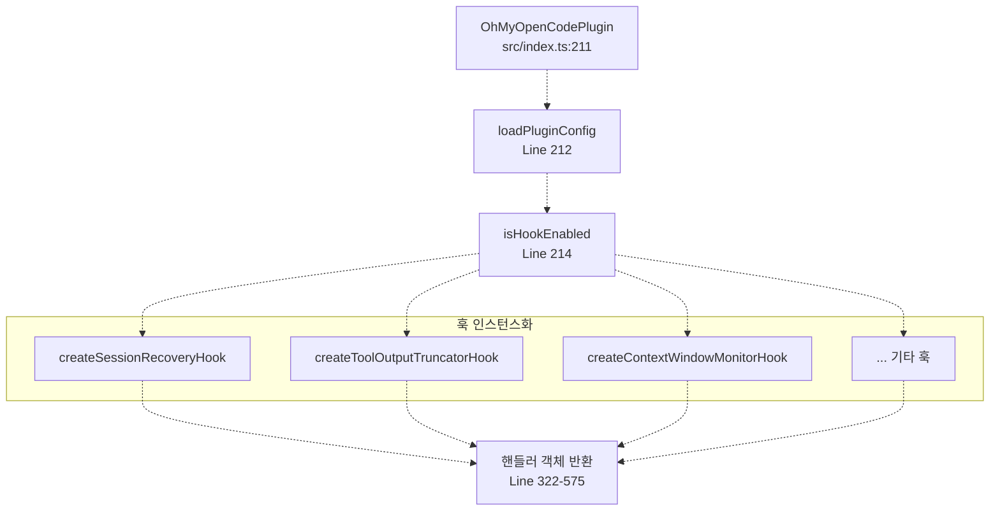

**훅 인스턴스화 패턴:**

각 훅은 설정에서 활성화되었는지 여부에 따라 조건부로 생성됩니다.

```javascript
const sessionRecovery = isHookEnabled("session-recovery")
  ? createSessionRecoveryHook(ctx, { experimental: pluginConfig.experimental })
  : null;
```

훅이 비활성화된 경우 `null`로 설정되며, 이벤트 디스패처는 옵셔널 체이닝(`?.`)을 사용하여 이를 건너뜁니다.

**출처:** [src/index.ts L211-L304](https://github.com/code-yeongyu/oh-my-opencode/blob/b92cd6ab/src/index.ts#L211-L304)

 [src/index.ts L322-L575](https://github.com/code-yeongyu/oh-my-opencode/blob/b92cd6ab/src/index.ts#L322-L575)

---

## 설정 핸들러 (Configuration Handler)

엄밀히 말해 "이벤트"는 아니지만, `config` 핸들러는 세션 시작 전 OpenCode의 설정을 마무리하는 특수한 초기화 훅입니다.

### 설정 핸들러의 책임

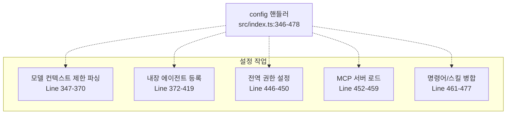

**모델 컨텍스트 제한 캐싱:**

[src/index.ts L356-L370](https://github.com/code-yeongyu/oh-my-opencode/blob/b92cd6ab/src/index.ts#L356-L370)은 프로바이더(Provider) 설정에서 컨텍스트 제한을 추출하고, 이를 압축(Compaction) 훅에서 사용할 수 있도록 캐싱합니다.

```javascript
if (providers) {
  for (const [providerID, providerConfig] of Object.entries(providers)) {
    const models = providerConfig?.models;
    if (models) {
      for (const [modelID, modelConfig] of Object.entries(models)) {
        const contextLimit = modelConfig?.limit?.context;
        if (contextLimit) {
          modelContextLimitsCache.set(`${providerID}/${modelID}`, contextLimit);
        }
      }
    }
  }
}
```

**에이전트 등록:**

[src/index.ts L372-L419](https://github.com/code-yeongyu/oh-my-opencode/blob/b92cd6ab/src/index.ts#L372-L419)은 Sisyphus 활성화 여부에 따라 에이전트를 조건부로 등록하며, Sisyphus가 활성화된 경우 `build` 및 `plan` 에이전트를 서브에이전트 모드로 강등시킵니다.

**출처:** [src/index.ts L346-L478](https://github.com/code-yeongyu/oh-my-opencode/blob/b92cd6ab/src/index.ts#L346-L478)

---

## 요약

oh-my-opencode의 이벤트 처리 시스템은 OpenCode의 동작을 가로채고 향상시키기 위한 견고한 기반을 제공합니다.

| 이벤트 핸들러 | 주요 목적 | 디스패치 패턴 | 훅 개수 |
| --- | --- | --- | --- |
| `event` | 세션 생명주기 관리 | 순차적 await | 14개 훅 |
| `tool.execute.before` | 실행 전 검증 및 인자 수정 | 순차적 await | 7개 훅 |
| `tool.execute.after` | 실행 후 기능 강화 및 모니터링 | 순차적 await | 10개 훅 |
| `chat.message` | 사용자 메시지 가로채기 | 순차적 await | 2개 훅 |
| `experimental.chat.messages.transform` | 메시지 배열 새니타이제이션 | 순차적 await | 1개 훅 |
| `config` | 설정 마무리 | 동기 방식 | 해당 없음 |

**주요 디자인 패턴:**

1. **순차적 디스패치 (Sequential Dispatch):** 모든 훅은 `await`와 함께 순차적으로 호출되어 예측 가능한 실행 순서를 보장합니다.
2. **옵셔널 체이닝 (Optional Chaining):** 비활성화된 훅은 `null`이며, 디스패처는 `?.`를 사용하여 이를 건너뜁니다.
3. **설정 기반 (Configuration-Driven):** 훅의 활성화 여부는 `disabled_hooks` 설정 배열을 통해 제어됩니다.
4. **조율 (Coordination):** 관련 있는 훅들은 상태를 공유합니다 (예: 세션 복구와 할 일 연속 실행).
5. **유형별 처리 (Type-Specific Handling):** 이벤트 디스패처는 특정 이벤트 유형(예: `session.error`)에 대한 특수 로직을 포함합니다.

**출처:** [src/index.ts L211-L576](https://github.com/code-yeongyu/oh-my-opencode/blob/b92cd6ab/src/index.ts#L211-L576)

 [src/config/schema.ts L44-L66](https://github.com/code-yeongyu/oh-my-opencode/blob/b92cd6ab/src/config/schema.ts#L44-L66)