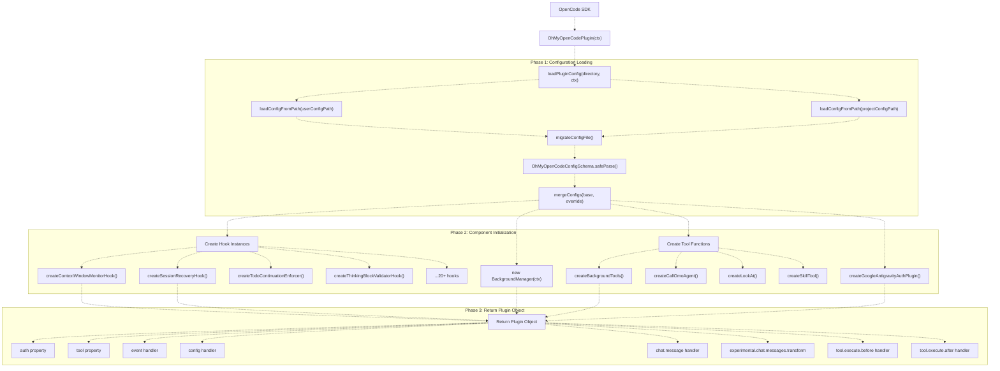
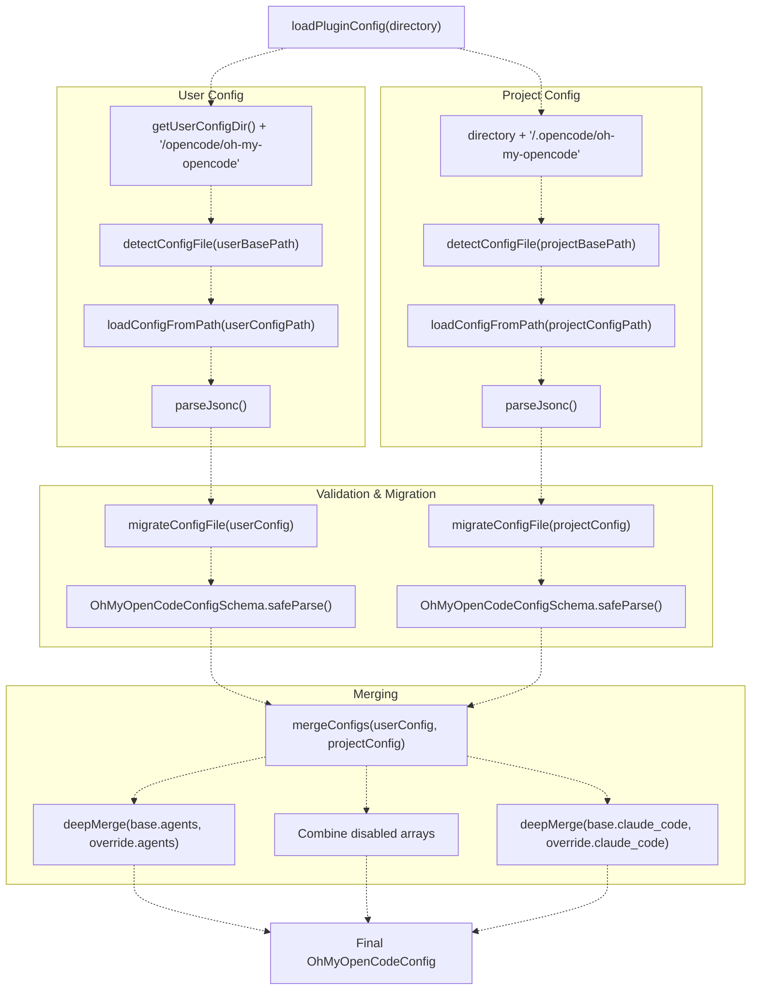
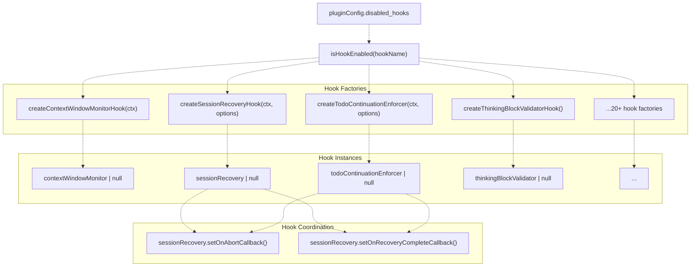
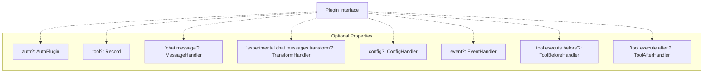
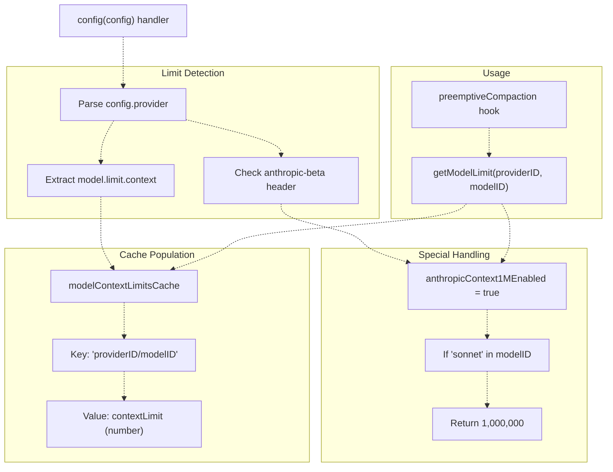

# 플러그인 생명주기 (Plugin Lifecycle)

> **관련 소스 파일**
> * [assets/oh-my-opencode.schema.json](https://github.com/code-yeongyu/oh-my-opencode/blob/b92cd6ab/assets/oh-my-opencode.schema.json)
> * [src/config/schema.ts](https://github.com/code-yeongyu/oh-my-opencode/blob/b92cd6ab/src/config/schema.ts)
> * [src/hooks/index.ts](https://github.com/code-yeongyu/oh-my-opencode/blob/b92cd6ab/src/hooks/index.ts)
> * [src/index.ts](https://github.com/code-yeongyu/oh-my-opencode/blob/b92cd6ab/src/index.ts)

이 문서는 OpenCode의 플러그인 API와 통합되는 `OhMyOpenCodePlugin`의 초기화(initialization), 컴포넌트 등록(component registration) 및 런타임(runtime) 동작에 대해 자세히 설명합니다. 여기에는 설정 로딩, 컴포넌트 인스턴스화, 훅(hook) 등록 및 이벤트 디스패칭(event dispatching, 이벤트 전달) 메커니즘이 포함됩니다.

설정 시스템의 스키마 및 병합 로직에 대한 정보는 [설정 시스템 (Configuration System)](/code-yeongyu/oh-my-opencode/3.2-configuration-system)을 참조하십시오. 이벤트가 훅으로 라우팅되는 방식에 대한 자세한 내용은 [이벤트 처리 (Event Handling)](/code-yeongyu/oh-my-opencode/3.3-event-handling)를 참조하십시오.

---

## 개요 (Overview)

`OhMyOpenCodePlugin`은 oh-my-opencode 시스템의 주요 진입점(entry point)입니다. 이는 `@opencode-ai/plugin`의 OpenCode `Plugin` 인터페이스를 준수하는 비동기 함수입니다. 플러그인 생명주기는 다음과 같은 세 가지 고유한 단계로 구성됩니다.

1. **초기화 단계 (Initialization Phase)**: 설정 파일을 로드 및 병합하고, 훅 인스턴스를 초기화하며, 도구(tools)를 준비합니다.
2. **컴포넌트 등록 단계 (Component Registration Phase)**: 에이전트(agents), 도구, 명령(commands), 스킬(skills) 및 MCP를 OpenCode에 등록합니다.
3. **런타임 단계 (Runtime Phase)**: 세션 활동에 대응하여 이벤트를 처리하고 훅을 실행합니다.

**소스:** [src/index.ts L219](https://github.com/code-yeongyu/oh-my-opencode/blob/b92cd6ab/src/index.ts#L219-L219)

---

## 초기화 흐름 (Initialization Flow)

다음 다이어그램은 OpenCode가 플러그인을 로드할 때의 전체 초기화 시퀀스를 보여줍니다.

### 플러그인 초기화 시퀀스 (Plugin Initialization Sequence)



**소스:** [src/index.ts L219-L654](https://github.com/code-yeongyu/oh-my-opencode/blob/b92cd6ab/src/index.ts#L219-L654)

---

## 설정 로딩 및 마이그레이션 (Configuration Loading and Migration)

플러그인은 계층적 방식으로 다음 두 위치에서 설정을 로드합니다.

| 우선순위 | 위치 | 형식 | 용도 |
| --- | --- | --- | --- |
| 1 (기본) | `~/.config/opencode/oh-my-opencode.json(c)` | JSONC | 사용자 수준 기본값 |
| 2 (재정의) | `.opencode/oh-my-opencode.json(c)` | JSONC | 프로젝트별 재정의 |

### 설정 로딩 프로세스 (Configuration Loading Process)



`detectConfigFile()` 함수는 `.json` 확장자보다 `.jsonc`를 우선적으로 선택합니다. `parseJsonc()` 유틸리티는 파싱 전에 주석을 제거하여 설정 파일에 문서를 포함할 수 있도록 합니다.

**소스:** [src/index.ts L189-L217](https://github.com/code-yeongyu/oh-my-opencode/blob/b92cd6ab/src/index.ts#L189-L217)

 [src/index.ts L125-L151](https://github.com/code-yeongyu/oh-my-opencode/blob/b92cd6ab/src/index.ts#L125-L151)

 [src/index.ts L153-L187](https://github.com/code-yeongyu/oh-my-opencode/blob/b92cd6ab/src/index.ts#L153-L187)

### 설정 마이그레이션 (Configuration Migration)

플러그인은 하위 호환성(backward compatibility)을 유지하기 위해 레거시(legacy) 설정 키를 자동으로 마이그레이션합니다.

| 레거시 키 | 새 키 | 참고 사항 |
| --- | --- | --- |
| `omo` | `Sisyphus` | 에이전트 이름 마이그레이션 |
| `OmO` | `Sisyphus` | 에이전트 이름 마이그레이션 |
| `OmO-Plan` | `Planner-Sisyphus` | 에이전트 이름 마이그레이션 |
| `omo_agent` | `sisyphus_agent` | 최상위 설정 키 |

`AGENT_NAME_MAP` 상수는 지원되는 모든 마이그레이션을 정의합니다. `migrateAgentNames()` 함수는 이러한 변환을 `agents` 설정 객체에 재귀적으로 적용합니다. 마이그레이션이 적용되면 설정 파일이 디스크에 자동으로 다시 작성됩니다.

**소스:** [src/index.ts L62-L94](https://github.com/code-yeongyu/oh-my-opencode/blob/b92cd6ab/src/index.ts#L62-L94)

 [src/index.ts L96-L123](https://github.com/code-yeongyu/oh-my-opencode/blob/b92cd6ab/src/index.ts#L96-L123)

---

## 훅 초기화 (Hook Initialization)

훅은 설정의 `disabled_hooks` 배열을 기반으로 초기화됩니다. 각 훅 팩토리(factory) 함수는 훅 객체 또는 `null`을 반환합니다.

### 훅 생성 패턴 (Hook Creation Pattern)



이 단계에서 초기화되는 주요 훅은 다음과 같습니다.

| 훅 이름 | 팩토리 함수 | 설정 의존성 |
| --- | --- | --- |
| `context-window-monitor` | `createContextWindowMonitorHook()` | 없음 |
| `session-recovery` | `createSessionRecoveryHook()` | `experimental` |
| `todo-continuation-enforcer` | `createTodoContinuationEnforcer()` | `backgroundManager` |
| `thinking-block-validator` | `createThinkingBlockValidatorHook()` | 없음 |
| `empty-message-sanitizer` | `createEmptyMessageSanitizerHook()` | 없음 |
| `tool-output-truncator` | `createToolOutputTruncatorHook()` | `experimental` |
| `preemptive-compaction` | `createPreemptiveCompactionHook()` | `experimental`, `getModelLimit` |

특정 훅은 상호 조정이 필요합니다. 예를 들어, `sessionRecovery`는 복구 상태를 조정하기 위해 `todoContinuationEnforcer`에 콜백을 등록합니다.

```
if (sessionRecovery && todoContinuationEnforcer) {
  sessionRecovery.setOnAbortCallback(todoContinuationEnforcer.markRecovering);
  sessionRecovery.setOnRecoveryCompleteCallback(todoContinuationEnforcer.markRecoveryComplete);
}
```

**소스:** [src/index.ts L221-L305](https://github.com/code-yeongyu/oh-my-opencode/blob/b92cd6ab/src/index.ts#L221-L305)

 [src/index.ts L309-L316](https://github.com/code-yeongyu/oh-my-opencode/blob/b92cd6ab/src/index.ts#L309-L316)

 [src/hooks/index.ts L1-L25](https://github.com/code-yeongyu/oh-my-opencode/blob/b92cd6ab/src/hooks/index.ts#L1-L25)

---

## 컴포넌트 등록 (Component Registration)

플러그인의 `config` 핸들러는 에이전트, 도구, 명령, 스킬 및 MCP를 등록하기 위해 OpenCode에 의해 호출됩니다. 이는 초기화 이후, 사용자 상호작용이 발생하기 전에 수행됩니다.

### 컴포넌트 등록 흐름 (Component Registration Flow)

```mermaid
flowchart TD

ConfigHandler["config(config) handler"]
LoadPlugins["loadAllPluginComponents()"]
LoadMcps["loadMcpConfigs()"]
LoadUserAgents["loadUserAgents()"]
LoadProjectAgents["loadProjectAgents()"]
LoadCommands["loadUserCommands() + loadProjectCommands()"]
LoadSkills["loadUserSkills() + loadProjectSkills()"]
CreateBuiltinAgents["createBuiltinAgents(disabled, overrides, directory, model)"]
CreateBuiltinMcps["createBuiltinMcps(disabled)"]
LoadBuiltinCommands["loadBuiltinCommands(disabled)"]
CheckSisyphus["isSisyphusEnabled?"]
SetDefault["config.default_agent = 'Sisyphus'"]
BuilderConfig["Configure OpenCode-Builder"]
PlannerConfig["Configure Planner-Sisyphus"]
FilterAgents["Filter build/plan from config.agent"]
ExploreTools["explore.tools.call_omo_agent = false"]
LibrarianTools["librarian.tools.call_omo_agent = false"]
MultimodalTools["multimodal-looker.tools = {...}"]
TaskRestriction["task subagent restrictions"]
MergeAgents["Merge all agents into config.agent"]
MergeCommands["Merge all commands into config.command"]
MergeMcps["Merge all MCPs into config.mcp"]
SetPermissions["config.permission.webfetch = 'allow'"]

ConfigHandler -.-> LoadPlugins
ConfigHandler -.-> LoadMcps
ConfigHandler -.->|"Yes"| LoadUserAgents
ConfigHandler -.-> LoadProjectAgents
ConfigHandler -.-> LoadCommands
ConfigHandler -.-> LoadSkills
ConfigHandler -.-> CreateBuiltinAgents
ConfigHandler -.-> CreateBuiltinMcps
ConfigHandler -.-> LoadBuiltinCommands
CreateBuiltinAgents -.-> CheckSisyphus
CheckSisyphus -.-> ExploreTools
CheckSisyphus -.-> LibrarianTools
CheckSisyphus -.-> MultimodalTools
CheckSisyphus -.-> TaskRestriction
FilterAgents -.-> MergeAgents
LoadUserAgents -.-> MergeAgents
LoadProjectAgents -.-> MergeAgents
LoadPlugins -.-> MergeAgents
LoadBuiltinCommands -.-> MergeCommands
LoadCommands -.-> MergeCommands
LoadSkills -.-> MergeCommands
LoadPlugins -.-> MergeCommands
CreateBuiltinMcps -.-> MergeMcps
LoadMcps -.-> MergeMcps
LoadPlugins -.-> MergeMcps

subgraph subGraph4 ["Final Registration"]
    MergeAgents
    MergeCommands
    MergeMcps
    SetPermissions
    MergeAgents -.-> SetPermissions
    MergeCommands -.-> SetPermissions
    MergeMcps -.-> SetPermissions
end

subgraph subGraph3 ["Tool Access Control"]
    ExploreTools
    LibrarianTools
    MultimodalTools
    TaskRestriction
end

subgraph subGraph2 ["Agent Configuration"]
    CheckSisyphus
    SetDefault
    BuilderConfig
    PlannerConfig
    FilterAgents
    CheckSisyphus -.-> SetDefault
    SetDefault -.-> BuilderConfig
    SetDefault -.-> PlannerConfig
    SetDefault -.-> FilterAgents
end

subgraph subGraph1 ["Built-in Component Creation"]
    CreateBuiltinAgents
    CreateBuiltinMcps
    LoadBuiltinCommands
end

subgraph subGraph0 ["External Component Loading"]
    LoadPlugins
    LoadMcps
    LoadUserAgents
    LoadProjectAgents
    LoadCommands
    LoadSkills
end
```



### 에이전트 등록 우선순위 (Agent Registration Priority)

에이전트는 다음 우선순위에 따라 병합됩니다 (나중에 나오는 항목이 이전 항목을 재정의함).

1. 내장 에이전트 (Sisyphus, oracle, librarian, explore, frontend, docwriter, multimodal)
2. `~/.claude/agents/`의 사용자 에이전트
3. `./.claude/agents/`의 프로젝트 에이전트
4. Claude Code 플러그인의 플러그인 에이전트
5. `opencode.json`의 OpenCode 설정 에이전트

Sisyphus가 활성화되면 플러그인은 다음과 같은 특수 처리를 수행합니다.

* `config.default_agent = "Sisyphus"` 설정 (OpenCode PR #5843 필요)
* 선택적으로 `OpenCode-Builder` 추가 (OpenCode의 build 에이전트를 래핑)
* 선택적으로 `Planner-Sisyphus` 추가 (사용자 정의 프롬프트로 OpenCode의 plan 에이전트를 래핑)
* 기본 에이전트에서 `build` 및 선택적으로 `plan`을 필터링하여 서브에이전트(subagent) 모드로 강등

**소스:** [src/index.ts L362-L556](https://github.com/code-yeongyu/oh-my-opencode/blob/b92cd6ab/src/index.ts#L362-L556)

 [src/index.ts L404-L486](https://github.com/code-yeongyu/oh-my-opencode/blob/b92cd6ab/src/index.ts#L404-L486)

### 도구 등록 (Tool Registration)

플러그인은 반환된 플러그인 객체의 `tool` 속성에 도구를 등록합니다.

```yaml
return {
  tool: {
    ...builtinTools,              // LSP, AST-Grep, 세션 도구
    ...backgroundTools,           // background_task, background_output, background_cancel
    call_omo_agent: callOmoAgent, // 에이전트 위임 도구
    look_at: lookAt,              // 멀티모달 분석
    skill: skillTool,             // 스킬 실행
    ...(tmuxAvailable ? { interactive_bash } : {}), // 조건부 추가
  },
  // ...
}
```

`interactive_bash` 도구는 `getTmuxPath()`를 통해 시스템에서 tmux가 감지된 경우에만 등록됩니다.

**소스:** [src/index.ts L335-L345](https://github.com/code-yeongyu/oh-my-opencode/blob/b92cd6ab/src/index.ts#L335-L345)

 [src/index.ts L321-L327](https://github.com/code-yeongyu/oh-my-opencode/blob/b92cd6ab/src/index.ts#L321-L327)

### 도구 액세스 제한 (Tool Access Restrictions)

플러그인은 특정 에이전트에 대해 도구 액세스 제한을 강제합니다.

| 에이전트 | 제한된 도구 | 이유 |
| --- | --- | --- |
| `explore` | `call_omo_agent: false` | 재귀적 에이전트 생성 방지 |
| `librarian` | `call_omo_agent: false` | 재귀적 에이전트 생성 방지 |
| `multimodal-looker` | `task: false`, `call_omo_agent: false`, `look_at: false` | 재귀 호출 및 자기 위임 방지 |
| Task 서브에이전트 (explore/librarian) | `background_task: false`, `call_omo_agent: false` | 중첩된 백그라운드 작업 방지 |

이러한 제한은 `config` 핸들러와 `tool.execute.before` 훅에서 적용됩니다.

**소스:** [src/index.ts L492-L511](https://github.com/code-yeongyu/oh-my-opencode/blob/b92cd6ab/src/index.ts#L492-L511)

 [src/index.ts L620-L639](https://github.com/code-yeongyu/oh-my-opencode/blob/b92cd6ab/src/index.ts#L620-L639)

---

## 이벤트 처리 (Event Handling)

플러그인은 세션 생명주기의 여러 시점에서 OpenCode에 의해 호출되는 여러 이벤트 핸들러를 등록합니다.

### 이벤트 핸들러 등록 맵 (Event Handler Registration Map)

```mermaid
flowchart TD

ChatMessage["chat.message"]
TransformMessages["experimental.chat.messages.transform"]
ConfigEvent["config"]
EventStream["event"]
ToolBefore["tool.execute.before"]
ToolAfter["tool.execute.after"]
ChatHandler["claudeCodeHooks + keywordDetector"]
TransformHandler["thinkingBlockValidator + emptyMessageSanitizer"]
ConfigHandler["Component registration logic"]
EventHandler["Multiple hooks"]
Event1["autoUpdateChecker"]
Event2["claudeCodeHooks"]
Event3["backgroundNotificationHook"]
Event4["sessionNotification"]
Event5["todoContinuationEnforcer"]
Event6["contextWindowMonitor"]
Event7["directoryAgentsInjector"]
Event8["directoryReadmeInjector"]
Event9["rulesInjector"]
Event10["thinkMode"]
Event11["anthropicContextWindowLimitRecovery"]
Event12["preemptiveCompaction"]
Event13["agentUsageReminder"]
Event14["interactiveBashSession"]
EventN["..."]
BeforeHandler["Multiple hooks"]
Before1["claudeCodeHooks"]
Before2["nonInteractiveEnv"]
Before3["commentChecker"]
Before4["directoryAgentsInjector"]
Before5["directoryReadmeInjector"]
Before6["rulesInjector"]
Before7["Task tool restrictions"]
AfterHandler["Multiple hooks"]
After1["claudeCodeHooks"]
After2["toolOutputTruncator"]
After3["contextWindowMonitor"]
After4["commentChecker"]
After5["directoryAgentsInjector"]
After6["directoryReadmeInjector"]
After7["rulesInjector"]
After8["emptyTaskResponseDetector"]
After9["agentUsageReminder"]
After10["interactiveBashSession"]

ChatMessage -.-> ChatHandler
TransformMessages -.-> TransformHandler
ConfigEvent -.-> ConfigHandler
EventStream -.-> EventHandler
ToolBefore -.-> BeforeHandler
ToolAfter -.-> AfterHandler

subgraph subGraph1 ["Hook Dispatch"]
    ChatHandler
    TransformHandler
    ConfigHandler
    EventHandler
    Event1
    Event2
    Event3
    Event4
    Event5
    Event6
    Event7
    Event8
    Event9
    Event10
    Event11
    Event12
    Event13
    Event14
    EventN
    BeforeHandler
    Before1
    Before2
    Before3
    Before4
    Before5
    Before6
    Before7
    AfterHandler
    After1
    After2
    After3
    After4
    After5
    After6
    After7
    After8
    After9
    After10
    EventHandler -.-> Event1
    EventHandler -.-> Event2
    EventHandler -.-> Event3
    EventHandler -.-> Event4
    EventHandler -.-> Event5
    EventHandler -.-> Event6
    EventHandler -.-> Event7
    EventHandler -.-> Event8
    EventHandler -.-> Event9
    EventHandler -.-> Event10
    EventHandler -.-> Event11
    EventHandler -.-> Event12
    EventHandler -.-> Event13
    EventHandler -.-> Event14
    EventHandler -.-> EventN
    BeforeHandler -.-> Before1
    BeforeHandler -.-> Before2
    BeforeHandler -.-> Before3
    BeforeHandler -.-> Before4
    BeforeHandler -.-> Before5
    BeforeHandler -.-> Before6
    BeforeHandler -.-> Before7
    AfterHandler -.-> After1
    AfterHandler -.-> After2
    AfterHandler -.-> After3
    AfterHandler -.-> After4
    AfterHandler -.-> After5
    AfterHandler -.-> After6
    AfterHandler -.-> After7
    AfterHandler -.-> After8
    AfterHandler -.-> After9
    AfterHandler -.-> After10
end

subgraph subGraph0 ["OpenCode Event Types"]
    ChatMessage
    TransformMessages
    ConfigEvent
    EventStream
    ToolBefore
    ToolAfter
end
```



**소스:** [src/index.ts L347-L653](https://github.com/code-yeongyu/oh-my-opencode/blob/b92cd6ab/src/index.ts#L347-L653)

### 이벤트 핸들러 유형 (Event Handler Types)

플러그인은 다음과 같은 OpenCode 이벤트 핸들러를 구현합니다.

| 핸들러 | 용도 | 훅 호출 |
| --- | --- | --- |
| `chat.message` | 사용자 메시지 가로채기 | `claudeCodeHooks`, `keywordDetector` |
| `experimental.chat.messages.transform` | API 호출 전 메시지 변환 | `thinkingBlockValidator`, `emptyMessageSanitizer` |
| `config` | 에이전트, 도구, 명령, MCP 등록 | 해당 없음 (등록 로직) |
| `event` | 세션 생명주기 이벤트 처리 | 14개 이상의 훅 (아래 참조) |
| `tool.execute.before` | 실행 전 도구 인자 수정 | 7개의 훅 |
| `tool.execute.after` | 실행 후 도구 출력 처리 | 10개의 훅 |

### 이벤트 스트림 처리 (Event Stream Processing)

`event` 핸들러는 이벤트를 여러 훅에 순차적으로 디스패치합니다. 처리되는 주요 이벤트 유형은 다음과 같습니다.

#### session.created 이벤트

```typescript
if (event.type === "session.created") {
  const sessionInfo = props?.info as { id?: string; title?: string; parentID?: string } | undefined;
  if (!sessionInfo?.parentID) {
    setMainSession(sessionInfo?.id);  // 메인 세션 ID 추적
  }
}
```

이는 복구 및 연속성 로직을 위해 메인(백그라운드가 아닌) 세션을 추적합니다.

#### session.error 이벤트

```javascript
if (event.type === "session.error") {
  const sessionID = props?.sessionID as string | undefined;
  const error = props?.error;

  if (sessionRecovery?.isRecoverableError(error)) {
    const recovered = await sessionRecovery.handleSessionRecovery(messageInfo);
    
    if (recovered && sessionID === getMainSessionID()) {
      // "continue" 프롬프트로 자동 재개
      await ctx.client.session.prompt({...});
    }
  }
}
```

이를 통해 API 오류로부터 자동 세션 복구가 가능해집니다 ([세션 복구 (Session Recovery)](/code-yeongyu/oh-my-opencode/7.1-session-recovery) 참조).

**소스:** [src/index.ts L558-L618](https://github.com/code-yeongyu/oh-my-opencode/blob/b92cd6ab/src/index.ts#L558-L618)

---

## OpenCode 플러그인 API 통합 (OpenCode Plugin API Integration)

플러그인은 `@opencode-ai/plugin`의 OpenCode `Plugin` 인터페이스를 준수합니다.

### 플러그인 인터페이스 구조 (Plugin Interface Structure)



플러그인은 특정 조건부 속성을 제외한 모든 선택적 속성을 구현합니다.

1. **auth**: 설정에서 `google_auth !== false`인 경우에만 존재합니다.
2. **tool**: 항상 존재하며, 20개 이상의 도구를 포함합니다.
3. **chat.message**: 사용자 메시지를 가로챕니다.
4. **experimental.chat.messages.transform**: 메시지를 검증하고 정화(sanitize)합니다.
5. **config**: 모든 컴포넌트를 등록합니다.
6. **event**: 생명주기 이벤트를 처리합니다.
7. **tool.execute.before**: 도구 인자를 수정합니다.
8. **tool.execute.after**: 도구 출력을 처리합니다.

**소스:** [src/index.ts L335-L653](https://github.com/code-yeongyu/oh-my-opencode/blob/b92cd6ab/src/index.ts#L335-L653)

### 컨텍스트 객체 (Context Object)

플러그인은 OpenCode로부터 다음과 같은 구조의 컨텍스트 객체(`ctx`)를 받습니다.

```
type PluginContext = {
  directory: string;           // 프로젝트 루트 디렉토리
  client: OpenCodeClient;      // 세션 작업을 위한 API 클라이언트
  // ... 기타 속성
}
```

이 컨텍스트는 파일 시스템 액세스 및 세션 관리를 가능하게 하기 위해 대부분의 훅 팩토리 함수와 도구에 전달됩니다.

**소스:** [src/index.ts L219](https://github.com/code-yeongyu/oh-my-opencode/blob/b92cd6ab/src/index.ts#L219-L219)

---

## 모델 컨텍스트 제한 캐싱 (Model Context Limit Caching)

플러그인은 선제적 압축(preemptive compaction)을 지원하기 위해 모델 컨텍스트 제한의 런타임 캐시를 유지합니다.



`getModelLimit()` 함수는 다음을 확인합니다.

1. 명시적 제한에 대한 캐시
2. `context-1m` 베타 헤더가 있는 Sonnet 모델에 대한 `anthropicContext1MEnabled` 플래그
3. 제한을 찾을 수 없는 경우 `undefined` 반환

이를 통해 선제적 압축 훅은 모델의 실제 컨텍스트 창을 기반으로 정확한 임계값에서 트리거될 수 있습니다.

**소스:** [src/index.ts L224-L236](https://github.com/code-yeongyu/oh-my-opencode/blob/b92cd6ab/src/index.ts#L224-L236)

 [src/index.ts L362-L386](https://github.com/code-yeongyu/oh-my-opencode/blob/b92cd6ab/src/index.ts#L362-L386)

---

## 요약 (Summary)

`OhMyOpenCodePlugin` 생명주기는 다음과 같이 구성됩니다.

1. **설정 로딩**: 사용자 및 프로젝트 설정을 로드 및 병합하고, 마이그레이션을 적용하며, 스키마를 검증합니다.
2. **훅 초기화**: `disabled_hooks`를 기반으로 훅 인스턴스를 생성하고 훅 콜백을 조정합니다.
3. **컴포넌트 등록**: `config` 핸들러를 통해 에이전트(우선순위 적용), 도구(제한 사항 포함), 명령, 스킬 및 MCP를 등록합니다.
4. **런타임 이벤트 처리**: `chat.message`, `event`, `tool.execute.before`, `tool.execute.after` 핸들러를 통해 이벤트를 훅으로 디스패치합니다.
5. **컨텍스트 제한 추적**: 선제적 압축을 위해 모델 컨텍스트 제한을 캐싱합니다.

플러그인의 설계는 훅을 통한 모듈성, 프로젝트 재정의를 포함한 계층적 설정, 그리고 포괄적인 에이전트 오케스트레이션(orchestration) 시스템을 제공하기 위한 OpenCode 플러그인 API와의 깊은 통합을 강조합니다.

**소스:** [src/index.ts L1-L672](https://github.com/code-yeongyu/oh-my-opencode/blob/b92cd6ab/src/index.ts#L1-L672)